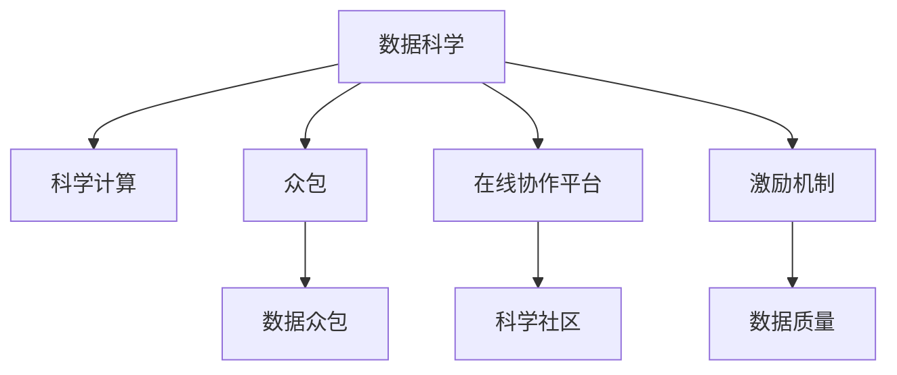

                 

# 公民科学：公众参与科学研究的新模式

> 关键词：公民科学, 数据科学, 众包, 公众参与, 科学研究, 数据众包, 科学计算, 开源社区

## 1. 背景介绍

### 1.1 问题由来

在传统科学中，研究活动通常由专门的科研机构和科学家进行，公众参与的机会非常有限。随着互联网和数字化技术的发展，这种单一的研究模式正逐步向更加开放和协作的模式转变。

近年来，随着大数据和计算能力的提升，科学家们开始探索利用公众力量进行大规模数据分析和科学实验的新模式，以解决一些复杂的科学问题。这种新的科学研究模式被称为“公民科学”。

### 1.2 问题核心关键点

公民科学的核心思想是：通过公开的数据和科学问题，吸引公众参与其中，以志愿者、在线协作、数据众包等方式，共同解决科学难题。这种模式不仅能够充分利用公众的知识和智慧，还能加速科学研究的进程，甚至在一些特定领域发现传统科学研究未能发现的规律和现象。

公民科学需要借助数据科学和计算技术的支撑，同时依赖开放、协作的科学社区环境。其主要关键点包括：

1. **数据开放与共享**：科学数据需要公开共享，以便公众能够访问和利用。
2. **在线协作平台**：需要构建一个支持公众参与的在线平台，供参与者交流和协作。
3. **数据众包与任务分包**：将复杂的科学问题分解为易于完成的小任务，通过众包平台分配给公众，以解决大规模问题。
4. **科学计算与数据处理**：利用高性能计算和数据处理技术，对公众提交的数据进行分析和验证。
5. **激励机制**：设计有效的激励机制，鼓励公众参与，确保数据的质量和完整性。

### 1.3 问题研究意义

公民科学的意义在于：

1. **加速科学发现**：通过调动公众参与，可以大幅加速科学研究的进程，特别是在处理大规模数据和复杂问题时，这种优势尤为明显。
2. **提高公众科学素养**：通过实际参与科学研究，公众能够更好地理解科学方法，提升科学素养。
3. **促进科学普及**：公民科学项目往往具有高度的趣味性和参与性，能够吸引更多公众关注科学，促进科学普及。
4. **增强科学研究的公平性**：通过公众参与，打破科学研究的壁垒，使更多人有机会贡献自己的智慧和力量，增强科学研究的公平性。

## 2. 核心概念与联系

### 2.1 核心概念概述

为了更好地理解公民科学的模式，本节将介绍几个密切相关的核心概念：

- **数据科学**：使用数据和算法解决实际问题的学科。
- **众包**：将工作分包给非专业人员的模式，常用于大规模数据处理和复杂任务。
- **科学计算**：使用计算机和算法解决科学问题，包括数据分析、模拟和可视化等。
- **在线协作平台**：支持公众参与的在线平台，如Zooniverse、Citizen Science Gateway等。
- **数据众包**：通过在线平台将科学问题分解为小任务，分配给公众完成，以解决大规模问题。
- **科学社区**：由科学爱好者和专业人士组成的社区，通常以在线论坛、社交网络等形式存在。
- **激励机制**：通过奖励和认可等方式，激励公众参与科学研究和数据收集。

这些核心概念之间的逻辑关系可以通过以下Mermaid流程图来展示：



这个流程图展示了大语言模型的核心概念及其之间的关系：

1. 数据科学和科学计算是公民科学的基础。
2. 众包和数据众包是公众参与的重要手段。
3. 在线协作平台和科学社区是支持公众参与的平台和环境。
4. 激励机制是确保数据质量和公众参与度的关键。

这些概念共同构成了公民科学的运作框架，使其能够有效地调动公众力量，共同解决复杂的科学问题。

## 3. 核心算法原理 & 具体操作步骤
### 3.1 算法原理概述

公民科学的核心算法原理是通过数据众包和在线协作，将大规模科学问题分解为易于处理的小任务，分配给公众完成。公众在平台上完成任务，并通过科学计算和数据分析，对结果进行验证和分析，最终得出科学结论。

算法流程通常包括以下几个关键步骤：

1. **问题定义与任务分解**：将科学问题定义清楚，并将其分解为具体的任务。
2. **数据准备与共享**：准备数据集，并将其公开共享，供公众访问和使用。
3. **任务分配与执行**：将任务分配给公众，并通过平台进行跟踪和监督。
4. **数据提交与验证**：公众提交任务结果，平台对结果进行验证和分析。
5. **结果汇总与分析**：汇总公众提交的结果，进行数据分析和验证，得出科学结论。
6. **结果发布与共享**：将科学结论发布到科学社区，供其他科学家和公众使用和验证。

### 3.2 算法步骤详解

以下是一个典型的公民科学项目的数据众包算法步骤：

1. **问题定义与任务分解**：
   - 确定科学问题，如“气候变化对全球温度的影响”。
   - 将问题分解为具体的任务，如“收集全球各地温度数据”、“分析温度数据变化趋势”。

2. **数据准备与共享**：
   - 收集相关数据，如全球气温数据。
   - 将数据公开共享，供公众访问和使用。

3. **任务分配与执行**：
   - 通过在线协作平台，将任务分配给公众。
   - 平台记录公众的任务完成情况，并进行监督和反馈。

4. **数据提交与验证**：
   - 公众提交任务结果。
   - 平台对结果进行初步验证，确保数据的准确性和完整性。

5. **结果汇总与分析**：
   - 汇总公众提交的数据。
   - 使用科学计算和数据分析技术，对数据进行分析，得出科学结论。

6. **结果发布与共享**：
   - 将科学结论发布到科学社区。
   - 其他科学家和公众可以对结论进行验证和讨论。

### 3.3 算法优缺点

公民科学算法具有以下优点：

1. **充分利用公众智慧**：公众参与可以提供多样化的视角和知识，有助于解决复杂的科学问题。
2. **加速科学发现**：通过众包模式，能够大规模处理数据，加速科学研究的进程。
3. **提高科学研究的公平性**：公众参与可以打破科学研究壁垒，增强科学研究的公平性。
4. **增强科学普及**：公民科学项目具有趣味性和参与性，能够吸引更多公众关注科学。

然而，公民科学算法也存在一些局限性：

1. **数据质量控制**：公众提交的数据可能存在质量问题，需要进行严格的数据清洗和验证。
2. **激励机制设计**：需要设计有效的激励机制，确保公众参与的积极性。
3. **科学计算资源**：处理大规模数据需要高性能计算资源，可能面临计算成本和设备限制。
4. **数据隐私保护**：需要确保公众提交数据的安全性和隐私保护。

### 3.4 算法应用领域

公民科学算法已经在多个科学领域得到了广泛应用，例如：

- **气候变化研究**：通过收集全球各地的气温数据，分析其变化趋势，研究气候变化的影响。
- **天文学观测**：利用公民科学平台，收集天文学观测数据，研究天体运动和性质。
- **生物多样性调查**：通过众包平台，收集生物多样性数据，进行物种调查和生态研究。
- **地理信息勘测**：利用公众提交的地理信息数据，进行地形勘测和土地利用研究。
- **疾病监控与防控**：收集公众提交的疫情数据，进行疾病监测和防控。

除了这些经典应用外，公民科学还正在向更多领域拓展，如农业科学、环境科学、社会经济研究等，为科学研究提供了新的方法和工具。

## 4. 数学模型和公式 & 详细讲解 & 举例说明

### 4.1 数学模型构建

公民科学项目通常使用统计学和机器学习模型进行分析。以下是一个简单的数学模型构建过程：

1. **数据集定义**：
   - 定义数据集 $\mathcal{D} = \{(x_i, y_i)\}_{i=1}^N$，其中 $x_i$ 为输入数据，$y_i$ 为输出标签。

2. **模型定义**：
   - 定义模型 $M$，如线性回归模型 $M(x) = \theta_0 + \sum_{j=1}^d \theta_j x_j$。

3. **损失函数定义**：
   - 定义损失函数 $L$，如均方误差损失 $L(y, M(x)) = \frac{1}{N} \sum_{i=1}^N (y_i - M(x_i))^2$。

4. **优化目标**：
   - 最小化损失函数，得到最优参数 $\hat{\theta}$。

### 4.2 公式推导过程

以线性回归模型为例，均方误差损失函数的推导过程如下：

设模型 $M$ 的输出为 $y = M(x) = \theta_0 + \sum_{j=1}^d \theta_j x_j$，真实标签为 $y$，则均方误差损失函数为：

$$
L(y, M(x)) = \frac{1}{N} \sum_{i=1}^N (y_i - M(x_i))^2
$$

展开上式，得：

$$
L(y, M(x)) = \frac{1}{N} \sum_{i=1}^N (y_i - \theta_0 - \sum_{j=1}^d \theta_j x_{ij})^2
$$

根据梯度下降算法，模型的优化目标为：

$$
\hat{\theta} = \mathop{\arg\min}_{\theta} L(y, M(x))
$$

求解上述优化问题，可以使用最小二乘法等数值方法，得到最优参数 $\hat{\theta}$。

### 4.3 案例分析与讲解

以“气候变化对全球温度的影响”为例，展示公民科学项目的实施过程：

1. **问题定义与任务分解**：
   - 确定科学问题：“气候变化对全球温度的影响”。
   - 将问题分解为两个任务：“收集全球各地气温数据”、“分析温度数据变化趋势”。

2. **数据准备与共享**：
   - 收集全球各地的气温数据，将其公开共享。

3. **任务分配与执行**：
   - 通过在线协作平台，将“收集气温数据”任务分配给公众。
   - 公众提交气温数据，平台记录任务完成情况。

4. **数据提交与验证**：
   - 公众提交气温数据，平台进行初步验证。
   - 对验证通过的数据进行整理和清洗。

5. **结果汇总与分析**：
   - 汇总公众提交的气温数据。
   - 使用科学计算工具，分析气温数据变化趋势，得出科学结论。

6. **结果发布与共享**：
   - 将科学结论发布到科学社区。
   - 其他科学家和公众可以对结论进行验证和讨论。

## 5. 项目实践：代码实例和详细解释说明
### 5.1 开发环境搭建

在进行公民科学项目开发前，我们需要准备好开发环境。以下是使用Python进行数据科学和科学计算的环境配置流程：

1. 安装Anaconda：从官网下载并安装Anaconda，用于创建独立的Python环境。

2. 创建并激活虚拟环境：
```bash
conda create -n data-env python=3.8 
conda activate data-env
```

3. 安装Python科学计算库：
```bash
conda install numpy scipy pandas matplotlib scikit-learn
```

4. 安装数据众包平台：
```bash
pip install zooniverse client
```

完成上述步骤后，即可在`data-env`环境中开始公民科学项目开发。

### 5.2 源代码详细实现

下面我们以“气候变化对全球温度的影响”为例，给出使用Zooniverse平台进行数据众包项目的PyTorch代码实现。

首先，定义任务描述和数据格式：

```python
from zooniverse import ZooniverseClient
from datetime import datetime

# 定义任务描述
task_description = "请上传全球各地的气温数据，格式为 [日期, 温度]，数据格式如下："
```

然后，定义数据处理函数：

```python
def process_data(data):
    # 将数据解析为列表形式
    data_list = data.strip().split(',')
    # 解析日期和温度
    date_str = data_list[0]
    temperature = float(data_list[1])
    # 将日期字符串转换为datetime对象
    date = datetime.strptime(date_str, '%Y-%m-%d')
    # 返回数据
    return date, temperature
```

接着，定义任务处理函数：

```python
def process_task(task, task_data):
    # 调用数据处理函数
    date, temperature = process_data(task_data)
    # 将数据添加到数据库
    zooniverse_client.add_data(task, date, temperature)
```

最后，启动任务处理流程：

```python
# 创建Zooniverse客户端
zooniverse_client = ZooniverseClient(api_key='YOUR_API_KEY')

# 创建任务
task = zooniverse_client.create_task(task_description)

# 定义任务处理函数
zooniverse_client.set_task_handler(task, process_task)

# 启动任务
zooniverse_client.start_task(task)
```

以上就是使用Zooniverse平台进行数据众包项目的完整代码实现。可以看到，借助Zooniverse平台的强大功能和PyTorch的灵活性，我们能够高效地实现公民科学项目的数据众包和分析。

### 5.3 代码解读与分析

让我们再详细解读一下关键代码的实现细节：

**任务描述定义**：
- 使用Zooniverse平台定义任务描述，引导公众提交符合要求的数据。

**数据处理函数**：
- 将提交的数据解析为日期和温度两个变量，并进行格式转换。

**任务处理函数**：
- 调用数据处理函数，将数据添加到数据库中。

**启动任务**：
- 创建Zooniverse客户端，创建任务，设置任务处理函数，并启动任务。

通过这些代码，我们可以看到，Zooniverse平台为数据众包提供了强大的支撑，使我们能够轻松地定义任务、处理数据、跟踪进度，从而高效地实现公民科学项目。

## 6. 实际应用场景

### 6.1 环境监测

在环境监测领域，公民科学项目可以通过公众提交的数据，实时监测环境变化，如空气质量、水质等。例如，通过Zooniverse平台收集公众提交的空气质量数据，可以实时监测空气质量变化趋势，及时预警污染事件。

### 6.2 天文学观测

天文学观测是公民科学的重要应用领域。例如，通过Zooniverse平台，公众可以参与天文图像的分析，帮助科学家发现新的天体和天文现象。这种模式不仅提高了观测效率，还激发了公众对天文学的兴趣。

### 6.3 生物多样性调查

生物多样性调查是公民科学项目的另一个重要应用。例如，通过Zooniverse平台，公众可以参与植物、动物等生物多样性的数据收集和分类。这些数据可以为生态研究提供宝贵的信息，帮助科学家了解生物多样性的变化趋势。

### 6.4 未来应用展望

未来，公民科学将在更多领域得到应用，为科学研究提供新的方法和工具。随着技术的不断进步，公民科学将更加智能化、高效化，能够更好地解决复杂的科学问题。

1. **数据处理自动化**：借助机器学习算法，自动处理和清洗公众提交的数据，提高数据质量。
2. **计算资源优化**：通过分布式计算和云计算，优化科学计算的资源配置，降低计算成本。
3. **模型集成与优化**：将公民科学与机器学习模型结合，提高科学研究的精度和效率。
4. **跨领域应用**：将公民科学应用于更多领域，如医疗、农业、经济等，解决更多实际问题。

## 7. 工具和资源推荐

### 7.1 学习资源推荐

为了帮助开发者系统掌握公民科学的项目开发和数据处理，这里推荐一些优质的学习资源：

1. 《数据科学导论》：涵盖数据科学基础、统计学、机器学习等内容，适合初学者入门。
2. 《Python科学计算》：介绍Python在科学计算中的应用，包括NumPy、SciPy、Pandas等库的使用。
3. 《Citizen Science with Python》：使用Python进行数据众包和科学计算的详细教程，适合实践项目开发。
4. 《Zooniverse官方文档》：Zooniverse平台的详细文档，包含开发指南和API使用说明。

通过对这些资源的学习实践，相信你一定能够快速掌握公民科学的技术和方法，并用于解决实际的科学研究问题。

### 7.2 开发工具推荐

高效的开发离不开优秀的工具支持。以下是几款用于公民科学项目开发的常用工具：

1. Python：基于Python的科学计算和数据处理环境，功能强大、易于学习。
2. Jupyter Notebook：交互式的Python开发环境，支持代码块的逐行运行和可视化输出。
3. Scikit-learn：Python机器学习库，提供各种机器学习算法和工具，支持数据预处理、模型训练和评估。
4. Zooniverse：数据众包平台，支持公众参与和科学数据管理。
5. Google Colab：基于Jupyter Notebook的在线开发环境，免费提供GPU/TPU算力，方便开发者快速上手实验最新模型，分享学习笔记。

合理利用这些工具，可以显著提升公民科学项目的开发效率，加快创新迭代的步伐。

### 7.3 相关论文推荐

公民科学的研究源于学界的持续研究。以下是几篇奠基性的相关论文，推荐阅读：

1. "Crowdsourcing Responses to Open Questions in Genomics"（《众包问答在基因组学中的应用》）：介绍如何使用众包平台进行科学问题解答，显著提高了基因组学研究的效率。
2. "The Zooniverse: A Distributed Laboratory for Biological Research"（《Zooniverse：生物学研究的分布式实验室》）：详细介绍了Zooniverse平台的发展历程和应用案例。
3. "Crowdsourcing Astronomy: The Zooniverse Experience"（《天文学领域的众包：Zooniverse的经验》）：分析了Zooniverse平台在天文学领域的应用效果和未来展望。
4. "Citizen Science in the Geosciences: The Role of Volunteers in Scientific Research"（《地球科学领域的公民科学：志愿者在科学研究中的角色》）：探讨了公民科学在地球科学领域的应用，强调了公众参与的重要性。
5. "Challenges and Opportunities for Enabling Citizen Science in Environmental Research"（《环境研究中公民科学面临的挑战与机遇》）：分析了公民科学在环境研究中的挑战和机遇，提出了未来发展方向。

这些论文代表了大数据科学和公民科学的发展脉络。通过学习这些前沿成果，可以帮助研究者把握学科前进方向，激发更多的创新灵感。

## 8. 总结：未来发展趋势与挑战

### 8.1 总结

本文对公民科学的概念、原理和实际应用进行了全面系统的介绍。首先阐述了公民科学的背景和意义，明确了公众参与科学研究的重要性和优势。其次，从原理到实践，详细讲解了公民科学的数学模型和操作步骤，给出了项目开发的具体代码实现。同时，本文还广泛探讨了公民科学在多个科学领域的应用前景，展示了其广阔的应用前景。

通过本文的系统梳理，可以看到，公民科学为科学研究提供了一种新的模式，充分利用了公众智慧和计算资源，显著加速了科学研究的进程。未来，随着技术的不断进步，公民科学将发挥更大的作用，为解决复杂的科学问题提供新的方法和工具。

### 8.2 未来发展趋势

展望未来，公民科学的发展趋势如下：

1. **数据自动化处理**：借助机器学习算法，自动化处理和清洗公众提交的数据，提高数据质量。
2. **计算资源优化**：通过分布式计算和云计算，优化科学计算的资源配置，降低计算成本。
3. **模型集成与优化**：将公民科学与机器学习模型结合，提高科学研究的精度和效率。
4. **跨领域应用**：将公民科学应用于更多领域，如医疗、农业、经济等，解决更多实际问题。
5. **智能分析工具**：开发智能化的分析工具，帮助公众更好地理解和参与科学研究。

### 8.3 面临的挑战

尽管公民科学的发展前景广阔，但在迈向更加智能化、高效化应用的过程中，它仍面临诸多挑战：

1. **数据质量控制**：公众提交的数据可能存在质量问题，需要进行严格的数据清洗和验证。
2. **激励机制设计**：需要设计有效的激励机制，确保公众参与的积极性。
3. **计算资源限制**：处理大规模数据需要高性能计算资源，可能面临计算成本和设备限制。
4. **数据隐私保护**：需要确保公众提交数据的安全性和隐私保护。
5. **科学素养提升**：需要提高公众的科学素养，使其能够更好地理解和参与科学项目。

### 8.4 研究展望

未来的研究需要进一步探索和解决上述挑战，推动公民科学的不断进步。具体来说：

1. **数据清洗算法**：开发高效的数据清洗算法，自动识别和处理数据中的异常和噪声。
2. **激励机制优化**：设计更加有效的激励机制，如奖励、积分等，确保公众参与的持续性和积极性。
3. **计算资源优化**：探索分布式计算和云计算的优化方法，提高科学计算的效率和可扩展性。
4. **隐私保护技术**：开发隐私保护技术，确保公众提交数据的隐私和安全。
5. **科学素养提升**：开展科学普及教育，提高公众的科学素养，使其更好地理解和参与科学研究。

通过这些研究方向的探索，相信公民科学将能够更好地发挥公众智慧和计算资源的优势，加速科学研究的进程，解决更多实际问题。

## 9. 附录：常见问题与解答

**Q1：如何确保公众提交数据的准确性和质量？**

A: 确保公众提交数据的准确性和质量，需要设计有效的数据清洗和验证机制。具体来说：

1. **数据格式规范**：定义明确的数据格式和提交规范，引导公众提交符合要求的数据。
2. **初步验证**：在数据提交阶段，进行初步验证，排除明显错误的数据。
3. **自动化清洗**：使用机器学习算法，自动检测和清洗数据中的异常和噪声。
4. **人工审核**：对部分数据进行人工审核，确保数据质量。

**Q2：如何设计有效的激励机制？**

A: 设计有效的激励机制，需要考虑公众的参与动机和反馈。具体来说：

1. **奖励制度**：设置明确的奖励机制，如积分、奖金等，激励公众参与。
2. **公开认可**：在平台公开展示参与者的贡献，提高公众的参与感和成就感。
3. **反馈机制**：及时反馈公众的参与成果和建议，使其能够持续改进。

**Q3：如何优化计算资源配置？**

A: 优化计算资源配置，需要探索分布式计算和云计算的优化方法。具体来说：

1. **分布式计算**：使用分布式计算框架，如Spark、Hadoop等，优化计算资源配置。
2. **云计算平台**：利用云计算平台，如AWS、Google Cloud等，灵活配置计算资源。
3. **数据并行处理**：对大规模数据进行并行处理，提高计算效率。

**Q4：如何保障公众提交数据的隐私和安全？**

A: 保障公众提交数据的隐私和安全，需要设计有效的隐私保护机制。具体来说：

1. **数据匿名化**：对数据进行匿名化处理，保护参与者的个人信息。
2. **访问控制**：设置严格的访问控制，限制数据访问权限。
3. **数据加密**：对数据进行加密处理，保护数据安全。

通过这些措施，可以确保公众提交数据的隐私和安全，增强公众对参与项目的信任。

**Q5：如何提高公众的科学素养？**

A: 提高公众的科学素养，需要开展科学普及教育，具体来说：

1. **科学教育资源**：开发科学教育资源，如视频、课程等，供公众学习和参考。
2. **科学活动**：组织科学活动，如科普讲座、科学实验等，增强公众的科学兴趣和素养。
3. **互动平台**：建立互动平台，如科学社区、问答平台等，鼓励公众参与科学讨论和交流。

通过这些措施，可以提升公众的科学素养，使其更好地理解和参与科学研究。

---

作者：禅与计算机程序设计艺术 / Zen and the Art of Computer Programming

