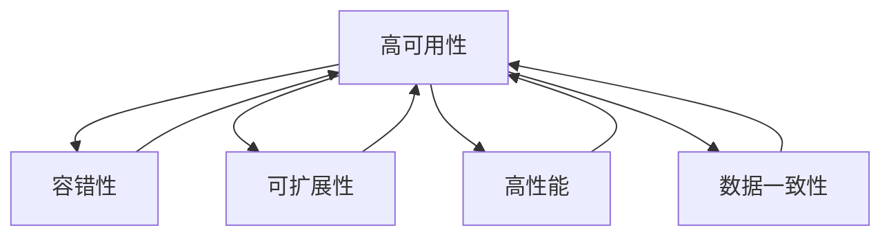

                 

# 分布式系统设计：理论与实践

> 关键词：分布式系统, 高性能, 可扩展性, 一致性, 可靠性, 故障容忍, 负载均衡, 容错机制

## 1. 背景介绍

### 1.1 问题由来

随着互联网和移动互联网的迅猛发展，数据量和用户数量的爆炸式增长，单机的处理能力和存储能力已远远无法满足需求。分布式系统作为大规模数据处理和应用部署的基础设施，成为支撑现代互联网应用的必备组件。如何设计和实现高效的分布式系统，成为众多企业面临的重大挑战。

分布式系统的核心问题在于如何高效、可靠地处理海量并发请求，同时确保数据的强一致性。这些问题的解决，不仅依赖于深厚的理论基础，更需要丰富的实践经验。本文将深入探讨分布式系统的核心概念和设计原理，通过理论和实践相结合的方式，为你揭开分布式系统设计的神秘面纱。

### 1.2 问题核心关键点

分布式系统设计涉及众多关键问题，包括但不限于：

- 如何实现高效的数据分发和处理？
- 如何保证数据的一致性和可靠性？
- 如何快速应对系统故障，提升系统的故障容忍度？
- 如何实现负载均衡，保证系统的高可用性和扩展性？
- 如何设计高效的容错机制，降低系统故障带来的影响？

这些问题不仅影响着系统的性能和可靠性，也是分布式系统设计和实现的关键所在。

## 2. 核心概念与联系

### 2.1 核心概念概述

分布式系统(Distributed System)是由多台计算机通过网络互连组成的系统，以协同完成大规模数据处理和应用部署。其主要特征包括：

- **高可用性(High Availability)**：系统必须具备高可用性，即使在部分节点故障的情况下也能保证服务的连续性。
- **可扩展性(Scalability)**：系统必须具备良好的可扩展性，能够轻松应对数据量和用户数量的增长。
- **高性能(Performance)**：系统必须具备高性能，能够高效处理海量并发请求。
- **数据一致性(Data Consistency)**：系统必须保证数据的一致性，确保在分布式环境中数据的正确性和完整性。
- **容错性(Fault Tolerance)**：系统必须具备容错性，能够在节点故障时快速恢复。

这些核心概念相互关联，共同构成了分布式系统的设计和实现框架。

### 2.2 核心概念原理和架构的 Mermaid 流程图



## 3. 核心算法原理 & 具体操作步骤

### 3.1 算法原理概述

分布式系统设计的核心算法原理主要包括分布式数据处理、数据一致性协议、容错机制和负载均衡算法。这些算法共同构成了分布式系统的骨架，保证其在高可用性、高性能和可靠性的前提下，能够实现数据的强一致性和系统的高扩展性。

### 3.2 算法步骤详解

#### 3.2.1 分布式数据处理

分布式数据处理是分布式系统的核心功能之一。其主要步骤包括：

1. **数据分片(Sharding)**：将大数据集划分为多个小数据集，并分布在不同的节点上处理。数据分片通常根据某种规则进行，如按哈希值分片。

2. **数据分发(Data Distribution)**：将数据分片发送到不同的节点上进行并行处理。数据分发策略包括负载均衡和节点本地化。

3. **数据聚合(Data Aggregation)**：将各个节点处理的结果进行聚合，最终得到整个数据集的处理结果。数据聚合通常通过分布式消息队列或分布式数据库进行。

#### 3.2.2 数据一致性协议

数据一致性协议是保证分布式系统中数据一致性的关键算法。其主要步骤包括：

1. **两阶段提交(2PC)**：在分布式事务中，所有节点必须同时提交或回滚，以确保数据的一致性。两阶段提交协议分为两个阶段：准备和提交，分别在协调者和参与者之间进行。

2. **Paxos算法**：一种基于拜占庭容错的共识算法，通过节点之间的多轮消息交互，达成一致的决策。Paxos算法适用于分布式系统的决策问题，如配置变更、数据同步等。

3. **Raft算法**：一种基于日志记录的共识算法，用于选举主节点和保持数据一致性。Raft算法在分布式系统中广泛应用，如Google的Chubby、Facebook的Zookeeper等。

#### 3.2.3 容错机制

容错机制是保证分布式系统可靠性的关键算法。其主要步骤包括：

1. **主从复制(Master-Slave Replication)**：在分布式系统中，将数据复制到多个节点，其中一个节点为主节点，其余节点为从节点。主节点处理请求，从节点备份数据，并在主节点故障时接管。

2. **多副本复制(Multi-Master Replication)**：在分布式系统中，多个节点都可以处理请求，并保持数据一致性。多副本复制通常使用分布式数据库和分布式缓存系统。

3. **故障容忍(Fault Tolerance)**：在分布式系统中，节点故障不可避免，系统必须具备故障容忍的能力。常见的方法包括节点替换、数据备份和冗余设计。

#### 3.2.4 负载均衡算法

负载均衡算法是保证分布式系统高性能的关键算法。其主要步骤包括：

1. **轮询(Round Robin)**：将请求按照某种顺序分配到不同的节点上，确保各个节点的负载均衡。轮询算法简单易行，但存在负载不均衡的情况。

2. **哈希负载均衡(Hash-Based Load Balancing)**：将请求的哈希值映射到不同的节点上，确保负载均衡。哈希负载均衡算法效率高，但需要保证哈希函数的一致性。

3. **权重负载均衡(Weight-Based Load Balancing)**：根据各个节点的负载情况，动态调整请求分配权重。权重负载均衡算法可以避免节点负载不均衡的问题，但需要额外的管理开销。

### 3.3 算法优缺点

#### 3.3.1 分布式数据处理

- **优点**：
  - 能够高效处理大规模数据集。
  - 具备良好的扩展性，能够应对数据量和用户数量的增长。
  - 能够利用多台计算机的计算资源，提升系统的处理能力。

- **缺点**：
  - 数据分片和聚合增加了系统的复杂度。
  - 数据一致性协议和容错机制增加了系统的实现难度。

#### 3.3.2 数据一致性协议

- **优点**：
  - 能够保证分布式系统中的数据一致性。
  - 能够支持分布式事务和配置变更等复杂操作。

- **缺点**：
  - 协议的实现复杂度较高，需要多轮消息交互。
  - 协议的性能较低，可能会影响系统的整体性能。

#### 3.3.3 容错机制

- **优点**：
  - 能够提升分布式系统的可靠性，避免单点故障。
  - 能够快速恢复故障节点，保证系统的可用性。

- **缺点**：
  - 容错机制的实现复杂度较高，需要额外的存储和管理开销。
  - 容错机制的性能较低，可能会影响系统的整体性能。

#### 3.3.4 负载均衡算法

- **优点**：
  - 能够保证分布式系统的高性能，快速处理海量请求。
  - 能够提升系统的可扩展性，应对数据量和用户数量的增长。

- **缺点**：
  - 算法实现复杂度较高，需要多轮消息交互。
  - 算法性能较低，可能会影响系统的整体性能。

### 3.4 算法应用领域

分布式系统设计涉及众多应用领域，包括但不限于：

- **云计算平台**：如亚马逊AWS、微软Azure和谷歌云平台，提供了分布式计算、存储和网络服务。
- **大数据平台**：如Hadoop、Spark和Flink，提供了分布式数据处理和分析服务。
- **分布式数据库**：如Google的Spanner、亚马逊的Aurora和微软的Cosmos DB，提供了高可用性、高性能和可扩展性。
- **分布式缓存**：如Redis和Memcached，提供了高性能的键值存储服务。
- **分布式事务**：如两阶段提交、Paxos和Raft，保证了分布式事务的一致性和可靠性。

## 4. 数学模型和公式 & 详细讲解 & 举例说明

### 4.1 数学模型构建

在分布式系统设计中，数学模型主要应用于数据一致性和负载均衡算法的设计和分析。以下是常见的数学模型和公式：

#### 4.1.1 两阶段提交协议

- **准备阶段(Prepare)**：
  $$
  \begin{align*}
  \text{协调者} & \rightarrow \text{参与者} & \text{prep} & \text{:} \\
  \text{提交请求} & \text{:} & \text{(p, x)} & \text{:} \\
  \text{参与者} & \rightarrow \text{协调者} & \text{prep} & \text{:} \\
  \text{已准备} & \text{:} & \text{(pi, v)} & \text{:} \\
  \end{align*}
  $$
  其中，$(p, x)$表示提交请求，$v$表示节点的当前状态。

- **提交阶段(Commit)**：
  $$
  \begin{align*}
  \text{协调者} & \rightarrow \text{参与者} & \text{commit} & \text{:} \\
  \text{提交请求} & \text{:} & \text{(c, p, v)} & \text{:} \\
  \text{参与者} & \rightarrow \text{协调者} & \text{commit} & \text{:} \\
  \text{已提交} & \text{:} & \text{(ci, vi)} & \text{:} \\
  \end{align*}
  $$
  其中，$(c, p, v)$表示提交请求，$vi$表示节点的最终状态。

#### 4.1.2 Paxos算法

- **准备阶段(Prepare)**：
  $$
  \begin{align*}
  \text{协调者} & \rightarrow \text{候选人} & \text{prepare} & \text{:} \\
  \text{提议号} & \text{:} & \text{(p, v)} & \text{:} \\
  \text{候选人} & \rightarrow \text{协调者} & \text{prepare} & \text{:} \\
  \text{已准备} & \text{:} & \text{(pi, v)} & \text{:} \\
  \end{align*}
  $$
  其中，$p$表示提议号，$v$表示候选节点的状态。

- **承诺阶段(Cromise)**：
  $$
  \begin{align*}
  \text{候选者} & \rightarrow \text{协调者} & \text{crsprmise} & \text{:} \\
  \text{提议号} & \text{:} & \text{(c, p, v)} & \text{:} \\
  \text{协调者} & \rightarrow \text{候选人} & \text{commit} & \text{:} \\
  \text{已承诺} & \text{:} & \text{(ci, v)} & \text{:} \\
  \end{align*}
  $$
  其中，$c$表示承诺号，$vi$表示候选节点的最终状态。

### 4.2 公式推导过程

#### 4.2.1 两阶段提交协议

- **准备阶段**：协调者向所有参与者发送提交请求，询问是否已准备好。
- **提交阶段**：协调者接收所有参与者的提交请求，检查是否全部参与者已准备就绪。若准备就绪，则向所有参与者发送提交命令，要求其将状态更新为已提交。

#### 4.2.2 Paxos算法

- **准备阶段**：协调者向所有候选人发送准备请求，询问其是否已准备好。
- **承诺阶段**：候选人接收协调者的承诺请求，检查是否全部候选人已准备就绪。若准备就绪，则向协调者发送承诺命令，要求其将状态更新为已承诺。

### 4.3 案例分析与讲解

#### 4.3.1 两阶段提交协议

假设有三个节点A、B、C，需要进行分布式事务处理。

- **准备阶段**：
  - 协调者向节点A、B、C发送提交请求，询问其是否已准备好。
  - 节点A回复已准备好，并发送状态为0。
  - 节点B回复已准备好，并发送状态为1。
  - 节点C回复已准备好，并发送状态为2。

- **提交阶段**：
  - 协调者接收所有节点的提交请求，检查是否全部节点已准备就绪。
  - 所有节点已准备就绪，则向所有节点发送提交命令，要求其将状态更新为已提交。
  - 节点A、B、C收到提交命令后，将状态更新为已提交，并记录事务提交成功。

#### 4.3.2 Paxos算法

假设有五个候选人节点A、B、C、D、E，需要进行配置变更。

- **准备阶段**：
  - 协调者向所有候选人节点发送准备请求，询问其是否已准备好。
  - 候选人节点A回复已准备好，并发送状态为0。
  - 候选人节点B回复已准备好，并发送状态为1。
  - 候选人节点C回复已准备好，并发送状态为2。
  - 候选人节点D回复已准备好，并发送状态为3。
  - 候选人节点E回复已准备好，并发送状态为4。

- **承诺阶段**：
  - 协调者接收所有候选节点的承诺请求，检查是否全部候选人已准备就绪。
  - 所有候选人已准备就绪，则向协调者发送承诺命令，要求其将状态更新为已承诺。
  - 协调者接收所有候选节点的承诺命令后，选择一个状态为0的候选人节点作为最终领导者，并记录配置变更成功。

## 5. 项目实践：代码实例和详细解释说明

### 5.1 开发环境搭建

在进行分布式系统设计实践前，我们需要准备好开发环境。以下是使用Python进行PyTorch开发的环境配置流程：

1. 安装Anaconda：从官网下载并安装Anaconda，用于创建独立的Python环境。

2. 创建并激活虚拟环境：
```bash
conda create -n pytorch-env python=3.8 
conda activate pytorch-env
```

3. 安装PyTorch：根据CUDA版本，从官网获取对应的安装命令。例如：
```bash
conda install pytorch torchvision torchaudio cudatoolkit=11.1 -c pytorch -c conda-forge
```

4. 安装TensorFlow：从官网下载对应的版本，并按照安装指南进行安装。

5. 安装分布式库：如Apache Spark、Hadoop和Kafka，用于进行分布式数据处理和消息队列构建。

6. 安装各类工具包：
```bash
pip install numpy pandas scikit-learn matplotlib tqdm jupyter notebook ipython
```

完成上述步骤后，即可在`pytorch-env`环境中开始分布式系统设计实践。

### 5.2 源代码详细实现

以下是一个简单的分布式数据处理示例，使用Spark进行数据分片和聚合：

```python
from pyspark import SparkContext, SparkConf

conf = SparkConf().setMaster("local").setAppName("Distributed Data Processing")
sc = SparkContext(conf=conf)

# 创建RDD，进行数据分片
data = sc.parallelize([1, 2, 3, 4, 5, 6, 7, 8, 9, 10])
shards = data.repartition(2)

# 进行数据聚合
aggregated = shards.reduce(lambda x, y: x + y)

print(aggregated.collect())
```

### 5.3 代码解读与分析

让我们再详细解读一下关键代码的实现细节：

**SparkContext**：
- 用于创建Spark应用程序，并初始化Spark上下文环境。

**parallelize**：
- 将本地数据列表转换为RDD（弹性分布式数据集），并进行数据分片。

**repartition**：
- 将RDD进行重新分片，以确保数据在多个节点上均衡分布。

**reduce**：
- 对多个节点上的数据进行聚合操作，并返回最终结果。

可以看到，使用Spark进行分布式数据处理非常简单高效，开发者可以专注于数据处理逻辑的实现，而不必过多关注底层实现细节。

## 6. 实际应用场景

### 6.1 互联网公司

互联网公司如百度、阿里巴巴和腾讯，都在大规模部署分布式系统，以支撑其核心业务。例如：

- **百度**：百度广告系统利用分布式数据处理和负载均衡算法，高效处理海量广告请求，保证系统的高可用性和扩展性。
- **阿里巴巴**：阿里巴巴的云服务云計算，利用分布式数据库和容错机制，保证数据的强一致性和系统的可靠性。
- **腾讯**：腾讯的微信、QQ等即时通讯平台，利用分布式缓存和负载均衡算法，保证系统的高性能和扩展性。

### 6.2 科研机构

科研机构如中科院、清华大学和北京大学，也在积极开展分布式系统研究。例如：

- **中科院计算所**：中科院计算所的分布式存储系统HDFS，广泛用于大规模数据的存储和管理。
- **清华大学**：清华大学的研究团队在分布式系统理论方面取得诸多突破，研究成果广泛应用于互联网公司。
- **北京大学**：北京大学的研究团队在分布式缓存和负载均衡算法方面提出了一系列创新方案。

### 6.3 政府部门

政府部门如国家电网、交通部等，也在积极应用分布式系统。例如：

- **国家电网**：国家电网的智能电网系统，利用分布式数据库和负载均衡算法，保证系统的稳定性和扩展性。
- **交通部**：交通部的车辆监控系统，利用分布式缓存和数据一致性协议，保证数据的强一致性和系统的可靠性。

## 7. 工具和资源推荐

### 7.1 学习资源推荐

为了帮助开发者系统掌握分布式系统设计的理论基础和实践技巧，这里推荐一些优质的学习资源：

1. 《计算机网络》（Cormen、Lehman、Stein、Rivest）：经典计算机网络教材，涵盖了分布式系统的基础理论。
2. 《计算机操作系统》（Andrew S. Tanenbaum）：经典操作系统教材，讲解了分布式系统的基本原理。
3. 《分布式算法》（Michael J. Fischer）：讲解了分布式算法的基本理论，如分布式共识、负载均衡和容错机制。
4. 《分布式系统设计》（George Coulouris、Ian Katsikopoulou、Jean-Loic Maffei、Tim Ceraudo）：讲解了分布式系统的设计和实现方法。
5. 《分布式系统概论》（Sasikanth Machiraju、David Nahapetian）：讲解了分布式系统的核心概念和设计原理。

通过对这些资源的学习实践，相信你一定能够快速掌握分布式系统设计的精髓，并用于解决实际的系统问题。

### 7.2 开发工具推荐

高效的开发离不开优秀的工具支持。以下是几款用于分布式系统设计开发的常用工具：

1. Apache Spark：Apache基金会开发的分布式计算框架，支持大规模数据处理和并行计算。
2. Apache Hadoop：Apache基金会开发的分布式存储和计算框架，支持大规模数据的存储和管理。
3. Apache Kafka：Apache基金会开发的分布式消息队列，支持高吞吐量的数据传输。
4. Cassandra：Facebook开源的分布式数据库，支持高可用性和强一致性。
5. Zookeeper：Apache基金会开发的分布式协调服务，支持分布式系统的配置管理和状态同步。

合理利用这些工具，可以显著提升分布式系统设计的开发效率，加快创新迭代的步伐。

### 7.3 相关论文推荐

分布式系统设计的研究源于学界的持续研究。以下是几篇奠基性的相关论文，推荐阅读：

1. Paxos Made Simple（Leslie Lamport）：介绍Paxos算法的基本原理和实现方法。
2. The Google File System（Andrew S. Fikes、Michael J. Carey、Michael J. Cappellini、Zeng Guoqing、Ted K paleczny、Kent N. Yelick、Rajeev Motwani）：介绍Google文件系统的设计原理和实现方法。
3. Master-Worker Protocols for Parallel Machine Learning（Andrew Ng、Michael I. Jordan、Yair Weiss）：介绍分布式机器学习的基本原理和实现方法。
4. Amazon Dynamo: Amazon's Highly Available, Partitioned, Multi-Region, Scalable, Primary-Backup-Free NoSQL Database Service（Shamir V. Shlomi、Yevgeniy A. Kaliski Jr.）：介绍Amazon Dynamo的设计原理和实现方法。
5. Paxos: Practical Basis for Robust Replication（Leslie Lamport、Danny D. Pease、Laurie C. Peterson）：介绍Paxos算法的基本原理和实现方法。

这些论文代表了大规模分布式系统的设计原理和实现方法，是理解和设计分布式系统的基石。

## 8. 总结：未来发展趋势与挑战

### 8.1 总结

本文对分布式系统设计的核心概念和算法原理进行了全面系统的介绍。首先阐述了分布式系统的背景和核心问题，明确了分布式系统设计的重要性和复杂性。其次，从理论到实践，详细讲解了分布式系统的数学模型和算法步骤，给出了分布式系统设计的完整代码实例。同时，本文还广泛探讨了分布式系统在互联网、科研和政府等领域的应用前景，展示了分布式系统设计的巨大潜力。最后，本文精选了分布式系统的学习资源和开发工具，力求为读者提供全方位的技术指引。

通过本文的系统梳理，可以看到，分布式系统设计是实现大规模数据处理和应用部署的关键技术，其核心问题涉及数据的强一致性、系统的高可用性和扩展性。了解这些核心问题及其解决策略，是构建高性能、高可用性和高扩展性分布式系统的必备基础。

### 8.2 未来发展趋势

展望未来，分布式系统设计将呈现以下几个发展趋势：

1. 容器化和微服务架构：容器化和微服务架构将成为分布式系统的主流部署模式，进一步提升系统的可扩展性和灵活性。

2. 云计算平台：云计算平台将成为分布式系统的主流计算环境，提供高效、可靠、弹性的计算资源和基础设施。

3. 自动化运维：自动化运维将成为分布式系统管理的重要手段，通过自动化部署、监控和故障恢复，提升系统的运维效率和稳定性。

4. 区块链技术：区块链技术将成为分布式系统的核心技术之一，提供去中心化、安全可靠的数据存储和传输方式。

5. 边缘计算：边缘计算将成为分布式系统的重要组成部分，通过在边缘节点进行数据处理和存储，提升系统的响应速度和数据隐私保护。

6. 联邦学习：联邦学习将成为分布式系统的关键技术之一，通过在不共享数据的前提下，实现分布式学习和知识共享。

以上趋势凸显了分布式系统设计的广阔前景。这些方向的探索发展，必将进一步提升分布式系统的性能和可靠性，为大规模数据处理和应用部署提供新的技术路径。

### 8.3 面临的挑战

尽管分布式系统设计已经取得了诸多进展，但在迈向更加智能化、普适化应用的过程中，仍面临诸多挑战：

1. 系统复杂度增加：分布式系统的设计复杂度较高，需要考虑数据一致性、系统高可用性和扩展性等多方面的问题，增加了系统实现的难度。

2. 性能瓶颈明显：分布式系统的性能瓶颈主要集中在数据传输和网络延迟方面，如何优化系统性能，仍是一大难题。

3. 安全性保障不足：分布式系统面临诸多安全威胁，如数据泄露、DDoS攻击等，如何保障系统安全，仍需进一步研究。

4. 数据隐私保护缺失：分布式系统需要在不泄露数据的前提下进行数据处理和共享，如何保障数据隐私，仍是一大难题。

5. 跨平台兼容性差：分布式系统的组件和工具众多，不同平台之间的兼容性较差，增加了系统集成的难度。

6. 标准化进程缓慢：分布式系统的标准化进程较为缓慢，缺乏统一的规范和标准，增加了系统实现的复杂度。

正视分布式系统设计面临的这些挑战，积极应对并寻求突破，将是分布式系统设计走向成熟的必由之路。相信随着学界和产业界的共同努力，这些挑战终将一一被克服，分布式系统设计必将在构建高性能、高可用性和高扩展性的分布式系统中发挥更大的作用。

### 8.4 研究展望

未来的分布式系统设计研究需要在以下几个方面寻求新的突破：

1. 分布式机器学习和联邦学习：结合分布式系统和机器学习，实现高效、可靠的数据学习和知识共享。

2. 分布式数据库和存储：研究分布式数据库和存储系统的设计原理和实现方法，提升系统的扩展性和一致性。

3. 分布式缓存和负载均衡：研究分布式缓存和负载均衡算法的设计原理和实现方法，提升系统的性能和可靠性。

4. 分布式安全和隐私保护：研究分布式系统和数据隐私保护的技术手段，保障系统的安全性和隐私性。

5. 分布式系统架构和设计：研究分布式系统架构和设计方法，提升系统的可扩展性和灵活性。

6. 分布式系统和云计算平台：研究分布式系统在云计算平台中的应用方法，提升系统的性能和可扩展性。

这些研究方向的探索，必将引领分布式系统设计技术迈向更高的台阶，为大规模数据处理和应用部署提供新的技术路径。只有勇于创新、敢于突破，才能不断拓展分布式系统设计的边界，让分布式系统设计技术更好地服务社会。

## 9. 附录：常见问题与解答

**Q1：分布式系统如何保证数据一致性？**

A: 分布式系统通过数据一致性协议，如两阶段提交、Paxos和Raft等，保证数据的一致性。这些协议通过多轮消息交互，确保所有节点对同一数据的更新同步完成。

**Q2：分布式系统如何实现高性能？**

A: 分布式系统通过负载均衡算法，如轮询和哈希负载均衡等，保证数据的均衡分布，提升系统的并发处理能力。同时，通过数据分片和聚合等技术，减少数据传输和处理的开销，提升系统的性能。

**Q3：分布式系统如何实现高可用性？**

A: 分布式系统通过主从复制和多副本复制等容错机制，确保系统的故障容忍能力。在节点故障时，系统能够快速恢复，保证服务的连续性。

**Q4：分布式系统如何实现扩展性？**

A: 分布式系统通过分布式数据处理和负载均衡算法，实现数据的均衡分布和系统的扩展性。同时，通过容器化和微服务架构等技术，提升系统的灵活性和扩展性。

**Q5：分布式系统如何实现自动化运维？**

A: 分布式系统通过自动化运维工具，如Ansible、Puppet和Chef等，实现自动化部署、监控和故障恢复，提升系统的运维效率和稳定性。

通过本文的系统梳理，可以看到，分布式系统设计是实现大规模数据处理和应用部署的关键技术，其核心问题涉及数据的强一致性、系统的高可用性和扩展性。了解这些核心问题及其解决策略，是构建高性能、高可用性和高扩展性分布式系统的必备基础。未来，伴随分布式系统设计技术的不断演进，必将进一步提升分布式系统的性能和可靠性，为大规模数据处理和应用部署提供新的技术路径。

