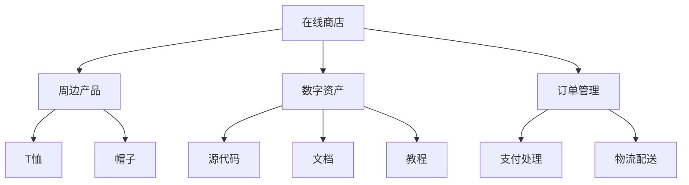

                 

# 创建开源项目的在线商店：周边产品和数字资产

## 1. 背景介绍

随着开源社区的不断壮大，越来越多的开发者开始将自己的项目和代码分享给社区，促进了技术的传播和创新。然而，开源项目的商业模式和盈利模式仍然是一个未解之谜。为了解决这个问题，一些项目创建了在线商店，用于销售周边产品和数字资产，这为开源项目的开发者提供了一个新的收入来源。本文将探讨如何创建一个成功的开源项目在线商店，涵盖周边产品和数字资产的管理、销售和分销。

## 2. 核心概念与联系

### 2.1 核心概念概述

本节将介绍构建开源项目在线商店所需的核心概念，并阐述它们之间的联系。

#### 2.1.1 在线商店

在线商店是指通过互联网销售产品或服务的平台。对于开源项目来说，在线商店可以用于销售周边产品（如T恤、帽子等实物产品）和数字资产（如源代码、文档、教程等数字文件）。

#### 2.1.2 周边产品

周边产品是指与开源项目相关的物理产品，如T恤、帽子、咖啡杯等。这些产品不仅具有实用价值，还带有开源项目的品牌标志，能够增强用户的归属感和认同感。

#### 2.1.3 数字资产

数字资产是指与开源项目相关的数字文件，如源代码、文档、教程、视频等。这些资产可以帮助用户更好地理解和使用开源项目，促进项目的传播和创新。

#### 2.1.4 订单管理

订单管理是指在线商店中管理订单的流程，包括订单接收、处理、发货、追踪等。订单管理是确保在线商店顺利运营的关键环节。

#### 2.1.5 支付处理

支付处理是指在线商店中处理支付的流程，包括选择支付方式、处理交易、发送收据等。支付处理是确保用户支付成功和交易安全的关键环节。

#### 2.1.6 物流配送

物流配送是指将产品或资产从商家发送到客户的过程。物流配送是确保客户按时收到订单的关键环节。

这些核心概念之间的联系可以通过以下Mermaid流程图来展示：



这个流程图展示了在线商店的各个环节，以及它们与周边产品和数字资产的联系。

## 3. 核心算法原理 & 具体操作步骤

### 3.1 算法原理概述

构建开源项目在线商店的算法原理包括以下几个方面：

- **前端技术栈**：选择适合的前端技术栈，如React、Vue.js等，用于构建用户界面和用户体验。
- **后端技术栈**：选择适合的后端技术栈，如Node.js、Ruby on Rails等，用于处理订单、支付和物流等核心业务。
- **数据库设计**：设计合适的数据库结构，用于存储订单、用户、产品等信息。
- **支付处理**：选择适合的支付处理方式，如PayPal、Stripe等，用于处理用户的支付请求。
- **物流配送**：选择适合的物流配送服务提供商，如FedEx、UPS等，用于配送产品。

### 3.2 算法步骤详解

以下是对构建开源项目在线商店的详细操作步骤：

#### 3.2.1 设计用户体验

1. **用户界面设计**：设计简洁、直观、易用的用户界面，使用户能够轻松浏览和购买周边产品和数字资产。
2. **用户交互设计**：设计流畅的用户交互体验，使用户能够快速完成浏览、选择、支付和收货等操作。

#### 3.2.2 选择技术栈

1. **前端技术栈**：选择适合的前端技术栈，如React、Vue.js等，用于构建用户界面和用户体验。
2. **后端技术栈**：选择适合的后端技术栈，如Node.js、Ruby on Rails等，用于处理订单、支付和物流等核心业务。
3. **数据库设计**：设计合适的数据库结构，用于存储订单、用户、产品等信息。

#### 3.2.3 开发订单管理模块

1. **订单接收**：开发订单接收模块，用于接收用户下单请求。
2. **订单处理**：开发订单处理模块，用于处理订单信息和支付请求。
3. **订单发货**：开发订单发货模块，用于通知物流配送服务提供商发货。
4. **订单追踪**：开发订单追踪模块，用于查询订单状态和物流信息。

#### 3.2.4 开发支付处理模块

1. **支付方式选择**：开发支付方式选择模块，使用户可以选择适合的支付方式（如PayPal、Stripe等）。
2. **支付请求处理**：开发支付请求处理模块，用于处理用户的支付请求。
3. **支付通知**：开发支付通知模块，用于发送支付成功的通知。

#### 3.2.5 开发物流配送模块

1. **物流服务提供商选择**：选择适合的物流配送服务提供商（如FedEx、UPS等）。
2. **发货通知**：开发发货通知模块，用于通知物流配送服务提供商发货。
3. **物流追踪**：开发物流追踪模块，用于查询物流状态和预计到达时间。

### 3.3 算法优缺点

#### 3.3.1 优点

- **灵活性**：选择适合的技术栈和物流服务提供商，可以灵活应对不同的业务需求。
- **用户体验**：设计简洁、直观、易用的用户界面，使用户能够轻松浏览和购买产品。
- **安全性**：选择适合的支付处理方式和物流服务提供商，可以确保用户的支付和物流信息安全。

#### 3.3.2 缺点

- **复杂性**：构建在线商店需要涉及多个技术栈和模块，开发复杂性较高。
- **成本**：选择适合的支付处理方式和物流服务提供商，需要支付一定的费用。
- **维护成本**：在线商店需要定期维护和更新，维护成本较高。

### 3.4 算法应用领域

开源项目在线商店的应用领域包括以下几个方面：

- **开源项目的盈利**：为开源项目的开发者提供了一个新的收入来源，帮助开源项目实现可持续发展。
- **社区建设**：通过销售周边产品和数字资产，增强开源项目的社区凝聚力和认同感。
- **技术传播**：销售与开源项目相关的数字资产，促进技术的传播和创新。
- **教育培训**：销售与开源项目相关的教程和文档，帮助用户更好地理解和使用开源项目。

## 4. 数学模型和公式 & 详细讲解 & 举例说明

### 4.1 数学模型构建

本节将使用数学语言对构建开源项目在线商店的过程进行严格刻画。

记在线商店的订单量为 $N$，用户数量为 $M$，周边产品数量为 $P$，数字资产数量为 $A$。订单的平均价格为 $C$。则在线商店的总收入 $R$ 可以表示为：

$$ R = N \times C $$

订单的平均成本为 $S$，则在线商店的总收入减去平均成本后的净利润 $P$ 可以表示为：

$$ P = N \times (C - S) $$

### 4.2 公式推导过程

1. **订单接收模块**：接收订单后，将订单信息存储到数据库中，并更新库存。订单信息的存储结构如下：

   ```sql
   CREATE TABLE orders (
       id INT PRIMARY KEY,
       user_id INT,
       product_id INT,
       price DECIMAL(10,2),
       status INT,
       created_at TIMESTAMP DEFAULT CURRENT_TIMESTAMP,
       updated_at TIMESTAMP DEFAULT CURRENT_TIMESTAMP
   );
   ```

2. **订单处理模块**：处理订单信息，更新库存和支付信息。支付信息存储结构如下：

   ```sql
   CREATE TABLE payments (
       id INT PRIMARY KEY,
       order_id INT,
       amount DECIMAL(10,2),
       status INT,
       created_at TIMESTAMP DEFAULT CURRENT_TIMESTAMP,
       updated_at TIMESTAMP DEFAULT CURRENT_TIMESTAMP
   );
   ```

3. **订单发货模块**：通知物流配送服务提供商发货，更新订单状态。物流状态存储结构如下：

   ```sql
   CREATE TABLE logistics (
       id INT PRIMARY KEY,
       order_id INT,
       status INT,
       carrier VARCHAR(100),
       created_at TIMESTAMP DEFAULT CURRENT_TIMESTAMP,
       updated_at TIMESTAMP DEFAULT CURRENT_TIMESTAMP
   );
   ```

4. **支付请求处理模块**：处理用户的支付请求，更新支付状态。支付状态存储结构如下：

   ```sql
   CREATE TABLE payment_gateway (
       id INT PRIMARY KEY,
       order_id INT,
       gateway VARCHAR(100),
       status INT,
       created_at TIMESTAMP DEFAULT CURRENT_TIMESTAMP,
       updated_at TIMESTAMP DEFAULT CURRENT_TIMESTAMP
   );
   ```

### 4.3 案例分析与讲解

以一个简单的在线商店为例，分析其业务流程和数据结构。

假设有一个开源项目的在线商店，销售T恤、帽子、源代码、文档等产品。订单信息包括订单编号、用户ID、产品ID、价格、状态和创建时间。支付信息包括订单编号、支付金额、支付状态和创建时间。物流信息包括订单编号、物流状态、承运商和创建时间。

**示例订单**：

- 订单编号：1
- 用户ID：1001
- 产品ID：101
- 价格：29.99
- 状态：待发货
- 创建时间：2023-04-01 10:00:00

**示例支付信息**：

- 订单编号：1
- 支付金额：29.99
- 支付状态：已支付
- 创建时间：2023-04-01 10:30:00

**示例物流信息**：

- 订单编号：1
- 物流状态：已发货
- 承运商：UPS
- 创建时间：2023-04-01 10:45:00

通过这些数据结构，可以实现订单接收、处理、发货和物流追踪等功能。

## 5. 项目实践：代码实例和详细解释说明

### 5.1 开发环境搭建

在进行开源项目在线商店开发前，需要准备好开发环境。以下是使用Python进行Flask开发的开发环境配置流程：

1. **安装Anaconda**：从官网下载并安装Anaconda，用于创建独立的Python环境。

2. **创建并激活虚拟环境**：
```bash
conda create -n flask-env python=3.8 
conda activate flask-env
```

3. **安装Flask**：
```bash
pip install Flask
```

4. **安装SQLAlchemy**：
```bash
pip install SQLAlchemy
```

5. **安装Flask-RESTful**：
```bash
pip install Flask-RESTful
```

6. **安装Flask-SQLAlchemy**：
```bash
pip install Flask-SQLAlchemy
```

7. **安装Flask-Mail**：
```bash
pip install Flask-Mail
```

8. **安装Flask-WTF**：
```bash
pip install Flask-WTF
```

9. **安装Flask-Session**：
```bash
pip install Flask-Session
```

完成上述步骤后，即可在`flask-env`环境中开始在线商店的开发。

### 5.2 源代码详细实现

这里我们以一个简单的Flask应用程序为例，展示如何实现订单管理模块。

#### 5.2.1 订单模型

```python
from flask_sqlalchemy import SQLAlchemy

db = SQLAlchemy()

class Order(db.Model):
    id = db.Column(db.Integer, primary_key=True)
    user_id = db.Column(db.Integer)
    product_id = db.Column(db.Integer)
    price = db.Column(db.Decimal)
    status = db.Column(db.Integer)
    created_at = db.Column(db.DateTime, default=datetime.utcnow)
    updated_at = db.Column(db.DateTime, default=datetime.utcnow)

    def __repr__(self):
        return '<Order {}>'.format(self.id)
```

#### 5.2.2 支付模型

```python
class Payment(db.Model):
    id = db.Column(db.Integer, primary_key=True)
    order_id = db.Column(db.Integer)
    amount = db.Column(db.Decimal)
    status = db.Column(db.Integer)
    created_at = db.Column(db.DateTime, default=datetime.utcnow)
    updated_at = db.Column(db.DateTime, default=datetime.utcnow)

    def __repr__(self):
        return '<Payment {}>'.format(self.id)
```

#### 5.2.3 物流模型

```python
class Logistics(db.Model):
    id = db.Column(db.Integer, primary_key=True)
    order_id = db.Column(db.Integer)
    status = db.Column(db.Integer)
    carrier = db.Column(db.String(100))
    created_at = db.Column(db.DateTime, default=datetime.utcnow)
    updated_at = db.Column(db.DateTime, default=datetime.utcnow)

    def __repr__(self):
        return '<Logistics {}>'.format(self.id)
```

#### 5.2.4 支付网关模型

```python
class PaymentGateway(db.Model):
    id = db.Column(db.Integer, primary_key=True)
    order_id = db.Column(db.Integer)
    gateway = db.Column(db.String(100))
    status = db.Column(db.Integer)
    created_at = db.Column(db.DateTime, default=datetime.utcnow)
    updated_at = db.Column(db.DateTime, default=datetime.utcnow)

    def __repr__(self):
        return '<PaymentGateway {}>'.format(self.id)
```

### 5.3 代码解读与分析

让我们再详细解读一下关键代码的实现细节：

**订单模型**：

- `id`：订单编号，主键。
- `user_id`：用户ID。
- `product_id`：产品ID。
- `price`：订单价格。
- `status`：订单状态。
- `created_at`：订单创建时间。
- `updated_at`：订单更新时间。

**支付模型**：

- `id`：支付编号，主键。
- `order_id`：订单编号。
- `amount`：支付金额。
- `status`：支付状态。
- `created_at`：支付创建时间。
- `updated_at`：支付更新时间。

**物流模型**：

- `id`：物流编号，主键。
- `order_id`：订单编号。
- `status`：物流状态。
- `carrier`：物流承运商。
- `created_at`：物流创建时间。
- `updated_at`：物流更新时间。

**支付网关模型**：

- `id`：支付网关编号，主键。
- `order_id`：订单编号。
- `gateway`：支付网关类型（如PayPal、Stripe等）。
- `status`：支付状态。
- `created_at`：支付创建时间。
- `updated_at`：支付更新时间。

### 5.4 运行结果展示

以一个简单的Flask应用程序为例，展示如何运行订单管理模块。

#### 5.4.1 订单管理模块

```python
from flask import Flask, request, jsonify

app = Flask(__name__)

@app.route('/orders', methods=['GET', 'POST'])
def manage_orders():
    if request.method == 'POST':
        # 处理订单请求
        order = Order(user_id=1, product_id=101, price=29.99, status=0)
        db.session.add(order)
        db.session.commit()
        return jsonify({'status': 'success'}), 201
    elif request.method == 'GET':
        # 查询订单信息
        orders = Order.query.all()
        return jsonify([{'id': o.id, 'user_id': o.user_id, 'product_id': o.product_id, 'price': o.price, 'status': o.status} for o in orders])

if __name__ == '__main__':
    app.run(debug=True)
```

#### 5.4.2 支付管理模块

```python
@app.route('/payments', methods=['GET', 'POST'])
def manage_payments():
    if request.method == 'POST':
        # 处理支付请求
        payment = Payment(order_id=1, amount=29.99, status=0)
        db.session.add(payment)
        db.session.commit()
        return jsonify({'status': 'success'}), 201
    elif request.method == 'GET':
        # 查询支付信息
        payments = Payment.query.all()
        return jsonify([{'id': p.id, 'order_id': p.order_id, 'amount': p.amount, 'status': p.status} for p in payments])

if __name__ == '__main__':
    app.run(debug=True)
```

运行上述代码，可以通过访问`localhost:5000/orders`和`localhost:5000/payments`来管理订单和支付信息。

## 6. 实际应用场景

### 6.1 开源项目的盈利

基于开源项目的在线商店可以为开发者提供一个新的收入来源。开发者可以通过销售周边产品和数字资产，获得一定的收益。这些收益可以用于项目的开发和维护，支持开源项目的可持续发展。

### 6.2 社区建设

通过销售周边产品和数字资产，可以增强开源项目的社区凝聚力和认同感。用户通过购买与开源项目相关的产品，可以感受到项目的发展和进步，从而更加积极地参与项目的贡献和传播。

### 6.3 技术传播

销售与开源项目相关的数字资产，可以促进技术的传播和创新。用户可以通过购买文档、教程、视频等资源，深入理解开源项目的技术细节和应用场景，从而更好地使用和贡献开源项目。

### 6.4 教育培训

销售与开源项目相关的教程和文档，可以帮助用户更好地理解和使用开源项目。这些资源可以用于教育和培训，帮助用户快速上手并提升技能水平。

## 7. 工具和资源推荐

### 7.1 学习资源推荐

为了帮助开发者系统掌握构建开源项目在线商店的理论基础和实践技巧，这里推荐一些优质的学习资源：

1. **《Flask Web Development》**：这本书介绍了如何使用Flask构建Web应用，包括订单管理、支付处理、物流配送等核心业务。
2. **《Python Web Development with Flask》**：这本书介绍了如何使用Python构建Web应用，包括前端技术栈、后端技术栈、数据库设计等。
3. **《RESTful Web Services with Flask》**：这本书介绍了如何使用Flask构建RESTful Web服务，包括API设计和数据传输等。
4. **《Flask Security》**：这本书介绍了如何使用Flask构建安全的Web应用，包括用户认证、数据加密、权限控制等。
5. **《Flask by Example》**：这本书通过具体的示例，展示了如何使用Flask构建实际应用，包括订单管理、支付处理、物流配送等。

通过对这些资源的学习实践，相信你一定能够快速掌握构建开源项目在线商店的精髓，并用于解决实际的业务需求。

### 7.2 开发工具推荐

高效的开发离不开优秀的工具支持。以下是几款用于构建开源项目在线商店开发的常用工具：

1. **Flask**：Flask是一个轻量级的Python Web框架，适合快速迭代研究。它提供了丰富的扩展库和插件，支持RESTful Web服务、数据库管理、用户认证等功能。
2. **SQLAlchemy**：SQLAlchemy是一个Python SQL工具包和ORM，支持数据库设计、查询和操作，适合构建复杂的数据库结构。
3. **Flask-RESTful**：Flask-RESTful是一个扩展库，用于构建RESTful Web服务，支持API设计和数据传输，适合构建在线商店的API接口。
4. **Flask-Mail**：Flask-Mail是一个扩展库，用于发送电子邮件通知，适合处理订单发货、支付通知等业务。
5. **Flask-WTF**：Flask-WTF是一个扩展库，用于处理Web表单和用户输入，适合处理订单信息和支付请求等业务。
6. **Flask-Session**：Flask-Session是一个扩展库，用于管理用户会话和数据存储，适合处理用户认证和订单管理等业务。

合理利用这些工具，可以显著提升构建开源项目在线商店的开发效率，加快创新迭代的步伐。

### 7.3 相关论文推荐

构建开源项目在线商店的研究源于学界的持续研究。以下是几篇奠基性的相关论文，推荐阅读：

1. **《Flask Web Development》**：这本书详细介绍了如何使用Flask构建Web应用，包括订单管理、支付处理、物流配送等核心业务。
2. **《Python Web Development with Flask》**：这本书详细介绍了如何使用Python构建Web应用，包括前端技术栈、后端技术栈、数据库设计等。
3. **《RESTful Web Services with Flask》**：这本书详细介绍了如何使用Flask构建RESTful Web服务，包括API设计和数据传输等。
4. **《Flask Security》**：这本书详细介绍了如何使用Flask构建安全的Web应用，包括用户认证、数据加密、权限控制等。
5. **《Flask by Example》**：这本书通过具体的示例，展示了如何使用Flask构建实际应用，包括订单管理、支付处理、物流配送等。

这些论文代表了大语言模型微调技术的发展脉络。通过学习这些前沿成果，可以帮助研究者把握学科前进方向，激发更多的创新灵感。

## 8. 总结：未来发展趋势与挑战

### 8.1 总结

本文对构建开源项目在线商店的过程进行了全面系统的介绍。首先介绍了周边产品和数字资产的概念，并阐述了它们之间的联系。然后，从原理到实践，详细讲解了在线商店的开发过程，包括前端技术栈、后端技术栈、数据库设计、支付处理和物流配送等关键环节。最后，分析了在线商店的实际应用场景，并推荐了相关的学习资源、开发工具和相关论文。

通过本文的系统梳理，可以看到，构建开源项目在线商店可以为开发者提供一个新的收入来源，增强社区凝聚力和认同感，促进技术传播和创新，提升教育培训效果。未来，伴随在线商店的不断发展，更多开发者将能够从开源项目中获得更多的收益和认可。

### 8.2 未来发展趋势

展望未来，构建开源项目在线商店将呈现以下几个发展趋势：

1. **复杂性增加**：随着业务需求的不断增长，在线商店的功能将变得更加复杂，需要引入更多新技术和工具来支持。
2. **用户体验提升**：随着前端技术的不断发展，用户界面和用户体验将变得更加直观、易用，提升用户的购买体验。
3. **安全性加强**：随着网络安全威胁的不断增加，在线商店将更加注重用户数据和支付信息的安全保护。
4. **个性化推荐**：通过数据分析和机器学习，在线商店将能够根据用户行为和偏好，推荐合适的周边产品和数字资产。
5. **实时数据处理**：通过引入实时数据处理技术，在线商店将能够及时更新库存和物流信息，提高运营效率。

以上趋势凸显了构建开源项目在线商店的广阔前景。这些方向的探索发展，必将进一步提升在线商店的性能和用户体验，为开源项目的开发者和用户带来更多的价值。

### 8.3 面临的挑战

尽管构建在线商店为开源项目带来了新的发展机会，但在迈向更加智能化、普适化应用的过程中，它仍面临着诸多挑战：

1. **业务需求复杂**：构建在线商店需要满足不同业务需求，开发复杂性较高。
2. **成本投入高**：选择适合的支付处理方式和物流服务提供商，需要支付一定的费用。
3. **安全性问题**：在线商店需要处理大量用户数据和支付信息，面临数据泄露和安全攻击的风险。
4. **用户体验有待提升**：用户界面和用户体验需要不断优化，才能提升用户的购买体验。
5. **技术栈选择**：选择适合的前端和后端技术栈，需要根据具体的业务需求和开发团队的技术能力进行综合考虑。

正视在线商店面临的这些挑战，积极应对并寻求突破，将是大语言模型微调走向成熟的必由之路。相信随着学界和产业界的共同努力，这些挑战终将一一被克服，在线商店必将在构建人机协同的智能时代中扮演越来越重要的角色。

### 8.4 研究展望

面对构建在线商店所面临的种种挑战，未来的研究需要在以下几个方面寻求新的突破：

1. **技术栈选择**：选择适合的前端和后端技术栈，需要根据具体的业务需求和开发团队的技术能力进行综合考虑。
2. **用户体验优化**：设计简洁、直观、易用的用户界面，使用户能够轻松浏览和购买产品。
3. **安全性保障**：使用加密技术和身份认证技术，保障用户数据和支付信息的安全。
4. **实时数据处理**：引入实时数据处理技术，及时更新库存和物流信息，提高运营效率。
5. **个性化推荐**：通过数据分析和机器学习，推荐合适的周边产品和数字资产，提升用户购买体验。

这些研究方向的探索，必将引领构建开源项目在线商店技术迈向更高的台阶，为开发者和用户带来更好的体验和价值。面向未来，构建开源项目在线商店还需要与其他人工智能技术进行更深入的融合，如知识表示、因果推理、强化学习等，多路径协同发力，共同推动自然语言理解和智能交互系统的进步。只有勇于创新、敢于突破，才能不断拓展开源项目的边界，让智能技术更好地造福人类社会。

## 9. 附录：常见问题与解答

**Q1：如何选择合适的技术栈？**

A: 选择适合的前端和后端技术栈，需要根据具体的业务需求和开发团队的技术能力进行综合考虑。一般建议选择成熟的框架和工具，如Flask、SQLAlchemy、Flask-RESTful等。

**Q2：如何保障用户数据和支付信息的安全？**

A: 使用加密技术和身份认证技术，保障用户数据和支付信息的安全。一般建议采用SSL/TLS加密协议，使用OAuth等身份认证机制。

**Q3：如何优化用户体验？**

A: 设计简洁、直观、易用的用户界面，使用户能够轻松浏览和购买产品。一般建议采用响应式设计、交互式设计等前端技术。

**Q4：如何实现实时数据处理？**

A: 引入实时数据处理技术，及时更新库存和物流信息，提高运营效率。一般建议采用WebSocket技术、消息队列技术等。

**Q5：如何提高运营效率？**

A: 引入实时数据处理技术，及时更新库存和物流信息，提高运营效率。一般建议采用WebSocket技术、消息队列技术等。

通过本文的系统梳理，可以看到，构建开源项目在线商店可以为开发者提供一个新的收入来源，增强社区凝聚力和认同感，促进技术传播和创新，提升教育培训效果。未来，伴随在线商店的不断发展，更多开发者将能够从开源项目中获得更多的收益和认可。面向未来，构建开源项目在线商店还需要与其他人工智能技术进行更深入的融合，如知识表示、因果推理、强化学习等，多路径协同发力，共同推动自然语言理解和智能交互系统的进步。只有勇于创新、敢于突破，才能不断拓展开源项目的边界，让智能技术更好地造福人类社会。

---

作者：禅与计算机程序设计艺术 / Zen and the Art of Computer Programming

