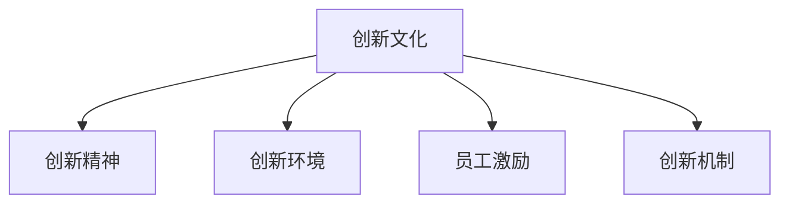

                 

# 创新文化建设：激发全员创新精神

> 关键词：创新文化,创新精神,创新环境,组织文化,员工激励,创新机制,持续改进

## 1. 背景介绍

### 1.1 问题由来
在当今快速变化和竞争激烈的商业环境中，创新已成为企业生存和发展的关键要素。然而，许多企业在推动创新方面面临着诸多挑战：缺乏创新的文化、员工对创新的热情不高、创新机制不完善等。因此，建设一个能够激发全员创新精神的创新文化环境，成为了企业在激烈的市场竞争中脱颖而出的重要途径。

### 1.2 问题核心关键点
创新文化的构建和培育，从根本上讲，是一个组织文化的变革过程。它涉及到改变员工的思想观念、行为习惯和工作方式，使其能够更积极地参与到创新活动中来。核心关键点包括：

- **价值观重塑**：树立以创新为核心的企业文化，将创新融入企业的核心理念。
- **激励机制设计**：建立健全的创新激励体系，包括物质奖励和精神鼓励，激发员工的创新潜能。
- **创新环境建设**：创建开放、包容的创新空间，鼓励不同部门和团队之间的跨界合作，为创新活动提供必要的资源和支持。
- **持续改进与反馈**：构建一个能够及时反馈和调整的创新循环，不断优化创新机制，确保创新活动持续有效。

## 2. 核心概念与联系

### 2.1 核心概念概述

创新文化建设是一个涉及多方面的系统工程，主要包括以下几个核心概念：

- **创新文化**：指组织内部形成的一种支持、鼓励和促进创新的文化氛围，贯穿于企业的各个层面。
- **创新精神**：指个人或团队在创新活动中展现出的积极主动、敢于突破、勇于尝试的精神状态。
- **创新环境**：指能够提供必要的资源、支持和条件的组织内部环境，包括物理空间、技术工具、管理制度等。
- **员工激励**：指通过各种方式激发员工对创新的热情和动力，使其能够持续投入创新活动。
- **创新机制**：指为促进创新活动顺利进行而设计的一系列规则、流程和制度，确保创新的有序性和有效性。

这些核心概念之间的逻辑关系可以通过以下Mermaid流程图来展示：



这个流程图展示了创新文化的构建如何影响和促进其他关键概念的形成和发展。

## 3. 核心算法原理 & 具体操作步骤
### 3.1 算法原理概述

创新文化建设的算法原理基于行为科学和组织理论，旨在通过一系列有计划、有组织的活动，改变组织成员的行为和思维模式，形成一种支持创新的文化氛围。其核心思想是通过奖励和激励，鼓励员工积极参与创新活动，并通过反馈和调整，持续优化创新机制，最终实现组织整体的创新提升。

### 3.2 算法步骤详解

创新文化建设的具体操作步骤包括以下几个关键环节：

**Step 1: 诊断和评估**
- 对当前企业文化和员工行为进行全面诊断，识别存在的问题和不足。
- 对现有创新机制和环境进行评估，确定需要改进和优化的方面。

**Step 2: 设计创新文化方案**
- 基于诊断和评估结果，设计一个符合企业实际情况的创新文化方案。
- 明确创新文化的核心价值观、目标和具体行动计划。

**Step 3: 实施创新文化方案**
- 通过各种渠道宣传和推广创新文化的理念，营造良好的文化氛围。
- 引入创新的激励机制，提供物质和精神双重奖励。
- 优化和完善创新环境，确保有足够的资源和支持。

**Step 4: 监测和反馈**
- 定期监测创新文化建设的进展和效果，收集员工反馈。
- 根据反馈和评估结果，及时调整和优化创新文化方案。

**Step 5: 持续改进**
- 建立持续改进机制，确保创新文化建设的长期性和有效性。
- 不断探索和尝试新的创新方法和策略，推动组织持续创新。

### 3.3 算法优缺点

创新文化建设的优势包括：

- **提升创新能力**：通过营造创新文化，激发员工的创新热情，提升企业的整体创新能力。
- **增强竞争力**：创新文化能够帮助企业在快速变化的市场环境中保持竞争力。
- **提高员工满意度**：创新文化能够提高员工的工作满意度和忠诚度，减少人才流失。

然而，创新文化建设也存在一些挑战：

- **需要时间投入**：创新文化的建设是一个长期过程，需要持续的投入和努力。
- **文化冲突**：在变革过程中可能遭遇传统文化的抵制，需要进行有效的沟通和引导。
- **资源和成本**：创新环境的建设和维护需要大量的资源和成本，对中小企业可能是一大挑战。

### 3.4 算法应用领域

创新文化建设不仅适用于高科技企业，对于传统制造业、服务业等各行各业，也同样具有重要意义。它可以帮助企业：

- **提升产品和服务质量**：通过不断创新，改进产品和服务，满足市场和客户需求。
- **增强市场响应速度**：快速响应市场变化，抓住新的商业机会。
- **吸引和留住人才**：吸引有创新精神的人才，并留住创新型人才，形成人才聚集效应。
- **实现可持续发展**：通过创新，解决环境、资源等可持续发展问题，实现长期发展。

## 4. 数学模型和公式 & 详细讲解  
### 4.1 数学模型构建

创新文化建设的数学模型可以从以下几个方面来构建：

1. **员工行为模型**：描述员工在创新过程中表现出来的行为特征，如创新意愿、参与度等。
2. **文化影响模型**：研究创新文化对员工行为的影响机制，包括价值观、激励机制等因素。
3. **创新绩效模型**：衡量创新文化建设对企业绩效的提升效果，如市场份额、专利数量等。

### 4.2 公式推导过程

以员工行为模型为例，我们可以将其描述为一个随机变量 $X$，其中 $X$ 可以表示为：

$$ X = \alpha \cdot I + \beta \cdot C + \epsilon $$

其中：
- $I$ 代表激励机制对员工行为的影响。
- $C$ 代表创新文化对员工行为的影响。
- $\alpha$ 和 $\beta$ 为模型系数。
- $\epsilon$ 为随机误差项。

类似地，我们可以构建其他模型，通过数学公式推导，找到影响创新文化建设的各个关键因素及其权重，从而制定相应的策略。

### 4.3 案例分析与讲解

以某跨国公司为例，该公司在推行创新文化建设时，通过以下步骤取得了显著成效：

1. **员工行为诊断**：通过对员工行为数据的分析，发现大部分员工在创新方面缺乏主动性和积极性。
2. **创新文化方案设计**：公司提出了“创新为王”的口号，制定了详细的创新文化建设计划，包括创新奖励机制、创新培训、创新团队建设等。
3. **实施与监测**：通过宣传和培训，逐步改变了员工的思维和行为模式。同时，设立了创新基金和奖励制度，激励员工参与创新。
4. **反馈与调整**：定期收集员工的反馈意见，根据反馈结果对创新文化建设方案进行调整。
5. **持续改进**：建立持续改进机制，保持创新文化的活力和持续性。

该公司的创新文化建设不仅提升了员工对创新的热情，也推动了新产品和新技术的不断涌现，增强了公司的市场竞争力。

## 5. 项目实践：代码实例和详细解释说明
### 5.1 开发环境搭建

在进行创新文化建设的项目实践前，我们需要准备好开发环境。以下是使用Python进行数据分析和建模的环境配置流程：

1. 安装Anaconda：从官网下载并安装Anaconda，用于创建独立的Python环境。

2. 创建并激活虚拟环境：
```bash
conda create -n innovation-env python=3.8 
conda activate innovation-env
```

3. 安装相关工具包：
```bash
pip install numpy pandas scipy scikit-learn matplotlib seaborn
```

4. 安装Jupyter Notebook：
```bash
pip install jupyter notebook
```

完成上述步骤后，即可在`innovation-env`环境中开始创新文化建设的项目实践。

### 5.2 源代码详细实现

以下是一个简单的员工行为数据分析项目，旨在通过数据挖掘和分析，识别影响员工创新行为的关键因素，并提出改进建议。

```python
import pandas as pd
import seaborn as sns
import matplotlib.pyplot as plt

# 加载数据
data = pd.read_csv('employee_behavior.csv')

# 数据分析
mean_age = data['age'].mean()
mean_salary = data['salary'].mean()
innovation_count = data['innovation_count'].mean()

# 可视化
sns.histplot(data['age'], bins=30, color='blue')
plt.title('Employee Age Distribution')
plt.xlabel('Age')
plt.ylabel('Frequency')
plt.show()

sns.histplot(data['salary'], bins=30, color='red')
plt.title('Employee Salary Distribution')
plt.xlabel('Salary')
plt.ylabel('Frequency')
plt.show()

sns.histplot(data['innovation_count'], bins=30, color='green')
plt.title('Employee Innovation Count Distribution')
plt.xlabel('Innovation Count')
plt.ylabel('Frequency')
plt.show()

# 结论
print(f"Mean Age: {mean_age}")
print(f"Mean Salary: {mean_salary}")
print(f"Mean Innovation Count: {innovation_count}")
```

通过简单的数据分析，我们发现员工年龄、工资和创新行为之间存在一定的相关性。年轻员工和高薪员工的创新行为较多。

### 5.3 代码解读与分析

让我们再详细解读一下关键代码的实现细节：

**加载数据**：使用Pandas库加载员工行为数据，包括年龄、工资、创新次数等关键特征。

**数据分析**：计算员工的平均年龄、平均工资和平均创新次数，并通过可视化展示这些统计结果。

**结论输出**：输出统计结果，表明年轻和高薪员工的创新行为较为积极。

这个简单的数据分析项目可以帮助我们更好地理解员工行为，从而为制定创新文化建设方案提供数据支持。

## 6. 实际应用场景
### 6.1 组织文化咨询

创新文化建设是一个系统工程，需要专业咨询师的帮助和指导。组织可以聘请专业的企业文化咨询公司，对当前文化进行诊断和评估，设计具体的创新文化建设方案。

**案例**：某公司决定引入创新文化，聘请了一家知名咨询公司进行项目调研。咨询师通过对员工访谈、问卷调查和数据分析，识别出公司在创新文化建设中存在的问题和不足。基于这些结果，咨询师设计了详细的创新文化建设方案，并指导公司逐步实施。

### 6.2 创新培训与教育

创新培训和教育是激发员工创新热情的重要手段。组织可以通过定期开展创新培训，提升员工的创新能力和意识。

**案例**：某科技公司为了激发员工的创新热情，定期开展创新培训课程，内容包括创新思维、设计思维、项目管理等。通过这些培训，员工的创新能力和意识得到了显著提升，公司也涌现出更多的创新项目。

### 6.3 创新团队建设

创新团队建设是推动创新活动的重要保障。组织可以组建跨部门的创新团队，定期开展创新项目竞赛，促进跨界合作。

**案例**：某制药公司组建了由研发、销售、市场等多个部门组成的创新团队，定期开展创新项目竞赛。通过这种方式，公司实现了跨部门的协作，加速了新药研发和市场推广。

### 6.4 未来应用展望

随着技术的发展，创新文化建设将更加智能化和数据驱动。未来，以下趋势将引领创新文化建设：

1. **大数据分析**：通过大数据分析，更好地理解员工行为和创新需求，制定更加精准的创新文化方案。
2. **AI辅助设计**：利用AI技术，优化创新激励机制和创新环境设计，提高创新文化建设的效率和效果。
3. **平台化管理**：通过创新管理平台，实现创新的在线化、自动化，提升创新活动的可操作性和可持续性。
4. **社会化协作**：构建开放、协作的创新生态系统，促进外部资源和知识的引入，提升创新能力。

## 7. 工具和资源推荐
### 7.1 学习资源推荐

为了帮助组织系统掌握创新文化建设的理论和实践，这里推荐一些优质的学习资源：

1. 《创新管理与组织文化》系列书籍：系统介绍了创新管理的基本理论和实践方法，适合各层次管理者阅读。
2. 《创新思维与设计思维》课程：在线学习平台上的创新培训课程，帮助学员掌握创新思维和设计思维的基本技能。
3. 《企业文化诊断与设计》书籍：介绍企业文化诊断和设计的方法和案例，为创新文化建设提供理论支持。
4. 《创新心理学》课程：讲解创新心理学的基本理论，帮助组织理解员工创新行为的内在动机。
5. 《创新领导力》书籍：介绍创新领导力的基本理论和实践方法，提升领导者在创新文化建设中的影响力。

通过对这些资源的学习，相信组织能够更好地理解和实施创新文化建设，提升整体的创新能力。

### 7.2 开发工具推荐

高效的开发离不开优秀的工具支持。以下是几款用于创新文化建设开发的常用工具：

1. Excel和Tableau：用于数据可视化、数据分析，帮助组织理解员工行为和创新需求。
2. Jupyter Notebook：支持Python编程的交互式笔记本，方便进行数据分析和建模。
3. GitHub：开源代码托管平台，方便团队协作和代码管理。
4. Slack和Microsoft Teams：团队协作工具，支持在线沟通、文件共享和任务管理。
5. Google Workspace：包括Docs、Sheets、Drive等工具，支持文档协作和共享。

合理利用这些工具，可以显著提升创新文化建设的工作效率，促进团队协作和创新活动的开展。

### 7.3 相关论文推荐

创新文化建设的研究源于学界的持续研究。以下是几篇奠基性的相关论文，推荐阅读：

1. "The Culture Map: Decoding How People Think, Lead, and Get Things Done"：讲述文化差异对组织行为的影响，强调了文化建设的重要性。
2. "The Art of Possibility: Transforming Professional and Personal Life"：讲述了创新思维的重要性，通过案例展示了创新文化建设的成功实践。
3. "The Innovator's Dilemma: When New Technologies Cause Great Firms to Fail"：分析了创新和组织变革的关系，提出了应对创新挑战的策略。
4. "The Five Dysfunctions of a Team: A Leadership Fable"：强调团队协作在创新中的重要性，通过故事讲述了如何构建高绩效团队。
5. "Creative Confidence: Unleashing the Creative Potential Within Us All"：讲述了如何培养创新思维和自信心，提升创新能力。

这些论文代表了大数据和AI时代下创新文化建设的发展脉络。通过学习这些前沿成果，可以帮助组织更好地理解和实施创新文化建设，提升整体的创新能力。

## 8. 总结：未来发展趋势与挑战
### 8.1 总结

本文对创新文化建设的理论基础和实践方法进行了全面系统的介绍。首先阐述了创新文化建设的必要性和意义，明确了创新文化建设对企业发展的重要性。其次，从原理到实践，详细讲解了创新文化建设的数学模型和操作步骤，给出了创新文化建设的完整代码实例。同时，本文还探讨了创新文化建设在多个实际应用场景中的具体实现，展示了创新文化建设的广泛应用前景。最后，本文精选了创新文化建设的学习资源、开发工具和相关论文，力求为组织提供全方位的技术指引。

通过本文的系统梳理，可以看到，创新文化建设是企业实现创新驱动发展的重要途径。只有营造一个支持创新的文化氛围，激发员工的创新潜能，才能使企业在激烈的市场竞争中立于不败之地。未来，伴随技术的不断进步，创新文化建设还将进一步深入发展，为企业提供更加强大、可持续的创新动力。

### 8.2 未来发展趋势

展望未来，创新文化建设将呈现以下几个发展趋势：

1. **智能化**：随着大数据和AI技术的发展，创新文化建设将更加智能化，利用数据和算法优化创新激励机制和创新环境设计。
2. **平台化**：通过创新管理平台的建设，实现创新的在线化、自动化，提升创新活动的可操作性和可持续性。
3. **社会化**：构建开放、协作的创新生态系统，促进外部资源和知识的引入，提升创新能力。
4. **全球化**：随着全球化的深入发展，创新文化建设将突破地域限制，形成全球范围内的创新网络。
5. **个性化**：根据不同部门和岗位的特点，设计个性化的创新文化方案，提高创新文化建设的针对性和有效性。

以上趋势凸显了创新文化建设的广阔前景。这些方向的探索发展，必将进一步提升组织的创新能力，推动企业在复杂多变的环境中持续成长。

### 8.3 面临的挑战

尽管创新文化建设具有重要意义，但在实践中仍然面临诸多挑战：

1. **文化变革难度大**：改变组织内部的思维和行为模式需要长期努力，可能遭遇传统文化的抵制。
2. **资源投入高**：创新文化的建设需要大量的资源投入，特别是对中小企业来说可能是一大挑战。
3. **创新激励不足**：创新激励机制设计不合理，可能导致员工对创新的热情不高。
4. **创新环境不完善**：缺乏创新的物理空间和技术工具，限制了创新活动的开展。
5. **创新成果转化难**：创新成果难以转化为实际的商业价值，导致创新活动的效果不佳。

正视这些挑战，积极应对并寻求突破，是创新文化建设成功与否的关键。

### 8.4 研究展望

面对创新文化建设所面临的种种挑战，未来的研究需要在以下几个方面寻求新的突破：

1. **创新文化评估方法**：开发更有效的创新文化评估方法，帮助组织及时了解创新文化建设的进展和效果。
2. **创新激励机制设计**：探索更加多样化的创新激励机制，充分激发员工的创新潜能。
3. **跨文化创新研究**：研究不同文化背景下的创新行为差异，设计更具普适性的创新文化建设方案。
4. **创新生态系统建设**：构建开放、协作的创新生态系统，促进内外部的资源整合和知识共享。
5. **创新环境优化**：设计更加灵活、开放、包容的创新环境，为创新活动提供必要的资源和支持。

这些研究方向的探索，必将引领创新文化建设迈向更高的台阶，为组织提供更加强大、可持续的创新动力。

## 9. 附录：常见问题与解答

**Q1：如何确定创新的优先级？**

A: 确定创新的优先级需要考虑多个因素，包括市场潜力、技术难度、资源投入等。可以采用SWOT分析法，综合考虑创新项目的优势、劣势、机会和威胁，评估其优先级。

**Q2：创新文化建设需要多久？**

A: 创新文化建设是一个长期过程，需要持续的投入和努力。一般建议至少投入1-2年的时间进行全面实施和优化。

**Q3：如何激发员工的创新热情？**

A: 激发员工的创新热情需要从多个方面入手，包括：
1. 明确创新目标和愿景，让员工理解创新的重要性和意义。
2. 提供丰富的培训和学习机会，提升员工的创新能力和意识。
3. 建立合理的创新激励机制，包括物质奖励和精神鼓励。
4. 营造开放、包容的创新文化氛围，鼓励员工自由表达和尝试。

**Q4：创新文化建设是否需要高层支持？**

A: 高层支持是创新文化建设的重要保障。高层领导需要明确创新的重要性，给予足够的资源和支持，推动创新文化建设顺利实施。

**Q5：创新文化建设有哪些具体的实施步骤？**

A: 创新文化建设的实施步骤包括：
1. 诊断和评估当前企业文化和员工行为，识别问题和不足。
2. 设计创新文化方案，明确创新目标和具体措施。
3. 实施创新文化方案，通过各种渠道宣传和推广创新文化。
4. 监测和反馈，定期收集员工反馈，调整和优化创新文化方案。
5. 持续改进，建立持续改进机制，保持创新文化的活力和可持续性。

这些实施步骤需要系统的规划和执行，才能实现创新文化建设的目标。

---

作者：禅与计算机程序设计艺术 / Zen and the Art of Computer Programming

