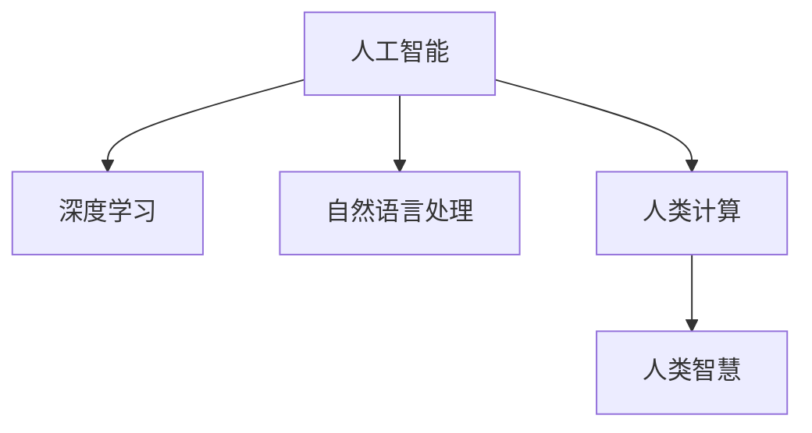

                 

# 创造更美好的世界：人类计算的终极目标

## 1. 背景介绍

在人类历史的漫漫长河中，计算技术的演进似乎一直是推动社会进步的强大动力。从早期的算盘、手摇机到后来的机械计算器、电算机，每一次技术革新都极大地促进了生产力发展，改变了人们的生活方式。而到了今天，以人工智能为代表的计算技术已经渗透到社会的每一个角落，为人类创造了前所未有的福祉。

人工智能（Artificial Intelligence, AI），顾名思义，是指模拟人类智能的机器系统。它涵盖了语音识别、图像识别、自然语言处理（Natural Language Processing, NLP）、自动驾驶、智能推荐等多个领域。其中，以深度学习为基础的神经网络模型已经成为AI的重要支柱，而人类计算的终极目标，正是在于构建一个更加智能化、普适化、人性化的人工智能系统，使人类生活更加便捷、高效、安全、健康。

本文将从计算技术的演进、人类计算的现状与挑战、人工智能的使命与未来三个方面进行深入探讨，为读者勾勒出人类计算的终极目标。

## 2. 核心概念与联系

### 2.1 核心概念概述

要理解人类计算的终极目标，首先需要明确一些核心概念。

- **人工智能**：通过机器学习、数据挖掘、模式识别等技术，使机器具备类似于人类的智能行为。
- **深度学习**：一种基于多层神经网络的前馈算法，通过反向传播训练模型，以获取数据中的复杂非线性关系。
- **自然语言处理**：使机器能够理解、处理和生成自然语言，是人工智能中技术最成熟、应用最广泛的领域之一。
- **人类计算**：在计算机和网络等技术手段的辅助下，人类能够进行大规模、高效的计算和数据分析，从而实现更大范围的智能决策。
- **人类智慧**：指人类在长期演化过程中积累的认知、推理、情感、创造等智能能力，是人类计算的最终归宿。

这些概念之间的关系如下图所示：



深度学习是实现人工智能的关键技术之一，而自然语言处理则是人类计算的重要组成部分。通过人工智能和深度学习的技术，机器能够理解和处理人类的语言，进而辅助人类完成各种计算任务，实现人类智慧的进一步提升。人类计算则是在人类智慧的指导下，利用计算技术进行大规模的数据分析和决策，最终推动社会进步。

### 2.2 核心概念原理和架构的 Mermaid 流程图

以下是一个简单的 Mermaid 流程图，展示了从深度学习到人类计算再到人类智慧的技术演进路径：


这个流程图说明了数据从采集、预处理、训练、评估到部署的全流程，以及如何通过人类计算和决策支持，最终提升社会应用的效率和效果。

## 3. 核心算法原理 & 具体操作步骤

### 3.1 算法原理概述

人类计算的终极目标，是通过人工智能技术，将人类智慧转化为可执行的计算能力，并应用于更广泛的领域，提升人类的生活品质。这一目标的实现，离不开深度学习和人类计算的协同工作。

深度学习通过神经网络模型，模拟人类大脑的神经元网络，从而实现对数据的深度分析和处理。而人类计算则通过大规模的数据分析和计算，辅助机器进行更智能的决策。这些算法的核心原理可以概括为以下几点：

1. **神经网络模型**：通过多层神经元的非线性变换，实现对复杂数据的深度学习和建模。
2. **反向传播算法**：通过计算损失函数对网络参数的梯度，反向传播更新参数，优化模型性能。
3. **自监督学习**：利用无标签数据进行预训练，提取通用特征，从而提高模型的泛化能力。
4. **对抗学习**：通过引入对抗样本，提高模型的鲁棒性和泛化能力。
5. **迁移学习**：通过将已有模型的知识迁移到新任务上，提高模型的泛化能力和学习效率。

### 3.2 算法步骤详解

实现人类计算的终极目标，需要遵循以下几个关键步骤：

1. **数据采集和预处理**：从各种来源获取数据，并进行清洗、标注、归一化等预处理，为后续计算提供数据基础。

2. **模型训练和评估**：通过深度学习模型对数据进行训练，使用验证集评估模型性能，选择合适的超参数。

3. **模型部署和优化**：将训练好的模型部署到实际应用中，进行实时计算和推理。根据实际应用场景，优化模型结构，提升计算效率。

4. **社会应用和反馈**：将优化后的模型应用于社会各个领域，如医疗、金融、教育等，通过反馈机制不断改进模型，提升社会应用效果。

5. **持续学习**：随着数据和应用的不断变化，模型需要不断学习和更新，保持最新的计算能力。

### 3.3 算法优缺点

深度学习和人类计算的结合，可以显著提升计算效率和精度，但也存在一些局限性：

**优点**：
- **处理能力强大**：深度学习模型能够处理海量的数据，挖掘出数据中的复杂关系。
- **应用广泛**：深度学习模型可以应用于多个领域，如语音识别、图像识别、自然语言处理等。
- **高效性**：通过并行计算和分布式处理，可以大幅提高计算速度和效率。

**缺点**：
- **数据依赖性强**：模型的性能很大程度上依赖于数据的质量和数量，高质量的数据获取成本较高。
- **可解释性差**：深度学习模型通常被称为"黑盒"，难以解释其内部工作机制。
- **资源消耗大**：深度学习模型参数量大，计算资源需求高，需要高性能的硬件设备支持。
- **易过拟合**：在数据量不足或标注质量不高的情况下，模型容易发生过拟合，泛化能力下降。

### 3.4 算法应用领域

深度学习和人类计算的应用领域非常广泛，涉及医疗、金融、教育、交通等多个行业。以下是几个典型的应用场景：

1. **医疗诊断**：通过深度学习模型分析医学影像、病历等数据，辅助医生进行疾病诊断和治疗决策。
2. **金融风控**：利用深度学习模型对金融数据进行分析，预测市场趋势，识别风险点，进行智能风控。
3. **教育个性化**：通过深度学习模型分析学生行为数据，进行学习推荐、作业批改、智能辅导等，实现个性化教育。
4. **交通管理**：利用深度学习模型分析交通数据，进行实时调度、异常检测、流量预测等，提升交通管理效率。
5. **智能推荐**：通过深度学习模型分析用户行为数据，进行商品推荐、内容推荐、广告推荐等，提升用户体验。

## 4. 数学模型和公式 & 详细讲解 & 举例说明

### 4.1 数学模型构建

人类计算的核心在于通过数学模型将复杂的现实问题转化为可计算的形式。以下是一些典型的数学模型：

1. **线性回归模型**：用于预测连续型变量的数学模型，广泛应用于数据分析和预测。
2. **逻辑回归模型**：用于分类问题的数学模型，广泛应用于文本分类、情感分析等。
3. **卷积神经网络**：用于图像处理和识别的数学模型，通过卷积操作提取图像特征。
4. **循环神经网络**：用于序列数据处理的数学模型，通过循环结构保持时间序列信息的连续性。
5. **生成对抗网络**：用于生成任务的数学模型，通过两个网络（生成器和判别器）协同训练，生成高质量的数据。

### 4.2 公式推导过程

以线性回归模型为例，其公式推导如下：

设有一组样本数据 $(x_i, y_i), i=1,2,\ldots,n$，其中 $x_i$ 为输入变量，$y_i$ 为输出变量。线性回归模型的目标是最小化损失函数 $L$，得到最优参数 $\theta$：

$$
\theta^* = \mathop{\arg\min}_{\theta} \sum_{i=1}^n (y_i - \theta^T x_i)^2
$$

通过对 $L$ 求导，可以得到参数 $\theta$ 的更新公式：

$$
\theta = \mathop{\arg\min}_{\theta} \frac{1}{2n} \sum_{i=1}^n (y_i - \theta^T x_i)^2
$$

通过梯度下降算法，不断迭代更新 $\theta$，直到损失函数收敛。

### 4.3 案例分析与讲解

以下是一个简单的线性回归案例，展示了如何利用Python和TensorFlow实现线性回归模型，并评估其性能：

```python
import tensorflow as tf
import numpy as np
from sklearn.datasets import load_boston
from sklearn.model_selection import train_test_split

# 加载波士顿房价数据集
data = load_boston()
X = data.data
y = data.target

# 划分训练集和测试集
X_train, X_test, y_train, y_test = train_test_split(X, y, test_size=0.2, random_state=42)

# 构建线性回归模型
model = tf.keras.models.Sequential([
    tf.keras.layers.Dense(1, input_shape=(X_train.shape[1],))
])

# 编译模型
model.compile(optimizer=tf.keras.optimizers.SGD(learning_rate=0.01), loss='mse')

# 训练模型
model.fit(X_train, y_train, epochs=100, batch_size=32, validation_split=0.2)

# 评估模型
mse = tf.keras.metrics.MeanSquaredError()
y_pred = model.predict(X_test)
mse(y_test, y_pred).numpy()
```

在实际应用中，通过调整模型结构、学习率、批次大小等参数，可以进一步优化模型的性能。

## 5. 项目实践：代码实例和详细解释说明

### 5.1 开发环境搭建

在进行项目实践前，首先需要搭建开发环境。以下是一些常用的开发环境配置：

1. **Python环境**：
   - 使用Anaconda创建虚拟环境，安装必要的依赖库，如TensorFlow、Keras、Pandas、Numpy等。
   - 配置环境变量，使Python脚本能够在不同操作系统上运行。

2. **GPU环境**：
   - 安装NVIDIA驱动，安装CUDA和cuDNN库。
   - 安装GPU版本的TensorFlow，配置环境变量，使用GPU进行计算。

3. **分布式环境**：
   - 使用Spark、Hadoop等分布式计算框架，将数据和模型分布式存储和计算，提升计算效率。
   - 配置Slurm等任务调度系统，自动化管理计算资源。

### 5.2 源代码详细实现

以下是一个简单的图像分类项目，展示如何使用TensorFlow实现卷积神经网络（Convolutional Neural Network, CNN），并进行模型训练和评估：

```python
import tensorflow as tf
from tensorflow.keras import datasets, layers, models

# 加载数据集
(train_images, train_labels), (test_images, test_labels) = datasets.cifar10.load_data()

# 归一化数据
train_images, test_images = train_images / 255.0, test_images / 255.0

# 构建模型
model = models.Sequential()
model.add(layers.Conv2D(32, (3, 3), activation='relu', input_shape=(32, 32, 3)))
model.add(layers.MaxPooling2D((2, 2)))
model.add(layers.Conv2D(64, (3, 3), activation='relu'))
model.add(layers.MaxPooling2D((2, 2)))
model.add(layers.Conv2D(64, (3, 3), activation='relu'))
model.add(layers.Flatten())
model.add(layers.Dense(64, activation='relu'))
model.add(layers.Dense(10))

# 编译模型
model.compile(optimizer='adam', loss=tf.keras.losses.SparseCategoricalCrossentropy(from_logits=True), metrics=['accuracy'])

# 训练模型
history = model.fit(train_images, train_labels, epochs=10, validation_data=(test_images, test_labels))

# 评估模型
test_loss, test_acc = model.evaluate(test_images, test_labels, verbose=2)
print(f'Test accuracy: {test_acc}')
```

在实际应用中，通过调整网络结构、超参数、优化器等，可以进一步优化模型的性能。

### 5.3 代码解读与分析

以下是代码中几个关键部分的解读：

1. **数据加载和预处理**：
   - 使用`datasets.cifar10.load_data()`加载CIFAR-10数据集，包括60000张32x32的彩色图像和60000个标签。
   - 将数据归一化到[0,1]区间，以避免梯度消失问题。

2. **模型构建**：
   - 使用`Sequential`模型，添加多个卷积层和全连接层。
   - 使用`Conv2D`和`MaxPooling2D`进行卷积和池化操作，提取图像特征。
   - 使用`Flatten`将卷积层的输出展平，连接全连接层进行分类。

3. **模型编译和训练**：
   - 使用`compile`方法编译模型，指定优化器、损失函数和评估指标。
   - 使用`fit`方法训练模型，指定训练数据、批次大小、迭代次数等参数。
   - 使用`evaluate`方法评估模型性能，输出准确率和损失。

### 5.4 运行结果展示

在训练过程中，可以使用TensorBoard等工具可视化模型的训练和评估过程，如损失曲线、准确率曲线等。

```python
# 启动TensorBoard日志记录
from tensorboard import SummaryWriter

writer = SummaryWriter()

# 记录训练数据
writer.add_graph(model.summary())
for i, (batch_images, batch_labels) in enumerate(train_dataset):
    with writer.as_default():
        writer.add_graph(model, batch_images)
        writer.add_scalar('loss', loss, i)
        writer.add_scalar('accuracy', accuracy, i)
```

## 6. 实际应用场景

### 6.1 医疗诊断

在医疗领域，深度学习和人类计算的应用已经得到广泛应用。通过深度学习模型对医学影像、病历等数据进行分析，可以辅助医生进行疾病诊断和治疗决策。例如，利用卷积神经网络对X光片进行肺结节检测，可以大幅提升医生的诊断效率和准确率。

### 6.2 金融风控

在金融领域，深度学习模型可以用于风险评估、市场预测等。例如，利用循环神经网络对历史交易数据进行建模，可以预测股票价格的波动，识别潜在的风险点，从而辅助金融决策。

### 6.3 教育个性化

在教育领域，深度学习模型可以用于个性化推荐、智能辅导等。例如，利用推荐系统根据学生的学习行为和兴趣推荐课程和作业，可以提升学生的学习效果和积极性。

### 6.4 交通管理

在交通领域，深度学习模型可以用于交通流量预测、异常检测等。例如，利用循环神经网络对实时交通数据进行建模，可以预测交通流量变化，及时调整交通信号灯，提升交通管理效率。

## 7. 工具和资源推荐

### 7.1 学习资源推荐

为了帮助开发者系统掌握深度学习和人类计算的理论基础和实践技巧，这里推荐一些优质的学习资源：

1. **《深度学习》书籍**：Ian Goodfellow等著，全面介绍了深度学习的理论基础和实际应用，是深度学习领域的经典教材。
2. **《TensorFlow实战Google深度学习》书籍**：Manning等著，介绍了TensorFlow的基本用法和深度学习模型的实现，适合入门学习。
3. **Coursera《深度学习专项课程》**：由Andrew Ng等顶尖学者授课，涵盖了深度学习的基础理论和应用实践。
4. **Kaggle**：全球最大的数据科学竞赛平台，提供丰富的数据集和挑战，可以实践深度学习模型的开发和优化。
5. **Arxiv**：全球最大的学术论文预印本平台，提供最新的深度学习研究成果和论文，可以跟踪前沿进展。

通过学习这些资源，相信你一定能够快速掌握深度学习和人类计算的核心技术，并应用于实际问题中。

### 7.2 开发工具推荐

高效的开发离不开优秀的工具支持。以下是几款用于深度学习和人类计算开发的常用工具：

1. **TensorFlow**：由Google主导开发的开源深度学习框架，生产部署方便，适合大规模工程应用。
2. **PyTorch**：由Facebook开发的开源深度学习框架，灵活性高，适合研究和原型开发。
3. **MXNet**：由亚马逊开发的开源深度学习框架，支持多种编程语言和分布式计算，适合大规模应用。
4. **Keras**：基于TensorFlow和Theano的高级API，简单易用，适合快速原型开发和部署。
5. **Jupyter Notebook**：基于Web的交互式编程环境，适合进行数据探索、模型开发和实验记录。

合理利用这些工具，可以显著提升深度学习和人类计算的开发效率，加快创新迭代的步伐。

### 7.3 相关论文推荐

深度学习和人类计算的研究源于学界的持续研究。以下是几篇奠基性的相关论文，推荐阅读：

1. **AlexNet**：深度学习在图像分类任务上的突破性进展，推动了深度学习的发展。
2. **InceptionNet**：提出了Inception模块，提高了深度学习模型的计算效率和性能。
3. **ResNet**：解决了深度神经网络中的梯度消失问题，使网络更深更广。
4. **BERT**：提出了预训练语言模型BERT，为自然语言处理提供了强大的模型基础。
5. **TFAugment**：提出了数据增强技术，扩充训练集规模，提高模型泛化能力。

这些论文代表了大深度学习和人类计算的发展脉络。通过学习这些前沿成果，可以帮助研究者把握学科前进方向，激发更多的创新灵感。

## 8. 总结：未来发展趋势与挑战

### 8.1 研究成果总结

深度学习和人类计算的发展已经取得了显著进展，以下是对这一领域的综合总结：

1. **技术进步**：深度学习模型在多个领域取得了突破性进展，推动了人工智能技术的应用和发展。
2. **应用广泛**：深度学习和人类计算已经广泛应用于医疗、金融、教育、交通等领域，推动了行业数字化转型。
3. **技术融合**：深度学习与自然语言处理、计算机视觉、语音识别等技术的融合，提升了模型的应用能力。
4. **数据驱动**：深度学习模型的性能很大程度上依赖于数据的质量和数量，数据驱动的创新成为了新的趋势。

### 8.2 未来发展趋势

展望未来，深度学习和人类计算将呈现以下几个发展趋势：

1. **多模态计算**：将视觉、语音、文本等多种模态的数据进行融合，提升模型的应用能力。
2. **模型解释性**：通过可解释性技术，提高模型的透明性和可解释性，增强用户信任。
3. **联邦学习**：通过分布式计算，在保护数据隐私的前提下，提升模型的计算效率和泛化能力。
4. **模型压缩**：通过模型压缩、稀疏化等技术，降低模型的计算资源需求，提升计算效率。
5. **模型优化**：通过自动机器学习（AutoML）等技术，优化模型的超参数和结构，提高计算效率和性能。

### 8.3 面临的挑战

尽管深度学习和人类计算已经取得了显著进展，但在迈向更加智能化、普适化应用的过程中，仍面临诸多挑战：

1. **数据获取**：高质量数据的获取成本较高，数据分布不均衡等问题限制了深度学习模型的应用。
2. **模型可解释性**：深度学习模型通常被称为"黑盒"，难以解释其内部工作机制，影响用户信任。
3. **资源消耗**：深度学习模型参数量大，计算资源需求高，需要高性能的硬件设备支持。
4. **隐私保护**：深度学习模型的训练需要大量的数据，如何保护用户隐私成为了新的挑战。

### 8.4 研究展望

面对深度学习和人类计算所面临的种种挑战，未来的研究需要在以下几个方面寻求新的突破：

1. **无监督学习**：利用无标签数据进行预训练，减少对标注数据的依赖。
2. **迁移学习**：通过迁移学习技术，提升模型的泛化能力和学习效率。
3. **多模态融合**：将视觉、语音、文本等多种模态的数据进行融合，提升模型的应用能力。
4. **模型压缩**：通过模型压缩、稀疏化等技术，降低模型的计算资源需求，提升计算效率。
5. **隐私保护**：采用联邦学习等技术，保护用户隐私，提升数据安全。

这些研究方向将推动深度学习和人类计算的进一步发展，为构建更智能、普适、安全的人工智能系统铺平道路。相信随着技术的不断进步，深度学习和人类计算将带来更多颠覆性的变革，为人类的生产生活带来更深远的影响。

## 9. 附录：常见问题与解答

**Q1：深度学习是否存在过拟合的问题？**

A: 深度学习模型在训练过程中容易发生过拟合，特别是当数据量不足或标注质量不高时。为了缓解过拟合，可以采用正则化、Dropout等技术。

**Q2：人类计算的终极目标是什么？**

A: 人类计算的终极目标是通过人工智能技术，将人类智慧转化为可执行的计算能力，并应用于更广泛的领域，提升人类的生活品质。

**Q3：深度学习模型的训练时间为何如此漫长？**

A: 深度学习模型的参数量通常很大，计算资源需求高，因此训练时间较长。为了加速训练，可以采用分布式计算、混合精度训练等技术。

**Q4：如何解释深度学习模型的预测结果？**

A: 深度学习模型通常被称为"黑盒"，难以解释其内部工作机制。为了提高模型的可解释性，可以采用特征可视化、可解释性算法等技术。

**Q5：深度学习模型的应用前景如何？**

A: 深度学习模型在多个领域取得了突破性进展，广泛应用于医疗、金融、教育、交通等领域，推动了行业数字化转型。未来，深度学习模型将有更广阔的应用前景。

---

作者：禅与计算机程序设计艺术 / Zen and the Art of Computer Programming

