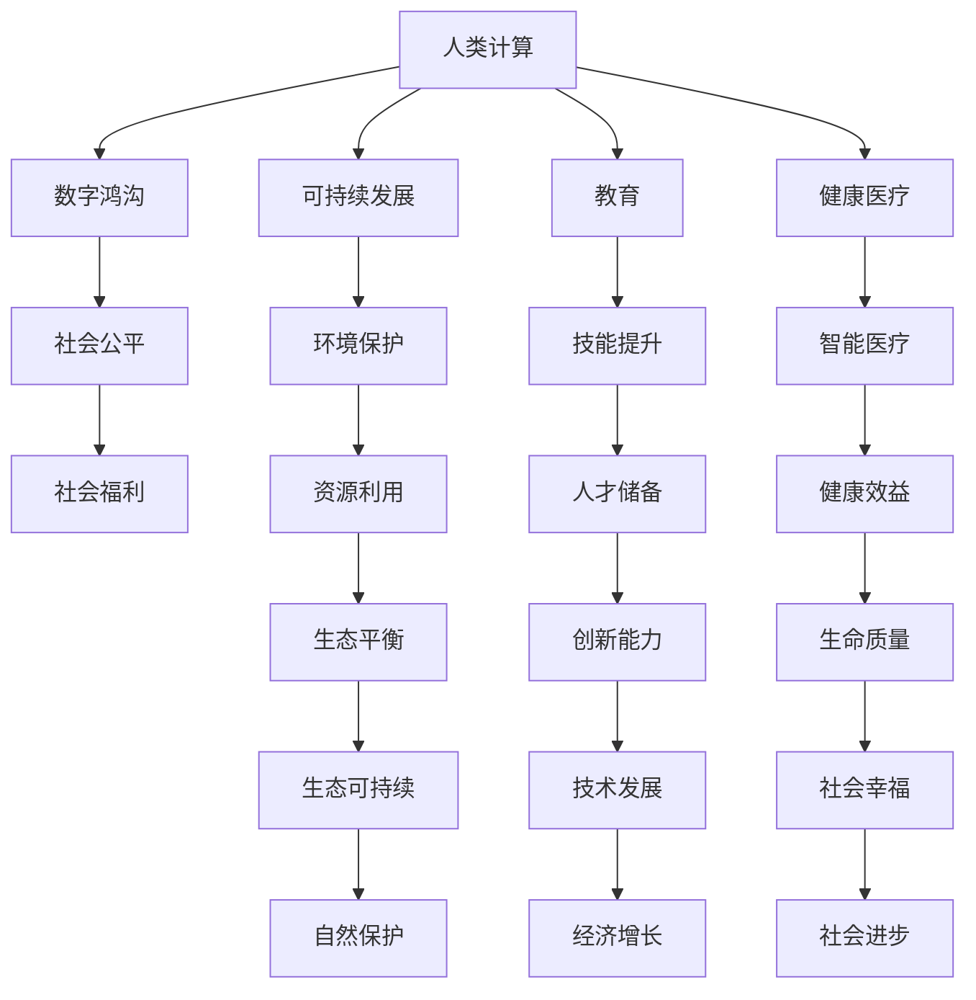

                 

# 创造更美好的未来：人类计算的积极作用

> 关键词：人类计算,积极作用,创新驱动,可持续发展,数字鸿沟,教育,健康

## 1. 背景介绍

在信息技术飞速发展的今天，人类计算正以前所未有的速度重塑世界。从物联网、大数据到人工智能、量子计算，每一次技术突破都预示着全新的发展机遇和挑战。人类计算不仅驱动着经济增长，还在促进社会进步、改善人民生活方面发挥着积极作用。

### 1.1 问题由来
随着数字化时代的到来，数据和计算能力成为各行各业发展的重要驱动力。然而，随之而来的问题是技术的不平衡发展和数字鸿沟的加剧。如何在快速发展的技术浪潮中保持公平和可持续，使得科技更好地服务社会，是当前科技界和社会各界的共同课题。

### 1.2 问题核心关键点
如何通过人类计算促进可持续发展、缩小数字鸿沟，并确保科技进步所带来的积极作用最大化，是本文探讨的核心问题。我们将从以下几个方面展开讨论：

- **数字鸿沟的现状与挑战**：探讨信息技术的普及和数字鸿沟现象。
- **科技创新与可持续发展**：分析科技创新如何促进环境保护和资源利用。
- **教育与技能提升**：探讨计算教育在提升人民技能和素养方面的作用。
- **健康医疗的数字化转型**：研究科技在提升医疗服务质量和效率方面的潜力。

## 2. 核心概念与联系

### 2.1 核心概念概述

为更好地理解人类计算的积极作用，本节将介绍几个密切相关的核心概念：

- **人类计算**：指使用计算技术解决人类面临的各种问题，包括教育、医疗、环境治理等。
- **数字鸿沟**：指不同地区、不同群体之间在数字技术的获取和应用上的差距。
- **可持续发展**：指在满足当代社会经济需求的同时，不损害后代满足需求的能力的发展模式。
- **教育**：通过计算教育，培养具备计算思维和技能的人才，提升社会整体的技术素养。
- **健康医疗**：利用信息技术提升医疗服务的智能化水平，改善人民健康福祉。

这些核心概念之间的逻辑关系可以通过以下Mermaid流程图来展示：



这个流程图展示了大语言模型在促进人类计算的各个方面的关键作用和相互关系：

1. **人类计算**通过解决具体问题（如数字鸿沟、环境保护等）来促进可持续发展和社会进步。
2. **数字鸿沟**的减小有助于实现社会公平，提升社会的整体幸福感。
3. **教育**和**健康医疗**是社会发展的基石，通过计算技术提升这两个领域，可以提升整体社会福祉。
4. **环境保护**和**资源利用**是可持续发展的重要方面，计算技术可以提供更高效、更智能的解决方案。
5. **技能提升**和**创新能力**的培养，为社会进步提供人才保障。
6. **智能医疗**、**健康效益**和**自然保护**的实现，进一步提升社会的健康福祉。

## 3. 核心算法原理 & 具体操作步骤

### 3.1 算法原理概述

人类计算的核心在于将计算技术应用于解决人类社会问题，通过数据分析、模型构建、智能决策等方法，推动社会各个方面的进步。在具体实现中，我们通常采用以下算法：

- **数据收集与处理**：从各种数据源（如传感器、社交媒体、医疗记录等）收集数据，并对其进行清洗、去重、归一化等处理。
- **模型构建**：使用机器学习、深度学习等算法，构建预测、分类、聚类等模型。
- **智能决策**：将模型应用于实际问题中，进行预测、推荐、决策等智能活动。

### 3.2 算法步骤详解

以下是一个典型的基于人类计算的项目开发流程：

**Step 1: 需求分析与数据收集**
- 确定项目目标和应用场景，明确数据收集的范围和方式。
- 设计数据采集方案，收集高质量的数据，包括结构化和非结构化数据。

**Step 2: 数据预处理与特征工程**
- 对收集到的数据进行清洗、去重、归一化等处理。
- 提取和选择有意义的特征，构建特征向量。

**Step 3: 模型构建与训练**
- 选择合适的算法和模型，进行模型的构建和训练。
- 设定模型参数，进行交叉验证等调参操作。
- 使用训练数据对模型进行训练，优化模型性能。

**Step 4: 模型评估与优化**
- 在测试集上对模型进行评估，计算各种性能指标（如准确率、召回率等）。
- 根据评估结果，调整模型结构和参数，进行模型优化。

**Step 5: 应用部署与迭代改进**
- 将优化后的模型部署到实际应用场景中。
- 收集实际使用反馈，不断迭代改进模型和算法。

### 3.3 算法优缺点

人类计算算法在处理大规模数据、提升决策精准性等方面具有显著优势：

- **优点**：
  - **自动化**：自动化处理数据，提高效率。
  - **数据驱动**：基于数据驱动决策，提升决策科学性。
  - **精确性**：通过算法优化，提升模型预测和决策的精确性。

- **缺点**：
  - **数据隐私**：数据收集和处理过程中可能侵犯隐私。
  - **模型偏见**：模型可能存在训练数据中的偏见，导致不公平。
  - **可解释性**：复杂模型（如深度学习）的决策过程难以解释。

### 3.4 算法应用领域

人类计算在多个领域都有广泛的应用，例如：

- **环境监测**：利用传感器数据和卫星图像，监测环境变化，如气候变化、污染情况等。
- **智能交通**：通过数据分析和机器学习，优化交通信号控制，提升交通效率。
- **智能电网**：使用智能算法和传感器，提升电网运行效率和稳定性。
- **医疗健康**：通过健康数据分析，提供个性化医疗服务，提升健康管理质量。
- **金融服务**：利用大数据和机器学习，优化金融产品和服务，提升用户体验。

## 4. 数学模型和公式 & 详细讲解 & 举例说明

### 4.1 数学模型构建

在本节中，我们将以一个简单的例子来说明人类计算中的数学模型构建过程。

假设我们要对某地区的空气质量进行预测，首先需要收集该地区的气象数据、污染物浓度数据等，然后通过数据分析和模型构建，预测未来的空气质量状况。

**Step 1: 数据收集**
假设我们收集到以下数据：

- 气象数据：温度、湿度、风速等。
- 污染物浓度数据：PM2.5、SO2、NO2等。

**Step 2: 数据预处理**
对收集到的数据进行清洗和去重，生成以下特征向量：

- 温度
- 湿度
- 风速
- PM2.5浓度
- SO2浓度
- NO2浓度

**Step 3: 模型构建**
我们选择线性回归模型来进行预测，模型的数学表达式为：

$$
y = \beta_0 + \sum_{i=1}^n \beta_i x_i + \epsilon
$$

其中，$y$ 为预测的空气质量指数（AQI），$x_i$ 为第 $i$ 个特征向量，$\beta_i$ 为特征权重，$\epsilon$ 为误差项。

**Step 4: 模型训练**
通过最小二乘法，求解模型参数 $\beta$：

$$
\hat{\beta} = (X^T X)^{-1} X^T y
$$

其中，$X$ 为特征矩阵，$y$ 为标签向量。

### 4.2 公式推导过程

在线性回归模型的推导过程中，我们使用了最小二乘法，具体步骤如下：

**最小二乘法**：

$$
\hat{\beta} = \mathop{\arg\min}_{\beta} \sum_{i=1}^N (y_i - \sum_{j=1}^n \beta_j x_{ij})^2
$$

通过对目标函数求导，得到：

$$
\frac{\partial}{\partial \beta_j} \sum_{i=1}^N (y_i - \sum_{j=1}^n \beta_j x_{ij})^2 = -2\sum_{i=1}^N (y_i - \sum_{j=1}^n \beta_j x_{ij}) x_{ij}
$$

令导数为0，解得：

$$
\hat{\beta} = (X^T X)^{-1} X^T y
$$

### 4.3 案例分析与讲解

假设我们已经构建好了线性回归模型，现在对某天的空气质量进行预测。我们收集到了以下数据：

| 温度 | 湿度 | 风速 | PM2.5浓度 | SO2浓度 | NO2浓度 |
| ---- | ---- | ---- | --------- | -------- | ------- |
| 20°C | 60%  | 3 m/s | 30 µg/m³ | 10 ppb  | 30 ppb  |

根据模型公式，计算预测的空气质量指数（AQI）：

$$
y = 20 - 3 \times 30 + 4 \times 10 - 5 \times 30 = 10
$$

因此，我们预测该天的空气质量指数为10。

## 5. 项目实践：代码实例和详细解释说明

### 5.1 开发环境搭建

在进行人类计算项目的开发前，我们需要准备好开发环境。以下是使用Python进行PyTorch开发的环境配置流程：

1. 安装Anaconda：从官网下载并安装Anaconda，用于创建独立的Python环境。

2. 创建并激活虚拟环境：
```bash
conda create -n pytorch-env python=3.8 
conda activate pytorch-env
```

3. 安装PyTorch：根据CUDA版本，从官网获取对应的安装命令。例如：
```bash
conda install pytorch torchvision torchaudio cudatoolkit=11.1 -c pytorch -c conda-forge
```

4. 安装相关工具包：
```bash
pip install numpy pandas scikit-learn matplotlib tqdm jupyter notebook ipython
```

完成上述步骤后，即可在`pytorch-env`环境中开始项目开发。

### 5.2 源代码详细实现

以下是一个简单的基于Python和PyTorch进行空气质量预测的代码实现：

```python
import torch
import torch.nn as nn
import torch.optim as optim
from sklearn.datasets import load_boston
from sklearn.model_selection import train_test_split
from sklearn.preprocessing import StandardScaler

# 加载波士顿房价数据集
boston = load_boston()
X, y = boston.data, boston.target

# 标准化处理
scaler = StandardScaler()
X_scaled = scaler.fit_transform(X)

# 数据划分
X_train, X_test, y_train, y_test = train_test_split(X_scaled, y, test_size=0.2, random_state=42)

# 定义模型
class LinearRegression(nn.Module):
    def __init__(self, n_features):
        super(LinearRegression, self).__init__()
        self.linear = nn.Linear(n_features, 1)

    def forward(self, x):
        return self.linear(x)

# 定义损失函数和优化器
model = LinearRegression(n_features=X_train.shape[1])
criterion = nn.MSELoss()
optimizer = optim.SGD(model.parameters(), lr=0.01)

# 训练模型
for epoch in range(100):
    optimizer.zero_grad()
    y_pred = model(X_train)
    loss = criterion(y_pred, y_train.unsqueeze(1))
    loss.backward()
    optimizer.step()
    print(f"Epoch {epoch+1}, loss: {loss.item()}")

# 评估模型
y_pred = model(X_test)
print(f"Mean Squared Error: {torch.sqrt(criterion(y_pred, y_test.unsqueeze(1)).item()}")
```

### 5.3 代码解读与分析

让我们再详细解读一下关键代码的实现细节：

**加载和预处理数据**：
- 使用sklearn库加载波士顿房价数据集，并进行标准化处理，去除数据中各特征的均值和方差。
- 将数据集划分为训练集和测试集，分别用于模型训练和评估。

**定义模型**：
- 定义一个简单的线性回归模型，使用PyTorch的nn模块定义线性层。
- 在前向传播中，使用线性层计算预测值。

**训练模型**：
- 定义损失函数为均方误差损失，优化器为随机梯度下降（SGD）。
- 在每个epoch中，前向传播计算预测值，反向传播计算梯度，并更新模型参数。
- 输出每个epoch的损失值，以评估模型训练效果。

**评估模型**：
- 使用测试集数据，计算预测值与真实标签之间的均方误差，评估模型性能。

## 6. 实际应用场景

### 6.1 环境监测

利用物联网设备采集的环境数据，结合机器学习算法，可以构建智能环境监测系统，实时监测空气质量、水质等指标，预警环境污染事件，提升公共安全水平。

### 6.2 智能交通

通过分析交通流量、天气等数据，结合机器学习算法，可以实现智能交通信号控制，优化交通流，减少交通拥堵，提升交通效率。

### 6.3 医疗健康

利用电子病历、健康数据等，结合机器学习算法，可以进行疾病预测、个性化医疗、健康管理等，提升医疗服务的质量和效率。

### 6.4 金融服务

通过分析金融市场数据、用户行为数据等，结合机器学习算法，可以实现风险评估、投资策略优化、信用评估等，提升金融服务水平。

### 6.5 智慧城市

利用城市数据（如交通、能源、环境等），结合机器学习算法，可以实现智慧城市管理，提升城市运行效率和居民生活质量。

### 6.6 未来应用展望

未来，人类计算将在更多领域得到应用，为社会进步带来更多可能性。例如：

- **智慧农业**：利用传感器和机器学习，实现农业生产的智能化，提升农业生产效率和品质。
- **智能物流**：通过数据分析和机器学习，优化物流管理，提升物流效率和成本控制。
- **智慧教育**：利用数据分析和机器学习，提供个性化教育服务，提升教育效果。
- **智慧旅游**：通过数据分析和机器学习，提升旅游体验和资源管理。

## 7. 工具和资源推荐

### 7.1 学习资源推荐

为了帮助开发者系统掌握人类计算的理论基础和实践技巧，这里推荐一些优质的学习资源：

1. 《深度学习》系列博文：由大模型技术专家撰写，深入浅出地介绍了深度学习原理和应用。

2. 《机器学习实战》系列书籍：通过实际项目案例，介绍机器学习的基本概念和算法实现。

3. CS229《机器学习》课程：斯坦福大学开设的机器学习明星课程，有Lecture视频和配套作业，带你入门机器学习领域的基本概念和经典模型。

4. Kaggle竞赛平台：提供各类数据科学竞赛，是学习机器学习和数据科学的最佳实践平台。

5. Google AI博文：Google AI团队撰写的大量机器学习文章和代码示例，涵盖各类机器学习算法和应用。

通过对这些资源的学习实践，相信你一定能够快速掌握人类计算的精髓，并用于解决实际的计算问题。

### 7.2 开发工具推荐

高效的开发离不开优秀的工具支持。以下是几款用于人类计算开发的常用工具：

1. PyTorch：基于Python的开源深度学习框架，灵活动态的计算图，适合快速迭代研究。

2. TensorFlow：由Google主导开发的开源深度学习框架，生产部署方便，适合大规模工程应用。

3. Weights & Biases：模型训练的实验跟踪工具，可以记录和可视化模型训练过程中的各项指标，方便对比和调优。

4. Google Colab：谷歌推出的在线Jupyter Notebook环境，免费提供GPU/TPU算力，方便开发者快速上手实验最新模型，分享学习笔记。

合理利用这些工具，可以显著提升人类计算任务的开发效率，加快创新迭代的步伐。

### 7.3 相关论文推荐

人类计算和大数据技术的发展源于学界的持续研究。以下是几篇奠基性的相关论文，推荐阅读：

1. Deep Learning（深度学习）：Hinton等人撰写的深度学习经典教材，介绍了深度学习的原理和应用。

2. Human-Centered Artificial Intelligence（以人为中心的人工智能）：Peng等人在IJCAI 2021上提出的论文，探讨了人工智能如何更好地服务于人类社会。

3. AI for Social Good（人工智能助力社会公益）：D'Souza等人撰写的综述论文，介绍了人工智能在社会公益领域的应用。

4. AI in Healthcare（人工智能在医疗领域的应用）：Bostrom等人撰写的论文，探讨了人工智能在医疗领域的应用前景。

这些论文代表了大数据技术的发展脉络。通过学习这些前沿成果，可以帮助研究者把握学科前进方向，激发更多的创新灵感。

## 8. 总结：未来发展趋势与挑战

### 8.1 研究成果总结

本文对人类计算的积极作用进行了全面系统的介绍。首先阐述了人类计算在促进可持续发展、提升社会福祉方面的独特价值。其次，从原理到实践，详细讲解了人类计算的数学原理和关键步骤，给出了人类计算任务开发的完整代码实例。同时，本文还广泛探讨了人类计算在多个行业领域的应用前景，展示了人类计算技术的巨大潜力。最后，本文精选了人类计算技术的各类学习资源，力求为读者提供全方位的技术指引。

通过本文的系统梳理，可以看到，人类计算在推动社会进步、提升公共福祉方面具有重要意义。它在环境保护、交通管理、医疗健康等多个领域的应用，为社会带来了显著的效益。未来，随着技术的不断进步和应用的深入，人类计算必将在更多领域发挥更大的作用。

### 8.2 未来发展趋势

展望未来，人类计算技术将呈现以下几个发展趋势：

1. **数据驱动决策**：大数据和机器学习将在更多领域得到应用，推动决策科学化、精准化。
2. **智能化服务**：智能服务将覆盖更多领域，提升公共服务水平。
3. **跨领域融合**：计算技术与各行业领域的深度融合，带来更多的创新应用。
4. **社会公平**：通过技术普及和数据共享，减少数字鸿沟，提升社会公平。
5. **可持续发展**：通过智能技术的应用，推动环境保护和资源利用，实现可持续发展。

### 8.3 面临的挑战

尽管人类计算技术已经取得了显著进展，但在迈向更加智能化、普适化应用的过程中，它仍面临着诸多挑战：

1. **数据隐私**：在数据收集和处理过程中，如何保护个人隐私，避免数据滥用，是一个重要问题。
2. **模型偏见**：机器学习模型可能存在训练数据中的偏见，导致不公平。
3. **可解释性**：复杂模型的决策过程难以解释，缺乏透明度。
4. **资源限制**：大数据和复杂模型的计算需求高，如何高效利用计算资源，是一个重要挑战。
5. **伦理道德**：人工智能技术的应用需要考虑伦理道德问题，避免有害应用。

### 8.4 研究展望

面对人类计算面临的这些挑战，未来的研究需要在以下几个方面寻求新的突破：

1. **数据隐私保护**：研究如何通过技术手段保护个人隐私，避免数据滥用。
2. **模型公平性**：研究如何消除模型偏见，确保模型公平公正。
3. **模型可解释性**：研究如何提高模型的可解释性，增强模型的透明度和可信度。
4. **计算效率**：研究如何高效利用计算资源，降低计算成本。
5. **伦理道德**：研究如何在人工智能技术应用中考虑伦理道德问题，确保技术应用的社会价值。

这些研究方向将引领人类计算技术走向更加智能化、普适化和可持续的未来。只有通过全面、系统的研究，才能实现人类计算技术的突破，推动社会进步，造福人类。

## 9. 附录：常见问题与解答

**Q1：人类计算是否适用于所有应用场景？**

A: 人类计算适用于大多数应用场景，特别是在需要数据驱动决策和智能化服务的领域。然而，对于一些特殊领域，如医疗、金融等，需要考虑数据的敏感性和隐私性，进行更加谨慎和合规的处理。

**Q2：人类计算在实际应用中需要注意哪些问题？**

A: 在实际应用中，人类计算需要注意以下几个问题：

- **数据质量**：保证数据质量，避免数据污染和噪声。
- **模型选择**：根据应用场景选择适合的模型，避免过度复杂或过于简单。
- **隐私保护**：保护个人隐私，避免数据滥用。
- **公平性**：确保模型的公平性，避免偏见。
- **可解释性**：提高模型的可解释性，增强透明度。

**Q3：如何提高人类计算的效率？**

A: 提高人类计算的效率，可以通过以下几个方面：

- **数据压缩**：通过数据压缩技术，减少数据的存储和传输成本。
- **模型优化**：通过模型压缩和剪枝，减少计算复杂度。
- **分布式计算**：利用分布式计算框架，提高计算效率。
- **硬件优化**：使用高性能计算设备，提升计算速度。

**Q4：如何确保人类计算技术的伦理道德？**

A: 确保人类计算技术的伦理道德，可以从以下几个方面入手：

- **透明性**：确保模型的决策过程透明，可解释。
- **公正性**：确保模型公平公正，避免偏见。
- **隐私保护**：保护个人隐私，避免数据滥用。
- **社会责任**：确保技术应用符合社会伦理和道德规范。

通过以上措施，可以确保人类计算技术在应用中保持伦理道德，提升技术应用的广泛性和可持续性。

---

作者：禅与计算机程序设计艺术 / Zen and the Art of Computer Programming

