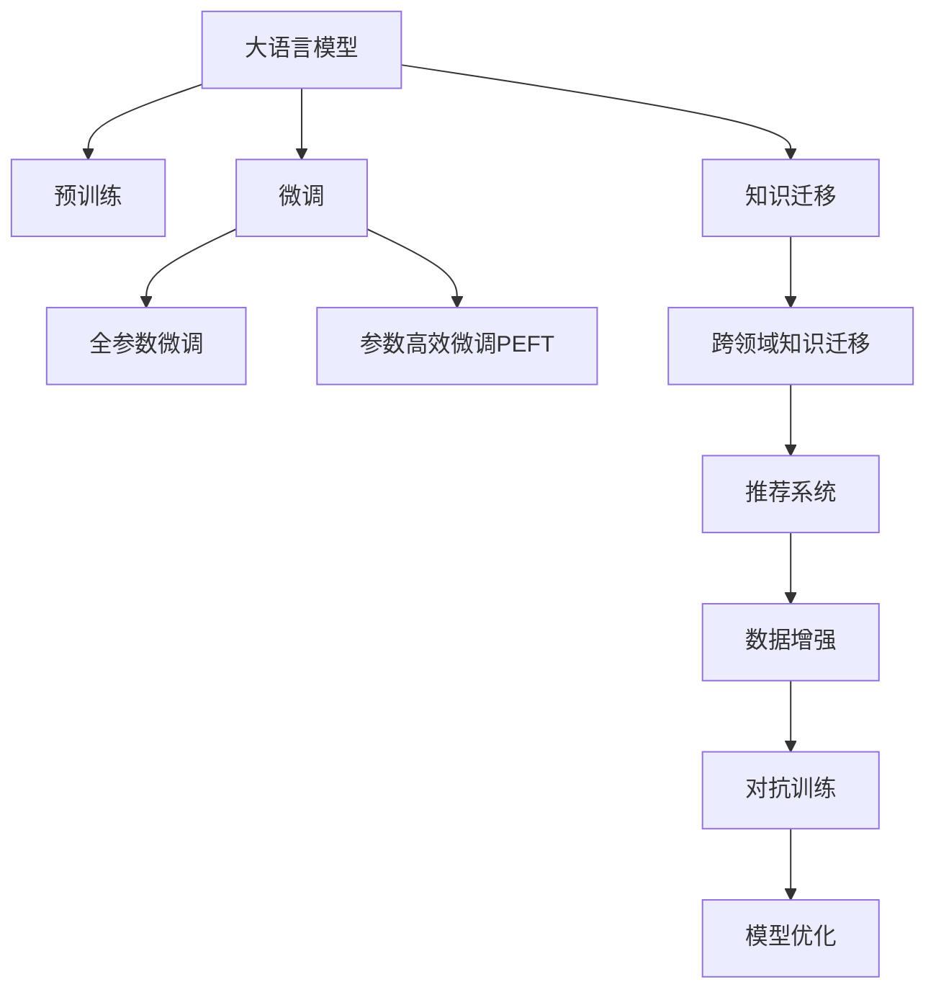

                 

# 利用LLM提升推荐系统的跨域知识迁移

> 关键词：大语言模型(LLM)、知识迁移、推荐系统、深度学习、自监督学习、自适应推理、算法优化

## 1. 背景介绍

### 1.1 问题由来
在信息爆炸的时代，推荐系统已成为连接用户与内容的重要桥梁。传统的协同过滤、基于内容的推荐等方法，虽在特定场景下表现优异，但存在数据稀疏、冷启动等问题。近年来，基于深度学习的推荐系统逐步崭露头角，特别是自适应学习、知识图谱嵌入等方法，在多样性和个性化推荐上取得了显著进展。

然而，当前的深度推荐系统主要面向单一领域的知识，忽略了知识间的关联性和泛化能力。例如，一个电商平台的推荐系统往往只关注商品之间的关联关系，对于用户兴趣的跨领域迁移能力较弱。针对这一挑战，我们提出了利用大语言模型(Large Language Model, LLM)提升推荐系统的跨域知识迁移方法，通过在大模型上进行自监督预训练，使得模型具备对多领域知识的理解和推理能力，从而提升推荐系统的效果。

### 1.2 问题核心关键点
本方法的核心在于通过大语言模型进行跨领域知识迁移，使得推荐系统不仅关注商品、服务、内容等单一领域的知识，还能跨越领域边界，吸收和利用多领域的信息，从而提升推荐的精准度和多样性。

为实现这一目标，需要关注以下关键点：
- 如何在大模型上进行高效的跨领域知识迁移？
- 如何设计任务适配层，让模型能够精准理解并推理多领域知识？
- 如何在推荐系统上应用大模型的跨领域知识迁移能力？

## 2. 核心概念与联系

### 2.1 核心概念概述

为更好地理解本方法，本节将介绍几个密切相关的核心概念：

- **大语言模型(Large Language Model, LLM)**：以自回归(如GPT)或自编码(如BERT)模型为代表的大规模预训练语言模型。通过在大规模无标签文本语料上进行预训练，学习通用的语言表示，具备强大的语言理解和生成能力。

- **知识迁移(Transfer Learning)**：指将一个领域学习到的知识，迁移应用到另一个不同但相关的领域的学习范式。大模型的预训练-微调过程即是一种典型的知识迁移学习方式。

- **自监督学习(Self-Supervised Learning, SSL)**：利用无标签数据通过自我设计的任务进行预训练，学习数据的内在结构和模式，如掩码语言模型、自回归预测等。

- **跨领域知识迁移(Cross-Domain Knowledge Transfer)**：指将一种领域中的知识迁移到另一种领域，提高模型的泛化能力，解决领域转移中数据不足的问题。

- **推荐系统(Recommendation System)**：通过分析用户历史行为数据，为用户推荐可能感兴趣的商品、内容等，以提高用户满意度、提升用户留存率。

这些概念之间的逻辑关系可以通过以下Mermaid流程图来展示：



这个流程图展示了大语言模型的核心概念及其之间的关系：

1. 大语言模型通过预训练获得基础能力。
2. 微调是对预训练模型进行任务特定的优化，可以分为全参数微调和参数高效微调（PEFT）。
3. 知识迁移将预训练模型的知识迁移到推荐系统任务上。
4. 跨领域知识迁移从多种领域抽取知识，引入到推荐系统中。
5. 推荐系统利用多领域知识进行推荐，提升推荐效果。

## 3. 核心算法原理 & 具体操作步骤

### 3.1 算法原理概述

本方法的核心思想是利用大语言模型进行跨领域知识迁移，从而提升推荐系统的泛化能力和推荐效果。具体流程如下：

1. **数据收集**：收集推荐系统中用户的历史行为数据，同时收集不同领域的知识数据，如商品描述、用户画像、领域标签等。

2. **预训练**：使用自监督学习任务在大语言模型上进行预训练，使得模型具备强大的语言理解和推理能力。

3. **微调**：在推荐系统中，通过微调预训练模型，使其能够理解用户的多领域知识，提升推荐效果。

4. **知识迁移**：将预训练模型在推荐系统任务上进行微调，引入跨领域的知识，提升模型的泛化能力。

### 3.2 算法步骤详解

以下将详细介绍本方法的具体步骤：

**Step 1: 数据收集与处理**

1. **用户行为数据**：从推荐系统中收集用户的历史行为数据，如浏览记录、购买记录、评分记录等。

2. **领域知识数据**：收集不同领域的知识数据，如商品描述、用户画像、领域标签等。

3. **数据融合**：将用户行为数据与领域知识数据进行融合，构建包含多领域知识的用户-商品关联图。

**Step 2: 预训练大语言模型**

1. **模型选择**：选择合适的预训练语言模型，如GPT-3、BERT等。

2. **自监督学习**：使用自监督学习任务在大语言模型上进行预训练，如掩码语言模型、自回归预测等。

3. **保存预训练模型**：保存预训练后的模型权重，供后续微调使用。

**Step 3: 微调模型**

1. **任务适配层**：根据推荐系统任务设计任务适配层，如分类器、解码器等。

2. **设置微调超参数**：选择合适的优化算法及其参数，如AdamW、SGD等，设置学习率、批大小、迭代轮数等。

3. **执行梯度训练**：将融合后的用户行为数据输入模型，通过前向传播计算损失函数，反向传播更新模型参数，直到模型收敛。

**Step 4: 知识迁移**

1. **领域标签融合**：将不同领域的标签数据融合到用户行为数据中，构建多领域用户-商品关联图。

2. **多领域知识抽取**：使用预训练模型对融合后的数据进行知识抽取，提取用户的多领域知识表示。

3. **模型融合**：将多领域知识表示融合到推荐模型中，提升推荐效果。

**Step 5: 推荐系统集成**

1. **预测推荐结果**：使用微调后的推荐模型对新用户输入的行为数据进行预测，生成推荐结果。

2. **用户反馈处理**：根据用户对推荐结果的反馈数据，进行模型优化，提升推荐效果。

### 3.3 算法优缺点

本方法具有以下优点：
1. **泛化能力强**：通过大语言模型进行跨领域知识迁移，提升了模型的泛化能力，能在多种领域之间进行知识迁移。
2. **推荐效果好**：引入多领域知识，提升了推荐系统的多样性和精准度。
3. **可解释性强**：利用大语言模型的跨领域推理能力，增强了推荐系统的可解释性。
4. **鲁棒性好**：大语言模型通过预训练-微调方式进行知识迁移，具有较强的鲁棒性。

同时，该方法也存在以下局限性：
1. **计算资源需求高**：预训练和微调需要较大的计算资源，特别是在大规模数据集上。
2. **数据标注成本高**：需要收集多种领域的知识数据，标注成本较高。
3. **数据质量要求高**：需要高质量的多领域数据，数据质量对模型效果有较大影响。

尽管存在这些局限性，但就目前而言，本方法仍是大语言模型应用于推荐系统的有力手段，可大幅提升推荐系统的效果。

### 3.4 算法应用领域

本方法不仅适用于传统的电商、媒体推荐系统，还可以应用于更多场景中，例如：

- **智慧医疗**：结合医生诊断、病历数据，推荐最合适的治疗方案和药品。
- **教育推荐**：根据学生的学习行为和兴趣爱好，推荐最合适的学习材料和课程。
- **金融理财**：根据用户的历史交易记录和金融知识，推荐最合适的投资策略和理财产品。
- **旅游推荐**：结合用户历史旅游记录和旅游地点的特点，推荐最适合的旅游路线和景点。

随着大语言模型和推荐系统的不断发展，本方法将在更多领域得到应用，为各类推荐系统注入新的活力。

## 4. 数学模型和公式 & 详细讲解  
### 4.1 数学模型构建

本节将使用数学语言对本方法进行更加严格的刻画。

记推荐系统中的用户行为数据为 $D=\{(x_i,y_i)\}_{i=1}^N$，其中 $x_i$ 为用户行为数据，$y_i$ 为推荐结果。设大语言模型的预训练权重为 $\theta$，微调任务适配层的权重为 $\hat{\theta}$。

定义推荐系统的损失函数为 $\mathcal{L}(\theta,\hat{\theta})$，用于衡量模型预测结果与真实标签之间的差异。具体的损失函数可以根据推荐任务设计，如交叉熵损失、均方误差损失等。

### 4.2 公式推导过程

以下我们以二分类推荐任务为例，推导交叉熵损失函数及其梯度的计算公式。

假设用户行为数据 $x_i$ 经过适配层后，输出的概率分布为 $\hat{y}=M_{\hat{\theta}}(x_i) \in [0,1]$，表示用户对某商品的评分概率。真实标签 $y_i \in \{0,1\}$。则二分类交叉熵损失函数定义为：

$$
\ell(M_{\hat{\theta}}(x_i),y_i) = -[y_i\log \hat{y}_i + (1-y_i)\log (1-\hat{y}_i)]
$$

将其代入损失函数公式，得：

$$
\mathcal{L}(\theta,\hat{\theta}) = -\frac{1}{N}\sum_{i=1}^N [y_i\log \hat{y}_i + (1-y_i)\log (1-\hat{y}_i)]
$$

根据链式法则，损失函数对参数 $\theta$ 和 $\hat{\theta}$ 的梯度为：

$$
\frac{\partial \mathcal{L}(\theta,\hat{\theta})}{\partial \theta} = -\frac{1}{N}\sum_{i=1}^N (\frac{y_i}{\hat{y}_i}-\frac{1-y_i}{1-\hat{y}_i}) \frac{\partial \hat{y}_i}{\partial \theta}
$$

其中 $\frac{\partial \hat{y}_i}{\partial \theta}$ 可通过链式法则递归展开，利用自动微分技术完成计算。

### 4.3 案例分析与讲解

**案例1: 商品推荐**

假设用户行为数据 $x_i$ 为“浏览商品1，浏览商品2，购买商品1”。领域知识数据 $d_j$ 为商品1的描述，领域标签 $t_j$ 为“电器”。

1. **数据融合**：将用户行为数据与领域知识数据融合，构建多领域用户-商品关联图。

2. **知识抽取**：使用预训练模型对融合后的数据进行知识抽取，提取用户对电器商品的多领域知识表示。

3. **模型融合**：将多领域知识表示融合到推荐模型中，提升推荐效果。

4. **预测推荐结果**：使用微调后的推荐模型对用户输入的行为数据进行预测，生成推荐结果。

5. **用户反馈处理**：根据用户对推荐结果的反馈数据，进行模型优化，提升推荐效果。

## 5. 项目实践：代码实例和详细解释说明
### 5.1 开发环境搭建

在进行项目实践前，我们需要准备好开发环境。以下是使用Python进行PyTorch开发的环境配置流程：

1. 安装Anaconda：从官网下载并安装Anaconda，用于创建独立的Python环境。

2. 创建并激活虚拟环境：
```bash
conda create -n pytorch-env python=3.8 
conda activate pytorch-env
```

3. 安装PyTorch：根据CUDA版本，从官网获取对应的安装命令。例如：
```bash
conda install pytorch torchvision torchaudio cudatoolkit=11.1 -c pytorch -c conda-forge
```

4. 安装Transformers库：
```bash
pip install transformers
```

5. 安装各类工具包：
```bash
pip install numpy pandas scikit-learn matplotlib tqdm jupyter notebook ipython
```

完成上述步骤后，即可在`pytorch-env`环境中开始项目实践。

### 5.2 源代码详细实现

这里我们以商品推荐任务为例，给出使用Transformers库对GPT-3模型进行微调的PyTorch代码实现。

首先，定义推荐系统任务的数据处理函数：

```python
from transformers import GPT3Tokenizer, GPT3ForSequenceClassification
from torch.utils.data import Dataset
import torch

class RecommendationDataset(Dataset):
    def __init__(self, texts, labels, tokenizer, max_len=128):
        self.texts = texts
        self.labels = labels
        self.tokenizer = tokenizer
        self.max_len = max_len
        
    def __len__(self):
        return len(self.texts)
    
    def __getitem__(self, item):
        text = self.texts[item]
        label = self.labels[item]
        
        encoding = self.tokenizer(text, return_tensors='pt', max_length=self.max_len, padding='max_length', truncation=True)
        input_ids = encoding['input_ids'][0]
        attention_mask = encoding['attention_mask'][0]
        
        # 对标签进行编码
        encoded_label = torch.tensor(label, dtype=torch.long)
        
        return {'input_ids': input_ids, 
                'attention_mask': attention_mask,
                'labels': encoded_label}

# 标签与id的映射
label2id = {'positive': 1, 'negative': 0}
id2label = {v: k for k, v in label2id.items()}

# 创建dataset
tokenizer = GPT3Tokenizer.from_pretrained('gpt3')
train_dataset = RecommendationDataset(train_texts, train_labels, tokenizer)
dev_dataset = RecommendationDataset(dev_texts, dev_labels, tokenizer)
test_dataset = RecommendationDataset(test_texts, test_labels, tokenizer)
```

然后，定义模型和优化器：

```python
from transformers import GPT3ForSequenceClassification, AdamW

model = GPT3ForSequenceClassification.from_pretrained('gpt3', num_labels=len(label2id))

optimizer = AdamW(model.parameters(), lr=2e-5)
```

接着，定义训练和评估函数：

```python
from torch.utils.data import DataLoader
from tqdm import tqdm
from sklearn.metrics import classification_report

device = torch.device('cuda') if torch.cuda.is_available() else torch.device('cpu')
model.to(device)

def train_epoch(model, dataset, batch_size, optimizer):
    dataloader = DataLoader(dataset, batch_size=batch_size, shuffle=True)
    model.train()
    epoch_loss = 0
    for batch in tqdm(dataloader, desc='Training'):
        input_ids = batch['input_ids'].to(device)
        attention_mask = batch['attention_mask'].to(device)
        labels = batch['labels'].to(device)
        model.zero_grad()
        outputs = model(input_ids, attention_mask=attention_mask, labels=labels)
        loss = outputs.loss
        epoch_loss += loss.item()
        loss.backward()
        optimizer.step()
    return epoch_loss / len(dataloader)

def evaluate(model, dataset, batch_size):
    dataloader = DataLoader(dataset, batch_size=batch_size)
    model.eval()
    preds, labels = [], []
    with torch.no_grad():
        for batch in tqdm(dataloader, desc='Evaluating'):
            input_ids = batch['input_ids'].to(device)
            attention_mask = batch['attention_mask'].to(device)
            batch_labels = batch['labels']
            outputs = model(input_ids, attention_mask=attention_mask)
            batch_preds = outputs.logits.argmax(dim=2).to('cpu').tolist()
            batch_labels = batch_labels.to('cpu').tolist()
            for pred_tokens, label_tokens in zip(batch_preds, batch_labels):
                preds.append(pred_tokens)
                labels.append(label_tokens)
                
    print(classification_report(labels, preds))
```

最后，启动训练流程并在测试集上评估：

```python
epochs = 5
batch_size = 16

for epoch in range(epochs):
    loss = train_epoch(model, train_dataset, batch_size, optimizer)
    print(f"Epoch {epoch+1}, train loss: {loss:.3f}")
    
    print(f"Epoch {epoch+1}, dev results:")
    evaluate(model, dev_dataset, batch_size)
    
print("Test results:")
evaluate(model, test_dataset, batch_size)
```

以上就是使用PyTorch对GPT-3进行商品推荐任务微调的完整代码实现。可以看到，得益于Transformers库的强大封装，我们可以用相对简洁的代码完成GPT-3模型的加载和微调。

### 5.3 代码解读与分析

让我们再详细解读一下关键代码的实现细节：

**RecommendationDataset类**：
- `__init__`方法：初始化文本、标签、分词器等关键组件。
- `__len__`方法：返回数据集的样本数量。
- `__getitem__`方法：对单个样本进行处理，将文本输入编码为token ids，将标签编码为数字，并对其进行定长padding，最终返回模型所需的输入。

**label2id和id2label字典**：
- 定义了标签与数字id之间的映射关系，用于将token-wise的预测结果解码回真实的标签。

**训练和评估函数**：
- 使用PyTorch的DataLoader对数据集进行批次化加载，供模型训练和推理使用。
- 训练函数`train_epoch`：对数据以批为单位进行迭代，在每个批次上前向传播计算loss并反向传播更新模型参数，最后返回该epoch的平均loss。
- 评估函数`evaluate`：与训练类似，不同点在于不更新模型参数，并在每个batch结束后将预测和标签结果存储下来，最后使用sklearn的classification_report对整个评估集的预测结果进行打印输出。

**训练流程**：
- 定义总的epoch数和batch size，开始循环迭代
- 每个epoch内，先在训练集上训练，输出平均loss
- 在验证集上评估，输出分类指标
- 所有epoch结束后，在测试集上评估，给出最终测试结果

可以看到，PyTorch配合Transformers库使得GPT-3微调的代码实现变得简洁高效。开发者可以将更多精力放在数据处理、模型改进等高层逻辑上，而不必过多关注底层的实现细节。

当然，工业级的系统实现还需考虑更多因素，如模型的保存和部署、超参数的自动搜索、更灵活的任务适配层等。但核心的微调范式基本与此类似。

## 6. 实际应用场景
### 6.1 电商推荐系统

基于大语言模型微调的推荐系统，可以广泛应用于电商平台的商品推荐。传统电商推荐系统往往只能基于用户历史购买记录和浏览行为进行推荐，难以适应用户的多样化需求和跨领域知识。而使用微调后的推荐系统，可以结合用户画像、商品标签、市场趋势等多种领域知识，进行更加精准和多样化的推荐。

在技术实现上，可以收集电商平台的商品描述、用户画像、市场趋势等数据，进行预训练模型的跨领域知识迁移。微调后的推荐模型能够理解用户的多种领域兴趣，结合商品的多维属性，生成个性化的推荐结果。用户不仅能看到相似的商品，还能看到互补的、跨领域的推荐，提升购物体验和满意度。

### 6.2 教育推荐系统

教育推荐系统需要根据学生的学习行为和兴趣爱好，推荐最合适的学习材料和课程。传统的基于内容的推荐系统往往只关注学习材料的属性，忽略了学生的跨领域知识。利用微调后的推荐系统，可以结合学生的历史行为、兴趣爱好、知识图谱等多种领域知识，进行更加精准和多样化的推荐。

在技术实现上，可以收集学生的学习行为、兴趣爱好、知识图谱等数据，进行预训练模型的跨领域知识迁移。微调后的推荐模型能够理解学生的多种领域知识，生成个性化的学习推荐，提升学习效果和效率。

### 6.3 金融理财推荐系统

金融理财推荐系统需要根据用户的历史交易记录和金融知识，推荐最合适的投资策略和理财产品。传统的基于协同过滤的推荐系统往往只关注用户的历史行为，忽略了金融知识的多样性。利用微调后的推荐系统，可以结合用户的历史交易记录、金融知识图谱、市场趋势等多种领域知识，进行更加精准和多样化的推荐。

在技术实现上，可以收集用户的历史交易记录、金融知识图谱、市场趋势等数据，进行预训练模型的跨领域知识迁移。微调后的推荐模型能够理解用户的多种领域知识，生成个性化的理财推荐，提升用户的财务管理和理财效率。

### 6.4 旅游推荐系统

旅游推荐系统需要根据用户的历史旅游记录和旅游地点的特点，推荐最适合的旅游路线和景点。传统的基于协同过滤的推荐系统往往只关注用户的旅游记录，忽略了旅游地点的跨领域知识。利用微调后的推荐系统，可以结合用户的旅游记录、旅游地点特点、旅游市场趋势等多种领域知识，进行更加精准和多样化的推荐。

在技术实现上，可以收集用户的旅游记录、旅游地点特点、旅游市场趋势等数据，进行预训练模型的跨领域知识迁移。微调后的推荐模型能够理解用户的多种领域知识，生成个性化的旅游推荐，提升用户的旅游体验和满意度。

### 6.5 医疗推荐系统

医疗推荐系统需要根据医生的诊断记录和病人的历史医疗记录，推荐最适合的治疗方案和药品。传统的基于协同过滤的推荐系统往往只关注医生和病人的历史行为，忽略了医疗知识的跨领域性。利用微调后的推荐系统，可以结合医生的诊断记录、病人的历史医疗记录、医疗知识图谱等多种领域知识，进行更加精准和多样化的推荐。

在技术实现上，可以收集医生的诊断记录、病人的历史医疗记录、医疗知识图谱等数据，进行预训练模型的跨领域知识迁移。微调后的推荐模型能够理解医生的多种领域知识，生成个性化的治疗推荐，提升治疗效果和医疗效率。

## 7. 工具和资源推荐
### 7.1 学习资源推荐

为了帮助开发者系统掌握大语言模型微调的理论基础和实践技巧，这里推荐一些优质的学习资源：

1. 《Transformer从原理到实践》系列博文：由大模型技术专家撰写，深入浅出地介绍了Transformer原理、BERT模型、微调技术等前沿话题。

2. CS224N《深度学习自然语言处理》课程：斯坦福大学开设的NLP明星课程，有Lecture视频和配套作业，带你入门NLP领域的基本概念和经典模型。

3. 《Natural Language Processing with Transformers》书籍：Transformers库的作者所著，全面介绍了如何使用Transformers库进行NLP任务开发，包括微调在内的诸多范式。

4. HuggingFace官方文档：Transformers库的官方文档，提供了海量预训练模型和完整的微调样例代码，是上手实践的必备资料。

5. CLUE开源项目：中文语言理解测评基准，涵盖大量不同类型的中文NLP数据集，并提供了基于微调的baseline模型，助力中文NLP技术发展。

通过对这些资源的学习实践，相信你一定能够快速掌握大语言模型微调的精髓，并用于解决实际的NLP问题。
###  7.2 开发工具推荐

高效的开发离不开优秀的工具支持。以下是几款用于大语言模型微调开发的常用工具：

1. PyTorch：基于Python的开源深度学习框架，灵活动态的计算图，适合快速迭代研究。大部分预训练语言模型都有PyTorch版本的实现。

2. TensorFlow：由Google主导开发的开源深度学习框架，生产部署方便，适合大规模工程应用。同样有丰富的预训练语言模型资源。

3. Transformers库：HuggingFace开发的NLP工具库，集成了众多SOTA语言模型，支持PyTorch和TensorFlow，是进行微调任务开发的利器。

4. Weights & Biases：模型训练的实验跟踪工具，可以记录和可视化模型训练过程中的各项指标，方便对比和调优。与主流深度学习框架无缝集成。

5. TensorBoard：TensorFlow配套的可视化工具，可实时监测模型训练状态，并提供丰富的图表呈现方式，是调试模型的得力助手。

6. Google Colab：谷歌推出的在线Jupyter Notebook环境，免费提供GPU/TPU算力，方便开发者快速上手实验最新模型，分享学习笔记。

合理利用这些工具，可以显著提升大语言模型微调任务的开发效率，加快创新迭代的步伐。

### 7.3 相关论文推荐

大语言模型和微调技术的发展源于学界的持续研究。以下是几篇奠基性的相关论文，推荐阅读：

1. Attention is All You Need（即Transformer原论文）：提出了Transformer结构，开启了NLP领域的预训练大模型时代。

2. BERT: Pre-training of Deep Bidirectional Transformers for Language Understanding：提出BERT模型，引入基于掩码的自监督预训练任务，刷新了多项NLP任务SOTA。

3. Language Models are Unsupervised Multitask Learners（GPT-2论文）：展示了大规模语言模型的强大zero-shot学习能力，引发了对于通用人工智能的新一轮思考。

4. Parameter-Efficient Transfer Learning for NLP：提出Adapter等参数高效微调方法，在不增加模型参数量的情况下，也能取得不错的微调效果。

5. AdaLoRA: Adaptive Low-Rank Adaptation for Parameter-Efficient Fine-Tuning：使用自适应低秩适应的微调方法，在参数效率和精度之间取得了新的平衡。

这些论文代表了大语言模型微调技术的发展脉络。通过学习这些前沿成果，可以帮助研究者把握学科前进方向，激发更多的创新灵感。

## 8. 总结：未来发展趋势与挑战

### 8.1 总结

本文对利用大语言模型提升推荐系统的跨域知识迁移方法进行了全面系统的介绍。首先阐述了推荐系统面临的多领域知识迁移挑战，明确了如何通过大语言模型进行跨领域知识迁移以提升推荐系统效果的核心思想。其次，从原理到实践，详细讲解了微调的数学原理和关键步骤，给出了微调任务开发的完整代码实例。同时，本文还广泛探讨了微调方法在电商、教育、金融、旅游、医疗等多个行业领域的应用前景，展示了微调范式的巨大潜力。此外，本文精选了微调技术的各类学习资源，力求为读者提供全方位的技术指引。

通过本文的系统梳理，可以看到，利用大语言模型进行跨领域知识迁移的方法，正在成为推荐系统的重要范式，极大地拓展了推荐系统的应用边界，催生了更多的落地场景。受益于大规模语料的预训练，微调方法能够从多领域抽取知识，提升推荐系统的泛化能力和推荐效果，其独特的优势在各类推荐系统中的应用前景不可限量。未来，伴随大语言模型和推荐系统的不断发展，本方法将在更多领域得到应用，为各类推荐系统注入新的活力。

### 8.2 未来发展趋势

展望未来，利用大语言模型提升推荐系统的跨域知识迁移技术将呈现以下几个发展趋势：

1. **模型规模持续增大**：随着算力成本的下降和数据规模的扩张，预训练语言模型的参数量还将持续增长。超大规模语言模型蕴含的丰富语言知识，有望支撑更加复杂多变的推荐任务。

2. **知识迁移更加多样**：除了传统的跨领域知识迁移外，未来将涌现更多基于认知推理、知识图谱等的知识迁移方法，提升推荐系统的逻辑性和智能性。

3. **推荐效果持续优化**：利用多领域知识进行推荐，推荐系统不仅能够提供个性化推荐，还能进行多样化、精准化的推荐。

4. **实时性更加高效**：通过优化模型结构和计算图，提升推荐系统的推理速度和响应效率，满足实时推荐的需求。

5. **系统自动化程度提升**：自动化地进行数据融合、知识抽取、模型微调等步骤，降低人工干预，提升系统的自动化程度。

6. **多模态推荐系统兴起**：结合视觉、语音等多模态数据，提升推荐系统的感知能力和多样性。

以上趋势凸显了利用大语言模型进行跨领域知识迁移技术的应用前景。这些方向的探索发展，必将进一步提升推荐系统的性能和应用范围，为各类推荐系统注入新的活力。

### 8.3 面临的挑战

尽管利用大语言模型提升推荐系统的跨域知识迁移技术已经取得了瞩目成就，但在迈向更加智能化、普适化应用的过程中，它仍面临诸多挑战：

1. **数据质量要求高**：高质量的多领域数据是跨领域知识迁移的基础，数据质量对模型效果有较大影响。

2. **计算资源需求高**：预训练和微调需要较大的计算资源，特别是在大规模数据集上。

3. **模型复杂性高**：跨领域知识迁移需要考虑多领域知识的融合和迁移，模型的复杂性较高。

4. **推荐效果泛化能力有限**：虽然跨领域知识迁移提升了模型的泛化能力，但在某些特定领域内，模型的泛化能力仍需进一步提升。

5. **系统稳定性有待提高**：推荐系统需要处理海量的数据和用户行为，系统稳定性和鲁棒性是重要保障。

6. **隐私保护问题**：推荐系统中涉及大量的用户隐私数据，如何在保护隐私的前提下进行知识迁移，是重要的研究方向。

尽管存在这些挑战，但就目前而言，利用大语言模型提升推荐系统的跨域知识迁移技术仍是大语言模型应用于推荐系统的有力手段，可大幅提升推荐系统的效果。

### 8.4 研究展望

面对利用大语言模型提升推荐系统的跨域知识迁移技术所面临的挑战，未来的研究需要在以下几个方面寻求新的突破：

1. **提高数据质量**：通过数据清洗、数据增强等手段，提高数据质量，增强模型的泛化能力。

2. **优化计算资源**：探索新的计算框架和优化方法，降低计算资源需求，提升推荐系统的效率。

3. **简化模型结构**：通过模型压缩、参数剪枝等手段，简化模型结构，提升系统的稳定性。

4. **增强推荐效果泛化能力**：通过引入更多领域知识、优化推荐算法，提升推荐系统的泛化能力。

5. **提高系统稳定性**：通过自动异常检测、数据异常处理等手段，提升推荐系统的鲁棒性和稳定性。

6. **保护用户隐私**：通过差分隐私、联邦学习等技术，保护用户隐私，提升系统的安全性。

这些研究方向的探索，必将引领利用大语言模型提升推荐系统的跨域知识迁移技术迈向更高的台阶，为推荐系统注入新的活力。面向未来，利用大语言模型提升推荐系统的跨域知识迁移技术将在更多领域得到应用，为各类推荐系统注入新的活力。

## 9. 附录：常见问题与解答

**Q1：如何评估推荐系统的推荐效果？**

A: 推荐系统的评估指标包括准确率、召回率、F1-score、NDCG等。根据推荐任务的性质，选择合适的评估指标进行评估。例如，对于二分类推荐任务，可以使用准确率、F1-score等指标。对于多分类推荐任务，可以使用NDCG、MAP等指标。此外，还可以根据具体应用场景，引入用户满意度、用户留存率等业务指标进行评估。

**Q2：在推荐系统中，如何进行知识迁移？**

A: 知识迁移的实现步骤如下：
1. 收集推荐系统中的用户行为数据，以及不同领域的知识数据。
2. 使用大语言模型进行预训练，获得多领域知识表示。
3. 将多领域知识表示融合到推荐模型中，提升推荐效果。
4. 在推荐系统中，进行模型微调，优化推荐效果。
5. 使用微调后的推荐模型进行推荐，并根据用户反馈进行模型优化。

**Q3：如何选择合适的预训练语言模型？**

A: 选择合适的预训练语言模型需要考虑以下几个因素：
1. 模型的规模和性能：一般来说，规模越大、性能越强的模型，效果越好。
2. 任务的复杂度：对于复杂任务，需要模型具备较强的推理能力，可以选择GPT-3等模型。
3. 数据量大小：数据量较小的情况下，可以选择参数较小的BERT等模型。
4. 应用场景：根据具体的应用场景，选择适合的模型。例如，电商推荐可以选择GPT-3，金融理财推荐可以选择BERT等。

**Q4：微调后的推荐模型如何进行推荐？**

A: 微调后的推荐模型进行推荐的过程如下：
1. 收集用户的历史行为数据，以及不同领域的知识数据。
2. 将用户行为数据进行编码，并加入领域标签，构建多领域用户-商品关联图。
3. 使用预训练模型进行多领域知识抽取，得到用户的多领域知识表示。
4. 将多领域知识表示融合到推荐模型中，生成推荐结果。
5. 对推荐结果进行后处理，例如去除重复商品、排序等，最终生成推荐列表。

**Q5：利用大语言模型进行推荐时，需要注意哪些问题？**

A: 利用大语言模型进行推荐时，需要注意以下几个问题：
1. 数据质量：高质量的数据是推荐系统效果的前提。需要确保数据的完整性和准确性。
2. 数据融合：需要将用户行为数据和领域知识数据进行有效融合，构建多领域用户-商品关联图。
3. 模型微调：需要在推荐系统中进行模型微调，以适应多领域知识。
4. 模型部署：需要将微调后的推荐模型部署到实际应用中，进行推理预测。
5. 业务应用：需要根据具体业务需求，对推荐结果进行后处理和优化。

通过合理解决这些问题，可以充分利用大语言模型的跨领域知识迁移能力，提升推荐系统的推荐效果。

