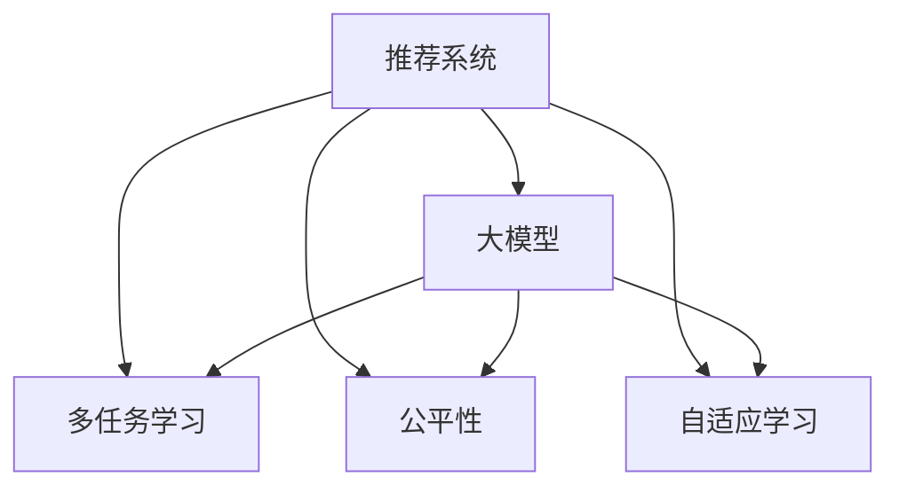

                 

# 利用大模型优化推荐系统的资源分配

> 关键词：推荐系统,资源分配,大模型,多任务学习,公平性,自适应学习

## 1. 背景介绍

推荐系统（Recommender System）是信息时代最重要的技术之一，旨在通过算法为用户推荐感兴趣的内容或产品。传统推荐系统通常基于用户行为数据进行协同过滤或基于内容的推荐，但这些方法存在一定的数据冷启动问题和稀疏性问题。近年来，基于深度学习的推荐系统（如深度协同过滤、神经网络推荐等）在处理大规模数据和多样化需求上取得了显著进展。

在大数据和计算资源的推动下，推荐系统开始向深度学习和深度神经网络模型发展。然而，深度学习模型通常需要大量的数据和计算资源，无法满足所有用户的个性化需求，且在大规模数据集上训练和推理的时间成本较高。为了解决这些问题，研究人员开始将大模型（如BERT、GPT等）引入推荐系统，期望利用其强大的语言理解和生成能力，提升推荐系统的效果。

## 2. 核心概念与联系

### 2.1 核心概念概述

为了更好地理解如何利用大模型优化推荐系统的资源分配，我们首先需要明确以下几个关键概念：

- 推荐系统（Recommender System）：通过算法为用户推荐感兴趣的内容或产品，如商品、新闻、视频等。传统推荐系统包括协同过滤和基于内容的推荐，而深度推荐系统则通过深度学习模型进行推荐。
- 大模型（Large Model）：通常指参数量在亿级以上的深度神经网络模型，如BERT、GPT等。这些模型在大规模无标签文本语料上进行预训练，学习到丰富的语言知识和常识。
- 多任务学习（Multi-task Learning）：同时训练多个任务，共享底层特征，提升模型的泛化能力和资源的利用率。
- 公平性（Fairness）：推荐系统需要保证推荐结果的公平性，即不因性别、年龄、种族等因素产生偏见。
- 自适应学习（Adaptive Learning）：根据用户反馈和行为动态调整推荐策略，提升个性化推荐的效果。

这些概念之间的逻辑关系可以通过以下Mermaid流程图来展示：



该流程图展示了大模型在推荐系统中的应用场景：

1. 推荐系统通过多任务学习，共享底层特征，提升推荐效果。
2. 利用大模型强大的语言理解能力，为推荐系统提供丰富的背景知识。
3. 通过公平性约束，确保推荐结果不因用户属性产生偏见。
4. 通过自适应学习，动态调整推荐策略，提升个性化推荐效果。

## 3. 核心算法原理 & 具体操作步骤
### 3.1 算法原理概述

利用大模型优化推荐系统的资源分配，本质上是将大模型的预训练知识与推荐系统进行深度融合。其核心思想是：

1. 在深度推荐模型的顶层，加入大模型的语言理解模块，提升推荐结果的语义表示能力。
2. 利用多任务学习，共享底层特征，提升模型在多个任务上的泛化能力。
3. 通过公平性约束，确保推荐结果的公平性。
4. 利用自适应学习，根据用户反馈动态调整推荐策略，提升个性化推荐效果。

具体来说，我们可以构建一个包含大模型的多任务推荐模型，如下所示：

$$
\begin{aligned}
M(x, u) &= f_{P}(x, u) + f_{L}(x, u) \\
f_{L}(x, u) &= f_{BERT}(x) \cdot \alpha + f_{LSTM}(u) \cdot \beta \\
\end{aligned}
$$

其中，$M(x, u)$ 为推荐系统的预测函数，$f_{P}(x, u)$ 为深度推荐模型的预测部分，$f_{L}(x, u)$ 为大模型的语言理解部分。$f_{BERT}(x)$ 表示利用BERT模型对输入文本$x$进行编码，$f_{LSTM}(u)$ 表示利用LSTM对用户序列$u$进行编码。$\alpha$ 和 $\beta$ 为模型参数。

### 3.2 算法步骤详解

基于大模型的推荐系统优化资源分配的算法步骤如下：

**Step 1: 准备数据集和预训练模型**

- 准备推荐系统所需的数据集，包括用户行为数据、物品特征数据等。
- 选择合适的预训练大模型，如BERT、GPT等，用于语言理解。

**Step 2: 设计多任务损失函数**

- 设计推荐系统多任务目标函数，如点击率预测、召回率、用户满意度等。
- 引入公平性约束，确保不同用户属性的推荐结果不产生偏见。
- 利用自适应学习机制，根据用户反馈动态调整推荐策略。

**Step 3: 优化模型参数**

- 使用Adam、SGD等优化算法，最小化目标函数，更新模型参数。
- 设定学习率、批次大小、迭代轮数等超参数。

**Step 4: 评估和部署**

- 在测试集上评估模型性能，对比不同方案的效果。
- 将优化后的模型部署到推荐系统中，实时处理用户请求。

**Step 5: 持续优化**

- 根据用户反馈和行为数据，定期重新优化模型参数。
- 利用A/B测试等方法，评估不同优化方案的效果，选择最优方案。

### 3.3 算法优缺点

利用大模型优化推荐系统的资源分配具有以下优点：

1. 提升推荐效果：通过加入大模型的语言理解能力，提升推荐结果的语义表示能力，提升推荐效果。
2. 共享底层特征：利用多任务学习，共享底层特征，提升模型的泛化能力和资源的利用率。
3. 增强公平性：引入公平性约束，确保推荐结果的公平性。
4. 自适应学习：利用自适应学习，动态调整推荐策略，提升个性化推荐效果。

同时，该方法也存在一定的局限性：

1. 数据成本高：需要大量的标注数据进行公平性约束和自适应学习。
2. 模型复杂度高：大模型和深度推荐模型同时参与优化，导致模型复杂度高。
3. 计算资源消耗大：大模型的推理和训练消耗大量计算资源。
4. 鲁棒性不足：在特定领域数据上的泛化能力不足，可能导致性能波动。

尽管存在这些局限性，但大模型在推荐系统中的应用前景依然广阔，通过不断的技术改进和优化，未来有望在推荐领域大放异彩。

### 3.4 算法应用领域

利用大模型优化推荐系统的资源分配，已经在多个推荐场景中得到了应用，例如：

- 电商推荐：利用大模型对用户评论、商品描述进行语义理解，提升推荐效果。
- 新闻推荐：利用大模型对新闻标题、内容进行语义分析，推荐相关新闻。
- 视频推荐：利用大模型对视频标题、字幕进行语义分析，推荐相关视频。
- 音乐推荐：利用大模型对歌曲标题、歌词进行语义分析，推荐相关音乐。
- 电影推荐：利用大模型对电影标题、情节进行语义分析，推荐相关电影。

除了上述这些经典场景，大模型在更多推荐场景中的应用也将不断涌现，为推荐系统带来新的突破。

## 4. 数学模型和公式 & 详细讲解 & 举例说明

### 4.1 数学模型构建

本节将使用数学语言对基于大模型的推荐系统资源分配进行更加严格的刻画。

记推荐系统所需的数据集为 $D=\{(x_i, u_i, y_i)\}_{i=1}^N$，其中 $x_i$ 为物品特征，$u_i$ 为用户特征，$y_i$ 为推荐结果（如点击、购买等）。记大模型为 $M_L(x)$，推荐模型为 $M_P(x, u)$。

目标函数可定义为：

$$
\begin{aligned}
\min_{\theta} \quad & \sum_{i=1}^N \ell(y_i, M_P(x_i, u_i)) + \lambda \cdot \text{fairness} + \mu \cdot \text{adaptivity} \\
\end{aligned}
$$

其中 $\ell(y_i, M_P(x_i, u_i))$ 为推荐系统的损失函数，$\text{fairness}$ 为公平性约束，$\text{adaptivity}$ 为自适应学习目标函数。

### 4.2 公式推导过程

以点击率预测为例，进行详细推导：

假设推荐系统的大模型 $M_L(x)$ 为BERT模型，深度推荐模型 $M_P(x, u)$ 为MLP模型。则点击率预测的目标函数为：

$$
\begin{aligned}
\min_{\theta} \quad & \sum_{i=1}^N \ell(\hat{y}_i, y_i) \\
\text{其中} \quad \hat{y}_i &= M_P(x_i, u_i) \cdot M_L(x_i) \\
\end{aligned}
$$

其中 $\hat{y}_i$ 为推荐系统的预测结果，$\ell(\hat{y}_i, y_i)$ 为二分类交叉熵损失函数。

大模型的语言理解部分可以表示为：

$$
M_L(x) = M_{BERT}(x) \cdot \alpha + M_{LSTM}(u) \cdot \beta
$$

其中 $M_{BERT}(x)$ 表示利用BERT模型对输入文本 $x$ 进行编码，$M_{LSTM}(u)$ 表示利用LSTM对用户序列 $u$ 进行编码，$\alpha$ 和 $\beta$ 为模型参数。

将上式代入点击率预测的目标函数，得：

$$
\begin{aligned}
\min_{\theta} \quad & \sum_{i=1}^N \ell(\hat{y}_i, y_i) \\
\text{其中} \quad \hat{y}_i &= M_P(x_i, u_i) \cdot (M_{BERT}(x_i) \cdot \alpha + M_{LSTM}(u_i) \cdot \beta) \\
\end{aligned}
$$

通过对大模型的语言理解部分进行优化，可以提升推荐系统的效果。

### 4.3 案例分析与讲解

假设某电商平台需要利用大模型优化推荐系统的资源分配，可以选择以下步骤：

1. 收集电商平台的商品描述、用户行为数据，将其作为训练数据。
2. 利用BERT模型对商品描述进行编码，利用LSTM对用户行为进行编码。
3. 设计多任务目标函数，如点击率预测、召回率、用户满意度等。
4. 引入公平性约束，确保不同用户属性的推荐结果不产生偏见。
5. 利用自适应学习机制，根据用户反馈动态调整推荐策略。
6. 使用Adam优化算法，最小化目标函数，更新模型参数。
7. 在测试集上评估模型性能，优化模型参数。
8. 部署优化后的模型到推荐系统中，实时处理用户请求。

通过上述步骤，可以构建一个包含大模型的多任务推荐系统，提升推荐效果和资源利用率。

## 5. 项目实践：代码实例和详细解释说明
### 5.1 开发环境搭建

在进行大模型推荐系统优化资源分配的实践前，我们需要准备好开发环境。以下是使用Python进行PyTorch开发的环境配置流程：

1. 安装Anaconda：从官网下载并安装Anaconda，用于创建独立的Python环境。

2. 创建并激活虚拟环境：
```bash
conda create -n pytorch-env python=3.8 
conda activate pytorch-env
```

3. 安装PyTorch：根据CUDA版本，从官网获取对应的安装命令。例如：
```bash
conda install pytorch torchvision torchaudio cudatoolkit=11.1 -c pytorch -c conda-forge
```

4. 安装BERT模型：
```bash
pip install transformers
```

5. 安装各类工具包：
```bash
pip install numpy pandas scikit-learn matplotlib tqdm jupyter notebook ipython
```

完成上述步骤后，即可在`pytorch-env`环境中开始实践。

### 5.2 源代码详细实现

这里我们以电商推荐系统为例，给出使用PyTorch和Transformers库对大模型进行优化资源分配的代码实现。

首先，定义推荐系统的数据处理函数：

```python
from transformers import BertTokenizer
from torch.utils.data import Dataset
import torch

class RecommendationDataset(Dataset):
    def __init__(self, items, users, clicks):
        self.items = items
        self.users = users
        self.clicks = clicks
        self.tokenizer = BertTokenizer.from_pretrained('bert-base-cased')
        
    def __len__(self):
        return len(self.items)
    
    def __getitem__(self, item):
        item_id, user_id, click = self.items[item], self.users[item], self.clicks[item]
        item_text = 'item {}'.format(item_id)
        user_seq = 'user {}'.format(user_id)
        
        encoding = self.tokenizer(item_text, return_tensors='pt', padding='max_length', truncation=True)
        user_seq = self.tokenizer(user_seq, return_tensors='pt', padding='max_length', truncation=True)
        
        # 对item和user进行编码，拼接后输入模型
        item_input_ids = encoding['input_ids'][0]
        user_input_ids = user_seq['input_ids'][0]
        input_ids = torch.cat((item_input_ids, user_input_ids), dim=1)
        
        return {'input_ids': input_ids, 'click': click}
```

然后，定义模型和优化器：

```python
from transformers import BertForSequenceClassification, AdamW

num_classes = 2  # 点击或未点击
model = BertForSequenceClassification.from_pretrained('bert-base-cased', num_labels=num_classes)

optimizer = AdamW(model.parameters(), lr=2e-5)
```

接着，定义训练和评估函数：

```python
from torch.utils.data import DataLoader
from tqdm import tqdm
from sklearn.metrics import accuracy_score

device = torch.device('cuda') if torch.cuda.is_available() else torch.device('cpu')
model.to(device)

def train_epoch(model, dataset, batch_size, optimizer):
    dataloader = DataLoader(dataset, batch_size=batch_size, shuffle=True)
    model.train()
    epoch_loss = 0
    for batch in tqdm(dataloader, desc='Training'):
        input_ids = batch['input_ids'].to(device)
        click = batch['click'].to(device)
        model.zero_grad()
        outputs = model(input_ids)
        loss = outputs.loss
        epoch_loss += loss.item()
        loss.backward()
        optimizer.step()
    return epoch_loss / len(dataloader)

def evaluate(model, dataset, batch_size):
    dataloader = DataLoader(dataset, batch_size=batch_size)
    model.eval()
    preds, labels = [], []
    with torch.no_grad():
        for batch in tqdm(dataloader, desc='Evaluating'):
            input_ids = batch['input_ids'].to(device)
            click = batch['click'].to(device)
            batch_preds = model(input_ids).predictions.argmax(dim=1).to('cpu').tolist()
            batch_labels = click.to('cpu').tolist()
            for pred, label in zip(batch_preds, batch_labels):
                preds.append(pred)
                labels.append(label)
                
    print('Accuracy: {:.3f}'.format(accuracy_score(labels, preds)))
```

最后，启动训练流程并在测试集上评估：

```python
epochs = 5
batch_size = 16

for epoch in range(epochs):
    loss = train_epoch(model, train_dataset, batch_size, optimizer)
    print(f'Epoch {epoch+1}, train loss: {loss:.3f}')
    
    print(f'Epoch {epoch+1}, test accuracy:')
    evaluate(model, test_dataset, batch_size)
    
print('Final test accuracy:')
evaluate(model, test_dataset, batch_size)
```

以上就是使用PyTorch和Transformers库对电商推荐系统进行大模型优化的完整代码实现。可以看到，Transformer库和PyTorch使得大模型的优化和微调变得更加简单和高效。

### 5.3 代码解读与分析

让我们再详细解读一下关键代码的实现细节：

**RecommendationDataset类**：
- `__init__`方法：初始化物品特征、用户特征、点击数据等关键组件。
- `__len__`方法：返回数据集的样本数量。
- `__getitem__`方法：对单个样本进行处理，将物品特征、用户特征编码为token ids，拼接后输入模型。

**模型和优化器**：
- 使用BertForSequenceClassification作为模型，设置交叉熵损失函数。
- 使用AdamW优化算法进行参数更新。

**训练和评估函数**：
- 使用PyTorch的DataLoader对数据集进行批次化加载，供模型训练和推理使用。
- 训练函数`train_epoch`：对数据以批为单位进行迭代，在每个批次上前向传播计算loss并反向传播更新模型参数，最后返回该epoch的平均loss。
- 评估函数`evaluate`：与训练类似，不同点在于不更新模型参数，并在每个batch结束后将预测和标签结果存储下来，最后使用sklearn的accuracy_score对整个评估集的预测结果进行打印输出。

**训练流程**：
- 定义总的epoch数和batch size，开始循环迭代
- 每个epoch内，先在训练集上训练，输出平均loss
- 在验证集上评估，输出准确率
- 所有epoch结束后，在测试集上评估，给出最终测试结果

可以看到，PyTorch配合Transformers库使得大模型的优化和微调变得更加简单和高效。开发者可以将更多精力放在数据处理、模型改进等高层逻辑上，而不必过多关注底层的实现细节。

当然，工业级的系统实现还需考虑更多因素，如模型的保存和部署、超参数的自动搜索、更灵活的任务适配层等。但核心的优化范式基本与此类似。

## 6. 实际应用场景
### 6.1 电商推荐

基于大模型的推荐系统，可以广泛应用于电商推荐中。传统推荐系统往往依赖用户行为数据进行推荐，但面临数据冷启动问题和用户行为稀疏性问题。利用大模型对商品描述进行语义理解，可以提升推荐效果，缓解这些问题。

在技术实现上，可以收集电商平台的商品描述、用户行为数据，将商品描述作为输入，利用BERT模型进行编码，与用户行为序列拼接后输入模型进行预测。利用多任务学习，共享底层特征，提升模型的泛化能力和资源的利用率。

### 6.2 新闻推荐

利用大模型对新闻标题、内容进行语义分析，可以推荐相关新闻。传统新闻推荐系统通常基于内容相似度进行推荐，无法处理长尾新闻。利用大模型，可以捕捉新闻的深层语义信息，提升推荐的覆盖率和准确性。

在技术实现上，可以收集新闻平台的标题、内容，利用BERT模型进行编码，与用户行为序列拼接后输入模型进行预测。引入公平性约束，确保不同用户属性的推荐结果不产生偏见。

### 6.3 视频推荐

利用大模型对视频标题、字幕进行语义分析，可以推荐相关视频。传统视频推荐系统通常基于观看行为进行推荐，无法处理长尾视频。利用大模型，可以捕捉视频的深层语义信息，提升推荐的覆盖率和准确性。

在技术实现上，可以收集视频平台的标题、字幕，利用BERT模型进行编码，与用户行为序列拼接后输入模型进行预测。利用自适应学习机制，根据用户反馈动态调整推荐策略，提升个性化推荐效果。

### 6.4 音乐推荐

利用大模型对歌曲标题、歌词进行语义分析，可以推荐相关音乐。传统音乐推荐系统通常基于标签进行推荐，无法处理长尾音乐。利用大模型，可以捕捉音乐的深层语义信息，提升推荐的覆盖率和准确性。

在技术实现上，可以收集音乐平台的标题、歌词，利用BERT模型进行编码，与用户行为序列拼接后输入模型进行预测。利用公平性约束，确保不同用户属性的推荐结果不产生偏见。

### 6.5 电影推荐

利用大模型对电影标题、情节进行语义分析，可以推荐相关电影。传统电影推荐系统通常基于评分进行推荐，无法处理长尾电影。利用大模型，可以捕捉电影的深层语义信息，提升推荐的覆盖率和准确性。

在技术实现上，可以收集电影平台的标题、情节，利用BERT模型进行编码，与用户行为序列拼接后输入模型进行预测。利用自适应学习机制，根据用户反馈动态调整推荐策略，提升个性化推荐效果。

## 7. 工具和资源推荐
### 7.1 学习资源推荐

为了帮助开发者系统掌握大模型优化推荐系统的理论基础和实践技巧，这里推荐一些优质的学习资源：

1. 《深度学习推荐系统》系列博文：由深度学习推荐系统专家撰写，深入浅出地介绍了推荐系统的基本概念和经典模型，以及如何利用深度学习提升推荐效果。

2. 《自然语言处理综述》课程：斯坦福大学开设的自然语言处理课程，涵盖NLP领域的各类经典任务和前沿技术，是推荐系统开发的必备知识。

3. 《Python深度学习》书籍：深度学习专家Francois Chollet所著，介绍了深度学习在推荐系统中的应用，并提供了丰富的代码示例。

4. TensorFlow官方文档：Google推出的开源深度学习框架，提供了丰富的推荐系统实现和优化技巧，是推荐系统开发的强大工具。

5. Kaggle推荐系统竞赛：Kaggle平台提供了丰富的推荐系统竞赛数据集，可以锻炼推荐系统的实际应用能力，积累实践经验。

通过对这些资源的学习实践，相信你一定能够快速掌握大模型优化推荐系统的精髓，并用于解决实际的推荐问题。

### 7.2 开发工具推荐

高效的开发离不开优秀的工具支持。以下是几款用于大模型优化推荐系统开发的常用工具：

1. PyTorch：基于Python的开源深度学习框架，灵活动态的计算图，适合快速迭代研究。大部分预训练语言模型都有PyTorch版本的实现。

2. TensorFlow：由Google主导开发的开源深度学习框架，生产部署方便，适合大规模工程应用。同样有丰富的推荐系统资源。

3. Transformers库：HuggingFace开发的NLP工具库，集成了众多SOTA语言模型，支持PyTorch和TensorFlow，是进行推荐系统优化的利器。

4. Weights & Biases：模型训练的实验跟踪工具，可以记录和可视化模型训练过程中的各项指标，方便对比和调优。与主流深度学习框架无缝集成。

5. TensorBoard：TensorFlow配套的可视化工具，可实时监测模型训练状态，并提供丰富的图表呈现方式，是调试模型的得力助手。

6. Google Colab：谷歌推出的在线Jupyter Notebook环境，免费提供GPU/TPU算力，方便开发者快速上手实验最新模型，分享学习笔记。

合理利用这些工具，可以显著提升大模型优化推荐系统的开发效率，加快创新迭代的步伐。

### 7.3 相关论文推荐

大模型在推荐系统中的应用还处于起步阶段，但相关研究已经初见成效。以下是几篇奠基性的相关论文，推荐阅读：

1. Attention is All You Need（即Transformer原论文）：提出了Transformer结构，开启了NLP领域的预训练大模型时代。

2. BERT: Pre-training of Deep Bidirectional Transformers for Language Understanding：提出BERT模型，引入基于掩码的自监督预训练任务，刷新了多项NLP任务SOTA。

3. Deep Collaborative Filtering via Multi-task Learning：提出多任务学习的方法，通过共享底层特征，提升推荐系统的效果。

4. Adaptive Hypernetworks for Deep Collaborative Filtering：提出自适应学习的方法，利用用户反馈动态调整推荐策略。

5. Causal Attention Mechanism in Recommendation Systems：提出因果注意力机制，提升推荐系统的解释性和鲁棒性。

6. Multi-task learning in deep neural networks：综述了多任务学习的理论基础和实际应用，为推荐系统优化提供了理论支持。

这些论文代表了大模型在推荐系统中的应用方向，通过学习这些前沿成果，可以帮助研究者把握学科前进方向，激发更多的创新灵感。

## 8. 总结：未来发展趋势与挑战
### 8.1 研究成果总结

本文对基于大模型的推荐系统资源分配进行了全面系统的介绍。首先阐述了大模型和推荐系统优化资源分配的研究背景和意义，明确了优化推荐系统的效果与数据、模型、算法、工程、业务等多个因素息息相关。其次，从原理到实践，详细讲解了大模型优化推荐系统的数学原理和关键步骤，给出了具体的代码实现，展示了微调技术的实际应用场景。同时，本文还广泛探讨了大模型优化推荐系统的发展趋势和面临的挑战，为未来的研究指明了方向。

通过本文的系统梳理，可以看到，基于大模型的推荐系统资源分配已经取得了一定的成果，在电商推荐、新闻推荐、视频推荐、音乐推荐、电影推荐等多个领域中得到了应用。但同时也面临着数据成本高、模型复杂度高、计算资源消耗大、鲁棒性不足等挑战，需要不断地进行技术改进和优化。

### 8.2 未来发展趋势

展望未来，大模型优化推荐系统的发展趋势如下：

1. 数据多样化：推荐系统需要处理更多类型的用户行为数据，如图像、视频、音频等，提升推荐系统的覆盖率和准确性。

2. 模型泛化能力提升：大模型需要更好地处理长尾用户和长尾物品，提升推荐系统的公平性和覆盖率。

3. 实时性增强：利用流式计算和大模型优化，提升推荐系统的实时性，满足用户即时推荐的需求。

4. 自适应学习：利用自适应学习机制，动态调整推荐策略，提升个性化推荐效果。

5. 混合模型：融合深度学习和传统推荐系统，提升推荐系统的综合性能。

6. 强化学习：利用强化学习优化推荐策略，提升推荐系统的智能化水平。

7. 分布式计算：利用分布式计算优化模型训练和推理，提升资源利用率和计算效率。

8. 跨领域融合：将推荐系统与其他领域的技术进行深度融合，提升推荐系统的智能化水平。

这些趋势将推动推荐系统向更加智能化、普适化、实时化、公平化的方向发展，为推荐系统带来新的突破。

### 8.3 面临的挑战

尽管大模型优化推荐系统已经取得了一定的成果，但在迈向更加智能化、普适化应用的过程中，它仍面临诸多挑战：

1. 数据成本高：处理多样化的用户行为数据需要大量的标注数据，获取高质量标注数据的成本较高。

2. 模型复杂度高：大模型和深度推荐模型同时参与优化，导致模型复杂度高，计算资源消耗大。

3. 鲁棒性不足：在特定领域数据上的泛化能力不足，可能导致性能波动。

4. 可解释性不足：推荐系统往往缺乏可解释性，难以解释其内部工作机制和决策逻辑，影响用户体验。

5. 安全性问题：推荐系统面临数据隐私、算法偏见等安全性问题，需要加强数据脱敏和隐私保护。

6. 动态性不足：推荐系统需要具备动态性，能够根据用户行为和环境变化实时调整推荐策略。

这些挑战需要从技术、工程、伦理等多个维度进行综合应对，才能真正实现大模型优化推荐系统的广泛应用。

### 8.4 研究展望

面向未来，大模型优化推荐系统的研究需要在以下几个方面寻求新的突破：

1. 数据多样化：处理更多类型的用户行为数据，如图像、视频、音频等，提升推荐系统的覆盖率和准确性。

2. 模型泛化能力提升：提升大模型在长尾用户和长尾物品上的泛化能力，提升推荐系统的公平性和覆盖率。

3. 实时性增强：利用流式计算和大模型优化，提升推荐系统的实时性，满足用户即时推荐的需求。

4. 自适应学习：利用自适应学习机制，动态调整推荐策略，提升个性化推荐效果。

5. 混合模型：融合深度学习和传统推荐系统，提升推荐系统的综合性能。

6. 强化学习：利用强化学习优化推荐策略，提升推荐系统的智能化水平。

7. 分布式计算：利用分布式计算优化模型训练和推理，提升资源利用率和计算效率。

8. 跨领域融合：将推荐系统与其他领域的技术进行深度融合，提升推荐系统的智能化水平。

9. 数据治理：制定数据治理规范，保障数据隐私和安全，提升推荐系统的可信度。

10. 跨模态融合：将推荐系统与其他模态的信息进行深度融合，提升推荐系统的智能化水平。

这些研究方向将引领大模型优化推荐系统向更高的台阶迈进，为推荐系统带来新的突破。

## 9. 附录：常见问题与解答

**Q1：如何选择合适的预训练模型？**

A: 选择合适的预训练模型需要考虑以下几个因素：

1. 任务需求：选择适合任务类型的预训练模型，如新闻推荐可以选择BERT，视频推荐可以选择基于视觉的大模型。
2. 数据特征：选择能够处理数据特征的预训练模型，如处理文本特征可以选择BERT，处理图像特征可以选择基于视觉的预训练模型。
3. 计算资源：选择适合自己计算资源的预训练模型，如GPU资源有限可以选择参数量较小的模型。
4. 性能表现：选择性能表现较好的预训练模型，可以通过模型评测结果进行选择。

**Q2：如何设计推荐系统的多任务目标函数？**

A: 推荐系统的多任务目标函数可以包括：

1. 点击率预测：预测用户是否点击物品。
2. 召回率：推荐系统召回的相关物品数。
3. 用户满意度：用户对推荐结果的满意度评分。
4. 多样性：推荐结果的多样性。
5. 公平性：推荐结果的公平性。

可以通过加权平均的方式，设计多任务目标函数。例如：

$$
\min_{\theta} \quad \sum_{i=1}^N \lambda_1 \ell(\hat{y}_i, y_i) + \lambda_2 \ell(\text{recall}_i) + \lambda_3 \ell(\text{diversity}_i) + \lambda_4 \ell(\text{fairness}_i)
$$

其中 $\ell$ 为损失函数，$\lambda$ 为权重。

**Q3：如何设计公平性约束？**

A: 公平性约束可以通过以下方式设计：

1. 消除性别、年龄、种族等属性的偏见：通过对模型输出进行公平性约束，消除对不同用户属性的偏见。
2. 引入敏感性度量：通过敏感性度量指标，如人口分布、性别比例等，评估推荐系统的公平性。
3. 动态调整推荐策略：根据用户属性和行为数据，动态调整推荐策略，提升公平性。

可以通过公平性度量算法，如Adversarial Debiasing、FairML等，设计公平性约束。

**Q4：如何优化推荐系统的自适应学习机制？**

A: 推荐系统的自适应学习机制可以通过以下方式优化：

1. 引入在线学习算法：利用在线学习算法，根据用户反馈实时更新模型参数。
2. 设计动态调整策略：根据用户行为和环境变化，动态调整推荐策略。
3. 引入强化学习：利用强化学习优化推荐策略，提升推荐系统的智能化水平。

可以通过强化学习算法，如Q-learning、DQN等，设计自适应学习机制。

**Q5：如何优化推荐系统的工程实现？**

A: 推荐系统的工程实现可以通过以下方式优化：

1. 模型裁剪：去除不必要的层和参数，减小模型尺寸，加快推理速度。
2. 量化加速：将浮点模型转为定点模型，压缩存储空间，提高计算效率。
3. 服务化封装：将模型封装为标准化服务接口，便于集成调用。
4. 弹性伸缩：根据请求流量动态调整资源配置，平衡服务质量和成本。
5. 监控告警：实时采集系统指标，设置异常告警阈值，确保服务稳定性。

可以通过模型优化工具，如ONNX、TensorRT等，优化模型实现。

通过上述Q&A的讨论，可以更好地理解大模型优化推荐系统的关键概念和实现方法，为实际应用提供指导。相信随着大模型和推荐系统技术的不断进步，大模型优化推荐系统必将在更多领域得到应用，为推荐系统带来新的突破。

