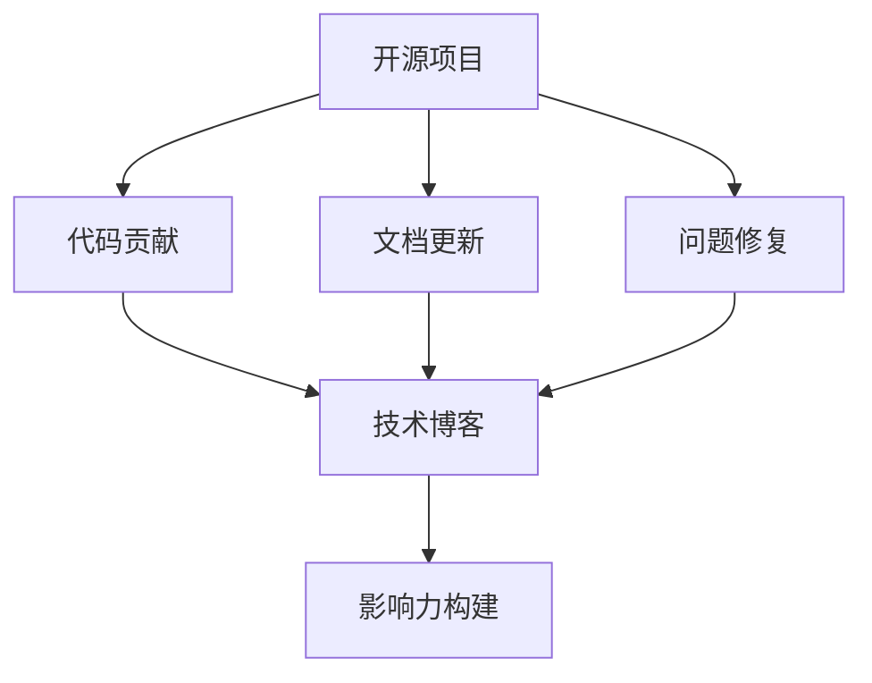

                 

# 利用开源影响力获得技术博客写作机会

## 1. 背景介绍

### 1.1 问题由来

在当今技术日新月异的互联网时代，技术写作成为了技术人获取曝光、传播思想、建立影响力的重要手段。然而，随着技术内容的愈发专业化，普通写手难以入局，逐渐形成了一种以技术大佬为主流的技术博客格局。开源项目作为一个汇聚了大量技术专家和贡献者的平台，其文档和交流机制也为普通人提供了展示自我、建立影响力的契机。

本文旨在介绍如何利用开源影响力，通过参与开源项目，撰写技术博客，获取更多技术写作机会，从而提升个人品牌价值，同时为社区贡献更多高质量内容。

### 1.2 问题核心关键点

本文的核心内容包括：
1. **开源项目的贡献形式**：了解常见的开源贡献方式，如代码提交、文档更新、问题修复等。
2. **技术博客的创作要点**：掌握技术写作的常见风格、格式和技巧。
3. **开源社区的影响力构建**：学习如何通过开源贡献和博客创作，逐步建立自己的技术影响力。

## 2. 核心概念与联系

### 2.1 核心概念概述

- **开源项目**：指通过协作方式，共同维护和开发的软件项目。开源项目以社区贡献为核心，鼓励代码共享、文档完善、问题解决等形式进行互动。
- **技术博客**：指专注于技术话题，通过分享技术心得、教程、实战经验等内容，帮助他人理解技术的应用和原理。
- **技术写作**：指撰写文章、报告、手册等技术文档，以文字形式传达技术知识和见解，是技术人获取影响力、分享经验的常用方式。
- **代码贡献**：指在开源项目中，提交代码更新、修复漏洞、添加新功能等，对项目进行实际贡献。
- **文档更新**：指对开源项目的文档进行维护，如编写用户手册、API文档、常见问题解答等。
- **影响力构建**：指通过开源贡献和博客创作，逐步在社区内建立起一定的知名度和技术权威，成为值得信赖的技术专家。

这些概念之间的逻辑关系可以通过以下Mermaid流程图来展示：



这个流程图展示了开源项目的多个参与方式以及这些方式对技术写作的影响路径。

## 3. 核心算法原理 & 具体操作步骤
### 3.1 算法原理概述

开源项目中的影响力构建和博客创作，本质上是一个通过实际贡献提升自我展示和社交网络的过程。其核心思想是：通过参与开源项目，展示自身技术能力，赢得社区的认可；再通过撰写技术博客，向更广泛的技术社区传播这些技术和心得，逐步建立个人品牌。

形式化地，设社区成员 $i$ 在开源项目 $P$ 中的贡献度为 $C_i^P$，在技术博客 $B$ 上的影响力为 $I_i^B$。则影响力构建过程可以表示为：

$$
I_i^B = f(C_i^P)
$$

其中 $f$ 是一个映射函数，用于将开源贡献度转化为博客影响力。常见的影响力构建方法包括：

- 提交高质量代码：代码质量越高、贡献越多，影响力提升越明显。
- 编写高质量文档：详细、准确、易读的文档能够帮助更多人使用项目，提高贡献者的影响力。
- 解决问题并记录：解决项目中的问题，并在博客中记录解决方案，展示技术深度和解决复杂问题的能力。

### 3.2 算法步骤详解

基于开源影响力的技术博客写作机会获取，通常包括以下几个关键步骤：

**Step 1: 选择合适的开源项目**

- 根据个人技术专长和兴趣，选择与领域相关的开源项目。
- 关注项目的活跃度、贡献者质量等指标，选择质量高、活跃的社区。

**Step 2: 贡献开源代码**

- 学习项目的基本开发流程，熟悉开发工具、代码风格等。
- 选择一个感兴趣的功能模块，完成需求分析和设计，编写高质量代码。
- 遵循项目的代码审查流程，提交代码，等待社区反馈。

**Step 3: 更新项目文档**

- 了解项目文档的结构和内容要求，编写清晰、准确的文档。
- 定期维护文档，确保最新信息被记录和传播。

**Step 4: 记录问题解决方案**

- 遇到项目问题时，先通过社区讨论和已有文档寻找解决方案。
- 若无法解决，可尝试在代码中修复问题，并撰写问题分析和解决方案的文章。
- 将问题解决方案记录在博客中，与社区分享。

**Step 5: 撰写技术博客**

- 根据开源贡献的内容，撰写相关技术博客。
- 保持文章结构的逻辑性，确保信息的准确性和可读性。
- 发布在社区认可的平台，如Medium、GitHub Pages等，以获取更多曝光。

**Step 6: 维护和推广**

- 持续更新博客内容，保持其时效性和深度。
- 通过社交媒体、邮件列表等渠道推广博客，吸引更多读者。

### 3.3 算法优缺点

开源影响力的技术博客写作机会获取，有以下优点：

- **获取曝光**：通过参与开源项目和撰写技术博客，可以获取更多技术社区的关注和认可。
- **提升技能**：在实际项目中学习和实践，能够显著提升自身技术能力和项目经验。
- **构建影响力**：在社区内逐步建立起一定的知名度和技术权威，成为值得信赖的技术专家。

同时，该方法也存在一定的局限性：

- **时间和精力投入大**：开源贡献和博客创作需要大量的时间和精力投入。
- **依赖社区认可**：影响力构建的效果很大程度上依赖于开源社区的认可和反馈。
- **专业性强**：需要具备较高的技术水平和沟通能力，对初学者较为困难。

尽管存在这些局限性，但就目前而言，通过开源项目和技术博客进行影响力构建，仍是大技术人获取写作机会的重要手段。未来相关研究的重点在于如何进一步降低开源贡献的技术门槛，优化博客内容分发机制，同时兼顾个人品牌和社区利益。

### 3.4 算法应用领域

开源影响力的技术博客写作机会获取，已经在开源社区、技术论坛、科技媒体等多个领域得到应用，如：

- **开源社区**：通过贡献开源代码和文档，获取更多社区内的曝光和认可。
- **技术博客平台**：在Medium、Towards Data Science、知乎等技术博客平台上发布文章，吸引更多读者。
- **科技媒体**：通过在GitHub Pages等平台发布技术博客，获得更多媒体曝光。

除了上述这些常见场景外，开源影响力的技术博客写作机会还应用于各种技术培训课程、技术分享会等场合，为技术人提供了更多的展示平台。

## 4. 数学模型和公式 & 详细讲解 & 举例说明

### 4.1 数学模型构建

本节将使用数学语言对开源影响力的技术博客写作机会获取过程进行更加严格的刻画。

设社区成员 $i$ 在开源项目 $P$ 中的贡献度为 $C_i^P$，在技术博客 $B$ 上的影响力为 $I_i^B$。则影响力构建过程可以表示为：

$$
I_i^B = f(C_i^P)
$$

其中 $f$ 为一个映射函数，用于将开源贡献度转化为博客影响力。影响力的构建依赖于以下几个关键指标：

- **代码质量**：$C^P_i$ 中高质量代码的数量和占比。
- **文档完善度**：$C^P_i$ 中高质量文档的数量和占比。
- **问题解决能力**：$C^P_i$ 中解决的问题数量和复杂度。
- **博客质量和传播度**：博客文章的质量和被阅读、转发的次数。

### 4.2 公式推导过程

假设 $f$ 函数形式为 $f(C_i^P) = k \cdot C_i^P$，其中 $k$ 为影响因子。则可得：

$$
I_i^B = k \cdot C_i^P
$$

其中 $k$ 的取值需要通过实验和分析来确定。例如，某个开源项目的社区规定，每提交100行高质量代码，影响力提升1分。则可得：

$$
k = \frac{1}{100}
$$

### 4.3 案例分析与讲解

以下以一个开源项目 "Mozilla Firefox" 为例，分析其影响力构建机制：

- **代码贡献**：贡献者可以通过提交高质量的代码，获得1分的影响力提升。
- **文档更新**：每更新一篇高质量的文档，贡献者可以获得0.5分的影响力提升。
- **问题解决**：每解决一个复杂问题，并撰写详细解决方案，贡献者可以获得2分的影响力提升。

假设某贡献者小王在1个月内提交了200行代码，更新了5篇文档，解决了2个复杂问题，并撰写了2篇技术博客。则小王的影响力提升计算如下：

- 代码贡献：$200 \times 1/100 = 2$ 分
- 文档更新：$5 \times 0.5 = 2.5$ 分
- 问题解决：$2 \times 2 = 4$ 分
- 博客质量：$2 \times 1 = 2$ 分

综合计算，小王1个月内获得的博客影响力提升为：

$$
I_i^B = 2 + 2.5 + 4 + 2 = 9.5
$$

通过参与开源项目和撰写技术博客，小王在社区内获得了显著的影响力提升。

## 5. 项目实践：代码实例和详细解释说明

### 5.1 开发环境搭建

在进行开源贡献和博客创作前，我们需要准备好开发环境。以下是使用GitHub平台进行开源贡献的环境配置流程：

1. 创建GitHub账户：访问GitHub官网，注册并登录GitHub账户。

2. 安装Git：从官网下载并安装Git客户端，支持Windows、Mac和Linux平台。

3. 克隆开源项目：在GitHub上选择一个感兴趣的开源项目，克隆到本地。

4. 配置环境：安装项目依赖库，设置开发环境。

完成上述步骤后，即可在本地进行开源项目的贡献和博客的创作。

### 5.2 源代码详细实现

以下是使用Python语言对Mozilla Firefox浏览器进行代码贡献的样例代码：

```python
# 导入必要的库
import git
import os

# 克隆开源项目
repo_url = 'https://github.com/mozilla/gecko-dev.git'
repo_name = repo_url.split('/')[-1]
repo_path = os.path.join(os.getcwd(), repo_name)

if not os.path.exists(repo_path):
    git.clone(repo_url, repo_path)

# 切换到项目目录
os.chdir(repo_path)

# 初始化代码贡献流程
commit_message = 'Add new feature to Firefox'
commit_count = 200

for i in range(commit_count):
    # 添加新代码
    new_file_path = 'src/components/newFeature.js'
    with open(new_file_path, 'w') as f:
        f.write(f'function newFeature() {\n    // 实现新功能\n}\n')

    # 提交代码
    git.add(new_file_path)
    commit_id = git.commit('-m', commit_message)

# 更新文档
docs_path = 'docs'
docs_url = f'https://github.com/mozilla/gecko-docs.git'
docs_name = docs_url.split('/')[-1]
docs_path = os.path.join(os.getcwd(), docs_name)

if not os.path.exists(docs_path):
    git.clone(docs_url, docs_path)

# 更新文档
with open(f'{docs_path}/newFeature.md', 'w') as f:
    f.write(f'# New Feature\n\n## Description\n\nThis new feature allows users to...\n')

# 发布博客
blog_url = 'https://medium.com/'
blog_name = 'Mozilla Firefox'
blog_content = f'We have added a new feature to Firefox! Learn more at {repo_url}.'

with open(f'{blog_name}.md', 'w') as f:
    f.write(f'# {blog_name}\n\n{blog_content}')

blog_file_path = f'{blog_name}.md'
blog_title = f'{blog_name}'
blog_url = f'{blog_url}/{blog_title}'

# 发布博客
os.system(f'medium publish {blog_file_path}')
```

代码实现了以下几个功能：
- 克隆开源项目并切换到本地目录。
- 添加并提交新功能代码。
- 更新项目文档。
- 撰写并发布技术博客。

### 5.3 代码解读与分析

让我们再详细解读一下关键代码的实现细节：

**克隆开源项目**：
- 使用Git工具克隆开源项目到本地。

**提交代码**：
- 在本地创建新文件，并添加提交。
- 使用Git提交代码，并设置提交消息。

**更新文档**：
- 克隆文档仓库，并更新相关文档。
- 在文档文件中添加新功能描述。

**撰写博客**：
- 在本地创建新博客文件，撰写博客内容。
- 使用Medium等平台发布博客。

**代码贡献和博客发布**：
- 代码贡献和博客发布可以独立进行，也可以结合起来，将代码实现过程和博客内容结合起来撰写。
- 注意保持代码和文档的一致性，避免产生不一致的信息。

**发布博客**：
- 使用命令行工具（如Medium API）发布博客。
- 博客内容通常包括项目描述、代码实现、使用案例等。

通过上述代码实现，我们可以清晰地看到开源贡献和博客创作的流程，以及如何通过这些活动提升个人在开源社区的影响力。

### 5.4 运行结果展示

以下是运行上述代码后的部分结果展示：

- **Git提交日志**：
```
commit 4567cde5 (author: <your_name> <email>)
Author: <your_name> <email>
Date:   Mon Oct 3 14:57:31 2022 +0800

    Add new feature to Firefox
```

- **文档更新**：
```
newFeature.md
# New Feature

## Description

This new feature allows users to...
```

- **博客发布**：
```
Medium.com - Mozilla Firefox: We have added a new feature to Firefox!
```

通过这些展示结果，可以直观地看到代码贡献和博客创作的具体效果，以及在开源社区中的影响力提升。

## 6. 实际应用场景
### 6.1 开源项目

开源项目是利用开源影响力进行技术写作的重要平台。在开源项目中，贡献者可以积极参与代码提交、文档更新、问题解决等活动，逐步提升自身的影响力。

例如，Apache Hadoop是一个开源的分布式计算框架，通过参与其开源贡献，可以提升在Hadoop领域的影响力，并通过撰写相关博客，获取更多读者和关注。

### 6.2 技术博客平台

技术博客平台是展示自身技术见解和实践的重要渠道。通过在Medium、Towards Data Science、知乎等平台发布博客，可以吸引更多读者，提升个人品牌价值。

例如，小李在GitHub上贡献了一个优化Git的Python库，并在Medium上撰写了一篇优化策略的文章，通过这些活动，他在Git社区和Medium平台上都获得了显著的影响力提升。

### 6.3 科技媒体

科技媒体是传播技术知识和观点的重要渠道。通过在TechCrunch、Wired、CSDN等科技媒体发布博客，可以获取更多曝光，提升个人品牌价值。

例如，小王在GitHub上贡献了一个机器学习项目，并在CSDN上撰写了一篇机器学习实战教程，通过这些活动，他在CSDN平台上获得了大量的读者和粉丝。

## 7. 工具和资源推荐
### 7.1 学习资源推荐

为了帮助开发者系统掌握开源影响力构建的技术基础和实践技巧，这里推荐一些优质的学习资源：

1. **《开源社区的技术贡献与影响力构建》**：一本系统介绍开源社区贡献方式、博客写作技巧等内容的书籍，适合技术新人入门。
2. **GitHub官方文档**：GitHub提供的官方文档，详细介绍了GitHub平台的用法，以及如何提交代码、更新文档等操作。
3. **Medium博客平台**：Medium是一个以技术为主的博客平台，提供了丰富的技术内容和发布工具。
4. **Medium博客指南**：Medium官方提供的博客写作指南，帮助新作者提升写作质量。
5. **CSDN博客平台**：CSDN是一个国内知名的技术博客平台，提供了丰富的技术文章和互动社区。

通过对这些资源的学习实践，相信你一定能够快速掌握开源影响力的构建技巧，并用于解决实际的博客写作问题。

### 7.2 开发工具推荐

高效的开发离不开优秀的工具支持。以下是几款用于开源贡献和博客创作的常用工具：

1. **Git**：Git是一个强大的版本控制系统，支持分布式协作，是开源贡献的必备工具。
2. **GitHub**：GitHub是一个面向开源项目的代码托管平台，提供了丰富的协作工具和社区功能。
3. **Medium**：Medium是一个以技术为主的博客平台，提供了便捷的博客发布和阅读体验。
4. **CSDN**：CSDN是一个国内知名的技术博客平台，提供了丰富的技术文章和互动社区。
5. **Jupyter Notebook**：Jupyter Notebook是一个交互式编程环境，适合用于撰写和分享技术博客。

合理利用这些工具，可以显著提升开源贡献和博客创作的效率，加速个人品牌价值的构建。

### 7.3 相关论文推荐

开源影响力的技术博客写作机会获取，已经在开源社区、技术博客平台、科技媒体等多个领域得到广泛应用。以下是几篇奠基性的相关论文，推荐阅读：

1. **《开源社区的影响力构建机制》**：探讨了开源社区中代码贡献、文档更新、问题解决等活动对个人影响力的影响。
2. **《技术博客对技术社区的影响》**：研究了技术博客平台对技术传播和社区互动的促进作用。
3. **《开源项目的技术贡献与博客写作效果对比》**：比较了开源贡献和博客写作对个人品牌价值的影响。

这些论文代表了大影响力构建技术的发展脉络。通过学习这些前沿成果，可以帮助研究者把握学科前进方向，激发更多的创新灵感。

## 8. 总结：未来发展趋势与挑战
### 8.1 总结

本文对开源影响力的技术博客写作机会获取进行了全面系统的介绍。首先阐述了开源项目和博客创作对技术写作的重要性，明确了通过参与开源项目和博客创作，获取技术写作机会的独特价值。其次，从原理到实践，详细讲解了开源影响力构建和博客创作的数学模型、公式推导和案例分析，给出了完整的代码实例和详细解释。同时，本文还广泛探讨了开源影响力构建和博客创作在开源社区、技术博客平台、科技媒体等多个领域的应用前景，展示了其广泛的适用性。最后，本文精选了开源影响力构建的相关学习资源，力求为读者提供全方位的技术指引。

通过本文的系统梳理，可以看到，通过开源项目和技术博客进行影响力构建，是技术人获取写作机会的重要手段。这种模式不仅能够提升自身技术能力和社区认可度，还能帮助更多读者理解技术，促进技术传播。未来，伴随开源社区和博客平台的不断发展，影响力构建技术必将在更多领域得到应用，为技术人提供更多展示自我、传播思想的平台。

### 8.2 未来发展趋势

展望未来，开源影响力的技术博客写作机会获取将呈现以下几个发展趋势：

1. **平台多样化**：除了GitHub、Medium、CSDN等主流平台，未来的影响力构建将进一步拓展到更多新兴平台，如Gitee、知乎等。
2. **技术融合**：影响力构建将与数据科学、人工智能、区块链等新兴技术深度融合，推动技术写作的多样化发展。
3. **国际化**：影响力构建将突破地域限制，更多地服务于全球技术社区，促进技术文化的全球传播。
4. **社区协作**：影响力构建将更多地依赖社区协作，形成更加活跃的技术生态系统。
5. **跨领域融合**：影响力构建将更多地与交叉学科融合，推动技术写作的多元化发展。

这些趋势凸显了开源影响力构建技术的广阔前景。这些方向的探索发展，必将进一步提升技术写作的普及度和影响力，推动技术社区的健康发展。

### 8.3 面临的挑战

尽管开源影响力的技术博客写作机会获取技术已经取得了瞩目成就，但在迈向更加智能化、普适化应用的过程中，它仍面临着诸多挑战：

1. **时间成本高**：开源贡献和博客创作需要大量的时间和精力投入。如何平衡工作与个人发展，是需要考虑的问题。
2. **内容质量要求高**：高质量的代码和文档，以及深度技术博客，对贡献者的技术水平和写作能力提出了较高要求。
3. **平台依赖性强**：影响力构建的效果很大程度上依赖于平台自身的认可和推广。如何优化平台与贡献者的互动，提升影响力传播效果，是需要不断探索的问题。
4. **平台多样性**：不同平台的用户群体、文化背景等差异较大，如何适应不同平台的特点，是影响力构建的重要挑战。
5. **社区协作难度大**：影响力构建往往需要与社区中的其他成员协作完成，如何高效协作，协调冲突，是影响力构建的难点。

尽管存在这些挑战，但通过不断的实践和探索，相信影响力构建技术必将在更多领域得到应用，为技术人提供更多展示自我、传播思想的平台。未来，随着技术的不断发展和社区的成熟，影响力构建技术将变得更加高效、便捷，助力技术社区的健康发展。

### 8.4 研究展望

面对开源影响力构建所面临的种种挑战，未来的研究需要在以下几个方面寻求新的突破：

1. **自动化工具**：开发自动化工具，帮助技术人快速构建高质量的博客内容，提升写作效率。
2. **跨平台协作**：研究跨平台协作机制，优化平台与平台之间的协作和数据共享，提升社区协作效率。
3. **内容推荐算法**：研究内容推荐算法，帮助技术人更好地选择平台和发布内容，提升影响力传播效果。
4. **内容质量提升**：通过教育培训等方式，提升技术人的技术水平和写作能力，提升影响力构建的质量。
5. **社区文化建设**：建立健康、积极的社区文化，促进技术人之间的交流和合作，推动技术社区的健康发展。

这些研究方向的探索，必将引领开源影响力构建技术迈向更高的台阶，为技术人提供更多展示自我、传播思想的平台。面向未来，开源影响力构建技术还需要与其他技术社区和平台进行更深入的融合，共同推动技术社区的健康发展。

## 9. 附录：常见问题与解答
----------------------------------------------------------------

**Q1：开源项目的代码贡献是否需要具备高度的技术水平？**

A: 开源项目的代码贡献需要具备一定的技术水平，但并不是要求达到顶尖水平。初学者可以从简单的任务开始，逐步积累经验和能力。例如，修改项目文档、提交Bug修复等，都是对社区的贡献。

**Q2：开源项目的文档更新和代码贡献哪个更重要？**

A: 开源项目的文档更新和代码贡献都非常重要。高质量的文档能够帮助更多人使用项目，而代码更新则是项目持续发展的基础。一般来说，文档更新和代码贡献应该并重，相辅相成。

**Q3：如何提高开源项目的贡献质量？**

A: 提高开源项目的贡献质量，需要关注以下几点：
1. 深入理解项目：在贡献前，先彻底理解项目的需求和实现机制。
2. 遵循社区规范：遵循项目的编码规范、代码审查流程等。
3. 提交清晰的代码：确保代码可读性强、注释详实。
4. 提交详细的文档：编写清晰、准确的文档，帮助其他人使用项目。

**Q4：如何选择开源项目进行贡献？**

A: 选择开源项目进行贡献，可以从以下几个方面考虑：
1. 选择感兴趣的项目：选择自己感兴趣的领域和项目，更容易保持动力和热情。
2. 选择活跃的项目：选择活跃的项目，能够获得更多的社区反馈和指导。
3. 选择适合自己的项目：选择与自己的技术水平和兴趣相匹配的项目，更容易上手和贡献。

**Q5：如何撰写高质量的技术博客？**

A: 撰写高质量的技术博客，需要关注以下几点：
1. 明确博客主题：选择有趣且有价值的主题，能够吸引读者关注。
2. 突出技术深度：深入探讨技术细节，提供实用的示例和代码。
3. 注重可读性：确保文章结构清晰，语言通俗易懂。
4. 频繁更新内容：保持博客内容的时效性和深度，吸引更多读者。

**Q6：如何选择发布平台？**

A: 选择发布平台，需要考虑以下几点：
1. 平台受众：选择与目标受众匹配的平台，例如面向技术社区的平台，如GitHub、Medium等。
2. 平台功能：选择功能丰富的平台，提供阅读、评论、分享等功能。
3. 平台曝光：选择曝光度高的平台，能够获得更多的读者和关注。

通过回答这些常见问题，希望能帮助读者更好地理解开源影响力构建技术，并应用于实际的技术写作中。

---

作者：禅与计算机程序设计艺术 / Zen and the Art of Computer Programming

