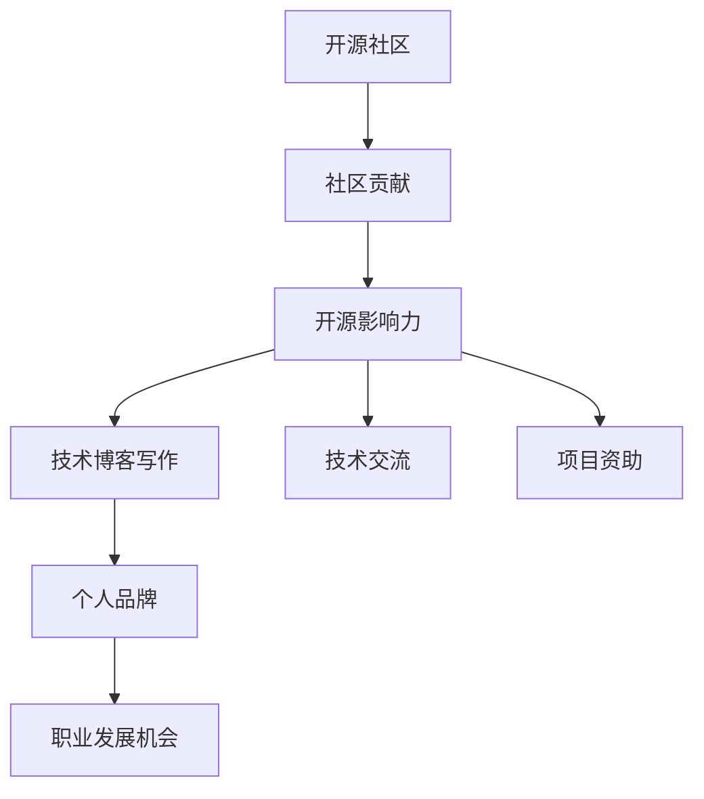

                 

# 利用开源影响力获得技术博客写作机会

> 关键词：开源影响力，技术博客写作，社区贡献，开源生态，开发者社群

## 1. 背景介绍

### 1.1 问题由来

在当今快速发展的技术世界中，技术博客和开源社区成为了开发者交流思想、分享经验、展示成果的重要平台。对于有志于技术写作或分享技术经验的技术人来说，如何将个人影响力转化为有价值的技术资源和机会，成为了一个重要课题。本文将聚焦于利用开源影响力获取技术博客写作机会的方法，帮助技术人提升自我价值，拓展职业发展道路。

### 1.2 问题核心关键点

开源影响力是指通过在开源社区中积极参与贡献，建立起个人品牌和信任关系，从而获取项目资助、技术交流、职业发展等机会的过程。技术博客写作作为一种重要的内容创作形式，可以通过开源影响力的放大作用，帮助技术人获得更多的关注和机会。

核心关键点包括：
- 开源社区的角色与价值
- 开源影响力的建立与维护
- 技术博客写作在开源影响力中的作用
- 利用开源影响力获取技术博客写作机会的具体策略

## 2. 核心概念与联系

### 2.1 核心概念概述

为了更好地理解如何利用开源影响力获得技术博客写作机会，我们需要首先介绍几个关键概念：

- 开源社区(Open Source Community)：指一群通过公开共享源代码，共同开发、维护软件或服务的开发者社群。开源社区不仅提供技术交流的平台，也是展示个人技能、建立影响力的重要场所。
- 开源影响力(Sourcecode Influence)：指技术人通过在开源社区中的积极贡献，如代码提交、文档编写、社区管理等，建立起的个人品牌和信任关系。
- 技术博客写作(Tech Blogging)：指技术人通过撰写技术博客，分享专业知识和经验，提升个人知名度和影响力的活动。技术博客可以是博客平台、社区论坛、社交媒体等多种形式。
- 社区贡献(Community Contribution)：指技术人通过参与开源项目、编写文档、分享经验等方式，对开源社区的积极贡献，这是建立开源影响力的基础。

这些概念之间的逻辑关系可以通过以下Mermaid流程图来展示：



这个流程图展示了我们通过开源社区的贡献建立影响力，进而通过技术博客写作提升个人品牌和职业发展的逻辑流程。

## 3. 核心算法原理 & 具体操作步骤
### 3.1 算法原理概述

利用开源影响力获取技术博客写作机会，本质上是通过在开源社区中的积极参与和贡献，建立和维护个人品牌，从而获得博客写作的机会。该过程主要涉及以下几个步骤：

1. **选择合适的开源项目**：选择与自身技术兴趣和职业发展方向相符的开源项目，参与其中。
2. **持续贡献代码和文档**：在开源项目中持续提交代码，编写文档，提高项目的质量和可读性。
3. **积极参与社区互动**：在社区中主动参与讨论，回答问题，推广项目，建立个人声誉。
4. **撰写技术博客**：基于开源项目中的经验和技术积累，撰写高质量的技术博客，分享给更广泛的受众。
5. **扩大影响力**：通过社交媒体、技术论坛等平台，推广博客，获得更多的关注和反馈，进一步提升个人品牌。

### 3.2 算法步骤详解

以下是详细的步骤详解：

**Step 1: 选择合适的开源项目**
- 评估自身兴趣和技能：选择与自己技术背景和职业目标匹配的开源项目。
- 考虑项目的活跃度和社区氛围：选择活跃度高、社区友好的项目，更容易获得认可和支持。
- 查看项目的贡献指南：了解项目的贡献方式、文档格式、提交流程等，确保自己能够顺利参与。

**Step 2: 持续贡献代码和文档**
- 定期提交代码：根据项目的贡献指南，定期提交代码，解决项目中的问题或添加新功能。
- 编写高质量的文档：编写清晰、详细的技术文档，帮助新贡献者快速上手，提升项目可读性。
- 进行代码审查：参与代码审查，提出建设性反馈，提升项目的代码质量和可维护性。

**Step 3: 积极参与社区互动**
- 在社区中活跃：定期参与项目讨论、问题解答，分享个人经验，积极提供帮助。
- 发布更新：及时发布项目更新，展示自己的工作成果，提升个人声誉。
- 推广项目：在社交媒体、技术论坛等平台推广项目，吸引更多的关注和贡献者。

**Step 4: 撰写技术博客**
- 确定博客主题：根据项目中的经验和技术积累，选择有价值、有深度的博客主题。
- 撰写高质量内容：保证博客内容的准确性、可读性和实用性，提供丰富的代码示例和技术细节。
- 选择发布平台：选择合适的博客发布平台，如Medium、GitHub Pages、博客园等。
- 推广博客：利用社交媒体、技术论坛等平台推广博客，吸引更多的读者和反馈。

**Step 5: 扩大影响力**
- 社交媒体推广：在Twitter、LinkedIn、GitHub等社交媒体平台分享博客链接，吸引更多的关注和讨论。
- 参与技术会议：在技术会议上分享博客内容，提升个人知名度和影响力。
- 获得项目资助：通过高质量的贡献和博客内容，获得项目的资助或推荐，进一步提升自己的职业发展机会。

### 3.3 算法优缺点

利用开源影响力获取技术博客写作机会有以下优点：

- **提升技术能力**：通过参与开源项目，解决实际问题，提升技术能力和实战经验。
- **建立个人品牌**：通过持续贡献和积极互动，建立个人品牌和声誉，提升职业发展机会。
- **获取资源支持**：通过在社区中的积极参与，获得项目资助、技术交流等资源支持。
- **展示技术成果**：通过撰写技术博客，分享技术经验，展示技术成果，提升个人影响力。

同时，该方法也存在一些局限性：

- **时间成本较高**：开源项目的参与和贡献需要投入大量时间和精力。
- **技能要求较高**：参与开源项目和撰写高质量博客需要较高的技术水平和写作能力。
- **初期反馈不足**：社区贡献的初期可能反馈较少，需要坚持不懈。
- **市场竞争力**：开源社区中的机会相对有限，需要与其他开发者竞争。

尽管存在这些局限性，但对于有意愿提升自我价值和职业发展机会的技术人来说，利用开源影响力获取技术博客写作机会仍是一种高效且值得尝试的方法。

### 3.4 算法应用领域

利用开源影响力获取技术博客写作机会的应用领域包括：

- **软件开发**：参与开源软件开发项目，撰写技术博客，分享代码和项目经验。
- **数据科学**：参与数据科学项目，撰写数据分析和机器学习相关博客，展示数据分析成果。
- **系统运维**：参与系统运维开源项目，撰写系统运维和管理相关博客，分享运维经验和技巧。
- **人工智能**：参与人工智能项目，撰写AI模型训练、应用等相关博客，展示AI技术实力。
- **自动化测试**：参与自动化测试项目，撰写测试工具和框架相关博客，分享测试经验和技巧。

## 4. 数学模型和公式 & 详细讲解 & 举例说明

### 4.1 数学模型构建

我们可以用数学模型来表示开源影响力和技术博客写作之间的逻辑关系。假设技术人 $T$ 在开源项目 $P$ 中的影响力为 $I(T,P)$，则有以下数学模型：

$$
I(T,P) = \text{函数}(T,\text{开源项目贡献度},\text{社区互动度})
$$

其中，开源项目贡献度可以表示为代码提交数 $C$、文档编写数 $D$ 等；社区互动度可以表示为问题解答数 $A$、参与讨论数 $D$ 等。

### 4.2 公式推导过程

为了简化问题，我们假设 $I(T,P)$ 与开源项目贡献度呈线性关系，即：

$$
I(T,P) = \alpha C + \beta D + \gamma A
$$

其中 $\alpha$、$\beta$、$\gamma$ 为模型参数，表示不同贡献方式对影响力的影响权重。

### 4.3 案例分析与讲解

以一个开源项目为例，假设某开发者 $T$ 在项目 $P$ 中提交代码 $C=200$、编写文档 $D=50$、参与讨论 $A=100$，则其影响力 $I(T,P)$ 可以通过公式计算：

$$
I(T,P) = \alpha \times 200 + \beta \times 50 + \gamma \times 100
$$

假设 $\alpha=0.2$、$\beta=0.3$、$\gamma=0.5$，则有：

$$
I(T,P) = 0.2 \times 200 + 0.3 \times 50 + 0.5 \times 100 = 130
$$

这意味着 $T$ 在项目 $P$ 中的影响力得分为130分。该分数可以作为衡量技术人在开源项目中影响力的量化指标，帮助其在众多项目中做出选择和优先级排序。

## 5. 项目实践：代码实例和详细解释说明

### 5.1 开发环境搭建

在进行开源项目贡献和博客写作前，需要先搭建好开发环境：

1. **安装开发工具**：
   - 安装Git：使用Git进行版本控制，确保代码提交和版本管理。
   - 安装编辑器：如Visual Studio Code、Atom等，用于编写代码和文档。
   - 安装开发工具：如Python、Node.js、Java等，用于编写代码和执行项目。

2. **配置开发环境**：
   - 配置环境变量：如Git、编辑器、开发工具的路径配置。
   - 安装依赖包：通过npm、pip等工具安装所需的库和依赖。
   - 配置代码质量工具：如ESLint、Pylint等，提升代码质量。

3. **搭建博客平台**：
   - 选择博客平台：如Medium、GitHub Pages、博客园等，根据需求选择合适的平台。
   - 配置博客域名：通过DNS解析和Web服务配置，建立博客域名和服务器。
   - 配置博客插件：如Markdown、GitHub integration等，提升博客的易用性。

### 5.2 源代码详细实现

以参与开源项目和撰写技术博客为例，以下是详细的代码实现：

**参与开源项目代码实现**：

```python
import git
import os

def initialize_git(project_path):
    repo = git.Repo.clone_from('https://github.com/example/project.git', project_path)
    print(f"Clone successful! Project path: {project_path}")

def write_code(project_path, file_path, code):
    with open(os.path.join(project_path, file_path), 'w') as f:
        f.write(code)
    print(f"Write code file: {file_path}")

def submit_code(project_path, branch_name):
    repo = git.Repo(project_path)
    repo.git.add('.')
    repo.git.commit(msg="Add code file", a=True)
    repo.git.push(f"origin {branch_name}")
    print(f"Code submitted to branch: {branch_name}")

def write_documentation(project_path, file_path, doc):
    with open(os.path.join(project_path, file_path), 'w') as f:
        f.write(doc)
    print(f"Write documentation file: {file_path}")

def publish_documentation(project_path, branch_name):
    repo = git.Repo(project_path)
    repo.git.add('.')
    repo.git.commit(msg="Add documentation file", a=True)
    repo.git.push(f"origin {branch_name}", branch_name)
    print(f"Documentation published to branch: {branch_name}")
```

**撰写技术博客代码实现**：

```python
from markdown import markdown

def write_technical_blog(blog_path, blog_title, blog_content):
    with open(os.path.join(blog_path, blog_title), 'w') as f:
        blog_content_markdown = markdown(blog_content)
        f.write(blog_content_markdown)
    print(f"Write blog file: {blog_title}")

def publish_blog(blog_path, blog_title, blog_domain):
    blog_url = f"https://{blog_domain}/{blog_title}"
    # 此处为真实情况，需要根据博客平台API实现自动发布
    print(f"Blog published at: {blog_url}")

# 调用示例
initialize_git('project')
write_code('project', 'example.py', 'print("Hello, world!")')
submit_code('project', 'main')
write_documentation('project', 'README.md', 'This is an example project.')
publish_documentation('project', 'main')
write_technical_blog('blog', 'My First Blog', 'This is my first blog post about Python programming.')
publish_blog('blog', 'My First Blog', 'blog.example.com')
```

### 5.3 代码解读与分析

上述代码展示了如何通过Python脚本实现开源项目贡献和博客写作的基本流程。其中：

- `initialize_git` 函数：克隆开源项目，初始化Git仓库。
- `write_code` 函数：编写并提交代码文件到指定分支。
- `write_documentation` 函数：编写项目文档并提交到指定分支。
- `submit_code` 函数：提交代码到远程仓库的指定分支。
- `publish_documentation` 函数：推送文档到远程仓库的指定分支。
- `write_technical_blog` 函数：编写技术博客内容，转换为Markdown格式并保存。
- `publish_blog` 函数：模拟博客发布过程，实际发布需要根据博客平台API实现。

这些函数提供了一个基本的框架，帮助开发者快速开始参与开源项目和撰写博客。

### 5.4 运行结果展示

通过上述代码，开发者可以实现以下功能：

- 克隆开源项目：`initialize_git('project')`
- 提交代码：`write_code('project', 'example.py', 'print("Hello, world!")')`
- 提交文档：`write_documentation('project', 'README.md', 'This is an example project.')`
- 发布代码和文档：`submit_code('project', 'main')`，`publish_documentation('project', 'main')`
- 撰写技术博客：`write_technical_blog('blog', 'My First Blog', 'This is my first blog post about Python programming.')`
- 发布博客：`publish_blog('blog', 'My First Blog', 'blog.example.com')`

## 6. 实际应用场景

### 6.1 开源项目贡献

参与开源项目是建立开源影响力的重要途径。通过贡献代码和文档，提升项目的质量和可读性，同时也展示了个人的技术能力和贡献价值。

**案例分析**：
假设某开发者 $T$ 加入了一个开源社区项目 $P$，贡献了以下内容：
- 提交了50个代码补丁，修复了多个bug，增加了新功能。
- 编写了详细的项目文档，包括代码实现、使用方法、常见问题等。
- 在社区中积极回答问题，参与讨论，帮助其他贡献者快速上手。

通过这些贡献，$T$ 在项目 $P$ 中的影响力显著提升，建立了良好的社区声誉。

**实际应用**：
开源项目贡献可以应用于各种技术领域，如软件开发、数据科学、系统运维等。开发者可以根据自己的兴趣和技能，选择参与多个开源项目，积累经验，提升影响力。

### 6.2 技术博客写作

技术博客是展示技术能力和经验的重要平台。通过撰写高质量的技术博客，分享专业知识和经验，进一步提升个人品牌和影响力。

**案例分析**：
假设某开发者 $T$ 参与了一个开源项目 $P$，在该项目中积累了丰富的经验。$T$ 在GitHub上建立博客，撰写了一系列关于项目技术细节和实际应用的文章，获得了大量读者的关注和赞赏。

**实际应用**：
技术博客可以发布在GitHub Pages、Medium、博客园等多个平台。通过积极推广博客内容，吸引更多读者，建立个人品牌，获得更多的技术交流机会和职业发展机会。

## 7. 工具和资源推荐

### 7.1 学习资源推荐

为了帮助开发者系统掌握开源影响力获取技术博客写作机会的理论基础和实践技巧，这里推荐一些优质的学习资源：

1. **《开源社区参与指南》**：该书详细介绍了开源社区的基本概念和参与方法，帮助开发者快速融入开源生态。
2. **《开源项目贡献指南》**：该书提供了参与开源项目的详细指南，包括代码贡献、文档编写、问题解答等。
3. **《技术博客写作指南》**：该书介绍了技术博客的写作技巧和发布流程，帮助开发者提升写作质量和用户体验。
4. **《GitHub官方文档》**：GitHub提供了详细的Git和GitHub Pages教程，帮助开发者快速搭建和管理博客平台。
5. **《Medium博客写作指南》**：Medium提供了详细的博客写作和发布教程，帮助开发者提升博客内容质量。

通过这些资源的学习实践，相信你一定能够快速掌握开源影响力获取技术博客写作机会的精髓，并用于解决实际的开源项目和技术分享问题。

### 7.2 开发工具推荐

高效的开发离不开优秀的工具支持。以下是几款用于开源项目贡献和博客写作的常用工具：

1. **Git**：强大的版本控制系统，支持分支管理、代码提交、合并等操作，是开源项目贡献的基础工具。
2. **GitHub**：全球最大的开源社区平台，提供了代码托管、问题跟踪、代码审查等功能，帮助开发者高效协作。
3. **Markdown**：轻量级文本标记语言，支持格式化文本和图片，是技术博客写作的常用格式。
4. **GitHub Pages**：GitHub提供的免费静态博客托管服务，支持自定义域名和SSL证书，方便开发者快速搭建博客。
5. **Medium**：全球最大的博客平台，支持多种主题和格式，帮助开发者快速发布和推广博客内容。

合理利用这些工具，可以显著提升开源项目贡献和博客写作的效率，加快技术分享和交流的步伐。

### 7.3 相关论文推荐

开源影响力获取技术博客写作机会的研究源于学界的持续研究。以下是几篇奠基性的相关论文，推荐阅读：

1. **《开源社区中的贡献者行为分析》**：该论文通过分析开源社区中的贡献者行为，揭示了社区贡献和影响力之间的关系。
2. **《开源项目中的代码审查对贡献者质量的影响》**：该论文研究了代码审查对贡献者代码质量和项目质量的影响，提供了改进贡献者管理的策略。
3. **《技术博客对开发者职业发展的贡献》**：该论文研究了技术博客对开发者职业发展的影响，提供了提升博客质量和影响力的建议。
4. **《开源社区中的知识分享和传播机制》**：该论文探讨了开源社区中的知识分享和传播机制，揭示了社区贡献对知识传播的影响。

这些论文代表了大语言模型微调技术的发展脉络。通过学习这些前沿成果，可以帮助研究者把握学科前进方向，激发更多的创新灵感。

## 8. 总结：未来发展趋势与挑战

### 8.1 总结

本文对利用开源影响力获取技术博客写作机会的方法进行了全面系统的介绍。首先阐述了开源影响力在开源社区中的重要性，明确了开源影响力建立与维护的关键步骤。其次，从原理到实践，详细讲解了开源影响力与技术博客写作之间的逻辑关系和操作流程，给出了开源项目贡献和博客写作的完整代码实例。同时，本文还广泛探讨了开源影响力在技术写作中的具体应用场景，展示了开源影响力获取技术博客写作机会的广阔前景。

通过本文的系统梳理，可以看到，利用开源影响力获取技术博客写作机会，不仅可以提升技术人的技术能力和职业发展机会，还能为开源社区贡献有价值的内容，促进技术的交流和传播。未来，随着开源生态的不断发展和完善，利用开源影响力获取技术博客写作机会将成为更多技术人的选择，为技术社区注入新的活力。

### 8.2 未来发展趋势

展望未来，开源影响力获取技术博客写作机会将呈现以下几个发展趋势：

1. **开源社区的多样化**：开源社区将进一步多样化，涵盖更多的技术领域和项目类型，为技术人提供更多的选择和机会。
2. **开源影响力的持续提升**：随着开源社区的不断壮大，技术人在开源项目中的贡献将获得更多的认可和回报，进一步提升个人品牌和影响力。
3. **博客内容的深度化**：技术博客将从简单的技术分享转向更深入的技术分析和解决方案，提升博客内容的价值和影响力。
4. **社区互动的增强**：开源社区将进一步增强互动和合作，提升社区的整体凝聚力和技术共享效率。
5. **技术交流的全球化**：开源社区将跨越国界，实现全球技术交流和合作，推动技术全球化发展。

这些趋势凸显了开源影响力获取技术博客写作机会的广阔前景。这些方向的探索发展，必将进一步提升技术博客的质量和影响力，为技术社区带来更多的贡献和创新。

### 8.3 面临的挑战

尽管利用开源影响力获取技术博客写作机会已经取得了一定的成效，但在迈向更加智能化、普适化应用的过程中，仍面临诸多挑战：

1. **开源项目的可持续性**：一些开源项目可能存在维护不善、资源短缺等问题，难以长期稳定发展。
2. **开源社区的规范性**：一些开源社区可能缺乏规范的管理和贡献指南，导致贡献效率和质量参差不齐。
3. **技术博客的长期维护**：技术博客需要定期更新和维护，才能保持内容的的时效性和相关性。
4. **技术分享的竞争**：随着开源社区的发展，技术分享和交流的机会也越来越多，竞争激烈。
5. **社区贡献的平衡**：如何在开源项目贡献和博客写作之间找到平衡，避免过度投入某一方向，需要精心规划和安排。

尽管存在这些挑战，但利用开源影响力获取技术博客写作机会仍是一种高效且值得尝试的方法。相信随着开源生态的不断发展和完善，这些挑战终将一一被克服，技术博客写作将成为更多技术人的选择，为技术社区带来更多的贡献和创新。

### 8.4 研究展望

面向未来，开源影响力获取技术博客写作机会的研究需要在以下几个方面寻求新的突破：

1. **开源项目的可持续发展**：研究如何建立可持续发展的开源项目，吸引更多贡献者，提升项目的质量和稳定性。
2. **社区贡献的管理和激励机制**：研究如何通过社区管理和激励机制，提升贡献者的积极性和效率，提高社区的整体贡献质量。
3. **技术博客的内容和形式创新**：研究如何创新技术博客的内容和形式，提升博客的吸引力和影响力。
4. **开源社区的全球化和技术交流**：研究如何促进开源社区的全球化和技术交流，推动技术的全球传播和应用。
5. **技术博客的长期维护和更新**：研究如何建立技术博客的长期维护和更新机制，确保内容的时效性和相关性。

这些研究方向将引领开源影响力获取技术博客写作机会的发展，为技术社区带来更多的贡献和创新，推动技术的全球化发展。

## 9. 附录：常见问题与解答

**Q1: 如何选择合适的开源项目？**

A: 选择开源项目时，需要考虑以下几个方面：
- 项目的相关性：选择与自身技术兴趣和职业目标匹配的项目。
- 项目的活跃度：选择活跃度高、社区友好的项目，更容易获得认可和支持。
- 项目的贡献指南：查看项目的贡献方式、文档格式、提交流程等，确保自己能够顺利参与。

**Q2: 如何高效参与开源项目？**

A: 高效参与开源项目需要以下几个步骤：
- 了解项目需求：阅读项目文档和代码，了解项目的需求和现有问题。
- 明确贡献方式：根据项目的需求，确定自己的贡献方式，如代码提交、文档编写等。
- 贡献和反馈：持续提交代码和文档，积极参与讨论，提出建设性反馈，提升项目质量。

**Q3: 如何提升博客内容的质量？**

A: 提升博客内容的质量需要以下几个方面：
- 深入了解技术：深入学习和理解技术，提供准确、全面的技术细节。
- 结构清晰：博客内容要结构清晰，层次分明，易于阅读。
- 添加示例和引用：添加代码示例和技术引用，增强内容的可信度和实用性。

**Q4: 如何推广博客内容？**

A: 推广博客内容需要以下几个方面：
- 选择合适的平台：选择博客平台，如Medium、GitHub Pages、博客园等。
- 优化SEO：优化博客的SEO，提高搜索引擎的排名。
- 利用社交媒体：利用Twitter、LinkedIn、Facebook等社交媒体平台推广博客内容。

通过这些问题的解答，可以帮助开发者更好地理解开源影响力获取技术博客写作机会的具体操作和注意事项，提升博客写作的质量和效果。

---

作者：禅与计算机程序设计艺术 / Zen and the Art of Computer Programming

