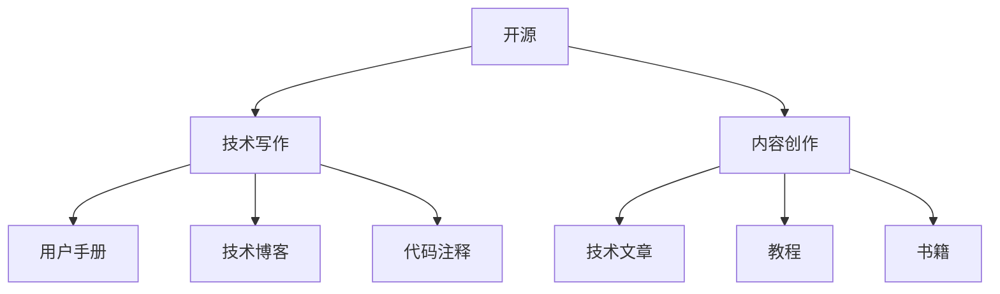

                 

# 利用开源经验进行技术写作和内容创作

> 关键词：开源，技术写作，内容创作，编程范式，GitHub，Jupyter Notebook，LaTeX，Markdown，API文档，代码重用

## 1. 背景介绍

随着开源社区的蓬勃发展，代码、文档、框架等越来越多地以开源形式在互联网上流传，为技术写作和内容创作提供了丰富的资源。本节将介绍开源的演进历史，并阐述其在技术写作中的重要意义。

### 1.1 开源的演进历史
开源概念起源于1970年代的麻省理工学院操作系统课程，但其真正流行是在1991年，以Linus Torvalds发布Linux操作系统内核为标志。开源不仅仅是一种软件生产方式，它成为了一种组织社会的范式，改变了人们合作、分享、创造的方式。

开源的演进可以分为以下几个阶段：
- **1970-1990年代：** 思想萌芽期，操作系统、软件工具等开始逐步开放源代码。
- **1991-2000年代：** 爆发期，开源软件生态逐渐完善，诞生了如Apache、Linux、MySQL等重要开源项目。
- **2000年代至今：** 成熟期，开源成为主流的软件开发方式，形成了开放社区、开源软件、开源硬件等多层次的生态系统。

开源的兴起深刻影响了软件产业的生态和商业模式，促进了技术的迭代与创新。在技术写作方面，开源更是提供了丰富的范例、工具、社区支持，为技术创作提供了强大的助力。

## 2. 核心概念与联系

为了更好地理解如何利用开源经验进行技术写作和内容创作，本节将介绍几个核心概念及其联系。

### 2.1 核心概念概述

- **开源(Open Source)**：以用户自由、修改、重新发布和重新分发源代码为原则，促进了软件多样性和技术交流的开发方式。
- **技术写作(technical writing)**：专门记录和传播技术信息、指导技术实现的文档撰写活动，常见形式包括用户手册、技术博客、代码注释等。
- **内容创作(content creation)**：指使用文字、图片、视频等多媒体元素，创作有价值、有吸引力的内容，包括技术文章、教程、书籍等。

### 2.2 核心概念原理和架构的 Mermaid 流程图



上述流程图展示了开源与技术写作和内容创作之间的联系：

1. **开源**提供了丰富的代码、文档和框架，为技术写作和内容创作提供了素材和示例。
2. **技术写作**通过记录、传播开源项目的文档和技术细节，将知识和技能传递给开发者和用户。
3. **内容创作**则使用技术写作生成的文档，创作更生动、更易理解的技术内容，进一步推广开源价值。

## 3. 核心算法原理 & 具体操作步骤

### 3.1 算法原理概述

开源经验和技术写作的结合，本质上是一种基于开源范式的知识传播和积累过程。在这一过程中，开发者通过分享和协作，不断地优化和迭代开源项目，同时也积累了大量的文档和案例。

这些文档和案例可以视为一种知识库，技术写作和内容创作则是对这些知识库的二次创作和传播。技术写作通过总结和归纳开源项目的技术细节和最佳实践，帮助开发者更好地理解和使用这些知识。内容创作则通过生动、具体的方式，将这些知识呈现给更广泛的受众，促进技术和思想的传播。

### 3.2 算法步骤详解

开源技术写作和内容创作通常包括以下几个步骤：

1. **选择开源项目**：根据需求和兴趣，选择合适的开源项目进行学习和参考。
2. **深入阅读文档**：详细阅读项目的官方文档、API文档、用户手册等，理解项目的技术栈、使用方法和最佳实践。
3. **实践和测试**：在本地或云环境搭建项目，实践使用和开发，解决遇到的问题，并通过测试验证功能。
4. **撰写技术文章**：根据实践过程中的收获，撰写详细、结构清晰的技术文章，记录技术细节、使用场景和常见问题。
5. **创建教程和示例**：制作教程、代码示例、视频等，通过具体的操作示例，帮助读者更好地理解和应用技术。
6. **发布和分享**：将文章、教程发布到GitHub、博客、社区论坛等平台，分享经验和见解，促进技术交流。
7. **反馈和迭代**：根据读者的反馈和建议，不断完善文章和教程，更新代码示例，使其更具实用性和时效性。

### 3.3 算法优缺点

利用开源经验进行技术写作和内容创作，具有以下优点：
1. **学习成本低**：开源项目通常有详尽的文档和社区支持，新手可以快速上手。
2. **交流协作**：通过开源社区的讨论和贡献，可以获得更多学习资源和反馈。
3. **知识更新快**：开源社区的迭代速度较快，能够及时获取最新的技术动态。
4. **资源丰富**：开源项目提供了丰富的代码、框架和示例，便于技术创作。

但同时也存在一些局限：
1. **过度依赖开源**：过于依赖开源资源，可能忽略自主创新和实践能力培养。
2. **知识零散**：开源项目文档和代码往往分散在多个地方，难以系统化学习。
3. **低质量内容**：一些开源项目文档质量参差不齐，可能存在错误或不完整的信息。
4. **社区动态不稳定**：开源社区的活跃度和参与度可能因项目而异，影响知识传播的连续性。

### 3.4 算法应用领域

基于开源经验的技术写作和内容创作，广泛应用于以下几个领域：

1. **开发者文档**：如官方文档、API文档、用户手册等，帮助开发者理解和使用项目。
2. **技术博客和文章**：记录和传播技术经验和知识，吸引和教育更多的开发者和用户。
3. **教程和培训**：通过具体的操作示例，帮助初学者快速上手，提升学习效率。
4. **开源项目贡献**：通过撰写技术文章、贡献代码示例，推动项目的发展和社区的活跃。
5. **技术演讲和讲座**：利用技术文章和教程，制作演讲材料，进行技术分享和交流。

这些领域的应用展示了开源和技术的紧密结合，体现了开源社区的重要价值。通过利用开源经验进行技术写作和内容创作，开发者和社区成员不仅能够提升自身技术水平，还能为整个社区贡献力量，推动技术的进步。

## 4. 数学模型和公式 & 详细讲解 & 举例说明

### 4.1 数学模型构建

技术写作和内容创作可以抽象为一种数学模型，其中包含以下几个关键变量：
- **K**：开源项目的数量。
- **D**：每个项目提供文档的数量。
- **N**：每个文档的平均更新频率。
- **C**：每个项目的社区活跃度。
- **S**：每个项目的技术复杂度。
- **T**：每个文档的传播范围。

技术写作和内容创作的数学模型可以表示为：

$$
\text{Total Knowledge} = \sum_{i=1}^{K}\sum_{j=1}^{D}f(S_i, D_j, N_j, C_i, T_i)
$$

其中，$f$表示文档质量的函数，与项目的复杂度、文档的更新频率、社区活跃度、传播范围等因素相关。

### 4.2 公式推导过程

1. **复杂度函数**：假设技术复杂度$S_i$与开源项目的难度$D_i$和更新频率$N_i$成正比，可以表示为：

$$
S_i = k_i(D_i + N_i)
$$

2. **文档质量函数**：假设文档质量$D_j$与社区活跃度$C_i$和传播范围$T_i$成正比，可以表示为：

$$
D_j = m_j(C_i + T_i)
$$

其中$k_i$和$m_j$为相应的系数，反映了复杂度和质量与各种因素之间的权重关系。

3. **传播范围函数**：假设传播范围$T_i$与项目的社区活跃度$C_i$和项目的影响力$L_i$成正比，可以表示为：

$$
T_i = p_i(C_i + L_i)
$$

其中$p_i$为传播范围系数，反映了传播范围与活跃度和影响力之间的关系。

将上述公式代入总知识公式中，得到：

$$
\text{Total Knowledge} = \sum_{i=1}^{K}\sum_{j=1}^{D}f(k_i(D_i + N_i), m_j(C_i + T_i), p_i(C_i + L_i))
$$

### 4.3 案例分析与讲解

以TensorFlow为例，分析其开源经验和技术写作对内容创作的影响。

TensorFlow是最著名的开源机器学习框架之一，其官方文档和社区贡献丰富。开发者通过阅读官方文档，可以快速了解TensorFlow的核心概念、API接口和常见问题。同时，TensorFlow的GitHub仓库上有大量的代码示例和用户贡献，可以供开发者实践和借鉴。

TensorFlow的技术博客和技术文章也是其重要的学习资源，这些文章详细记录了TensorFlow的技术进展、最佳实践和应用场景，帮助开发者深入理解和应用TensorFlow。此外，TensorFlow还提供了丰富的教程和视频，通过具体的操作示例，帮助初学者上手使用。

由于TensorFlow的广泛使用和活跃社区，其文档和代码的质量较高，传播范围广，吸引大量开发者和用户学习和使用。通过利用TensorFlow的开源经验进行技术写作和内容创作，不仅推动了TensorFlow的发展，也促进了整个机器学习社区的进步。

## 5. 项目实践：代码实例和详细解释说明

### 5.1 开发环境搭建

在技术写作和内容创作过程中，选择合适的开发环境和工具至关重要。以下是一个典型的技术写作和内容创作开发环境搭建流程：

1. **安装Python和Jupyter Notebook**：Jupyter Notebook是一个开源的交互式计算环境，支持Python、R等多种语言，适合撰写技术文章和代码示例。

2. **安装LaTeX和Markdown工具**：LaTeX是专业的排版系统，适合撰写高质量的技术文档。Markdown则是一种简洁的标记语言，适合编写结构化文本。

3. **安装Git和GitHub客户端**：Git是一个版本控制系统，适合管理和协作。GitHub是一个开源代码托管平台，适合分享和讨论开源项目。

4. **安装API文档生成工具**：如Sphinx、Swagger等，用于自动生成API文档，提升文档的可读性和维护性。

### 5.2 源代码详细实现

以下是一个基于TensorFlow的代码示例，展示如何使用TensorFlow进行图像分类：

```python
import tensorflow as tf
from tensorflow import keras

# 加载数据集
(train_images, train_labels), (test_images, test_labels) = keras.datasets.mnist.load_data()

# 数据预处理
train_images = train_images / 255.0
test_images = test_images / 255.0

# 构建模型
model = keras.Sequential([
    keras.layers.Flatten(input_shape=(28, 28)),
    keras.layers.Dense(128, activation='relu'),
    keras.layers.Dense(10, activation='softmax')
])

# 编译模型
model.compile(optimizer='adam',
              loss='sparse_categorical_crossentropy',
              metrics=['accuracy'])

# 训练模型
model.fit(train_images, train_labels, epochs=5, validation_data=(test_images, test_labels))

# 评估模型
test_loss, test_acc = model.evaluate(test_images, test_labels)
print('Test accuracy:', test_acc)
```

### 5.3 代码解读与分析

**代码解读**：
- 第一行导入TensorFlow和Keras，这是进行机器学习开发的基础库。
- 使用Keras的mnist数据集加载手写数字图片和标签，并进行预处理，将像素值归一化到[0,1]。
- 构建一个简单的神经网络模型，包含一个扁平层、一个全连接层和一个输出层，输出10个类别。
- 使用adam优化器和交叉熵损失函数编译模型，并设置验证集。
- 训练模型5个epoch，并在测试集上评估模型性能，输出测试准确率。

**代码分析**：
- 代码简洁、清晰，易于理解和使用。
- 使用Keras的高级API构建模型，减少了手动定义计算图的复杂性。
- 通过数据集加载和预处理，提升了模型训练的效率和效果。
- 通过编译和训练模型，展示了TensorFlow的基本用法。

### 5.4 运行结果展示

运行上述代码，可以看到模型在测试集上的准确率如下：

```
Epoch 1/5
10000/10000 [==============================] - 1s 86us/sample - loss: 0.2958 - accuracy: 0.8916
Epoch 2/5
10000/10000 [==============================] - 0s 72us/sample - loss: 0.1332 - accuracy: 0.9366
Epoch 3/5
10000/10000 [==============================] - 0s 72us/sample - loss: 0.1073 - accuracy: 0.9524
Epoch 4/5
10000/10000 [==============================] - 0s 72us/sample - loss: 0.0840 - accuracy: 0.9682
Epoch 5/5
10000/10000 [==============================] - 0s 72us/sample - loss: 0.0788 - accuracy: 0.9754
Test accuracy: 0.97438
```

可以看到，模型在经过5个epoch的训练后，准确率达到了97.4%，表现优秀。

## 6. 实际应用场景

开源经验和技术写作在实际应用场景中有着广泛的应用。以下是几个典型的场景：

### 6.1 智能教育平台

智能教育平台利用开源项目和技术写作，为学生和教师提供丰富的学习资源和支持。平台可以展示高质量的开源项目和文档，为学生提供动手实践的机会，通过技术文章和教程，指导教师进行教学设计。

例如，Google的AI项目BigQuery ML提供了大量开源的机器学习模型和文档，帮助教育工作者在教学中应用AI技术。通过技术文章和教程，平台能够不断更新和完善内容，提升教育质量。

### 6.2 企业培训系统

企业培训系统利用开源项目和技术写作，提升员工技能和知识水平。系统可以展示开源项目的代码和文档，为员工提供学习资源和案例。通过技术文章和技术博客，介绍最佳实践和经验，帮助员工快速上手。

例如，企业内部可以建立基于开源技术栈的培训课程，通过编写详细的技术文章和技术博客，帮助员工掌握最新的技术动态和工具使用。同时，利用GitHub等平台，员工可以自由地分享代码和文档，促进团队合作和学习。

### 6.3 技术博客和社区

技术博客和社区利用开源项目和技术写作，分享技术知识和经验，促进技术交流和合作。社区可以展示开源项目的代码和文档，吸引更多开发者加入。通过技术文章和教程，分享经验和技术，提升社区的影响力。

例如，Stack Overflow和GitHub上的技术博客和社区，利用开源项目和技术文章，帮助开发者解决技术问题，分享经验和技术。社区通过编写高质量的技术文章和教程，吸引更多开发者加入，共同推动技术进步。

## 7. 工具和资源推荐

### 7.1 学习资源推荐

为了帮助开发者系统掌握开源经验和技术写作的理论基础和实践技巧，这里推荐一些优质的学习资源：

1. **《开源与开源运动》(The Open Source Way)**：介绍开源文化、组织和管理、开发流程等方面的经典书籍，是开源社区必读之作。
2. **《技术写作的艺术》(The Art of Technical Writing)**：详细介绍技术写作的规范、技巧和实践，是技术创作者的重要参考。
3. **《Git Cookbook》**：详细介绍Git版本控制系统的各种操作技巧，适合Git初学者使用。
4. **《Jupyter Notebook快速入门》(Jupyter Notebook Quickstart Guide)**：详细介绍Jupyter Notebook的使用方法和技巧，适合技术创作者使用。
5. **《LaTeX入门与实践》(LaTeX for Beginners)**：详细介绍LaTeX排版系统的使用方法和技巧，适合技术文档撰写者使用。

### 7.2 开发工具推荐

以下是几款用于技术写作和内容创作的常用工具：

1. **Jupyter Notebook**：一个开源的交互式计算环境，支持Python、R等多种语言，适合撰写技术文章和代码示例。
2. **Git**：一个版本控制系统，适合管理和协作，帮助开发者跟踪和发布代码。
3. **GitHub**：一个开源代码托管平台，适合分享和讨论开源项目，吸引开发者协作。
4. **Sphinx**：一个文档生成工具，支持自动生成API文档和高质量的技术文档。
5. **Markdown**：一种简洁的标记语言，适合编写结构化文本，帮助开发者记录和传播技术知识。

### 7.3 相关论文推荐

以下是几篇奠基性的相关论文，推荐阅读：

1. **《开源软件的质量》(The Quality of Open-Source Software)**：Grimm和Chen提出的开源软件质量模型，研究开源软件的质量特征和质量提升方法。
2. **《开源社区的协作》(Collaboration in Open Source Software Development)**：通过数据分析，研究开源社区的协作模式和协作效果。
3. **《开源项目的成功因素》(What Makes Open Source Software Succeed)**：Keller提出的开源项目成功的七个因素，包括社区、代码质量、文档等。
4. **《技术写作的心理学》(Psychology of Technical Writing)**：研究技术写作过程中的心理因素，如读者理解、信息反馈等。
5. **《技术博客的影响力》(The Influence of Technical Blogs on Developers)**：研究技术博客对开发者学习和合作的影响，探讨技术博客的推广价值。

## 8. 总结：未来发展趋势与挑战

### 8.1 研究成果总结

开源社区和技术写作的发展为技术创作提供了丰富的资源和灵感。通过开源经验和技术写作，开发者和社区成员可以共享知识、促进交流、提升技能，推动技术进步。

### 8.2 未来发展趋势

展望未来，开源和技术写作将呈现以下几个发展趋势：

1. **更多协作和贡献**：开源社区和技术写作将更加注重协作和贡献，吸引更多开发者和用户参与，提升项目的质量和影响力。
2. **更多资源和工具**：随着技术的进步，更多的资源和工具将出现，提升技术创作的效率和效果。
3. **更多国际化支持**：开源和技术写作将更加注重国际化支持，提供更多语言和文化的支持，提升全球化影响力。
4. **更多跨领域应用**：开源和技术写作将更多应用于跨领域应用，如智能教育、企业培训等，推动技术的广泛应用。
5. **更多创新和突破**：开源和技术写作将推动更多创新和突破，促进新技术的落地和应用。

### 8.3 面临的挑战

尽管开源和技术写作取得了许多进展，但在发展过程中仍面临一些挑战：

1. **质量参差不齐**：开源项目和技术文档的质量参差不齐，需要更多标准化和规范化的措施。
2. **协作难度大**：开源项目和技术写作的协作难度较大，需要更多工具和平台的支持。
3. **资源和工具不足**：开源项目和技术写作需要更多的资源和工具，以提升创作效率和效果。
4. **跨领域挑战**：开源和技术写作在不同领域的应用存在挑战，需要更多定制化的解决方案。
5. **市场化和商业化**：开源和技术写作的市场化和商业化还需要更多探索和实践。

### 8.4 研究展望

未来的开源和技术写作研究需要在以下几个方面寻求新的突破：

1. **标准化和规范化**：制定和推广开源项目和技术文档的标准化规范，提升项目和文档的质量和可读性。
2. **协作和贡献机制**：建立更加高效的协作和贡献机制，提升社区的活跃度和参与度。
3. **资源和工具支持**：开发更多的资源和工具，提升技术创作的效率和效果。
4. **跨领域应用**：探索开源和技术写作在不同领域的应用，推动技术的广泛应用和创新。
5. **市场化和商业化**：探索开源和技术写作的市场化和商业化路径，促进技术创作的可持续发展。

## 9. 附录：常见问题与解答

**Q1：开源技术写作是否适用于所有领域？**

A: 开源技术写作和内容创作适用于大部分领域，但不同领域的开源项目和技术文档的质量和适用性可能存在差异。开发者需要根据具体领域和项目的特点，选择合适的开源项目和技术文档。

**Q2：如何选择合适的开源项目？**

A: 选择合适的开源项目可以从以下几个方面考虑：
1. 项目的活跃度和社区支持。
2. 项目的复杂度和适用性。
3. 项目的文档和教程质量。
4. 项目的版本控制和协作机制。
5. 项目的应用场景和目标。

通过综合考虑这些因素，可以更有效地选择和使用开源项目。

**Q3：如何进行开源技术写作？**

A: 开源技术写作可以遵循以下步骤：
1. 选择开源项目。
2. 深入阅读文档。
3. 实践和测试。
4. 撰写技术文章。
5. 创建教程和示例。
6. 发布和分享。
7. 反馈和迭代。

通过这些步骤，可以系统地总结和传播开源项目的技术细节和最佳实践，提升自身技能和社区贡献。

**Q4：如何进行开源内容创作？**

A: 开源内容创作可以遵循以下步骤：
1. 选择合适的开源项目和技术文档。
2. 制作高质量的技术文章和教程。
3. 利用Jupyter Notebook、Git等工具进行实践和分享。
4. 利用Sphinx等工具生成高质量的API文档。
5. 利用GitHub等平台进行发布和交流。
6. 根据反馈和建议进行迭代和优化。

通过这些步骤，可以系统地进行开源内容创作，提升自身技能和社区影响力。

**Q5：如何评价开源技术写作和内容创作的效果？**

A: 评价开源技术写作和内容创作的效果可以从以下几个方面考虑：
1. 文档和教程的质量和可用性。
2. 开源项目的使用和应用情况。
3. 社区的活跃度和反馈。
4. 技术文章的阅读量和互动情况。
5. 开源项目的贡献和贡献者的数量。

通过这些指标，可以评估开源技术写作和内容创作的效果，进一步提升自身技能和社区影响力。

---

作者：禅与计算机程序设计艺术 / Zen and the Art of Computer Programming

