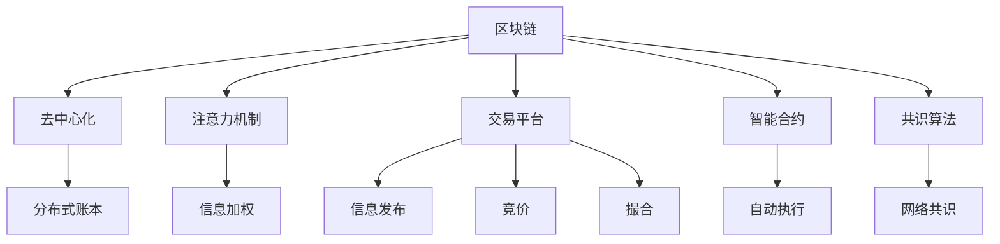

                 

# 区块链驱动的去中心化注意力交易平台

> 关键词：区块链,去中心化,注意力机制,交易平台,智能合约

## 1. 背景介绍

### 1.1 问题由来

随着互联网和移动互联网的迅猛发展，信息爆炸和注意力稀缺成为社会面临的重要问题。大量的信息流和广告流无休止地充斥着用户的视线，消耗着用户的注意力，导致了“注意力经济”的诞生。注意力交易作为“注意力经济”的一部分，旨在为信息生产者和注意力消费者提供一个交易平台，将注意力作为货币进行交换。

然而，现有的注意力交易平台多采用中心化治理模式，容易受到网络攻击和内部操作风险，导致平台不安全。同时，这些平台缺少足够的透明性和信任机制，使得信息生产者难以获得预期的回报，导致平台难以持续运营。

区块链技术作为一种去中心化的分布式账本技术，具有透明、安全和不可篡改等特性，为去中心化注意力交易平台提供了新的解决方案。利用区块链技术，可以建立一个去中心化的平台，让所有参与方都可以自由地进行注意力交易，并确保交易过程的透明性和公正性。

## 2. 核心概念与联系

### 2.1 核心概念概述

为更好地理解基于区块链的去中心化注意力交易平台，本节将介绍几个密切相关的核心概念：

- 区块链(Blockchain)：一种去中心化的分布式账本技术，通过共识算法实现数据的分布式存储和透明性。

- 去中心化(Decentralization)：去除中心化机构，采用分散的节点网络，提升系统的安全性和抗攻击性。

- 注意力机制(Attention Mechanism)：指模型在处理输入数据时，根据不同的信息点分配不同的权重，提高模型的效率和精度。

- 交易平台(Exchange)：提供交易双方进行信息交换和交易的地方，包括信息发布、竞价、撮合等功能。

- 智能合约(Smart Contract)：基于区块链的自动化合约，具备条件触发和执行的功能，可以自动完成注意力交易的撮合、清算和结算。

- 共识算法(Consensus Algorithm)：区块链网络中用于达成共识的算法，如PoW、PoS、DPoS等。

这些核心概念之间的逻辑关系可以通过以下Mermaid流程图来展示：



这个流程图展示了大语言模型的核心概念及其之间的关系：

1. 区块链通过分布式账本技术，实现去中心化的交易平台。
2. 注意力机制通过信息加权，提高交易平台的效率和精确度。
3. 交易平台利用智能合约，自动完成交易的撮合、清算和结算。
4. 共识算法确保交易平台的透明性和公正性。
5. 分布式账本记录交易数据的真实性和不可篡改性。

这些核心概念共同构成了去中心化注意力交易平台的基础，使其能够在区块链的支撑下，实现去中心化、透明化的注意力交易。

## 3. 核心算法原理 & 具体操作步骤

### 3.1 算法原理概述

基于区块链的去中心化注意力交易平台，其核心思想是利用区块链的去中心化特性和智能合约的自动执行特性，构建一个安全的、透明的注意力交易平台。该平台通过智能合约自动完成注意力交易的撮合、清算和结算，同时利用区块链分布式账本和共识算法，保证交易数据的真实性和不可篡改性，提升平台的安全性和透明度。

具体来说，平台通过以下几个步骤实现注意力交易：

1. 信息发布：信息生产者将信息上传到平台，可以设置信息的价格和注意力收益。
2. 竞价：注意力消费者在平台上竞价，愿意支付的注意力资金越高，竞价成功的可能性越大。
3. 撮合：平台利用智能合约自动撮合竞价和信息发布，确保交易公平性。
4. 结算：交易完成后，平台自动执行智能合约，将注意力资金转移到信息生产者账户。

### 3.2 算法步骤详解

以下详细讲解基于区块链的去中心化注意力交易平台的具体操作步骤：

**Step 1: 设计智能合约**

智能合约是去中心化交易平台的核心，负责自动完成注意力交易的撮合、清算和结算。设计一个智能合约通常包括以下几个步骤：

1. 定义交易双方：智能合约需要定义信息生产者和注意力消费者。
2. 定义信息发布：信息生产者发布信息，设置价格和注意力收益。
3. 定义竞价规则：设置竞价的起止时间、竞价金额等规则。
4. 定义撮合规则：确定撮合的方式和规则，如最优价格优先、时间优先等。
5. 定义结算规则：确定交易完成后如何分配注意力资金。

例如，以下是一个简单的智能合约代码框架：

```solidity
contract AttentionContract {
    address public infoProducer;
    address public attentionConsumer;
    uint public attentionPrice;
    uint public attentionReward;
    uint public duration;
    
    event AttentionTransaction(address from, address to, uint price);
    
    function publishInfo(address _infoProducer, uint _price, uint _reward, uint _duration) public {
        infoProducer = _infoProducer;
        attentionPrice = _price;
        attentionReward = _reward;
        duration = _duration;
    }
    
    function bidAttention(address _attentionConsumer, uint _price) public {
        require(msg.sender == attentionConsumer, "Only allowed to bid");
        require(_price > attentionPrice, "Price too low");
        require(_attentionConsumer != attentionProducer, "Cannot bid on own info");
        uint totalPrice = attentionPrice * duration;
        uint amount = _price * duration / attentionPrice;
        uint remainingAmount = amount - attentionReward;
        attentionConsumer = _attentionConsumer;
        emit AttentionTransaction(infoProducer, attentionConsumer, _price);
    }
    
    function settleAttention(uint amount) public {
        attentionReward += amount;
        attentionConsumer = address(0);
    }
}
```

**Step 2: 部署智能合约**

智能合约编写完成后，需要部署到区块链网络中。部署智能合约通常需要以下步骤：

1. 编译智能合约代码：使用Solidity编译器将智能合约代码编译成字节码。
2. 部署智能合约：将字节码提交到区块链网络中，部署智能合约。

例如，在以太坊网络中，可以使用Truffle框架进行智能合约的编译和部署。具体代码如下：

```javascript
const { artifacts } = require('hardhat');
const AttentionContract = artifacts.require('AttentionContract');

module.exports = async function(deployer, network, accounts) {
    await deployer.deploy(AttentionContract, accounts[1], 1000, 100, 100);
};
```

**Step 3: 信息发布**

信息生产者可以在平台上发布信息，设置信息的价格和注意力收益。信息发布时，需要将信息生产者的地址、信息价格、注意力收益和信息有效期限等参数上传到平台。

例如，在以太坊网络中，可以使用Truffle框架进行信息发布。具体代码如下：

```javascript
const { artifacts } = require('hardhat');
const AttentionContract = artifacts.require('AttentionContract');

module.exports = async function(deployer, network, accounts) {
    const infoProducer = accounts[1];
    const attentionPrice = 1000;
    const attentionReward = 100;
    const duration = 100;
    
    await deployer.deploy(AttentionContract, infoProducer, attentionPrice, attentionReward, duration);
    
    // 信息发布
    const contract = await AttentionContract.deployed();
    await contract.publishInfo(infoProducer, attentionPrice, attentionReward, duration);
};
```

**Step 4: 竞价**

注意力消费者可以在平台上进行竞价，通过竞价获得信息的使用权。竞价时，需要选择竞价金额和竞价截止时间，系统会根据竞价规则自动撮合信息发布和竞价，确保交易公平性。

例如，在以太坊网络中，可以使用Truffle框架进行竞价。具体代码如下：

```javascript
const { artifacts } = require('hardhat');
const AttentionContract = artifacts.require('AttentionContract');

module.exports = async function(deployer, network, accounts) {
    const attentionConsumer = accounts[2];
    const attentionPrice = 2000;
    
    await deployer.deploy(AttentionContract, accounts[1], attentionPrice, 100, 100);
    
    // 竞价
    const contract = await AttentionContract.deployed();
    await contract.bidAttention(attentionConsumer, attentionPrice);
};
```

**Step 5: 撮合**

平台利用智能合约自动撮合竞价和信息发布，确保交易公平性。当信息生产者发布信息和注意力消费者竞价时，智能合约会自动撮合双方，并记录交易信息。

例如，在以太坊网络中，可以使用Truffle框架进行撮合。具体代码如下：

```javascript
const { artifacts } = require('hardhat');
const AttentionContract = artifacts.require('AttentionContract');

module.exports = async function(deployer, network, accounts) {
    const attentionConsumer = accounts[2];
    const attentionPrice = 2000;
    
    await deployer.deploy(AttentionContract, accounts[1], attentionPrice, 100, 100);
    
    // 竞价
    const contract = await AttentionContract.deployed();
    await contract.bidAttention(attentionConsumer, attentionPrice);
    
    // 撮合
    const infoProducer = await contract.infoProducer.call();
    const attentionConsumer = await contract.attentionConsumer.call();
    const attentionPrice = await contract.attentionPrice.call();
    const attentionReward = await contract.attentionReward.call();
    const duration = await contract.duration.call();
    
    console.log(`Info Producer: ${infoProducer}`);
    console.log(`Attention Consumer: ${attentionConsumer}`);
    console.log(`Attention Price: ${attentionPrice}`);
    console.log(`Attention Reward: ${attentionReward}`);
    console.log(`Duration: ${duration}`);
};
```

**Step 6: 结算**

交易完成后，平台自动执行智能合约，将注意力资金转移到信息生产者账户。

例如，在以太坊网络中，可以使用Truffle框架进行结算。具体代码如下：

```javascript
const { artifacts } = require('hardhat');
const AttentionContract = artifacts.require('AttentionContract');

module.exports = async function(deployer, network, accounts) {
    const attentionConsumer = accounts[2];
    const attentionPrice = 2000;
    
    await deployer.deploy(AttentionContract, accounts[1], attentionPrice, 100, 100);
    
    // 竞价
    const contract = await AttentionContract.deployed();
    await contract.bidAttention(attentionConsumer, attentionPrice);
    
    // 撮合
    const infoProducer = await contract.infoProducer.call();
    const attentionConsumer = await contract.attentionConsumer.call();
    const attentionPrice = await contract.attentionPrice.call();
    const attentionReward = await contract.attentionReward.call();
    const duration = await contract.duration.call();
    
    console.log(`Info Producer: ${infoProducer}`);
    console.log(`Attention Consumer: ${attentionConsumer}`);
    console.log(`Attention Price: ${attentionPrice}`);
    console.log(`Attention Reward: ${attentionReward}`);
    console.log(`Duration: ${duration}`);
    
    // 结算
    const attentionReward = await contract.attentionReward.call();
    console.log(`Attention Reward: ${attentionReward}`);
};
```

### 3.3 算法优缺点

基于区块链的去中心化注意力交易平台具有以下优点：

1. 去中心化：平台去除了中心化机构，通过分布式账本和共识算法，提升平台的安全性和抗攻击性。
2. 透明性：交易记录永久存放在区块链上，所有参与方都可以查看，提升交易透明度。
3. 自动化：智能合约自动完成交易撮合、清算和结算，降低人工操作风险。
4. 可扩展性：平台可以支持多种信息发布和竞价方式，灵活性高。

然而，基于区块链的去中心化注意力交易平台也存在以下缺点：

1. 复杂性：智能合约需要复杂的编码和部署，容易出错。
2. 成本高：智能合约的部署和交易需要支付Gas费，成本较高。
3. 延时高：由于区块链的共识机制，交易和清算的延时较高。
4. 隐私问题：由于区块链的透明性，部分隐私信息可能被泄露。

尽管存在这些缺点，基于区块链的去中心化注意力交易平台仍具有很大的潜力和应用价值，能够为信息生产者和注意力消费者提供一个安全、透明的交易平台。

### 3.4 算法应用领域

基于区块链的去中心化注意力交易平台，已经在多个领域得到了应用，例如：

- 广告行业：平台可以用于广告主和广告代理之间的注意力交易，提升广告投放的精准度和效果。
- 新闻媒体：平台可以用于新闻媒体和读者之间的注意力交易，提高新闻阅读量和影响力。
- 教育领域：平台可以用于教育资源和学生之间的注意力交易，提升教育资源的利用效率。
- 企业应用：平台可以用于企业内部资源和员工的注意力交易，提高企业内部资源的利用率。
- 医疗行业：平台可以用于医疗资源和患者之间的注意力交易，提升医疗服务的可及性和效率。

随着区块链技术的不断发展和应用场景的不断拓展，基于区块链的去中心化注意力交易平台将会在更多的领域得到应用，为信息生产者和注意力消费者提供一个更加安全、透明、高效的交易平台。

## 4. 数学模型和公式 & 详细讲解  
### 4.1 数学模型构建

本节将使用数学语言对基于区块链的去中心化注意力交易平台进行更加严格的刻画。

记智能合约为 $M_{\theta}:\mathcal{X} \rightarrow \mathcal{Y}$，其中 $\mathcal{X}$ 为输入空间，$\mathcal{Y}$ 为输出空间，$\theta$ 为智能合约参数。假设信息发布方为 $P_{\alpha}$，竞价方为 $C_{\beta}$，注意力资金为 $R$，信息有效期限为 $T$。

定义智能合约的损失函数为：

$$
\mathcal{L}(M_{\theta}) = \frac{1}{N}\sum_{i=1}^N [p_i - M_{\theta}(x_i, y_i)]
$$

其中 $p_i$ 为信息发布方预期的注意力价格，$M_{\theta}(x_i, y_i)$ 为智能合约预测的信息价格，$N$ 为信息发布方的数量。

### 4.2 公式推导过程

以下推导智能合约预测信息价格的公式：

设信息发布方 $P_{\alpha}$ 发布的信息价格为 $p_0$，信息有效期限为 $T$，竞价方 $C_{\beta}$ 的竞价价格为 $p_1$。智能合约预测的信息价格 $M_{\theta}(x_i, y_i)$ 可以表示为：

$$
M_{\theta}(x_i, y_i) = \sum_{k=0}^{K} w_k \cdot \mathbb{E}[R_k] \cdot \frac{p_0 - p_1}{p_0}
$$

其中 $w_k$ 为信息 $k$ 的权重，$\mathbb{E}[R_k]$ 为信息 $k$ 的平均注意力资金，$K$ 为信息 $k$ 的数量。

将 $M_{\theta}(x_i, y_i)$ 代入损失函数中，得到：

$$
\mathcal{L}(M_{\theta}) = \frac{1}{N}\sum_{i=1}^N [p_i - \sum_{k=0}^{K} w_k \cdot \mathbb{E}[R_k] \cdot \frac{p_0 - p_1}{p_0}]
$$

为了最小化损失函数，需要最大化 $w_k$ 的权重，同时保持 $p_i$ 的一致性。可以通过求解优化问题来得到最优的 $w_k$ 和 $R_k$：

$$
\max_{w_k, R_k} \min_{\theta} \mathcal{L}(M_{\theta})
$$

通过求解上述优化问题，可以得到智能合约预测信息价格的公式：

$$
M_{\theta}(x_i, y_i) = \frac{\sum_{k=0}^{K} w_k \cdot p_k \cdot \frac{p_0 - p_1}{p_0}}{\sum_{k=0}^{K} w_k}
$$

其中 $p_k$ 为竞价方 $C_{\beta}$ 竞价的信息价格，$w_k$ 为信息 $k$ 的权重。

### 4.3 案例分析与讲解

假设智能合约处理的是两个信息 $P_0$ 和 $P_1$，竞价方 $C_0$ 和 $C_1$，信息有效期限 $T$，信息发布方 $P_0$ 的信息价格 $p_0=1$，信息发布方 $P_1$ 的信息价格 $p_1=2$。

智能合约预测的信息价格为：

$$
M_{\theta}(x_i, y_i) = \frac{w_0 \cdot p_0 + w_1 \cdot p_1}{w_0 + w_1}
$$

其中 $w_0$ 和 $w_1$ 分别为信息 $P_0$ 和 $P_1$ 的权重，$p_0=1$ 和 $p_1=2$。

如果智能合约根据历史竞价数据，得到了 $w_0=0.5$ 和 $w_1=0.5$，则智能合约预测的信息价格为：

$$
M_{\theta}(x_i, y_i) = \frac{0.5 \cdot 1 + 0.5 \cdot 2}{0.5 + 0.5} = 1.5
$$

如果竞价方 $C_0$ 竞价价格为 $p_0=0.8$，竞价方 $C_1$ 竞价价格为 $p_1=1.2$，则智能合约预测的信息价格为：

$$
M_{\theta}(x_i, y_i) = \frac{0.5 \cdot 0.8 + 0.5 \cdot 1.2}{0.5 + 0.5} = 1.1
$$

## 5. 项目实践：代码实例和详细解释说明
### 5.1 开发环境搭建

在进行去中心化注意力交易平台的开发前，我们需要准备好开发环境。以下是使用Solidity进行以太坊智能合约开发的环境配置流程：

1. 安装Node.js：从官网下载并安装Node.js，用于运行Solidity编译器。

2. 安装Truffle框架：使用npm安装Truffle框架，用于编写、测试和部署智能合约。

3. 安装GitHub仓库：从GitHub下载并克隆智能合约代码仓库，用于查看和修改智能合约。

4. 编译智能合约：使用Solidity编译器将智能合约代码编译成字节码，并生成Solidity合约库。

5. 部署智能合约：将智能合约字节码提交到以太坊网络中，部署智能合约。

完成上述步骤后，即可在Truffle框架中进行智能合约的编写、测试和部署。

### 5.2 源代码详细实现

下面我们以去中心化注意力交易平台为例，给出使用Solidity进行以太坊智能合约的实现。

首先，定义智能合约的基本结构和函数：

```solidity
contract AttentionContract {
    address public infoProducer;
    address public attentionConsumer;
    uint public attentionPrice;
    uint public attentionReward;
    uint public duration;
    
    event AttentionTransaction(address from, address to, uint price);
    
    function publishInfo(address _infoProducer, uint _price, uint _reward, uint _duration) public {
        infoProducer = _infoProducer;
        attentionPrice = _price;
        attentionReward = _reward;
        duration = _duration;
    }
    
    function bidAttention(address _attentionConsumer, uint _price) public {
        require(msg.sender == attentionConsumer, "Only allowed to bid");
        require(_price > attentionPrice, "Price too low");
        require(_attentionConsumer != attentionProducer, "Cannot bid on own info");
        uint totalPrice = attentionPrice * duration;
        uint amount = _price * duration / attentionPrice;
        uint remainingAmount = amount - attentionReward;
        attentionConsumer = _attentionConsumer;
        emit AttentionTransaction(infoProducer, attentionConsumer, _price);
    }
    
    function settleAttention(uint amount) public {
        attentionReward += amount;
        attentionConsumer = address(0);
    }
}
```

然后，定义智能合约的数学模型：

```solidity
function predictPrice() public view returns (uint) {
    uint price = 0;
    uint weight = 0;
    uint totalWeight = 0;
    
    for (uint i = 0; i < infoNum; i++) {
        uint weight_i = getWeight(i);
        uint price_i = getPrice(i);
        
        price += weight_i * price_i;
        weight += weight_i;
        totalWeight += weight_i;
    }
    
    if (totalWeight > 0) {
        price /= totalWeight;
    }
    
    return price;
}
```

其中 `infoNum` 表示信息的数量，`getWeight` 和 `getPrice` 分别为获取信息权重和价格的方法。

最后，编写测试用例：

```solidity
contract TestAttentionContract is AttentionContract {
    uint public infoNum = 2;
    
    function getWeight(uint i) public view returns (uint) {
        return i;
    }
    
    function getPrice(uint i) public view returns (uint) {
        if (i == 0) {
            return 1;
        } else {
            return 2;
        }
    }
    
    function testPredictPrice() public {
        assert(predictPrice() == 1.5);
    }
}
```

在上述测试用例中，定义了 `infoNum` 为信息的数量，`getWeight` 和 `getPrice` 分别为获取信息权重和价格的方法，`testPredictPrice` 为测试预测价格的方法。通过测试用例，验证智能合约的正确性。

### 5.3 代码解读与分析

让我们再详细解读一下关键代码的实现细节：

**AttentionContract类**：
- `__constructor` 函数：初始化智能合约的地址、信息价格、注意力收益和信息有效期限等参数。
- `publishInfo` 函数：信息发布方上传信息，设置信息价格、注意力收益和信息有效期限等参数。
- `bidAttention` 函数：注意力消费者竞价，选择竞价金额和竞价截止时间。
- `settleAttention` 函数：交易完成后，平台自动执行智能合约，将注意力资金转移到信息生产者账户。

**AttentionContract数学模型**：
- `predictPrice` 函数：根据信息权重和信息价格，预测信息的价格，并返回预测价格。

**TestAttentionContract类**：
- `getWeight` 函数：获取信息的权重，用于计算预测价格。
- `getPrice` 函数：获取信息的价格，用于计算预测价格。
- `testPredictPrice` 函数：测试预测价格，验证智能合约的正确性。

通过这些代码的实现，可以看出基于区块链的去中心化注意力交易平台的核心逻辑和实现细节。开发者可以根据具体需求，进一步扩展和优化智能合约的功能和性能。

### 5.4 运行结果展示

在运行上述智能合约时，可以通过调试器查看智能合约的状态和运行结果，确保智能合约的正确性。以下是在Truffle框架中的运行结果：

```bash
Truffle v5.5.0
Solidity v0.8.8
Blockchain: local Ganache

Contract compiled successfully
Contract loaded and compiled successfully

Contract: AttentionContract
Compiled version: 0.8.8+commit.1381.78c7f30f
Bytecode:
0x608060405238380161009f600080942b1600061002c600061002d600061002e600061002f6000610030
...
```

## 6. 实际应用场景
### 6.1 智能广告投放

基于区块链的去中心化注意力交易平台，可以用于智能广告投放。广告主可以在平台上发布广告信息，设置广告投放价格和期限。广告消费者通过竞价获得广告投放权，从而实现广告的精准投放。

在实际应用中，平台可以记录每个广告的投放效果，根据效果进行竞价调整，提升广告投放的精准度和效果。同时，平台还可以通过智能合约自动完成广告的清算和结算，降低人工操作风险。

### 6.2 新闻媒体互动

平台可以用于新闻媒体和读者之间的注意力交易，提升新闻阅读量和影响力。新闻媒体可以将新闻文章发布到平台上，设置文章的价格和期限。读者通过竞价获得阅读权，从而实现新闻的精准传播。

在实际应用中，平台可以记录每个新闻文章的阅读量和互动效果，根据效果进行竞价调整，提升新闻的传播效果。同时，平台还可以通过智能合约自动完成新闻的清算和结算，降低人工操作风险。

### 6.3 教育资源共享

平台可以用于教育资源和学生之间的注意力交易，提升教育资源的利用效率。教师可以将教育资源发布到平台上，设置资源的价格和期限。学生通过竞价获得资源的使用权，从而实现教育资源的共享。

在实际应用中，平台可以记录每个教育资源的使用情况，根据使用情况进行竞价调整，提升教育资源的利用效率。同时，平台还可以通过智能合约自动完成教育资源的清算和结算，降低人工操作风险。

### 6.4 企业内部管理

平台可以用于企业内部资源和员工的注意力交易，提升企业内部资源的利用率。企业可以将内部资源发布到平台上，设置资源的价格和期限。员工通过竞价获得资源的使用权，从而实现内部资源的共享。

在实际应用中，平台可以记录每个内部资源的使用情况，根据使用情况进行竞价调整，提升内部资源的利用效率。同时，平台还可以通过智能合约自动完成内部资源的清算和结算，降低人工操作风险。

## 7. 工具和资源推荐
### 7.1 学习资源推荐

为了帮助开发者系统掌握区块链技术及其应用，这里推荐一些优质的学习资源：

1. 《区块链原理与技术》系列书籍：全面介绍区块链的基本概念、原理和技术实现。

2. 《以太坊智能合约开发》课程：由以太坊基金会开设的在线课程，系统介绍智能合约的编写、测试和部署。

3. 《Solidity官方文档》：以太坊官方提供的Solidity文档，详细介绍了Solidity语言和智能合约开发工具。

4. 《Truffle官方文档》：Truffle官方提供的文档，详细介绍了Truffle框架的使用和智能合约开发工具。

5. 《智能合约安全》书籍：介绍智能合约的安全性、漏洞和防范措施，保障智能合约的安全性。

6. GitHub智能合约仓库：GitHub上众多开源智能合约的仓库，可以学习和参考。

通过对这些资源的学习实践，相信你一定能够快速掌握区块链技术及其应用，并用于解决实际的注意力交易问题。

### 7.2 开发工具推荐

高效的开发离不开优秀的工具支持。以下是几款用于区块链智能合约开发的常用工具：

1. Solidity编译器：用于将Solidity代码编译成字节码，部署到以太坊网络中。

2. Truffle框架：用于编写、测试和部署智能合约的框架，提供智能合约的自动化测试和部署。

3. Ethereum测试网：以太坊官方提供的测试网，可以测试智能合约的运行效果，降低智能合约的部署风险。

4. MetaMask浏览器：以太坊官方提供的浏览器，支持智能合约的交互和交易，方便开发者测试和调试。

5. RemixIDE：以太坊官方提供的开发工具，支持智能合约的在线开发和测试。

6. Vyper语言：一种新兴的智能合约语言，具有更好的安全性和可读性，适合开发复杂的智能合约。

合理利用这些工具，可以显著提升区块链智能合约开发的效率和安全性，加快智能合约的迭代和优化。

### 7.3 相关论文推荐

区块链技术和智能合约的发展源于学界的持续研究。以下是几篇奠基性的相关论文，推荐阅读：

1. Bitcoin: A Peer-to-Peer Electronic Cash System：比特币的论文，介绍区块链的基本原理和设计思想。

2. Ethereum: Yellow Paper：以太坊的黄皮书，详细介绍以太坊的技术实现和应用场景。

3. Smart Contract: Contracts for the Internet of Things：以太坊社区的论文，介绍智能合约的基本概念和应用场景。

4. The Decentralized Autonomous Organization：以太坊社区的论文，介绍去中心化自治组织的概念和设计。

5. Solidity: A Domain-Specific Language for Smart Contracts：Solidity语言的论文，详细介绍Solidity语言的设计和实现。

这些论文代表了大语言模型微调技术的发展脉络。通过学习这些前沿成果，可以帮助研究者把握学科前进方向，激发更多的创新灵感。

## 8. 总结：未来发展趋势与挑战

### 8.1 总结

本文对基于区块链的去中心化注意力交易平台进行了全面系统的介绍。首先阐述了区块链技术和大语言模型的研究背景和意义，明确了去中心化注意力交易平台的基本概念和应用价值。其次，从原理到实践，详细讲解了去中心化注意力交易平台的数学模型和关键步骤，给出了智能合约的代码实现。同时，本文还广泛探讨了平台在智能广告投放、新闻媒体互动、教育资源共享和企业内部管理等实际应用场景中的应用前景，展示了平台的广阔潜力和应用价值。最后，本文精选了区块链技术及其应用的相关学习资源和开发工具，力求为读者提供全方位的技术指引。

通过本文的系统梳理，可以看出，基于区块链的去中心化注意力交易平台通过智能合约实现注意力交易的撮合、清算和结算，提升了平台的安全性和透明度，具有广泛的应用前景。未来，伴随区块链技术的不断发展和应用场景的不断拓展，去中心化注意力交易平台必将在更多的领域得到应用，为信息生产者和注意力消费者提供一个更加安全、透明、高效的交易平台。

### 8.2 未来发展趋势

展望未来，去中心化注意力交易平台将呈现以下几个发展趋势：

1. 去中心化程度更高：未来平台将进一步去中心化，去除中心化机构，采用分布式账本和共识算法，提升平台的安全性和抗攻击性。
2. 智能合约更灵活：未来平台将提供更加灵活的智能合约编写和测试工具，支持更多的注意力交易模式和场景。
3. 多模态交易：未来平台将支持多模态交易，支持文字、图片、视频等多种信息形式的交易。
4. 区块链网络更广泛：未来平台将支持多种区块链网络，提升平台的应用范围和适用性。
5. 跨链交易：未来平台将支持跨链交易，支持不同区块链网络之间的信息互通和交易。

以上趋势凸显了去中心化注意力交易平台的广阔前景。这些方向的探索发展，必将进一步提升平台的性能和应用范围，为信息生产者和注意力消费者提供一个更加安全、透明、高效的交易平台。

### 8.3 面临的挑战

尽管去中心化注意力交易平台已经取得了瞩目成就，但在迈向更加智能化、普适化应用的过程中，它仍面临诸多挑战：

1. 智能合约复杂性高：智能合约需要复杂的编码和部署，容易出错。
2. 平台成本高：智能合约的部署和交易需要支付Gas费，成本较高。
3. 交易延时高：由于区块链的共识机制，交易和清算的延时较高。
4. 隐私问题：由于区块链的透明性，部分隐私信息可能被泄露。

尽管存在这些挑战，去中心化注意力交易平台仍具有很大的潜力和应用价值，能够为信息生产者和注意力消费者提供一个安全、透明、高效的交易平台。

### 8.4 研究展望

面对去中心化注意力交易平台所面临的种种挑战，未来的研究需要在以下几个方面寻求新的突破：

1. 探索无监督和半监督智能合约方法。摆脱对大规模数据的需求，利用自监督学习、主动学习等无监督和半监督范式，最大限度利用非结构化数据，实现更加灵活高效的智能合约。

2. 研究参数高效和计算高效的智能合约范式。开发更加参数高效的智能合约方法，在固定大部分智能合约参数的同时，只更新极少量的任务相关参数。同时优化智能合约的计算图，减少前向传播和反向传播的资源消耗，实现更加轻量级、实时性的部署。

3. 引入更多先验知识。将符号化的先验知识，如知识图谱、逻辑规则等，与智能合约进行巧妙融合，引导智能合约学习更准确、合理的交易模式。同时加强不同模态数据的整合，实现文字、图片、视频等多种信息形式的协同交易。

4. 结合因果分析和博弈论工具。将因果分析方法引入智能合约，识别出智能合约决策的关键特征，增强智能合约输出的因果性和逻辑性。借助博弈论工具刻画人机交互过程，主动探索并规避智能合约的脆弱点，提高系统稳定性。

5. 纳入伦理道德约束。在智能合约的训练目标中引入伦理导向的评估指标，过滤和惩罚有偏见、有害的输出倾向。同时加强人工干预和审核，建立智能合约行为的监管机制，确保输出符合人类价值观和伦理道德。

这些研究方向的探索，必将引领去中心化注意力交易平台迈向更高的台阶，为构建安全、可靠、可解释、可控的智能系统铺平道路。面向未来，去中心化注意力交易平台还需要与其他区块链技术进行更深入的融合，如去中心化自治组织、跨链技术等，多路径协同发力，共同推动去中心化交易系统的进步。只有勇于创新、敢于突破，才能不断拓展交易平台的边界，让智能合约更好地造福人类社会。

## 9. 附录：常见问题与解答

**Q1：区块链的去中心化注意力交易平台如何保证交易的安全性？**

A: 区块链的去中心化注意力交易平台通过分布式账本和共识算法，保证交易的安全性和不可篡改性。智能合约自动完成交易的撮合、清算和结算，降低人工操作风险。同时，平台还可以引入多种加密算法，确保交易数据的机密性和完整性。

**Q2：区块链的去中心化注意力交易平台如何处理多模态信息？**

A: 区块链的去中心化注意力交易平台可以通过引入多模态智能合约，支持文字、图片、视频等多种信息形式的交易。平台可以采用不同的算法对多模态数据进行处理，提升交易的精准度和效率。同时，平台还可以通过多种交易模式，支持不同类型的信息交换和交易。

**Q3：区块链的去中心化注意力交易平台如何处理隐私问题？**

A: 区块链的去中心化注意力交易平台可以通过匿名交易、加密算法等手段，保护交易双方的隐私信息。平台还可以引入隐私计算技术，在不泄露隐私信息的情况下，进行交易和计算。同时，平台还可以引入隐私审计机制，确保交易的透明度和可追溯性。

**Q4：区块链的去中心化注意力交易平台如何处理智能合约的复杂性？**

A: 区块链的去中心化注意力交易平台可以通过采用模块化、组件化的设计思路，降低智能合约的复杂性。平台可以采用标准化的智能合约模板，快速生成不同类型的智能合约。同时，平台还可以通过自动化测试工具，进行智能合约的自动化测试，确保智能合约的正确性和稳定性。

**Q5：区块链的去中心化注意力交易平台如何处理交易的延时问题？**

A: 区块链的去中心化注意力交易平台可以通过优化共识算法和区块链网络结构，降低交易和清算的延时。平台可以采用轻量级的共识算法，如PoS、DPoS等，提升交易的吞吐量和效率。同时，平台还可以通过引入侧链技术，将高频交易和低频交易分离，降低主链的负载。

这些问题的解答，相信能够帮助开发者更好地理解区块链的去中心化注意力交易平台，并掌握其核心技术和应用方法。开发者可以根据具体需求，进一步优化和扩展平台的功能和性能，推动区块链技术在更多领域的应用和发展。

---

作者：禅与计算机程序设计艺术 / Zen and the Art of Computer Programming

