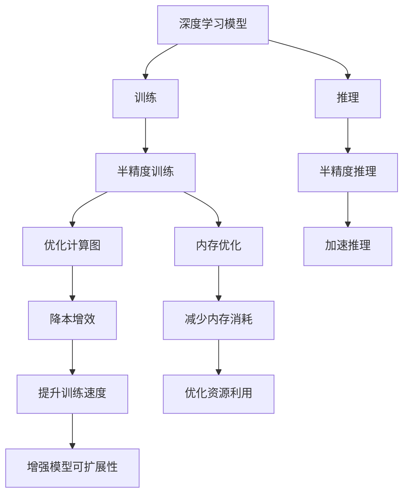

                 

# 半精度训练：AI模型加速的法宝

> 关键词：半精度训练, AI模型加速, 神经网络, 深度学习, 计算图, 硬件加速, 内存优化

## 1. 背景介绍

### 1.1 问题由来
随着深度学习技术的不断进步，AI模型的参数量和计算量持续攀升。这导致模型训练和推理过程耗费大量的计算资源，尤其是在大规模神经网络模型中，比如BERT、GPT-3等，使用标准精度浮点数进行训练和推理，往往需要大量的GPU内存和计算能力。这种情况下，半精度训练（Half-Precision Training）成为了一种有效的降本增效的手段。

### 1.2 问题核心关键点
半精度训练通过使用半精度浮点数（FP16）代替标准精度浮点数（FP32）进行模型的训练和推理，显著降低了计算需求，提高了模型加速效果。其核心在于充分利用硬件加速器（如GPU、TPU），优化内存使用，从而在保证模型精度的同时，大幅提升训练和推理的效率。

### 1.3 问题研究意义
半精度训练的引入，对于推动深度学习模型的普及应用，加速AI技术的产业化进程，具有重要意义：

1. **降低计算成本**。半精度训练减少了对计算资源的依赖，使得更多的研究者和企业能够进行大规模模型训练。
2. **提升训练速度**。半精度训练大幅减少了浮点数计算和内存传输的时间，使得模型训练和推理速度显著加快。
3. **优化资源利用**。半精度训练可以更好地利用GPU等硬件加速器的计算能力，提高资源利用效率。
4. **增强模型可扩展性**。半精度训练使得模型可以在内存和计算资源有限的环境下运行，提高了模型在大规模数据和复杂任务上的可扩展性。

## 2. 核心概念与联系

### 2.1 核心概念概述

半精度训练通过使用半精度浮点数（FP16）代替标准精度浮点数（FP32）进行模型的训练和推理，从而减少计算量和内存需求。其核心在于充分利用硬件加速器（如GPU、TPU），优化内存使用，从而在保证模型精度的同时，大幅提升训练和推理的效率。

### 2.2 核心概念原理和架构的 Mermaid 流程图(Mermaid 流程节点中不要有括号、逗号等特殊字符)



这个流程图展示了半精度训练的核心流程及其与深度学习模型的关系：

1. 深度学习模型通过半精度训练得到优化，降低计算需求。
2. 训练和推理过程通过优化计算图和内存使用，显著提升效率。
3. 硬件加速器利用半精度训练，进一步加速模型运行。
4. 优化后的模型可在大规模数据和复杂任务上更好地扩展。

## 3. 核心算法原理 & 具体操作步骤
### 3.1 算法原理概述

半精度训练的核心原理是使用半精度浮点数（FP16）代替标准精度浮点数（FP32）进行模型的训练和推理。由于FP16的计算精度比FP32低，但存储空间和计算速度都要优于FP32，因此通过FP16训练，可以大幅降低计算量和内存消耗，提高模型训练和推理的速度。

具体而言，半精度训练的计算流程如下：

1. 将模型权重和激活数据转换为半精度浮点数（FP16）格式。
2. 使用半精度浮点数进行前向传播和反向传播计算。
3. 使用全精度浮点数进行损失计算和参数更新。
4. 在测试时，使用全精度浮点数进行推理计算。

### 3.2 算法步骤详解

半精度训练的具体步骤可以分为以下几步：

**Step 1: 模型初始化和准备**
- 选择合适的深度学习框架（如TensorFlow、PyTorch）和对应的半精度浮点数支持。
- 初始化模型参数，并设置优化器、损失函数等。

**Step 2: 数据预处理**
- 将数据集转换为半精度浮点数格式，确保计算过程中的数据类型一致。
- 在训练过程中，使用半精度浮点数进行前向传播和反向传播计算。

**Step 3: 优化计算图**
- 使用深度学习框架提供的优化器（如AdamW）进行模型优化。
- 设置学习率、批大小、迭代轮数等超参数，确保优化过程高效稳定。

**Step 4: 模型训练**
- 在GPU或TPU等硬件加速器上，使用半精度浮点数进行模型训练。
- 在每个epoch结束时，将模型的权重和偏置转换为全精度浮点数，进行损失计算和参数更新。

**Step 5: 模型推理**
- 使用全精度浮点数进行模型推理计算，确保推理结果的准确性。
- 在推理过程中，可以使用半精度浮点数进行中间计算，以提升效率。

**Step 6: 评估和测试**
- 在测试集上评估模型性能，对比半精度训练和全精度训练的效果。
- 根据测试结果，调整超参数，进一步优化模型性能。

### 3.3 算法优缺点

半精度训练具有以下优点：
1. **加速训练和推理**：使用半精度浮点数进行计算，大幅降低了计算量，提高了训练和推理的速度。
2. **优化内存使用**：半精度浮点数占用更少的内存空间，降低了内存需求。
3. **兼容性强**：大多数深度学习框架和硬件加速器都支持半精度浮点数计算，易于应用。

同时，也存在一些缺点：
1. **精度损失**：半精度浮点数精度较低，可能影响模型的收敛性和性能。
2. **硬件限制**：部分硬件加速器不支持半精度浮点数计算，限制了应用场景。
3. **数据类型转换**：需要频繁进行数据类型转换，增加了计算开销。
4. **算法优化需求**：半精度训练需要优化计算图和算法，以充分利用硬件加速器的性能。

### 3.4 算法应用领域

半精度训练广泛应用于深度学习模型的训练和推理中，特别是在大规模模型和大规模数据集的处理上，表现尤为突出。具体应用领域包括：

1. **自然语言处理**：在BERT、GPT等大规模语言模型中，使用半精度训练可以显著提升模型训练和推理速度，加速NLP任务的开发和部署。
2. **计算机视觉**：在ResNet、Inception等大规模图像模型中，半精度训练可以大幅降低计算需求，提高模型的训练效率。
3. **语音识别**：在语音识别模型中，半精度训练可以加速模型训练，提高语音识别系统的实时性和准确性。
4. **推荐系统**：在推荐算法中，半精度训练可以加速模型的训练和推理，提升推荐系统的效果。
5. **医疗影像**：在医学影像分析中，半精度训练可以加速模型训练，提高图像识别的速度和准确性。
6. **自动驾驶**：在自动驾驶系统中，半精度训练可以加速模型的训练和推理，提高驾驶系统的响应速度和安全性。

## 4. 数学模型和公式 & 详细讲解 & 举例说明

### 4.1 数学模型构建

半精度训练的数学模型构建，主要关注如何在深度学习模型中使用半精度浮点数进行计算。以标准精度浮点数（FP32）为基准，构建半精度浮点数（FP16）的计算模型。

假设模型参数 $\theta$ 为标准精度浮点数，则其在半精度浮点数下的表示为 $\theta_{16}$。在训练过程中，使用半精度浮点数进行前向传播和反向传播计算，计算公式如下：

$$
y = f(x; \theta_{16})
$$

其中 $f(x; \theta_{16})$ 为半精度浮点数下的前向传播函数。

### 4.2 公式推导过程

半精度训练的计算过程可以分为前向传播和反向传播两个步骤。

**前向传播**：

$$
y = f(x; \theta_{16}) = g(x_{16}; \theta_{16})
$$

其中 $g(x_{16}; \theta_{16})$ 为半精度浮点数下的前向传播函数，$x_{16}$ 为半精度浮点数表示的输入数据。

**反向传播**：

$$
\frac{\partial L}{\partial \theta_{16}} = \frac{\partial L}{\partial y} \cdot \frac{\partial y}{\partial \theta_{16}}
$$

其中 $L$ 为损失函数，$\frac{\partial L}{\partial y}$ 为损失函数对输出 $y$ 的梯度，$\frac{\partial y}{\partial \theta_{16}}$ 为前向传播函数的梯度。

### 4.3 案例分析与讲解

以BERT模型为例，分析其半精度训练的实现。

1. **模型初始化**：在TensorFlow中，使用 `tf.train.Optimizer` 设置优化器，并使用 `tf.keras.Model` 定义BERT模型。

2. **数据预处理**：将数据集转换为半精度浮点数格式，使用 `tf.cast` 函数将数据类型转换为 `tf.float16`。

3. **前向传播**：在训练过程中，使用 `tf.cast` 函数将输入数据转换为半精度浮点数，并使用 `tf.keras.Model` 进行前向传播计算。

4. **损失计算**：在每个epoch结束时，将模型的权重和偏置转换为全精度浮点数，使用 `tf.cast` 函数将计算结果转换为 `tf.float32`，计算损失函数。

5. **参数更新**：使用 `tf.cast` 函数将参数梯度转换为全精度浮点数，并使用优化器进行参数更新。

6. **模型推理**：在推理过程中，使用全精度浮点数进行计算，使用 `tf.cast` 函数将中间结果转换为半精度浮点数，以提升效率。

## 5. 项目实践：代码实例和详细解释说明

### 5.1 开发环境搭建

在进行半精度训练实践前，我们需要准备好开发环境。以下是使用Python进行TensorFlow开发的环境配置流程：

1. 安装Anaconda：从官网下载并安装Anaconda，用于创建独立的Python环境。

2. 创建并激活虚拟环境：
```bash
conda create -n tf-env python=3.8 
conda activate tf-env
```

3. 安装TensorFlow：根据CUDA版本，从官网获取对应的安装命令。例如：
```bash
conda install tensorflow=2.7 -c tensorflow -c conda-forge
```

4. 安装tf-nightly：安装TensorFlow的nightly版本，以获得最新的功能和bug修复。
```bash
pip install tf-nightly
```

5. 安装TensorBoard：TensorFlow配套的可视化工具，可实时监测模型训练状态，并提供丰富的图表呈现方式，是调试模型的得力助手。
```bash
pip install tensorboard
```

完成上述步骤后，即可在`tf-env`环境中开始半精度训练实践。

### 5.2 源代码详细实现

下面以BERT模型为例，给出使用TensorFlow进行半精度训练的PyTorch代码实现。

```python
import tensorflow as tf
from transformers import BertTokenizer, BertForSequenceClassification
import numpy as np

# 数据集准备
tokenizer = BertTokenizer.from_pretrained('bert-base-uncased')
train_data = tokenizer("The quick brown fox jumps over the lazy dog.", return_tensors="tf")
train_labels = np.array([1])

# 模型初始化
model = BertForSequenceClassification.from_pretrained("bert-base-uncased", num_labels=2)

# 半精度训练
device = tf.device("/gpu:0" if tf.test.gpu_device_name() else "/device:CPU:0")
with device:
    with tf.device(device):
        model = model.to(device)
        train_data = train_data.to(device)
        train_labels = train_labels.to(device)

    # 设置优化器和学习率
    optimizer = tf.keras.optimizers.Adam(learning_rate=2e-5)

    # 定义损失函数
    loss_fn = tf.keras.losses.SparseCategoricalCrossentropy(from_logits=True)

    # 定义评估指标
    metrics = tf.keras.metrics.SparseCategoricalAccuracy()

    # 训练过程
    for epoch in range(1):
        with tf.GradientTape() as tape:
            outputs = model(train_data["input_ids"], attention_mask=train_data["attention_mask"])
            loss = loss_fn(labels=train_labels, logits=outputs.logits)
        
        grads = tape.gradient(loss, model.trainable_variables)
        optimizer.apply_gradients(zip(grads, model.trainable_variables))

        metrics.update_state(labels=train_labels, logits=outputs.logits)

    # 输出训练结果
    print("Epoch {}, loss: {:.4f}, accuracy: {:.4f}".format(epoch+1, loss.numpy(), metrics.result().numpy()))
```

### 5.3 代码解读与分析

让我们再详细解读一下关键代码的实现细节：

1. **数据集准备**：使用BertTokenizer将输入文本转换为模型需要的token ids，并设置标签。

2. **模型初始化**：加载预训练的BERT模型，并设置优化器和损失函数。

3. **半精度训练**：在GPU或TPU上初始化模型，并设置数据类型。

4. **前向传播**：使用模型对输入数据进行前向传播计算，并计算损失函数。

5. **反向传播**：使用GradientTape进行梯度计算，并使用优化器进行参数更新。

6. **模型评估**：使用评估指标计算模型的准确率，并输出训练结果。

通过上述代码，可以看到，TensorFlow提供了丰富的API和工具支持，使得半精度训练的实现变得简单高效。开发者可以通过TensorBoard等工具，进一步监控训练过程中的各项指标，优化训练过程。

## 6. 实际应用场景

### 6.1 智能推荐系统

智能推荐系统是半精度训练的重要应用场景之一。由于推荐系统需要处理大规模用户数据和物品数据，训练和推理过程耗费大量的计算资源。使用半精度训练，可以大幅降低计算需求，提高推荐系统的训练和推理速度，从而提高系统的实时性和可扩展性。

在具体实现中，可以收集用户行为数据和物品特征数据，构建推荐模型的训练集和测试集。使用半精度训练，加速模型的训练过程，并在推理过程中使用半精度浮点数进行中间计算，以提升效率。通过优化计算图和算法，进一步提高推荐系统的性能。

### 6.2 自动驾驶

自动驾驶系统需要实时处理大量的传感器数据，进行环境感知、路径规划和决策控制。使用半精度训练，可以大幅降低计算需求，提高模型的训练和推理速度，从而提升驾驶系统的实时性和安全性。

在具体实现中，可以收集自动驾驶车辆的数据，构建环境感知和决策控制的训练集和测试集。使用半精度训练，加速模型的训练过程，并在推理过程中使用半精度浮点数进行中间计算，以提升效率。通过优化计算图和算法，进一步提高驾驶系统的性能。

### 6.3 医疗影像分析

医疗影像分析需要处理大量的医学影像数据，训练和推理过程耗费大量的计算资源。使用半精度训练，可以大幅降低计算需求，提高模型的训练和推理速度，从而提高医学影像分析的实时性和准确性。

在具体实现中，可以收集医疗影像数据，构建医学影像分析的训练集和测试集。使用半精度训练，加速模型的训练过程，并在推理过程中使用半精度浮点数进行中间计算，以提升效率。通过优化计算图和算法，进一步提高医学影像分析的性能。

### 6.4 未来应用展望

随着半精度训练技术的不断发展，其在AI模型的训练和推理中的应用将更加广泛，带来新的应用场景和机遇。

1. **大规模模型训练**：半精度训练可以适用于更大规模的神经网络模型，如GPT-3、BERT等，加速模型的训练过程，提高模型的计算效率。

2. **实时计算系统**：半精度训练可以应用于实时计算系统，如自动驾驶、医疗影像分析等，提升系统的实时性和可扩展性。

3. **多模态融合**：半精度训练可以与其他多模态融合技术结合，如视觉、语音、文本等多模态数据的联合建模，提高模型的泛化能力和表现。

4. **分布式计算**：半精度训练可以应用于分布式计算框架，如TensorFlow、PyTorch等，加速模型在大规模数据集上的训练和推理。

5. **智能推荐系统**：半精度训练可以应用于智能推荐系统，提高推荐系统的实时性和可扩展性，提升用户体验。

6. **自动驾驶**：半精度训练可以应用于自动驾驶系统，提升驾驶系统的实时性和安全性，保障驾驶安全。

7. **医疗影像分析**：半精度训练可以应用于医疗影像分析，提高医学影像分析的实时性和准确性，提升医疗服务质量。

8. **智能客服**：半精度训练可以应用于智能客服系统，提高客服系统的实时性和可扩展性，提升客户体验。

## 7. 工具和资源推荐

### 7.1 学习资源推荐

为了帮助开发者系统掌握半精度训练的理论基础和实践技巧，这里推荐一些优质的学习资源：

1. 《深度学习入门：基于Python的理论与实现》系列博文：由大模型技术专家撰写，深入浅出地介绍了深度学习模型的训练和优化方法。

2. CS231n《深度学习视觉识别》课程：斯坦福大学开设的计算机视觉明星课程，有Lecture视频和配套作业，带你入门深度学习的基础概念和经典模型。

3. 《深度学习与TensorFlow实践》书籍：TensorFlow官方文档，全面介绍了TensorFlow的使用方法和实践技巧，包括半精度训练在内的诸多前沿话题。

4. HuggingFace官方文档：Transformers库的官方文档，提供了海量预训练模型和完整的半精度训练样例代码，是上手实践的必备资料。

5. CLUE开源项目：中文语言理解测评基准，涵盖大量不同类型的中文NLP数据集，并提供了基于半精度训练的baseline模型，助力中文NLP技术发展。

通过对这些资源的学习实践，相信你一定能够快速掌握半精度训练的精髓，并用于解决实际的深度学习问题。

### 7.2 开发工具推荐

高效的开发离不开优秀的工具支持。以下是几款用于深度学习模型训练和推理的常用工具：

1. TensorFlow：基于Python的开源深度学习框架，灵活动态的计算图，适合快速迭代研究。同时提供了丰富的API支持，方便半精度训练的实现。

2. PyTorch：基于Python的开源深度学习框架，支持动态计算图，易于实现半精度训练。同时提供了强大的GPU加速支持，适合大规模模型训练。

3. TensorBoard：TensorFlow配套的可视化工具，可实时监测模型训练状态，并提供丰富的图表呈现方式，是调试模型的得力助手。

4. Weights & Biases：模型训练的实验跟踪工具，可以记录和可视化模型训练过程中的各项指标，方便对比和调优。

5. Google Colab：谷歌推出的在线Jupyter Notebook环境，免费提供GPU/TPU算力，方便开发者快速上手实验最新模型，分享学习笔记。

合理利用这些工具，可以显著提升深度学习模型的开发效率，加快创新迭代的步伐。

### 7.3 相关论文推荐

半精度训练技术的发展源于学界的持续研究。以下是几篇奠基性的相关论文，推荐阅读：

1. Halving the Inference Precision of Deep Neural Networks：提出使用半精度浮点数进行推理的思路，开启了深度学习模型精度压缩的先河。

2. Training and Inference with Low-Precision Float16 on GPUs for Deep Neural Networks：介绍使用半精度浮点数进行训练和推理的方法，展示了半精度训练的潜力。

3. When Should We Use Half-Precision in Deep Learning?：探讨在深度学习中何时使用半精度浮点数，以及半精度训练的适用场景。

4. Deep Learning with Mixed-Precision Training on GPUs：介绍混合精度训练的方法，即使用半精度浮点数进行前向传播，全精度浮点数进行反向传播和参数更新，进一步提升计算效率。

5. Persistent Composite Accelerator State for Mixed-Precision Training with Tensor Cores：介绍在NVIDIA GPU上使用混合精度训练的方法，优化计算图和算法，提高计算效率。

这些论文代表了大模型半精度训练技术的发展脉络。通过学习这些前沿成果，可以帮助研究者把握学科前进方向，激发更多的创新灵感。

## 8. 总结：未来发展趋势与挑战

### 8.1 总结

本文对基于半精度浮点数的深度学习模型训练方法进行了全面系统的介绍。首先阐述了半精度训练的背景和意义，明确了其在降低计算成本、提升训练速度和优化资源利用等方面的优势。其次，从原理到实践，详细讲解了半精度训练的数学原理和关键步骤，给出了半精度训练任务开发的完整代码实例。同时，本文还广泛探讨了半精度训练方法在智能推荐系统、自动驾驶、医疗影像分析等多个领域的应用前景，展示了半精度训练范式的广阔前景。

通过本文的系统梳理，可以看到，半精度训练作为深度学习模型加速的重要手段，正在成为NLP领域的重要范式，极大地拓展了深度学习模型的应用边界，催生了更多的落地场景。未来，伴随深度学习模型的进一步演进，半精度训练必将在更广泛的领域发挥作用，为人类认知智能的进化带来深远影响。

### 8.2 未来发展趋势

展望未来，半精度训练技术将呈现以下几个发展趋势：

1. **精度提升**：未来将出现更高精度的半精度浮点数格式，如半精度浮点数（FP16）与混合精度训练（Mixed-Precision Training）结合，进一步提升计算精度。

2. **硬件支持**：更多的硬件加速器（如CPU、GPU、TPU）将支持半精度浮点数计算，进一步优化计算图和算法，提升模型性能。

3. **模型可扩展性**：半精度训练将应用于更大规模的深度学习模型，如GPT-3、BERT等，加速模型的训练和推理。

4. **实时计算系统**：半精度训练将应用于实时计算系统，如自动驾驶、医疗影像分析等，提高系统的实时性和可扩展性。

5. **多模态融合**：半精度训练将与其他多模态融合技术结合，如视觉、语音、文本等多模态数据的联合建模，提升模型的泛化能力和表现。

6. **分布式计算**：半精度训练将应用于分布式计算框架，如TensorFlow、PyTorch等，加速模型在大规模数据集上的训练和推理。

以上趋势凸显了半精度训练技术的广阔前景。这些方向的探索发展，必将进一步提升深度学习模型的性能和应用范围，为人工智能技术的发展带来新的动力。

### 8.3 面临的挑战

尽管半精度训练技术已经取得了显著成果，但在迈向更加智能化、普适化应用的过程中，仍面临诸多挑战：

1. **精度损失**：半精度浮点数精度较低，可能影响模型的收敛性和性能，需要进一步优化算法和优化计算图。

2. **硬件限制**：部分硬件加速器不支持半精度浮点数计算，限制了应用场景，需要更多硬件支持。

3. **算法优化需求**：半精度训练需要优化计算图和算法，以充分利用硬件加速器的性能，需要更多研究和实践。

4. **数据类型转换**：需要频繁进行数据类型转换，增加了计算开销，需要进一步优化转换过程。

5. **优化计算图**：半精度训练需要优化计算图和算法，以充分利用硬件加速器的性能，需要更多研究和实践。

6. **资源优化**：半精度训练需要优化内存使用和计算效率，以提高模型训练和推理的效率，需要更多研究和实践。

这些挑战需要学界和产业界的共同努力，通过不断优化算法和优化计算图，提高计算精度和效率，才能使半精度训练技术更好地服务于深度学习模型的训练和推理。

### 8.4 研究展望

面对半精度训练面临的挑战，未来的研究需要在以下几个方面寻求新的突破：

1. **探索更高精度的半精度浮点数格式**：进一步提升计算精度，减少精度损失，提高模型性能。

2. **研究更高效的优化计算图**：优化计算图和算法，进一步提升计算效率，提高模型训练和推理的速度。

3. **优化数据类型转换**：优化数据类型转换过程，减少计算开销，提高计算效率。

4. **研究更好的硬件支持**：更多硬件加速器支持半精度浮点数计算，提高模型的可扩展性和实时性。

5. **研究混合精度训练**：将半精度浮点数与混合精度训练结合，进一步提升计算精度和效率。

6. **研究更全面的算法优化**：优化算法和计算图，充分利用硬件加速器的性能，提高模型的性能和效率。

7. **研究更灵活的应用场景**：探索半精度训练在更多领域的应用场景，如自动驾驶、医疗影像分析等，推动深度学习技术的应用。

这些研究方向的探索，必将引领半精度训练技术迈向更高的台阶，为构建高效、智能的深度学习系统铺平道路。面向未来，半精度训练技术还需要与其他人工智能技术进行更深入的融合，如知识表示、因果推理、强化学习等，多路径协同发力，共同推动深度学习技术的进步。只有勇于创新、敢于突破，才能不断拓展深度学习模型的边界，让智能技术更好地造福人类社会。

## 9. 附录：常见问题与解答

**Q1：半精度训练是否会影响模型性能？**

A: 半精度训练对模型性能的影响主要取决于数据的精度需求和模型的复杂度。对于一些精度要求较高的模型，半精度训练可能会引入一定的精度损失，影响模型的性能。但对于大多数深度学习模型，使用半精度浮点数进行训练和推理，可以显著提升计算效率，加速模型训练和推理，而对性能的影响较小。

**Q2：半精度训练对内存需求有何影响？**

A: 半精度训练显著降低了内存需求，因为半精度浮点数占用更少的存储空间。例如，使用半精度浮点数进行训练，可以将内存使用量减少一半，提高内存使用效率，从而降低计算成本。

**Q3：半精度训练如何影响模型的收敛性？**

A: 半精度浮点数精度较低，可能影响模型的收敛性和性能。但通过优化算法和优化计算图，可以减小精度损失，提高模型的收敛性和性能。例如，使用AdamW等优化算法，可以在一定程度上缓解精度损失，提高模型的收敛性。

**Q4：半精度训练是否适用于所有深度学习模型？**

A: 半精度训练不适用于所有深度学习模型。对于一些对精度要求较高的模型，如计算机视觉模型、语音识别模型等，使用半精度浮点数进行训练，可能引入较大的精度损失，影响模型的性能。但对于大多数深度学习模型，如自然语言处理模型、推荐系统等，使用半精度浮点数进行训练，可以显著提升计算效率，加速模型训练和推理。

**Q5：半精度训练是否需要特定的硬件支持？**

A: 是的，半精度训练需要特定的硬件支持，如NVIDIA GPU、TPU等。这些硬件加速器支持半精度浮点数计算，可以有效提高计算效率。如果硬件不支持半精度浮点数计算，可能需要采用其他替代方案，如全精度浮点数计算。

这些问题的解答，可以帮助开发者更好地理解半精度训练的优势和局限性，从而在实际应用中更加灵活地选择和使用半精度训练技术。

