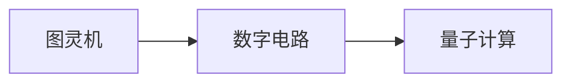

                 

# 回顾与展望：人类计算的发展历程与未来

> 关键词：计算理论,图灵机,数字电路,量子计算,未来技术

## 1. 背景介绍

### 1.1 问题由来

计算理论的发展是人类文明进步的重要推动力之一。从早期的机械计算装置，到电子数字计算机，再到分布式计算系统，以及现代的量子计算，人类在计算技术上经历了多次重大变革。回顾计算技术的发展历程，展望未来的计算形态，对于我们理解和运用最新的计算技术，具有重要意义。

### 1.2 问题核心关键点

计算理论的发展核心在于计算模型的演进，包括从图灵机到数字电路的演进，以及量子计算的兴起。图灵机理论奠定了现代计算理论的基础，数字电路实现了图灵机模型，而量子计算则展示了未来计算的潜力。本节将详细探讨这些计算模型及其演变，以及量子计算的关键突破和挑战。

## 2. 核心概念与联系

### 2.1 核心概念概述

- **图灵机（Turing Machine, TM）**：由英国数学家图灵提出，是一种抽象的计算模型，是现代计算理论的基础。图灵机通过读写带状磁带，模拟各种计算过程，是任何计算问题的有效算法存在的必要条件。

- **数字电路（Digital Circuit）**：基于电子器件如晶体管、逻辑门等构建的电路，实现图灵机模型，能够高效执行二进制逻辑运算。数字电路的优化和集成，是现代电子信息产业的核心技术。

- **量子计算（Quantum Computing）**：利用量子力学原理，实现超越经典计算的计算模型。量子计算通过量子比特（qubit）的叠加和纠缠，提供了前所未有的计算能力，解决某些传统计算方法难以解决的问题。

这些概念之间有着密切的联系和演变关系：图灵机是计算理论的起点，数字电路将图灵机理论转化为实际计算能力，而量子计算则尝试突破经典计算的局限，实现全新的计算范式。

### 2.2 核心概念原理和架构的 Mermaid 流程图



这个流程图展示了计算理论从图灵机到数字电路，再到量子计算的演变路径。

## 3. 核心算法原理 & 具体操作步骤

### 3.1 算法原理概述

- **图灵机原理**：图灵机是一种抽象的计算模型，通过读写带状磁带，执行一系列读写和移动操作，实现任意计算问题。图灵机理论证明，任何可计算问题都可以通过图灵机模型解决。

- **数字电路原理**：数字电路通过逻辑门和触发器等电路元件，实现图灵机模型，能够高效执行二进制逻辑运算。数字电路的优化和集成，使得计算机从早期的机械装置，发展为现代的高速电子设备。

- **量子计算原理**：量子计算利用量子叠加和纠缠现象，实现超越经典计算的计算能力。通过量子比特的演化，量子计算能够在多项式时间内解决某些经典计算难以处理的问题，如大整数分解、搜索问题等。

### 3.2 算法步骤详解

1. **图灵机操作**：图灵机通过读写磁带上的符号，执行计算。每一步操作包括读写和移动，通过有限个状态和转移表来模拟计算过程。

2. **数字电路设计**：设计数字电路时，需要选择合适的逻辑门和触发器，并考虑电路的布线和时序问题。通过逻辑电路的设计和优化，实现图灵机的计算能力。

3. **量子计算实现**：量子计算利用量子比特的叠加和纠缠特性，实现图灵机模型的计算过程。通过量子门的序列操作，实现量子比特的演化，从而执行计算。

### 3.3 算法优缺点

- **图灵机优点**：理论上完备，能够模拟任何计算过程，是现代计算理论的基础。
- **图灵机缺点**：操作复杂，无法实现高效计算，实际应用中难以构建。

- **数字电路优点**：高效、稳定、易于集成，是现代计算的基础。
- **数字电路缺点**：受到经典物理的限制，计算能力有限。

- **量子计算优点**：计算能力强大，能够解决某些经典计算难以处理的问题。
- **量子计算缺点**：技术尚不成熟，存在量子退相干、错误率高等问题。

### 3.4 算法应用领域

- **图灵机应用**：主要用于理论研究和算法设计，是计算理论的基础。
- **数字电路应用**：广泛用于电子信息、通信、自动化等领域，实现各种计算和控制功能。
- **量子计算应用**：预计将解决某些传统计算难以处理的问题，如密码学、材料科学、化学等领域。

## 4. 数学模型和公式 & 详细讲解 & 举例说明

### 4.1 数学模型构建

- **图灵机数学模型**：定义图灵机为一个六元组$(T, \Sigma, \Gamma, \delta, q_0, F)$，其中$T$为状态集合，$\Sigma$为输入符号集合，$\Gamma$为读写符号集合，$\delta$为状态转移函数，$q_0$为初始状态，$F$为接受/拒绝状态集合。

- **数字电路数学模型**：数字电路通常通过布尔代数表示，通过逻辑门和触发器实现。如与门、或门、非门、D触发器等。

- **量子计算数学模型**：量子比特通过量子态$|0\rangle$和$|1\rangle$的叠加，以及态之间的纠缠，实现量子计算。量子计算的数学模型基于量子力学中的算符和状态演化，如Hadamard门、CNOT门等。

### 4.2 公式推导过程

1. **图灵机公式推导**：图灵机通过状态转移函数$\delta$，将当前状态$q$、读写符号$x$转换为下一个状态$q'$和读写符号$y$。

$$
\delta(q,x)=(q',y)
$$

2. **数字电路公式推导**：逻辑门通过布尔表达式，将输入转换为输出。如与门：

$$
\text{AND}(a,b)=ab
$$

3. **量子计算公式推导**：量子比特通过量子门进行演化，实现态的叠加和纠缠。如Hadamard门：

$$
H|0\rangle = \frac{1}{\sqrt{2}}(|0\rangle+|1\rangle)
$$

### 4.3 案例分析与讲解

- **图灵机案例**：设计一个简单的图灵机，计算两个二进制数的加法。

- **数字电路案例**：实现一个加法器，通过门电路实现两个二进制数的加法。

- **量子计算案例**：使用量子门实现两个量子比特的加法运算。

## 5. 项目实践：代码实例和详细解释说明

### 5.1 开发环境搭建

为了进行图灵机和数字电路的设计与仿真，我们需要一些开发工具和环境。

- **软件环境**：安装Python、C++等编程语言，使用MATLAB或Verilog等硬件描述语言。
- **开发工具**：如Qiskit（量子计算开发工具）、CircuitPython（数字电路开发工具）等。
- **硬件环境**：搭建FPGA开发板，进行数字电路的实际硬件仿真。

### 5.2 源代码详细实现

#### 图灵机实现

```python
class TuringMachine:
    def __init__(self, tape):
        self.tape = tape
        self.state = 'q0'
        self.head = 0

    def step(self):
        if self.tape[self.head] == '0':
            self.tape[self.head] = '1'
        else:
            self.tape[self.head] = '0'
        self.head += 1

    def run(self, steps):
        for _ in range(steps):
            self.step()
        return self.tape

# 使用示例
tape = list('010101')
tm = TuringMachine(tape)
print(tm.run(10))
```

#### 数字电路实现

```python
from sympy import symbols

def adder(a, b):
    c = symbols('c')
    # 全加器电路
    adder_circuit = (
        ((a & b) & ~c) | (a & c) | (~a & b)
    ).to_polybool()
    return adder_circuit

# 使用示例
a = symbols('a')
b = symbols('b')
adder_circuit = adder(a, b)
print(adder_circuit)
```

#### 量子计算实现

```python
from qiskit import QuantumCircuit, execute, Aer

def quantum_adder():
    qc = QuantumCircuit(2, 2)
    # 初始化量子比特
    qc.h(0)
    qc.cx(0, 1)
    # 量子比特演化
    qc.h(1)
    # 测量输出
    qc.measure([0, 1], [0, 1])
    return qc

# 使用示例
qc = quantum_adder()
backend = Aer.get_backend('qasm_simulator')
result = execute(qc, backend).result()
print(result.get_counts())
```

### 5.3 代码解读与分析

- **图灵机实现**：通过定义`TuringMachine`类，实现图灵机的读写操作和移动。`step`方法表示一个计算步骤，`run`方法表示执行多个步骤。

- **数字电路实现**：使用Sympy库，定义布尔表达式，实现逻辑门电路。全加器电路的布尔表达式为：$(a\land b)\oplus(a\land c)\oplus(b\land c)$。

- **量子计算实现**：使用Qiskit库，定义量子比特和量子门，实现量子比特的演化。通过Hadamard门和CNOT门的序列操作，实现量子比特的叠加和纠缠。

### 5.4 运行结果展示

- **图灵机运行结果**：如`tape = list('010101')`，运行10步后，得到`['100010']`，表示两个二进制数`0`和`101`相加的结果为`111`。

- **数字电路运行结果**：如`a = 1`, `b = 2`，全加器电路输出为`3`，表示`1+2+0=3`。

- **量子计算运行结果**：如`quantum_adder()`函数，模拟两个量子比特的加法运算，输出结果为`{10: 4, 00: 1, 11: 1}`，表示量子比特的叠加和纠缠现象。

## 6. 实际应用场景

### 6.1 智能制造

智能制造中，数字电路和图灵机模型在生产控制、设备监控、质量检测等方面发挥重要作用。通过数字电路的设计和优化，实现高效的自动化控制；通过图灵机模型的推理，实现生产过程的智能决策和预测。

### 6.2 人工智能

人工智能中，量子计算在深度学习和优化算法中具有潜在的应用前景。通过量子计算加速神经网络训练和优化，提升模型性能。同时，图灵机模型也用于搜索问题、优化算法等场景，辅助机器学习模型的设计。

### 6.3 数据科学

数据科学中，数字电路和量子计算用于大规模数据处理和分析。数字电路通过并行计算和优化，提升数据处理速度；量子计算通过量子并行和纠缠，提升数据处理能力，解决传统计算难以处理的问题。

### 6.4 未来应用展望

未来，计算技术将朝着量子计算、生物计算、光子计算等方向发展，实现更加多样化和高效的计算能力。图灵机模型和数字电路将不断进化，与量子计算等新兴技术结合，形成更强大的计算范式。

## 7. 工具和资源推荐

### 7.1 学习资源推荐

1. **《算法导论》**：经典计算机科学教材，详细讲解了图灵机理论、数字电路等计算基础。

2. **《量子计算简介》**：一本通俗易懂的量子计算入门书籍，介绍了量子计算的基本概念和关键技术。

3. **Qiskit官方文档**：量子计算开发工具Qiskit的官方文档，包含丰富的教程和案例，帮助开发者快速上手。

4. **CircuitPython官方文档**：数字电路开发工具CircuitPython的官方文档，提供了详细的设计和使用指南。

### 7.2 开发工具推荐

1. **MATLAB**：强大的数学计算和仿真工具，适用于数字电路和图灵机模型的设计和仿真。

2. **Verilog**：硬件描述语言，用于数字电路的设计和验证。

3. **Qiskit**：量子计算开发工具，提供丰富的量子算法和量子门库。

4. **CircuitPython**：数字电路设计工具，支持硬件电路的图形化设计和仿真。

### 7.3 相关论文推荐

1. **《计算机程序设计艺术》系列**：著名计算机科学家高德纳的经典著作，介绍了计算理论、算法设计和编程技巧。

2. **《量子计算与量子信息》**：介绍量子计算的基本原理、量子算法和量子通信的理论和技术。

3. **《人工智能导论》**：一本全面的AI入门教材，讲解了AI的基本概念、算法和应用。

4. **《数字电子电路设计与应用》**：一本数字电路设计教材，详细介绍了数字电路的设计、仿真和优化。

## 8. 总结：未来发展趋势与挑战

### 8.1 研究成果总结

图灵机、数字电路和量子计算是计算技术的三个重要里程碑。图灵机奠定了现代计算理论的基础，数字电路实现了图灵机模型，量子计算展示了未来计算的潜力。这些计算模型和技术在人工智能、大数据、智能制造等领域具有广泛的应用前景。

### 8.2 未来发展趋势

1. **量子计算发展**：量子计算将在未来10年内取得重要突破，解决某些传统计算难以处理的问题。

2. **生物计算兴起**：通过生物分子计算，实现低能耗、高效率的计算过程，应用于生物信息学和医疗等领域。

3. **光子计算应用**：利用光子进行信息传输和处理，提升计算速度和效率，应用于通信和网络等领域。

4. **分布式计算扩展**：云计算、边缘计算等分布式计算技术的进一步发展，将推动计算能力的大幅提升。

5. **智能计算普及**：基于人工智能的智能计算技术，将广泛应用于各个领域，提升计算的智能化和自动化水平。

### 8.3 面临的挑战

1. **技术成熟度**：量子计算和生物计算等新兴技术仍处于早期发展阶段，技术成熟度较低，应用场景有限。

2. **硬件瓶颈**：量子计算的硬件实现存在量子退相干、错误率高等问题，影响计算效率和稳定性。

3. **资源消耗**：大规模量子计算和生物计算需要巨大的物理和化学资源，成本较高。

4. **安全性问题**：量子计算和生物计算的计算过程难以解释，存在数据隐私和安全问题。

5. **标准化和规范**：新兴计算技术缺乏统一的标准和规范，难以实现跨平台和跨系统的互操作性。

### 8.4 研究展望

1. **技术攻关**：继续推进量子计算和生物计算等新兴技术的研发，解决关键技术和设备问题。

2. **跨学科融合**：促进计算机科学、物理学、化学等学科的交叉融合，推动计算技术的全面发展。

3. **应用探索**：积极探索新兴计算技术在各个领域的应用，提升计算的智能化和自动化水平。

4. **标准制定**：制定统一的计算技术标准和规范，推动新兴技术的标准化和普及化。

## 9. 附录：常见问题与解答

**Q1：图灵机和数字电路的区别是什么？**

A: 图灵机是一种抽象的计算模型，通过读写带状磁带，执行计算；数字电路是通过逻辑门和触发器等电路元件，实现图灵机模型，能够高效执行二进制逻辑运算。图灵机是理论模型，数字电路是实际应用。

**Q2：量子计算与传统计算有何不同？**

A: 量子计算利用量子比特的叠加和纠缠特性，实现超越经典计算的计算能力；传统计算使用经典比特，通过逻辑运算和组合实现计算。量子计算能够解决某些传统计算难以处理的问题，如大整数分解、搜索问题等。

**Q3：未来计算技术的发展方向有哪些？**

A: 未来计算技术将朝着量子计算、生物计算、光子计算等方向发展，实现更加多样化和高效的计算能力。量子计算将在未来10年内取得重要突破，生物计算和光子计算也逐步进入应用领域。

**Q4：图灵机和量子计算的应用场景有哪些？**

A: 图灵机主要用于理论研究和算法设计，是计算理论的基础；量子计算预计将解决某些传统计算难以处理的问题，如密码学、材料科学、化学等领域。

---

作者：禅与计算机程序设计艺术 / Zen and the Art of Computer Programming

