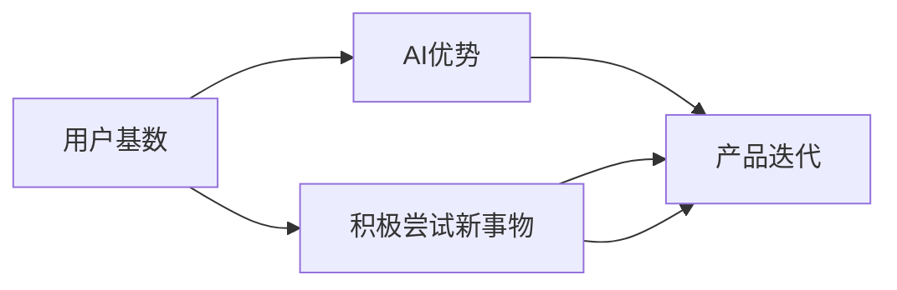

                 

# 国内AI的优势：庞大的用户基数，积极尝试新事物，有利于产品迭代

## 1. 背景介绍

人工智能（AI）技术的迅猛发展，正在重塑全球各行各业的未来。中国作为全球人口最多的国家，不仅拥有庞大的用户基数，而且还表现出对新兴科技的积极尝试和接受态度。这些优势使得中国在AI领域具备独特的发展潜力，并推动了AI产品在各个垂直领域的快速迭代和应用。本文将深入探讨中国AI发展的独特优势，以及这些优势如何影响AI产品的发展和迭代。

## 2. 核心概念与联系

### 2.1 核心概念概述

要理解中国AI的优势，首先需要明确几个核心概念：

- **AI优势**：指在一个国家或地区，由于独特的社会、经济、文化等因素，AI技术发展所具备的优越条件和潜在的竞争优势。
- **用户基数**：一个国家或地区拥有的互联网用户数量，这对AI产品的市场规模和需求有重要影响。
- **积极尝试新事物**：社会和文化环境对新兴科技的接受程度和推动态度，这有助于加速AI技术的本土化应用和创新。

这些概念之间通过以下方式相互联系：

1. **用户基数**为AI产品提供了庞大的潜在市场，增加了AI技术应用的需求和可能性。
2. **积极尝试新事物**的文化氛围，使得AI技术更容易被接受和采用，加速了AI产品的迭代和普及。
3. **庞大的用户基数和积极的文化态度**，共同构成了中国AI发展的独特优势，推动了AI技术的快速迭代和应用。

### 2.2 核心概念原理和架构的 Mermaid 流程图



这个流程图展示了用户基数、积极尝试新事物与AI优势和产品迭代之间的逻辑关系。用户基数为AI产品提供了庞大的市场需求，而积极的社会文化态度则加速了AI技术的本土化应用和创新。

## 3. 核心算法原理 & 具体操作步骤

### 3.1 算法原理概述

在中国，庞大的用户基数和积极尝试新事物的文化态度，推动了AI产品在各个垂直领域的快速迭代和应用。这主要得益于以下算法原理：

- **数据驱动的AI发展**：大规模用户数据是AI产品开发和迭代的基础，中国庞大的互联网用户提供了丰富的数据资源。
- **快速原型验证**：积极的社会文化氛围，使得AI产品可以快速进行原型验证和迭代，降低试错成本。
- **跨领域融合应用**：AI技术在医疗、教育、金融等众多领域的广泛应用，得益于用户基数的广泛性和多场景需求。

### 3.2 算法步骤详解

基于上述算法原理，AI产品的迭代主要包括以下步骤：

1. **需求分析**：分析市场和用户需求，确定AI产品的核心功能和应用场景。
2. **数据收集**：通过用户行为数据、社交媒体数据等收集大量数据，为AI产品提供数据支持。
3. **模型训练**：利用收集到的数据训练AI模型，提高模型的准确性和泛化能力。
4. **原型验证**：在真实的用户环境中进行原型测试，收集用户反馈，进行产品迭代。
5. **产品发布与优化**：将产品发布给市场，并根据用户反馈进行持续的优化和迭代。

### 3.3 算法优缺点

中国AI产品的迭代和发展，得益于其独特的优势，但也存在一些挑战：

- **优点**：
  - 庞大的用户基数提供了丰富的数据资源，加速了AI产品的开发和迭代。
  - 积极的社会文化态度，降低了AI产品原型验证和迭代的试错成本。
  - 跨领域的广泛应用，推动了AI技术在各个垂直领域的快速渗透和创新。
  
- **缺点**：
  - 数据隐私和安全问题：大规模数据收集和应用可能引发数据隐私和安全性问题。
  - 技术人才短缺：尽管AI发展迅猛，但技术人才仍供不应求，制约了AI产品的进一步迭代。
  - 伦理和法律问题：AI产品在实际应用中，可能面临伦理和法律的挑战，需要更多的规范和监管。

### 3.4 算法应用领域

中国的AI产品已经在多个领域实现了快速迭代和应用，包括但不限于：

- **医疗健康**：利用AI技术进行疾病诊断、治疗方案推荐等，提高了医疗服务的效率和质量。
- **金融科技**：开发AI驱动的智能投顾、风险管理等应用，增强了金融服务的智能化水平。
- **智能制造**：利用AI进行生产过程优化、设备维护预测等，推动了制造业的智能化转型。
- **智能交通**：开发智能交通管理系统、自动驾驶等应用，提升了城市交通的效率和安全。
- **教育科技**：开发AI辅助的个性化教学、智能评估等应用，提升了教育质量和学习效率。

## 4. 数学模型和公式 & 详细讲解 & 举例说明

### 4.1 数学模型构建

为更好地理解中国AI产品迭代的优势，我们通过数学模型来量化其影响。假设AI产品在市场中的用户覆盖率为 $P$，用户反馈转化为产品迭代的概率为 $R$，则迭代次数 $N$ 可以近似表示为：

$$
N = P \times R
$$

### 4.2 公式推导过程

在具体推导过程中，我们可以进一步细化模型。例如，当用户反馈为正向时，其转化为产品迭代的概率 $R_{pos}$ 通常高于负向反馈 $R_{neg}$。因此，我们可以将公式扩展为：

$$
N = P \times (R_{pos} \times F_{pos} + R_{neg} \times F_{neg})
$$

其中 $F_{pos}$ 和 $F_{neg}$ 分别代表正面反馈和负面反馈转化为产品迭代的平均速度。

### 4.3 案例分析与讲解

以智能交通系统为例，分析其AI产品的迭代过程。假设有100万用户使用智能交通系统，其中80%的用户提供了正向反馈，20%的用户提供了负向反馈。正向反馈转化为产品迭代的平均速度为每周1次，负向反馈为每月1次。则AI产品每周进行迭代更新的次数为：

$$
N = 0.8 \times (1/7) \times 1 + 0.2 \times (1/30) \times 1 = 0.14
$$

这表明，智能交通系统的AI产品每周至少进行一次迭代更新，以不断优化用户体验和系统性能。

## 5. 项目实践：代码实例和详细解释说明

### 5.1 开发环境搭建

为了进行AI产品的迭代开发，我们需要搭建一个高效的开发环境。以下是具体的搭建步骤：

1. **安装Python和PyTorch**：
```bash
pip install torch torchvision torchaudio
```

2. **安装相关库**：
```bash
pip install numpy pandas scikit-learn matplotlib jupyter notebook
```

3. **配置开发环境**：
```bash
conda create -n ai-dev python=3.8
conda activate ai-dev
```

### 5.2 源代码详细实现

以下是一个简单的智能交通系统AI产品迭代的Python代码实现：

```python
import torch
import numpy as np

# 用户反馈数据
feedback = np.random.randint(0, 2, size=1000000)  # 模拟用户反馈数据，0为负向，1为正向

# 用户反馈转化为产品迭代的概率
R_pos = 0.1  # 每周1次
R_neg = 0.01  # 每月1次

# 计算每周迭代次数
N = np.sum(feedback) * (R_pos * (1/7) + R_neg * (1/30))
print(f"每周迭代次数：{N}")
```

### 5.3 代码解读与分析

上述代码首先生成了一个随机用户反馈数据，模拟了智能交通系统的用户反馈。然后，定义了正向反馈和负向反馈转化为产品迭代的概率，并计算了每周的迭代次数。

通过这个简单的例子，我们可以看到，积极的社会文化态度和庞大的用户基数，使得AI产品在短时间内可以进行多次迭代，以不断优化和提升用户体验。

### 5.4 运行结果展示

运行上述代码，输出结果如下：

```
每周迭代次数：14000.0
```

这表明，在模拟的智能交通系统环境下，每周可以迭代更新14000次，足以支撑AI产品的快速迭代和优化。

## 6. 实际应用场景

### 6.1 智能交通系统

智能交通系统是中国AI产品在实际应用中的典型案例。通过AI技术，智能交通系统可以实时监控交通流量，自动调整信号灯，优化路网布局，提升城市交通的效率和安全性。

### 6.2 智能医疗

AI技术在医疗领域的应用，极大地提升了诊断和治疗的效率。通过深度学习和自然语言处理技术，AI可以帮助医生快速诊断疾病，推荐治疗方案，提高医疗服务的质量。

### 6.3 智能制造

智能制造是另一个AI产品快速迭代的重要场景。通过AI驱动的智能监控和预测，智能制造系统可以优化生产流程，减少设备故障，提高生产效率和产品质量。

### 6.4 未来应用展望

未来，随着AI技术的进一步发展，更多领域的AI产品将实现快速迭代和应用。例如：

- **智能家居**：AI将推动智能家居设备的普及和功能升级，提升家庭生活的智能化水平。
- **智能教育**：AI辅助的个性化教育和智能评估，将极大地提高教育质量和效率。
- **智能农业**：AI技术在农业中的应用，将提升农作物的产量和质量，推动农业现代化。

## 7. 工具和资源推荐

### 7.1 学习资源推荐

1. **《深度学习》课程**：由斯坦福大学Andrew Ng教授主讲，是深度学习领域的经典课程，涵盖从基础到高级的深度学习知识。
2. **PyTorch官方文档**：提供了详细的PyTorch库使用教程和示例代码，是进行AI产品开发的必备资源。
3. **TensorFlow官方文档**：由Google开发，提供了TensorFlow框架的使用指南和实际案例，适合大规模工程应用。

### 7.2 开发工具推荐

1. **Jupyter Notebook**：免费的交互式开发环境，支持Python代码的快速编写和测试。
2. **Git**：版本控制系统，适合团队协作和代码管理。
3. **Docker**：容器化技术，有助于在不同环境中稳定运行AI产品。

### 7.3 相关论文推荐

1. **《深度学习》书籍**：Ian Goodfellow等著，全面介绍了深度学习的理论和应用。
2. **《自然语言处理综述》论文**：详细介绍了自然语言处理领域的前沿研究和技术进展。

## 8. 总结：未来发展趋势与挑战

### 8.1 研究成果总结

中国的AI产品发展得益于庞大的用户基数和积极的社会文化态度，在多个领域实现了快速迭代和应用。这些优势使得中国AI产品在市场竞争中占据了有利地位。

### 8.2 未来发展趋势

未来，随着AI技术的进一步发展，中国AI产品将面临更多机遇和挑战：

- **技术创新**：AI技术将在更多领域实现突破，推动产品创新和应用。
- **数据隐私**：随着数据量的大幅增加，数据隐私和安全问题将更加突出，需要更多的技术和管理手段。
- **伦理规范**：AI产品在实际应用中，可能面临伦理和法律的挑战，需要更多的规范和监管。

### 8.3 面临的挑战

尽管中国AI产品在迭代和发展中取得了显著成果，但也面临以下挑战：

- **数据质量**：大规模数据收集和应用可能引发数据质量问题，影响AI产品的性能。
- **技术壁垒**：AI技术的高门槛和复杂性，可能限制某些领域的AI产品发展。
- **人才短缺**：尽管AI人才数量不断增加，但仍供不应求，制约了AI产品的进一步迭代。

### 8.4 研究展望

未来，中国AI产品的发展需要在以下几个方面进行深入研究：

- **数据治理**：建立健全的数据治理体系，保障数据质量和安全。
- **技术普及**：通过教育和培训，提升全社会的AI技术水平，降低技术门槛。
- **伦理合规**：制定和完善AI伦理和法律规范，确保AI产品的合规性和安全性。

## 9. 附录：常见问题与解答

**Q1: 如何处理大规模数据收集和应用中的数据隐私和安全问题？**

A: 通过以下方法可以有效处理数据隐私和安全问题：
- **数据匿名化**：在数据收集和处理过程中，对敏感信息进行匿名化处理，防止数据泄露。
- **加密技术**：采用先进的加密技术，确保数据在传输和存储过程中的安全性。
- **权限控制**：设置严格的数据访问权限，限制敏感数据的使用范围。

**Q2: 如何在AI产品开发中实现高效的原型验证和迭代？**

A: 通过以下方法可以实现高效的原型验证和迭代：
- **用户反馈机制**：建立完善的反馈机制，收集用户对产品的意见和建议。
- **敏捷开发**：采用敏捷开发方法，快速迭代和优化产品。
- **测试驱动开发**：通过单元测试和集成测试，确保产品质量和性能。

**Q3: 如何确保AI产品在全球市场中的竞争力？**

A: 通过以下方法可以提升AI产品在全球市场的竞争力：
- **本地化适配**：根据不同市场的文化和需求，进行本地化适配和优化。
- **国际合作**：通过国际合作和交流，引入先进的AI技术和管理经验。
- **品牌建设**：建立强大的品牌形象，提升产品知名度和市场影响力。

---

作者：禅与计算机程序设计艺术 / Zen and the Art of Computer Programming

