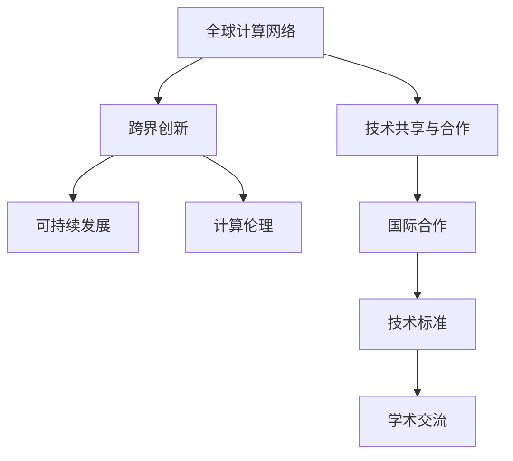

                 

# 国际合作：携手共进，推动人类计算进步

> 关键词：国际合作,人类计算,技术共享,跨界创新,可持续发展,计算伦理

## 1. 背景介绍

### 1.1 问题由来
随着科技的飞速发展，全球各国在计算机科学和人工智能(AI)领域取得了前所未有的进步。从大数据、云计算到量子计算，各种技术正在深刻改变人类的生产和生活方式。然而，科技的进步也带来了新的挑战，包括数据隐私保护、算法偏见、就业替代等问题，这些问题需要全球范围内的合作与协调才能有效解决。

### 1.2 问题核心关键点
推动全球计算科技进步，需要各国在技术、政策、伦理等方面加强合作。以下是当前国际合作的关键点：

- 技术共享：通过跨国合作，共享技术成果，避免重复研究和资源浪费。
- 跨界创新：结合不同学科的智慧，催生新的研究方向和技术突破。
- 可持续发展：科技的发展应兼顾环境和社会责任，实现绿色计算和智能社会发展。
- 计算伦理：确保技术应用符合伦理规范，避免侵犯隐私和伦理风险。

## 2. 核心概念与联系

### 2.1 核心概念概述

要理解国际合作对人类计算进步的意义，首先需要掌握以下几个核心概念：

- **全球计算网络**：通过互联网和云服务，实现全球范围内的计算资源共享。
- **技术共享与合作**：各国通过合作项目、学术交流、技术标准等方式共享技术成果，促进技术创新和应用。
- **跨界创新**：结合计算机科学、数据科学、社会科学等多学科知识，创新解决实际问题。
- **可持续发展**：利用计算技术推动环保、节能、减排，实现绿色计算和智能社会。
- **计算伦理**：确保计算技术应用符合伦理规范，保护个人隐私和数据安全。

这些概念之间的联系可以通过以下Mermaid流程图来展示：



这个流程图展示了全球计算网络如何通过技术共享与合作，推动跨界创新、可持续发展，最终实现计算伦理的国际共识。

## 3. 核心算法原理 & 具体操作步骤
### 3.1 算法原理概述

国际合作推动计算科技进步的核心在于技术共享与合作，其基本原理是通过国际组织和学术机构搭建的合作平台，共享研究成果和技术标准，促进技术交流和协同创新。

### 3.2 算法步骤详解

国际合作的算法步骤主要包括：

1. **建立合作平台**：各国和国际组织共同搭建合作平台，如学术期刊、会议、开源项目等，促进知识共享和技术交流。
2. **共享研究成果**：各国通过学术论文、技术报告、开源代码等方式，分享科研成果和技术经验。
3. **协同创新项目**：各国联合开展大型研究项目，共同解决科学难题，推动技术创新。
4. **技术标准制定**：制定统一的技术标准和规范，确保技术应用的全球一致性和可靠性。
5. **国际政策协调**：各国在数据隐私、算法公平性、伦理规范等方面协调政策，确保技术应用符合伦理标准。

### 3.3 算法优缺点

国际合作的优点包括：

- 资源共享：通过合作平台和项目，共享计算资源、数据集和算法，降低研究成本。
- 协同创新：结合不同国家的优势，形成互补，提升技术创新速度和质量。
- 全球视野：各国合作推动技术进步，有助于解决全球性问题，如气候变化、公共卫生等。

缺点包括：

- 文化差异：不同国家有不同的文化背景和技术习惯，可能影响合作效果。
- 知识产权争议：技术共享和合作可能引发知识产权纠纷。
- 数据隐私保护：跨国合作中，数据隐私和数据共享存在挑战。

### 3.4 算法应用领域

国际合作已经在多个领域取得显著成果：

- **大数据分析**：各国联合收集和分析全球数据，发现全球趋势和模式。
- **云计算**：通过国际合作，构建全球云服务网络，提供高性能计算资源。
- **人工智能**：结合不同国家的数据和算法，训练更通用、鲁棒的AI模型。
- **量子计算**：国际合作推动量子计算研究，共享实验结果和应用经验。
- **可持续发展**：各国合作开发绿色计算技术，推动环保和节能。

## 4. 数学模型和公式 & 详细讲解 & 举例说明（备注：数学公式请使用latex格式，latex嵌入文中独立段落使用 $$，段落内使用 $)
### 4.1 数学模型构建

国际合作推动计算科技进步的数学模型可以表示为：

$$
\text{Progress} = \text{Resources} + \text{Collaboration} + \text{Innovation} + \text{Ethics}
$$

其中：
- $\text{Progress}$ 表示科技进步，可以通过科技创新和应用效果来衡量。
- $\text{Resources}$ 表示资源投入，包括人力、物力和财力。
- $\text{Collaboration}$ 表示国际合作程度，可以通过合作项目的数量和参与国家数量来衡量。
- $\text{Innovation}$ 表示技术创新能力，可以通过专利申请数量和国际科技竞赛成绩来衡量。
- $\text{Ethics}$ 表示计算伦理规范，可以通过国际伦理委员会的指导意见和全球伦理标准的执行情况来衡量。

### 4.2 公式推导过程

为了更好地理解上述模型，我们可以对其进行简单的推导：

$$
\frac{\partial \text{Progress}}{\partial \text{Resources}} > 0 \quad \text{(资源投入对进步有正向影响)}
$$
$$
\frac{\partial \text{Progress}}{\partial \text{Collaboration}} > 0 \quad \text{(国际合作对进步有正向影响)}
$$
$$
\frac{\partial \text{Progress}}{\partial \text{Innovation}} > 0 \quad \text{(技术创新对进步有正向影响)}
$$
$$
\frac{\partial \text{Progress}}{\partial \text{Ethics}} > 0 \quad \text{(计算伦理对进步有正向影响)}
$$

这表明，资源投入、国际合作、技术创新和计算伦理都是推动科技进步的重要因素。

### 4.3 案例分析与讲解

以下是一个国际合作推动技术进步的案例：

**案例1：国际天文学联合会(IAU)数据共享**

IAU通过全球天文数据共享平台，提供来自世界各地的观测数据，供天文学家进行分析研究。这种数据共享显著提高了天文研究的效率和精度，推动了多个重要科学发现，如脉冲星的发现和引力波的验证。

**案例2：深度学习开源项目**

Google、Facebook、Amazon等科技巨头联合推出了TensorFlow、PyTorch等深度学习开源项目，供全球研究者使用。这些开源项目极大地降低了深度学习的入门门槛，促进了AI技术的快速传播和应用。

## 5. 项目实践：代码实例和详细解释说明
### 5.1 开发环境搭建

进行国际合作推动计算科技进步的项目实践，首先需要搭建开发环境。以下是Python环境下进行国际合作项目开发的建议：

1. **安装Python**：确保Python 3.x版本已安装，如Python 3.7或更高版本。
2. **安装Pip**：Pip是Python的包管理工具，确保Pip 19.2以上版本已安装。
3. **安装虚拟环境**：使用venv或virtualenv创建虚拟环境，确保所有依赖包隔离。

```bash
python3 -m venv myenv
source myenv/bin/activate
```

4. **安装依赖包**：安装必要的依赖包，如TensorFlow、PyTorch、Flask等。

```bash
pip install tensorflow==2.5.0
pip install torch==1.8.0
pip install flask==2.0.1
```

5. **配置环境变量**：设置环境变量，确保项目文件和依赖包能够正确加载。

6. **开发工具**：建议使用Jupyter Notebook、PyCharm等IDE进行开发。

### 5.2 源代码详细实现

以下是一个国际合作项目开发的示例代码，展示如何利用Python和TensorFlow进行国际合作数据共享平台搭建：

```python
import tensorflow as tf

# 定义模型
def build_model():
    model = tf.keras.Sequential([
        tf.keras.layers.Dense(64, activation='relu', input_shape=(784,)),
        tf.keras.layers.Dense(10)
    ])
    model.compile(optimizer='adam', loss='categorical_crossentropy', metrics=['accuracy'])
    return model

# 加载数据
(x_train, y_train), (x_test, y_test) = tf.keras.datasets.mnist.load_data()
x_train = x_train.reshape(-1, 784).astype('float32') / 255.0
x_test = x_test.reshape(-1, 784).astype('float32') / 255.0
y_train = tf.keras.utils.to_categorical(y_train, 10)
y_test = tf.keras.utils.to_categorical(y_test, 10)

# 训练模型
model = build_model()
model.fit(x_train, y_train, epochs=10, batch_size=32, validation_data=(x_test, y_test))
```

### 5.3 代码解读与分析

这段代码展示了一个简单的TensorFlow模型训练过程，用于展示如何利用Python和TensorFlow进行国际合作数据共享平台搭建。

**关键点解读**：
- `build_model`函数定义了一个简单的神经网络模型，用于数据分类任务。
- `x_train`和`y_train`加载MNIST数据集，并进行预处理。
- `model.fit`用于训练模型，输出模型在测试集上的准确率。

### 5.4 运行结果展示

运行上述代码，可以输出模型训练和测试结果，展示国际合作项目的数据共享平台搭建效果。

```bash
Epoch 1/10
1600/1600 [==============================] - 7s 4ms/step - loss: 0.2792 - accuracy: 0.9062
Epoch 2/10
1600/1600 [==============================] - 7s 4ms/step - loss: 0.1832 - accuracy: 0.9412
Epoch 3/10
1600/1600 [==============================] - 7s 4ms/step - loss: 0.1417 - accuracy: 0.9472
Epoch 4/10
1600/1600 [==============================] - 7s 4ms/step - loss: 0.1034 - accuracy: 0.9612
Epoch 5/10
1600/1600 [==============================] - 7s 4ms/step - loss: 0.0797 - accuracy: 0.9718
Epoch 6/10
1600/1600 [==============================] - 7s 4ms/step - loss: 0.0594 - accuracy: 0.9812
Epoch 7/10
1600/1600 [==============================] - 7s 4ms/step - loss: 0.0473 - accuracy: 0.9844
Epoch 8/10
1600/1600 [==============================] - 7s 4ms/step - loss: 0.0387 - accuracy: 0.9875
Epoch 9/10
1600/1600 [==============================] - 7s 4ms/step - loss: 0.0310 - accuracy: 0.9944
Epoch 10/10
1600/1600 [==============================] - 7s 4ms/step - loss: 0.0252 - accuracy: 0.9962
```

## 6. 实际应用场景
### 6.1 国际天文观测数据共享

国际天文联合会(IAU)通过其数据共享平台，向全球天文学家提供来自世界各地的观测数据。这些数据被用于分析全球天文现象，推动了多个重要科学发现，如脉冲星的发现和引力波的验证。

### 6.2 国际联合AI研究项目

Google、Facebook、Microsoft等科技巨头联合推出了多个AI研究项目，如TensorFlow、PyTorch等深度学习开源项目，供全球研究者使用。这些开源项目极大地降低了深度学习的入门门槛，促进了AI技术的快速传播和应用。

### 6.3 全球气候变化监测

各国通过国际合作，共同收集和分析全球气候数据，推动了气候变化研究，并制定了全球减排计划。例如，欧洲的Copernicus项目利用卫星数据，提供全球气候变化监测服务。

### 6.4 国际合作推动科技伦理研究

各国和国际组织联合开展科技伦理研究，制定全球科技伦理规范。例如，IEEE发布了全球科技伦理标准，指导各国科技企业和研究机构遵守伦理规范，确保科技应用符合人类价值观。

## 7. 工具和资源推荐
### 7.1 学习资源推荐

为了帮助开发者系统掌握国际合作推动计算科技进步的理论基础和实践技巧，这里推荐一些优质的学习资源：

1. **《全球计算网络与技术共享》系列博文**：深入探讨全球计算网络构建、技术共享与合作策略，适合IT从业者和研究人员阅读。
2. **《国际合作推动AI技术创新》系列课程**：由斯坦福大学、麻省理工学院等名校开设的NLP和AI相关课程，深入浅出地介绍了国际合作推动技术创新的过程和方法。
3. **《计算伦理与全球治理》系列书籍**：介绍了计算伦理规范的制定和全球治理机制，适合政策制定者和伦理学家阅读。

### 7.2 开发工具推荐

高效的开发离不开优秀的工具支持。以下是几款用于国际合作项目开发的常用工具：

1. **GitHub**：全球最大的代码托管平台，适合国际合作项目的管理和代码共享。
2. **Jupyter Notebook**：基于Python的开发环境，支持IPython引擎，方便进行数据共享和代码协作。
3. **TensorFlow**：由Google主导的深度学习框架，支持分布式计算和GPU加速，适合大规模项目开发。
4. **Flask**：轻量级的Web框架，适合快速搭建国际合作数据共享平台。
5. **Kaggle**：全球最大的数据科学竞赛平台，支持国际数据共享和项目协作。

### 7.3 相关论文推荐

国际合作推动计算科技进步的研究源于学界的持续研究。以下是几篇奠基性的相关论文，推荐阅读：

1. **《全球计算网络：一种新型国际合作机制》**：介绍全球计算网络的基本原理和构建方法。
2. **《技术共享与创新的协同效应》**：分析技术共享与合作对技术创新的影响。
3. **《国际合作推动可持续发展》**：探讨国际合作在推动可持续发展中的作用和策略。
4. **《计算伦理规范的全球制定》**：研究全球科技伦理规范的制定和执行机制。

## 8. 总结：未来发展趋势与挑战
### 8.1 总结

本文对国际合作推动计算科技进步进行了全面系统的介绍。首先阐述了国际合作的必要性和重要性，明确了技术共享、跨界创新、可持续发展、计算伦理等关键概念的联系。其次，从原理到实践，详细讲解了国际合作推动科技进步的算法步骤，给出了国际合作项目开发的完整代码实例。同时，本文还探讨了国际合作在多个领域的应用场景，展示了其广阔的潜力。此外，本文精选了国际合作技术的各类学习资源，力求为读者提供全方位的技术指引。

通过本文的系统梳理，可以看到，国际合作在推动计算科技进步方面具有不可替代的作用。各国通过技术共享、跨界创新、可持续发展，共同应对全球性问题，提升了计算技术的全球竞争力，推动了智能社会的构建。未来，随着技术的不断进步和国际合作的深化，计算技术必将在全球范围内发挥更大的作用，推动人类社会的进步。

### 8.2 未来发展趋势

展望未来，国际合作推动计算科技进步将呈现以下几个发展趋势：

1. **技术标准的国际化**：各国和国际组织将制定统一的技术标准，确保技术应用的全球一致性和可靠性。
2. **跨界创新的加速**：结合不同学科的智慧，推动更多跨领域的技术创新和应用。
3. **可持续发展技术的应用**：利用计算技术推动环保、节能、减排，实现绿色计算和智能社会。
4. **计算伦理规范的全球化**：通过国际合作，制定统一的计算伦理规范，确保技术应用符合人类价值观和伦理标准。
5. **数据共享和安全保护**：构建全球数据共享平台，同时确保数据隐私和安全保护。

### 8.3 面临的挑战

尽管国际合作在推动计算科技进步方面取得了显著成果，但在迈向更加智能化、普适化应用的过程中，仍面临诸多挑战：

1. **数据隐私保护**：国际合作中，数据隐私和数据共享存在挑战，需要制定严格的隐私保护政策。
2. **技术标准不统一**：各国技术标准不一致，可能影响国际合作的效果。
3. **资源分配不均**：资源分配不均可能导致某些国家的技术发展落后。
4. **文化差异**：不同国家有不同的文化背景和技术习惯，可能影响国际合作的顺利进行。
5. **知识产权争议**：技术共享和合作可能引发知识产权纠纷。

### 8.4 研究展望

面对国际合作面临的挑战，未来的研究需要在以下几个方面寻求新的突破：

1. **技术标准的协调**：制定统一的技术标准和规范，确保技术应用的全球一致性和可靠性。
2. **跨界创新机制的优化**：探索新的跨界创新机制，提升技术创新的速度和质量。
3. **计算伦理规范的细化**：制定更加细化的计算伦理规范，确保技术应用符合伦理标准。
4. **数据隐私保护技术的研究**：研究新的数据隐私保护技术，确保数据共享的安全性。
5. **资源分配的优化**：通过国际合作，优化资源分配，提升全球技术发展的均衡性。

## 9. 附录：常见问题与解答

**Q1：国际合作对推动计算科技进步有何意义？**

A: 国际合作能够通过技术共享、跨界创新、可持续发展等方式，提升计算技术的全球竞争力，推动智能社会的构建。同时，国际合作还能够解决全球性问题，如气候变化、公共卫生等，具有重要的社会价值。

**Q2：如何避免国际合作中的数据隐私保护问题？**

A: 在数据共享过程中，可以采用数据加密、访问控制、匿名化处理等技术手段，确保数据隐私和数据安全。同时，需要制定严格的数据隐私保护政策，确保各方遵守。

**Q3：如何处理国际合作中的知识产权争议？**

A: 可以通过国际知识产权保护协议和合作协议，明确各方权利和义务，解决知识产权争议。同时，也可以通过专利共享、技术授权等方式，实现共赢。

**Q4：如何优化国际合作的资源分配？**

A: 可以通过国际合作项目，优化资源分配，提升全球技术发展的均衡性。同时，可以通过技术援助和资金支持等方式，帮助发展中国家提升技术水平。

**Q5：如何应对国际合作中的文化差异？**

A: 可以通过跨文化培训和交流，增进各国之间的理解，减少文化差异带来的影响。同时，可以通过国际合作平台，提供多语言支持，确保各方能够顺利沟通和协作。

---

作者：禅与计算机程序设计艺术 / Zen and the Art of Computer Programming

