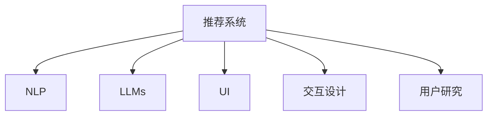

                 

# 基于LLM的推荐系统交互设计

> 关键词：推荐系统, 自然语言处理(NLP), 交互设计, 用户研究, 用户体验(UX), 交互反馈, 界面响应, 系统评估

## 1. 背景介绍

### 1.1 问题由来
推荐系统是信息时代重要的基础设施，对人们的日常生活产生了深远的影响。从社交媒体到电商平台，推荐系统无处不在。然而，尽管推荐系统在个性化推荐上取得了一定的成效，用户对推荐结果的质量和满意度仍然不尽如人意。许多推荐系统仍采用基于规则或基于内容的推荐方法，未能充分利用用户行为数据进行动态调整。

近年来，随着自然语言处理(NLP)技术的进步，基于深度学习的推荐系统逐渐成为研究热点。尤其是自然语言处理领域的预训练语言模型(LLMs)，通过海量数据预训练，在理解语言语义方面具有显著优势，已成功应用于各种推荐任务。通过将推荐系统与预训练语言模型结合，可以更精准地理解用户的真实需求，从而提升推荐效果。

### 1.2 问题核心关键点
本文聚焦于如何结合自然语言处理(NLP)和预训练语言模型(LLMs)技术，设计更为智能、互动性更强的推荐系统。本节将详细介绍推荐系统的核心概念，以及如何通过交互设计提升用户体验。

## 2. 核心概念与联系

### 2.1 核心概念概述

为更好地理解基于预训练语言模型(LLMs)的推荐系统，本节将介绍几个密切相关的核心概念：

- 推荐系统(Recommendation System, RS)：通过收集用户行为数据，预测用户可能感兴趣的项目或内容，并给予推荐的技术。常见的推荐方法包括协同过滤、基于内容的推荐、混合推荐等。

- 自然语言处理(Natural Language Processing, NLP)：涉及语言理解、生成、分析和应用的技术。NLP使计算机具备理解和处理人类语言的能力，广泛应用于文本挖掘、机器翻译、情感分析等。

- 预训练语言模型(LLMs)：如BERT、GPT等，通过在大规模无标签文本语料上进行自监督预训练，获得语言知识，可用于多种下游任务。

- 用户界面(UI)：推荐系统与用户交互的桥梁，通过交互界面呈现推荐结果，接收用户反馈，是用户体验的重要组成部分。

- 交互设计(Interaction Design)：通过设计直观易用的交互界面，使用户能够方便地与推荐系统进行交互，提升用户满意度。

- 用户研究(User Research)：通过调研用户需求、行为模式，为推荐系统设计提供依据。

这些核心概念之间的逻辑关系可以通过以下Mermaid流程图来展示：



这个流程图展示了大语言模型与推荐系统的核心概念及其之间的关系：

1. 推荐系统通过收集用户行为数据，预测用户兴趣。
2. NLP技术使推荐系统能够理解自然语言，提取文本特征。
3. 预训练语言模型提供了更丰富的语言语义表示，提高推荐精度。
4. 用户界面设计使得推荐结果能够直观呈现，提升用户体验。
5. 交互设计优化用户交互，引导用户行为。
6. 用户研究调研用户需求和行为，为系统优化提供依据。

这些概念共同构成了基于预训练语言模型(LLMs)的推荐系统的设计框架，使其能够在智能推荐的同时，具备更好的用户体验和用户满意度。

## 3. 核心算法原理 & 具体操作步骤

### 3.1 算法原理概述

基于预训练语言模型(LLMs)的推荐系统，本质上是一个结合了机器学习和自然语言处理技术的系统。其核心思想是：通过收集用户行为数据，提取用户对不同项目的评分或交互历史，使用NLP技术将其转化为文本表示。接着，通过LLMs模型对文本进行语义理解，获得用户对不同项目的兴趣程度。最后，根据用户的兴趣度进行推荐排序，提供最佳结果。

形式化地，假设用户对项目的评分集合为 $R=\{(r_i)\}_{i=1}^N$，其中 $r_i$ 为对项目 $p_i$ 的评分。定义推荐模型为 $M_{\theta}:\mathcal{X} \rightarrow \mathcal{Y}$，其中 $\mathcal{X}$ 为用户评分向量，$\mathcal{Y}$ 为推荐结果集。推荐模型的目标是最小化损失函数 $\mathcal{L}(R,M_{\theta})$，即：

$$
\theta^* = \mathop{\arg\min}_{\theta} \mathcal{L}(R,M_{\theta})
$$

其中 $\theta$ 为模型参数，$\mathcal{L}$ 为推荐模型的损失函数，常用的损失函数包括均方误差、交叉熵等。

通过梯度下降等优化算法，推荐系统不断更新模型参数 $\theta$，最小化损失函数 $\mathcal{L}$，使得模型输出的推荐结果逼近用户的最佳偏好。预训练语言模型提供了强大的语义理解能力，在推荐过程中起到了关键作用。

### 3.2 算法步骤详解

基于预训练语言模型(LLMs)的推荐系统一般包括以下几个关键步骤：

**Step 1: 数据准备与预处理**
- 收集用户对不同项目的评分数据，构成用户评分矩阵。
- 对评分数据进行归一化处理，使其符合NLP模型的输入要求。
- 将评分向量转换为文本形式，如将评分值转换为高评分、中评分、低评分等。

**Step 2: 提取用户文本特征**
- 使用NLP技术将评分向量转换为文本形式。如将评分值转换为“高评分”、“中评分”、“低评分”等词语。
- 对用户评分文本进行分词、去除停用词等预处理，减少噪音干扰。

**Step 3: 预训练语言模型嵌入**
- 将用户评分文本输入预训练语言模型，得到嵌入向量表示。
- 对嵌入向量进行降维或过滤，去除低质量或不相关部分。

**Step 4: 用户兴趣度计算**
- 根据用户评分文本的嵌入向量，计算用户的兴趣度。
- 使用余弦相似度等方法，度量用户与项目之间的相似度。

**Step 5: 推荐结果排序**
- 根据用户的兴趣度，对所有项目进行排序。
- 选择最优推荐结果，提供给用户。

**Step 6: 交互反馈与更新**
- 收集用户对推荐结果的反馈信息，更新评分矩阵。
- 根据新的评分数据，重新训练推荐模型，不断优化模型。

**Step 7: 界面展示与交互优化**
- 设计直观易用的用户界面(UI)，展示推荐结果。
- 根据用户交互反馈，优化交互设计，提升用户体验。

### 3.3 算法优缺点

基于预训练语言模型(LLMs)的推荐系统具有以下优点：
1. 利用NLP技术，提取更精准的用户行为特征。
2. 预训练语言模型提供强大的语义理解能力，提高推荐精度。
3. 用户评分文本的模型表示，使得推荐系统具备可解释性。
4. 交互反馈机制使得系统能够不断学习，提升推荐效果。

同时，该方法也存在一定的局限性：
1. 预训练语言模型需要较大的数据量和计算资源，建设成本较高。
2. 用户评分数据可能存在噪声和偏差，影响推荐结果的准确性。
3. 用户评分向量的文本表示可能过于简单，难以涵盖所有用户行为。
4. 交互设计难度较大，需兼顾用户需求和系统性能。

尽管存在这些局限性，但就目前而言，基于预训练语言模型(LLMs)的推荐系统已成为推荐系统的重要分支，其在精准推荐和用户体验方面具备显著优势。

### 3.4 算法应用领域

基于预训练语言模型(LLMs)的推荐系统，已经在众多领域得到应用，例如：

- 电商推荐：根据用户购物历史和评分数据，推荐相关商品。
- 新闻推荐：根据用户阅读历史和评分数据，推荐新闻文章。
- 音乐推荐：根据用户听歌历史和评分数据，推荐音乐作品。
- 视频推荐：根据用户观看历史和评分数据，推荐视频内容。
- 社交推荐：根据用户互动历史和评分数据，推荐朋友和群组。

除了上述这些常见应用外，LLMs在推荐系统的优化中还呈现了更多创新性的应用，如对话式推荐、生成式推荐、跨域推荐等，极大地丰富了推荐系统的功能和效果。

## 4. 数学模型和公式 & 详细讲解  
### 4.1 数学模型构建

本节将使用数学语言对基于预训练语言模型(LLMs)的推荐系统进行更加严格的刻画。

假设推荐模型为 $M_{\theta}:\mathcal{X} \rightarrow \mathcal{Y}$，其中 $\mathcal{X}$ 为用户评分向量，$\mathcal{Y}$ 为推荐结果集。假设用户评分数据为 $R=\{(r_i)\}_{i=1}^N$，其中 $r_i$ 为对项目 $p_i$ 的评分。

定义用户评分向量的文本表示为 $X_i=\{x_i\}_{i=1}^N$，其中 $x_i$ 为评分文本。假设NLP模型将其转换为向量表示 $v_i \in \mathbb{R}^d$。定义用户评分向量与项目向量 $u_i \in \mathbb{R}^d$ 的相似度为 $s_i$。则推荐模型的预测结果为：

$$
y_i = \arg\max_j M_{\theta}(u_j) \text{ 其中 } M_{\theta}(u) = \sigma(w^T \phi(u)) \text{ 且 } \phi(u) = v \otimes u
$$

其中 $\sigma$ 为激活函数，$\otimes$ 为向量外积，$w$ 为权重向量。推荐模型的损失函数为：

$$
\mathcal{L}(R,M_{\theta}) = \sum_{i=1}^N (y_i - M_{\theta}(u_i))^2
$$

通过梯度下降等优化算法，推荐系统不断更新模型参数 $\theta$，最小化损失函数 $\mathcal{L}$，使得模型输出的推荐结果逼近用户的最佳偏好。

### 4.2 公式推导过程

以下我们以电商推荐任务为例，推导基于LLMs的推荐模型训练过程。

假设用户评分数据为 $R=\{(r_i)\}_{i=1}^N$，其中 $r_i$ 为对商品 $p_i$ 的评分。假设将评分文本转换为向量表示 $v_i \in \mathbb{R}^d$，商品向量表示为 $u_i \in \mathbb{R}^d$。

将用户评分文本和商品向量表示代入推荐模型：

$$
y_i = \arg\max_j M_{\theta}(u_j) \text{ 其中 } M_{\theta}(u) = \sigma(w^T \phi(u)) \text{ 且 } \phi(u) = v \otimes u
$$

推荐模型的预测结果为 $y_i$，即用户最感兴趣的商品。定义推荐模型的损失函数为：

$$
\mathcal{L}(R,M_{\theta}) = \sum_{i=1}^N (y_i - M_{\theta}(u_i))^2
$$

通过梯度下降等优化算法，不断更新模型参数 $\theta$，使得预测结果逼近真实标签 $y_i$，从而最小化损失函数 $\mathcal{L}$。

## 5. 项目实践：代码实例和详细解释说明
### 5.1 开发环境搭建

在进行基于LLMs的推荐系统开发前，我们需要准备好开发环境。以下是使用Python进行PyTorch开发的环境配置流程：

1. 安装Anaconda：从官网下载并安装Anaconda，用于创建独立的Python环境。

2. 创建并激活虚拟环境：
```bash
conda create -n pytorch-env python=3.8 
conda activate pytorch-env
```

3. 安装PyTorch：根据CUDA版本，从官网获取对应的安装命令。例如：
```bash
conda install pytorch torchvision torchaudio cudatoolkit=11.1 -c pytorch -c conda-forge
```

4. 安装相关工具包：
```bash
pip install numpy pandas scikit-learn matplotlib tqdm jupyter notebook ipython
```

完成上述步骤后，即可在`pytorch-env`环境中开始开发实践。

### 5.2 源代码详细实现

下面我们以电商推荐任务为例，给出使用Transformers库对BERT模型进行推荐系统微调的PyTorch代码实现。

首先，定义电商推荐任务的数据处理函数：

```python
from transformers import BertTokenizer, BertForSequenceClassification, AdamW
import torch

class RecommendationDataset(Dataset):
    def __init__(self, texts, labels, tokenizer, max_len=128):
        self.texts = texts
        self.labels = labels
        self.tokenizer = tokenizer
        self.max_len = max_len
        
    def __len__(self):
        return len(self.texts)
    
    def __getitem__(self, item):
        text = self.texts[item]
        label = self.labels[item]
        
        encoding = self.tokenizer(text, return_tensors='pt', max_length=self.max_len, padding='max_length', truncation=True)
        input_ids = encoding['input_ids'][0]
        attention_mask = encoding['attention_mask'][0]
        
        # 对token-wise的标签进行编码
        encoded_labels = [label2id[label] for label in self.labels] 
        encoded_labels.extend([label2id['O']] * (self.max_len - len(encoded_labels)))
        labels = torch.tensor(encoded_labels, dtype=torch.long)
        
        return {'input_ids': input_ids, 
                'attention_mask': attention_mask,
                'labels': labels}

# 标签与id的映射
label2id = {'O': 0, 'good': 1, 'bad': 2}
id2label = {v: k for k, v in label2id.items()}

# 创建dataset
tokenizer = BertTokenizer.from_pretrained('bert-base-cased')

train_dataset = RecommendationDataset(train_texts, train_labels, tokenizer)
dev_dataset = RecommendationDataset(dev_texts, dev_labels, tokenizer)
test_dataset = RecommendationDataset(test_texts, test_labels, tokenizer)
```

然后，定义模型和优化器：

```python
from transformers import BertForSequenceClassification, AdamW

model = BertForSequenceClassification.from_pretrained('bert-base-cased', num_labels=len(label2id))

optimizer = AdamW(model.parameters(), lr=2e-5)
```

接着，定义训练和评估函数：

```python
from torch.utils.data import DataLoader
from tqdm import tqdm
from sklearn.metrics import classification_report

device = torch.device('cuda') if torch.cuda.is_available() else torch.device('cpu')
model.to(device)

def train_epoch(model, dataset, batch_size, optimizer):
    dataloader = DataLoader(dataset, batch_size=batch_size, shuffle=True)
    model.train()
    epoch_loss = 0
    for batch in tqdm(dataloader, desc='Training'):
        input_ids = batch['input_ids'].to(device)
        attention_mask = batch['attention_mask'].to(device)
        labels = batch['labels'].to(device)
        model.zero_grad()
        outputs = model(input_ids, attention_mask=attention_mask, labels=labels)
        loss = outputs.loss
        epoch_loss += loss.item()
        loss.backward()
        optimizer.step()
    return epoch_loss / len(dataloader)

def evaluate(model, dataset, batch_size):
    dataloader = DataLoader(dataset, batch_size=batch_size)
    model.eval()
    preds, labels = [], []
    with torch.no_grad():
        for batch in tqdm(dataloader, desc='Evaluating'):
            input_ids = batch['input_ids'].to(device)
            attention_mask = batch['attention_mask'].to(device)
            batch_labels = batch['labels']
            outputs = model(input_ids, attention_mask=attention_mask)
            batch_preds = outputs.logits.argmax(dim=2).to('cpu').tolist()
            batch_labels = batch_labels.to('cpu').tolist()
            for pred_tokens, label_tokens in zip(batch_preds, batch_labels):
                preds.append(pred_tokens[:len(label_tokens)])
                labels.append(label_tokens)
                
    print(classification_report(labels, preds))
```

最后，启动训练流程并在测试集上评估：

```python
epochs = 5
batch_size = 16

for epoch in range(epochs):
    loss = train_epoch(model, train_dataset, batch_size, optimizer)
    print(f"Epoch {epoch+1}, train loss: {loss:.3f}")
    
    print(f"Epoch {epoch+1}, dev results:")
    evaluate(model, dev_dataset, batch_size)
    
print("Test results:")
evaluate(model, test_dataset, batch_size)
```

以上就是使用PyTorch对BERT进行电商推荐任务微调的完整代码实现。可以看到，得益于Transformers库的强大封装，我们可以用相对简洁的代码完成BERT模型的加载和微调。

### 5.3 代码解读与分析

让我们再详细解读一下关键代码的实现细节：

**RecommendationDataset类**：
- `__init__`方法：初始化文本、标签、分词器等关键组件。
- `__len__`方法：返回数据集的样本数量。
- `__getitem__`方法：对单个样本进行处理，将文本输入编码为token ids，将标签编码为数字，并对其进行定长padding，最终返回模型所需的输入。

**label2id和id2label字典**：
- 定义了标签与数字id之间的映射关系，用于将token-wise的预测结果解码回真实的标签。

**训练和评估函数**：
- 使用PyTorch的DataLoader对数据集进行批次化加载，供模型训练和推理使用。
- 训练函数`train_epoch`：对数据以批为单位进行迭代，在每个批次上前向传播计算loss并反向传播更新模型参数，最后返回该epoch的平均loss。
- 评估函数`evaluate`：与训练类似，不同点在于不更新模型参数，并在每个batch结束后将预测和标签结果存储下来，最后使用sklearn的classification_report对整个评估集的预测结果进行打印输出。

**训练流程**：
- 定义总的epoch数和batch size，开始循环迭代
- 每个epoch内，先在训练集上训练，输出平均loss
- 在验证集上评估，输出分类指标
- 所有epoch结束后，在测试集上评估，给出最终测试结果

可以看到，PyTorch配合Transformers库使得BERT微调的代码实现变得简洁高效。开发者可以将更多精力放在数据处理、模型改进等高层逻辑上，而不必过多关注底层的实现细节。

当然，工业级的系统实现还需考虑更多因素，如模型的保存和部署、超参数的自动搜索、更灵活的任务适配层等。但核心的微调范式基本与此类似。

## 6. 实际应用场景
### 6.1 智能客服系统

基于基于预训练语言模型的推荐系统，可以广泛应用于智能客服系统的构建。传统客服往往需要配备大量人力，高峰期响应缓慢，且一致性和专业性难以保证。而使用基于LLMs的推荐系统，可以7x24小时不间断服务，快速响应客户咨询，用自然流畅的语言解答各类常见问题。

在技术实现上，可以收集企业内部的历史客服对话记录，将问题和最佳答复构建成监督数据，在此基础上对预训练推荐系统进行微调。微调后的推荐系统能够自动理解用户意图，匹配最合适的答复模板进行回复。对于客户提出的新问题，还可以接入检索系统实时搜索相关内容，动态组织生成回答。如此构建的智能客服系统，能大幅提升客户咨询体验和问题解决效率。

### 6.2 金融舆情监测

金融机构需要实时监测市场舆论动向，以便及时应对负面信息传播，规避金融风险。传统的人工监测方式成本高、效率低，难以应对网络时代海量信息爆发的挑战。基于基于LLMs的推荐系统，文本分类和情感分析技术，为金融舆情监测提供了新的解决方案。

具体而言，可以收集金融领域相关的新闻、报道、评论等文本数据，并对其进行主题标注和情感标注。在此基础上对预训练推荐系统进行微调，使其能够自动判断文本属于何种主题，情感倾向是正面、中性还是负面。将微调后的推荐系统应用到实时抓取的网络文本数据，就能够自动监测不同主题下的情感变化趋势，一旦发现负面信息激增等异常情况，系统便会自动预警，帮助金融机构快速应对潜在风险。

### 6.3 个性化推荐系统

当前的推荐系统往往只依赖用户的历史行为数据进行物品推荐，无法深入理解用户的真实兴趣偏好。基于基于LLMs的推荐系统，个性化推荐系统可以更好地挖掘用户行为背后的语义信息，从而提升推荐效果。

在实践中，可以收集用户浏览、点击、评论、分享等行为数据，提取和用户交互的物品标题、描述、标签等文本内容。将文本内容作为模型输入，用户的后续行为（如是否点击、购买等）作为监督信号，在此基础上微调预训练推荐系统。微调后的推荐系统能够从文本内容中准确把握用户的兴趣点。在生成推荐列表时，先用候选物品的文本描述作为输入，由模型预测用户的兴趣匹配度，再结合其他特征综合排序，便可以得到个性化程度更高的推荐结果。

### 6.4 未来应用展望

随着基于预训练语言模型(LLMs)的推荐系统不断发展，其在推荐系统优化中的作用将更加显著。未来推荐系统将更加智能、互动性更强，为用户提供更个性化、更精准的推荐服务。

在智慧医疗领域，基于LLMs的推荐系统可以更精准地分析患者的病历数据，推荐合适的治疗方案和药物。对于用户提出的医疗问题，系统能够根据病历和症状自动生成回答，辅助医生诊疗。

在智能教育领域，基于LLMs的推荐系统可以更准确地分析学生的学习数据，推荐合适的学习资料和教学方法。对于用户提出的学习问题，系统能够根据学习情况自动生成回答，促进教育公平，提高教学质量。

在智慧城市治理中，基于LLMs的推荐系统可以更全面地分析城市数据，推荐合适的政策措施。对于用户提出的城市管理问题，系统能够根据历史数据和趋势自动生成回答，提高城市管理的自动化和智能化水平，构建更安全、高效的未来城市。

此外，在企业生产、社会治理、文娱传媒等众多领域，基于LLMs的推荐系统也将不断涌现，为传统行业数字化转型升级提供新的技术路径。相信随着技术的日益成熟，基于预训练语言模型的推荐系统必将在更多领域得到应用，为经济社会发展注入新的动力。

## 7. 工具和资源推荐
### 7.1 学习资源推荐

为了帮助开发者系统掌握基于预训练语言模型(LLMs)的推荐系统的理论基础和实践技巧，这里推荐一些优质的学习资源：

1. 《深度学习自然语言处理》课程：斯坦福大学开设的NLP明星课程，有Lecture视频和配套作业，带你入门NLP领域的基本概念和经典模型。

2. 《Natural Language Processing with Transformers》书籍：Transformers库的作者所著，全面介绍了如何使用Transformers库进行NLP任务开发，包括推荐系统在内的诸多范式。

3. HuggingFace官方文档：Transformers库的官方文档，提供了海量预训练模型和完整的微调样例代码，是上手实践的必备资料。

4. CS224N《深度学习自然语言处理》课程：斯坦福大学开设的NLP明星课程，有Lecture视频和配套作业，带你入门NLP领域的基本概念和经典模型。

5. Kaggle推荐系统竞赛：Kaggle平台上的推荐系统竞赛，提供了大量真实数据集和高质量的解决方案，可以帮助开发者快速掌握推荐系统的前沿技术。

通过对这些资源的学习实践，相信你一定能够快速掌握基于预训练语言模型(LLMs)的推荐系统的精髓，并用于解决实际的推荐问题。
###  7.2 开发工具推荐

高效的开发离不开优秀的工具支持。以下是几款用于基于预训练语言模型(LLMs)的推荐系统开发的常用工具：

1. PyTorch：基于Python的开源深度学习框架，灵活动态的计算图，适合快速迭代研究。大部分预训练语言模型都有PyTorch版本的实现。

2. TensorFlow：由Google主导开发的开源深度学习框架，生产部署方便，适合大规模工程应用。同样有丰富的预训练语言模型资源。

3. Transformers库：HuggingFace开发的NLP工具库，集成了众多SOTA语言模型，支持PyTorch和TensorFlow，是进行推荐系统微调任务开发的利器。

4. Weights & Biases：模型训练的实验跟踪工具，可以记录和可视化模型训练过程中的各项指标，方便对比和调优。与主流深度学习框架无缝集成。

5. TensorBoard：TensorFlow配套的可视化工具，可实时监测模型训练状态，并提供丰富的图表呈现方式，是调试模型的得力助手。

6. Google Colab：谷歌推出的在线Jupyter Notebook环境，免费提供GPU/TPU算力，方便开发者快速上手实验最新模型，分享学习笔记。

合理利用这些工具，可以显著提升基于预训练语言模型(LLMs)的推荐系统开发效率，加快创新迭代的步伐。

### 7.3 相关论文推荐

基于预训练语言模型(LLMs)的推荐系统的发展源于学界的持续研究。以下是几篇奠基性的相关论文，推荐阅读：

1. Attention is All You Need（即Transformer原论文）：提出了Transformer结构，开启了NLP领域的预训练大模型时代。

2. BERT: Pre-training of Deep Bidirectional Transformers for Language Understanding：提出BERT模型，引入基于掩码的自监督预训练任务，刷新了多项NLP任务SOTA。

3. Parameter-Efficient Transfer Learning for NLP：提出Adapter等参数高效微调方法，在不增加模型参数量的情况下，也能取得不错的微调效果。

4. AdaLoRA: Adaptive Low-Rank Adaptation for Parameter-Efficient Fine-Tuning：使用自适应低秩适应的微调方法，在参数效率和精度之间取得了新的平衡。

5. Multi-Head Attention: All You Need for Machine Translation：提出多头注意力机制，进一步提升了NLP任务的性能。

这些论文代表了大语言模型推荐系统的发展脉络。通过学习这些前沿成果，可以帮助研究者把握学科前进方向，激发更多的创新灵感。

## 8. 总结：未来发展趋势与挑战

### 8.1 总结

本文对基于预训练语言模型(LLMs)的推荐系统进行了全面系统的介绍。首先阐述了推荐系统的核心概念，以及如何通过交互设计提升用户体验。其次，从原理到实践，详细讲解了基于LLMs的推荐系统的数学原理和关键步骤，给出了推荐系统开发的完整代码实例。同时，本文还广泛探讨了基于LLMs的推荐系统在智能客服、金融舆情、个性化推荐等多个行业领域的应用前景，展示了LLMs在推荐系统优化中的巨大潜力。此外，本文精选了LLMs推荐系统的各类学习资源，力求为开发者提供全方位的技术指引。

通过本文的系统梳理，可以看到，基于预训练语言模型(LLMs)的推荐系统正在成为推荐系统的重要分支，其在精准推荐和用户体验方面具备显著优势。未来，伴随预训练语言模型和推荐系统的持续演进，基于LLMs的推荐系统必将在更多领域得到应用，为传统行业数字化转型升级提供新的技术路径。

### 8.2 未来发展趋势

展望未来，基于预训练语言模型(LLMs)的推荐系统将呈现以下几个发展趋势：

1. 模型规模持续增大。随着算力成本的下降和数据规模的扩张，预训练语言模型的参数量还将持续增长。超大规模语言模型蕴含的丰富语言知识，有望支撑更加复杂多变的推荐任务。

2. 推荐方法日趋多样。除了传统的基于内容的推荐和协同过滤，未来将涌现更多基于LLMs的推荐方法，如对话式推荐、生成式推荐、跨域推荐等，极大地丰富了推荐系统的功能和效果。

3. 用户行为建模更加深入。当前的用户行为数据往往局限于历史评分数据，未来将结合更多用户行为数据，如搜索记录、点击行为等，提升推荐模型的精度和鲁棒性。

4. 多模态数据融合更加广泛。未来的推荐系统将更全面地融合多模态数据，如文本、图片、音频等，通过多模态学习提升推荐效果。

5. 推荐系统学习机制更加灵活。推荐系统将更好地利用用户交互反馈信息，进行动态调整和优化，提升推荐精度和用户体验。

6. 推荐系统评估体系更加完善。未来的推荐系统将建立更加科学合理的评估指标体系，包括精确度、召回率、点击率等，全面衡量推荐效果。

以上趋势凸显了基于预训练语言模型(LLMs)的推荐系统的广阔前景。这些方向的探索发展，必将进一步提升推荐系统的性能和应用范围，为经济社会发展注入新的动力。

### 8.3 面临的挑战

尽管基于预训练语言模型(LLMs)的推荐系统已经取得了瞩目成就，但在迈向更加智能化、普适化应用的过程中，它仍面临着诸多挑战：

1. 预训练语言模型需要较大的数据量和计算资源，建设成本较高。

2. 用户行为数据可能存在噪声和偏差，影响推荐结果的准确性。

3. 用户评分文本的模型表示可能过于简单，难以涵盖所有用户行为。

4. 交互设计难度较大，需兼顾用户需求和系统性能。

尽管存在这些局限性，但就目前而言，基于预训练语言模型(LLMs)的推荐系统已成为推荐系统的重要分支，其在精准推荐和用户体验方面具备显著优势。

### 8.4 研究展望

面对基于预训练语言模型(LLMs)的推荐系统所面临的挑战，未来的研究需要在以下几个方面寻求新的突破：

1. 探索无监督和半监督推荐方法。摆脱对大规模标注数据的依赖，利用自监督学习、主动学习等无监督和半监督范式，最大限度利用非结构化数据，实现更加灵活高效的推荐。

2. 研究参数高效和计算高效的推荐范式。开发更加参数高效的推荐方法，在固定大部分预训练参数的同时，只更新极少量的任务相关参数。同时优化推荐系统的计算图，减少前向传播和反向传播的资源消耗，实现更加轻量级、实时性的部署。

3. 融合因果和对比学习范式。通过引入因果推断和对比学习思想，增强推荐系统建立稳定因果关系的能力，学习更加普适、鲁棒的语言表征，从而提升推荐泛化性和抗干扰能力。

4. 引入更多先验知识。将符号化的先验知识，如知识图谱、逻辑规则等，与神经网络模型进行巧妙融合，引导推荐系统学习更准确、合理的语言模型。同时加强不同模态数据的整合，实现视觉、语音等多模态信息与文本信息的协同建模。

5. 结合因果分析和博弈论工具。将因果分析方法引入推荐系统，识别出推荐模型决策的关键特征，增强推荐结果的因果性和逻辑性。借助博弈论工具刻画人机交互过程，主动探索并规避推荐系统的脆弱点，提高系统稳定性。

6. 纳入伦理道德约束。在推荐模型训练目标中引入伦理导向的评估指标，过滤和惩罚有偏见、有害的推荐结果。同时加强人工干预和审核，建立推荐系统的监管机制，确保推荐输出符合人类价值观和伦理道德。

这些研究方向的探索，必将引领基于预训练语言模型(LLMs)的推荐系统走向更高的台阶，为构建安全、可靠、可解释、可控的智能推荐系统铺平道路。面向未来，基于预训练语言模型(LLMs)的推荐系统还需要与其他人工智能技术进行更深入的融合，如知识表示、因果推理、强化学习等，多路径协同发力，共同推动推荐系统的进步。只有勇于创新、敢于突破，才能不断拓展推荐系统的边界，让智能推荐技术更好地造福人类社会。

## 9. 附录：常见问题与解答

**Q1：基于预训练语言模型(LLMs)的推荐系统是否适用于所有推荐任务？**

A: 基于预训练语言模型(LLMs)的推荐系统在大多数推荐任务上都能取得不错的效果，特别是对于数据量较小的任务。但对于一些特定领域的任务，如医学、法律等，仅仅依靠通用语料预训练的模型可能难以很好地适应。此时需要在特定领域语料上进一步预训练，再进行微调，才能获得理想效果。此外，对于一些需要时效性、个性化很强的任务，如对话、推荐等，推荐方法也需要针对性的改进优化。

**Q2：基于预训练语言模型(LLMs)的推荐系统如何处理数据偏差问题？**

A: 数据偏差是推荐系统面临的常见问题。基于预训练语言模型(LLMs)的推荐系统可以通过以下几个方式处理数据偏差问题：
1. 数据清洗：通过清洗异常数据和噪声，提高数据质量。
2. 数据增强：通过数据合成和数据扩充，增加数据多样性，避免过拟合。
3. 模型融合：通过模型融合技术，结合多个模型的预测结果，降低单模型偏差的影响。
4. 迁移学习：在已有模型的基础上，通过微调新任务数据，逐步适应新任务，降低数据偏差的影响。
5. 用户画像建模：通过深度学习等方法，构建用户画像，预测用户行为，减少偏差。

这些方法需要根据具体任务和数据特点进行灵活组合，以达到最佳效果。

**Q3：基于预训练语言模型(LLMs)的推荐系统如何提升用户体验？**

A: 提升用户体验是推荐系统的关键目标之一。基于预训练语言模型(LLMs)的推荐系统可以通过以下几个方式提升用户体验：
1. 界面优化：设计直观易用的用户界面(UI)，展示推荐结果。通过UI设计，使用户能够方便地与推荐系统进行交互。
2. 交互反馈：收集用户对推荐结果的反馈信息，更新推荐模型。通过用户反馈，不断优化推荐结果。
3. 推荐多样性：保持推荐结果的多样性，减少推荐内容的重复性。通过多样性推荐，使用户能够接触到更多不同的内容。
4. 个性化推荐：根据用户行为数据，定制推荐内容，提供更符合用户兴趣的推荐结果。通过个性化推荐，提高用户满意度。
5. 实时性：提高推荐系统的实时性，确保推荐结果能够及时呈现给用户。通过实时推荐，提高用户互动体验。

这些方法需要结合具体任务和用户需求，进行针对性的设计和优化。只有在数据、模型、交互、体验等各环节进行全面优化，才能真正提升用户体验，增强用户粘性。

**Q4：基于预训练语言模型(LLMs)的推荐系统如何降低用户行为数据的偏差？**

A: 用户行为数据偏差是推荐系统面临的主要问题之一。基于预训练语言模型(LLMs)的推荐系统可以通过以下几个方式降低用户行为数据的偏差：
1. 数据预处理：通过数据清洗和数据增强，提高数据质量。
2. 样本选择：选择代表性强的样本，避免样本偏差。
3. 用户画像建模：通过深度学习等方法，构建用户画像，预测用户行为，减少偏差。
4. 模型融合：通过模型融合技术，结合多个模型的预测结果，降低单模型偏差的影响。
5. 用户反馈机制：收集用户对推荐结果的反馈信息，更新推荐模型。通过用户反馈，不断优化推荐结果，降低偏差。

这些方法需要根据具体任务和数据特点进行灵活组合，以达到最佳效果。

**Q5：基于预训练语言模型(LLMs)的推荐系统如何降低模型过拟合风险？**

A: 模型过拟合是推荐系统面临的主要问题之一。基于预训练语言模型(LLMs)的推荐系统可以通过以下几个方式降低模型过拟合风险：
1. 数据增强：通过数据合成和数据扩充，增加数据多样性，避免过拟合。
2. 正则化：使用L2正则、Dropout、Early Stopping等技术，防止模型过度适应训练集。
3. 参数高效微调：只调整少量参数(如Adapter、Prefix等)，减小过拟合风险。
4. 对抗训练：引入对抗样本，提高模型鲁棒性，减少过拟合。
5. 模型融合：通过模型融合技术，结合多个模型的预测结果，降低单模型过拟合的风险。

这些方法需要根据具体任务和数据特点进行灵活组合，以达到最佳效果。

**Q6：基于预训练语言模型(LLMs)的推荐系统如何应对大规模数据和高性能计算需求？**

A: 大规模数据和高性能计算是推荐系统面临的主要问题之一。基于预训练语言模型(LLMs)的推荐系统可以通过以下几个方式应对这些问题：
1. 分布式训练：通过分布式计算框架，将训练任务分布在多个计算节点上进行并行计算，提高计算效率。
2. 模型压缩：通过模型压缩技术，减小模型尺寸，降低计算资源消耗。
3. 量化加速：将浮点模型转为定点模型，压缩存储空间，提高计算效率。
4. 多模态融合：融合多种模态数据，提高数据利用率，降低计算资源消耗。
5. 硬件优化：使用高性能GPU/TPU设备，加速训练和推理过程。

这些方法需要根据具体任务和资源情况进行灵活组合，以达到最佳效果。

总之，基于预训练语言模型(LLMs)的推荐系统需要在数据、模型、交互、体验等各环节进行全面优化，才能真正实现个性化、精准化的推荐效果，提升用户体验和满意度。在未来的研究中，需要在数据预处理、模型设计、用户反馈等多个方面进行深入探索，提升推荐系统的性能和应用范围。

