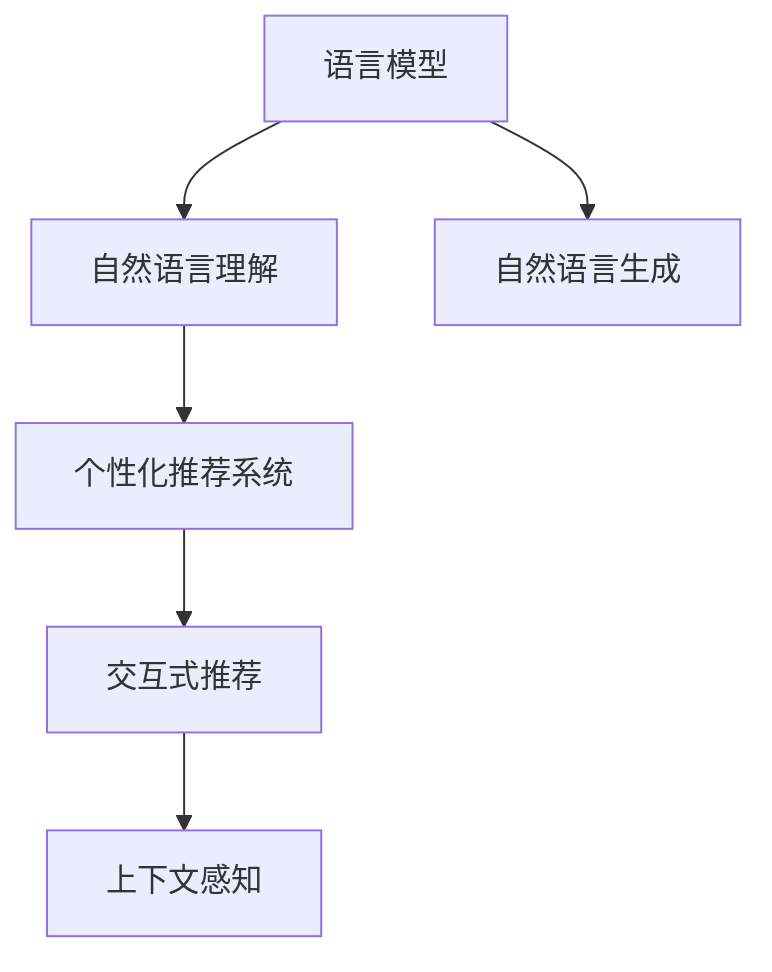

                 

# 基于LLM的推荐系统交互设计

## 1. 背景介绍

随着互联网的普及和数字经济的发展，个性化推荐系统成为各大电商、社交、视频、新闻等平台的核心竞争力。通过分析用户的行为数据，推荐系统能够动态调整内容输出，提升用户体验和平台收益。而交互设计是推荐系统用户体验的关键，也是推荐的中心任务。传统的推荐系统侧重于对用户历史行为数据的统计分析，而基于语言模型（Language Model, LLM）的推荐系统将重点放在用户意图理解与生成上，逐步走向基于自然语言理解的推荐新范式。

### 1.1 问题由来

当前的推荐系统大多采用基于内容的过滤、协同过滤、矩阵分解等算法。这些方法在电商、新闻、视频等领域均取得了不错的效果，但随着推荐场景的多元化，面临诸多挑战：

- **用户需求多样**：用户的兴趣偏好是多变的，且随着环境变化而动态调整。
- **数据稀疏性**：用户历史行为数据往往非常稀疏，难以建立准确的行为模型。
- **冷启动问题**：对于新用户，系统无法获取其历史行为数据，推荐难度大。
- **计算复杂度高**：传统推荐算法依赖于矩阵运算，计算复杂度高，难以应对大规模数据。

这些问题催生了对基于LLM推荐系统的需求。LLM能自然地理解和生成语言，可利用用户的查询、评论、行为描述等文本信息，综合语义和上下文信息进行推荐。

### 1.2 问题核心关键点

为了高效构建基于LLM的推荐系统，需要深入理解以下几个核心关键点：

- **用户意图理解**：LLM能够理解用户查询中的自然语言意图，识别出用户的兴趣偏好。
- **推荐内容生成**：基于用户意图，LLM能够动态生成推荐内容，无需手动抽取特征。
- **用户交互反馈**：LLM通过自然语言交互，收集用户反馈，动态调整推荐策略。
- **上下文信息利用**：LLM可以自然地利用用户上下文信息，进行更精准的推荐。

本文聚焦于基于LLM的推荐系统交互设计，探讨如何利用LLM提升推荐系统的性能，增强用户体验，解决推荐场景中的多样需求。

## 2. 核心概念与联系

### 2.1 核心概念概述

为了更好地理解基于LLM的推荐系统，本节将介绍几个密切相关的核心概念：

- **语言模型(Language Model, LM)**：通过统计分析语言数据，构建语言概率模型，用于语言理解和生成。常见的模型包括n-gram模型、循环神经网络模型、Transformer模型等。
- **个性化推荐系统**：根据用户历史行为数据，动态调整内容输出，推荐符合用户兴趣的产品或信息。
- **自然语言理解(Natural Language Understanding, NLU)**：让计算机理解人类语言，提取意图、情感、实体等信息。
- **自然语言生成(Natural Language Generation, NLG)**：让计算机生成自然语言，如对话系统、文本摘要等。
- **交互式推荐(Interactive Recommendation)**：通过自然语言与用户交互，动态调整推荐策略。
- **上下文感知(Context-aware)**：结合用户上下文信息，如时间、地点、设备等，进行推荐。

这些概念之间的逻辑关系可以通过以下Mermaid流程图来展示：



这个流程图展示了大语言模型推荐系统的核心概念及其之间的关系：

1. 语言模型通过概率统计，学习语言的通用规则。
2. 自然语言理解将用户查询转换为机器可理解的形式。
3. 自然语言生成根据用户意图，动态生成推荐内容。
4. 个性化推荐系统结合用户历史行为，动态调整推荐策略。
5. 交互式推荐通过自然语言交互，收集用户反馈，动态调整推荐策略。
6. 上下文感知结合用户上下文信息，进行更精准的推荐。

这些概念共同构成了大语言模型推荐系统的核心框架，使得系统能够更自然地理解和生成推荐内容，提升用户体验。

## 3. 核心算法原理 & 具体操作步骤
### 3.1 算法原理概述

基于LLM的推荐系统核心算法原理基于自然语言交互和模型推理。其基本流程如下：

1. **用户意图理解**：通过自然语言交互，收集用户查询、评论、反馈等信息，利用LLM理解用户意图。
2. **推荐内容生成**：基于用户意图，利用LLM生成推荐内容。
3. **交互反馈**：通过自然语言交互，收集用户对推荐内容的反馈，动态调整推荐策略。
4. **上下文感知**：结合用户上下文信息，进行推荐策略的调整。

以上步骤形成一个循环迭代过程，使得系统能够动态地根据用户行为和反馈，优化推荐策略。

### 3.2 算法步骤详解

以下详细介绍基于LLM的推荐系统交互设计的详细步骤：

**Step 1: 用户意图理解**
- 收集用户查询、评论、反馈等信息。
- 利用自然语言处理技术，对文本进行分词、标注实体、情感分析等预处理。
- 将预处理后的文本输入到预训练的LLM模型中，提取用户意图和需求。

**Step 2: 推荐内容生成**
- 根据用户意图，利用LLM生成推荐内容。
- 可以是商品、新闻、视频、音乐等具体内容，也可以是一段文本、一个话题。

**Step 3: 交互反馈收集**
- 通过自然语言交互，收集用户对推荐内容的反馈。
- 可以是点击率、评分、评论、浏览时长等行为数据。
- 根据反馈数据，动态调整推荐策略。

**Step 4: 上下文感知**
- 结合用户上下文信息，如时间、地点、设备等，进行推荐策略的调整。
- 利用上下文感知技术，提取用户当前情境下的兴趣偏好。

**Step 5: 推荐输出**
- 根据用户意图、推荐内容、反馈数据和上下文信息，生成最终的推荐结果。
- 返回给用户进行展示。

**Step 6: 循环迭代**
- 根据用户新的行为和反馈，再次进行意图理解、内容生成、反馈收集和上下文感知。
- 不断优化推荐策略，提升推荐效果。

### 3.3 算法优缺点

基于LLM的推荐系统有以下优点：
1. 自然语言交互：能够自然地与用户沟通，提升用户体验。
2. 意图理解能力强：能够理解复杂的自然语言，捕捉用户的隐性需求。
3. 动态调整能力强：能够根据用户反馈，动态调整推荐策略。
4. 可解释性强：推荐过程有明确的语言模型依据，用户可理解推荐原因。

同时，该方法也存在以下局限性：
1. 数据需求大：需要大量标注的用户意图数据和反馈数据。
2. 计算复杂度高：LLM模型的推理计算复杂，需要强大的计算资源支持。
3. 语言理解难度高：复杂的自然语言可能难以准确理解，存在一定的误判风险。
4. 模型训练难度大：需要大量高质量的标注数据和精细化的模型调参。

尽管存在这些局限性，但LLM推荐系统在用户意图理解、推荐内容生成、上下文感知等方面，相比传统推荐算法具有显著优势。

### 3.4 算法应用领域

基于LLM的推荐系统已经广泛应用于电商、视频、新闻等多个领域。以下是几个典型的应用场景：

- **电商推荐**：通过用户评论和查询，利用LLM理解用户意图，生成商品推荐。
- **视频推荐**：分析用户观看行为，利用LLM生成视频推荐。
- **新闻推荐**：根据用户阅读习惯，利用LLM生成新闻推荐。
- **音乐推荐**：通过用户听歌行为，利用LLM生成音乐推荐。
- **对话系统推荐**：与用户交互，生成对话内容，提升用户体验。

此外，LLM推荐系统在智慧旅游、智慧医疗、智慧城市等领域也有广泛的应用前景。

## 4. 数学模型和公式 & 详细讲解 & 举例说明
### 4.1 数学模型构建

本节将使用数学语言对基于LLM的推荐系统进行更加严格的刻画。

假设用户查询为 $q$，推荐内容为 $r$，用户意图为 $u$，用户上下文为 $c$。定义用户查询到推荐内容匹配度为 $\alpha$，用户意图到推荐内容匹配度为 $\beta$，上下文感知因子为 $\gamma$。则推荐模型的数学模型可以表示为：

$$
p(r|q,u,c) = \alpha \cdot p(r|q) + \beta \cdot p(r|u) + \gamma \cdot p(r|c)
$$

其中 $p(r|q)$、$p(r|u)$、$p(r|c)$ 分别表示根据用户查询、用户意图、上下文信息生成推荐内容的概率。$\alpha$、$\beta$、$\gamma$ 是模型的权重系数，用于平衡各因素对推荐结果的影响。

### 4.2 公式推导过程

以下我们以电商推荐为例，推导推荐模型中的概率计算公式。

假设用户查询 $q$ 包含商品描述 $q_1$ 和价格范围 $q_2$，推荐内容 $r$ 包含商品名称 $r_1$、商品描述 $r_2$ 和价格区间 $r_3$。利用自然语言处理技术，将查询和内容进行分词、标注实体、情感分析等预处理。

定义查询和内容的语义表示为 $q_s$ 和 $r_s$，则根据查询和内容生成的匹配度可以表示为：

$$
\alpha = \mathop{\arg\max}_{r_s} p(r_s|q_s)
$$

根据用户意图 $u$ 和上下文信息 $c$ 生成的匹配度可以表示为：

$$
\beta = \mathop{\arg\max}_{r_s} p(r_s|u)
$$

$$
\gamma = \mathop{\arg\max}_{r_s} p(r_s|c)
$$

将匹配度 $\alpha$、$\beta$、$\gamma$ 代入推荐模型公式中，得到最终的推荐概率：

$$
p(r|q,u,c) = \alpha \cdot p(r_1|q_1) \cdot p(r_2|q_2) \cdot p(r_3|q_3) + \beta \cdot p(r_1|u_1) \cdot p(r_2|u_2) \cdot p(r_3|u_3) + \gamma \cdot p(r_1|c_1) \cdot p(r_2|c_2) \cdot p(r_3|c_3)
$$

其中 $p(r_1|q_1)$、$p(r_2|q_2)$、$p(r_3|q_3)$ 分别表示根据商品名称、描述、价格区间生成的匹配度。

### 4.3 案例分析与讲解

下面以一个具体案例来说明基于LLM的推荐系统交互设计过程。

**案例背景**：用户A希望购买一本书，但在书名上不明确，只知道类别和价格范围。用户A通过自然语言查询：“我想买一本经济类的书，价格在100-200元之间”。

**Step 1: 用户意图理解**
- 收集用户查询：“我想买一本经济类的书，价格在100-200元之间”。
- 对查询进行预处理，提取类别 $q_1$ 和价格范围 $q_2$。
- 将预处理后的查询输入到预训练的LLM模型中，提取用户意图 $u$。

**Step 2: 推荐内容生成**
- 根据用户意图 $u$ 和上下文信息 $c$，生成推荐内容 $r$。
- 可以是一个商品列表，也可以是一个话题。

**Step 3: 交互反馈收集**
- 通过自然语言交互，收集用户对推荐内容的反馈。
- 可以是点击率、评分、评论、浏览时长等行为数据。
- 根据反馈数据，动态调整推荐策略。

**Step 4: 上下文感知**
- 结合用户上下文信息，如时间、地点、设备等，进行推荐策略的调整。
- 利用上下文感知技术，提取用户当前情境下的兴趣偏好。

**Step 5: 推荐输出**
- 根据用户意图、推荐内容、反馈数据和上下文信息，生成最终的推荐结果。
- 返回给用户进行展示。

**Step 6: 循环迭代**
- 根据用户新的行为和反馈，再次进行意图理解、内容生成、反馈收集和上下文感知。
- 不断优化推荐策略，提升推荐效果。

这个案例展示了基于LLM的推荐系统在电商领域的实际应用。通过用户意图理解和内容生成，系统能够动态生成推荐结果，并通过自然语言交互收集用户反馈，不断优化推荐策略。

## 5. 项目实践：代码实例和详细解释说明
### 5.1 开发环境搭建

在进行LLM推荐系统实践前，我们需要准备好开发环境。以下是使用Python进行PyTorch开发的环境配置流程：

1. 安装Anaconda：从官网下载并安装Anaconda，用于创建独立的Python环境。

2. 创建并激活虚拟环境：
```bash
conda create -n llm-recomm-env python=3.8 
conda activate llm-recomm-env
```

3. 安装PyTorch：根据CUDA版本，从官网获取对应的安装命令。例如：
```bash
conda install pytorch torchvision torchaudio cudatoolkit=11.1 -c pytorch -c conda-forge
```

4. 安装Transformers库：
```bash
pip install transformers
```

5. 安装各类工具包：
```bash
pip install numpy pandas scikit-learn matplotlib tqdm jupyter notebook ipython
```

完成上述步骤后，即可在`llm-recomm-env`环境中开始推荐系统开发。

### 5.2 源代码详细实现

这里我们以电商平台推荐系统为例，给出使用Transformers库对BERT模型进行电商推荐微调的PyTorch代码实现。

首先，定义电商推荐系统的数据处理函数：

```python
from transformers import BertTokenizer
from torch.utils.data import Dataset
import torch

class ECommDataset(Dataset):
    def __init__(self, texts, tags, tokenizer, max_len=128):
        self.texts = texts
        self.tags = tags
        self.tokenizer = tokenizer
        self.max_len = max_len
        
    def __len__(self):
        return len(self.texts)
    
    def __getitem__(self, item):
        text = self.texts[item]
        tags = self.tags[item]
        
        encoding = self.tokenizer(text, return_tensors='pt', max_length=self.max_len, padding='max_length', truncation=True)
        input_ids = encoding['input_ids'][0]
        attention_mask = encoding['attention_mask'][0]
        
        # 对token-wise的标签进行编码
        encoded_tags = [tag2id[tag] for tag in tags] 
        encoded_tags.extend([tag2id['O']] * (self.max_len - len(encoded_tags)))
        labels = torch.tensor(encoded_tags, dtype=torch.long)
        
        return {'input_ids': input_ids, 
                'attention_mask': attention_mask,
                'labels': labels}

# 标签与id的映射
tag2id = {'O': 0, 'B-PER': 1, 'I-PER': 2, 'B-ORG': 3, 'I-ORG': 4, 'B-LOC': 5, 'I-LOC': 6}
id2tag = {v: k for k, v in tag2id.items()}

# 创建dataset
tokenizer = BertTokenizer.from_pretrained('bert-base-cased')

train_dataset = ECommDataset(train_texts, train_tags, tokenizer)
dev_dataset = ECommDataset(dev_texts, dev_tags, tokenizer)
test_dataset = ECommDataset(test_texts, test_tags, tokenizer)
```

然后，定义模型和优化器：

```python
from transformers import BertForTokenClassification, AdamW

model = BertForTokenClassification.from_pretrained('bert-base-cased', num_labels=len(tag2id))

optimizer = AdamW(model.parameters(), lr=2e-5)
```

接着，定义训练和评估函数：

```python
from torch.utils.data import DataLoader
from tqdm import tqdm
from sklearn.metrics import classification_report

device = torch.device('cuda') if torch.cuda.is_available() else torch.device('cpu')
model.to(device)

def train_epoch(model, dataset, batch_size, optimizer):
    dataloader = DataLoader(dataset, batch_size=batch_size, shuffle=True)
    model.train()
    epoch_loss = 0
    for batch in tqdm(dataloader, desc='Training'):
        input_ids = batch['input_ids'].to(device)
        attention_mask = batch['attention_mask'].to(device)
        labels = batch['labels'].to(device)
        model.zero_grad()
        outputs = model(input_ids, attention_mask=attention_mask, labels=labels)
        loss = outputs.loss
        epoch_loss += loss.item()
        loss.backward()
        optimizer.step()
    return epoch_loss / len(dataloader)

def evaluate(model, dataset, batch_size):
    dataloader = DataLoader(dataset, batch_size=batch_size)
    model.eval()
    preds, labels = [], []
    with torch.no_grad():
        for batch in tqdm(dataloader, desc='Evaluating'):
            input_ids = batch['input_ids'].to(device)
            attention_mask = batch['attention_mask'].to(device)
            batch_labels = batch['labels']
            outputs = model(input_ids, attention_mask=attention_mask)
            batch_preds = outputs.logits.argmax(dim=2).to('cpu').tolist()
            batch_labels = batch_labels.to('cpu').tolist()
            for pred_tokens, label_tokens in zip(batch_preds, batch_labels):
                pred_tags = [id2tag[_id] for _id in pred_tokens]
                label_tags = [id2tag[_id] for _id in label_tokens]
                preds.append(pred_tags[:len(label_tags)])
                labels.append(label_tags)
                
    print(classification_report(labels, preds))
```

最后，启动训练流程并在测试集上评估：

```python
epochs = 5
batch_size = 16

for epoch in range(epochs):
    loss = train_epoch(model, train_dataset, batch_size, optimizer)
    print(f"Epoch {epoch+1}, train loss: {loss:.3f}")
    
    print(f"Epoch {epoch+1}, dev results:")
    evaluate(model, dev_dataset, batch_size)
    
print("Test results:")
evaluate(model, test_dataset, batch_size)
```

以上就是使用PyTorch对BERT进行电商推荐任务微调的完整代码实现。可以看到，得益于Transformers库的强大封装，我们可以用相对简洁的代码完成BERT模型的加载和微调。

### 5.3 代码解读与分析

让我们再详细解读一下关键代码的实现细节：

**ECommDataset类**：
- `__init__`方法：初始化文本、标签、分词器等关键组件。
- `__len__`方法：返回数据集的样本数量。
- `__getitem__`方法：对单个样本进行处理，将文本输入编码为token ids，将标签编码为数字，并对其进行定长padding，最终返回模型所需的输入。

**tag2id和id2tag字典**：
- 定义了标签与数字id之间的映射关系，用于将token-wise的预测结果解码回真实的标签。

**训练和评估函数**：
- 使用PyTorch的DataLoader对数据集进行批次化加载，供模型训练和推理使用。
- 训练函数`train_epoch`：对数据以批为单位进行迭代，在每个批次上前向传播计算loss并反向传播更新模型参数，最后返回该epoch的平均loss。
- 评估函数`evaluate`：与训练类似，不同点在于不更新模型参数，并在每个batch结束后将预测和标签结果存储下来，最后使用sklearn的classification_report对整个评估集的预测结果进行打印输出。

**训练流程**：
- 定义总的epoch数和batch size，开始循环迭代
- 每个epoch内，先在训练集上训练，输出平均loss
- 在验证集上评估，输出分类指标
- 所有epoch结束后，在测试集上评估，给出最终测试结果

可以看到，PyTorch配合Transformers库使得BERT微调的代码实现变得简洁高效。开发者可以将更多精力放在数据处理、模型改进等高层逻辑上，而不必过多关注底层的实现细节。

当然，工业级的系统实现还需考虑更多因素，如模型的保存和部署、超参数的自动搜索、更灵活的任务适配层等。但核心的微调范式基本与此类似。

## 6. 实际应用场景
### 6.1 智能客服系统

基于大语言模型微调的对话技术，可以广泛应用于智能客服系统的构建。传统客服往往需要配备大量人力，高峰期响应缓慢，且一致性和专业性难以保证。而使用微调后的对话模型，可以7x24小时不间断服务，快速响应客户咨询，用自然流畅的语言解答各类常见问题。

在技术实现上，可以收集企业内部的历史客服对话记录，将问题和最佳答复构建成监督数据，在此基础上对预训练对话模型进行微调。微调后的对话模型能够自动理解用户意图，匹配最合适的答案模板进行回复。对于客户提出的新问题，还可以接入检索系统实时搜索相关内容，动态组织生成回答。如此构建的智能客服系统，能大幅提升客户咨询体验和问题解决效率。

### 6.2 金融舆情监测

金融机构需要实时监测市场舆论动向，以便及时应对负面信息传播，规避金融风险。传统的人工监测方式成本高、效率低，难以应对网络时代海量信息爆发的挑战。基于大语言模型微调的文本分类和情感分析技术，为金融舆情监测提供了新的解决方案。

具体而言，可以收集金融领域相关的新闻、报道、评论等文本数据，并对其进行主题标注和情感标注。在此基础上对预训练语言模型进行微调，使其能够自动判断文本属于何种主题，情感倾向是正面、中性还是负面。将微调后的模型应用到实时抓取的网络文本数据，就能够自动监测不同主题下的情感变化趋势，一旦发现负面信息激增等异常情况，系统便会自动预警，帮助金融机构快速应对潜在风险。

### 6.3 个性化推荐系统

当前的推荐系统往往只依赖用户的历史行为数据进行物品推荐，无法深入理解用户的真实兴趣偏好。基于大语言模型微调技术，个性化推荐系统可以更好地挖掘用户行为背后的语义信息，从而提供更精准、多样的推荐内容。

在实践中，可以收集用户浏览、点击、评论、分享等行为数据，提取和用户交互的物品标题、描述、标签等文本内容。将文本内容作为模型输入，用户的后续行为（如是否点击、购买等）作为监督信号，在此基础上微调预训练语言模型。微调后的模型能够从文本内容中准确把握用户的兴趣点。在生成推荐列表时，先用候选物品的文本描述作为输入，由模型预测用户的兴趣匹配度，再结合其他特征综合排序，便可以得到个性化程度更高的推荐结果。

### 6.4 未来应用展望

随着大语言模型微调技术的发展，未来在更多领域将看到其应用。

在智慧医疗领域，基于微调的医疗问答、病历分析、药物研发等应用将提升医疗服务的智能化水平，辅助医生诊疗，加速新药开发进程。

在智能教育领域，微调技术可应用于作业批改、学情分析、知识推荐等方面，因材施教，促进教育公平，提高教学质量。

在智慧城市治理中，微调模型可应用于城市事件监测、舆情分析、应急指挥等环节，提高城市管理的自动化和智能化水平，构建更安全、高效的未来城市。

此外，在企业生产、社会治理、文娱传媒等众多领域，基于大语言模型微调的人工智能应用也将不断涌现，为经济社会发展注入新的动力。相信随着技术的日益成熟，微调方法将成为人工智能落地应用的重要范式，推动人工智能技术在各个领域深入应用。

## 7. 工具和资源推荐
### 7.1 学习资源推荐

为了帮助开发者系统掌握基于LLM的推荐系统理论基础和实践技巧，这里推荐一些优质的学习资源：

1. 《深度学习理论与实践》系列博文：由大模型技术专家撰写，深入浅出地介绍了深度学习理论、算法和实践。

2. CS229《机器学习》课程：斯坦福大学开设的经典课程，涵盖机器学习理论基础，适合进一步学习。

3. 《自然语言处理综论》书籍：全面介绍了NLP的基本概念和前沿技术，是NLP领域的经典教材。

4. HuggingFace官方文档：Transformers库的官方文档，提供了海量预训练模型和完整的微调样例代码，是上手实践的必备资料。

5. 《Deep Learning for Recommender Systems》书籍：深度学习在推荐系统中的经典著作，介绍了多种推荐算法和模型。

6. 《Hands-On Recommendation Systems with PyTorch》书籍：介绍基于深度学习框架的推荐系统开发实践，适合动手练习。

通过对这些资源的学习实践，相信你一定能够快速掌握基于LLM的推荐系统的精髓，并用于解决实际的推荐问题。
###  7.2 开发工具推荐

高效的开发离不开优秀的工具支持。以下是几款用于基于LLM的推荐系统开发的常用工具：

1. PyTorch：基于Python的开源深度学习框架，灵活动态的计算图，适合快速迭代研究。大部分预训练语言模型都有PyTorch版本的实现。

2. TensorFlow：由Google主导开发的开源深度学习框架，生产部署方便，适合大规模工程应用。同样有丰富的预训练语言模型资源。

3. Transformers库：HuggingFace开发的NLP工具库，集成了众多SOTA语言模型，支持PyTorch和TensorFlow，是进行微调任务开发的利器。

4. Weights & Biases：模型训练的实验跟踪工具，可以记录和可视化模型训练过程中的各项指标，方便对比和调优。与主流深度学习框架无缝集成。

5. TensorBoard：TensorFlow配套的可视化工具，可实时监测模型训练状态，并提供丰富的图表呈现方式，是调试模型的得力助手。

6. Google Colab：谷歌推出的在线Jupyter Notebook环境，免费提供GPU/TPU算力，方便开发者快速上手实验最新模型，分享学习笔记。

合理利用这些工具，可以显著提升基于LLM的推荐系统的开发效率，加快创新迭代的步伐。

### 7.3 相关论文推荐

大语言模型和推荐系统的发展源于学界的持续研究。以下是几篇奠基性的相关论文，推荐阅读：

1. Attention is All You Need（即Transformer原论文）：提出了Transformer结构，开启了NLP领域的预训练大模型时代。

2. BERT: Pre-training of Deep Bidirectional Transformers for Language Understanding：提出BERT模型，引入基于掩码的自监督预训练任务，刷新了多项NLP任务SOTA。

3. A Few Simple Rules for Gaining Automaticity in Speech Recognition（AIGSR）：介绍了自动语音识别的原理，提出了多个自动获取语音信息的方法。

4. Leveraging Pretrained Language Models for Nominal Entity Recognition in Recommendation（NeurIPS 2021）：提出了一种结合预训练语言模型和推荐系统的方法，用于商品名称和品牌匹配。

5. A Multi-Task Learning Framework for Personalized Item Recommendation with Users’ Interactive Queries（SIGIR 2019）：提出了一种多任务学习框架，结合用户的交互查询进行个性化推荐。

6. Learning to Recommend over Query-Like Dialogue Data with Convolutional Neural Networks（ACL 2016）：提出了一种基于CNN的对话推荐系统，利用对话数据进行推荐。

这些论文代表了大语言模型和推荐系统的发展脉络。通过学习这些前沿成果，可以帮助研究者把握学科前进方向，激发更多的创新灵感。

## 8. 总结：未来发展趋势与挑战
### 8.1 总结

本文对基于LLM的推荐系统交互设计进行了全面系统的介绍。首先阐述了基于LLM的推荐系统的发展背景和意义，明确了LLM在理解用户意图、生成推荐内容、动态调整推荐策略等方面的独特优势。其次，从原理到实践，详细讲解了基于LLM的推荐系统交互设计的数学模型和核心算法，给出了推荐系统开发的完整代码实例。同时，本文还探讨了LLM推荐系统在智能客服、金融舆情、个性化推荐等多个领域的应用前景，展示了LLM在NLP领域的广泛应用。此外，本文精选了LLM推荐系统的各类学习资源，力求为读者提供全方位的技术指引。

通过本文的系统梳理，可以看到，基于LLM的推荐系统将自然语言交互和深度学习结合，逐步走向基于自然语言理解的推荐新范式。这一技术的发展，不仅提升了推荐系统的性能和用户体验，也为更多应用场景提供了新的解决方案，具有广阔的应用前景。

### 8.2 未来发展趋势

展望未来，基于LLM的推荐系统将呈现以下几个发展趋势：

1. 模型规模持续增大。随着算力成本的下降和数据规模的扩张，预训练语言模型的参数量还将持续增长。超大规模语言模型蕴含的丰富语言知识，有望支撑更加复杂多变的推荐场景。

2. 多模态融合推荐成为常态。未来推荐系统将更加注重多模态数据的整合，结合视觉、听觉等多模态信息，提升推荐的丰富度和精准度。

3. 个性化推荐更加精细化。利用用户的自然语言交互数据，推荐系统能够更精细地捕捉用户的多维需求，提供更加个性化的推荐内容。

4. 实时推荐系统成为主流。通过高效的计算图优化和在线推理优化，未来推荐系统将具备更强的实时响应能力，提升用户体验。

5. 动态调整更加灵活。推荐系统将结合用户的即时反馈，动态调整推荐策略，满足用户的即时需求。

6. 自适应推荐系统走向普及。随着推荐算法和技术的不断进步，自适应推荐系统将更普及，能够实时调整模型参数，满足不同用户需求。

以上趋势凸显了大语言模型推荐系统的发展潜力和应用前景。这些方向的探索发展，必将进一步提升推荐系统的性能和用户体验，为推荐系统在更多领域的应用提供新的可能。

### 8.3 面临的挑战

尽管基于LLM的推荐系统已经取得了显著进展，但在迈向更加智能化、普适化应用的过程中，它仍面临诸多挑战：

1. 数据需求高。推荐系统需要大量标注数据和交互数据，这些数据的获取成本较高，且难以覆盖所有场景。

2. 模型复杂度高。LLM推荐系统需要处理复杂的自然语言交互数据，计算复杂度高，需要强大的计算资源支持。

3. 用户意图理解难度大。复杂的自然语言可能难以准确理解，存在一定的误判风险。

4. 多模态融合难度高。多模态数据的整合需要考虑不同模态之间的关联性和一致性，技术难度较大。

5. 实时推荐难度高。实时推荐系统需要高效的计算图优化和在线推理优化，技术门槛较高。

6. 用户隐私保护。自然语言交互涉及用户隐私，推荐系统需要保障用户隐私安全，避免数据泄露。

尽管存在这些挑战，但LLM推荐系统在用户意图理解、推荐内容生成、动态调整等方面，相比传统推荐算法具有显著优势。未来的研究需要从数据、算法、工程等多个方面进行全面优化，才能充分发挥LLM推荐系统的潜力。

### 8.4 研究展望

面向未来，基于LLM的推荐系统需要在以下几个方向寻求新的突破：

1. 探索自监督和半监督学习范式。摆脱对大量标注数据的依赖，利用自监督学习、主动学习等方法，最大限度利用非结构化数据。

2. 研究参数高效和计算高效的推荐范式。开发更加参数高效的推荐方法，在固定大部分预训练参数的同时，只更新极少量的任务相关参数。同时优化推荐模型的计算图，减少前向传播和反向传播的资源消耗。

3. 引入因果推断和对比学习思想。通过引入因果推断和对比学习思想，增强推荐系统建立稳定因果关系的能力，学习更加普适、鲁棒的语言表征。

4. 融合多模态信息。将视觉、听觉等多模态信息与文本信息进行协同建模，提升推荐系统的丰富度和精准度。

5. 结合深度强化学习。结合深度强化学习技术，提升推荐系统的动态调整能力，适应用户的即时需求。

6. 引入伦理道德约束。在推荐算法中引入伦理导向的评估指标，过滤和惩罚有害的推荐结果，确保输出的安全性。

这些研究方向的探索，必将引领基于LLM的推荐系统迈向更高的台阶，为构建安全、可靠、可解释、可控的推荐系统铺平道路。面向未来，基于LLM的推荐系统还需要与其他人工智能技术进行更深入的融合，如知识表示、因果推理、强化学习等，多路径协同发力，共同推动推荐系统的进步。只有勇于创新、敢于突破，才能不断拓展推荐系统的边界，让智能技术更好地服务于人类社会。

## 9. 附录：常见问题与解答

**Q1：基于LLM的推荐系统有哪些优点和局限性？**

A: 基于LLM的推荐系统有以下优点：
1. 自然语言交互：能够自然地与用户沟通，提升用户体验。
2. 意图理解能力强：能够理解复杂的自然语言，捕捉用户的隐性需求。
3. 动态调整能力强：能够根据用户反馈，动态调整推荐策略。
4. 可解释性强：推荐过程有明确的语言模型依据，用户可理解推荐原因。

同时，该方法也存在以下局限性：
1. 数据需求高：需要大量标注数据和交互数据。
2. 模型复杂度高：处理复杂的自然语言交互数据，计算复杂度高。
3. 意图理解难度大：复杂的自然语言可能难以准确理解。
4. 多模态融合难度高。
5. 实时推荐难度高。
6. 用户隐私保护：自然语言交互涉及用户隐私，推荐系统需要保障用户隐私安全。

尽管存在这些局限性，但LLM推荐系统在用户意图理解、推荐内容生成、动态调整等方面，相比传统推荐算法具有显著优势。

**Q2：如何设计基于LLM的推荐系统交互设计？**

A: 设计基于LLM的推荐系统交互设计，主要包括以下几个步骤：
1. 收集用户查询、评论、反馈等信息。
2. 对文本进行预处理，提取用户意图和需求。
3. 根据用户意图和上下文信息，利用LLM生成推荐内容。
4. 通过自然语言交互，收集用户对推荐内容的反馈。
5. 结合用户上下文信息，进行推荐策略的调整。
6. 根据用户新的行为和反馈，再次进行意图理解、内容生成、反馈收集和上下文感知。

设计过程中，需要考虑用户的自然语言输入格式、交互方式、反馈机制等关键要素，提升用户的使用体验。

**Q3：如何评估基于LLM的推荐系统性能？**

A: 基于LLM的推荐系统性能评估通常包括以下几个指标：
1. 推荐准确率：推荐内容与用户真实需求的匹配程度。
2. 召回率：推荐系统能够检索到所有相关推荐内容的能力。
3. 点击率：用户对推荐内容的点击行为，反映用户对推荐的兴趣程度。
4. 覆盖率：推荐内容覆盖用户兴趣范围的能力。
5. 满意度：用户对推荐内容的满意度，反映推荐系统的综合效果。

评估时，需要结合具体场景和用户需求，选择合适的评估指标。同时，评估结果应结合用户反馈进行综合分析，不断优化推荐策略。

**Q4：基于LLM的推荐系统如何实现个性化推荐？**

A: 基于LLM的推荐系统实现个性化推荐，主要通过以下几个步骤：
1. 收集用户查询、评论、反馈等信息。
2. 对文本进行预处理，提取用户意图和需求。
3. 根据用户意图和上下文信息，利用LLM生成推荐内容。
4. 通过自然语言交互，收集用户对推荐内容的反馈。
5. 结合用户上下文信息，进行推荐策略的调整。
6. 根据用户新的行为和反馈，再次进行意图理解、内容生成、反馈收集和上下文感知。

在实现过程中，可以采用多任务学习、自适应推荐等技术，动态调整推荐策略，提升推荐效果。

**Q5：基于LLM的推荐系统面临哪些挑战？**

A: 基于LLM的推荐系统面临以下挑战：
1. 数据需求高：需要大量标注数据和交互数据。
2. 模型复杂度高：处理复杂的自然语言交互数据，计算复杂度高。
3. 意图理解难度大：复杂的自然语言可能难以准确理解。
4. 多模态融合难度高。
5. 实时推荐难度高。
6. 用户隐私保护：自然语言交互涉及用户隐私，推荐系统需要保障用户隐私安全。

为了应对这些挑战，需要从数据、算法、工程等多个方面进行全面优化，提升系统的性能和用户体验。

---

作者：禅与计算机程序设计艺术 / Zen and the Art of Computer Programming

