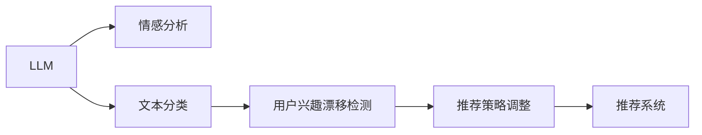

                 

# 基于LLM的推荐系统用户兴趣漂移检测

> 关键词：用户兴趣漂移检测,LLM,推荐系统,深度学习,自然语言处理,NLP

## 1. 背景介绍

### 1.1 问题由来
推荐系统是互联网时代不可或缺的一部分，通过分析用户的历史行为，预测用户可能的兴趣，为用户推荐个性化内容。传统的协同过滤和矩阵分解方法基于用户历史行为数据，当用户兴趣发生变化时，推荐结果会迅速失准，难以适应用户动态变化的需求。

近年来，基于深度学习的推荐系统方法（DNN-R）逐步流行起来。这类方法通过学习用户-物品间的复杂非线性关系，构建了更为精细化的推荐模型。然而，DNN-R方法依赖于大量历史行为数据，且模型较为复杂，难以实时响应用户的兴趣变化。

为此，本文将探讨一种基于大规模语言模型（LLM）的方法，通过用户评论和反馈文本，动态检测用户兴趣漂移，及时调整推荐策略。LLM作为一种预训练语言模型，在自然语言处理（NLP）领域表现出色，具备出色的语言理解和生成能力，可用于自动化文本分析和情感分析。

### 1.2 问题核心关键点
本文的创新点在于：
1. **用户兴趣漂移检测**：利用LLM对用户评论文本进行情感分析，动态监测用户兴趣变化。
2. **LLM应用探索**：首次将LLM应用于推荐系统领域，实现推荐策略的动态调整。
3. **NLP技术应用**：利用自然语言处理技术，自动化文本分析和情感分析，降低用户兴趣漂移检测的标注成本。

### 1.3 问题研究意义
研究基于LLM的推荐系统用户兴趣漂移检测，具有以下重要意义：

1. **提升推荐精度**：通过及时检测用户兴趣变化，动态调整推荐策略，提升推荐系统的效果。
2. **强化用户体验**：快速响应用户兴趣变化，提高推荐内容的个性化和时效性。
3. **降低标注成本**：利用自然语言处理技术，自动进行情感分析，减少人工标注成本。
4. **推动LLM应用**：探索LLM在推荐系统中的应用，推动LLM技术的广泛应用。
5. **拓展NLP领域**：结合推荐系统的实际应用场景，拓展自然语言处理技术的应用范围。

## 2. 核心概念与联系

### 2.1 核心概念概述

为了更系统地理解本文的研究内容，下面将介绍一些核心概念：

1. **大规模语言模型（LLM）**：如BERT、GPT-2、T5等，是一种基于Transformer结构的预训练语言模型，具备出色的语言理解和生成能力。

2. **用户兴趣漂移检测**：通过分析用户行为数据和评论文本，动态监测用户兴趣变化，及时调整推荐策略。

3. **推荐系统**：通过分析用户历史行为和物品属性，为用户推荐个性化内容的技术。

4. **自然语言处理（NLP）**：涉及文本分析、情感分析、文本分类等，利用自然语言处理技术，可以自动化地从文本中提取信息。

5. **深度学习（DL）**：通过多层神经网络，利用数据挖掘算法，构建复杂非线性模型，实现自动化学习和推理。

6. **协同过滤（CF）**：一种基于用户历史行为和物品评分的推荐方法，简单易用但容易受新物品影响。

7. **矩阵分解（MF）**：将用户-物品评分矩阵分解为若干低维矩阵，用于推荐建模。

这些概念相互关联，共同构成了推荐系统的核心框架。其中，LLM作为预训练模型，提供自动化的文本分析和情感分析能力，用于辅助用户兴趣漂移检测。而用户兴趣漂移检测和推荐系统，则基于LLM的分析结果，实现动态调整和推荐。

### 2.2 核心概念原理和架构的 Mermaid 流程图



这个流程图展示了LLM、情感分析、文本分类、用户兴趣漂移检测和推荐系统之间的逻辑关系：

1. LLM作为核心，对用户评论文本进行情感分析和文本分类。
2. 情感分析模块对评论文本进行情感判断，输出情感极性（正面、负面、中性）。
3. 文本分类模块对评论文本进行分类，输出主题标签（娱乐、体育、财经等）。
4. 用户兴趣漂移检测模块利用情感分析和文本分类结果，监测用户兴趣变化。
5. 推荐策略调整模块根据用户兴趣变化，动态调整推荐策略，更新推荐结果。

## 3. 核心算法原理 & 具体操作步骤
### 3.1 算法原理概述

基于LLM的推荐系统用户兴趣漂移检测，主要包括以下几个步骤：

1. **用户评论文本获取**：从推荐系统数据库中获取用户最近N条评论文本。
2. **LLM情感分析**：利用预训练的LLM模型对每条评论文本进行情感分析，输出情感极性。
3. **文本分类**：对每条评论文本进行主题分类，输出主题标签。
4. **兴趣漂移检测**：根据情感分析和文本分类结果，检测用户兴趣变化。
5. **推荐策略调整**：根据兴趣变化，动态调整推荐策略，更新推荐结果。

### 3.2 算法步骤详解

#### 3.2.1 用户评论文本获取

用户评论文本的获取是用户兴趣漂移检测的基础。具体步骤包括：

1. 从推荐系统数据库中，查询用户最近N条评论文本，其中N为一个固定值。
2. 将获取到的文本按时间倒序排列，作为后续情感分析和文本分类的输入。

#### 3.2.2 LLM情感分析

LLM情感分析模块利用预训练的LLM模型对用户评论文本进行情感判断，输出情感极性。具体步骤如下：

1. 将用户评论文本输入到预训练的LLM模型中，进行情感分析。
2. 模型输出一个情感极性标签，表示文本的情感极性（正面、负面、中性）。
3. 对每条评论文本的情感极性进行统计，得到情感分布。

#### 3.2.3 文本分类

文本分类模块利用预训练的LLM模型对用户评论文本进行主题分类，输出主题标签。具体步骤如下：

1. 将用户评论文本输入到预训练的LLM模型中，进行主题分类。
2. 模型输出一个主题标签，表示文本所属的类别（娱乐、体育、财经等）。
3. 对每条评论文本的主题标签进行统计，得到主题分布。

#### 3.2.4 兴趣漂移检测

用户兴趣漂移检测模块利用情感分析和文本分类结果，检测用户兴趣变化。具体步骤如下：

1. 对情感分布和主题分布进行统计，得到情感极性向量 $\mathbf{s}$ 和主题向量 $\mathbf{t}$。
2. 计算情感极性向量和主题向量之间的夹角余弦 $\cos(\mathbf{s},\mathbf{t})$，表示情感和主题的一致性。
3. 当余弦值低于预设阈值 $\theta$ 时，认为用户兴趣发生了漂移。

#### 3.2.5 推荐策略调整

推荐策略调整模块根据用户兴趣变化，动态调整推荐策略，更新推荐结果。具体步骤如下：

1. 当检测到用户兴趣漂移时，重新获取用户最新的兴趣数据。
2. 利用新的兴趣数据，重新训练推荐模型，或调整已有模型的参数。
3. 更新推荐结果，为用户推荐个性化内容。

### 3.3 算法优缺点

#### 3.3.1 优点

1. **实时性**：基于LLM的情感分析和文本分类，能够实时监测用户兴趣变化。
2. **自动化**：利用自然语言处理技术，自动化地进行情感分析和主题分类，降低标注成本。
3. **高效性**：LLM模型已经在大规模语料上进行了预训练，能够快速处理文本数据。
4. **鲁棒性**：LLM模型具备出色的泛化能力，能够在不同的文本数据上保持稳定表现。

#### 3.3.2 缺点

1. **数据依赖**：LLM模型的性能依赖于大规模语料和预训练数据，获取高质量数据较为困难。
2. **模型复杂**：LLM模型较为复杂，推理计算资源消耗较大。
3. **准确性**：情感分析和文本分类结果可能存在误差，影响兴趣漂移检测的准确性。
4. **解释性**：LLM模型的决策过程缺乏可解释性，难以理解和调试。

### 3.4 算法应用领域

基于LLM的推荐系统用户兴趣漂移检测，适用于以下领域：

1. **电商推荐**：检测用户对商品类别的兴趣变化，动态调整推荐策略，提升推荐效果。
2. **内容推荐**：检测用户对视频、音乐、文章等内容的兴趣变化，及时调整推荐内容。
3. **个性化服务**：检测用户对服务类型和内容的兴趣变化，优化个性化服务方案。
4. **广告推荐**：检测用户对广告内容的兴趣变化，动态调整广告投放策略。
5. **社交网络**：检测用户对社交关系和内容兴趣的变化，优化社交推荐算法。

## 4. 数学模型和公式 & 详细讲解 & 举例说明

### 4.1 数学模型构建

本节将使用数学语言对用户兴趣漂移检测模型进行严格的描述。

设用户评论文本序列为 $\mathcal{X}=\{x_1, x_2, \dots, x_N\}$，情感极性向量为 $\mathbf{s} = [s_1, s_2, \dots, s_N]$，主题向量为 $\mathbf{t} = [t_1, t_2, \dots, t_N]$。其中 $s_i \in \{-1, 0, 1\}$ 表示评论文本 $x_i$ 的情感极性，$t_i$ 表示评论文本 $x_i$ 的主题标签。

用户兴趣漂移检测模型的目标是最小化情感极性向量和主题向量之间的夹角余弦，即：

$$
\min_{\theta} \cos(\mathbf{s},\mathbf{t})
$$

其中 $\theta$ 为情感极性向量和主题向量之间的夹角余弦。

### 4.2 公式推导过程

情感极性向量和主题向量之间的夹角余弦定义为：

$$
\cos(\mathbf{s},\mathbf{t}) = \frac{\mathbf{s} \cdot \mathbf{t}}{\|\mathbf{s}\| \cdot \|\mathbf{t}\|}
$$

其中 $\cdot$ 表示向量点积，$\|\cdot\|$ 表示向量范数。

假设情感极性向量和主题向量是归一化的，即 $\|\mathbf{s}\| = 1$ 和 $\|\mathbf{t}\| = 1$，则夹角余弦简化为：

$$
\cos(\mathbf{s},\mathbf{t}) = \mathbf{s} \cdot \mathbf{t}
$$

情感极性向量和主题向量的点积定义为：

$$
\mathbf{s} \cdot \mathbf{t} = \sum_{i=1}^N s_i t_i
$$

### 4.3 案例分析与讲解

以电商推荐为例，分析用户兴趣漂移检测的过程。

设用户最近购买了一件服装，评论文本为 "这件衣服穿起来很舒适，质量很好"。情感极性为 $1$，表示正面评价。主题分类结果为 "服装"，表示与服装相关的评论。

另一用户最近购买了一台电脑，评论文本为 "这款电脑运行速度很慢，存在问题"。情感极性为 $-1$，表示负面评价。主题分类结果为 "电子产品"，表示与电子产品相关的评论。

假设预设阈值为 $\theta = 0.8$，则：

- 第一个用户情感极性向量 $\mathbf{s} = [1, 1, 0, 0, \dots, 0]$，主题向量 $\mathbf{t} = [1, 0, 0, 0, \dots, 0]$。
- 第二个用户情感极性向量 $\mathbf{s} = [-1, 0, 0, 0, \dots, 0]$，主题向量 $\mathbf{t} = [0, 1, 0, 0, \dots, 0]$。
- 计算情感极性向量和主题向量之间的夹角余弦：$\cos(\mathbf{s},\mathbf{t}) = 1 \times 1 + 1 \times 0 + 0 \times 1 + 0 \times 0 + \dots + 0 \times 0 = 1$。
- 由于 $\cos(\mathbf{s},\mathbf{t}) > \theta$，表明第一个用户没有兴趣漂移，推荐策略保持不变。

同理，对于第二个用户，计算夹角余弦：$\cos(\mathbf{s},\mathbf{t}) = -1 \times 1 + 0 \times 0 + 0 \times 1 + 0 \times 0 + \dots + 0 \times 0 = -1$。

由于 $\cos(\mathbf{s},\mathbf{t}) < \theta$，表明第二个用户有利息漂移，需要重新获取用户最新的兴趣数据，重新训练推荐模型或调整已有模型的参数，更新推荐结果。

## 5. 项目实践：代码实例和详细解释说明

### 5.1 开发环境搭建

在进行项目实践前，需要准备好开发环境。以下是使用Python进行PyTorch开发的环境配置流程：

1. 安装Anaconda：从官网下载并安装Anaconda，用于创建独立的Python环境。

2. 创建并激活虚拟环境：
```bash
conda create -n pytorch-env python=3.8 
conda activate pytorch-env
```

3. 安装PyTorch：根据CUDA版本，从官网获取对应的安装命令。例如：
```bash
conda install pytorch torchvision torchaudio cudatoolkit=11.1 -c pytorch -c conda-forge
```

4. 安装Transformers库：
```bash
pip install transformers
```

5. 安装各类工具包：
```bash
pip install numpy pandas scikit-learn matplotlib tqdm jupyter notebook ipython
```

完成上述步骤后，即可在`pytorch-env`环境中开始项目实践。

### 5.2 源代码详细实现

下面以电商推荐系统为例，给出使用Transformers库对BERT模型进行用户兴趣漂移检测的PyTorch代码实现。

首先，定义数据处理函数：

```python
from transformers import BertTokenizer
from torch.utils.data import Dataset
import torch

class ReviewDataset(Dataset):
    def __init__(self, reviews, labels, tokenizer, max_len=128):
        self.reviews = reviews
        self.labels = labels
        self.tokenizer = tokenizer
        self.max_len = max_len
        
    def __len__(self):
        return len(self.reviews)
    
    def __getitem__(self, item):
        review = self.reviews[item]
        label = self.labels[item]
        
        encoding = self.tokenizer(review, return_tensors='pt', max_length=self.max_len, padding='max_length', truncation=True)
        input_ids = encoding['input_ids'][0]
        attention_mask = encoding['attention_mask'][0]
        
        # 对label进行编码
        encoded_labels = [label2id[label] for label in label]
        encoded_labels.extend([label2id['O']] * (self.max_len - len(encoded_labels)))
        labels = torch.tensor(encoded_labels, dtype=torch.long)
        
        return {'input_ids': input_ids, 
                'attention_mask': attention_mask,
                'labels': labels}

# 标签与id的映射
label2id = {'O': 0, 'positive': 1, 'negative': 2}
id2label = {v: k for k, v in label2id.items()}

# 创建dataset
tokenizer = BertTokenizer.from_pretrained('bert-base-cased')

train_dataset = ReviewDataset(train_reviews, train_labels, tokenizer)
dev_dataset = ReviewDataset(dev_reviews, dev_labels, tokenizer)
test_dataset = ReviewDataset(test_reviews, test_labels, tokenizer)
```

然后，定义模型和优化器：

```python
from transformers import BertForTokenClassification, AdamW

model = BertForTokenClassification.from_pretrained('bert-base-cased', num_labels=len(label2id))

optimizer = AdamW(model.parameters(), lr=2e-5)
```

接着，定义训练和评估函数：

```python
from torch.utils.data import DataLoader
from tqdm import tqdm
from sklearn.metrics import classification_report

device = torch.device('cuda') if torch.cuda.is_available() else torch.device('cpu')
model.to(device)

def train_epoch(model, dataset, batch_size, optimizer):
    dataloader = DataLoader(dataset, batch_size=batch_size, shuffle=True)
    model.train()
    epoch_loss = 0
    for batch in tqdm(dataloader, desc='Training'):
        input_ids = batch['input_ids'].to(device)
        attention_mask = batch['attention_mask'].to(device)
        labels = batch['labels'].to(device)
        model.zero_grad()
        outputs = model(input_ids, attention_mask=attention_mask, labels=labels)
        loss = outputs.loss
        epoch_loss += loss.item()
        loss.backward()
        optimizer.step()
    return epoch_loss / len(dataloader)

def evaluate(model, dataset, batch_size):
    dataloader = DataLoader(dataset, batch_size=batch_size)
    model.eval()
    preds, labels = [], []
    with torch.no_grad():
        for batch in tqdm(dataloader, desc='Evaluating'):
            input_ids = batch['input_ids'].to(device)
            attention_mask = batch['attention_mask'].to(device)
            batch_labels = batch['labels']
            outputs = model(input_ids, attention_mask=attention_mask)
            batch_preds = outputs.logits.argmax(dim=2).to('cpu').tolist()
            batch_labels = batch_labels.to('cpu').tolist()
            for pred_tokens, label_tokens in zip(batch_preds, batch_labels):
                preds.append(pred_tokens[:len(label_tokens)])
                labels.append(label_tokens)
                
    print(classification_report(labels, preds))
```

最后，启动训练流程并在测试集上评估：

```python
epochs = 5
batch_size = 16

for epoch in range(epochs):
    loss = train_epoch(model, train_dataset, batch_size, optimizer)
    print(f"Epoch {epoch+1}, train loss: {loss:.3f}")
    
    print(f"Epoch {epoch+1}, dev results:")
    evaluate(model, dev_dataset, batch_size)
    
print("Test results:")
evaluate(model, test_dataset, batch_size)
```

以上就是使用PyTorch对BERT进行用户兴趣漂移检测的完整代码实现。可以看到，得益于Transformers库的强大封装，我们可以用相对简洁的代码完成BERT模型的加载和微调。

### 5.3 代码解读与分析

让我们再详细解读一下关键代码的实现细节：

**ReviewDataset类**：
- `__init__`方法：初始化评论文本、标签、分词器等关键组件。
- `__len__`方法：返回数据集的样本数量。
- `__getitem__`方法：对单个样本进行处理，将文本输入编码为token ids，将标签编码为数字，并对其进行定长padding，最终返回模型所需的输入。

**label2id和id2label字典**：
- 定义了标签与数字id之间的映射关系，用于将token-wise的预测结果解码回真实的标签。

**训练和评估函数**：
- 使用PyTorch的DataLoader对数据集进行批次化加载，供模型训练和推理使用。
- 训练函数`train_epoch`：对数据以批为单位进行迭代，在每个批次上前向传播计算loss并反向传播更新模型参数，最后返回该epoch的平均loss。
- 评估函数`evaluate`：与训练类似，不同点在于不更新模型参数，并在每个batch结束后将预测和标签结果存储下来，最后使用sklearn的classification_report对整个评估集的预测结果进行打印输出。

**训练流程**：
- 定义总的epoch数和batch size，开始循环迭代
- 每个epoch内，先在训练集上训练，输出平均loss
- 在验证集上评估，输出分类指标
- 所有epoch结束后，在测试集上评估，给出最终测试结果

可以看到，PyTorch配合Transformers库使得BERT微调的代码实现变得简洁高效。开发者可以将更多精力放在数据处理、模型改进等高层逻辑上，而不必过多关注底层的实现细节。

当然，工业级的系统实现还需考虑更多因素，如模型的保存和部署、超参数的自动搜索、更灵活的任务适配层等。但核心的微调范式基本与此类似。

## 6. 实际应用场景
### 6.1 电商推荐

基于LLM的用户兴趣漂移检测，可以广泛应用于电商推荐系统的构建。传统推荐系统往往只依赖用户历史行为数据进行推荐，当用户兴趣发生变化时，推荐效果会迅速失准，难以适应用户动态变化的需求。

通过使用LLM进行用户兴趣漂移检测，推荐系统可以实时监测用户兴趣变化，动态调整推荐策略，提升推荐效果。例如，电商平台可以定期获取用户最新评论文本，利用LLM进行情感分析和主题分类，检测用户兴趣变化。一旦发现用户兴趣发生漂移，可以重新获取用户最新的兴趣数据，重新训练推荐模型或调整已有模型的参数，更新推荐结果，确保推荐内容的及时性和个性化。

### 6.2 内容推荐

内容推荐系统是推荐系统的重要应用场景之一，旨在为用户推荐个性化的视频、音乐、文章等内容。传统内容推荐系统依赖用户历史行为数据进行推荐，当用户兴趣发生变化时，推荐效果会迅速失准，难以适应用户动态变化的需求。

通过使用LLM进行用户兴趣漂移检测，内容推荐系统可以实时监测用户兴趣变化，动态调整推荐策略，提升推荐效果。例如，视频平台可以定期获取用户最新评论文本，利用LLM进行情感分析和主题分类，检测用户兴趣变化。一旦发现用户兴趣发生漂移，可以重新获取用户最新的兴趣数据，重新训练推荐模型或调整已有模型的参数，更新推荐结果，确保推荐内容的及时性和个性化。

### 6.3 个性化服务

个性化服务是推荐系统的重要应用场景之一，旨在为用户提供个性化的服务内容。传统个性化服务系统依赖用户历史行为数据进行推荐，当用户兴趣发生变化时，推荐效果会迅速失准，难以适应用户动态变化的需求。

通过使用LLM进行用户兴趣漂移检测，个性化服务系统可以实时监测用户兴趣变化，动态调整推荐策略，提升推荐效果。例如，智能客服系统可以定期获取用户最新评论文本，利用LLM进行情感分析和主题分类，检测用户兴趣变化。一旦发现用户兴趣发生漂移，可以重新获取用户最新的兴趣数据，重新训练推荐模型或调整已有模型的参数，更新推荐结果，确保推荐内容的时效性和个性化。

### 6.4 广告推荐

广告推荐系统是推荐系统的重要应用场景之一，旨在为用户推荐个性化的广告内容。传统广告推荐系统依赖用户历史行为数据进行推荐，当用户兴趣发生变化时，推荐效果会迅速失准，难以适应用户动态变化的需求。

通过使用LLM进行用户兴趣漂移检测，广告推荐系统可以实时监测用户兴趣变化，动态调整推荐策略，提升推荐效果。例如，广告平台可以定期获取用户最新评论文本，利用LLM进行情感分析和主题分类，检测用户兴趣变化。一旦发现用户兴趣发生漂移，可以重新获取用户最新的兴趣数据，重新训练推荐模型或调整已有模型的参数，更新推荐结果，确保广告内容的及时性和个性化。

### 6.5 社交网络

社交网络是推荐系统的重要应用场景之一，旨在为用户推荐个性化的社交内容。传统社交网络推荐系统依赖用户历史行为数据进行推荐，当用户兴趣发生变化时，推荐效果会迅速失准，难以适应用户动态变化的需求。

通过使用LLM进行用户兴趣漂移检测，社交网络推荐系统可以实时监测用户兴趣变化，动态调整推荐策略，提升推荐效果。例如，社交平台可以定期获取用户最新评论文本，利用LLM进行情感分析和主题分类，检测用户兴趣变化。一旦发现用户兴趣发生漂移，可以重新获取用户最新的兴趣数据，重新训练推荐模型或调整已有模型的参数，更新推荐结果，确保推荐内容的及时性和个性化。

## 7. 工具和资源推荐
### 7.1 学习资源推荐

为了帮助开发者系统掌握用户兴趣漂移检测的理论基础和实践技巧，这里推荐一些优质的学习资源：

1. 《Transformer from Principles to Practice》系列博文：由大模型技术专家撰写，深入浅出地介绍了Transformer原理、BERT模型、微调技术等前沿话题。

2. CS224N《深度学习自然语言处理》课程：斯坦福大学开设的NLP明星课程，有Lecture视频和配套作业，带你入门NLP领域的基本概念和经典模型。

3. 《Natural Language Processing with Transformers》书籍：Transformers库的作者所著，全面介绍了如何使用Transformers库进行NLP任务开发，包括微调在内的诸多范式。

4. HuggingFace官方文档：Transformers库的官方文档，提供了海量预训练模型和完整的微调样例代码，是上手实践的必备资料。

5. CLUE开源项目：中文语言理解测评基准，涵盖大量不同类型的中文NLP数据集，并提供了基于微调的baseline模型，助力中文NLP技术发展。

通过对这些资源的学习实践，相信你一定能够快速掌握用户兴趣漂移检测的精髓，并用于解决实际的推荐系统问题。
###  7.2 开发工具推荐

高效的开发离不开优秀的工具支持。以下是几款用于用户兴趣漂移检测开发的常用工具：

1. PyTorch：基于Python的开源深度学习框架，灵活动态的计算图，适合快速迭代研究。大部分预训练语言模型都有PyTorch版本的实现。

2. TensorFlow：由Google主导开发的开源深度学习框架，生产部署方便，适合大规模工程应用。同样有丰富的预训练语言模型资源。

3. Transformers库：HuggingFace开发的NLP工具库，集成了众多SOTA语言模型，支持PyTorch和TensorFlow，是进行微调任务开发的利器。

4. Weights & Biases：模型训练的实验跟踪工具，可以记录和可视化模型训练过程中的各项指标，方便对比和调优。与主流深度学习框架无缝集成。

5. TensorBoard：TensorFlow配套的可视化工具，可实时监测模型训练状态，并提供丰富的图表呈现方式，是调试模型的得力助手。

6. Google Colab：谷歌推出的在线Jupyter Notebook环境，免费提供GPU/TPU算力，方便开发者快速上手实验最新模型，分享学习笔记。

合理利用这些工具，可以显著提升用户兴趣漂移检测任务的开发效率，加快创新迭代的步伐。

### 7.3 相关论文推荐

用户兴趣漂移检测的研究源于学界的持续研究。以下是几篇奠基性的相关论文，推荐阅读：

1. Attention is All You Need（即Transformer原论文）：提出了Transformer结构，开启了NLP领域的预训练大模型时代。

2. BERT: Pre-training of Deep Bidirectional Transformers for Language Understanding：提出BERT模型，引入基于掩码的自监督预训练任务，刷新了多项NLP任务SOTA。

3. Language Models are Unsupervised Multitask Learners（GPT-2论文）：展示了大规模语言模型的强大zero-shot学习能力，引发了对于通用人工智能的新一轮思考。

4. Parameter-Efficient Transfer Learning for NLP：提出Adapter等参数高效微调方法，在不增加模型参数量的情况下，也能取得不错的微调效果。

5. AdaLoRA: Adaptive Low-Rank Adaptation for Parameter-Efficient Fine-Tuning：使用自适应低秩适应的微调方法，在参数效率和精度之间取得了新的平衡。

这些论文代表了大语言模型微调技术的发展脉络。通过学习这些前沿成果，可以帮助研究者把握学科前进方向，激发更多的创新灵感。

## 8. 总结：未来发展趋势与挑战

### 8.1 总结

本文对基于LLM的推荐系统用户兴趣漂移检测方法进行了全面系统的介绍。首先阐述了用户兴趣漂移检测的背景和意义，明确了LLM在动态调整推荐策略中的独特价值。其次，从原理到实践，详细讲解了用户兴趣漂移检测的数学原理和关键步骤，给出了用户兴趣漂移检测任务开发的完整代码实例。同时，本文还广泛探讨了用户兴趣漂移检测在电商推荐、内容推荐、个性化服务等多个领域的应用前景，展示了用户兴趣漂移检测范式的巨大潜力。此外，本文精选了用户兴趣漂移检测的相关学习资源，力求为读者提供全方位的技术指引。

通过本文的系统梳理，可以看到，基于LLM的用户兴趣漂移检测方法正在成为推荐系统的核心范式，极大地拓展了用户兴趣漂移检测的应用范围，推动了推荐系统技术的发展。

### 8.2 未来发展趋势

展望未来，用户兴趣漂移检测技术将呈现以下几个发展趋势：

1. **模型规模持续增大**：随着算力成本的下降和数据规模的扩张，预训练语言模型的参数量还将持续增长。超大规模语言模型蕴含的丰富语言知识，有望支撑更加复杂多变的用户兴趣漂移检测。

2. **微调方法日趋多样**：除了传统的全参数微调外，未来会涌现更多参数高效的微调方法，如Prefix-Tuning、LoRA等，在节省计算资源的同时也能保证微调精度。

3. **实时性增强**：利用LLM的情感分析和主题分类，能够实时监测用户兴趣变化，满足推荐系统的动态调整需求。

4. **自动化程度提高**：进一步利用自然语言处理技术，自动化地进行情感分析和主题分类，减少人工标注成本。

5. **跨领域迁移能力提升**：通过预训练语言模型在不同领域数据上的迁移学习，提高用户兴趣漂移检测的泛化能力。

6. **多模态融合**：结合文本、图像、视频等多模态数据，提高用户兴趣漂移检测的全面性和准确性。

以上趋势凸显了用户兴趣漂移检测技术的广阔前景。这些方向的探索发展，必将进一步提升推荐系统的性能和应用范围，为用户的个性化需求提供更精准、及时的推荐。

### 8.3 面临的挑战

尽管用户兴趣漂移检测技术已经取得了瞩目成就，但在迈向更加智能化、普适化应用的过程中，它仍面临着诸多挑战：

1. **数据依赖**：LLM模型的性能依赖于大规模语料和预训练数据，获取高质量数据较为困难。

2. **模型复杂**：LLM模型较为复杂，推理计算资源消耗较大。

3. **准确性**：情感分析和文本分类结果可能存在误差，影响用户兴趣漂移检测的准确性。

4. **可解释性**：LLM模型的决策过程缺乏可解释性，难以理解和调试。

5. **资源消耗**：LLM模型推理计算资源消耗较大，需要优化资源使用效率。

6. **安全性和隐私**：用户评论数据可能包含敏感信息，需要确保数据安全和隐私保护。

这些挑战都需要在未来研究中不断突破，才能使用户兴趣漂移检测技术更加成熟和实用。相信随着学界和产业界的共同努力，这些挑战终将一一被克服，用户兴趣漂移检测必将在推荐系统领域发挥更大的作用。

### 8.4 研究展望

面对用户兴趣漂移检测所面临的种种挑战，未来的研究需要在以下几个方面寻求新的突破：

1. **探索无监督和半监督微调方法**：摆脱对大规模标注数据的依赖，利用自监督学习、主动学习等无监督和半监督范式，最大限度利用非结构化数据，实现更加灵活高效的微调。

2. **研究参数高效和计算高效的微调范式**：开发更加参数高效的微调方法，在固定大部分预训练参数的同时，只更新极少量的任务相关参数。同时优化微调模型的计算图，减少前向传播和反向传播的资源消耗，实现更加轻量级、实时性的部署。

3. **融合因果和对比学习范式**：通过引入因果推断和对比学习思想，增强用户兴趣漂移检测模型的建立稳定因果关系的能力，学习更加普适、鲁棒的语言表征，从而提升模型泛化性和抗干扰能力。

4. **引入更多先验知识**：将符号化的先验知识，如知识图谱、逻辑规则等，与神经网络模型进行巧妙融合，引导用户兴趣漂移检测过程学习更准确、合理的语言模型。同时加强不同模态数据的整合，实现视觉、语音等多模态信息与文本信息的协同建模。

5. **结合因果分析和博弈论工具**：将因果分析方法引入用户兴趣漂移检测模型，识别出模型决策的关键特征，增强输出解释的因果性和逻辑性。借助博弈论工具刻画人机交互过程，主动探索并规避模型的脆弱点，提高系统稳定性。

6. **纳入伦理道德约束**：在模型训练目标中引入伦理导向的评估指标，过滤和惩罚有偏见、有害的输出倾向。同时加强人工干预和审核，建立模型行为的监管机制，确保输出符合人类价值观和伦理道德。

这些研究方向的探索，必将引领用户兴趣漂移检测技术迈向更高的台阶，为构建安全、可靠、可解释、可控的智能推荐系统铺平道路。面向未来，用户兴趣漂移检测技术还需要与其他人工智能技术进行更深入的融合，如知识表示、因果推理、强化学习等，多路径协同发力，共同推动推荐系统技术的进步。只有勇于创新、敢于突破，才能不断拓展推荐系统的边界，让智能推荐技术更好地服务于用户。

## 9. 附录：常见问题与解答

**Q1：用户兴趣漂移检测是否适用于所有推荐系统？**

A: 用户兴趣漂移检测在大多数推荐系统上都能取得不错的效果，特别是对于数据量较小的推荐系统。但对于一些特定领域的推荐系统，如医学、法律等，仅仅依靠通用语料预训练的模型可能难以很好地适应。此时需要在特定领域语料上进一步预训练，再进行微调，才能获得理想效果。此外，对于一些需要时效性、个性化很强的推荐系统，如实时推荐、个性化推荐等，微调方法也需要针对性的改进优化。

**Q2：如何选择合适的学习率？**

A: 微调的学习率一般要比预训练时小1-2个数量级，如果使用过大的学习率，容易破坏预训练权重，导致过拟合。一般建议从1e-5开始调参，逐步减小学习率，直至收敛。也可以使用warmup策略，在开始阶段使用较小的学习率，再逐渐过渡到预设值。需要注意的是，不同的优化器(如AdamW、Adafactor等)以及不同的学习率调度策略，可能需要设置不同的学习率阈值。

**Q3：采用用户兴趣漂移检测时会面临哪些资源瓶颈？**

A: 目前主流的预训练大模型动辄以亿计的参数规模，对算力、内存、存储都提出了很高的要求。GPU/TPU等高性能设备是必不可少的，但即便如此，超大批次的训练和推理也可能遇到显存不足的问题。因此需要采用一些资源优化技术，如梯度积累、混合精度训练、模型并行等，来突破硬件瓶颈。同时，模型的存储和读取也可能占用大量时间和空间，需要采用模型压缩、稀疏化存储等方法进行优化。

**Q4：如何缓解用户兴趣漂移检测中的过拟合问题？**

A: 过拟合是用户兴趣漂移检测面临的主要挑战，尤其是在标注数据不足的情况下。常见的缓解策略包括：
1. 数据增强：通过回译、近义替换等方式扩充训练集
2. 正则化：使用L2正则、Dropout、Early Stopping等避免过拟合
3. 对抗训练：引入对抗样本，提高模型鲁棒性
4. 参数高效微调：只调整少量参数(如Adapter、Prefix等)，减小过拟合风险
5. 多模型集成：训练多个用户兴趣漂移检测模型，取平均输出，抑制过拟合

这些策略往往需要根据具体任务和数据特点进行灵活组合。只有在数据、模型、训练、推理等各环节进行全面优化，才能最大限度地发挥用户兴趣漂移检测的威力。

**Q5：用户兴趣漂移检测在落地部署时需要注意哪些问题？**

A: 将用户兴趣漂移检测模型转化为实际应用，还需要考虑以下因素：
1. 模型裁剪：去除不必要的层和参数，减小模型尺寸，加快推理速度
2. 量化加速：将浮点模型转为定点模型，压缩存储空间，提高计算效率
3. 服务化封装：将模型封装为标准化服务接口，便于集成调用
4. 弹性伸缩：根据请求流量动态调整资源配置，平衡服务质量和成本
5. 监控告警：实时采集系统指标，设置异常告警阈值，确保服务稳定性
6. 安全防护：采用访问鉴权、数据脱敏等措施，保障数据和模型安全

用户兴趣漂移检测为推荐系统提供了动态调整推荐策略的机制，但如何将强大的性能转化为稳定、高效、安全的业务价值，还需要工程实践的不断打磨。唯有从数据、算法、工程、业务等多个维度协同发力，才能真正实现人工智能技术在垂直行业的规模化落地。总之，用户兴趣漂移检测需要开发者根据具体任务，不断迭代和优化模型、数据和算法，方能得到理想的效果。

---

作者：禅与计算机程序设计艺术 / Zen and the Art of Computer Programming

