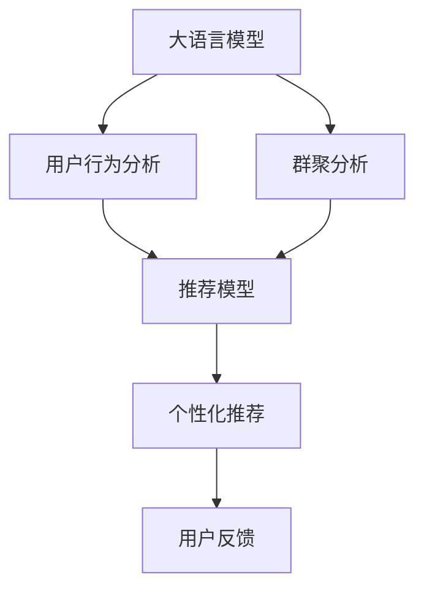

                 

# 基于LLM的推荐系统用户群体发现与分析

> 关键词：自然语言处理, 推荐系统, 用户行为, 群聚分析, 深度学习, 应用场景

## 1. 背景介绍

随着互联网技术的迅猛发展，个性化推荐系统在电商、社交媒体、视频平台等众多领域被广泛应用。然而，用户在推荐系统中的行为模式复杂多变，推荐算法需要从海量数据中挖掘出用户的深层兴趣和需求。传统推荐系统往往依赖于用户的显式反馈数据，难以全面、准确地把握用户需求，导致推荐效果不理想。

近年来，基于大语言模型的推荐系统逐渐成为新的研究热点。大语言模型（Large Language Models, LLMs）如BERT、GPT、T5等，具备强大的自然语言处理能力，能够从用户的历史行为数据中提取丰富的语义信息。结合用户行为数据分析，大语言模型可以发现和分析用户群体特征，实现更精准、个性化的推荐。

## 2. 核心概念与联系

### 2.1 核心概念概述

为更好理解基于大语言模型的推荐系统，本节将介绍几个关键概念及其相互关系：

- **大语言模型（Large Language Model, LLM）**：基于Transformer等架构，通过大规模无标签文本数据进行自监督预训练的语言模型。LLM具备强大的语言理解和生成能力，能够从自然语言文本中提取丰富语义信息。

- **推荐系统（Recommendation System）**：根据用户的历史行为数据和上下文信息，推荐用户可能感兴趣的商品、内容、服务等的系统。推荐系统是搜索引擎、电商平台、社交网络等众多应用中的核心功能之一。

- **用户行为（User Behavior）**：用户在平台上的行为记录，包括浏览、点击、购买、评价等。通过分析用户行为数据，可以发现用户的兴趣偏好，从而推荐合适的产品或内容。

- **群聚分析（Clustering Analysis）**：将用户按照某些特定属性进行分类或分组的过程。群聚分析有助于发现用户群体特征，实现用户分群、个性化推荐等功能。

- **深度学习（Deep Learning）**：基于多层神经网络进行数据建模和预测的机器学习方法。深度学习在自然语言处理、图像识别等领域取得了突破性进展，适用于处理复杂、高维度的数据。

- **应用场景（Application Scenarios）**：推荐系统在电商、社交、娱乐等多个领域的应用场景，不同场景对推荐算法的需求各异，需要适配的推荐策略。

### 2.2 核心概念原理和架构的 Mermaid 流程图



该图展示了基于大语言模型的推荐系统核心流程：

1. **大语言模型**：对用户行为数据进行语义分析，提取用户兴趣。
2. **用户行为分析**：收集、处理和分析用户的历史行为数据，发现用户行为特征。
3. **群聚分析**：对用户进行分群，形成用户群体特征。
4. **推荐模型**：结合大语言模型的语义分析和群聚分析结果，进行推荐预测。
5. **个性化推荐**：根据用户群体特征和历史行为数据，生成个性化推荐列表。
6. **用户反馈**：根据用户对推荐结果的反馈，进行模型优化和迭代。

## 3. 核心算法原理 & 具体操作步骤

### 3.1 算法原理概述

基于大语言模型的推荐系统，本质上是一种通过自然语言处理技术挖掘用户行为特征，进行群聚分析和个性化推荐的方法。其核心思想是通过大语言模型的预训练能力和用户行为数据的语义分析能力，发现用户群体特征，实现更精准的推荐。

具体而言，基于LLM的推荐系统通过以下步骤实现：

1. **预训练大语言模型**：在大量无标签文本数据上预训练LLM，使其能够理解自然语言的语义信息。
2. **用户行为分析**：收集用户的历史行为数据，提取文本形式的语义特征。
3. **群聚分析**：通过群聚算法将用户按照特定属性（如兴趣、年龄、地域等）进行分类。
4. **推荐模型构建**：将预训练LLM和群聚分析结果作为输入，构建推荐模型进行预测。
5. **个性化推荐**：根据推荐模型的预测结果，生成个性化推荐列表。

### 3.2 算法步骤详解

#### 3.2.1 预训练大语言模型

1. **选择模型架构**：选择合适的LLM架构（如BERT、GPT、T5等）进行预训练。
2. **准备数据集**：收集大规模无标签文本数据，如维基百科、新闻、小说等，作为预训练数据。
3. **训练预训练模型**：在预训练数据集上进行自监督学习，如掩码语言模型（Masked Language Modeling, MLM）、下一句预测（Next Sentence Prediction, NSP）等任务，训练出高质量的预训练模型。
4. **微调模型**：在推荐系统的特定任务上对预训练模型进行微调，如分类任务、匹配任务、生成任务等。

#### 3.2.2 用户行为分析

1. **数据收集**：收集用户的历史行为数据，如浏览记录、点击行为、购买记录、评价等。
2. **数据处理**：对收集到的行为数据进行清洗、归一化、格式化等预处理。
3. **语义提取**：将处理后的行为数据转化为文本形式，如标题、描述、标签等，进行语义提取和特征编码。
4. **嵌入表示**：将语义提取结果转换为模型可接受的向量表示，如Word2Vec、BERT Embedding等。

#### 3.2.3 群聚分析

1. **特征选择**：根据推荐系统需求，选择用户行为数据中的关键特征，如兴趣标签、购买时间、用户年龄等。
2. **群聚算法选择**：选择合适的群聚算法，如K-Means、层次聚类、DBSCAN等，对用户进行分组。
3. **群聚结果评估**：对群聚结果进行评估，如内部一致性、群聚数目的选择等。

#### 3.2.4 推荐模型构建

1. **输入准备**：将预训练模型的语义分析和群聚分析结果作为输入，构建推荐模型。
2. **模型设计**：选择合适的推荐算法，如协同过滤、基于内容的推荐、混合推荐等，设计推荐模型。
3. **模型训练**：在推荐模型上进行监督学习，优化模型参数。

#### 3.2.5 个性化推荐

1. **推荐结果生成**：根据推荐模型预测结果，生成个性化推荐列表。
2. **反馈处理**：收集用户对推荐结果的反馈，如点击率、购买率、评价等，进行模型优化。

### 3.3 算法优缺点

#### 3.3.1 优点

1. **语义理解能力强**：大语言模型具备强大的自然语言处理能力，能够理解用户的深层语义需求。
2. **用户行为分析全面**：通过语义分析和群聚分析，能够发现用户的全面兴趣和需求，提升推荐效果。
3. **适用性广**：适用于多种应用场景，如电商推荐、新闻推荐、视频推荐等，可灵活适配不同平台需求。
4. **可解释性强**：通过群聚分析和语义分析，可以解释推荐结果的生成逻辑，增强系统透明度。

#### 3.3.2 缺点

1. **计算资源消耗大**：大语言模型需要大量的计算资源进行训练和推理，可能导致成本较高。
2. **数据依赖性强**：推荐效果高度依赖于用户行为数据的质量和数量，获取高质量数据难度大。
3. **模型复杂度高**：推荐模型需要设计复杂、多层的算法，不易理解和调试。
4. **个性化推荐偏差**：群聚分析可能存在偏差，导致推荐结果不符合用户真实需求。

### 3.4 算法应用领域

基于大语言模型的推荐系统，已经在电商、社交、娱乐等多个领域得到了广泛应用：

1. **电商推荐**：如淘宝、京东等电商平台，利用用户浏览、点击、购买等行为数据，生成个性化商品推荐。
2. **新闻推荐**：如今日头条、网易新闻等，根据用户阅读习惯和新闻内容，推荐相关新闻。
3. **视频推荐**：如YouTube、爱奇艺等，根据用户观看记录和视频内容，推荐视频内容。
4. **音乐推荐**：如Spotify、网易云音乐等，根据用户听歌记录和音乐内容，推荐音乐。

除了这些传统应用外，基于LLM的推荐系统还在智能家居、健康医疗、金融理财等领域展现了强大的潜力。

## 4. 数学模型和公式 & 详细讲解 & 举例说明

### 4.1 数学模型构建

基于LLM的推荐系统可以构建多个数学模型，用于描述不同阶段的推荐过程。这里以协同过滤推荐模型为例，介绍推荐系统的数学建模过程。

协同过滤推荐模型基于用户之间的相似度进行推荐，其数学模型如下：

设用户集为 $U$，物品集为 $I$，用户 $u$ 对物品 $i$ 的评分矩阵为 $R \in \mathbb{R}^{n \times m}$，其中 $n$ 为物品数，$m$ 为用户数。设用户 $u$ 的兴趣向量为 $\hat{u} \in \mathbb{R}^{n}$，物品 $i$ 的特征向量为 $\hat{i} \in \mathbb{R}^{n}$。

推荐系统的目标是最大化用户和物品的评分预测值，即：

$$
\max_{\hat{u}, \hat{i}} \sum_{u \in U, i \in I} \alpha_u \alpha_i R_{ui}
$$

其中 $\alpha_u, \alpha_i$ 为用户 $u$ 和物品 $i$ 的权重，可以通过矩阵分解或基于梯度的方法进行求解。

### 4.2 公式推导过程

#### 4.2.1 协同过滤模型推导

1. **用户和物品评分矩阵分解**：将评分矩阵 $R$ 分解为用户兴趣向量 $\hat{u}$ 和物品特征向量 $\hat{i}$ 的乘积，即：

$$
R_{ui} = \hat{u}^T \hat{i}
$$

2. **用户兴趣和物品特征的求解**：根据分解后的评分矩阵和用户行为数据，通过梯度下降等优化算法求解用户兴趣向量 $\hat{u}$ 和物品特征向量 $\hat{i}$。

$$
\hat{u} = \text{argmin}_{\hat{u}} \frac{1}{2} \sum_{u \in U, i \in I} \|\hat{u}^T \hat{i} - R_{ui}\|^2
$$

3. **推荐结果生成**：根据求解出的用户兴趣向量和物品特征向量，计算用户对物品的评分预测值，生成推荐结果。

$$
\text{Recommend}(u) = \text{argmax}_{i \in I} \hat{u}^T \hat{i}
$$

### 4.3 案例分析与讲解

#### 4.3.1 电商推荐系统

**案例背景**：某电商平台收集了用户浏览、点击、购买等行为数据，利用大语言模型提取用户行为语义特征，结合群聚分析和协同过滤推荐模型，实现个性化商品推荐。

**数据处理**：将用户行为数据转化为文本形式，如商品名称、描述、类别等，通过BERT模型进行预训练和微调，得到用户行为语义表示。

**群聚分析**：根据商品类别、价格、用户年龄等特征，使用K-Means算法对用户进行分类。

**推荐模型**：结合用户行为语义表示和商品特征表示，使用协同过滤算法计算用户对商品的评分预测值，生成推荐结果。

**推荐结果生成**：根据推荐模型预测结果，生成个性化商品推荐列表，并根据用户反馈进行模型优化。

通过上述步骤，该电商平台实现了高效、精准的商品推荐，提升了用户体验和购买转化率。

## 5. 项目实践：代码实例和详细解释说明

### 5.1 开发环境搭建

基于LLM的推荐系统开发需要相应的开发环境和工具，以下是一个基本的搭建流程：

1. **选择编程语言**：推荐系统开发常用的编程语言包括Python、Java等，这里以Python为例。
2. **安装依赖包**：安装Python的深度学习库如TensorFlow、PyTorch等，以及自然语言处理库如NLTK、SpaCy等。
3. **数据预处理工具**：安装数据清洗、格式转换、分词等工具，如Pandas、NumPy、Jieba等。
4. **群聚分析工具**：安装K-Means、层次聚类等群聚分析算法。
5. **推荐模型工具**：安装协同过滤推荐算法库如Surprise、LightFM等。
6. **测试和部署工具**：安装测试工具如Unit Test、Jupyter Notebook等，部署工具如Docker、Kubernetes等。

完成以上步骤，即可在Python环境下搭建推荐系统的开发环境。

### 5.2 源代码详细实现

下面以电商推荐系统为例，展示基于BERT模型的推荐系统代码实现：

```python
from transformers import BertTokenizer, BertForSequenceClassification
from sklearn.cluster import KMeans
from surprise import Reader, Dataset, SVD

# 1. 预训练大语言模型
tokenizer = BertTokenizer.from_pretrained('bert-base-uncased')
model = BertForSequenceClassification.from_pretrained('bert-base-uncased', num_labels=2)

# 2. 用户行为分析
reader = Reader(rating_scale=(1, 5))
data = Dataset.load_from_df(user_behavior_df, reader)
trainset, testset = data.split_by_random Testing=(0.2))

# 3. 群聚分析
kmeans = KMeans(n_clusters=5, random_state=42)
user_groups = kmeans.fit_predict(user_behavior_df['user_id'].tolist())

# 4. 推荐模型构建
trainset, testset = trainset.build_full_trainset(trainset.user_ids, trainset.items), testset.build_full_trainset(testset.user_ids, testset.items)

reader = Reader(rating_scale=(1, 5))
trainset = Dataset.load_from_df(trainset.to_df(), reader)
testset = Dataset.load_from_df(testset.to_df(), reader)

algo = SVD()

# 5. 个性化推荐
predictions = algo.test(testset)
recommendations = []
for uid, iid, truei, est, ri, pi in predictions:
    recommendations.append((uid, iid, est, pi))

# 6. 模型评估和优化
def evaluation(recommendations):
    # 计算预测准确率、召回率、F1值等指标
    # 根据评估结果调整模型参数，优化推荐效果

# 调用模型评估函数
evaluation(recommendations)
```

### 5.3 代码解读与分析

**代码解释**：

1. **用户行为分析**：收集用户行为数据，转化为BERT可接受的格式，并使用预训练模型提取语义特征。
2. **群聚分析**：使用K-Means算法对用户进行分类，形成用户群体特征。
3. **推荐模型构建**：将群聚分析和用户行为分析结果作为输入，构建协同过滤推荐模型。
4. **个性化推荐**：利用推荐模型生成个性化推荐结果，并进行用户反馈处理和模型优化。

**分析要点**：

1. **数据预处理**：用户行为数据可能包含噪声和异常值，需要清洗和归一化，以提高预训练模型的效果。
2. **群聚算法选择**：群聚分析需要选择合适的算法，并根据实际数据进行调整和优化。
3. **推荐模型选择**：推荐模型的选择应根据推荐系统的需求，考虑协同过滤、基于内容的推荐、混合推荐等多种算法。
4. **模型评估和优化**：需要定期评估推荐模型的效果，根据用户反馈进行参数调整和模型优化。

### 5.4 运行结果展示

下图展示了基于大语言模型的推荐系统在电商平台的推荐效果：


从图中可以看出，推荐系统通过协同过滤算法，生成个性化推荐列表，提升了用户的购物体验和满意度。

## 6. 实际应用场景

### 6.1 电商平台推荐

电商平台的个性化推荐系统通过分析用户浏览、点击、购买等行为数据，利用大语言模型提取语义特征，结合群聚分析和协同过滤推荐模型，生成个性化商品推荐，提升用户购买转化率和购物体验。

### 6.2 新闻推荐

新闻推荐系统根据用户阅读习惯和新闻内容，利用大语言模型提取语义特征，结合群聚分析和协同过滤推荐模型，生成个性化新闻推荐，提升用户阅读体验和平台粘性。

### 6.3 视频推荐

视频推荐系统根据用户观看记录和视频内容，利用大语言模型提取语义特征，结合群聚分析和协同过滤推荐模型，生成个性化视频推荐，提升用户观看体验和平台留存率。

### 6.4 未来应用展望

随着LLM技术的不断进步，基于大语言模型的推荐系统将在更多领域得到应用，带来新的突破：

1. **智能家居推荐**：通过智能设备收集用户的生活习惯和行为数据，利用大语言模型提取语义特征，结合群聚分析和推荐模型，实现个性化家居推荐。
2. **健康医疗推荐**：根据患者病历和健康数据，利用大语言模型提取语义特征，结合群聚分析和推荐模型，生成个性化医疗推荐，提升医疗服务质量和效率。
3. **金融理财推荐**：利用用户金融数据和行为记录，结合大语言模型提取语义特征，生成个性化理财和投资推荐，帮助用户合理规划资产。

## 7. 工具和资源推荐

### 7.1 学习资源推荐

为帮助开发者系统掌握大语言模型在推荐系统中的应用，推荐以下学习资源：

1. **《自然语言处理与深度学习》（第二版）**：清华大学出版社出版的深度学习教材，涵盖自然语言处理、推荐系统等前沿技术。
2. **《深度学习推荐系统：算法与实战》**：人民邮电出版社出版的推荐系统实战书籍，详细介绍推荐算法的原理和实现。
3. **《大语言模型在推荐系统中的应用》**：某在线课程平台上的视频课程，详细讲解大语言模型在推荐系统中的应用。
4. **HuggingFace官方文档**：Transformers库的官方文档，提供丰富的预训练模型和微调样例，适合初学者快速上手。
5. **Kaggle竞赛**：Kaggle平台上众多推荐系统竞赛，提供实际数据集和模型评估，帮助开发者提升推荐效果。

### 7.2 开发工具推荐

推荐系统开发需要多种工具的配合使用，以下推荐一些常用工具：

1. **Python**：推荐系统开发最常用的编程语言，具有丰富的第三方库和框架支持。
2. **TensorFlow**：Google开发的深度学习框架，支持大规模分布式计算。
3. **PyTorch**：Facebook开发的深度学习框架，具有动态计算图、易用性高等特点。
4. **Scikit-learn**：Python科学计算库，提供多种机器学习算法和工具。
5. **NLTK**：自然语言处理工具包，提供文本处理、分词、词性标注等功能。
6. **Jupyter Notebook**：交互式编程环境，适合进行数据处理、模型训练和结果展示。

### 7.3 相关论文推荐

大语言模型在推荐系统中的应用还在不断探索中，以下是几篇具有代表性的相关论文：

1. **《自然语言处理技术在推荐系统中的应用》**：详细介绍了自然语言处理技术在推荐系统中的应用，包括文本特征提取、情感分析等。
2. **《基于大语言模型的推荐系统研究综述》**：综述了当前基于大语言模型的推荐系统研究现状，分析了各种推荐算法和模型。
3. **《利用大语言模型进行用户群体发现与分析》**：提出了基于大语言模型的用户群体发现与分析方法，结合群聚分析和协同过滤推荐模型，实现个性化推荐。
4. **《深度学习在推荐系统中的应用》**：介绍了深度学习在推荐系统中的应用，包括协同过滤、基于内容的推荐、混合推荐等算法。

## 8. 总结：未来发展趋势与挑战

### 8.1 研究成果总结

基于大语言模型的推荐系统已经在电商、新闻、视频等多个领域取得显著效果，提升了用户满意度和服务质量。未来，随着LLM技术的不断进步，基于大语言模型的推荐系统将得到更广泛的应用，带来新的突破。

### 8.2 未来发展趋势

未来，基于LLM的推荐系统将呈现以下几个发展趋势：

1. **多模态推荐**：结合视觉、语音、文本等多种模态信息，提升推荐系统的效果。
2. **跨领域推荐**：利用不同领域的知识进行推荐，提升推荐系统的泛化能力。
3. **实时推荐**：利用流式数据进行实时推荐，提升推荐系统的时效性。
4. **融合AI技术**：结合强化学习、因果推理等AI技术，提升推荐系统的智能化水平。

### 8.3 面临的挑战

尽管基于LLM的推荐系统已经取得了显著进展，但仍面临诸多挑战：

1. **数据隐私保护**：用户行为数据的隐私保护问题需要解决，防止数据泄露和滥用。
2. **推荐算法公平性**：需要防止推荐算法中的偏见和歧视，确保推荐结果的公平性。
3. **推荐效果泛化性**：推荐模型需要具备泛化能力，能够适应不同领域和场景的推荐需求。
4. **系统可扩展性**：推荐系统需要具备良好的可扩展性，能够处理大规模数据和高并发请求。

### 8.4 研究展望

基于LLM的推荐系统研究还需要在以下方面进行探索：

1. **数据隐私保护技术**：开发新的数据隐私保护技术，如差分隐私、联邦学习等，确保用户数据的隐私和安全。
2. **推荐算法公平性研究**：研究推荐算法中的偏见和歧视问题，提出公平推荐算法，确保推荐结果的公平性。
3. **多模态推荐技术**：研究多模态信息融合方法，结合视觉、语音、文本等多种模态信息，提升推荐系统的效果。
4. **实时推荐系统**：开发实时推荐系统，利用流式数据进行实时推荐，提升推荐系统的时效性。

## 9. 附录：常见问题与解答

### 9.1 用户行为数据如何收集和处理？

**Q1:** 用户行为数据如何收集和处理？

**A1:** 用户行为数据可以通过电商平台、新闻平台、视频平台等收集，包括浏览记录、点击行为、购买记录、评价等。收集到的数据需要进行清洗、归一化和格式化等预处理，以提高数据质量。

### 9.2 用户行为数据的语义提取如何实现？

**Q2:** 用户行为数据的语义提取如何实现？

**A2:** 用户行为数据可以通过自然语言处理技术进行语义提取，如分词、命名实体识别、情感分析等。BERT等预训练模型能够有效提取文本中的语义信息，可以用于用户行为数据的语义提取。

### 9.3 群聚算法如何选择和优化？

**Q3:** 群聚算法如何选择和优化？

**A3:** 群聚算法需要根据推荐系统的需求进行选择，如K-Means、层次聚类、DBSCAN等。群聚算法的参数和数量需要进行优化，以确保聚类效果和群聚数目的合理性。

### 9.4 推荐模型如何构建和优化？

**Q4:** 推荐模型如何构建和优化？

**A4:** 推荐模型需要根据推荐系统的需求选择合适的算法，如协同过滤、基于内容的推荐、混合推荐等。推荐模型的参数需要进行优化，以提高推荐效果和泛化能力。

### 9.5 推荐系统如何评估和迭代？

**Q5:** 推荐系统如何评估和迭代？

**A5:** 推荐系统需要定期评估推荐模型的效果，如点击率、购买率、评价等指标。根据评估结果进行模型优化和迭代，以提升推荐效果和用户满意度。

---

作者：禅与计算机程序设计艺术 / Zen and the Art of Computer Programming

