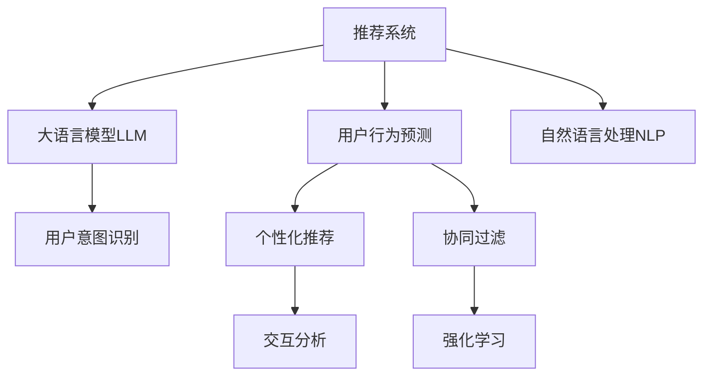

                 

# 基于LLM的推荐系统用户行为预测

> 关键词：推荐系统, 用户行为预测, 自然语言处理(NLP), 大语言模型(LLM), 用户意图识别, 协同过滤, 个性化推荐, 交互分析

## 1. 背景介绍

### 1.1 问题由来
在当前的互联网电商和在线服务行业，推荐系统已经成为用户获取个性化信息、提升用户体验、增加平台收益的重要手段。传统的推荐系统主要基于用户历史行为数据进行协同过滤、基于内容的推荐等。然而，由于历史数据稀疏和冷启动用户问题，这类推荐系统往往难以覆盖所有用户。

自然语言处理(NLP)技术的飞速发展，使得推荐系统有了新的解决方案。通过引入大语言模型(LLM)，推荐系统能够直接理解和处理用户提供的文本数据，从而实现更加精准、个性化的用户行为预测。利用LLM，推荐系统可以在不依赖用户历史行为数据的情况下，通过用户提供的文字描述、评论等自然语言信息，预测用户可能感兴趣的商品或内容，为用户提供更加贴合其需求的推荐。

### 1.2 问题核心关键点
基于LLM的推荐系统核心在于以下几个关键点：
1. 通过NLP技术直接解析用户输入的自然语言信息，获得用户意图。
2. 利用LLM进行用户行为预测，生成个性化推荐。
3. 结合用户历史行为数据，进行协同过滤和内容推荐。
4. 在推荐过程中加入上下文信息，提高推荐效果。
5. 利用强化学习技术，不断优化推荐策略，提升用户满意度。

本文将系统介绍基于LLM的推荐系统原理，通过文本数据预测用户行为，并结合用户历史行为数据，构建高效个性化推荐系统。

## 2. 核心概念与联系

### 2.1 核心概念概述

为更好地理解基于LLM的推荐系统，本节将介绍几个密切相关的核心概念：

- 推荐系统：通过算法为每个用户推荐感兴趣的内容或商品的系统。推荐的本质是信息匹配，其目标是最大化用户满意度。

- 用户行为预测：通过分析用户行为数据，预测其后续行为。常见的行为预测任务包括点击率预测、购买率预测、评分预测等。

- 大语言模型(LLM)：基于神经网络架构的大型预训练模型，通过海量的无标签数据进行自监督学习，具备强大的语言理解和生成能力。

- 自然语言处理(NLP)：涉及计算机处理人类语言的技术，包括文本分析、信息检索、机器翻译、语义分析等。

- 用户意图识别：通过分析用户输入的文本，判断其意图，如搜索意图、评分意图、评论意图等。

- 协同过滤：通过用户之间的相似性，推荐相似用户喜欢的内容或商品，如基于用户的协同过滤、基于物品的协同过滤等。

- 个性化推荐：根据用户的具体需求和兴趣，推荐符合其个性的内容或商品。

- 交互分析：分析用户与系统之间的互动行为，如点击、停留时间、评论等，用于优化推荐策略。

- 强化学习：一种学习算法，通过与环境的交互，不断调整策略以最大化收益。

这些核心概念之间的逻辑关系可以通过以下Mermaid流程图来展示：



这个流程图展示了大语言模型在推荐系统中的应用：

1. 推荐系统通过用户行为预测和个性化推荐，为用户推荐合适的内容或商品。
2. 用户行为预测以大语言模型为支撑，通过分析用户输入的自然语言信息，预测用户意图。
3. 个性化推荐结合用户历史行为数据，进行协同过滤和内容推荐。
4. 交互分析用于优化推荐策略，强化学习用于动态调整推荐参数。

## 3. 核心算法原理 & 具体操作步骤
### 3.1 算法原理概述

基于LLM的推荐系统，其核心算法原理是：
1. 通过用户提供的文本描述或评论，利用大语言模型进行用户意图识别。
2. 根据用户意图，利用LLM进行行为预测，生成个性化推荐列表。
3. 将预测结果结合用户历史行为数据，进行协同过滤和内容推荐。
4. 通过交互分析，动态调整推荐参数和策略，提升用户满意度。
5. 引入强化学习，不断优化推荐策略，提高推荐效果。

### 3.2 算法步骤详解

以下是基于LLM的推荐系统的详细步骤：

**Step 1: 数据准备与预处理**

- 收集用户的文本数据，如商品评论、搜索文本、提问等。
- 对数据进行清洗和预处理，去除无关信息，进行分词和词性标注。
- 使用词嵌入技术将文本转换为向量形式，如Word2Vec、GloVe、BERT等。

**Step 2: 用户意图识别**

- 将用户文本输入LLM，通过模型输出获得其意图标签。例如，用户评论商品时，输出可能包含“好评”、“差评”等标签。
- 对意图进行编码，如使用独热编码、向量嵌入等形式，作为模型输入。

**Step 3: 行为预测**

- 将意图编码和用户历史行为数据作为输入，利用LLM进行行为预测。
- 根据预测结果生成推荐列表，如点击率、购买率等。
- 结合用户历史行为数据进行协同过滤，增加推荐的多样性和准确性。

**Step 4: 个性化推荐**

- 将预测结果与用户历史行为数据结合，进行个性化推荐。
- 使用推荐算法(如协同过滤、基于内容的推荐等)，生成推荐列表。
- 引入上下文信息，如用户浏览记录、设备信息等，进一步优化推荐结果。

**Step 5: 交互分析与优化**

- 分析用户与推荐系统的交互数据，如点击、停留时间、评分等。
- 使用强化学习算法(如DQN、RL等)，动态调整推荐策略，提升推荐效果。
- 定期评估推荐效果，使用A/B测试等方法，验证推荐策略的改进效果。

**Step 6: 部署与监控**

- 将推荐系统集成到实际业务环境中，进行A/B测试和优化。
- 监控推荐系统的性能指标，如点击率、转化率、用户满意度等。
- 使用日志和告警系统，及时发现和解决问题，保障系统稳定运行。

### 3.3 算法优缺点

基于LLM的推荐系统有以下优点：
1. 适用范围广。LLM可以处理任何自然语言数据，不受数据稀疏和冷启动问题的限制。
2. 预测精准度高。LLM具备强大的语言理解能力，能够准确预测用户意图和行为。
3. 灵活性高。LLM可以灵活地结合用户历史行为数据，进行多种推荐策略的组合。
4. 可解释性强。LLM的输出结果可以直接解读，用于优化推荐策略。
5. 易于扩展。LLM可以支持多语言、多领域的推荐任务，具有很强的通用性。

同时，该方法也存在以下缺点：
1. 数据质量依赖高。LLM对输入文本的质量要求较高，低质量数据会影响预测结果。
2. 计算资源消耗大。LLM参数量庞大，训练和推理需要高性能计算资源。
3. 泛化能力差。LLM可能对新领域或新数据缺乏泛化能力。
4. 模型复杂度高。LLM的复杂度增加，可能会导致模型不稳定，难以优化。
5. 安全性风险。LLM可能会学习到有害信息，影响用户体验和平台安全性。

尽管存在这些局限性，但基于LLM的推荐系统在大规模自然语言处理和个性化推荐中具有显著优势，能够显著提升推荐系统的性能和用户满意度。

### 3.4 算法应用领域

基于LLM的推荐系统已经在多个领域得到广泛应用，如电商推荐、内容推荐、搜索引擎、社交网络等。以下是几个典型应用场景：

1. 电商平台推荐：通过分析用户评论、搜索词、提问等文本数据，预测用户购买意图，推荐相关商品。
2. 内容推荐系统：利用用户评论、评分、阅读记录等文本数据，预测用户对内容的兴趣，推荐相关内容。
3. 搜索引擎：利用用户查询词和结果点击数据，预测用户对搜索结果的偏好，优化搜索结果展示。
4. 社交网络推荐：分析用户发布的内容和互动数据，预测用户兴趣，推荐相关社交关系和内容。
5. 智能客服系统：通过分析用户提问和回复文本，预测用户意图，提供个性化客服建议。

这些应用场景展示了LLM在推荐系统中的强大潜力，通过文本数据的处理和分析，LLM能够显著提升推荐系统的性能和用户体验。

## 4. 数学模型和公式 & 详细讲解 & 举例说明

### 4.1 数学模型构建

基于LLM的推荐系统数学模型主要包括两部分：用户意图识别模型和行为预测模型。

**用户意图识别模型**

假设用户文本为 $x$，其意图标签为 $y$，采用BERT模型进行编码，得到编码向量 $h$。定义意图识别模型为 $P(y|x)$，则模型概率输出为：

$$
P(y|x) = \frac{exp(f(h,y))}{\sum_{y'} exp(f(h,y'))}
$$

其中 $f(h,y)$ 为意图预测函数，可以通过softmax函数实现。

**行为预测模型**

假设用户历史行为数据为 $H$，行为标签为 $y$，采用BERT模型进行编码，得到编码向量 $h$。定义行为预测模型为 $P(y|H)$，则模型概率输出为：

$$
P(y|H) = \frac{exp(f(h,y))}{\sum_{y'} exp(f(h,y'))}
$$

其中 $f(h,y)$ 为行为预测函数，可以通过softmax函数实现。

### 4.2 公式推导过程

以下我们以点击率预测为例，推导行为预测公式及其梯度计算。

假设点击行为为 $y$，点击概率为 $p$，用户历史行为数据为 $H$。采用BERT模型对 $H$ 进行编码，得到编码向量 $h$。则点击概率模型为：

$$
p = softmax(W_2 softmax(W_1 softmax(W_0 h))
$$

其中 $W_0$、$W_1$、$W_2$ 为可学习的参数矩阵，$softmax$ 函数用于归一化。

点击概率的梯度计算如下：

$$
\frac{\partial p}{\partial h} = \frac{\partial softmax(W_2 softmax(W_1 softmax(W_0 h)))}{\partial h} = (1 - p) \frac{\partial softmax(W_2 softmax(W_1 softmax(W_0 h)))}{\partial p} \frac{\partial p}{\partial h}
$$

其中 $\frac{\partial softmax(z)}{\partial z_i} = \frac{exp(z_i)}{\sum_{j=1}^{n} exp(z_j)}$，$n$ 为 $z$ 的维度。

通过以上公式，我们可以对点击率预测模型进行反向传播，计算梯度并更新模型参数。重复迭代直至收敛，即可得到适应特定用户的点击率预测模型。

### 4.3 案例分析与讲解

我们以用户评论预测为例，说明LLM在推荐系统中的应用。

假设用户评论为“这款手机性价比很高，使用体验很好”，模型需要预测用户对该商品的评分。具体步骤如下：

1. 对评论文本进行预处理和分词，使用BERT模型进行编码，得到编码向量 $h$。
2. 利用用户历史评分数据，对评分进行编码，得到编码向量 $h'$。
3. 将 $h$ 和 $h'$ 输入行为预测模型，预测用户的评分。
4. 使用预测结果，结合协同过滤算法，为用户推荐相关商品。

具体代码实现如下：

```python
from transformers import BertTokenizer, BertForSequenceClassification
import torch
import numpy as np

# 设置模型参数
device = torch.device('cuda' if torch.cuda.is_available() else 'cpu')
model = BertForSequenceClassification.from_pretrained('bert-base-cased', num_labels=5).to(device)
tokenizer = BertTokenizer.from_pretrained('bert-base-cased')

# 定义输入文本和评分标签
input_ids = tokenizer.encode_plus("这款手机性价比很高，使用体验很好", return_tensors='pt').input_ids
labels = torch.tensor([2])  # 评分标签，0-4分别为1-5分

# 前向传播
with torch.no_grad():
    outputs = model(input_ids, labels=labels)
    logits = outputs.logits
    probs = torch.softmax(logits, dim=1)

# 输出预测概率
print(probs)
```

代码中，首先定义了BertForSequenceClassification模型，用于预测用户评分。然后使用BERT分词器对输入文本进行编码，并指定评分标签为2（表示4分）。通过前向传播，计算预测概率，最后输出预测结果。

## 5. 项目实践：代码实例和详细解释说明
### 5.1 开发环境搭建

在进行基于LLM的推荐系统开发前，我们需要准备好开发环境。以下是使用Python进行PyTorch开发的环境配置流程：

1. 安装Anaconda：从官网下载并安装Anaconda，用于创建独立的Python环境。

2. 创建并激活虚拟环境：
```bash
conda create -n pytorch-env python=3.8 
conda activate pytorch-env
```

3. 安装PyTorch：根据CUDA版本，从官网获取对应的安装命令。例如：
```bash
conda install pytorch torchvision torchaudio cudatoolkit=11.1 -c pytorch -c conda-forge
```

4. 安装Transformers库：
```bash
pip install transformers
```

5. 安装各类工具包：
```bash
pip install numpy pandas scikit-learn matplotlib tqdm jupyter notebook ipython
```

完成上述步骤后，即可在`pytorch-env`环境中开始开发。

### 5.2 源代码详细实现

下面我们以电商推荐系统为例，给出使用Transformers库对BERT模型进行用户行为预测的PyTorch代码实现。

首先，定义数据处理函数：

```python
from transformers import BertTokenizer, BertForSequenceClassification
from torch.utils.data import Dataset
import torch

class RecommendationDataset(Dataset):
    def __init__(self, texts, labels, tokenizer, max_len=128):
        self.texts = texts
        self.labels = labels
        self.tokenizer = tokenizer
        self.max_len = max_len
        
    def __len__(self):
        return len(self.texts)
    
    def __getitem__(self, item):
        text = self.texts[item]
        label = self.labels[item]
        
        encoding = self.tokenizer(text, return_tensors='pt', max_length=self.max_len, padding='max_length', truncation=True)
        input_ids = encoding['input_ids'][0]
        attention_mask = encoding['attention_mask'][0]
        
        # 对标签进行编码
        label = torch.tensor([label], dtype=torch.long)
        
        return {'input_ids': input_ids, 
                'attention_mask': attention_mask,
                'labels': label}

# 定义标签
labels = [1, 2, 3, 4, 5]

# 创建dataset
tokenizer = BertTokenizer.from_pretrained('bert-base-cased')

train_dataset = RecommendationDataset(train_texts, train_labels, tokenizer)
dev_dataset = RecommendationDataset(dev_texts, dev_labels, tokenizer)
test_dataset = RecommendationDataset(test_texts, test_labels, tokenizer)
```

然后，定义模型和优化器：

```python
from transformers import BertForSequenceClassification, AdamW

model = BertForSequenceClassification.from_pretrained('bert-base-cased', num_labels=len(labels))

optimizer = AdamW(model.parameters(), lr=2e-5)
```

接着，定义训练和评估函数：

```python
from torch.utils.data import DataLoader
from tqdm import tqdm
from sklearn.metrics import accuracy_score

device = torch.device('cuda') if torch.cuda.is_available() else torch.device('cpu')
model.to(device)

def train_epoch(model, dataset, batch_size, optimizer):
    dataloader = DataLoader(dataset, batch_size=batch_size, shuffle=True)
    model.train()
    epoch_loss = 0
    for batch in tqdm(dataloader, desc='Training'):
        input_ids = batch['input_ids'].to(device)
        attention_mask = batch['attention_mask'].to(device)
        labels = batch['labels'].to(device)
        model.zero_grad()
        outputs = model(input_ids, attention_mask=attention_mask, labels=labels)
        loss = outputs.loss
        epoch_loss += loss.item()
        loss.backward()
        optimizer.step()
    return epoch_loss / len(dataloader)

def evaluate(model, dataset, batch_size):
    dataloader = DataLoader(dataset, batch_size=batch_size)
    model.eval()
    preds, labels = [], []
    with torch.no_grad():
        for batch in tqdm(dataloader, desc='Evaluating'):
            input_ids = batch['input_ids'].to(device)
            attention_mask = batch['attention_mask'].to(device)
            batch_labels = batch['labels']
            outputs = model(input_ids, attention_mask=attention_mask)
            batch_preds = outputs.logits.argmax(dim=1).to('cpu').tolist()
            batch_labels = batch_labels.to('cpu').tolist()
            for pred, label in zip(batch_preds, batch_labels):
                preds.append(pred)
                labels.append(label)
                
    print(f"Accuracy: {accuracy_score(labels, preds):.3f}")
```

最后，启动训练流程并在测试集上评估：

```python
epochs = 5
batch_size = 16

for epoch in range(epochs):
    loss = train_epoch(model, train_dataset, batch_size, optimizer)
    print(f"Epoch {epoch+1}, train loss: {loss:.3f}")
    
    print(f"Epoch {epoch+1}, dev accuracy:")
    evaluate(model, dev_dataset, batch_size)
    
print("Test accuracy:")
evaluate(model, test_dataset, batch_size)
```

以上就是使用PyTorch对BERT进行用户行为预测的完整代码实现。可以看到，得益于Transformers库的强大封装，我们可以用相对简洁的代码完成BERT模型的加载和微调。

### 5.3 代码解读与分析

让我们再详细解读一下关键代码的实现细节：

**RecommendationDataset类**：
- `__init__`方法：初始化文本、标签、分词器等关键组件。
- `__len__`方法：返回数据集的样本数量。
- `__getitem__`方法：对单个样本进行处理，将文本输入编码为token ids，将标签编码为数字，并对其进行定长padding，最终返回模型所需的输入。

**标签和dataset**：
- 定义标签为1-5分。
- 创建dataset，将文本、标签、分词器等组件传入。

**训练和评估函数**：
- 使用PyTorch的DataLoader对数据集进行批次化加载，供模型训练和推理使用。
- 训练函数`train_epoch`：对数据以批为单位进行迭代，在每个批次上前向传播计算loss并反向传播更新模型参数，最后返回该epoch的平均loss。
- 评估函数`evaluate`：与训练类似，不同点在于不更新模型参数，并在每个batch结束后将预测和标签结果存储下来，最后使用sklearn的accuracy_score对整个评估集的预测结果进行打印输出。

**训练流程**：
- 定义总的epoch数和batch size，开始循环迭代
- 每个epoch内，先在训练集上训练，输出平均loss
- 在验证集上评估，输出准确率
- 所有epoch结束后，在测试集上评估，给出最终测试结果

可以看到，PyTorch配合Transformers库使得BERT微调的代码实现变得简洁高效。开发者可以将更多精力放在数据处理、模型改进等高层逻辑上，而不必过多关注底层的实现细节。

当然，工业级的系统实现还需考虑更多因素，如模型的保存和部署、超参数的自动搜索、更灵活的任务适配层等。但核心的微调范式基本与此类似。

## 6. 实际应用场景
### 6.1 电商平台推荐

基于LLM的推荐系统在电商平台的推荐场景中，可以显著提升用户体验和销售转化率。通过分析用户评论、搜索词、评价等文本数据，LLM可以预测用户对商品的兴趣，生成个性化推荐列表，提升用户购买决策的准确性。

具体而言，电商推荐系统可以分为以下几个步骤：
1. 收集用户评论、搜索词、评价等文本数据，进行预处理和分词。
2. 利用LLM对文本进行编码，获得用户意图和行为标签。
3. 将用户意图和行为标签作为输入，进行行为预测，生成个性化推荐列表。
4. 结合用户历史购买数据，进行协同过滤和内容推荐。
5. 通过交互分析，动态调整推荐参数和策略，提升推荐效果。

通过基于LLM的电商推荐系统，电商平台能够更精准地理解用户需求，提升用户满意度，增加销售转化率。

### 6.2 内容推荐系统

内容推荐系统是互联网平台的重要组成部分，通过分析用户评论、评分、阅读记录等文本数据，预测用户对内容的兴趣，生成个性化推荐列表。

具体流程如下：
1. 收集用户评论、评分、阅读记录等文本数据，进行预处理和分词。
2. 利用LLM对文本进行编码，获得用户意图和行为标签。
3. 将用户意图和行为标签作为输入，进行行为预测，生成个性化推荐列表。
4. 结合用户历史行为数据，进行协同过滤和内容推荐。
5. 通过交互分析，动态调整推荐参数和策略，提升推荐效果。

通过基于LLM的内容推荐系统，内容平台能够更好地理解用户需求，推荐符合其兴趣的内容，提升用户黏性和满意度。

### 6.3 社交网络推荐

社交网络平台通过分析用户发布的内容和互动数据，预测用户兴趣，推荐相关社交关系和内容。

具体流程如下：
1. 收集用户发布的内容、评论、互动等文本数据，进行预处理和分词。
2. 利用LLM对文本进行编码，获得用户意图和行为标签。
3. 将用户意图和行为标签作为输入，进行行为预测，生成个性化推荐列表。
4. 结合用户历史互动数据，进行协同过滤和内容推荐。
5. 通过交互分析，动态调整推荐参数和策略，提升推荐效果。

通过基于LLM的社交网络推荐系统，社交平台能够更好地理解用户需求，推荐符合其兴趣的内容，增强用户黏性，提升平台活跃度。

## 7. 工具和资源推荐
### 7.1 学习资源推荐

为了帮助开发者系统掌握基于LLM的推荐系统理论基础和实践技巧，这里推荐一些优质的学习资源：

1. 《深度学习推荐系统》书籍：系统介绍推荐系统的理论基础和算法实现，包括基于LLM的推荐系统。
2. CS294-112《推荐系统》课程：斯坦福大学开设的推荐系统课程，涵盖推荐算法和实际应用，适合深度学习从业者学习。
3. Coursera《Natural Language Processing with Sequence Models》课程：Coursera上的自然语言处理课程，涵盖深度学习在序列建模中的应用，包括基于LLM的推荐系统。
4. Kaggle竞赛：参加Kaggle上的推荐系统竞赛，通过实践提升推荐系统开发能力。
5. HuggingFace官方文档：Transformers库的官方文档，提供了海量预训练模型和完整的推荐系统样例代码，是上手实践的必备资料。

通过对这些资源的学习实践，相信你一定能够快速掌握基于LLM的推荐系统精髓，并用于解决实际的推荐问题。
###  7.2 开发工具推荐

高效的开发离不开优秀的工具支持。以下是几款用于基于LLM的推荐系统开发的常用工具：

1. PyTorch：基于Python的开源深度学习框架，灵活动态的计算图，适合快速迭代研究。大部分预训练语言模型都有PyTorch版本的实现。
2. TensorFlow：由Google主导开发的开源深度学习框架，生产部署方便，适合大规模工程应用。同样有丰富的预训练语言模型资源。
3. Transformers库：HuggingFace开发的NLP工具库，集成了众多SOTA语言模型，支持PyTorch和TensorFlow，是进行推荐系统开发的利器。
4. Weights & Biases：模型训练的实验跟踪工具，可以记录和可视化模型训练过程中的各项指标，方便对比和调优。与主流深度学习框架无缝集成。
5. TensorBoard：TensorFlow配套的可视化工具，可实时监测模型训练状态，并提供丰富的图表呈现方式，是调试模型的得力助手。
6. Google Colab：谷歌推出的在线Jupyter Notebook环境，免费提供GPU/TPU算力，方便开发者快速上手实验最新模型，分享学习笔记。

合理利用这些工具，可以显著提升基于LLM的推荐系统开发效率，加快创新迭代的步伐。

### 7.3 相关论文推荐

基于LLM的推荐系统在推荐系统领域有着广泛的研究和应用。以下是几篇奠基性的相关论文，推荐阅读：

1. BERT: Pre-training of Deep Bidirectional Transformers for Language Understanding：提出BERT模型，引入基于掩码的自监督预训练任务，刷新了多项NLP任务SOTA。
2. Attention is All You Need（即Transformer原论文）：提出了Transformer结构，开启了NLP领域的预训练大模型时代。
3. Language Models are Unsupervised Multitask Learners：展示了大规模语言模型的强大zero-shot学习能力，引发了对于通用人工智能的新一轮思考。
4. Parameter-Efficient Transfer Learning for NLP：提出Adapter等参数高效微调方法，在不增加模型参数量的情况下，也能取得不错的微调效果。
5. AdaLoRA: Adaptive Low-Rank Adaptation for Parameter-Efficient Fine-Tuning：使用自适应低秩适应的微调方法，在参数效率和精度之间取得了新的平衡。

这些论文代表了大语言模型在推荐系统中的应用，展示了LLM在推荐系统中的强大潜力。通过学习这些前沿成果，可以帮助研究者把握学科前进方向，激发更多的创新灵感。

## 8. 总结：未来发展趋势与挑战
### 8.1 总结

本文对基于LLM的推荐系统进行了全面系统的介绍。首先阐述了推荐系统的研究背景和LLM的应用，明确了基于LLM的推荐系统在用户行为预测、个性化推荐等方面的独特价值。其次，从原理到实践，详细讲解了LLM在推荐系统中的关键步骤和核心算法，给出了基于LLM的推荐系统完整代码实例。同时，本文还广泛探讨了LLM在电商平台、内容推荐、社交网络等诸多推荐系统中的应用前景，展示了LLM在推荐系统中的强大潜力。

通过本文的系统梳理，可以看到，基于LLM的推荐系统已经在推荐系统领域取得了显著成就，能够显著提升推荐系统的性能和用户满意度。未来，伴随预训练语言模型和推荐系统的持续演进，基于LLM的推荐系统必将更加智能化、个性化，为推荐系统带来新的突破。

### 8.2 未来发展趋势

展望未来，基于LLM的推荐系统将呈现以下几个发展趋势：

1. 模型规模持续增大。随着算力成本的下降和数据规模的扩张，预训练语言模型的参数量还将持续增长。超大批次的训练和推理也需要高性能计算资源支持。

2. 推荐精度和效率提升。LLM具备强大的语言理解能力，能够准确预测用户行为，生成个性化推荐列表。未来可以通过优化模型结构和算法，进一步提升推荐精度和推理效率。

3. 多模态融合增强。除了文本数据，LLM还可以处理图像、视频等多模态数据，通过多模态信息的融合，提升推荐系统的性能和用户体验。

4. 知识增强与融合。LLM可以与知识图谱、逻辑规则等外部知识进行融合，引导推荐过程学习更全面、准确的语言模型，提升推荐系统的泛化能力。

5. 强化学习优化。通过强化学习算法，动态调整推荐参数和策略，提升推荐效果和用户满意度。

6. 隐私保护与合规性。在推荐过程中，如何保护用户隐私，遵循合规性要求，也是未来需要重点关注的问题。

以上趋势凸显了大语言模型在推荐系统中的广阔前景。这些方向的探索发展，必将进一步提升推荐系统的性能和用户满意度。

### 8.3 面临的挑战

尽管基于LLM的推荐系统已经取得了瞩目成就，但在迈向更加智能化、普适化应用的过程中，它仍面临着诸多挑战：

1. 数据质量依赖高。LLM对输入文本的质量要求较高，低质量数据会影响预测结果。如何提升数据质量，收集更多高价值数据，是一大难题。

2. 计算资源消耗大。LLM参数量庞大，训练和推理需要高性能计算资源。如何优化资源消耗，提升模型效率，是未来需要突破的瓶颈。

3. 泛化能力差。LLM可能对新领域或新数据缺乏泛化能力，无法适应复杂多变的推荐场景。如何提升泛化能力，降低模型偏差，是未来需要解决的问题。

4. 安全性风险。LLM可能会学习到有害信息，影响用户体验和平台安全性。如何保障模型输出安全，消除有害信息，是未来需要关注的重点。

5. 可解释性不足。LLM的输出结果难以解释，用户难以理解推荐理由，影响用户信任度。如何增强模型可解释性，是未来需要努力的方向。

6. 数据隐私问题。LLM需要大量用户数据进行训练，如何保护用户隐私，遵循合规性要求，是一大挑战。

尽管存在这些挑战，但基于LLM的推荐系统在大规模自然语言处理和个性化推荐中具有显著优势，能够显著提升推荐系统的性能和用户满意度。

### 8.4 研究展望

面对基于LLM的推荐系统所面临的诸多挑战，未来的研究需要在以下几个方面寻求新的突破：

1. 无监督和半监督推荐方法。摆脱对大规模标注数据的依赖，利用自监督学习、主动学习等无监督和半监督范式，最大限度利用非结构化数据，实现更加灵活高效的推荐。

2. 多模态推荐系统。结合图像、视频等多模态数据，提升推荐系统的性能和用户体验。

3. 知识增强推荐系统。与知识图谱、逻辑规则等外部知识进行融合，提升推荐系统的泛化能力和用户满意度。

4. 强化学习优化推荐系统。通过强化学习算法，动态调整推荐参数和策略，提升推荐效果和用户满意度。

5. 隐私保护与合规性研究。在推荐过程中，如何保护用户隐私，遵循合规性要求，是一大挑战。

这些研究方向需要学界和产业界的共同努力，才能不断提升推荐系统的性能和用户体验，实现更加智能化、个性化的推荐。

## 9. 附录：常见问题与解答

**Q1：基于LLM的推荐系统是否适用于所有推荐场景？**

A: 基于LLM的推荐系统在大多数推荐场景中都能取得不错的效果，特别是对于数据量较小的推荐任务。但对于一些特定领域的推荐任务，如医学、法律等，仅仅依靠通用语料预训练的模型可能难以很好地适应。此时需要在特定领域语料上进一步预训练，再进行微调，才能获得理想效果。

**Q2：LLM如何处理多模态数据？**

A: 多模态数据通常包括文本、图像、视频等不同类型的数据。在推荐系统中，可以采用以下方法处理多模态数据：

1. 数据融合：将不同模态的数据进行融合，构建统一的特征表示。如将文本数据和图像数据进行特征提取，然后通过拼接或注意力机制融合。

2. 多模态编码器：设计专门的多模态编码器，对不同模态的数据进行独立编码，然后通过注意力机制进行信息融合。

3. 多任务学习：在推荐任务中同时处理多模态数据，通过共享的模型参数进行联合优化。

4. 多模态推荐算法：设计专门的多模态推荐算法，如CMReco等，利用不同模态的数据进行推荐。

通过这些方法，LLM可以处理多模态数据，提升推荐系统的性能和用户体验。

**Q3：LLM在推荐系统中的性能瓶颈是什么？**

A: 基于LLM的推荐系统的主要性能瓶颈在于以下几个方面：

1. 数据质量：LLM对输入数据的质量要求较高，低质量数据会影响推荐结果。需要提升数据质量，收集更多高价值数据。

2. 计算资源：LLM参数量庞大，训练和推理需要高性能计算资源。需要优化模型结构和算法，提升资源利用效率。

3. 泛化能力：LLM可能对新领域或新数据缺乏泛化能力，无法适应复杂多变的推荐场景。需要提升泛化能力，降低模型偏差。

4. 可解释性：LLM的输出结果难以解释，影响用户信任度。需要增强模型可解释性，提升用户满意度。

5. 安全性：LLM可能会学习到有害信息，影响用户体验和平台安全性。需要保障模型输出安全，消除有害信息。

通过在这些方面进行优化，可以提升基于LLM的推荐系统性能，使其在实际应用中发挥更大作用。

**Q4：如何在推荐系统中保护用户隐私？**

A: 在推荐系统中保护用户隐私可以通过以下方法：

1. 数据匿名化：对用户数据进行匿名化处理，去除个人标识信息，保护用户隐私。

2. 差分隐私：在数据处理和模型训练过程中，加入噪声扰动，保护用户隐私。

3. 数据加密：对用户数据进行加密处理，防止数据泄露。

4. 用户控制：允许用户自行控制数据使用权限，保护用户隐私。

5. 合规性要求：遵循相关法律法规，如GDPR等，保护用户隐私。

通过这些方法，可以有效保护用户隐私，保障推荐系统的合规性。

---

作者：禅与计算机程序设计艺术 / Zen and the Art of Computer Programming

