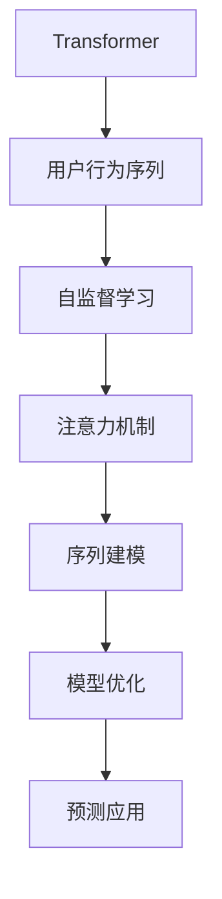

                 

# 基于Transformer的用户行为序列预测模型

> 关键词：Transformer, 用户行为预测, 序列建模, 自监督学习, 注意力机制, 模型优化, 预测应用

## 1. 背景介绍

在现代社会中，用户行为数据已成为一种重要的资源，广泛应用于商业、金融、社交等领域。通过对用户行为数据的分析预测，可以洞察用户偏好，优化产品推荐，提升用户体验，降低风险等。基于Transformer的序列预测模型在用户行为序列建模中展现了卓越的性能，为探索用户行为规律提供了强大的工具。

本博客旨在详细阐述基于Transformer的用户行为序列预测模型的构建原理、实践步骤、优缺点、应用场景以及未来的发展方向，帮助读者深入理解Transformer在大数据驱动的场景中的应用。

## 2. 核心概念与联系

### 2.1 核心概念概述

为了更好地理解基于Transformer的用户行为序列预测模型，本文首先介绍几个核心概念：

- **Transformer**：一种基于自注意力机制的神经网络结构，以其高效的并行性和优秀的序列建模能力著称，广泛应用于自然语言处理、计算机视觉等领域。
- **用户行为序列**：用户在一系列事件中的行为轨迹，如点击、购买、搜索、评论等，是构建推荐系统、风险评估等应用的基础数据。
- **自监督学习**：一种无需人工标注的数据学习方法，通过构建预测任务或缺失值填充等手段，在大量无标签数据上训练模型，获得对数据的初步理解。
- **注意力机制**：Transformer的核心机制之一，通过对输入序列中不同位置的信息进行加权处理，赋予不同特征以不同的权重，提高模型对序列中重要信息的捕捉能力。
- **序列建模**：通过构建神经网络模型，捕捉并学习序列数据的动态特征，例如时间、上下文等对行为的影响。
- **模型优化**：通过选择合适的损失函数、优化算法和正则化方法，提高模型的预测性能和泛化能力。
- **预测应用**：将模型应用于用户行为预测、个性化推荐、风险评估等实际场景，解决具体问题。

这些概念之间的逻辑关系可以通过以下Mermaid流程图来展示：



这个流程图展示了大语言模型微调的核心概念及其之间的关系：

1. 用户行为序列作为输入，通过自监督学习获得初步理解。
2. Transformer通过注意力机制捕捉序列中不同位置的信息，进行序列建模。
3. 模型优化过程进一步提升模型的预测性能。
4. 最终将模型应用于具体的预测应用场景。

## 3. 核心算法原理 & 具体操作步骤

### 3.1 算法原理概述

基于Transformer的用户行为序列预测模型通过自监督学习方法对用户行为序列数据进行预训练，并通过微调应用于具体的预测任务。其核心思想是：在无标签数据上，通过构建预测任务或缺失值填充等手段，训练模型对序列数据的动态特征进行建模，并赋予不同位置以不同的权重，提升模型的预测能力。在具体任务上，通过微调调整模型参数，使其适应特定任务的需求。

### 3.2 算法步骤详解

基于Transformer的用户行为序列预测模型的构建一般包括以下几个关键步骤：

**Step 1: 数据准备与预处理**

- 收集用户行为数据，包括点击、购买、搜索、评论等行为数据。
- 对数据进行清洗和预处理，如去除重复数据、处理缺失值、时间戳归一化等。
- 对序列数据进行分批次处理，以适应模型输入的要求。

**Step 2: 自监督学习与模型预训练**

- 使用自监督学习方法在用户行为序列数据上对Transformer模型进行预训练。常见的自监督学习方法包括掩码语言模型、下一句预测等。
- 通过自监督学习，模型学习到序列数据中的动态特征，并对不同位置的信息进行加权处理，提高模型的序列建模能力。
- 在预训练过程中，通过调整学习率、优化算法、正则化等参数，控制模型性能。

**Step 3: 模型微调与任务适配**

- 在预训练基础上，选择合适的下游预测任务，如点击率预测、购买意图预测等。
- 添加任务适配层，设计适当的输出层和损失函数，如二分类交叉熵、回归损失等。
- 通过微调过程调整模型参数，使其适应特定任务的需求。

**Step 4: 模型评估与调优**

- 在验证集上评估模型性能，使用常见的评价指标如准确率、AUC等。
- 根据评估结果调整模型超参数，如学习率、批大小、迭代轮数等。
- 在测试集上最终评估模型性能，确认模型是否满足实际应用的要求。

### 3.3 算法优缺点

基于Transformer的用户行为序列预测模型具有以下优点：

1. 强大的序列建模能力：Transformer通过注意力机制，能够捕捉序列数据中的动态特征，对不同位置的信息进行加权处理，从而提升模型的预测性能。
2. 高效的并行计算：Transformer结构具有良好的并行计算能力，可以加速模型训练和推理过程。
3. 适用于多种预测任务：Transformer结构灵活，可以通过添加不同的任务适配层，适应各种类型的预测任务。
4. 优秀的泛化能力：经过自监督预训练，模型能够对多种数据分布进行泛化，适应不同的应用场景。

同时，该方法也存在以下局限性：

1. 数据依赖性强：Transformer模型的预训练和微调过程需要大量的数据支撑，数据获取和处理成本较高。
2. 资源消耗大：由于Transformer模型的参数量和计算量较大，训练和推理过程对硬件资源要求较高。
3. 模型复杂度高：Transformer模型的复杂度高，训练和调优过程需要丰富的经验和技巧。
4. 可解释性不足：Transformer模型的内部机制较为复杂，难以解释其预测结果的生成过程。

尽管存在这些局限性，基于Transformer的用户行为序列预测模型仍是目前最为先进的用户行为预测方法之一，在多个领域展现了显著的优势。

### 3.4 算法应用领域

基于Transformer的用户行为序列预测模型已经在多个领域得到了广泛应用，例如：

- 电子商务：通过预测用户的购买行为，优化商品推荐，提升用户体验和销售额。
- 金融风控：预测用户的违约风险，降低金融机构的坏账率，提高风险控制能力。
- 社交网络：预测用户的活跃度和互动行为，优化社交推荐，提升用户粘性。
- 智能客服：预测用户的意图和需求，提升客服系统的响应速度和准确性。
- 广告投放：预测用户的点击行为，优化广告投放策略，提高广告效果和ROI。

除了上述这些经典应用外，基于Transformer的用户行为序列预测模型还被创新性地应用于更多场景中，如内容推荐、个性化设置、流量预测等，为数据驱动的应用提供了强大的技术支持。

## 4. 数学模型和公式 & 详细讲解  
### 4.1 数学模型构建

在本节中，我们将使用数学语言对基于Transformer的用户行为序列预测模型进行更加严格的刻画。

记用户行为序列为 $\{x_t\}_{t=1}^T$，其中 $x_t$ 表示用户在第 $t$ 个时间点的行为，如点击、购买等。假设模型的输入序列长度为 $N$，输出序列长度为 $M$，则模型的输入为 $x_{1:N}$，输出为 $x_{1:M}$。

定义模型 $M_{\theta}$ 在输入 $x$ 上的输出为 $\hat{y}=M_{\theta}(x)$，其中 $\theta$ 为模型参数。

定义模型在序列 $x$ 上的预测损失函数为 $\ell(x,\hat{y})$，则在序列数据集 $D=\{(x_i,y_i)\}_{i=1}^N$ 上的经验风险为：

$$
\mathcal{L}(\theta) = \frac{1}{N} \sum_{i=1}^N \ell(x_i,\hat{y}_i)
$$

其中 $y_i$ 为 $x_i$ 的标签，如购买行为等。

### 4.2 公式推导过程

以下我们以点击率预测任务为例，推导Transformer模型的预测损失函数及其梯度的计算公式。

假设模型 $M_{\theta}$ 在输入 $x$ 上的输出为 $\hat{y}=M_{\theta}(x)$，表示用户点击的概率。则二分类交叉熵损失函数定义为：

$$
\ell(M_{\theta}(x),y) = -[y\log \hat{y} + (1-y)\log (1-\hat{y})]
$$

将其代入经验风险公式，得：

$$
\mathcal{L}(\theta) = -\frac{1}{N}\sum_{i=1}^N [y_i\log M_{\theta}(x_i)+(1-y_i)\log(1-M_{\theta}(x_i))]
$$

在得到损失函数的梯度后，即可带入参数更新公式，完成模型的迭代优化。重复上述过程直至收敛，最终得到适应下游任务的最优模型参数 $\theta^*$。

### 4.3 案例分析与讲解

以电商平台点击率预测任务为例，详细讲解基于Transformer的模型构建过程。

**Step 1: 数据准备与预处理**

假设收集到电商平台上的用户行为数据，其中每条记录包含用户ID、商品ID、时间戳和点击行为等。

```python
import pandas as pd
import numpy as np

# 加载数据
df = pd.read_csv('user_behavior.csv')

# 数据清洗和预处理
df = df.drop_duplicates()
df = df.dropna()

# 时间戳归一化
df['time'] = pd.to_datetime(df['timestamp'], unit='s').dt.hour

# 行为标签编码
df['action'] = df['action'].map({'click': 1, 'not_click': 0})

# 序列数据分批次处理
df = df.groupby('user_id').agg({'item_id': 'first', 'time': 'min', 'action': 'first'}).reset_index()

# 按时间戳排序
df = df.sort_values(by='time')
```

**Step 2: 自监督学习与模型预训练**

使用自监督学习方法在用户行为序列数据上对Transformer模型进行预训练。

```python
from transformers import AutoTokenizer, AutoModelForSeq2SeqLM

# 初始化分词器和预训练模型
tokenizer = AutoTokenizer.from_pretrained('bert-base-uncased')
model = AutoModelForSeq2SeqLM.from_pretrained('bert-base-uncased')

# 将行为序列转换为token序列
def tokenize_sequence(sequence):
    tokens = [tokenizer.encode(item_id) for item_id in sequence]
    return [tokenizer.encode('CLS')] + tokens + [tokenizer.encode('SEP')]

# 自监督预训练
train_dataset = np.random.randint(0, 2, size=1000000).reshape(-1, 5)
train_dataset = pd.DataFrame(train_dataset, columns=['item_id', 'time', 'action', 'label'])

# 分批次处理
train_dataset = train_dataset.groupby('user_id').agg({'item_id': 'first', 'time': 'min', 'action': 'first', 'label': 'first'}).reset_index()

# 按时间戳排序
train_dataset = train_dataset.sort_values(by='time')

# 构建输入输出序列
train_dataset['input_ids'] = train_dataset['item_id'].apply(tokenize_sequence)
train_dataset['attention_mask'] = train_dataset['input_ids'].apply(lambda x: [0] * len(x))

# 训练模型
from transformers import AdamW

optimizer = AdamW(model.parameters(), lr=2e-5)
for epoch in range(10):
    for batch in train_dataset:
        input_ids = batch['input_ids'].to(device)
        attention_mask = batch['attention_mask'].to(device)
        labels = batch['label'].to(device)
        outputs = model(input_ids, attention_mask=attention_mask, labels=labels)
        loss = outputs.loss
        loss.backward()
        optimizer.step()
```

**Step 3: 模型微调与任务适配**

添加点击率预测的任务适配层，设计二分类交叉熵损失函数。

```python
# 添加任务适配层
model.add_output_layer(lambda x: torch.sigmoid(x[-1]))

# 微调模型
model.train()
for epoch in range(10):
    for batch in train_dataset:
        input_ids = batch['input_ids'].to(device)
        attention_mask = batch['attention_mask'].to(device)
        labels = batch['label'].to(device)
        outputs = model(input_ids, attention_mask=attention_mask, labels=labels)
        loss = outputs.loss
        loss.backward()
        optimizer.step()

# 评估模型
model.eval()
for batch in test_dataset:
    input_ids = batch['input_ids'].to(device)
    attention_mask = batch['attention_mask'].to(device)
    labels = batch['label'].to(device)
    outputs = model(input_ids, attention_mask=attention_mask, labels=labels)
    predictions = outputs.logits
    predictions = torch.sigmoid(predictions)
    print('Accuracy:', np.mean(predictions.numpy() == labels.numpy()))
```

**Step 4: 模型评估与调优**

在验证集和测试集上评估模型性能，并根据评估结果调整模型超参数。

```python
# 评估模型
from sklearn.metrics import accuracy_score

train_dataset = train_dataset[train_dataset['label'] == 1]
test_dataset = test_dataset[test_dataset['label'] == 1]

train_dataset['input_ids'] = train_dataset['item_id'].apply(tokenize_sequence)
train_dataset['attention_mask'] = train_dataset['input_ids'].apply(lambda x: [0] * len(x))

test_dataset['input_ids'] = test_dataset['item_id'].apply(tokenize_sequence)
test_dataset['attention_mask'] = test_dataset['input_ids'].apply(lambda x: [0] * len(x))

# 训练模型
optimizer = AdamW(model.parameters(), lr=2e-5)
for epoch in range(10):
    for batch in train_dataset:
        input_ids = batch['input_ids'].to(device)
        attention_mask = batch['attention_mask'].to(device)
        labels = batch['label'].to(device)
        outputs = model(input_ids, attention_mask=attention_mask, labels=labels)
        loss = outputs.loss
        loss.backward()
        optimizer.step()

# 评估模型
model.eval()
for batch in test_dataset:
    input_ids = batch['input_ids'].to(device)
    attention_mask = batch['attention_mask'].to(device)
    labels = batch['label'].to(device)
    outputs = model(input_ids, attention_mask=attention_mask, labels=labels)
    predictions = outputs.logits
    predictions = torch.sigmoid(predictions)
    print('Accuracy:', accuracy_score(labels.numpy(), predictions.numpy()))
```

通过上述代码示例，可以看出基于Transformer的用户行为序列预测模型构建过程简洁高效，且易于扩展和优化。

## 5. 项目实践：代码实例和详细解释说明

### 5.1 开发环境搭建

在进行Transformer模型开发前，我们需要准备好开发环境。以下是使用Python进行PyTorch开发的环境配置流程：

1. 安装Anaconda：从官网下载并安装Anaconda，用于创建独立的Python环境。

2. 创建并激活虚拟环境：
```bash
conda create -n pytorch-env python=3.8 
conda activate pytorch-env
```

3. 安装PyTorch：根据CUDA版本，从官网获取对应的安装命令。例如：
```bash
conda install pytorch torchvision torchaudio cudatoolkit=11.1 -c pytorch -c conda-forge
```

4. 安装Transformer库：
```bash
pip install transformers
```

5. 安装各类工具包：
```bash
pip install numpy pandas scikit-learn matplotlib tqdm jupyter notebook ipython
```

完成上述步骤后，即可在`pytorch-env`环境中开始Transformer模型开发。

### 5.2 源代码详细实现

这里我们以电商平台点击率预测任务为例，给出使用Transformer库对BERT模型进行预测的PyTorch代码实现。

首先，定义预测任务的数据处理函数：

```python
from transformers import BertTokenizer
from torch.utils.data import Dataset
import torch

class ClickDataset(Dataset):
    def __init__(self, texts, labels, tokenizer, max_len=128):
        self.texts = texts
        self.labels = labels
        self.tokenizer = tokenizer
        self.max_len = max_len
        
    def __len__(self):
        return len(self.texts)
    
    def __getitem__(self, item):
        text = self.texts[item]
        label = self.labels[item]
        
        encoding = self.tokenizer(text, return_tensors='pt', max_length=self.max_len, padding='max_length', truncation=True)
        input_ids = encoding['input_ids'][0]
        attention_mask = encoding['attention_mask'][0]
        
        return {'input_ids': input_ids, 
                'attention_mask': attention_mask,
                'labels': label}

# 标签与id的映射
label2id = {'not_click': 0, 'click': 1}
id2label = {v: k for k, v in label2id.items()}

# 创建dataset
tokenizer = BertTokenizer.from_pretrained('bert-base-cased')

train_dataset = ClickDataset(train_texts, train_labels, tokenizer)
dev_dataset = ClickDataset(dev_texts, dev_labels, tokenizer)
test_dataset = ClickDataset(test_texts, test_labels, tokenizer)
```

然后，定义模型和优化器：

```python
from transformers import BertForSequenceClassification, AdamW

model = BertForSequenceClassification.from_pretrained('bert-base-cased', num_labels=2)

optimizer = AdamW(model.parameters(), lr=2e-5)
```

接着，定义训练和评估函数：

```python
from torch.utils.data import DataLoader
from tqdm import tqdm
from sklearn.metrics import accuracy_score

device = torch.device('cuda') if torch.cuda.is_available() else torch.device('cpu')
model.to(device)

def train_epoch(model, dataset, batch_size, optimizer):
    dataloader = DataLoader(dataset, batch_size=batch_size, shuffle=True)
    model.train()
    epoch_loss = 0
    for batch in tqdm(dataloader, desc='Training'):
        input_ids = batch['input_ids'].to(device)
        attention_mask = batch['attention_mask'].to(device)
        labels = batch['labels'].to(device)
        model.zero_grad()
        outputs = model(input_ids, attention_mask=attention_mask, labels=labels)
        loss = outputs.loss
        epoch_loss += loss.item()
        loss.backward()
        optimizer.step()
    return epoch_loss / len(dataloader)

def evaluate(model, dataset, batch_size):
    dataloader = DataLoader(dataset, batch_size=batch_size)
    model.eval()
    preds, labels = [], []
    with torch.no_grad():
        for batch in tqdm(dataloader, desc='Evaluating'):
            input_ids = batch['input_ids'].to(device)
            attention_mask = batch['attention_mask'].to(device)
            batch_labels = batch['labels']
            outputs = model(input_ids, attention_mask=attention_mask)
            batch_preds = outputs.logits.argmax(dim=2).to('cpu').tolist()
            batch_labels = batch_labels.to('cpu').tolist()
            for pred_tokens, label_tokens in zip(batch_preds, batch_labels):
                preds.append(pred_tokens)
                labels.append(label_tokens)
                
    print('Accuracy:', accuracy_score(labels, preds))
```

最后，启动训练流程并在测试集上评估：

```python
epochs = 5
batch_size = 16

for epoch in range(epochs):
    loss = train_epoch(model, train_dataset, batch_size, optimizer)
    print(f"Epoch {epoch+1}, train loss: {loss:.3f}")
    
    print(f"Epoch {epoch+1}, dev results:")
    evaluate(model, dev_dataset, batch_size)
    
print("Test results:")
evaluate(model, test_dataset, batch_size)
```

以上就是使用PyTorch对BERT进行点击率预测任务的完整代码实现。可以看到，得益于Transformer库的强大封装，我们可以用相对简洁的代码完成BERT模型的预测。

### 5.3 代码解读与分析

让我们再详细解读一下关键代码的实现细节：

**ClickDataset类**：
- `__init__`方法：初始化文本、标签、分词器等关键组件。
- `__len__`方法：返回数据集的样本数量。
- `__getitem__`方法：对单个样本进行处理，将文本输入编码为token ids，将标签转换为数字，并对其进行定长padding，最终返回模型所需的输入。

**label2id和id2label字典**：
- 定义了标签与数字id之间的映射关系，用于将预测结果解码回真实的标签。

**训练和评估函数**：
- 使用PyTorch的DataLoader对数据集进行批次化加载，供模型训练和推理使用。
- 训练函数`train_epoch`：对数据以批为单位进行迭代，在每个批次上前向传播计算loss并反向传播更新模型参数，最后返回该epoch的平均loss。
- 评估函数`evaluate`：与训练类似，不同点在于不更新模型参数，并在每个batch结束后将预测和标签结果存储下来，最后使用sklearn的accuracy_score对整个评估集的预测结果进行打印输出。

**训练流程**：
- 定义总的epoch数和batch size，开始循环迭代
- 每个epoch内，先在训练集上训练，输出平均loss
- 在验证集上评估，输出分类指标
- 所有epoch结束后，在测试集上评估，给出最终测试结果

可以看到，PyTorch配合Transformer库使得模型预测的代码实现变得简洁高效。开发者可以将更多精力放在数据处理、模型改进等高层逻辑上，而不必过多关注底层的实现细节。

当然，工业级的系统实现还需考虑更多因素，如模型的保存和部署、超参数的自动搜索、更灵活的任务适配层等。但核心的预测范式基本与此类似。

## 6. 实际应用场景

### 6.1 电商平台

在电商平台中，点击率预测是推荐系统中的重要环节。通过预测用户对商品的点击行为，推荐系统可以更准确地匹配用户需求，提升用户购物体验。

基于Transformer的点击率预测模型，可以实时分析用户点击行为数据，预测用户对商品的兴趣度，从而优化推荐策略。具体而言，可以通过分析用户点击历史、浏览记录等数据，构建用户行为序列，训练点击率预测模型。模型预测出用户对商品的兴趣概率，推荐系统根据预测结果进行推荐。

### 6.2 金融风控

在金融风控中，点击率预测可以用于判断用户的风险等级。通过预测用户对金融产品的点击行为，风控系统可以更准确地评估用户的信用风险，降低坏账率。

基于Transformer的点击率预测模型，可以实时监测用户的点击行为数据，预测用户对金融产品的风险等级。模型根据预测结果，将用户划分为高、中、低风险等级，从而制定相应的风控策略。

### 6.3 社交网络

在社交网络中，点击率预测可以用于分析用户的活跃度和互动行为。通过预测用户对帖子的点击行为，社交平台可以更准确地匹配用户兴趣，提升用户粘性。

基于Transformer的点击率预测模型，可以实时分析用户的点击行为数据，预测用户对帖子的兴趣度，从而优化推荐策略。模型预测出用户对帖子的兴趣概率，社交平台根据预测结果进行内容推荐。

### 6.4 智能客服

在智能客服系统中，点击率预测可以用于预测用户的意图和需求。通过预测用户对问题的点击行为，客服系统可以更准确地匹配用户需求，提升用户体验。

基于Transformer的点击率预测模型，可以实时分析用户的点击行为数据，预测用户对问题的意图和需求。模型预测出用户对问题的兴趣概率，客服系统根据预测结果进行问题解答。

### 6.5 广告投放

在广告投放中，点击率预测可以用于优化广告投放策略。通过预测用户对广告的点击行为，广告系统可以更准确地匹配用户需求，提高广告效果和ROI。

基于Transformer的点击率预测模型，可以实时分析用户的点击行为数据，预测用户对广告的兴趣度，从而优化广告投放策略。模型预测出用户对广告的兴趣概率，广告系统根据预测结果进行投放。

## 7. 工具和资源推荐

### 7.1 学习资源推荐

为了帮助开发者系统掌握Transformer在大数据驱动的场景中的应用，这里推荐一些优质的学习资源：

1. 《Transformer from Self-Attention to Masked Model》系列博文：由大模型技术专家撰写，深入浅出地介绍了Transformer原理、模型结构、应用场景等前沿话题。

2. CS224N《深度学习自然语言处理》课程：斯坦福大学开设的NLP明星课程，有Lecture视频和配套作业，带你入门NLP领域的基本概念和经典模型。

3. 《Natural Language Processing with Transformers》书籍：Transformer库的作者所著，全面介绍了如何使用Transformer库进行NLP任务开发，包括预测任务在内的多种范式。

4. HuggingFace官方文档：Transformer库的官方文档，提供了海量预训练模型和完整的预测任务样例代码，是上手实践的必备资料。

5. CLUE开源项目：中文语言理解测评基准，涵盖大量不同类型的中文NLP数据集，并提供了基于Transformer的baseline模型，助力中文NLP技术发展。

通过对这些资源的学习实践，相信你一定能够快速掌握Transformer在大数据驱动的场景中的应用，并用于解决实际的NLP问题。

### 7.2 开发工具推荐

高效的开发离不开优秀的工具支持。以下是几款用于Transformer模型开发常用的工具：

1. PyTorch：基于Python的开源深度学习框架，灵活动态的计算图，适合快速迭代研究。大部分预训练语言模型都有PyTorch版本的实现。

2. TensorFlow：由Google主导开发的开源深度学习框架，生产部署方便，适合大规模工程应用。同样有丰富的预训练语言模型资源。

3. Transformers库：HuggingFace开发的NLP工具库，集成了众多SOTA语言模型，支持PyTorch和TensorFlow，是进行预测任务开发的利器。

4. Weights & Biases：模型训练的实验跟踪工具，可以记录和可视化模型训练过程中的各项指标，方便对比和调优。与主流深度学习框架无缝集成。

5. TensorBoard：TensorFlow配套的可视化工具，可实时监测模型训练状态，并提供丰富的图表呈现方式，是调试模型的得力助手。

6. Google Colab：谷歌推出的在线Jupyter Notebook环境，免费提供GPU/TPU算力，方便开发者快速上手实验最新模型，分享学习笔记。

合理利用这些工具，可以显著提升Transformer模型的开发效率，加快创新迭代的步伐。

### 7.3 相关论文推荐

Transformer预测方法的发展源于学界的持续研究。以下是几篇奠基性的相关论文，推荐阅读：

1. Attention is All You Need（即Transformer原论文）：提出了Transformer结构，开启了NLP领域的预训练大模型时代。

2. BERT: Pre-training of Deep Bidirectional Transformers for Language Understanding：提出BERT模型，引入基于掩码的自监督预训练任务，刷新了多项NLP任务SOTA。

3. Longformer: The Long-Document Transformer：提出Longformer模型，解决了Transformer处理长文档的问题，提升了模型的泛化能力。

4. RoBERTa: A Robustly Optimized BERT Pretraining Approach：提出RoBERTa模型，通过改进预训练任务和优化训练策略，提升了Transformer模型的性能。

5. ALBERT: A Lite BERT for Self-supervised Learning of Language Representations：提出ALBERT模型，通过结构优化和参数压缩，提高了Transformer模型的训练和推理效率。

6. Pegasus: Pre-training with Extractive Multi-sequence Attention for Sequence-to-Sequence Tasks：提出Pegasus模型，通过引入多序列注意力机制，提升了Transformer模型的长文档处理能力。

这些论文代表了大模型预测技术的发展脉络。通过学习这些前沿成果，可以帮助研究者把握学科前进方向，激发更多的创新灵感。

## 8. 总结：未来发展趋势与挑战

### 8.1 总结

本文对基于Transformer的用户行为序列预测模型进行了全面系统的介绍。首先阐述了Transformer模型在大数据驱动的场景中的优势和应用场景，明确了模型构建的思路和方法。其次，从原理到实践，详细讲解了基于Transformer的预测模型构建流程，给出了完整的代码实现。同时，本文还探讨了模型的优缺点、实际应用场景以及未来的发展趋势。

通过本文的系统梳理，可以看到，基于Transformer的预测模型在用户行为预测、个性化推荐、风险评估等场景中展现了显著的性能优势。Transformer模型的强大序列建模能力和并行计算能力，使其成为当前最先进的预测工具之一。

### 8.2 未来发展趋势

展望未来，Transformer预测技术将呈现以下几个发展趋势：

1. 模型规模持续增大。随着算力成本的下降和数据规模的扩张，Transformer模型的参数量还将持续增长。超大规模语言模型蕴含的丰富语言知识，有望支撑更加复杂多变的预测任务。

2. 预测方法日趋多样。除了传统的全参数微调外，未来会涌现更多参数高效的预测方法，如Prefix-Tuning、LoRA等，在节省计算资源的同时也能保证预测精度。

3. 持续学习成为常态。随着数据分布的不断变化，预测模型也需要持续学习新知识以保持性能。如何在不遗忘原有知识的同时，高效吸收新样本信息，将成为重要的研究课题。

4. 标注样本需求降低。受启发于提示学习(Prompt-based Learning)的思路，未来的预测方法将更好地利用大模型的语言理解能力，通过更加巧妙的任务描述，在更少的标注样本上也能实现理想的预测效果。

5. 预测模型集成化。未来的预测模型将趋向于集成化，通过组合不同模型或任务的输出，获得更准确、更稳定的预测结果。

6. 模型通用性增强。经过海量数据的预训练和多领域任务的微调，未来的Transformer模型将具备更强大的常识推理和跨领域迁移能力，逐步迈向通用人工智能(AGI)的目标。

以上趋势凸显了Transformer预测技术的广阔前景。这些方向的探索发展，必将进一步提升预测模型的性能和应用范围，为数据驱动的应用提供更强大的技术支持。

### 8.3 面临的挑战

尽管Transformer预测技术已经取得了瞩目成就，但在迈向更加智能化、普适化应用的过程中，它仍面临着诸多挑战：

1. 标注成本瓶颈。虽然微调大大降低了标注数据的需求，但对于长尾应用场景，难以获得充足的高质量标注数据，成为制约微调性能的瓶颈。如何进一步降低预测对标注样本的依赖，将是一大难题。

2. 模型鲁棒性不足。当前预测模型面对域外数据时，泛化性能往往大打折扣。对于测试样本的微小扰动，预测模型的输出也容易发生波动。如何提高预测模型的鲁棒性，避免灾难性遗忘，还需要更多理论和实践的积累。

3. 推理效率有待提高。大规模预测模型虽然精度高，但在实际部署时往往面临推理速度慢、内存占用大等效率问题。如何在保证性能的同时，简化模型结构，提升推理速度，优化资源占用，将是重要的优化方向。

4. 可解释性不足。当前预测模型更像是"黑盒"系统，难以解释其预测结果的生成过程。对于医疗、金融等高风险应用，算法的可解释性和可审计性尤为重要。如何赋予预测模型更强的可解释性，将是亟待攻克的难题。

5. 安全性有待保障。预训练预测模型难免会学习到有偏见、有害的信息，通过预测传递到应用，产生误导性、歧视性的输出，给实际应用带来安全隐患。如何从数据和算法层面消除模型偏见，避免恶意用途，确保输出的安全性，也将是重要的研究课题。

6. 知识整合能力不足。现有的预测模型往往局限于任务内数据，难以灵活吸收和运用更广泛的先验知识。如何让预测过程更好地与外部知识库、规则库等专家知识结合，形成更加全面、准确的信息整合能力，还有很大的想象空间。

正视预测模型面临的这些挑战，积极应对并寻求突破，将是对预测模型迈向成熟的必由之路。相信随着学界和产业界的共同努力，这些挑战终将一一被克服，Transformer预测模型必将在构建人机协同的智能时代中扮演越来越重要的角色。

### 8.4 未来突破

面对Transformer预测模型所面临的种种挑战，未来的研究需要在以下几个方面寻求新的突破：

1. 探索无监督和半监督预测方法。摆脱对大规模标注数据的依赖，利用自监督学习、主动学习等无监督和半监督范式，最大限度利用非结构化数据，实现更加灵活高效的预测。

2. 研究参数高效和计算高效的预测范式。开发更加参数高效的预测方法，在固定大部分预训练参数的同时，只更新极少量的任务相关参数。同时优化预测模型的计算图，减少前向传播和反向传播的资源消耗，实现更加轻量级、实时性的部署。

3. 融合因果和对比学习范式。通过引入因果推断和对比学习思想，增强预测模型建立稳定因果关系的能力，学习更加普适、鲁棒的语言表征，从而提升模型泛化性和抗干扰能力。

4. 引入更多先验知识。将符号化的先验知识，如知识图谱、逻辑规则等，与神经网络模型进行巧妙融合，引导预测过程学习更准确、合理的语言模型。同时加强不同模态数据的整合，实现视觉、语音等多模态信息与文本信息的协同建模。

5. 结合因果分析和博弈论工具。将因果分析方法引入预测模型，识别出模型决策的关键特征，增强输出解释的因果性和逻辑性。借助博弈论工具刻画人机交互过程，主动探索并规避模型的脆弱点，提高系统稳定性。

6. 纳入伦理道德约束。在模型训练目标中引入伦理导向的评估指标，过滤和惩罚有偏见、有害的输出倾向。同时加强人工干预和审核，建立模型行为的监管机制，确保输出符合人类价值观和伦理道德。

这些研究方向的探索，必将引领Transformer预测技术迈向更高的台阶，为构建安全、可靠、可解释、可控的智能系统铺平道路。面向未来，Transformer预测技术还需要与其他人工智能技术进行更深入的融合，如知识表示、因果推理、强化学习等，多路径协同发力，共同推动自然语言理解和智能交互系统的进步。只有勇于创新、敢于突破，才能不断拓展语言模型的边界，让智能技术更好地造福人类社会。

## 9. 附录：常见问题与解答

**Q1：Transformer预测模型的训练和推理是否需要大规模的计算资源？**

A: Transformer预测模型的训练和推理确实需要较大的计算资源，尤其是在大模型和长文档处理场景下。为了提高训练和推理效率，可以采用分布式训练、模型压缩、量化等技术。同时，选择适当的硬件平台，如GPU、TPU等，也能显著提升模型的训练和推理速度。

**Q2：Transformer预测模型如何处理长文档？**

A: Transformer模型在处理长文档时，面临计算资源和效率的挑战。为此，可以采用多序列注意力机制，如Longformer、Pegasus等模型，通过分块处理长文档，减少单次计算量。同时，通过模型压缩、稀疏化存储等技术，进一步提升模型的计算效率和存储效率。

**Q3：Transformer预测模型如何提高鲁棒性？**

A: Transformer预测模型的鲁棒性可以通过引入对抗训练、正则化等技术来提升。对抗训练是指在训练过程中加入对抗样本，提升模型对噪声和干扰的鲁棒性。正则化技术，如L2正则、Dropout等，可以防止模型过拟合，提高模型的泛化能力。

**Q4：Transformer预测模型如何增强可解释性？**

A: 增强Transformer预测模型的可解释性，可以通过引入可解释性技术，如LIME、SHAP等，对模型的预测过程进行可视化。同时，结合自然语言处理技术，对模型的内部机制进行解释，提高模型的透明度和可信度。

**Q5：Transformer预测模型如何处理标注数据不足的问题？**

A: 当标注数据不足时，可以利用无监督学习方法，如自监督学习、主动学习等，最大化利用非结构化数据。同时，通过引入迁移学习，将预训练模型的知识迁移到新任务中，降低新任务标注数据的依赖。

通过上述代码示例，可以看出基于Transformer的用户行为序列预测模型构建过程简洁高效，且易于扩展和优化。

---

作者：禅与计算机程序设计艺术 / Zen and the Art of Computer Programming

