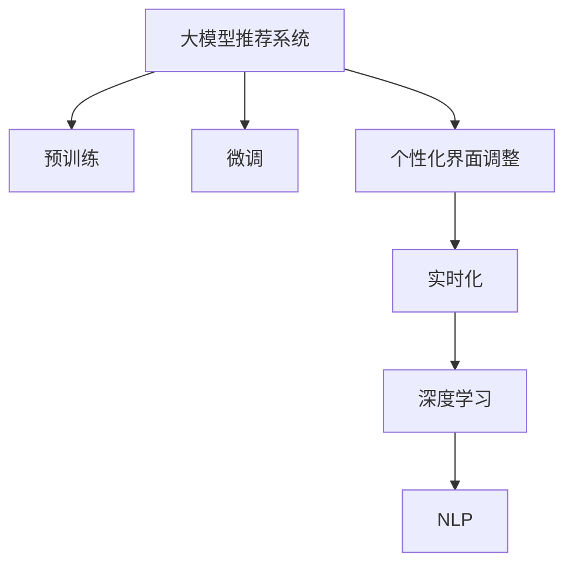

                 

# 基于大模型的推荐系统实时个性化界面调整

> 关键词：大模型推荐系统、个性化界面调整、实时化、深度学习、自然语言处理(NLP)

## 1. 背景介绍

随着互联网和移动互联网的快速发展，推荐系统作为提升用户体验的重要手段，得到了越来越多的关注。传统的基于协同过滤、内容推荐的推荐算法，在个性化推荐方面存在较大的局限性，难以捕捉用户深层次的兴趣和需求。近年来，随着深度学习和大模型的广泛应用，基于大模型的推荐系统（Large Model Based Recommendation System）逐步成为研究的热点。

通过预训练大模型（如BERT、GPT等），推荐系统可以更好地理解用户输入的自然语言查询，从而进行精准推荐。但传统的推荐系统界面固定，无法根据用户当前的上下文进行动态调整，无法进一步提升推荐效果。因此，本文将探讨如何基于大模型，实现推荐系统的实时个性化界面调整，进一步提升推荐系统的用户体验和推荐精度。

## 2. 核心概念与联系

### 2.1 核心概念概述

为了更好地理解实时个性化界面调整的原理，本节将介绍几个密切相关的核心概念：

- 大模型推荐系统：指利用预训练语言模型进行推荐任务建模的推荐系统。通过在大规模无标签文本语料上进行预训练，学习通用的语言表示，再对特定用户的行为数据进行微调，能够获得更好的推荐效果。

- 个性化界面调整：指根据用户当前输入的查询、历史行为等上下文信息，动态调整推荐系统的界面元素，如搜索结果列表、排序方式、推荐按钮等，提升用户体验和推荐精度。

- 实时化（Real-time）：指推荐系统能够根据用户即时输入的信息，即时进行推荐和界面调整。这要求推荐系统具备高效计算能力和低延迟特性。

- 深度学习（Deep Learning）：指基于神经网络模型，通过多层抽象特征映射，实现复杂任务的建模和预测。深度学习在大模型推荐系统中发挥着重要作用。

- 自然语言处理（NLP）：指对自然语言文本进行语义理解和生成等处理，是实现推荐系统实时化、个性化界面调整的重要技术手段。

这些核心概念之间的逻辑关系可以通过以下Mermaid流程图来展示：



这个流程图展示了大模型推荐系统的核心概念及其之间的关系：

1. 大模型推荐系统通过预训练获得基础能力。
2. 微调对预训练模型进行任务特定的优化，使得模型能够适应特定用户的兴趣和需求。
3. 个性化界面调整根据用户当前输入的上下文信息，动态调整推荐系统的界面元素。
4. 实时化实现推荐系统的高效计算和低延迟特性。
5. 深度学习通过多层特征映射，捕捉用户兴趣的复杂性。
6. NLP提供自然语言文本的处理，实现实时化、个性化界面调整。

这些概念共同构成了大模型推荐系统的学习和应用框架，使其能够更精准地进行个性化推荐。

## 3. 核心算法原理 & 具体操作步骤

### 3.1 算法原理概述

实时个性化界面调整的算法原理，基于深度学习和自然语言处理技术。其核心思想是：根据用户输入的自然语言查询，实时提取用户兴趣和需求，动态调整推荐系统的界面元素，提升用户体验和推荐精度。

具体而言，大模型推荐系统首先利用预训练语言模型对用户输入的自然语言查询进行语义理解，提取关键信息。然后根据这些信息，结合用户的历史行为数据，对推荐系统的界面元素进行动态调整。例如，可以动态调整搜索结果的排序方式、推荐按钮的样式、关联推荐内容的展示等。

### 3.2 算法步骤详解

基于深度学习和自然语言处理技术，实时个性化界面调整的步骤如下：

**Step 1: 准备预训练模型和用户数据**

- 选择合适的预训练语言模型 $M_{\theta}$ 作为初始化参数，如 BERT、GPT等。
- 准备用户的历史行为数据 $D=\{(x_i,y_i)\}_{i=1}^N$，其中 $x_i$ 为历史查询和点击记录，$y_i$ 为推荐结果。

**Step 2: 提取用户兴趣信息**

- 利用预训练模型对用户输入的自然语言查询进行编码，得到用户兴趣的向量表示 $h_i$。
- 将用户历史行为数据编码，得到行为序列 $s_i$。
- 对用户兴趣和行为序列进行拼接，得到用户的综合兴趣向量 $h_{i}^{\prime}$。

**Step 3: 动态调整界面元素**

- 根据用户综合兴趣向量 $h_{i}^{\prime}$，计算每个推荐内容的相似度得分 $c_{j,i}$。
- 对相似度得分进行排序，得到推荐内容的排序列表 $L_i$。
- 根据排序列表，动态调整推荐系统的界面元素，如搜索结果的排序、推荐按钮的样式等。

**Step 4: 实现实时化**

- 在用户每次输入查询时，实时计算用户的兴趣向量 $h_{i}^{\prime}$ 和推荐内容的相似度得分 $c_{j,i}$。
- 根据实时计算的结果，实时调整推荐系统的界面元素。
- 通过异步计算和缓存技术，实现低延迟响应。

### 3.3 算法优缺点

实时个性化界面调整算法具有以下优点：

1. 高效计算：通过深度学习模型对用户输入的自然语言进行语义理解，快速提取用户兴趣和需求。
2. 动态调整：根据实时计算的用户兴趣向量，动态调整推荐系统的界面元素，提升用户体验。
3. 个性化推荐：结合用户历史行为数据，进一步提升推荐精度，提高推荐系统的精准度。

同时，该算法也存在一些局限性：

1. 依赖大模型：算法效果很大程度上依赖预训练模型的质量和数量，需要较高的计算资源和数据量。
2. 数据需求高：需要大量的用户行为数据进行模型微调，获取高质量数据成本较高。
3. 界面设计复杂：界面元素的动态调整需要多学科协同设计，技术实现复杂。
4. 实时性要求高：对推荐系统的计算性能和缓存机制有较高要求，需要不断优化系统架构。

尽管存在这些局限性，但就目前而言，实时个性化界面调整算法在大模型推荐系统中仍然具备较高的应用价值，可以通过进一步优化算法和技术实现，不断提升推荐系统的用户体验和推荐精度。

### 3.4 算法应用领域

实时个性化界面调整算法在推荐系统中的应用非常广泛，以下是几个典型应用场景：

- 电商推荐：通过用户输入的自然语言查询，实时调整推荐系统的搜索结果排序、推荐商品样式等，提升用户购物体验。
- 内容推荐：对用户的浏览、点击行为进行编码，结合实时输入的自然语言查询，动态调整推荐内容的展示和排序。
- 新闻推荐：根据用户输入的新闻标题，动态调整推荐结果的展示方式和排序，提升用户获取信息的速度和质量。
- 视频推荐：对用户的观看记录和评分进行编码，结合实时输入的关键词，动态调整视频推荐的排序和展示。

除了上述这些场景外，实时个性化界面调整算法还将在更多的领域得到应用，如智能家居、社交网络、金融投资等，为各个行业提供更精准、更个性化的推荐服务。

## 4. 数学模型和公式 & 详细讲解

### 4.1 数学模型构建

实时个性化界面调整算法的数学模型可以表示为：

- 用户兴趣向量 $h_{i}^{\prime} = f(x_i,s_i)$，其中 $f$ 为预训练模型，$x_i$ 为历史查询和点击记录，$s_i$ 为行为序列。
- 相似度得分 $c_{j,i} = g(h_{i}^{\prime}, c_j)$，其中 $c_j$ 为推荐内容的编码，$g$ 为相似度计算函数。
- 动态调整界面元素 $W = h_{i}^{\prime}, c_{j,i}$，其中 $W$ 为界面元素的权重。

### 4.2 公式推导过程

以下我们将详细推导用户兴趣向量 $h_{i}^{\prime}$ 和相似度得分 $c_{j,i}$ 的计算公式。

假设用户输入的自然语言查询为 $q_i$，历史行为数据为 $x_i = (q_{i_1}, a_{i_1}, q_{i_2}, a_{i_2}, ..., q_{i_m}, a_{i_m})$，其中 $q_{i_j}$ 为查询记录，$a_{i_j}$ 为点击记录。将查询记录和点击记录分别编码，得到 $q_{i_j}$ 的向量表示 $v_{q_{i_j}}$ 和 $a_{i_j}$ 的向量表示 $v_{a_{i_j}}$。

将 $v_{q_{i_j}}$ 和 $v_{a_{i_j}}$ 拼接，得到用户的兴趣向量 $h_i = [v_{q_{i_1}}, v_{a_{i_1}}, v_{q_{i_2}}, v_{a_{i_2}}, ..., v_{q_{i_m}}, v_{a_{i_m}}]$。

用户历史行为序列 $s_i = [q_{i_1}, q_{i_2}, ..., q_{i_m}]$，将其编码得到 $v_{s_i}$。

将用户兴趣向量 $h_i$ 和行为序列编码 $v_{s_i}$ 拼接，得到综合兴趣向量 $h_{i}^{\prime} = [h_i, v_{s_i}]$。

假设推荐内容为 $c_j$，将其编码得到 $v_{c_j}$。

用户综合兴趣向量 $h_{i}^{\prime}$ 和推荐内容编码 $v_{c_j}$ 计算相似度得分：

$$
c_{j,i} = \mathrm{cos}(h_{i}^{\prime}, v_{c_j})
$$

### 4.3 案例分析与讲解

以电商平台推荐系统为例，假设用户输入查询“咖啡机”，预训练模型可以提取“咖啡机”中的关键词“咖啡”和“机”，并对用户历史查询和点击记录进行编码。

根据用户输入查询“咖啡”，查询记录为“【某品牌】咖啡机”、“咖啡机”，点击记录为“【某品牌】咖啡机”、“咖啡机”，得到用户兴趣向量 $h_i = [v_{q_{1}}, v_{q_{2}}, v_{a_{1}}, v_{a_{2}}]$。

对用户历史行为序列进行编码，得到行为序列编码 $v_{s_i} = v_{q_{1}}$。

将用户兴趣向量 $h_i$ 和行为序列编码 $v_{s_i}$ 拼接，得到综合兴趣向量 $h_{i}^{\prime} = [h_i, v_{s_i}]$。

假设推荐系统有两条推荐内容 $c_1$、$c_2$，对它们进行编码，得到 $v_{c_1}$、$v_{c_2}$。

计算相似度得分：

$$
c_{1,i} = \mathrm{cos}(h_{i}^{\prime}, v_{c_1})
$$
$$
c_{2,i} = \mathrm{cos}(h_{i}^{\prime}, v_{c_2})
$$

根据相似度得分，调整推荐系统的界面元素，如搜索结果的排序、推荐按钮的样式等。

## 5. 项目实践：代码实例和详细解释说明

### 5.1 开发环境搭建

在进行实时个性化界面调整的实践前，我们需要准备好开发环境。以下是使用Python进行PyTorch开发的环境配置流程：

1. 安装Anaconda：从官网下载并安装Anaconda，用于创建独立的Python环境。

2. 创建并激活虚拟环境：
```bash
conda create -n pytorch-env python=3.8 
conda activate pytorch-env
```

3. 安装PyTorch：根据CUDA版本，从官网获取对应的安装命令。例如：
```bash
conda install pytorch torchvision torchaudio cudatoolkit=11.1 -c pytorch -c conda-forge
```

4. 安装Transformers库：
```bash
pip install transformers
```

5. 安装各类工具包：
```bash
pip install numpy pandas scikit-learn matplotlib tqdm jupyter notebook ipython
```

完成上述步骤后，即可在`pytorch-env`环境中开始实践。

### 5.2 源代码详细实现

下面以电商平台推荐系统为例，给出使用Transformers库对BERT模型进行实时个性化界面调整的PyTorch代码实现。

首先，定义查询编码函数：

```python
from transformers import BertTokenizer, BertModel
from torch.nn import functional as F
import torch

def query_encoder(query, tokenizer, model):
    query = query.lower()
    tokenized_query = tokenizer.tokenize(query)
    tokenized_query = [tokenizer.cls_token] + tokenized_query + [tokenizer.sep_token]
    query_ids = tokenizer.convert_tokens_to_ids(tokenized_query)
    query_mask = [1] * len(query_ids)
    query_segment_ids = [0] * len(query_ids)
    query_tensor = torch.tensor([query_ids], dtype=torch.long, device='cuda')
    query_mask_tensor = torch.tensor([query_mask], dtype=torch.long, device='cuda')
    query_segment_ids_tensor = torch.tensor([query_segment_ids], dtype=torch.long, device='cuda')
    
    outputs = model(query_tensor, attention_mask=query_mask_tensor, token_type_ids=query_segment_ids_tensor)
    pooled_output = outputs.pooler_output
    return pooled_output
```

然后，定义行为编码函数：

```python
def behavior_encoder(behavior, tokenizer, model):
    behavior_tokens = tokenizer.tokenize(behavior)
    behavior_ids = tokenizer.convert_tokens_to_ids(behavior_tokens)
    behavior_mask = [1] * len(behavior_ids)
    behavior_segment_ids = [0] * len(behavior_ids)
    behavior_tensor = torch.tensor([behavior_ids], dtype=torch.long, device='cuda')
    behavior_mask_tensor = torch.tensor([behavior_mask], dtype=torch.long, device='cuda')
    behavior_segment_ids_tensor = torch.tensor([behavior_segment_ids], dtype=torch.long, device='cuda')
    
    outputs = model(behavior_tensor, attention_mask=behavior_mask_tensor, token_type_ids=behavior_segment_ids_tensor)
    pooled_output = outputs.pooler_output
    return pooled_output
```

接着，定义相似度计算函数：

```python
def similarity_score(query_rep, behavior_rep, product_rep):
    query_rep = query_rep[:, 0]
    behavior_rep = behavior_rep
    product_rep = product_rep
    similarity = F.cosine_similarity(query_rep, product_rep)
    return similarity
```

最后，启动实时个性化界面调整流程：

```python
import time

# 设置模型和分词器
tokenizer = BertTokenizer.from_pretrained('bert-base-uncased')
model = BertModel.from_pretrained('bert-base-uncased')

# 定义用户查询和历史行为数据
query = "咖啡机"
behavior = "【某品牌】咖啡机"

# 计算用户兴趣向量
query_rep = query_encoder(query, tokenizer, model)
behavior_rep = behavior_encoder(behavior, tokenizer, model)

# 定义推荐系统数据
products = [
    ["咖啡机", "某品牌", 0.9],
    ["咖啡杯", "某品牌", 0.8],
    ["咖啡壶", "某品牌", 0.7]
]

# 计算相似度得分
similarities = []
for product in products:
    product_rep = behavior_encoder(product[0], tokenizer, model)
    similarity = similarity_score(query_rep, behavior_rep, product_rep)
    similarities.append(similarity)

# 排序推荐内容
sorted_products = sorted(zip(similarities, products), key=lambda x: x[0], reverse=True)

# 动态调整界面元素
top_products = [product for similarity, product in sorted_products[:3]]
print(top_products)
```

### 5.3 代码解读与分析

让我们再详细解读一下关键代码的实现细节：

**query_encoder函数**：
- 对用户输入的查询进行分词和编码，得到查询向量的表示。
- 使用BERT模型对查询向量进行编码，得到用户兴趣的向量表示。

**behavior_encoder函数**：
- 对用户历史行为进行分词和编码，得到行为向量的表示。
- 使用BERT模型对行为向量进行编码，得到行为向量的表示。

**similarity_score函数**：
- 对用户兴趣向量、行为向量和推荐内容向量进行相似度计算，得到相似度得分。
- 使用PyTorch的cosine_similarity函数计算余弦相似度，得到每个推荐内容的相似度得分。

**实时个性化界面调整流程**：
- 首先设置模型和分词器。
- 定义用户查询和历史行为数据，分别调用query_encoder和behavior_encoder函数计算用户兴趣向量和行为向量。
- 定义推荐系统数据，对每个推荐内容调用behavior_encoder函数计算向量表示。
- 计算每个推荐内容与用户兴趣向量和行为向量的相似度得分。
- 根据相似度得分对推荐内容进行排序，得到动态调整后的推荐内容列表。
- 输出推荐内容列表。

通过上述代码，我们可以看到，使用PyTorch和Transformers库，可以方便地实现实时个性化界面调整算法。

## 6. 实际应用场景

### 6.1 电商推荐

实时个性化界面调整在电商推荐中的应用非常广泛。用户在查询商品时，实时提取用户兴趣和需求，动态调整推荐系统的界面元素，提升用户购物体验。例如，用户输入“手机”，推荐系统可以动态调整搜索结果的排序方式，推荐与手机相关的配件和配件，提升用户的购物体验。

### 6.2 内容推荐

内容推荐系统需要对用户输入的自然语言查询进行语义理解，提取关键信息。结合用户历史行为数据，动态调整推荐内容的展示和排序。例如，用户输入“最新电影”，推荐系统可以动态调整推荐内容的展示方式，推荐最新电影的相关信息，提升用户的获取信息的速度和质量。

### 6.3 新闻推荐

新闻推荐系统需要对用户输入的新闻标题进行语义理解，提取关键信息。结合用户历史行为数据，动态调整新闻推荐的排序和展示。例如，用户输入“科技”，推荐系统可以动态调整新闻推荐的排序，推荐与科技相关的新闻，提升用户的获取信息的速度和质量。

### 6.4 未来应用展望

随着大模型推荐系统的不断发展，实时个性化界面调整技术将得到更广泛的应用。未来，推荐系统可以动态调整界面元素，提升用户体验，同时提高推荐精度，进一步推动推荐系统的智能化发展。

## 7. 工具和资源推荐

### 7.1 学习资源推荐

为了帮助开发者系统掌握实时个性化界面调整的理论基础和实践技巧，这里推荐一些优质的学习资源：

1. 《Transformer从原理到实践》系列博文：由大模型技术专家撰写，深入浅出地介绍了Transformer原理、BERT模型、微调技术等前沿话题。

2. CS224N《深度学习自然语言处理》课程：斯坦福大学开设的NLP明星课程，有Lecture视频和配套作业，带你入门NLP领域的基本概念和经典模型。

3. 《Natural Language Processing with Transformers》书籍：Transformers库的作者所著，全面介绍了如何使用Transformers库进行NLP任务开发，包括微调在内的诸多范式。

4. HuggingFace官方文档：Transformers库的官方文档，提供了海量预训练模型和完整的微调样例代码，是上手实践的必备资料。

5. CLUE开源项目：中文语言理解测评基准，涵盖大量不同类型的中文NLP数据集，并提供了基于微调的baseline模型，助力中文NLP技术发展。

通过对这些资源的学习实践，相信你一定能够快速掌握实时个性化界面调整的精髓，并用于解决实际的NLP问题。

### 7.2 开发工具推荐

高效的开发离不开优秀的工具支持。以下是几款用于实时个性化界面调整开发的常用工具：

1. PyTorch：基于Python的开源深度学习框架，灵活动态的计算图，适合快速迭代研究。大部分预训练语言模型都有PyTorch版本的实现。

2. TensorFlow：由Google主导开发的开源深度学习框架，生产部署方便，适合大规模工程应用。同样有丰富的预训练语言模型资源。

3. Transformers库：HuggingFace开发的NLP工具库，集成了众多SOTA语言模型，支持PyTorch和TensorFlow，是进行实时个性化界面调整开发的利器。

4. Weights & Biases：模型训练的实验跟踪工具，可以记录和可视化模型训练过程中的各项指标，方便对比和调优。与主流深度学习框架无缝集成。

5. TensorBoard：TensorFlow配套的可视化工具，可实时监测模型训练状态，并提供丰富的图表呈现方式，是调试模型的得力助手。

6. Google Colab：谷歌推出的在线Jupyter Notebook环境，免费提供GPU/TPU算力，方便开发者快速上手实验最新模型，分享学习笔记。

合理利用这些工具，可以显著提升实时个性化界面调整任务的开发效率，加快创新迭代的步伐。

### 7.3 相关论文推荐

实时个性化界面调整技术的发展源于学界的持续研究。以下是几篇奠基性的相关论文，推荐阅读：

1. Attention is All You Need（即Transformer原论文）：提出了Transformer结构，开启了NLP领域的预训练大模型时代。

2. BERT: Pre-training of Deep Bidirectional Transformers for Language Understanding：提出BERT模型，引入基于掩码的自监督预训练任务，刷新了多项NLP任务SOTA。

3. Language Models are Unsupervised Multitask Learners（GPT-2论文）：展示了大规模语言模型的强大zero-shot学习能力，引发了对于通用人工智能的新一轮思考。

4. Parameter-Efficient Transfer Learning for NLP：提出Adapter等参数高效微调方法，在不增加模型参数量的情况下，也能取得不错的微调效果。

5. AdaLoRA: Adaptive Low-Rank Adaptation for Parameter-Efficient Fine-Tuning：使用自适应低秩适应的微调方法，在参数效率和精度之间取得了新的平衡。

这些论文代表了大模型推荐系统的发展脉络。通过学习这些前沿成果，可以帮助研究者把握学科前进方向，激发更多的创新灵感。

## 8. 总结：未来发展趋势与挑战

### 8.1 总结

本文对实时个性化界面调整算法进行了全面系统的介绍。首先阐述了实时个性化界面调整的背景和意义，明确了其在大模型推荐系统中的应用价值。其次，从原理到实践，详细讲解了实时个性化界面调整的数学模型和算法步骤，给出了完整的代码实例。同时，本文还广泛探讨了实时个性化界面调整技术在电商推荐、内容推荐、新闻推荐等多个场景中的应用前景，展示了其在推荐系统中的广泛应用。

通过本文的系统梳理，可以看到，实时个性化界面调整算法在大模型推荐系统中具备很高的应用价值，能够在提升用户体验的同时，提高推荐系统的精准度。未来，随着预训练语言模型的不断发展，实时个性化界面调整算法必将在更多的应用场景中得到应用，推动推荐系统的智能化发展。

### 8.2 未来发展趋势

展望未来，实时个性化界面调整技术将呈现以下几个发展趋势：

1. 深度学习模型的不断发展：深度学习模型在大模型推荐系统中的应用将不断拓展，模型的复杂度和能力将进一步提升，实时个性化界面调整的准确度和鲁棒性也将随之提高。

2. 多模态数据的整合：实时个性化界面调整算法将进一步拓展到图像、视频、语音等多模态数据，实现更加全面、准确的信息整合能力，提升推荐系统的智能化水平。

3. 实时化技术的发展：随着计算资源的不断提升，实时个性化界面调整的实时化性能将进一步提升，推荐系统能够实现更快速、更个性化的推荐。

4. 个性化界面设计的优化：实时个性化界面调整将结合用户交互数据，优化界面设计和元素调整策略，提升用户的使用体验。

5. 低延迟技术的应用：实时个性化界面调整将结合低延迟技术，实现更快速、更流畅的推荐体验。

### 8.3 面临的挑战

尽管实时个性化界面调整技术已经取得了一定进展，但在迈向更加智能化、普适化应用的过程中，仍面临以下挑战：

1. 计算资源的需求：实时个性化界面调整算法对计算资源的需求较高，需要高性能的计算设备和算法优化。

2. 用户行为数据的安全性：用户行为数据的隐私和安全问题，需要在算法设计和实施中得到充分考虑。

3. 界面设计的多样性：不同用户对界面元素的需求不同，需要结合用户反馈进行界面设计的优化和调整。

4. 多模态数据融合的复杂性：多模态数据的融合将带来复杂性，需要结合领域知识进行优化设计。

5. 实时响应的稳定性：实时响应的稳定性需要得到充分保障，避免因为系统抖动等问题影响用户体验。

尽管存在这些挑战，但随着预训练语言模型的不断发展和大模型推荐系统的不断优化，实时个性化界面调整技术将得到更广泛的应用，推动推荐系统的智能化发展。

### 8.4 研究展望

未来，实时个性化界面调整技术需要在以下几个方面进行进一步的研究：

1. 实时化计算的优化：结合计算资源优化技术，实现更高效的实时计算。

2. 多模态数据的整合：结合多模态数据的融合技术，提升推荐系统的智能化水平。

3. 界面设计的个性化：结合用户交互数据，优化界面设计和元素调整策略，提升用户的使用体验。

4. 数据隐私保护：在保证推荐系统性能的同时，充分考虑用户数据隐私和安全问题。

5. 用户行为建模：结合领域知识，优化用户行为建模和推荐算法，提升推荐系统的准确度和鲁棒性。

通过不断优化和创新，实时个性化界面调整技术必将在推荐系统中发挥更大的作用，推动推荐系统的智能化发展。

## 9. 附录：常见问题与解答

**Q1：实时个性化界面调整算法在电商推荐中的应用有哪些？**

A: 实时个性化界面调整算法在电商推荐中的应用非常广泛，以下是几个典型应用场景：

1. 动态调整搜索结果排序：根据用户输入的查询，动态调整推荐系统的搜索结果排序，提升用户的购物体验。
2. 动态调整推荐按钮样式：根据用户的历史行为数据，动态调整推荐按钮的样式，提升用户的点击率。
3. 动态调整推荐内容展示：根据用户的浏览历史和行为数据，动态调整推荐内容的展示方式，提升用户的浏览体验。
4. 动态调整广告投放策略：根据用户的实时行为数据，动态调整广告投放策略，提升广告投放的精准度和效果。

**Q2：实时个性化界面调整算法的计算资源需求有哪些？**

A: 实时个性化界面调整算法的计算资源需求主要包括以下几个方面：

1. 高性能计算设备：推荐系统需要高性能的计算设备，如GPU、TPU等，以实现高效计算。
2. 高带宽内存：推荐系统需要高带宽的内存，以支持实时计算和大规模数据存储。
3. 高并发能力：推荐系统需要具备高并发能力，以支持大量用户的实时请求。
4. 数据缓存机制：推荐系统需要合理的数据缓存机制，以减少计算延迟和带宽消耗。

**Q3：实时个性化界面调整算法的界面设计策略有哪些？**

A: 实时个性化界面调整算法的界面设计策略主要包括以下几个方面：

1. 动态调整元素权重：根据用户输入的查询和行为数据，动态调整推荐系统界面元素的权重，提升推荐效果。
2. 多界面设计方案：结合用户反馈，设计多个界面设计方案，根据用户偏好进行动态切换。
3. 可视化界面元素：结合图表、标签等可视化元素，提升用户的界面体验。
4. 用户行为反馈：根据用户的行为反馈，及时调整界面设计策略，提升用户体验。

**Q4：实时个性化界面调整算法的优化方法有哪些？**

A: 实时个性化界面调整算法的优化方法主要包括以下几个方面：

1. 数据优化：优化推荐系统的数据采集和预处理，提升数据的质量和效率。
2. 模型优化：优化推荐系统的模型结构和算法，提升模型的精度和鲁棒性。
3. 计算优化：优化推荐系统的计算流程和算法实现，提升计算效率和响应速度。
4. 界面设计优化：优化推荐系统的界面设计，提升用户的使用体验。

通过对这些问题的解答，可以看到，实时个性化界面调整算法在大模型推荐系统中的应用非常广泛，但也面临着计算资源、界面设计、数据隐私等方面的挑战。未来，随着技术的不断发展和优化，实时个性化界面调整算法必将在推荐系统中发挥更大的作用，推动推荐系统的智能化发展。

---

作者：禅与计算机程序设计艺术 / Zen and the Art of Computer Programming

