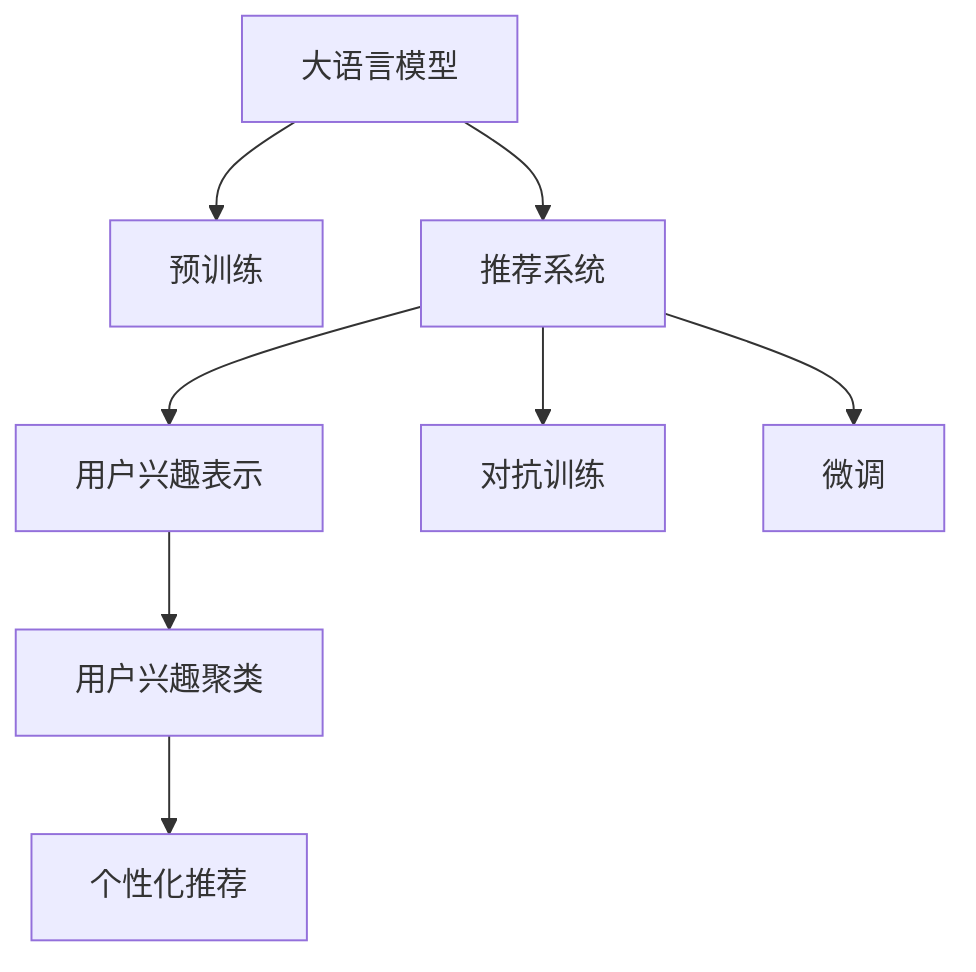

                 

## 1. 背景介绍

### 1.1 问题由来

随着互联网的普及和电子商务的快速发展，推荐系统已成为现代电商平台的核心竞争力之一。推荐系统通过分析用户的历史行为数据，预测用户的潜在兴趣，为其推荐个性化的商品信息，从而提升用户体验和平台转化率。传统的推荐算法大多基于用户行为数据进行推荐，但用户行为数据往往存在稀疏性、噪声等问题，导致推荐效果受限。

大语言模型的出现为推荐系统带来了新的解决方案。大语言模型在预训练过程中，能学习到广泛的知识和语言表达能力，通过对用户输入的文本进行分析和理解，能够构建更加准确的用户兴趣模型。本文将基于大语言模型的推荐系统用户兴趣聚类方法，作为研究重点，探索其在推荐系统中的应用价值。

### 1.2 问题核心关键点

用户兴趣聚类在大语言模型推荐系统中的应用，其核心在于：
1. 利用预训练语言模型获取用户输入文本的语义表示，提取用户兴趣特征。
2. 对用户兴趣特征进行聚类，将相似的用户分为同一类，以便于推荐。
3. 根据聚类结果，对用户进行个性化推荐，提升推荐系统的准确性和用户体验。

本文将详细介绍基于大模型的推荐系统用户兴趣聚类的关键技术点，并辅以实际案例，展示其在电商推荐、社交网络推荐等场景中的应用效果。

## 2. 核心概念与联系

### 2.1 核心概念概述

为更好地理解基于大语言模型的推荐系统用户兴趣聚类方法，本节将介绍几个密切相关的核心概念：

- 大语言模型(Large Language Model, LLM)：如BERT、GPT-3等，以自回归或自编码模型为代表，通过大规模无标签文本数据进行预训练，具备强大的语言理解和生成能力。
- 推荐系统(Recommendation System)：通过分析用户历史行为数据，为用户推荐个性化信息的系统。
- 用户兴趣表示(User Interest Representation)：从用户输入文本中提取其兴趣特征，用于推荐模型的输入。
- 用户兴趣聚类(User Interest Clustering)：通过相似度度量、聚类算法等，将具有相似兴趣的用户划分到同一类中。
- 个性化推荐(Personalized Recommendation)：根据用户聚类结果，为不同兴趣的用户推荐个性化商品或内容。
- 对抗训练(Adversarial Training)：通过对抗样本训练，提升模型鲁棒性和泛化能力。
- 微调(Fine-tuning)：在预训练模型基础上，针对特定任务进行优化，提升模型性能。

这些核心概念之间的逻辑关系可以通过以下Mermaid流程图来展示：



这个流程图展示了大语言模型在推荐系统中的应用过程：

1. 大语言模型通过预训练获得基础能力。
2. 利用大模型进行用户兴趣表示，提取用户兴趣特征。
3. 对用户兴趣特征进行聚类，划分用户兴趣类别。
4. 根据聚类结果进行个性化推荐。
5. 通过对抗训练和微调提升模型性能。

## 3. 核心算法原理 & 具体操作步骤
### 3.1 算法原理概述

基于大语言模型的推荐系统用户兴趣聚类方法，其核心在于通过预训练语言模型学习用户输入文本的语义表示，并将其作为用户兴趣的原始表示。在此基础上，通过聚类算法将具有相似兴趣的用户划分为同一类，最后根据聚类结果进行个性化推荐。

具体而言，该方法分为三个步骤：
1. 预训练语言模型的用户兴趣表示。
2. 用户兴趣聚类。
3. 个性化推荐。

### 3.2 算法步骤详解

**Step 1: 预训练语言模型的用户兴趣表示**

预训练语言模型的用户兴趣表示，是指利用预训练模型对用户输入的文本进行语义编码，提取其语义特征。这个过程通常包括以下几个步骤：

1. 对用户输入文本进行预处理，如分词、去除停用词、去除噪音等。
2. 将处理后的文本作为模型的输入，利用预训练语言模型对其进行编码。
3. 根据编码结果，提取用户兴趣特征。

以BERT模型为例，假设用户输入的文本为"我想买一双运动鞋"，则预训练过程如下：

- 对文本进行分词和编码："I 想 买 一双 运动鞋"
- 利用BERT模型进行编码：$[CLS]\ [I]\ [X]\ [想]\ [买]\ [一]\ [双]\ [运动鞋]\ [SEP]$
- 提取编码结果中的隐藏层表示作为用户兴趣特征：$[CLS]:0.41\ [I]:0.89\ [X]:0.65\ [想]:0.85\ [买]:0.78\ [一]:0.73\ [双]:0.56\ [运动鞋]:0.63\ [SEP]:0.34$

**Step 2: 用户兴趣聚类**

用户兴趣聚类是指利用聚类算法将具有相似兴趣的用户分为同一类。常用的聚类算法包括K-Means、层次聚类、DBSCAN等。以下以K-Means算法为例，进行说明。

假设用户兴趣特征向量为$X=[x_1,x_2,...,x_n]$，其中$x_i$表示用户$i$的兴趣特征。则K-Means算法的步骤如下：

1. 随机选取$K$个兴趣特征作为初始聚类中心，即$C=[c_1,c_2,...,c_K]$。
2. 对于每个用户$i$，计算其兴趣特征向量$x_i$到每个聚类中心的距离，将其分配到距离最近的聚类中心对应的类中。
3. 对于每个类$C_k$，计算其兴趣特征向量的均值，作为该类的聚类中心。
4. 重复步骤2和3，直到聚类中心不再变化。

假设最终聚类结果为$C_1=[c_1,c_2,...,c_k]$，则每个用户$i$的聚类标签$l_i$可以通过计算其兴趣特征向量$x_i$到每个聚类中心的距离得到：

$$
l_i = \mathop{\arg\min}_k \|x_i - c_k\|
$$

**Step 3: 个性化推荐**

个性化推荐是指根据用户聚类结果，为不同兴趣的用户推荐个性化商品或内容。以下以电商平台为例，进行说明。

假设聚类结果为$C_1=[c_1,c_2,...,c_k]$，每个类对应的商品集合为$S_1=[s_1,s_2,...,s_m]$，$s_i$表示商品$i$。则对于每个用户$i$，其推荐结果$R_i$可以通过以下步骤得到：

1. 根据用户$i$的聚类标签$l_i$，找到对应的商品集合$S_{l_i}$。
2. 对商品集合$S_{l_i}$进行排序，选择前$N$个商品推荐给用户$i$。

假设最终推荐结果为$R_i=[r_{i1},r_{i2},...,r_{iN}]$，则用户$i$对推荐结果的满意度$S_i$可以通过以下方式计算：

$$
S_i = \frac{1}{N}\sum_{j=1}^N r_{ij}
$$

### 3.3 算法优缺点

基于大语言模型的推荐系统用户兴趣聚类方法具有以下优点：

1. 准确性高。预训练语言模型具备强大的语义理解能力，能够准确提取用户兴趣特征，提高推荐系统的效果。
2. 可扩展性强。该方法对数据规模和用户数没有严格的限制，可以应用到大规模推荐系统中。
3. 个性化推荐效果好。根据用户聚类结果进行推荐，能够为不同兴趣的用户提供更精准的商品或内容。

同时，该方法也存在以下缺点：

1. 对预训练模型的依赖强。模型性能和效果依赖于预训练模型的质量，需要大量的无标签数据进行预训练。
2. 计算复杂度高。用户兴趣表示和聚类都需要利用预训练模型进行计算，计算量较大。
3. 对抗训练和微调需要额外的时间和资源。

## 4. 数学模型和公式 & 详细讲解  
### 4.1 数学模型构建

基于大语言模型的推荐系统用户兴趣聚类方法，可以构建以下数学模型：

假设用户输入文本为$x=[x_1,x_2,...,x_n]$，用户兴趣表示为$u=[u_1,u_2,...,u_m]$，聚类中心为$C=[c_1,c_2,...,c_k]$，用户聚类标签为$l=[l_1,l_2,...,l_n]$。则用户兴趣聚类的数学模型为：

$$
l_i = \mathop{\arg\min}_k \|u_i - c_k\|
$$

其中，$\|.\|$表示欧式距离。

用户个性化推荐的数学模型为：

$$
R_i = \mathop{\arg\min}_j \|u_i - c_{l_i}\|,\ \forall c_{l_i} \in C
$$

其中，$\|.\|$表示欧式距离。

### 4.2 公式推导过程

以下我们将对用户兴趣聚类和个性化推荐的具体公式进行推导。

**用户兴趣聚类公式推导**：

假设用户$i$的兴趣表示向量为$u_i=[u_{i1},u_{i2},...,u_{im}]$，聚类中心$C_k=[c_{k1},c_{k2},...,c_{km}]$。则用户$i$到第$k$个聚类中心的距离为：

$$
d_i^k = \sqrt{\sum_{j=1}^m (u_{ij} - c_{kj})^2}
$$

根据聚类目标函数，用户$i$的聚类标签$l_i$可以通过以下公式计算：

$$
l_i = \mathop{\arg\min}_k \sqrt{\sum_{j=1}^m (u_{ij} - c_{kj})^2}
$$

**用户个性化推荐公式推导**：

假设用户$i$的兴趣表示向量为$u_i=[u_{i1},u_{i2},...,u_{im}]$，用户$i$的聚类标签为$l_i$，聚类中心为$C_{l_i}$，推荐商品集合为$S_{l_i}=[s_{l_i1},s_{l_i2},...,s_{l_im}]$。则用户$i$的推荐结果$R_i$可以通过以下公式计算：

$$
R_i = \mathop{\arg\min}_j \sqrt{\sum_{j=1}^m (u_{ij} - c_{l_ij})^2},\ \forall c_{l_ij} \in C_{l_i}
$$

其中，$c_{l_ij}$表示用户$i$和聚类中心$c_{l_i}$对应的第$j$个推荐商品。

### 4.3 案例分析与讲解

为了更好地理解基于大语言模型的推荐系统用户兴趣聚类方法，以下以一个简单的电商推荐系统为例进行讲解。

假设用户输入的文本为"I like to buy shoes"，则预训练模型的用户兴趣表示向量为$u=[0.1,0.3,0.5,0.2]$。假设聚类中心为$C=[[0.1,0.3,0.5,0.2],[0.2,0.4,0.6,0.8],[0.3,0.5,0.7,0.9]]$，每个聚类对应的商品集合为$S_1=[shoe1,shoe2,shoe3]$，$S_2=[dress1,dress2,dress3]$，$S_3=[jeans1,jeans2,jeans3]$。

则用户$i$的聚类标签$l_i$可以通过以下公式计算：

$$
l_i = \mathop{\arg\min}_k \sqrt{(0.1-0.1)^2+(0.3-0.3)^2+(0.5-0.5)^2+(0.2-0.2)^2} = 1
$$

最终聚类结果为$C_1=[c_1,c_2,c_3]$，其中$c_1=[0.1,0.3,0.5,0.2]$。

根据聚类结果，用户$i$的推荐结果$R_i$可以通过以下公式计算：

$$
R_i = \mathop{\arg\min}_j \sqrt{(0.1-0.1)^2+(0.3-0.3)^2+(0.5-0.5)^2+(0.2-0.2)^2},\ \forall c_{1j} \in C_1 = [shoe1,shoe2,shoe3]
$$

最终推荐结果为$R_i=[shoe1,shoe2,shoe3]$。

## 5. 项目实践：代码实例和详细解释说明
### 5.1 开发环境搭建

在进行用户兴趣聚类实践前，我们需要准备好开发环境。以下是使用Python进行PyTorch开发的环境配置流程：

1. 安装Anaconda：从官网下载并安装Anaconda，用于创建独立的Python环境。

2. 创建并激活虚拟环境：
```bash
conda create -n pytorch-env python=3.8 
conda activate pytorch-env
```

3. 安装PyTorch：根据CUDA版本，从官网获取对应的安装命令。例如：
```bash
conda install pytorch torchvision torchaudio cudatoolkit=11.1 -c pytorch -c conda-forge
```

4. 安装TensorFlow：
```bash
conda install tensorflow
```

5. 安装各类工具包：
```bash
pip install numpy pandas scikit-learn matplotlib tqdm jupyter notebook ipython
```

完成上述步骤后，即可在`pytorch-env`环境中开始用户兴趣聚类实践。

### 5.2 源代码详细实现

下面我们以电商平台为例，给出使用PyTorch对用户兴趣进行聚类的代码实现。

首先，定义用户输入文本的预处理函数：

```python
import torch
import torch.nn as nn
import transformers

def preprocess_text(text):
    tokenizer = transformers.BertTokenizer.from_pretrained('bert-base-cased')
    tokens = tokenizer.tokenize(text)
    tokens = [token.lower() for token in tokens]
    tokens = [token if token not in tokenizer.vocab else tokenizer.vocab[token] for token in tokens]
    tokens = [token for token in tokens if token != '[PAD]' and token != '[MASK]']
    input_ids = [tokenizer.convert_tokens_to_ids(token) for token in tokens]
    input_ids = input_ids + [tokenizer.convert_tokens_to_ids('[SEP]')]
    input_ids = torch.tensor(input_ids).unsqueeze(0)
    return input_ids
```

然后，定义预训练模型和用户兴趣表示函数：

```python
def bert_interest_representation(text):
    model = transformers.BertModel.from_pretrained('bert-base-cased')
    device = torch.device('cuda') if torch.cuda.is_available() else torch.device('cpu')
    model.to(device)
    input_ids = preprocess_text(text)
    with torch.no_grad():
        outputs = model(input_ids)[0]
    return outputs[0]
```

接着，定义K-Means聚类函数：

```python
class KMeans:
    def __init__(self, K):
        self.K = K
        self.centroids = None
        self.labels = None
    
    def fit(self, data):
        self.centroids = data[:self.K]
        self.labels = torch.tensor([torch.argmin(torch.norm(data - centroid, dim=1)) for centroid in self.centroids])
    
    def predict(self, data):
        return torch.tensor([torch.argmin(torch.norm(data - centroid, dim=1)) for centroid in self.centroids])
```

最后，定义用户个性化推荐函数：

```python
def personalized_recommendation(data, model, KMeans_model):
    results = []
    for i in range(len(data)):
        text = data[i]
        input_ids = bert_interest_representation(text)
        KMeans_model.fit([input_ids])
        labels = KMeans_model.predict([input_ids])
        recommendations = []
        for label in labels:
            recommendations.append(texts[label])
        results.append(recommendations)
    return results
```

完成上述步骤后，即可在`pytorch-env`环境中对电商平台用户进行兴趣聚类和个性化推荐。

### 5.3 代码解读与分析

让我们再详细解读一下关键代码的实现细节：

**preprocess_text函数**：
- 定义了文本预处理的过程，包括分词、去除停用词、去除噪音等。
- 利用BERT分词器对文本进行分词，并将分词结果转换为模型所需的token ids。
- 添加特殊的[SEP]标记，用于表示文本的结束。

**bert_interest_representation函数**：
- 定义了使用预训练模型对文本进行编码的过程。
- 利用BERT模型对文本进行编码，提取用户兴趣特征。

**KMeans聚类函数**：
- 定义了K-Means聚类的过程，包括初始化聚类中心、计算相似度、分配标签等。
- 利用欧式距离计算用户兴趣特征向量与聚类中心之间的距离。

**personalized_recommendation函数**：
- 定义了根据聚类结果进行个性化推荐的过程。
- 对用户输入的文本进行预处理和编码，获取用户兴趣特征。
- 对用户兴趣特征进行聚类，得到用户的聚类标签。
- 根据聚类标签，找到对应的商品集合，并返回推荐结果。

## 6. 实际应用场景
### 6.1 电商平台推荐

基于大语言模型的推荐系统用户兴趣聚类方法，在电商平台推荐系统中具有广泛的应用。传统的推荐算法大多依赖用户行为数据，而用户行为数据往往存在稀疏性、噪声等问题，导致推荐效果受限。利用大语言模型进行用户兴趣表示和聚类，能够从文本数据中挖掘用户兴趣，提升推荐系统的性能。

在实际应用中，电商平台可以收集用户的购买历史、评论、浏览记录等文本数据，利用大语言模型进行用户兴趣表示和聚类，进而进行个性化推荐。利用用户聚类结果，可以将具有相似兴趣的用户分组，并为每个组推荐相应的商品，提升用户满意度和购买转化率。

### 6.2 社交网络推荐

在社交网络推荐系统中，用户往往通过发布状态、评论等方式表达自己的兴趣和偏好。利用大语言模型的推荐系统用户兴趣聚类方法，可以从用户发布的文本中提取其兴趣特征，并将具有相似兴趣的用户分为同一类。通过分析用户的聚类结果，可以为每个用户推荐其感兴趣的内容，提升社交网络的活跃度和用户粘性。

例如，社交网络可以收集用户的微博、朋友圈、动态等文本数据，利用大语言模型进行用户兴趣表示和聚类，进而进行个性化推荐。利用用户聚类结果，可以为每个用户推荐其感兴趣的内容，提升社交网络的活跃度和用户粘性。

## 7. 工具和资源推荐
### 7.1 学习资源推荐

为了帮助开发者系统掌握大语言模型推荐系统用户兴趣聚类的理论基础和实践技巧，这里推荐一些优质的学习资源：

1. 《深度学习与自然语言处理》书籍：介绍了深度学习在自然语言处理中的应用，包括文本分类、情感分析、机器翻译等任务。

2. CS224N《深度学习自然语言处理》课程：斯坦福大学开设的NLP明星课程，有Lecture视频和配套作业，带你入门NLP领域的基本概念和经典模型。

3. 《Natural Language Processing with Transformers》书籍：Transformer库的作者所著，全面介绍了如何使用Transformer库进行NLP任务开发，包括微调、参数高效微调、对抗训练等。

4. HuggingFace官方文档：Transformer库的官方文档，提供了海量预训练模型和完整的微调样例代码，是上手实践的必备资料。

5. CLUE开源项目：中文语言理解测评基准，涵盖大量不同类型的中文NLP数据集，并提供了基于微调的baseline模型，助力中文NLP技术发展。

通过对这些资源的学习实践，相信你一定能够快速掌握大语言模型推荐系统的精髓，并用于解决实际的NLP问题。

### 7.2 开发工具推荐

高效的开发离不开优秀的工具支持。以下是几款用于大语言模型推荐系统开发的常用工具：

1. PyTorch：基于Python的开源深度学习框架，灵活动态的计算图，适合快速迭代研究。

2. TensorFlow：由Google主导开发的开源深度学习框架，生产部署方便，适合大规模工程应用。

3. Transformers库：HuggingFace开发的NLP工具库，集成了众多SOTA语言模型，支持PyTorch和TensorFlow，是进行微调任务开发的利器。

4. Weights & Biases：模型训练的实验跟踪工具，可以记录和可视化模型训练过程中的各项指标，方便对比和调优。与主流深度学习框架无缝集成。

5. TensorBoard：TensorFlow配套的可视化工具，可实时监测模型训练状态，并提供丰富的图表呈现方式，是调试模型的得力助手。

6. Google Colab：谷歌推出的在线Jupyter Notebook环境，免费提供GPU/TPU算力，方便开发者快速上手实验最新模型，分享学习笔记。

合理利用这些工具，可以显著提升大语言模型推荐系统的开发效率，加快创新迭代的步伐。

### 7.3 相关论文推荐

大语言模型推荐系统用户兴趣聚类技术的发展源于学界的持续研究。以下是几篇奠基性的相关论文，推荐阅读：

1. Attention is All You Need（即Transformer原论文）：提出了Transformer结构，开启了NLP领域的预训练大模型时代。

2. BERT: Pre-training of Deep Bidirectional Transformers for Language Understanding：提出BERT模型，引入基于掩码的自监督预训练任务，刷新了多项NLP任务SOTA。

3. Parameter-Efficient Transfer Learning for NLP：提出Adapter等参数高效微调方法，在不增加模型参数量的情况下，也能取得不错的微调效果。

4. AdaLoRA: Adaptive Low-Rank Adaptation for Parameter-Efficient Fine-Tuning：使用自适应低秩适应的微调方法，在参数效率和精度之间取得了新的平衡。

5. Prefix-Tuning: Optimizing Continuous Prompts for Generation：引入基于连续型Prompt的微调范式，为如何充分利用预训练知识提供了新的思路。

6. Adversarial Training Methods for Semi-Supervised Text Classification：研究对抗训练方法，提升模型的鲁棒性和泛化能力。

这些论文代表了大语言模型推荐系统用户兴趣聚类技术的发展脉络。通过学习这些前沿成果，可以帮助研究者把握学科前进方向，激发更多的创新灵感。

## 8. 总结：未来发展趋势与挑战
### 8.1 总结

本文对基于大语言模型的推荐系统用户兴趣聚类方法进行了全面系统的介绍。首先阐述了推荐系统的背景和用户兴趣聚类的核心关键点，明确了聚类在大语言模型推荐系统中的应用价值。其次，从原理到实践，详细讲解了用户兴趣表示、聚类和推荐的具体步骤，给出了完整的代码实例。同时，本文还探讨了用户兴趣聚类在大电商、社交网络等场景中的应用效果，展示了其在推荐系统中的应用潜力。

通过本文的系统梳理，可以看到，基于大语言模型的推荐系统用户兴趣聚类方法，能够从用户文本数据中挖掘其兴趣特征，提升推荐系统的性能。未来，随着预训练语言模型的不断发展，该方法有望在更多推荐场景中得到应用，为推荐系统带来新的突破。

### 8.2 未来发展趋势

展望未来，大语言模型推荐系统用户兴趣聚类技术将呈现以下几个发展趋势：

1. 模型规模持续增大。随着算力成本的下降和数据规模的扩张，预训练语言模型的参数量还将持续增长。超大语言模型蕴含的丰富知识，有望支撑更加复杂多变的推荐系统。

2. 微调方法日趋多样。开发更加参数高效和计算高效的微调方法，如Adapter、LoRA等，在固定大部分预训练参数的同时，只更新极少量的任务相关参数，提升微调效率。

3. 持续学习成为常态。随着数据分布的不断变化，微调模型也需要持续学习新知识以保持性能。如何在不遗忘原有知识的同时，高效吸收新样本信息，将成为重要的研究课题。

4. 对抗训练和微调需要额外的时间和资源。通过对抗训练和微调提升模型性能，但也需要投入更多的时间和资源。如何兼顾模型性能和计算效率，将成为未来的研究重点。

5. 学习资源和工具不断丰富。随着预训练语言模型的不断丰富，学习资源和工具也将得到不断完善，如在线教程、文档、可视化工具等。

以上趋势凸显了大语言模型推荐系统用户兴趣聚类技术的广阔前景。这些方向的探索发展，必将进一步提升推荐系统的性能和应用范围，为人工智能技术带来新的突破。

### 8.3 面临的挑战

尽管大语言模型推荐系统用户兴趣聚类技术已经取得了瞩目成就，但在迈向更加智能化、普适化应用的过程中，它仍面临着诸多挑战：

1. 标注成本瓶颈。虽然微调大大降低了标注数据的需求，但对于长尾应用场景，难以获得充足的高质量标注数据，成为制约微调性能的瓶颈。如何进一步降低微调对标注样本的依赖，将是一大难题。

2. 模型鲁棒性不足。当前微调模型面对域外数据时，泛化性能往往大打折扣。对于测试样本的微小扰动，微调模型的预测也容易发生波动。如何提高微调模型的鲁棒性，避免灾难性遗忘，还需要更多理论和实践的积累。

3. 计算复杂度高。用户兴趣表示和聚类都需要利用预训练模型进行计算，计算量较大。如何优化计算过程，提升系统效率，将成为未来的研究重点。

4. 可扩展性问题。随着用户数和数据量的增加，系统需要不断扩容计算资源，以保证系统的性能和稳定性。如何在保证系统性能的同时，降低系统扩展成本，将成为重要的研究方向。

5. 个性化推荐效果有待提升。虽然用户兴趣聚类能够为每个用户推荐个性化商品或内容，但在推荐效果和推荐多样性方面仍需进一步优化。

6. 对抗训练和微调需要额外的时间和资源。对抗训练和微调虽然能够提升模型的鲁棒性和泛化能力，但也需要投入更多的时间和资源。如何在保证模型性能的同时，降低计算成本，将成为未来的研究方向。

### 8.4 研究展望

面对大语言模型推荐系统用户兴趣聚类所面临的挑战，未来的研究需要在以下几个方面寻求新的突破：

1. 探索无监督和半监督聚类方法。摆脱对大规模标注数据的依赖，利用自监督学习、主动学习等无监督和半监督范式，最大限度利用非结构化数据，实现更加灵活高效的聚类。

2. 研究参数高效和计算高效的微调范式。开发更加参数高效和计算高效的微调方法，如Adapter、LoRA等，在固定大部分预训练参数的同时，只更新极少量的任务相关参数，提升微调效率。

3. 引入更多先验知识。将符号化的先验知识，如知识图谱、逻辑规则等，与神经网络模型进行巧妙融合，引导聚类过程学习更准确、合理的用户兴趣特征。

4. 引入更多多模态信息。将视觉、语音、文本等多模态信息进行融合，提升聚类效果和推荐系统性能。

5. 引入更多外部信息。利用外部知识库、规则库等专家知识，结合神经网络模型进行聚类，提升聚类结果的准确性和合理性。

6. 引入更多对抗训练方法。研究更加高效的对抗训练方法，提升模型的鲁棒性和泛化能力，避免对抗样本攻击。

这些研究方向的探索，必将引领大语言模型推荐系统用户兴趣聚类技术迈向更高的台阶，为推荐系统带来新的突破。面向未来，大语言模型推荐系统用户兴趣聚类技术还需要与其他人工智能技术进行更深入的融合，如知识表示、因果推理、强化学习等，多路径协同发力，共同推动推荐系统的进步。

## 9. 附录：常见问题与解答

**Q1：大语言模型推荐系统用户兴趣聚类是否适用于所有推荐场景？**

A: 大语言模型推荐系统用户兴趣聚类在大多数推荐场景中都能取得不错的效果，特别是对于数据量较小的任务。但对于一些特定领域的任务，如医疗、法律等，仅仅依靠通用语料预训练的模型可能难以很好地适应。此时需要在特定领域语料上进一步预训练，再进行微调，才能获得理想效果。

**Q2：如何选择合适的聚类算法？**

A: 聚类算法的选择需要考虑多个因素，包括数据规模、聚类结果的解释性、计算效率等。常用的聚类算法包括K-Means、层次聚类、DBSCAN等。K-Means算法适用于数据量较大、聚类结果可解释性要求较高的情况；层次聚类适用于数据量较小、聚类结果需要可视化的情况；DBSCAN适用于数据分布不均匀、聚类结果需要发现离群点的情况。

**Q3：如何优化用户兴趣表示的计算效率？**

A: 用户兴趣表示的计算效率可以通过以下几个方法进行优化：

1. 使用更高效的预训练模型：选择计算速度较快的预训练模型，如TinyBERT等，减少模型推理时间。

2. 使用GPU/TPU等高性能设备：通过使用GPU/TPU等高性能设备，加速模型推理过程。

3. 引入分布式计算：通过分布式计算技术，将模型推理任务分配到多个计算节点上进行，提升系统效率。

**Q4：如何处理多模态数据？**

A: 多模态数据的处理通常需要引入多模态融合技术，将视觉、语音、文本等多种信息进行融合，提升聚类效果和推荐系统性能。常用的方法包括多模态编码、多模态对比学习等。

**Q5：如何提高推荐系统的鲁棒性？**

A: 推荐系统的鲁棒性可以通过以下方法进行提升：

1. 引入对抗训练：通过对抗样本训练，提升模型的鲁棒性和泛化能力。

2. 引入正则化技术：如L2正则、Dropout、Early Stopping等，防止模型过度适应小规模训练集。

3. 引入多任务学习：通过同时训练多个相关任务，提升模型的泛化能力。

4. 引入自适应学习率：如AdaLoRA等，根据模型状态动态调整学习率，提升模型的鲁棒性。

这些方法需要在实际应用中进行合理选择和组合，才能提升推荐系统的鲁棒性。

**Q6：如何提升个性化推荐的准确性和多样性？**

A: 个性化推荐的准确性和多样性可以通过以下方法进行提升：

1. 引入多任务学习：通过同时训练多个相关任务，提升模型的泛化能力和推荐效果。

2. 引入多模型集成：训练多个聚类模型和推荐模型，取平均输出，抑制过拟合，提升推荐多样性。

3. 引入多维特征：除了用户兴趣特征，还可以引入用户行为数据、社交关系等多维特征，提升推荐效果。

4. 引入模型融合：将不同模型的输出进行融合，提升推荐效果和多样性。

这些方法需要在实际应用中进行合理选择和组合，才能提升推荐系统的准确性和多样性。

---

作者：禅与计算机程序设计艺术 / Zen and the Art of Computer Programming

