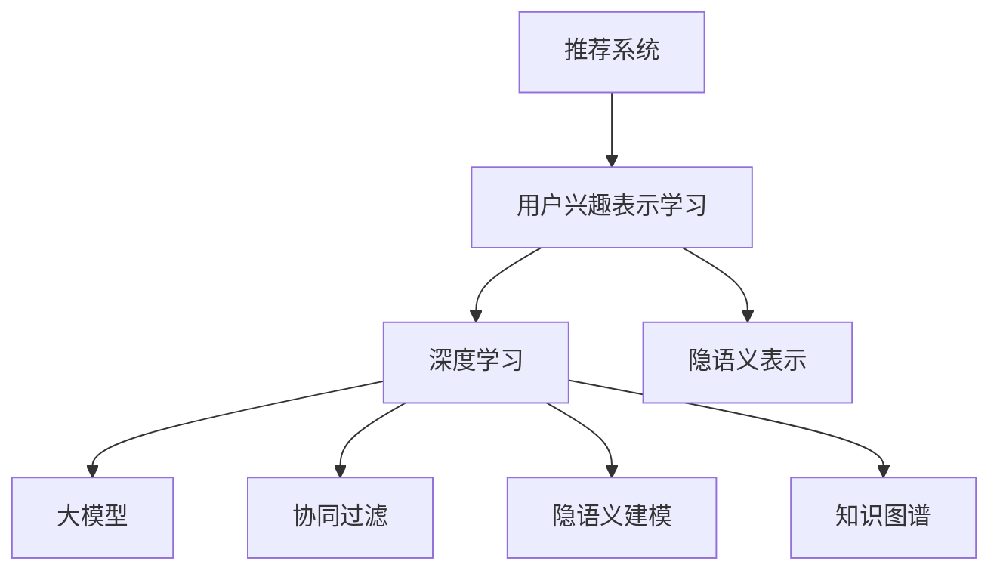

                 

# 基于大模型的推荐系统用户兴趣表示学习

> 关键词：推荐系统, 用户兴趣表示学习, 深度学习, 大模型, 协同过滤, 知识图谱, 隐语义建模

## 1. 背景介绍

随着互联网和移动互联网的迅猛发展，用户获取信息和产品的方式日益多样，而个性化推荐系统已经成为了各大互联网平台的核心竞争力之一。推荐系统通过分析用户历史行为数据，为用户推荐最符合其兴趣的商品或内容，显著提升了用户体验和满意度。

推荐系统的核心在于如何有效表示用户的兴趣和行为，并基于此进行个性化推荐。传统的推荐系统多基于协同过滤和隐语义建模等方法，主要利用用户行为数据进行推荐。但这些方法存在数据稀疏、推荐精度有限等不足。而近年来，基于深度学习的方法逐渐崭露头角，尤其是利用预训练语言模型，如BERT、GPT等，作为用户兴趣表示学习的基本工具，从用户行为和产品特征的语义信息中挖掘潜在关联，实现更加精准的推荐。

本博客将深入探讨基于大模型的推荐系统用户兴趣表示学习，从算法原理、操作步骤、实际应用场景和未来趋势等方面，系统阐述该方法的理论基础和工程实践。

## 2. 核心概念与联系

### 2.1 核心概念概述

为更好地理解基于大模型的推荐系统用户兴趣表示学习方法，本节将介绍几个密切相关的核心概念：

- **推荐系统(Recommender System)**：利用用户行为数据进行产品推荐的软件系统。主要目标是为用户提供更符合其兴趣和需求的商品或内容，提升用户体验和平台转化率。
- **用户兴趣表示学习(User Interest Representation Learning)**：指通过分析用户历史行为数据，学习用户对商品或内容的兴趣倾向，进而实现个性化推荐的技术。
- **深度学习(Deep Learning)**：一种利用神经网络进行数据表示学习的高级技术，能够自动提取数据中的高层次特征。
- **大模型(Large Model)**：指具有亿级甚至更多参数的深度学习模型，如BERT、GPT等。这些模型通过大规模无标签数据进行预训练，具备强大的语义理解能力。
- **协同过滤(Collaborative Filtering)**：基于用户历史行为或商品之间相似度的推荐方法。主要分为基于用户的协同过滤和基于商品的协同过滤。
- **隐语义建模(Latent Semantic Modeling)**：基于矩阵分解或神经网络等技术，学习用户和商品之间的隐含语义表示，实现更加准确的推荐。
- **知识图谱(Knowledge Graph)**：通过结构化的关系图谱，记录实体之间的语义关系。在推荐系统中，知识图谱可用于增强推荐模型的语义理解能力。
- **隐语义表示(Latent Semantic Representation)**：通过隐语义建模，学习出用户和商品之间的低维隐含表示，便于进行相似度计算和推荐。

这些核心概念之间的逻辑关系可以通过以下Mermaid流程图来展示：



这个流程图展示了大模型在推荐系统中的核心概念及其之间的关系：

1. 推荐系统通过用户行为数据进行推荐。
2. 用户兴趣表示学习主要通过深度学习和大模型来实现。
3. 协同过滤和隐语义建模是深度学习下的两种典型推荐方法。
4. 知识图谱可以增强推荐模型的语义表示能力。
5. 隐语义表示是用户和商品之间的低维语义表示，是推荐的基础。

这些概念共同构成了推荐系统的理论框架，为其在实际应用中提供了技术支持。

## 3. 核心算法原理 & 具体操作步骤

### 3.1 算法原理概述

基于大模型的推荐系统用户兴趣表示学习，本质上是一种结合深度学习和大模型的推荐方法。其核心思想是：通过预训练语言模型，学习用户历史行为文本的语义表示，然后利用这些语义表示进行个性化推荐。

具体来说，假设用户历史行为序列为 $\{x_1, x_2, \cdots, x_n\}$，预训练语言模型为 $M_{\theta}$，用户兴趣表示为 $v_i = M_{\theta}(x_i)$。对于每条历史行为，模型都会输出一个低维向量，表示用户在该行为下的兴趣倾向。通过这些向量，可以构建用户兴趣的隐语义表示，进一步用于推荐模型的构建。

### 3.2 算法步骤详解

基于大模型的推荐系统用户兴趣表示学习主要包括以下几个关键步骤：

**Step 1: 数据预处理**
- 收集用户的历史行为数据，包括点击、浏览、购买、评分等。
- 对行为数据进行清洗、去重和格式标准化。
- 将行为数据转化为文本形式，例如将点击行为表示为 "浏览网页1"、 "购买商品2" 等文本描述。

**Step 2: 模型训练**
- 使用预训练语言模型对用户行为文本进行编码，得到用户兴趣表示向量 $v_i$。
- 使用深度学习框架，如TensorFlow或PyTorch，构建推荐模型。
- 模型训练集包含用户兴趣表示向量 $v_i$ 和对应的用户行为数据，可以是点击、购买、评分等。

**Step 3: 用户兴趣表示更新**
- 将新行为文本输入到预训练语言模型中，得到新的用户兴趣表示向量。
- 通过计算新旧兴趣表示向量的相似度，得到用户对新行为的兴趣程度。
- 根据兴趣程度更新推荐结果，推荐最符合用户兴趣的商品或内容。

**Step 4: 模型评估和优化**
- 使用测试集评估推荐模型的精度和召回率等指标。
- 根据评估结果调整模型参数，优化模型性能。
- 引入负样本样本和对抗性训练，提升模型的鲁棒性。

### 3.3 算法优缺点

基于大模型的推荐系统用户兴趣表示学习具有以下优点：
1. **精度高**：大模型的语义理解能力远超传统推荐算法，能够从更丰富的语义信息中挖掘用户兴趣。
2. **可解释性强**：用户兴趣表示向量可以直观地展示用户的兴趣方向，便于调试和优化。
3. **适应性强**：能够灵活处理不同类型的数据和推荐场景。
4. **可扩展性好**：可以轻松扩展到多模态数据和跨领域推荐。

但该方法也存在一些局限性：
1. **计算成本高**：大模型通常参数量巨大，训练和推理成本高。
2. **数据依赖性强**：需要大规模的行为数据进行训练，对于数据稀疏问题难以有效处理。
3. **泛化能力有限**：过度依赖预训练模型的语义表示，对新数据和新场景的泛化能力可能有限。
4. **隐私和安全问题**：用户行为数据可能包含敏感信息，需要考虑隐私保护和数据安全。

### 3.4 算法应用领域

基于大模型的推荐系统用户兴趣表示学习在多个领域得到了广泛应用：

- **电商推荐**：如京东、淘宝等电商平台的商品推荐，通过用户浏览记录和点击行为，学习用户兴趣表示，推荐商品。
- **视频推荐**：如YouTube、Netflix等平台的视频内容推荐，通过用户观看记录和评分行为，学习用户兴趣表示，推荐视频。
- **音乐推荐**：如Spotify、网易云音乐等平台的音乐推荐，通过用户听歌记录和评论行为，学习用户兴趣表示，推荐歌曲。
- **新闻推荐**：如今日头条等新闻平台的文章推荐，通过用户阅读记录和点赞行为，学习用户兴趣表示，推荐文章。

除了这些典型应用外，该方法还被创新性地应用到更多场景中，如个性化搜索、内容标签、社交网络推荐等，为推荐系统的多样化和智能化提供了新的思路。

## 4. 数学模型和公式 & 详细讲解  
### 4.1 数学模型构建

本节将使用数学语言对基于大模型的推荐系统用户兴趣表示学习过程进行更加严格的刻画。

假设用户历史行为序列为 $\{x_1, x_2, \cdots, x_n\}$，其中 $x_i$ 表示第 $i$ 条历史行为。设预训练语言模型为 $M_{\theta}$，用户兴趣表示为 $v_i = M_{\theta}(x_i) \in \mathbb{R}^d$，其中 $d$ 为兴趣表示向量的维度。

**Step 1: 用户兴趣表示学习**
对于每条历史行为 $x_i$，将其输入到预训练语言模型 $M_{\theta}$ 中，得到用户兴趣表示向量 $v_i$。

**Step 2: 构建推荐模型**
使用深度学习框架，构建推荐模型。假设推荐模型为 $f(v_i, h)$，其中 $h$ 表示商品的语义表示向量，$f$ 表示推荐函数。

**Step 3: 推荐计算**
对于新商品 $h$，计算用户 $i$ 对商品 $h$ 的兴趣程度 $s_{ih}$，并根据兴趣程度排序推荐商品。

### 4.2 公式推导过程

以下我们以电商推荐为例，推导推荐模型的计算公式。

假设用户历史行为为浏览、点击、购买等，预训练语言模型为BERT，商品特征为商品描述文本。具体步骤如下：

**Step 1: 用户兴趣表示学习**
- 将用户历史行为文本输入到BERT中，得到用户兴趣表示向量 $v_i \in \mathbb{R}^d$。

**Step 2: 商品特征表示**
- 将商品描述文本输入到BERT中，得到商品特征向量 $h_j \in \mathbb{R}^d$。

**Step 3: 推荐计算**
- 计算用户对商品 $j$ 的兴趣程度 $s_{ij}$，定义为 $v_i$ 和 $h_j$ 的点积：$s_{ij} = v_i^T h_j$。
- 根据兴趣程度排序推荐商品，将兴趣程度最高的前 $k$ 个商品推荐给用户。

### 4.3 案例分析与讲解

**案例1: 电商推荐**
- 数据集：京东商品数据集
- 用户行为：用户浏览、点击、购买行为
- 用户兴趣表示学习：使用BERT模型，将用户行为文本转化为兴趣表示向量
- 推荐模型：基于点积的协同过滤模型，计算用户和商品之间的兴趣相似度
- 推荐结果：根据相似度排序推荐商品

**案例2: 视频推荐**
- 数据集：YouTube视频数据集
- 用户行为：用户观看、评分、点赞行为
- 用户兴趣表示学习：使用BERT模型，将用户行为文本转化为兴趣表示向量
- 推荐模型：基于点积的协同过滤模型，计算用户和视频之间的兴趣相似度
- 推荐结果：根据相似度排序推荐视频

## 5. 项目实践：代码实例和详细解释说明
### 5.1 开发环境搭建

在进行推荐系统项目实践前，我们需要准备好开发环境。以下是使用Python进行PyTorch开发的环境配置流程：

1. 安装Anaconda：从官网下载并安装Anaconda，用于创建独立的Python环境。

2. 创建并激活虚拟环境：
```bash
conda create -n pytorch-env python=3.8 
conda activate pytorch-env
```

3. 安装PyTorch：根据CUDA版本，从官网获取对应的安装命令。例如：
```bash
conda install pytorch torchvision torchaudio cudatoolkit=11.1 -c pytorch -c conda-forge
```

4. 安装Transformers库：
```bash
pip install transformers
```

5. 安装各类工具包：
```bash
pip install numpy pandas scikit-learn matplotlib tqdm jupyter notebook ipython
```

完成上述步骤后，即可在`pytorch-env`环境中开始推荐系统项目实践。

### 5.2 源代码详细实现

这里我们以电商推荐为例，给出使用Transformers库进行BERT模型微调的PyTorch代码实现。

首先，定义电商推荐任务的数据处理函数：

```python
from transformers import BertTokenizer
from torch.utils.data import Dataset
import torch

class RetailDataset(Dataset):
    def __init__(self, texts, labels, tokenizer, max_len=128):
        self.texts = texts
        self.labels = labels
        self.tokenizer = tokenizer
        self.max_len = max_len
        
    def __len__(self):
        return len(self.texts)
    
    def __getitem__(self, item):
        text = self.texts[item]
        label = self.labels[item]
        
        encoding = self.tokenizer(text, return_tensors='pt', max_length=self.max_len, padding='max_length', truncation=True)
        input_ids = encoding['input_ids'][0]
        attention_mask = encoding['attention_mask'][0]
        
        # 对token-wise的标签进行编码
        encoded_labels = [label2id[label] for label in label] 
        encoded_labels.extend([label2id['O']] * (self.max_len - len(encoded_labels)))
        labels = torch.tensor(encoded_labels, dtype=torch.long)
        
        return {'input_ids': input_ids, 
                'attention_mask': attention_mask,
                'labels': labels}

# 标签与id的映射
label2id = {'O': 0, 'B': 1, 'I': 2}
id2label = {v: k for k, v in label2id.items()}

# 创建dataset
tokenizer = BertTokenizer.from_pretrained('bert-base-cased')

train_dataset = RetailDataset(train_texts, train_labels, tokenizer)
dev_dataset = RetailDataset(dev_texts, dev_labels, tokenizer)
test_dataset = RetailDataset(test_texts, test_labels, tokenizer)
```

然后，定义模型和优化器：

```python
from transformers import BertForTokenClassification, AdamW

model = BertForTokenClassification.from_pretrained('bert-base-cased', num_labels=len(label2id))

optimizer = AdamW(model.parameters(), lr=2e-5)
```

接着，定义训练和评估函数：

```python
from torch.utils.data import DataLoader
from tqdm import tqdm
from sklearn.metrics import classification_report

device = torch.device('cuda') if torch.cuda.is_available() else torch.device('cpu')
model.to(device)

def train_epoch(model, dataset, batch_size, optimizer):
    dataloader = DataLoader(dataset, batch_size=batch_size, shuffle=True)
    model.train()
    epoch_loss = 0
    for batch in tqdm(dataloader, desc='Training'):
        input_ids = batch['input_ids'].to(device)
        attention_mask = batch['attention_mask'].to(device)
        labels = batch['labels'].to(device)
        model.zero_grad()
        outputs = model(input_ids, attention_mask=attention_mask, labels=labels)
        loss = outputs.loss
        epoch_loss += loss.item()
        loss.backward()
        optimizer.step()
    return epoch_loss / len(dataloader)

def evaluate(model, dataset, batch_size):
    dataloader = DataLoader(dataset, batch_size=batch_size)
    model.eval()
    preds, labels = [], []
    with torch.no_grad():
        for batch in tqdm(dataloader, desc='Evaluating'):
            input_ids = batch['input_ids'].to(device)
            attention_mask = batch['attention_mask'].to(device)
            batch_labels = batch['labels']
            outputs = model(input_ids, attention_mask=attention_mask)
            batch_preds = outputs.logits.argmax(dim=2).to('cpu').tolist()
            batch_labels = batch_labels.to('cpu').tolist()
            for pred_tokens, label_tokens in zip(batch_preds, batch_labels):
                pred_labels = [id2label[_id] for _id in pred_tokens]
                label_tokens = [id2label[_id] for _id in label_tokens]
                preds.append(pred_labels[:len(label_tokens)])
                labels.append(label_tokens)
                
    print(classification_report(labels, preds))
```

最后，启动训练流程并在测试集上评估：

```python
epochs = 5
batch_size = 16

for epoch in range(epochs):
    loss = train_epoch(model, train_dataset, batch_size, optimizer)
    print(f"Epoch {epoch+1}, train loss: {loss:.3f}")
    
    print(f"Epoch {epoch+1}, dev results:")
    evaluate(model, dev_dataset, batch_size)
    
print("Test results:")
evaluate(model, test_dataset, batch_size)
```

以上就是使用PyTorch对BERT进行电商推荐任务微调的完整代码实现。可以看到，得益于Transformers库的强大封装，我们可以用相对简洁的代码完成BERT模型的加载和微调。

### 5.3 代码解读与分析

让我们再详细解读一下关键代码的实现细节：

**RetailDataset类**：
- `__init__`方法：初始化文本、标签、分词器等关键组件。
- `__len__`方法：返回数据集的样本数量。
- `__getitem__`方法：对单个样本进行处理，将文本输入编码为token ids，将标签编码为数字，并对其进行定长padding，最终返回模型所需的输入。

**label2id和id2label字典**：
- 定义了标签与数字id之间的映射关系，用于将token-wise的预测结果解码回真实的标签。

**训练和评估函数**：
- 使用PyTorch的DataLoader对数据集进行批次化加载，供模型训练和推理使用。
- 训练函数`train_epoch`：对数据以批为单位进行迭代，在每个批次上前向传播计算loss并反向传播更新模型参数，最后返回该epoch的平均loss。
- 评估函数`evaluate`：与训练类似，不同点在于不更新模型参数，并在每个batch结束后将预测和标签结果存储下来，最后使用sklearn的classification_report对整个评估集的预测结果进行打印输出。

**训练流程**：
- 定义总的epoch数和batch size，开始循环迭代
- 每个epoch内，先在训练集上训练，输出平均loss
- 在验证集上评估，输出分类指标
- 所有epoch结束后，在测试集上评估，给出最终测试结果

可以看到，PyTorch配合Transformers库使得BERT微调的代码实现变得简洁高效。开发者可以将更多精力放在数据处理、模型改进等高层逻辑上，而不必过多关注底层的实现细节。

当然，工业级的系统实现还需考虑更多因素，如模型的保存和部署、超参数的自动搜索、更灵活的任务适配层等。但核心的推荐系统范式基本与此类似。

## 6. 实际应用场景

### 6.1 智能客服系统

基于大模型的推荐系统可以应用于智能客服系统的构建。智能客服系统通过分析用户的历史互动记录，学习用户的兴趣和需求，自动推荐合适的解决方案，显著提升客服效率和用户体验。

在技术实现上，可以收集用户与客服的对话记录，将对话内容转化为推荐系统所需的用户兴趣表示。微调后的推荐系统根据用户对话内容，推荐最符合用户需求的回答或问题解决方案。对于用户提出的新问题，还可以接入检索系统实时搜索相关内容，动态组织生成回答。如此构建的智能客服系统，能大幅提升客服系统的工作效率和用户满意度。

### 6.2 电商推荐系统

电商推荐系统通过分析用户的历史浏览、点击、购买行为，学习用户的兴趣和偏好，推荐符合用户需求的商品。电商平台的推荐系统已经成为其核心竞争力之一，帮助用户发现新商品，提升购买转化率。

在技术实现上，可以利用用户的历史行为数据，构建用户兴趣表示，然后使用基于大模型的推荐系统进行推荐。微调后的推荐系统可以动态地调整推荐策略，根据用户最新的行为数据，实时推荐商品，提高推荐精度。此外，还可以将推荐结果与广告投放结合，实现精准广告投放，进一步提升用户转化率和平台收入。

### 6.3 金融推荐系统

金融推荐系统通过分析用户的投资行为和金融产品信息，学习用户的投资兴趣和风险偏好，推荐符合用户需求的产品。金融平台的推荐系统能够帮助用户发现优质投资机会，提高投资回报率。

在技术实现上，可以收集用户的历史投资行为数据，如购买股票、基金、债券等，并提取其特征信息。利用用户行为数据，构建用户兴趣表示，然后使用基于大模型的推荐系统进行推荐。微调后的推荐系统可以根据用户最新的投资行为，动态调整推荐策略，推荐最适合用户的产品，实现个性化投资建议。此外，还可以结合市场动态，实时调整推荐结果，为用户提供最新的投资资讯。

### 6.4 未来应用展望

随着大模型和推荐系统技术的发展，基于大模型的推荐系统将有更广阔的应用前景：

1. **多模态推荐**：将推荐系统扩展到视觉、音频等多模态数据，提升推荐系统的感知能力，提供更丰富多样的推荐结果。
2. **跨领域推荐**：结合不同领域的数据，构建跨领域的推荐系统，提升推荐系统的泛化能力，提供更加全面个性化的推荐服务。
3. **实时推荐**：结合实时数据，构建实时推荐系统，动态调整推荐策略，提升推荐精度和用户体验。
4. **个性化搜索**：结合个性化推荐和搜索技术，构建个性化搜索系统，提升用户搜索体验和发现新内容的机会。
5. **社交推荐**：结合社交网络数据，构建社交推荐系统，推荐符合用户社交关系网络特征的商品或内容。

此外，基于大模型的推荐系统还可以应用于更多场景，如新闻推荐、视频推荐、音乐推荐等，为推荐系统带来新的应用范式，提升推荐系统的智能化水平。未来，随着推荐技术的发展，基于大模型的推荐系统将在更多领域得到应用，为推荐系统带来新的突破。

## 7. 工具和资源推荐
### 7.1 学习资源推荐

为了帮助开发者系统掌握大模型推荐系统的理论基础和实践技巧，这里推荐一些优质的学习资源：

1. 《深度学习》书籍：深度学习领域的经典教材，介绍了深度学习的理论基础和实现方法，涵盖推荐系统的相关章节。
2. 《Recommender Systems: Foundations and Principles》书籍：推荐系统领域的权威教材，系统阐述了推荐系统的理论基础和实践方法。
3 CS294M《推荐系统》课程：斯坦福大学开设的推荐系统课程，涵盖推荐系统的经典算法和前沿技术，包括深度学习和大模型的应用。
4. 《Recommender Systems in Action》书籍：实践导向的推荐系统案例书，介绍了推荐系统的实际应用和案例分析。
5. Coursera《Machine Learning for Recommendation Systems》课程：Coursera与Amazon合作开设的推荐系统课程，涵盖推荐系统的算法和模型。

通过对这些资源的学习实践，相信你一定能够快速掌握大模型推荐系统的精髓，并用于解决实际的推荐问题。

### 7.2 开发工具推荐

高效的开发离不开优秀的工具支持。以下是几款用于大模型推荐系统开发的常用工具：

1. PyTorch：基于Python的开源深度学习框架，灵活动态的计算图，适合快速迭代研究。BERT等模型都有PyTorch版本的实现。
2. TensorFlow：由Google主导开发的开源深度学习框架，生产部署方便，适合大规模工程应用。
3. Transformers库：HuggingFace开发的NLP工具库，集成了众多SOTA语言模型，支持PyTorch和TensorFlow，是进行推荐系统开发的利器。
4. Weights & Biases：模型训练的实验跟踪工具，可以记录和可视化模型训练过程中的各项指标，方便对比和调优。
5. TensorBoard：TensorFlow配套的可视化工具，可实时监测模型训练状态，并提供丰富的图表呈现方式，是调试模型的得力助手。

合理利用这些工具，可以显著提升大模型推荐系统的开发效率，加快创新迭代的步伐。

### 7.3 相关论文推荐

大模型和推荐系统的发展源于学界的持续研究。以下是几篇奠基性的相关论文，推荐阅读：

1. Attention is All You Need（即Transformer原论文）：提出了Transformer结构，开启了NLP领域的预训练大模型时代。
2. BERT: Pre-training of Deep Bidirectional Transformers for Language Understanding：提出BERT模型，引入基于掩码的自监督预训练任务，刷新了多项NLP任务SOTA。
3. AutoRegressive Language Models for Recommendation Systems：提出基于自回归语言模型的推荐系统，能够捕捉用户和商品之间的长期依赖关系。
4. Deep Neural Networks for Interest Prediction and Recommendation：提出基于深度神经网络的推荐系统，能够学习用户和商品的隐语义表示。
5. Masked Language Model Distillation for Recommendation Systems：提出基于掩码语言模型的推荐系统，通过知识蒸馏实现高效推荐。

这些论文代表了大模型推荐系统的理论发展脉络。通过学习这些前沿成果，可以帮助研究者把握学科前进方向，激发更多的创新灵感。

## 8. 总结：未来发展趋势与挑战

### 8.1 总结

本文对基于大模型的推荐系统用户兴趣表示学习方法进行了全面系统的介绍。首先阐述了推荐系统和大模型在推荐系统中的核心作用，明确了用户兴趣表示学习的基本框架和目标。其次，从算法原理、操作步骤、实际应用场景和未来趋势等方面，详细讲解了该方法的理论基础和工程实践。通过本文的系统梳理，可以看到，基于大模型的推荐系统在推荐精度、个性化推荐、可解释性等方面都取得了显著进展，并在电商、金融、智能客服等多个领域得到了广泛应用。

### 8.2 未来发展趋势

展望未来，大模型推荐系统将呈现以下几个发展趋势：

1. **多模态推荐**：将推荐系统扩展到视觉、音频等多模态数据，提升推荐系统的感知能力，提供更丰富多样的推荐结果。
2. **跨领域推荐**：结合不同领域的数据，构建跨领域的推荐系统，提升推荐系统的泛化能力，提供更加全面个性化的推荐服务。
3. **实时推荐**：结合实时数据，构建实时推荐系统，动态调整推荐策略，提升推荐精度和用户体验。
4. **个性化搜索**：结合个性化推荐和搜索技术，构建个性化搜索系统，提升用户搜索体验和发现新内容的机会。
5. **社交推荐**：结合社交网络数据，构建社交推荐系统，推荐符合用户社交关系网络特征的商品或内容。

这些趋势凸显了大模型推荐系统的广阔前景。这些方向的探索发展，必将进一步提升推荐系统的性能和应用范围，为推荐系统带来新的突破。

### 8.3 面临的挑战

尽管大模型推荐系统已经取得了显著成就，但在迈向更加智能化、普适化应用的过程中，它仍面临着诸多挑战：

1. **数据稀疏问题**：推荐系统需要大量的用户行为数据，但许多小众领域的数据稀疏，难以获得高质量的训练数据。
2. **冷启动问题**：对于新用户或新商品，无法获取足够的行为数据，推荐系统无法正常工作。
3. **隐私和安全问题**：用户行为数据可能包含敏感信息，需要考虑隐私保护和数据安全。
4. **计算资源消耗**：大模型和深度学习算法需要大量的计算资源，硬件成本较高。
5. **模型复杂度**：大模型和深度学习模型结构复杂，难以进行调试和优化。
6. **泛化能力不足**：过度依赖预训练模型的语义表示，对新数据和新场景的泛化能力可能有限。

### 8.4 研究展望

面对大模型推荐系统所面临的挑战，未来的研究需要在以下几个方面寻求新的突破：

1. **数据增强技术**：利用数据增强技术，提高推荐系统的泛化能力，处理数据稀疏和冷启动问题。
2. **小样本学习和迁移学习**：开发小样本学习算法，让推荐系统在少量标注数据上也能进行高效推荐。
3. **跨领域知识融合**：结合外部知识库、规则库等专家知识，增强推荐系统的语义理解和推荐能力。
4. **多模态数据融合**：结合视觉、音频等多模态数据，提升推荐系统的感知能力，提供更全面、多样化的推荐结果。
5. **实时推荐系统**：结合实时数据，构建实时推荐系统，动态调整推荐策略，提升推荐精度和用户体验。
6. **个性化推荐技术**：结合个性化推荐和搜索技术，构建个性化搜索系统，提升用户搜索体验和发现新内容的机会。

这些研究方向将推动大模型推荐系统向更加智能化、普适化应用迈进，为推荐系统带来新的突破。只有不断创新、不断优化，才能真正实现人工智能技术在推荐系统中的应用价值。

## 9. 附录：常见问题与解答

**Q1：大模型推荐系统与传统推荐系统相比，有哪些优势？**

A: 大模型推荐系统相比传统推荐系统，具有以下几个优势：
1. **精度高**：大模型的语义理解能力远超传统推荐算法，能够从更丰富的语义信息中挖掘用户兴趣。
2. **可解释性强**：用户兴趣表示向量可以直观地展示用户的兴趣方向，便于调试和优化。
3. **适应性强**：能够灵活处理不同类型的数据和推荐场景。
4. **可扩展性好**：可以轻松扩展到多模态数据和跨领域推荐。

**Q2：如何缓解大模型推荐系统中的冷启动问题？**

A: 冷启动问题是大模型推荐系统面临的主要挑战之一。缓解冷启动问题的方法包括：
1. **数据增强**：利用用户行为数据进行数据增强，如通过回译、近义替换等方式扩充训练集。
2. **模型迁移**：利用已有的推荐模型进行迁移学习，利用部分预训练参数进行推荐。
3. **用户画像构建**：利用用户其他属性信息（如性别、年龄、地域等）构建用户画像，辅助推荐。
4. **推荐策略调整**：在冷启动阶段，采用基于规则、基于内容的推荐策略，逐步引入大模型推荐。

**Q3：大模型推荐系统是否适用于所有推荐场景？**

A: 大模型推荐系统在大多数推荐场景中都能取得不错的效果，特别是对于数据量较大的推荐场景。但对于一些特定领域的推荐场景，如医疗、法律等，仅仅依靠通用语料预训练的模型可能难以很好地适应。此时需要在特定领域语料上进一步预训练，再进行微调，才能获得理想效果。

**Q4：大模型推荐系统在实际部署中需要注意哪些问题？**

A: 将大模型推荐系统转化为实际应用，还需要考虑以下因素：
1. **模型裁剪**：去除不必要的层和参数，减小模型尺寸，加快推理速度。
2. **量化加速**：将浮点模型转为定点模型，压缩存储空间，提高计算效率。
3. **服务化封装**：将模型封装为标准化服务接口，便于集成调用。
4. **弹性伸缩**：根据请求流量动态调整资源配置，平衡服务质量和成本。
5. **监控告警**：实时采集系统指标，设置异常告警阈值，确保服务稳定性。

大模型推荐系统为推荐系统带来了新的应用范式，但也带来了新的挑战。只有从数据、模型、工程、业务等多个维度协同发力，才能真正实现人工智能技术在推荐系统中的应用价值。

总之，大模型推荐系统需要开发者根据具体场景，不断迭代和优化模型、数据和算法，方能得到理想的效果。

---

作者：禅与计算机程序设计艺术 / Zen and the Art of Computer Programming

