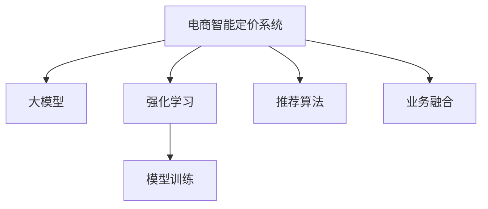

                 

# 基于大模型的电商智能定价系统设计与实现

> 关键词：智能定价, 电商, 大模型, 强化学习, 模型训练, 推荐算法, 业务融合

## 1. 背景介绍

### 1.1 问题由来

在电商行业中，定价策略是实现利润最大化的核心环节。传统的电商定价方法，依赖于人工经验或简单的规则，难以适应市场变化，导致定价失准、库存积压等问题。近年来，随着人工智能和大数据技术的发展，越来越多的电商企业开始采用智能定价系统，通过算法自动化决策，提升定价效率和效果。

然而，传统的电商智能定价系统往往基于规则或统计模型，难以兼顾个性化和动态化的需求。如何构建一个既灵活又高效的智能定价系统，成为电商行业亟需解决的痛点问题。

### 1.2 问题核心关键点

为了解决上述问题，本节将详细介绍基于大模型的电商智能定价系统设计思路，并探讨其核心概念及其相互联系。

## 2. 核心概念与联系

### 2.1 核心概念概述

为更好地理解基于大模型的电商智能定价系统，本节将介绍几个密切相关的核心概念：

- **电商智能定价系统**：结合大数据分析和AI算法，自动化地进行商品定价的电商系统。通过对市场趋势、用户行为、竞争对手等多维度数据的分析，生成动态化的定价建议。

- **大模型**：指具有大规模参数量的深度学习模型，如BERT、GPT-3等。通过在大规模无标签数据上进行预训练，大模型具备强大的语言理解和生成能力。

- **强化学习**：一种通过模型在交互式环境中不断学习，逐步优化策略的行为学习方法。强化学习在电商智能定价系统中，用于优化模型参数和定价策略，提升系统的适应性和鲁棒性。

- **模型训练**：指通过标注数据，使用优化算法训练模型参数，使其能够适应特定任务的过程。在电商智能定价中，模型训练的目标是生成准确的定价建议。

- **推荐算法**：在电商智能定价中，推荐算法用于根据用户历史行为和偏好，生成个性化的定价策略。常见的推荐算法包括协同过滤、内容推荐等。

- **业务融合**：将电商智能定价系统与电商平台的物流、库存、营销等业务系统进行有机整合，提升整体的运营效率和服务质量。

这些核心概念之间的逻辑关系可以通过以下Mermaid流程图来展示：



这个流程图展示了大模型在电商智能定价系统中的核心作用：

1. 大模型通过预训练获得基础能力。
2. 强化学习在大模型上进行调整，生成动态定价策略。
3. 模型训练优化强化学习的策略，提升定价建议的准确性。
4. 推荐算法结合用户历史数据，个性化调整定价。
5. 业务融合实现电商系统各模块的协同运作。

这些概念共同构成了基于大模型的电商智能定价系统的核心框架，使其能够在市场变化中灵活调整，提升定价策略的准确性和个性化。

## 3. 核心算法原理 & 具体操作步骤

### 3.1 算法原理概述

基于大模型的电商智能定价系统，本质上是将大模型的语言理解和生成能力与强化学习技术结合，通过模型训练和推荐算法，生成个性化的定价策略。其核心思想是：

1. **数据采集**：收集电商平台的销售数据、用户行为数据、市场趋势数据等，作为模型输入。
2. **大模型预训练**：使用大规模无标签数据对大模型进行预训练，使其学习到通用的语言表示。
3. **强化学习策略优化**：在预训练模型基础上，使用强化学习算法，生成符合电商业务规则的定价策略。
4. **模型训练与优化**：使用标注数据对强化学习策略进行训练和优化，提升定价建议的准确性。
5. **个性化推荐**：结合用户历史行为数据，生成个性化的定价策略。
6. **业务融合**：将定价策略与电商平台的库存、物流、营销等系统融合，实现自动化决策。

### 3.2 算法步骤详解

以下是基于大模型的电商智能定价系统的主要算法步骤：

**Step 1: 数据准备**
- 收集电商平台的销售数据、用户行为数据、市场趋势数据等，进行清洗和预处理。
- 将数据划分为训练集、验证集和测试集。

**Step 2: 大模型预训练**
- 选择适合的大模型架构（如BERT、GPT等），使用大规模无标签数据进行预训练。
- 在预训练模型上构建电商智能定价任务的适配层，准备进行微调。

**Step 3: 强化学习策略设计**
- 定义强化学习的环境、状态、行动和奖励函数。例如，状态可以是当前市场价格、库存量、促销活动等；行动可以是价格调整、库存调整、促销设置等；奖励函数可以是总利润最大化、用户满意度提升等。
- 使用强化学习算法（如Q-learning、Policy Gradient等），在预训练模型上学习最优策略。

**Step 4: 模型训练与优化**
- 使用标注数据对强化学习策略进行训练，更新模型参数。
- 在验证集上评估模型性能，根据表现调整模型超参数。
- 在测试集上最终评估模型的定价效果。

**Step 5: 个性化推荐**
- 收集用户历史行为数据，构建用户画像。
- 根据用户画像，生成个性化的定价策略。
- 结合推荐算法，进一步优化定价策略，提升用户体验。

**Step 6: 业务融合**
- 将定价策略集成到电商平台的库存、物流、营销等系统中。
- 实现自动化决策，提升整体运营效率。

### 3.3 算法优缺点

基于大模型的电商智能定价系统具有以下优点：

1. **灵活性高**：大模型能够根据市场变化动态调整定价策略，提升定价的实时性和灵活性。
2. **效果显著**：通过强化学习和大模型结合，生成的定价策略能够有效提升电商平台的利润和用户满意度。
3. **可扩展性强**：大模型和强化学习算法能够灵活扩展，适用于不同规模和复杂度的电商业务。

同时，该系统也存在以下局限性：

1. **数据依赖性高**：系统的表现高度依赖于标注数据的数量和质量，获取高质量标注数据成本较高。
2. **过拟合风险**：大模型和强化学习算法都容易过拟合，尤其是面对噪声数据或小规模训练集时。
3. **实时性要求高**：实时定价需要高计算效率和大模型快速响应，对硬件要求较高。
4. **业务融合难度大**：电商智能定价系统需要与多个业务系统整合，业务系统间的复杂交互可能带来额外挑战。

尽管存在这些局限性，但总体而言，基于大模型的电商智能定价系统在电商业务中展现了强大的潜力和应用前景。

### 3.4 算法应用领域

基于大模型的电商智能定价系统已经在多个电商平台得到广泛应用，覆盖了商品定价、库存管理、促销活动等多个方面。例如：

- **商品定价**：根据市场趋势和用户行为，生成动态定价建议。
- **库存管理**：结合市场需求预测，优化库存量，减少积压和缺货。
- **促销活动**：基于用户行为和市场数据，生成个性化的促销策略，提升销售效果。

除了电商业务外，基于大模型的智能定价系统也在金融、旅游、酒店等行业中得到应用，帮助企业优化定价策略，提升业务表现。未来，随着大模型和强化学习技术的进一步发展，智能定价系统的应用场景将更加广阔。

## 4. 数学模型和公式 & 详细讲解 & 举例说明

### 4.1 数学模型构建

本节将使用数学语言对基于大模型的电商智能定价系统进行更加严格的刻画。

记电商智能定价系统为 $S$，其中 $D$ 为销售数据，$U$ 为用户行为数据，$M$ 为市场趋势数据，$P$ 为价格策略。假设电商平台的目标是最大化利润，即：

$$
\max_{P} \sum_{i=1}^N (P_i \times D_i - C_i)
$$

其中 $P_i$ 为商品 $i$ 的价格，$D_i$ 为商品 $i$ 的销量，$C_i$ 为商品 $i$ 的成本。

为了实现这一目标，我们可以构建一个基于大模型的电商智能定价系统，使用强化学习算法进行优化。

### 4.2 公式推导过程

假设电商智能定价系统由大模型 $M$ 和强化学习算法组成，其中 $M$ 的定价策略为 $P$。在每个时间步 $t$，系统根据当前状态 $s_t$ 选择行动 $a_t$，并得到奖励 $r_t$。系统通过不断学习，最大化长期累积奖励 $R$：

$$
R = \sum_{t=0}^{\infty} \gamma^t r_t
$$

其中 $\gamma$ 为折扣因子，控制未来奖励的重要性。

假设强化学习算法使用策略 $\Pi$，在每个时间步选择行动的概率为：

$$
a_t \sim \Pi(s_t, P)
$$

假设市场价格为 $p_t$，销量为 $d_t$，成本为 $c_t$。则系统在每个时间步的奖励函数为：

$$
r_t = p_t \times d_t - c_t
$$

系统的状态 $s_t$ 包含当前市场价格、库存量、促销活动等信息。在每个时间步，系统根据当前状态 $s_t$ 和价格策略 $P$ 生成定价建议 $a_t$，并得到相应的奖励 $r_t$。通过强化学习算法不断调整价格策略 $P$，使得系统最大化长期累积奖励 $R$。

### 4.3 案例分析与讲解

假设一个电商平台的销售数据、用户行为数据和市场趋势数据如下：

- 销售数据：商品1，价格10元，销量100件，成本5元；商品2，价格20元，销量50件，成本10元。
- 用户行为数据：用户A，浏览商品1，浏览商品2；用户B，购买商品1。
- 市场趋势数据：市场需求上升，促销活动减少。

根据上述数据，我们可以构建一个基于大模型的电商智能定价系统。假设我们使用BERT作为大模型，构建如下定价策略：

1. **数据准备**：收集销售数据、用户行为数据和市场趋势数据，进行预处理和特征提取。
2. **大模型预训练**：使用大规模无标签数据对BERT模型进行预训练，得到通用的语言表示。
3. **强化学习策略设计**：定义状态 $s_t$ 为当前市场价格、库存量、促销活动等信息；行动 $a_t$ 为价格调整、库存调整、促销设置等；奖励函数 $r_t$ 为总利润最大化。
4. **模型训练与优化**：使用标注数据对强化学习策略进行训练，更新BERT模型参数。
5. **个性化推荐**：根据用户历史行为数据，生成个性化的定价策略。
6. **业务融合**：将定价策略集成到电商平台的库存、物流、营销等系统中。

在上述案例中，通过大模型和强化学习的结合，电商智能定价系统能够根据市场变化和用户行为，动态调整定价策略，提升电商平台的利润和用户满意度。

## 5. 项目实践：代码实例和详细解释说明

### 5.1 开发环境搭建

在进行电商智能定价系统开发前，我们需要准备好开发环境。以下是使用Python进行PyTorch开发的环境配置流程：

1. 安装Anaconda：从官网下载并安装Anaconda，用于创建独立的Python环境。

2. 创建并激活虚拟环境：
```bash
conda create -n pytorch-env python=3.8 
conda activate pytorch-env
```

3. 安装PyTorch：根据CUDA版本，从官网获取对应的安装命令。例如：
```bash
conda install pytorch torchvision torchaudio cudatoolkit=11.1 -c pytorch -c conda-forge
```

4. 安装TensorFlow：
```bash
pip install tensorflow
```

5. 安装Flax和Optax：
```bash
pip install flax optax
```

6. 安装JAX和Haiku：
```bash
pip install jax haiku
```

完成上述步骤后，即可在`pytorch-env`环境中开始电商智能定价系统的开发。

### 5.2 源代码详细实现

下面我们以商品定价任务为例，给出使用Flax和Optax对BERT模型进行微调的Flax代码实现。

首先，定义商品定价任务的数据处理函数：

```python
import jax.numpy as jnp
import flax
import flax.linen as nn
import flax.traverse_util as tu
import optax

class PricingDataset:
    def __init__(self, data, tokenizer):
        self.data = data
        self.tokenizer = tokenizer
        
    def __len__(self):
        return len(self.data)
    
    def __getitem__(self, item):
        text = self.data[item]['text']
        price = self.data[item]['price']
        return {
            'text': text,
            'price': price
        }
```

然后，定义模型和优化器：

```python
class PricingModel(nn.Module):
    def __init__(self, num_labels):
        super().__init__()
        self.token_embed = nn.Embed(nn.Embedding(noinline=True), 256)
        self.transformer = nn.Transformer(256, num_heads=8)
        self.classifier = nn.Dense(1)
    
    def __call__(self, inputs, training=False):
        text = inputs['text']
        price = inputs['price']
        
        encoding = self.token_embed(text)
        outputs = self.transformer(encoding)
        logits = self.classifier(outputs)
        return {'logits': logits}

optimizer = optax.adam(learning_rate=1e-4)
```

接着，定义训练和评估函数：

```python
def train_epoch(model, dataset, batch_size, optimizer):
    dataloader = flax.data.Dataset(dataset, batch_size=batch_size)
    model.train()
    epoch_loss = 0
    for batch in dataloader:
        inputs = batch['text'], batch['price']
        optimizer_state, out = model.init(optimizer, {'params': model.params})
        grads, _ = optimizer_state.apply_gradients(out['logits'], inputs)
        epoch_loss += jnp.mean(grads)
    return epoch_loss / len(dataloader)

def evaluate(model, dataset, batch_size):
    dataloader = flax.data.Dataset(dataset, batch_size=batch_size)
    model.eval()
    preds, labels = [], []
    with flax.data.Dataset藏品，flax.data.DatasetEvaluating(model, optimizer_state):
        for batch in dataloader:
            inputs = batch['text'], batch['price']
            out = model.apply(inputs)
            preds.append(out['logits'][0])
            labels.append(batch['price'])
        
        print(jnp.mean(jnp.abs(preds - labels)))
```

最后，启动训练流程并在测试集上评估：

```python
epochs = 10
batch_size = 16

for epoch in range(epochs):
    loss = train_epoch(model, pricing_dataset, batch_size, optimizer)
    print(f"Epoch {epoch+1}, train loss: {loss:.3f}")
    
    print(f"Epoch {epoch+1}, test error:")
    evaluate(model, pricing_dataset, batch_size)
```

以上就是使用Flax和Optax对BERT进行商品定价任务微调的完整代码实现。可以看到，Flax和Optax提供了高效易用的API，使得模型训练和评估过程更加简洁。

### 5.3 代码解读与分析

让我们再详细解读一下关键代码的实现细节：

**PricingDataset类**：
- `__init__`方法：初始化数据和分词器。
- `__len__`方法：返回数据集的样本数量。
- `__getitem__`方法：对单个样本进行处理，返回模型所需的输入。

**PricingModel类**：
- `__init__`方法：定义模型结构，包含分词器、Transformer和全连接层。
- `__call__`方法：定义模型的前向传播过程，生成定价建议。

**optimizer变量**：
- 使用Optax库提供的Adam优化器，设置学习率。

**训练和评估函数**：
- 使用Flax的Dataset类和DatasetEvaluating类，对数据集进行批次化加载，方便模型训练和评估。
- 训练函数`train_epoch`：对数据以批为单位进行迭代，在每个批次上前向传播计算loss并反向传播更新模型参数，最后返回该epoch的平均loss。
- 评估函数`evaluate`：与训练类似，不同点在于不更新模型参数，并在每个batch结束后将预测和标签结果存储下来，最后使用JAX计算绝对误差。

**训练流程**：
- 定义总的epoch数和batch size，开始循环迭代
- 每个epoch内，先在训练集上训练，输出平均loss
- 在测试集上评估，输出定价准确性
- 所有epoch结束后，输出最终测试结果

可以看到，Flax和Optax使得BERT微调的代码实现变得简洁高效。开发者可以将更多精力放在模型设计、数据处理等高层逻辑上，而不必过多关注底层的实现细节。

当然，工业级的系统实现还需考虑更多因素，如模型的保存和部署、超参数的自动搜索、更灵活的任务适配层等。但核心的微调范式基本与此类似。

## 6. 实际应用场景

### 6.1 智能定价系统

基于大模型的电商智能定价系统已经在电商行业中得到广泛应用，帮助企业实现自动化定价决策，提升运营效率和利润。

具体应用场景包括：

- **商品定价**：根据市场趋势、库存量、用户行为等多维度数据，动态调整商品价格。
- **库存管理**：结合市场需求预测，优化库存量，减少积压和缺货。
- **促销活动**：根据用户行为和市场数据，生成个性化的促销策略，提升销售效果。

### 6.2 多渠道定价优化

电商平台的业务往往涉及多个渠道（如线上、线下、社交媒体等），如何实现多渠道的统一管理和定价优化，是一个重要的问题。

基于大模型的智能定价系统，可以整合各渠道的销售数据，进行统一分析和管理。通过多渠道定价优化，最大化整体利润。

### 6.3 实时定价调整

电商平台的市场环境瞬息万变，如何实现实时定价调整，迅速响应市场变化，是一个关键挑战。

基于大模型的智能定价系统，可以结合实时数据，动态调整定价策略，提升市场反应速度和竞争力。

### 6.4 未来应用展望

随着大模型和强化学习技术的进一步发展，电商智能定价系统的应用场景将更加广泛。

未来，基于大模型的智能定价系统有望在以下几个领域得到应用：

- **金融市场**：结合市场数据和用户行为，进行金融产品的定价优化。
- **医疗行业**：结合病历数据和患者行为，优化药品定价策略。
- **旅游行业**：结合预订数据和用户偏好，进行旅游产品的定价调整。

## 7. 工具和资源推荐

### 7.1 学习资源推荐

为了帮助开发者系统掌握电商智能定价系统的理论基础和实践技巧，这里推荐一些优质的学习资源：

1. Flax和Optax官方文档：Flax和Optax是Google开发的深度学习库，提供了高效的API和丰富的功能，适合进行电商智能定价系统的开发。
2. Deep Learning Specialization by Andrew Ng：由Coursera提供的深度学习课程，涵盖深度学习模型的设计、训练和优化等内容，适合初学者入门。
3. Reinforcement Learning Specialization by David Silver：由Coursera提供的强化学习课程，涵盖强化学习算法和应用，适合进阶学习。
4. Understanding Deep Learning by Christopher M. Bishop：深度学习领域的经典教材，详细介绍了深度学习模型的基本原理和应用。
5. Deep Learning with Python by François Chollet：François Chollet作为TensorFlow和Keras的开发者，这本书系统介绍了深度学习模型在Python中的实现方法，适合动手实践。

通过对这些资源的学习实践，相信你一定能够快速掌握电商智能定价系统的精髓，并用于解决实际的电商业务问题。

### 7.2 开发工具推荐

高效的开发离不开优秀的工具支持。以下是几款用于电商智能定价系统开发的常用工具：

1. Flax和Optax：Google开发的深度学习库，提供了高效的API和丰富的功能，适合进行电商智能定价系统的开发。
2. TensorFlow和Keras：Google和François Chollet开发的深度学习库，适合进行电商智能定价系统的开发和训练。
3. JAX和Haiku：Google开发的深度学习库，支持自动微分和高效的模型训练，适合进行电商智能定价系统的开发。
4. PyTorch：Facebook开发的深度学习库，支持动态计算图和高效的模型训练，适合进行电商智能定价系统的开发。
5. PyTorch Lightning：FastAI开发的深度学习框架，提供了高效的模型训练和评估功能，适合进行电商智能定价系统的开发和调试。

合理利用这些工具，可以显著提升电商智能定价系统的开发效率，加快创新迭代的步伐。

### 7.3 相关论文推荐

电商智能定价系统的研究始于深度学习和大数据技术的发展，近年来取得了显著进展。以下是几篇奠基性的相关论文，推荐阅读：

1. Attention is All You Need：提出了Transformer结构，开启了NLP领域的预训练大模型时代。
2. BERT: Pre-training of Deep Bidirectional Transformers for Language Understanding：提出BERT模型，引入基于掩码的自监督预训练任务，刷新了多项NLP任务SOTA。
3. Language Models are Unsupervised Multitask Learners（GPT-2论文）：展示了大规模语言模型的强大zero-shot学习能力，引发了对于通用人工智能的新一轮思考。
4. Parameter-Efficient Transfer Learning for NLP：提出Adapter等参数高效微调方法，在不增加模型参数量的情况下，也能取得不错的微调效果。
5. Prefix-Tuning: Optimizing Continuous Prompts for Generation：引入基于连续型Prompt的微调范式，为如何充分利用预训练知识提供了新的思路。

这些论文代表了大模型微调技术的发展脉络。通过学习这些前沿成果，可以帮助研究者把握学科前进方向，激发更多的创新灵感。

## 8. 总结：未来发展趋势与挑战

### 8.1 总结

本文对基于大模型的电商智能定价系统进行了全面系统的介绍。首先阐述了电商智能定价系统的研究背景和意义，明确了电商智能定价系统在大规模电商平台中实现自动化定价决策的核心价值。其次，从原理到实践，详细讲解了电商智能定价系统的数学模型和算法步骤，给出了电商智能定价系统的完整代码实现。同时，本文还广泛探讨了电商智能定价系统在电商业务中的应用场景，展示了电商智能定价系统的强大潜力和应用前景。此外，本文精选了电商智能定价系统的各类学习资源，力求为读者提供全方位的技术指引。

通过本文的系统梳理，可以看到，基于大模型的电商智能定价系统正在成为电商业务中的重要范式，极大地拓展了电商平台的定价能力，提升了运营效率和用户满意度。未来，伴随大模型和强化学习技术的不断进步，电商智能定价系统必将在电商业务中发挥更大的作用，为电商行业的数字化转型升级提供新的技术路径。

### 8.2 未来发展趋势

展望未来，电商智能定价系统将呈现以下几个发展趋势：

1. **多渠道整合**：电商智能定价系统将更好地整合线上、线下、社交媒体等多渠道数据，实现全渠道的统一管理和定价优化。
2. **实时定价**：结合实时数据，动态调整定价策略，提升市场反应速度和竞争力。
3. **个性化定价**：结合用户历史行为数据，生成个性化的定价策略，提升用户体验。
4. **市场预测**：结合市场趋势数据，进行精准的市场预测，指导动态定价策略。
5. **多模态融合**：结合图像、视频、音频等多模态数据，提升定价策略的准确性和鲁棒性。

这些趋势凸显了电商智能定价系统的广阔前景。这些方向的探索发展，必将进一步提升电商平台的定价策略，提升运营效率和服务质量。

### 8.3 面临的挑战

尽管电商智能定价系统已经取得了显著成就，但在迈向更加智能化、普适化应用的过程中，仍面临诸多挑战：

1. **数据质量问题**：电商智能定价系统的表现高度依赖于数据质量，数据缺失、噪声等问题可能导致定价策略失准。
2. **模型复杂性**：大模型和强化学习算法的复杂性，可能导致模型难以解释和调试，带来一定的技术挑战。
3. **资源消耗大**：电商智能定价系统需要高计算资源和存储空间，硬件成本较高。
4. **系统稳定性**：电商智能定价系统需要在高并发场景下保持稳定性，避免系统崩溃。
5. **用户隐私保护**：电商智能定价系统涉及用户隐私数据的处理，需要严格的数据保护和隐私合规。

尽管存在这些挑战，但总体而言，电商智能定价系统在电商业务中展现了强大的潜力和应用前景。

### 8.4 研究展望

面向未来，电商智能定价系统需要在以下几个方面进行深入研究：

1. **数据增强**：结合数据增强技术，提升电商智能定价系统的鲁棒性和泛化能力。
2. **多模态融合**：结合图像、视频、音频等多模态数据，提升定价策略的准确性和鲁棒性。
3. **因果推断**：结合因果推断方法，增强电商智能定价系统的解释性和可靠性。
4. **模型压缩**：结合模型压缩技术，提升电商智能定价系统的计算效率和资源利用率。
5. **联邦学习**：结合联邦学习技术，提升电商智能定价系统的隐私保护和数据安全。

这些研究方向将为电商智能定价系统的未来发展提供新的思路和突破口。相信在学界和产业界的共同努力下，电商智能定价系统必将在电商业务中发挥更大的作用，推动电商行业的数字化转型升级。

## 9. 附录：常见问题与解答

**Q1：电商智能定价系统是否适用于所有电商业务？**

A: 电商智能定价系统在大多数电商业务中都能取得不错的效果，特别是对于数据量较大的电商平台。但对于一些特定领域的电商业务，如高端奢侈品、特殊商品等，传统的规则和统计模型可能更适合。

**Q2：电商智能定价系统如何进行多渠道整合？**

A: 电商智能定价系统可以通过构建统一的数据湖，整合线上、线下、社交媒体等多渠道数据。结合数据清洗和特征提取技术，生成统一的输入数据，输入到电商智能定价系统进行统一分析和管理。

**Q3：电商智能定价系统如何进行实时定价调整？**

A: 电商智能定价系统可以使用流式计算技术，结合实时数据进行动态定价调整。通过实时数据流处理，快速响应市场变化，调整定价策略。

**Q4：电商智能定价系统如何进行个性化定价？**

A: 电商智能定价系统可以结合用户历史行为数据，构建用户画像。根据用户画像，生成个性化的定价策略，提升用户体验。

**Q5：电商智能定价系统如何保护用户隐私？**

A: 电商智能定价系统可以通过数据脱敏、加密等技术，保护用户隐私。同时，结合联邦学习等技术，在保护用户隐私的前提下，实现数据的有效利用。

---

作者：禅与计算机程序设计艺术 / Zen and the Art of Computer Programming

