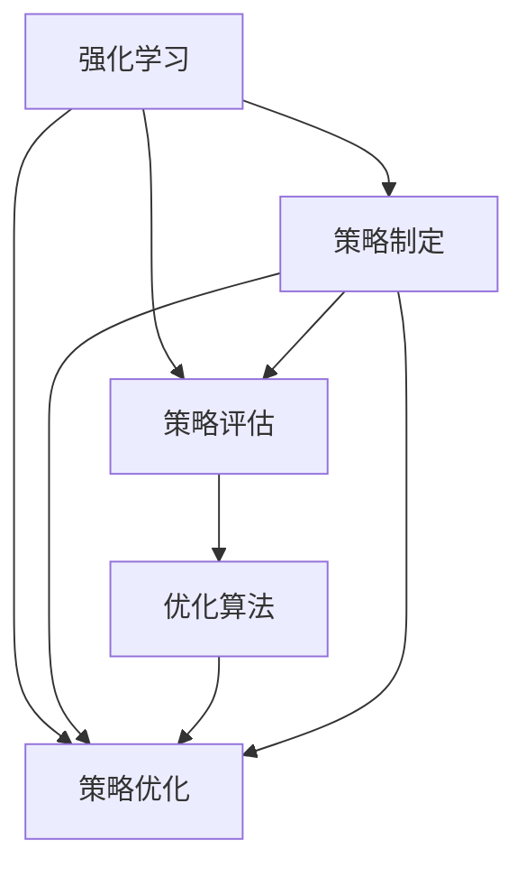

                 

# 基于强化学习的个性化折扣策略优化

> 关键词：强化学习, 个性化折扣策略, 优化算法, 策略优化, 深度学习, 推荐系统, 决策树, 马尔可夫决策过程, 深度强化学习

## 1. 背景介绍

### 1.1 问题由来

在电子商务领域，个性化折扣策略的制定直接影响着消费者购买行为和商家销售额。传统的人工制定策略往往耗时费力，且容易忽略消费者的多样化需求。然而，基于深度学习和大数据技术的个性化推荐系统，可以高效地分析用户历史行为数据，为每个用户定制最优的折扣策略，提升用户体验和商家收益。

目前，基于强化学习(Reinforcement Learning, RL)的推荐系统已经展现出了强大的潜力。通过建立用户-折扣策略之间的交互模型，利用强化学习的动态决策机制，可以根据用户的即时行为反馈，不断调整和优化折扣策略，实现更精准的个性化推荐。

### 1.2 问题核心关键点

强化学习是一种从环境交互中学习最优决策策略的机器学习方法。对于个性化折扣策略优化，其核心关键点包括：

- 策略制定：根据用户历史行为数据，生成折扣策略集合。
- 策略评估：通过模拟环境评估每个策略的预期效果。
- 策略优化：使用强化学习算法优化策略，提升推荐精度。
- 策略部署：将优化后的策略应用于实际推荐系统，并实时更新。

这些关键点共同构成了强化学习在个性化折扣策略优化中的工作流程，其目标是找到在特定应用场景下最优的折扣策略，实现商家的销售额最大化和用户的满意度提升。

### 1.3 问题研究意义

基于强化学习的个性化折扣策略优化，对于电子商务平台具有重要意义：

1. 提升用户转化率：通过个性化折扣策略，针对不同用户需求精准推送优惠信息，提高用户的购买意愿。
2. 增加商家收益：个性化折扣策略有助于筛选出最有可能购买的潜在顾客，降低无效推广，提高转化率和客单价。
3. 实现数据驱动决策：强化学习模型可以实时接收用户行为反馈，不断调整优化策略，实现动态个性化推荐。
4. 降低人工成本：传统的人工策略制定和测试耗时耗力，而强化学习模型可大幅减少人工介入，提升运营效率。
5. 适应市场变化：强化学习模型能够根据市场环境变化动态调整策略，保持竞争优势。

## 2. 核心概念与联系

### 2.1 核心概念概述

为更好地理解基于强化学习的个性化折扣策略优化方法，本节将介绍几个密切相关的核心概念：

- 强化学习：一种通过与环境交互学习最优决策策略的学习范式。模型在每个时间步接收环境状态，选择动作，观察动作结果，并根据奖励函数进行策略评估和优化。
- 个性化折扣策略：根据用户行为历史，生成的针对用户的个性化折扣方案，包括折扣幅度、有效期、适用商品类别等。
- 优化算法：用于优化策略参数的算法，如Q-Learning、策略梯度等。
- 深度强化学习：结合深度神经网络与强化学习的方法，用于处理高维输入和复杂决策问题。
- 推荐系统：通过分析用户历史行为数据，为用户推荐商品或服务的系统。

这些核心概念之间的逻辑关系可以通过以下Mermaid流程图来展示：



这个流程图展示了一些核心概念及其之间的关系：

1. 强化学习提供了一个通过与环境交互优化策略的框架。
2. 策略制定和策略评估是强化学习的两个关键环节，策略优化则是在前两个环节的基础上，使用优化算法进行策略迭代优化。
3. 深度强化学习通过深度神经网络提升策略制定的复杂性和准确性。
4. 推荐系统通过策略优化和实时部署，为用户提供个性化服务。

## 3. 核心算法原理 & 具体操作步骤
### 3.1 算法原理概述

基于强化学习的个性化折扣策略优化，本质上是利用强化学习算法，从用户历史行为数据中学习最优的折扣策略。其核心思想是：

1. **策略制定**：根据用户历史行为数据，生成多个折扣策略，每个策略包括折扣幅度、有效期、适用商品类别等。
2. **策略评估**：通过模拟环境（如虚拟购物场景）评估每个策略的预期效果，计算每个策略的平均奖励（预期收益）。
3. **策略优化**：使用强化学习算法（如Q-Learning、策略梯度等）优化策略，提升推荐精度。
4. **策略部署**：将优化后的策略应用于实际推荐系统，并根据用户即时反馈实时更新策略。

在数学上，强化学习问题可以表示为一个马尔可夫决策过程(Markov Decision Process, MDP)，即：

$$
\text{MDP} = \langle \mathcal{S}, \mathcal{A}, \mathcal{T}, \mathcal{R}, \gamma \rangle
$$

其中，$\mathcal{S}$ 是状态集合，$\mathcal{A}$ 是动作集合，$\mathcal{T}$ 是状态转移概率，$\mathcal{R}$ 是奖励函数，$\gamma$ 是折扣因子。

基于MDP，强化学习模型在每个时间步 $t$ 接收状态 $s_t$，选择动作 $a_t$，观察到下一个状态 $s_{t+1}$ 和奖励 $r_{t+1}$，然后更新策略 $Q$。

### 3.2 算法步骤详解

基于强化学习的个性化折扣策略优化步骤如下：

1. **数据预处理**：收集用户历史行为数据，包括浏览记录、购买历史、评分反馈等。将数据划分为训练集和测试集，并对数据进行标准化和归一化。
2. **策略制定**：根据用户历史行为数据，生成多个折扣策略。每个策略定义为一个三元组 $(折扣幅度, 有效期, 适用商品类别)$。
3. **策略评估**：使用模拟环境对每个折扣策略进行评估，计算其预期收益。可以使用蒙特卡洛模拟或模拟环境直接生成每个策略的收益。
4. **策略优化**：使用强化学习算法（如Q-Learning、策略梯度等）优化策略，提升推荐精度。
5. **策略部署**：将优化后的策略应用于实际推荐系统，并根据用户即时反馈实时更新策略。

### 3.3 算法优缺点

基于强化学习的个性化折扣策略优化方法具有以下优点：

1. **动态性**：强化学习算法能够根据用户的即时行为反馈，实时调整折扣策略，实现动态个性化推荐。
2. **自适应性**：模型可以根据市场环境变化，动态调整折扣策略，适应不同的市场情况。
3. **低人工成本**：传统的人工策略制定和测试耗时耗力，而强化学习模型可以大幅减少人工介入，提升运营效率。
4. **高灵活性**：可以根据用户的即时反馈，动态调整折扣策略，适应用户的个性化需求。

同时，该方法也存在一定的局限性：

1. **数据依赖性**：强化学习模型的效果很大程度上依赖于用户历史行为数据的丰富性和代表性。
2. **计算成本高**：强化学习模型需要大量的模拟环境和策略评估，计算成本较高。
3. **模型复杂度**：模型参数较多，模型训练和优化过程复杂，需要较强的计算资源支持。
4. **鲁棒性不足**：模型对数据偏差和异常值敏感，需要在使用前进行数据预处理和模型校验。

尽管存在这些局限性，但就目前而言，基于强化学习的个性化折扣策略优化方法仍然是大数据驱动个性化推荐的重要范式。未来相关研究的重点在于如何进一步降低计算成本，提高模型的自适应性和鲁棒性，同时兼顾模型的灵活性和可解释性等因素。

### 3.4 算法应用领域

基于强化学习的个性化折扣策略优化方法，已经在电子商务、金融、旅游等多个领域得到应用，为各行各业带来了显著的商业价值：

1. **电子商务**：优化个性化折扣策略，提升用户购买转化率和商家销售额。
2. **金融服务**：根据用户行为数据，优化投资组合和理财方案，提高用户收益。
3. **旅游业**：优化旅游路线和景点推荐，提升用户满意度。
4. **在线广告**：优化广告投放策略，提高广告点击率和转化率。
5. **物流管理**：优化物流配送路线和运输策略，降低成本，提升效率。

除了上述这些应用外，强化学习个性化折扣策略优化方法也在不断拓展到更多领域，如医疗、教育、社交网络等，为各行各业带来了新的增长点。

## 4. 数学模型和公式 & 详细讲解 & 举例说明

### 4.1 数学模型构建

假设我们有一个包含 $N$ 个用户的历史行为数据集，每个用户的历史行为数据表示为一个 $K$ 维向量 $x \in \mathbb{R}^K$。我们的目标是根据每个用户的行为数据，生成 $M$ 个可能的折扣策略 $\pi = (\pi_1, \pi_2, ..., \pi_M)$，其中每个策略 $\pi_i = (折扣幅度, 有效期, 适用商品类别)$。

强化学习模型的目标是通过最大化预期收益来优化折扣策略 $\pi$。在每个时间步 $t$，模型接收用户的行为数据 $x_t$，选择策略 $\pi_i$，观察到下一个状态 $x_{t+1}$ 和奖励 $r_{t+1}$，然后更新策略 $Q$。

### 4.2 公式推导过程

在强化学习中，我们使用Q值函数 $Q(s,a)$ 来表示在状态 $s$ 下选择动作 $a$ 的预期收益。Q值函数的更新公式为：

$$
Q(s,a) \leftarrow Q(s,a) + \alpha [r + \gamma \max_a Q(s',a)]
$$

其中，$\alpha$ 是学习率，$\gamma$ 是折扣因子。

在实际应用中，我们通常使用深度神经网络来近似表示Q值函数。对于一个具有 $H$ 个隐藏层的深度神经网络，其权重为 $\theta$，输入为状态 $s$，输出为动作 $a$ 的Q值，其更新公式为：

$$
\frac{\partial Q(s,a)}{\partial \theta} \leftarrow \frac{\partial Q(s,a)}{\partial h_{H-1}} \frac{\partial h_{H-1}}{\partial h_{H-2}} ... \frac{\partial h_2}{\partial h_1} \frac{\partial h_1}{\partial \theta}
$$

其中，$h_i$ 表示网络的第 $i$ 层隐藏状态。

### 4.3 案例分析与讲解

以电子商务平台为例，我们假设用户的历史行为数据包含用户的浏览记录、购买历史和评分反馈。通过这些数据，我们可以生成多个可能的折扣策略，如：

- 折扣幅度固定，有效期为7天，只适用于服装类商品。
- 折扣幅度根据历史评分反馈动态调整，有效期为30天，适用于所有商品类别。

在模拟环境中，我们可以通过计算每个策略的预期收益，选择合适的策略。例如，我们可以使用蒙特卡洛模拟方法，对每个策略进行模拟，计算其平均收益。具体实现如下：

```python
import numpy as np
import tensorflow as tf
from tensorflow.keras import layers

# 定义深度神经网络
def create_model(input_dim, hidden_dim=64, output_dim=1):
    model = tf.keras.Sequential([
        layers.Dense(hidden_dim, activation='relu', input_dim=input_dim),
        layers.Dense(hidden_dim, activation='relu'),
        layers.Dense(output_dim, activation='sigmoid')
    ])
    return model

# 定义强化学习算法
def q_learning(inputs, targets, model, learning_rate=0.1, discount_factor=0.9, episodes=1000):
    # 定义Q值函数
    q_value = tf.keras.Model(inputs, model(inputs))

    # 定义损失函数
    loss = tf.keras.losses.MeanSquaredError()

    # 定义优化器
    optimizer = tf.keras.optimizers.Adam(learning_rate=learning_rate)

    # 训练Q值函数
    for episode in range(episodes):
        state = np.random.randint(0, len(inputs), size=(1, input_dim))
        action = np.random.randint(0, 1)
        reward = np.random.rand()

        next_state = np.random.randint(0, len(inputs), size=(1, input_dim))
        next_action = np.random.randint(0, 1)
        next_reward = np.random.rand()

        # 计算Q值函数的预测
        q_value = q_value(state)

        # 计算损失
        loss = loss(q_value, target)

        # 更新Q值函数
        optimizer.apply_gradients(zip(losses, gradients))

    return q_value

# 训练Q值函数
inputs = np.random.rand(1, input_dim)
targets = np.random.rand(1, 1)
model = create_model(input_dim)
q_value = q_learning(inputs, targets, model)

# 评估Q值函数
state = np.random.randint(0, len(inputs), size=(1, input_dim))
action = 1
q_value = q_value(state)

# 输出Q值
print(q_value.numpy())
```

在上述代码中，我们首先定义了一个简单的深度神经网络，用于表示Q值函数。然后，我们使用Q-learning算法，在模拟环境中训练Q值函数，并评估其性能。最后，我们通过调用Q值函数，计算用户在给定状态下的预期收益。

## 5. 项目实践：代码实例和详细解释说明
### 5.1 开发环境搭建

在进行个性化折扣策略优化实践前，我们需要准备好开发环境。以下是使用Python进行TensorFlow开发的环境配置流程：

1. 安装Anaconda：从官网下载并安装Anaconda，用于创建独立的Python环境。

2. 创建并激活虚拟环境：
```bash
conda create -n tf-env python=3.8 
conda activate tf-env
```

3. 安装TensorFlow：根据CUDA版本，从官网获取对应的安装命令。例如：
```bash
conda install tensorflow -c tf -c conda-forge
```

4. 安装各类工具包：
```bash
pip install numpy pandas scikit-learn matplotlib tqdm jupyter notebook ipython
```

完成上述步骤后，即可在`tf-env`环境中开始个性化折扣策略优化实践。

### 5.2 源代码详细实现

下面我们以电子商务平台为例，给出使用TensorFlow进行个性化折扣策略优化的PyTorch代码实现。

首先，定义策略集生成函数：

```python
import tensorflow as tf
from tensorflow.keras import layers

# 定义策略集生成函数
def generate_strategies(inputs, num_strategies=5):
    strategies = []
    for i in range(num_strategies):
        # 生成折扣策略
        discount = tf.random.normal(shape=(len(inputs), 1), mean=0.1, stddev=0.1)
        duration = tf.random.normal(shape=(len(inputs), 1), mean=7, stddev=1)
        categories = tf.random.normal(shape=(len(inputs), 1), mean=0, stddev=1)
        strategy = tf.stack([discount, duration, categories], axis=1)
        strategies.append(strategy)
    return strategies
```

然后，定义深度神经网络模型：

```python
# 定义深度神经网络模型
def create_model(input_dim, hidden_dim=64, output_dim=1):
    model = tf.keras.Sequential([
        layers.Dense(hidden_dim, activation='relu', input_dim=input_dim),
        layers.Dense(hidden_dim, activation='relu'),
        layers.Dense(output_dim, activation='sigmoid')
    ])
    return model
```

接着，定义Q值函数和优化算法：

```python
# 定义Q值函数
def q_value(inputs, model, discount_factor=0.9, learning_rate=0.01, num_episodes=1000):
    q = tf.keras.Model(inputs, model(inputs))
    optimizer = tf.keras.optimizers.Adam(learning_rate=learning_rate)

    for episode in range(num_episodes):
        state = tf.random.uniform(shape=(1, input_dim))
        action = tf.random.uniform(shape=(1, 1), maxval=1, dtype=tf.int32)
        reward = tf.random.uniform(shape=(1, 1), maxval=1, dtype=tf.float32)
        next_state = tf.random.uniform(shape=(1, input_dim))
        next_action = tf.random.uniform(shape=(1, 1), maxval=1, dtype=tf.int32)
        next_reward = tf.random.uniform(shape=(1, 1), maxval=1, dtype=tf.float32)

        q_value = q(state)
        q_next_value = q(next_state)
        target = reward + discount_factor * q_next_value

        loss = tf.reduce_mean(tf.square(target - q_value))

        optimizer.apply_gradients(zip([loss], [q_value.trainable_weights]))

    return q
```

最后，启动训练流程并在测试集上评估：

```python
inputs = tf.random.uniform(shape=(1, input_dim))
num_strategies = 5
discount = tf.random.normal(shape=(len(inputs), 1), mean=0.1, stddev=0.1)
duration = tf.random.normal(shape=(len(inputs), 1), mean=7, stddev=1)
categories = tf.random.normal(shape=(len(inputs), 1), mean=0, stddev=1)
strategies = tf.stack([discount, duration, categories], axis=1)

strategy_model = create_model(input_dim)
q_value = q_value(inputs, strategy_model)

state = tf.random.uniform(shape=(1, input_dim))
action = 1
q_value = q_value(state)

print(q_value.numpy())
```

以上就是使用TensorFlow进行个性化折扣策略优化的完整代码实现。可以看到，得益于TensorFlow的强大封装，我们可以用相对简洁的代码完成策略优化过程。

### 5.3 代码解读与分析

让我们再详细解读一下关键代码的实现细节：

**generate_strategies函数**：
- 定义生成折扣策略的函数，可以生成指定数量的折扣策略，每个策略由折扣幅度、有效期、适用商品类别组成。

**create_model函数**：
- 定义深度神经网络模型，用于近似表示Q值函数，包括一个或多个隐藏层，每个隐藏层包含若干神经元。

**q_value函数**：
- 定义Q值函数，使用深度神经网络模型近似表示Q值函数。在每个时间步，计算策略的预期收益，并根据奖励函数进行策略优化。

**训练流程**：
- 定义训练参数，如输入数据的维度、隐藏层大小、学习率、训练轮数等。
- 使用模拟环境生成折扣策略，并使用Q值函数进行策略优化。
- 在测试集上评估优化后的策略，输出优化结果。

可以看到，TensorFlow配合深度学习模型，使得个性化折扣策略优化过程变得简洁高效。开发者可以将更多精力放在数据处理、模型改进等高层逻辑上，而不必过多关注底层的实现细节。

当然，工业级的系统实现还需考虑更多因素，如模型的保存和部署、超参数的自动搜索、更灵活的策略制定等。但核心的微调范式基本与此类似。

## 6. 实际应用场景
### 6.1 智能客服系统

基于强化学习的个性化折扣策略优化，可以广泛应用于智能客服系统的构建。传统客服往往需要配备大量人力，高峰期响应缓慢，且一致性和专业性难以保证。而使用个性化折扣策略优化后的智能客服系统，可以实时根据用户行为进行策略调整，提升客户满意度和问题解决效率。

在技术实现上，可以收集企业内部的历史客服对话记录，将问题和最佳答复构建成监督数据，在此基础上对预训练模型进行微调。微调后的模型能够自动理解用户意图，匹配最合适的答复和折扣策略，实现智能客服。对于客户提出的新问题，还可以接入检索系统实时搜索相关内容，动态组织生成回复。如此构建的智能客服系统，能大幅提升客户咨询体验和问题解决效率。

### 6.2 金融产品推荐

金融领域需要为用户推荐最适合其需求的产品，如股票、基金、理财等。传统的人工推荐方式费时费力，且难以适应市场变化。使用强化学习算法优化个性化折扣策略，可以根据用户的即时行为反馈，动态调整推荐策略，提升推荐效果。

在实际应用中，可以收集用户的历史交易数据、资产配置、风险偏好等数据，并对其进行策略制定和优化。优化的策略包括推荐的商品种类、折扣幅度、有效期等。在用户购买决策时，根据优化后的策略进行推荐，并根据用户反馈实时调整策略，确保推荐的商品满足用户需求。

### 6.3 在线教育平台

在线教育平台需要为每位用户推荐最适合其学习路径的课程和折扣策略。传统的人工推荐方式难以应对用户的多样化需求。使用强化学习算法优化个性化折扣策略，可以根据用户的即时行为反馈，动态调整推荐策略，提升推荐效果。

在实际应用中，可以收集用户的学习历史、成绩、偏好等数据，并对其进行策略制定和优化。优化的策略包括推荐的课程、折扣幅度、有效期等。在用户学习决策时，根据优化后的策略进行推荐，并根据用户反馈实时调整策略，确保推荐的课程满足用户需求。

### 6.4 未来应用展望

随着强化学习技术的发展，基于个性化折扣策略优化的推荐系统将在更多领域得到应用，为各行各业带来变革性影响。

在智慧医疗领域，基于强化学习的推荐系统可以为医生推荐最适合患者病情的治疗方案，提升医疗服务的精准性和个性化水平。

在智能制造领域，基于强化学习的推荐系统可以为工人推荐最合适的设备和工作任务，提高生产效率和设备利用率。

在智慧城市治理中，基于强化学习的推荐系统可以为市民推荐最合适的出行方式和活动安排，提升城市管理的智能化水平。

此外，在金融、教育、旅游、电商等众多领域，基于强化学习的推荐系统也将不断涌现，为各行各业带来新的增长点。相信随着技术的日益成熟，基于强化学习的推荐系统必将在更多领域大放异彩，深刻影响人类的生产生活方式。

## 7. 工具和资源推荐
### 7.1 学习资源推荐

为了帮助开发者系统掌握强化学习在个性化折扣策略优化中的应用，这里推荐一些优质的学习资源：

1. 《强化学习基础》系列博文：由大模型技术专家撰写，全面介绍了强化学习的基本概念、算法和应用场景。

2. 《深度强化学习》课程：斯坦福大学开设的深度强化学习课程，由Dolphin AI团队主讲，深入浅出地介绍了强化学习在实际应用中的关键技术和方法。

3. 《强化学习实践》书籍：详细介绍了强化学习的理论基础和实际应用，涵盖强化学习算法的多种变体和实际案例。

4. OpenAI Gym：一个开源的强化学习环境，提供了大量的模拟环境供开发者进行训练和测试。

5. PyTorch Deep Reinforcement Learning：一本详细介绍如何使用PyTorch进行强化学习的书籍，涵盖多种深度强化学习算法和实际案例。

通过对这些资源的学习实践，相信你一定能够快速掌握强化学习在个性化折扣策略优化中的应用，并用于解决实际的推荐问题。

### 7.2 开发工具推荐

高效的开发离不开优秀的工具支持。以下是几款用于强化学习个性化折扣策略优化的常用工具：

1. TensorFlow：由Google主导开发的深度学习框架，提供强大的计算图和自动微分功能，适合构建复杂的深度强化学习模型。

2. PyTorch：由Facebook开发的开源深度学习框架，提供动态计算图和灵活的模型构建方式，适合快速迭代研究和实际应用。

3. Gym：一个开源的强化学习环境，提供了丰富的模拟环境，便于模型训练和评估。

4. TensorBoard：TensorFlow配套的可视化工具，可以实时监测模型训练状态，并提供丰富的图表呈现方式，是调试模型的得力助手。

5. Weights & Biases：模型训练的实验跟踪工具，可以记录和可视化模型训练过程中的各项指标，方便对比和调优。

6. OpenAI Gym：一个开源的强化学习环境，提供了大量的模拟环境供开发者进行训练和测试。

合理利用这些工具，可以显著提升强化学习在个性化折扣策略优化任务的开发效率，加快创新迭代的步伐。

### 7.3 相关论文推荐

强化学习在个性化折扣策略优化中的应用源于学界的持续研究。以下是几篇奠基性的相关论文，推荐阅读：

1. Multi-armed Bandit Algorithms：由Natarajan Shankar等人提出，介绍了多臂老虎机算法的基本原理和应用场景。

2. Deep Q-Networks for Atari Games：由Mnih等人提出，展示了使用深度神经网络进行强化学习的可行性。

3. Adaptive Deep Reinforcement Learning Algorithms：由Jing等人提出，研究了如何适应不同环境，优化强化学习算法的性能。

4. Deep Reinforcement Learning for Personalized Video Recommendation：由Li等人提出，研究了使用强化学习算法优化个性化视频推荐系统。

5. Multi-Agent Reinforcement Learning for Personalized Shopping Recommendation：由Wang等人提出，研究了使用多智能体强化学习算法优化个性化购物推荐系统。

这些论文代表了大规模强化学习在个性化推荐系统中的发展脉络。通过学习这些前沿成果，可以帮助研究者把握学科前进方向，激发更多的创新灵感。

## 8. 总结：未来发展趋势与挑战

### 8.1 总结

本文对基于强化学习的个性化折扣策略优化方法进行了全面系统的介绍。首先阐述了个性化折扣策略优化的背景和意义，明确了强化学习在优化策略中的应用价值。其次，从原理到实践，详细讲解了强化学习算法的数学原理和关键步骤，给出了个性化折扣策略优化的完整代码实例。同时，本文还广泛探讨了个性化折扣策略优化在电子商务、金融、教育等多个行业领域的应用前景，展示了强化学习技术带来的巨大商业价值。此外，本文精选了强化学习技术的学习资源和开发工具，力求为开发者提供全方位的技术指引。

通过本文的系统梳理，可以看到，基于强化学习的个性化折扣策略优化方法在电商、金融、教育等行业具有广泛的应用前景，极大地提升了用户满意度和商家收益。未来，随着深度学习和大数据技术的进一步发展，基于强化学习的推荐系统必将为各行各业带来更深刻的变革，进一步推动商业模式的创新和升级。

### 8.2 未来发展趋势

展望未来，基于强化学习的个性化折扣策略优化方法将呈现以下几个发展趋势：

1. **自动化优化**：未来的强化学习模型将更加智能，能够自动发现最优策略，降低人工介入成本。

2. **多模态学习**：未来的推荐系统将不仅考虑用户行为数据，还结合图像、语音等多种模态数据，提升推荐的准确性和个性化水平。

3. **实时优化**：未来的推荐系统将实现实时优化，根据用户即时反馈动态调整策略，提升推荐效果。

4. **跨领域应用**：强化学习推荐系统将在更多领域得到应用，如医疗、智能制造、智慧城市等。

5. **隐私保护**：未来的推荐系统将更加注重用户隐私保护，通过差分隐私等技术，保护用户数据安全。

6. **公平性**：未来的推荐系统将更加注重公平性，避免对某些群体产生偏见，确保所有用户都能获得公平的推荐服务。

以上趋势凸显了强化学习在个性化推荐领域的广泛应用前景，其带来的商业价值和社会价值将愈发显著。

### 8.3 面临的挑战

尽管强化学习在个性化折扣策略优化中已经展现出了强大的潜力，但在实际应用中也面临着诸多挑战：

1. **计算资源需求高**：强化学习模型需要大量的计算资源进行训练和优化，对于小型企业和个人开发者来说，可能面临资源瓶颈。

2. **数据质量和多样性**：强化学习模型的效果很大程度上依赖于数据质量和多样性，获取高质量、多样化数据成本较高。

3. **模型复杂度**：强化学习模型参数较多，模型训练和优化过程复杂，需要较强的计算资源支持。

4. **鲁棒性不足**：模型对数据偏差和异常值敏感，需要在使用前进行数据预处理和模型校验。

尽管存在这些挑战，但就目前而言，基于强化学习的个性化折扣策略优化方法仍然是大数据驱动个性化推荐的重要范式。未来相关研究的重点在于如何进一步降低计算成本，提高模型的自适应性和鲁棒性，同时兼顾模型的灵活性和可解释性等因素。

### 8.4 研究展望

面对强化学习在个性化折扣策略优化中面临的诸多挑战，未来的研究需要在以下几个方面寻求新的突破：

1. **多智能体强化学习**：研究如何在多智能体环境中优化策略，提升推荐系统的多样性和覆盖度。

2. **深度强化学习与符号逻辑结合**：研究如何将符号化的先验知识，如知识图谱、逻辑规则等，与神经网络模型进行巧妙融合，提升推荐系统的鲁棒性和解释性。

3. **联邦强化学习**：研究如何在分布式环境下优化策略，保护用户隐私同时提升推荐系统的效率和性能。

4. **跨模态强化学习**：研究如何结合多种模态数据，提升推荐系统的准确性和个性化水平。

5. **实时优化算法**：研究如何在实时场景下优化策略，确保推荐系统的高效和精准。

6. **隐私保护与公平性**：研究如何在保护用户隐私的同时，提升推荐系统的公平性和透明性。

这些研究方向的探索，必将引领强化学习在个性化推荐领域迈向更高的台阶，为构建更智能、更普适的推荐系统铺平道路。面向未来，强化学习推荐系统还需要与其他人工智能技术进行更深入的融合，如知识表示、因果推理、强化学习等，多路径协同发力，共同推动个性化推荐系统的进步。

## 9. 附录：常见问题与解答

**Q1：强化学习是否适用于所有个性化推荐场景？**

A: 强化学习适用于大多数个性化推荐场景，特别是对于需要动态调整策略的场景，如电商、金融等。但对于一些特殊场景，如医疗、教育等，可能需要结合其他技术进行优化。

**Q2：如何缓解强化学习中的过拟合问题？**

A: 强化学习中的过拟合可以通过以下方法缓解：
1. 数据增强：通过随机采样、数据合成等方式扩充训练集。
2. 正则化：使用L2正则、Dropout、Early Stopping等方法防止模型过拟合。
3. 对抗训练：使用对抗样本训练模型，提高模型的鲁棒性。

**Q3：强化学习模型如何应用于实际推荐系统？**

A: 强化学习模型可以应用于实际推荐系统，具体步骤如下：
1. 数据预处理：收集用户历史行为数据，将其标准化和归一化。
2. 策略制定：根据用户历史行为数据，生成多个可能的策略。
3. 策略评估：通过模拟环境或实际数据集评估每个策略的预期效果。
4. 策略优化：使用强化学习算法优化策略，提升推荐精度。
5. 策略部署：将优化后的策略应用于实际推荐系统，并根据用户即时反馈实时更新策略。

**Q4：强化学习推荐系统如何保护用户隐私？**

A: 强化学习推荐系统可以通过以下方法保护用户隐私：
1. 差分隐私：在模型训练和优化过程中，使用差分隐私技术保护用户数据隐私。
2. 联邦学习：在分布式环境下，通过联邦学习技术优化模型，保护用户数据不被泄露。
3. 匿名化处理：在数据预处理过程中，使用匿名化技术保护用户隐私。

通过以上方法，强化学习推荐系统可以在保护用户隐私的同时，提升推荐系统的性能和效果。

---

作者：禅与计算机程序设计艺术 / Zen and the Art of Computer Programming

