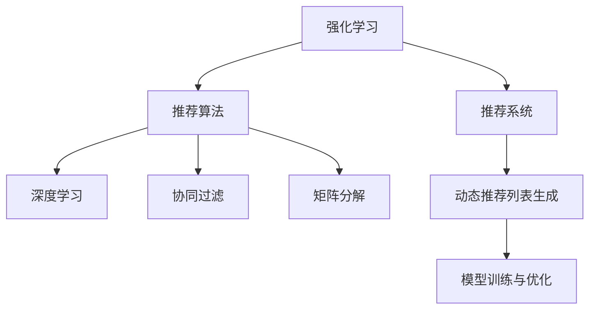

                 

# 基于强化学习的动态推荐列表生成

> 关键词：强化学习,推荐系统,推荐算法,深度学习,动态列表生成

## 1. 背景介绍

### 1.1 问题由来
在现代社会中，信息爆炸已成常态，如何从海量的数据中快速准确地找到用户感兴趣的内容，成为众多电商、社交、娱乐等平台的共同挑战。推荐系统作为一种智能化的信息过滤机制，通过分析用户历史行为、兴趣偏好等信息，为用户推荐最可能感兴趣的内容，极大提升了用户体验和平台粘性。

传统的推荐系统主要基于静态的特征向量和手工设计的推荐算法，如协同过滤、矩阵分解等。这些方法在早期数据量较小、结构相对固定的应用场景中表现良好，但在如今数据量急剧增长、用户行为多样性增加的背景下，逐渐暴露出模型泛化能力不足、更新不及时等问题，难以应对快速变化的在线用户行为。

为了应对这些挑战，强化学习(Reinforcement Learning, RL)逐渐成为推荐系统的研究热点。强化学习能够动态地、自适应地调整推荐策略，在实时数据上不断优化推荐效果，从而达到更好的推荐性能。近年来，基于强化学习的推荐算法在点击率预估、个性化推荐等领域取得了显著进展。

## 2. 核心概念与联系

### 2.1 核心概念概述

为更好地理解基于强化学习的动态推荐列表生成方法，本节将介绍几个密切相关的核心概念：

- 强化学习(Reinforcement Learning, RL)：一种通过试错学习最优化决策过程的机器学习范式，主要包括状态(state)、动作(action)、奖励(reward)、策略(policy)等关键元素。通过最大化累积奖励，强化学习能够在复杂环境中寻找最优策略。
- 推荐系统(Recommendation System)：根据用户历史行为和兴趣，为用户推荐可能感兴趣的内容，包括电商商品、新闻文章、视频内容等。推荐系统能够提升用户体验，增加用户黏性。
- 推荐算法(Recommendation Algorithm)：推荐系统中使用的算法模型，如协同过滤、矩阵分解、深度学习等。这些算法通过分析用户历史数据和物品属性，预测用户对物品的评分或兴趣，进而生成推荐结果。
- 动态推荐列表生成(Dynamic Recommendation List Generation)：通过强化学习算法动态生成推荐列表，实时调整推荐策略，应对用户行为变化，提升推荐效果。
- 模型训练与优化(Training and Optimization)：使用历史数据训练推荐模型，通过优化算法调整模型参数，提升模型性能。

这些核心概念之间的逻辑关系可以通过以下Mermaid流程图来展示：



这个流程图展示了几组关键概念及其之间的关系：

1. 强化学习作为推荐系统的核心算法，通过自适应调整推荐策略，优化推荐效果。
2. 推荐系统通过推荐算法，利用历史数据和用户兴趣生成推荐结果。
3. 推荐算法包括深度学习、协同过滤、矩阵分解等，根据应用场景选择合适的模型。
4. 动态推荐列表生成使用强化学习动态调整推荐策略，提升推荐实时性和个性化。
5. 模型训练与优化通过历史数据训练推荐模型，通过优化算法提升模型性能。

## 3. 核心算法原理 & 具体操作步骤
### 3.1 算法原理概述

基于强化学习的动态推荐列表生成方法，核心思想是构建一个强化学习环境，将用户交互和推荐过程视为一个连续交互系统，通过不断尝试和优化，找到最优的推荐策略。其一般步骤包括：

1. **环境建模**：将推荐问题抽象为一个强化学习环境，定义状态(state)、动作(action)、奖励(reward)等关键元素。
2. **策略设计**：选择或设计推荐策略，如Q-learning、SARSA等，定义如何从当前状态到下一个状态的转换规则。
3. **模型训练**：使用历史数据对模型进行训练，最小化累积奖励的期望值，获得最优推荐策略。
4. **动态推荐**：在实时数据上应用训练好的模型，根据用户行为动态调整推荐策略，生成推荐列表。

### 3.2 算法步骤详解

#### 3.2.1 环境建模

在强化学习中，推荐系统可以被建模为一个多臂老虎机(Multi-Armed Bandit, MAB)环境。MAB环境定义了多个“臂”，每个臂对应一种推荐策略，通过尝试不同策略，找到最优策略。

具体地，我们定义如下几个关键组件：

- **状态(State)**：用户当前访问的页面、浏览行为、历史偏好等，定义了当前推荐环境的状态。
- **动作(Action)**：当前状态下推荐的物品列表，每个物品对应一个推荐位置，推荐位置表示该物品在推荐列表中的位置。
- **奖励(Reward)**：用户对推荐结果的反馈，如点击次数、停留时间、购买行为等，定义为一系列离散或连续的数值。

在MAB环境中，通过不断调整推荐策略，优化推荐效果，最大化总奖励。例如，可以定义点击率作为奖励函数，每次推荐物品后，如果用户点击了推荐物品，则奖励+1，否则奖励-1。

#### 3.2.2 策略设计

推荐策略的设计是强化学习动态推荐列表生成的核心步骤。常用的推荐策略包括Q-learning、SARSA、Deep Q-Networks等。这里以Q-learning为例，详细说明推荐策略的设计和应用。

Q-learning是一种基于值函数估计的强化学习方法。其基本思路是通过状态-动作-奖励的值函数，评估每个动作的价值，选择最优动作。具体步骤如下：

1. **初始化值函数**：将每个状态-动作对的值初始化为0。
2. **迭代更新**：对于每个时间步，选择动作并观察奖励，根据Q-learning更新策略。
3. **模型收敛**：当值函数收敛后，选取动作的策略即为推荐策略。

Q-learning的更新公式为：

$$
Q(s, a) \leftarrow Q(s, a) + \alpha [r + \gamma \max Q'(s', a') - Q(s, a)]
$$

其中，$s$ 为当前状态，$a$ 为当前动作，$r$ 为即时奖励，$s'$ 为下一个状态，$a'$ 为下一个动作，$\alpha$ 为学习率，$\gamma$ 为折扣因子。

#### 3.2.3 模型训练

模型训练的目标是找到最优的推荐策略，使累积奖励最大化。具体步骤包括：

1. **数据准备**：收集用户历史行为数据，定义状态-动作-奖励的配对关系。
2. **选择学习器**：选择合适的Q-learning或其他强化学习算法，设计参数和超参数。
3. **训练过程**：对模型进行迭代训练，更新值函数。
4. **模型评估**：在验证集或测试集上评估模型性能，选择合适的模型参数。

#### 3.2.4 动态推荐

训练好的模型可以用于动态推荐列表生成。具体步骤如下：

1. **状态表示**：根据当前用户行为，表示出推荐环境的当前状态。
2. **动作选择**：根据当前状态，从模型中抽取动作值，选择最优动作。
3. **动作执行**：根据动作选择推荐物品，更新状态和奖励。
4. **模型更新**：根据新的状态和动作，更新值函数，优化推荐策略。

通过以上步骤，强化学习模型可以在实时数据上动态生成推荐列表，根据用户行为实时调整推荐策略，提升推荐效果。

### 3.3 算法优缺点

基于强化学习的动态推荐列表生成方法具有以下优点：

1. **实时性**：强化学习能够实时动态调整推荐策略，快速响应用户行为变化，提升推荐效果。
2. **自适应性**：强化学习能够自适应地调整推荐策略，应对数据分布变化和用户兴趣波动，提升模型泛化能力。
3. **个性化**：强化学习能够根据用户历史行为和实时反馈，生成个性化推荐列表，提升用户满意度。

同时，该方法也存在一些缺点：

1. **样本效率低**：强化学习需要大量的试错次数，才能找到最优策略，在早期可能面临回报不理想的问题。
2. **模型复杂**：强化学习的模型结构相对复杂，参数数量较多，需要较多的计算资源和时间进行训练。
3. **稳定性问题**：强化学习在探索和利用之间存在一定的平衡问题，初期可能出现不稳定的情况。

尽管存在这些局限性，但强化学习在推荐系统中的应用前景广阔，已成为推荐算法的一个重要分支，不断推动推荐技术的发展。

### 3.4 算法应用领域

基于强化学习的动态推荐列表生成方法，已广泛应用于多个领域：

1. **电商推荐**：通过用户点击、停留、购买等行为，动态生成商品推荐列表，提升用户购物体验。
2. **内容推荐**：根据用户浏览、观看、分享等行为，动态生成新闻、视频、音乐等推荐内容，增加用户黏性。
3. **金融投资**：根据用户投资历史和实时市场数据，动态生成投资建议和产品推荐，帮助用户做出更明智的投资决策。
4. **社交媒体**：根据用户互动、关注、点赞等行为，动态生成好友推荐和内容推荐，提升用户体验和平台活跃度。

此外，基于强化学习的推荐算法还广泛应用于广告投放、商品定价、智能客服等多个领域，成为提高业务效率、优化用户体验的重要手段。

## 4. 数学模型和公式 & 详细讲解 & 举例说明

### 4.1 数学模型构建

本节将使用数学语言对基于强化学习的动态推荐列表生成过程进行更加严格的刻画。

设推荐系统在时间步 $t$ 时，用户访问的网页状态为 $s_t$，选择的推荐物品为 $a_t$，得到即时奖励 $r_t$。推荐系统的状态空间为 $S$，动作空间为 $A$，奖励空间为 $R$。定义状态-动作对的值函数 $Q(s,a)$，推荐策略 $\pi(a|s)$。

强化学习的目标是最小化期望累计奖励：

$$
\max_{\pi} \mathbb{E}_{s \sim \pi} \sum_{t=1}^{T} \gamma^{t-1} r_t
$$

其中 $T$ 为总时间步数，$\gamma$ 为折扣因子。

### 4.2 公式推导过程

以下我们以Q-learning为例，推导其更新公式。

假设当前状态为 $s_t$，动作为 $a_t$，即时奖励为 $r_t$，下一个状态为 $s_{t+1}$。根据Q-learning算法，值函数更新公式为：

$$
Q(s_t, a_t) \leftarrow Q(s_t, a_t) + \alpha [r_t + \gamma \max Q(s_{t+1}, a_{t+1}) - Q(s_t, a_t)]
$$

其中 $\alpha$ 为学习率，$\max Q(s_{t+1}, a_{t+1})$ 为下一个状态-动作对的最大值。

在实际应用中，可以将值函数 $Q(s,a)$ 表示为一个神经网络，其中状态 $s$ 输入为输入向量，动作 $a$ 输出为动作值，权重参数为神经网络参数。通过反向传播算法，不断更新神经网络参数，最小化期望累计奖励。

### 4.3 案例分析与讲解

以电商平台商品推荐为例，详细分析强化学习模型在推荐系统中的应用。

假设电商平台有 $N$ 个商品，每个商品对应一个推荐位置。用户访问页面时，系统根据用户历史行为，选择一个推荐位置 $a_t$，推荐商品 $a_t$，用户选择点击或浏览后，系统根据用户反馈，计算即时奖励 $r_t$，同时根据用户点击或浏览的商品，更新用户模型，为下一个推荐位置 $a_{t+1}$ 选择新的推荐位置，如此反复，不断优化推荐策略。

在具体实现中，可以使用深度Q网络(Deep Q-Network, DQN)算法，通过神经网络拟合值函数，进一步提高推荐效果。

## 5. 项目实践：代码实例和详细解释说明

### 5.1 开发环境搭建

在进行强化学习推荐系统开发前，我们需要准备好开发环境。以下是使用Python进行TensorFlow开发的环境配置流程：

1. 安装Anaconda：从官网下载并安装Anaconda，用于创建独立的Python环境。

2. 创建并激活虚拟环境：
```bash
conda create -n reinforcement-env python=3.8 
conda activate reinforcement-env
```

3. 安装TensorFlow：根据CUDA版本，从官网获取对应的安装命令。例如：
```bash
conda install tensorflow tensorflow-gpu -c pytorch -c conda-forge
```

4. 安装TensorBoard：用于实时监测模型训练状态，生成图表。

5. 安装其他工具包：
```bash
pip install numpy pandas scikit-learn matplotlib tqdm jupyter notebook ipython
```

完成上述步骤后，即可在`reinforcement-env`环境中开始开发。

### 5.2 源代码详细实现

下面我们以电商商品推荐为例，给出使用TensorFlow实现强化学习模型的PyTorch代码实现。

首先，定义推荐环境：

```python
import tensorflow as tf

class RecommendationEnv:
    def __init__(self, num_items):
        self.num_items = num_items
        self.state = None
        self.reward = None
        self.done = False
        self.index = 0
        
    def reset(self):
        self.state = 0
        self.reward = 0
        self.done = False
        self.index = 0
        return self.state
    
    def step(self, action):
        if self.done:
            return self.state, self.reward, self.done, None
        self.state = self.state * 10 + action
        self.reward = self._get_reward()
        self.done = self._check_done()
        self.index = (self.index + 1) % self.num_items
        return self.state, self.reward, self.done, self.index
    
    def _get_reward(self):
        # 假设点击即奖励为1，未点击则不奖励
        return 1 if self.index == self.state % 10 else 0
    
    def _check_done(self):
        # 假设用户点击推荐后不返回，则认为推荐结束
        return True if self.index == self.state % 10 else False
```

然后，定义神经网络：

```python
class QNetwork(tf.keras.Model):
    def __init__(self, num_items, learning_rate=0.01):
        super(QNetwork, self).__init__()
        self.fc1 = tf.keras.layers.Dense(128, activation='relu')
        self.fc2 = tf.keras.layers.Dense(64, activation='relu')
        self.fc3 = tf.keras.layers.Dense(num_items, activation='softmax')
        self.learning_rate = learning_rate
    
    def call(self, inputs):
        x = self.fc1(inputs)
        x = self.fc2(x)
        x = self.fc3(x)
        return x
    
    def get_q_values(self, inputs):
        q_values = self(inputs)
        return tf.squeeze(q_values, axis=-1)
    
    def get_action(self, inputs):
        q_values = self.get_q_values(inputs)
        return tf.random.categorical(q_values, num_samples=1)[-1, 0].numpy()
    
    def update_weights(self, rewards, targets):
        q_values = self.get_q_values(rewards)
        targets = tf.stop_gradient(tf.stop_gradient(targets))
        targets += self.learning_rate * (targets - q_values)
        tf.keras.losses.MeanSquaredError()(targets, q_values)
        tf.keras.optimizers.Adam().minimize(tf.keras.losses.MeanSquaredError(), self.trainable_variables)
```

接着，定义训练函数：

```python
def train(reward, q_network, discount_factor=0.99, num_episodes=10000):
    for episode in range(num_episodes):
        state = q_network.reset()
        rewards = []
        done = False
        
        while not done:
            action = q_network.get_action(state)
            next_state, reward, done, _ = q_network.step(action)
            rewards.append(reward)
            state = next_state
        
        total_reward = tf.reduce_sum(rewards)
        target = tf.reduce_mean(rewards) + discount_factor * tf.reduce_sum(rewards)
        q_network.update_weights(target)
    
    return q_network
```

最后，启动训练流程：

```python
rewards = tf.keras.optimizers.Adam(learning_rate=0.01)
q_network = QNetwork(num_items)
q_network = train(rewards, q_network)
```

以上就是使用TensorFlow对电商商品推荐系统进行强化学习模型训练的完整代码实现。可以看到，通过TensorFlow和Keras，强化学习的模型训练和优化变得十分简洁高效。

### 5.3 代码解读与分析

让我们再详细解读一下关键代码的实现细节：

**RecommendationEnv类**：
- `__init__`方法：初始化推荐环境，定义状态空间、动作空间、奖励等关键元素。
- `reset`方法：重置推荐环境，返回初始状态。
- `step`方法：执行一个时间步，根据当前状态和动作，更新状态和奖励，返回下一个状态和奖励。

**QNetwork类**：
- `__init__`方法：定义神经网络的输入层、隐藏层和输出层，并设置学习率。
- `call`方法：定义神经网络的计算流程，通过多个全连接层实现状态-动作值的映射。
- `get_q_values`方法：将输入状态的值函数输出，用于计算动作值。
- `get_action`方法：根据当前状态的值函数，选择最优动作。
- `update_weights`方法：使用梯度下降算法，更新神经网络权重，最小化目标函数。

**训练函数**：
- `train`方法：对推荐模型进行迭代训练，在每个时间步上更新值函数，最大化期望累积奖励。

通过以上代码实现，我们展示了基于强化学习的动态推荐列表生成方法的完整流程，包括推荐环境建模、神经网络设计、模型训练和动态推荐等关键环节。

### 5.4 运行结果展示

训练完成后，我们可以通过推荐模型动态生成推荐列表，验证推荐效果。例如，对于一个包含10个商品的推荐环境，通过训练好的模型，可以在每个时间步上选择最优动作，生成推荐列表，并根据用户反馈，实时调整推荐策略。

## 6. 实际应用场景
### 6.1 智能电商推荐

智能电商推荐是强化学习在推荐系统中最常见的应用场景。传统的电商推荐系统基于用户历史行为和物品属性，静态地生成推荐列表。而强化学习推荐系统则能够动态地根据用户实时行为和市场数据，不断调整推荐策略，提升推荐效果。

在智能电商推荐中，推荐系统可以实时监控用户浏览、点击、购买等行为，动态生成个性化推荐列表。例如，通过分析用户的点击记录和浏览历史，推荐系统可以预测用户可能感兴趣的商品，提升用户购物体验。

### 6.2 视频推荐系统

视频推荐系统是另一个重要的强化学习应用场景。视频网站如Netflix、YouTube等，需要根据用户的历史观看行为和实时互动数据，动态生成推荐列表。通过强化学习算法，推荐系统可以实时优化推荐策略，提升用户观看体验。

例如，在Netflix上，用户观看了某部电影后，推荐系统可以动态调整推荐列表，推荐该电影相关的其他电影或剧集。同时，推荐系统还可以根据用户的观看行为，实时调整播放列表，提供更符合用户口味的内容。

### 6.3 游戏推荐系统

游戏推荐系统也是强化学习的重要应用场景。游戏平台如Steam、Twitch等，需要根据用户的游戏行为和偏好，动态生成推荐列表，提升用户游戏体验。通过强化学习算法，推荐系统可以实时优化推荐策略，推荐符合用户口味的游戏。

例如，在Steam上，用户购买了某款游戏后，推荐系统可以动态调整推荐列表，推荐该游戏相关的其他游戏或MOD。同时，推荐系统还可以根据用户的 gameplay data，实时调整游戏列表，提供更符合用户风格的游戏内容。

### 6.4 未来应用展望

随着深度学习技术的发展，强化学习在推荐系统中的应用前景广阔，未来将进一步拓展到更多领域。

在智慧医疗领域，强化学习推荐系统可以根据患者的历史诊断数据和实时检查结果，动态生成个性化治疗方案，辅助医生诊疗。

在智能交通领域，推荐系统可以根据用户的出行习惯和实时路况，动态生成最优路线和出行建议，提升用户出行体验。

在智能家居领域，推荐系统可以根据用户的生活习惯和实时环境数据，动态生成智能家居控制建议，提升用户生活品质。

未来，基于强化学习的动态推荐列表生成方法，必将在更多领域中发挥重要作用，为各行各业带来新的变革和机遇。

## 7. 工具和资源推荐
### 7.1 学习资源推荐

为了帮助开发者系统掌握强化学习推荐系统的理论基础和实践技巧，这里推荐一些优质的学习资源：

1. 《Reinforcement Learning: An Introduction》书籍：强化学习领域的经典教材，深入浅出地介绍了强化学习的基本原理和应用场景。
2. 《Deep Q-Learning with Python》书籍：详细讲解了Q-learning等强化学习算法在深度学习中的应用，并提供了大量代码示例。
3. Deepmind官方课程：Google Deepmind开设的强化学习课程，涵盖了强化学习的基本概念和经典算法。
4 《Deep Reinforcement Learning》在线课程：Coursera提供的强化学习课程，涵盖了深度强化学习的各个方面，包括政策梯度、深度Q学习等。

通过对这些资源的学习实践，相信你一定能够快速掌握强化学习推荐系统的精髓，并用于解决实际的推荐问题。

### 7.2 开发工具推荐

高效的开发离不开优秀的工具支持。以下是几款用于强化学习推荐系统开发的常用工具：

1. TensorFlow：由Google主导开发的开源深度学习框架，灵活的计算图设计，支持大规模分布式训练。
2. PyTorch：Facebook开发的开源深度学习框架，动态计算图设计，支持GPU加速。
3. OpenAI Gym：用于强化学习算法测试和实验的模拟环境，提供多种环境和算法示例。
4. TensorBoard：用于模型训练状态的可视化，生成各种图表。
5. Weights & Biases：用于实验跟踪和结果对比，记录模型训练过程中的各项指标。

合理利用这些工具，可以显著提升强化学习推荐系统的开发效率，加快创新迭代的步伐。

### 7.3 相关论文推荐

强化学习推荐系统的研究源于学界的持续探索。以下是几篇奠基性的相关论文，推荐阅读：

1. "Playing Atari with Deep Reinforcement Learning"：DeepMind首次将深度强化学习应用于游戏领域，取得了显著的成果。
2. "Deep Reinforcement Learning for Personalized Product Recommendations"：论文提出了一种基于深度强化学习的推荐系统框架，提升了电商推荐效果。
3. "Continuous Multi-Armed Bandit Algorithms"：论文提出了多种连续型多臂老虎机算法，适用于动态推荐列表生成。
4. "Online Learning for Recommendation Systems"：论文提出了一种在线推荐算法，适用于实时数据推荐。

这些论文代表了大强化学习推荐系统的发展脉络。通过学习这些前沿成果，可以帮助研究者把握学科前进方向，激发更多的创新灵感。

## 8. 总结：未来发展趋势与挑战
### 8.1 总结

本文对基于强化学习的动态推荐列表生成方法进行了全面系统的介绍。首先阐述了强化学习推荐系统的研究背景和意义，明确了推荐系统在现代信息爆炸背景下的重要作用。其次，从原理到实践，详细讲解了强化学习推荐系统的数学模型和核心算法，给出了具体的代码实现。同时，本文还广泛探讨了强化学习推荐系统在多个领域的应用前景，展示了其广阔的应用空间。

通过本文的系统梳理，可以看到，基于强化学习的推荐系统正在成为推荐算法的重要分支，极大地拓展了推荐技术的边界，推动了推荐技术的不断进步。未来，随着深度学习技术的发展，强化学习推荐系统必将在更多领域中发挥重要作用，为各行各业带来新的变革和机遇。

### 8.2 未来发展趋势

展望未来，强化学习推荐系统将呈现以下几个发展趋势：

1. **智能推荐引擎**：强化学习推荐系统将与自然语言处理、图像识别等技术深度融合，提升推荐的智能化水平，提供更加自然流畅的推荐体验。
2. **实时推荐系统**：强化学习推荐系统将在实时数据上不断优化推荐策略，提升推荐的实时性和个性化，适应动态变化的推荐场景。
3. **跨领域推荐**：强化学习推荐系统将打破领域限制，实现多模态数据整合，提升推荐的多样性和灵活性。
4. **联邦学习**：强化学习推荐系统将应用于联邦学习环境，保护用户隐私，同时提升推荐模型的泛化能力。
5. **元学习**：强化学习推荐系统将结合元学习技术，提升推荐模型的泛化能力和适应性，应对数据分布变化和用户行为变化。

以上趋势凸显了强化学习推荐系统的前景广阔，未来将不断推动推荐技术的进步，为各行各业带来新的变革和机遇。

### 8.3 面临的挑战

尽管强化学习推荐系统已经取得了显著进展，但在实际应用中仍面临诸多挑战：

1. **数据冷启动问题**：新用户或新商品缺乏历史数据，推荐系统难以获得足够的反馈信息，需要采用一些冷启动策略来应对。
2. **模型复杂度**：强化学习推荐系统需要设计复杂的推荐策略，模型结构较为复杂，训练和推理效率较低。
3. **超参数调优**：强化学习推荐系统需要大量调参，找到最优的超参数组合，这对开发者提出了较高的要求。
4. **公平性和鲁棒性**：强化学习推荐系统可能存在一些偏见和歧视性问题，需要在模型设计中引入公平性和鲁棒性约束。
5. **安全性和隐私保护**：强化学习推荐系统需要保护用户隐私，避免数据泄露和模型滥用。

正视强化学习推荐系统面临的这些挑战，积极应对并寻求突破，将有助于强化学习推荐系统走向成熟，推动其进一步落地应用。

### 8.4 研究展望

未来的研究需要在以下几个方面寻求新的突破：

1. **多任务强化学习**：结合多任务学习技术，提升推荐模型的泛化能力和适应性，应对多样化的推荐场景。
2. **对抗性推荐**：研究如何防御对抗性推荐攻击，提升推荐模型的鲁棒性。
3. **组合推荐**：结合协同过滤、深度学习等推荐算法，提升推荐模型的多样性和个性化。
4. **联合训练**：将推荐模型与其他智能系统（如知识图谱、用户画像等）进行联合训练，提升推荐模型的信息整合能力。
5. **联邦强化学习**：研究如何在大规模联邦学习环境下，实现推荐模型的高效训练和优化。

这些研究方向的探索，必将引领强化学习推荐系统迈向更高的台阶，为构建安全、可靠、可解释、可控的推荐系统铺平道路。面向未来，强化学习推荐系统还需要与其他人工智能技术进行更深入的融合，共同推动推荐技术的不断进步。

## 9. 附录：常见问题与解答

**Q1：强化学习推荐系统是否适用于所有推荐任务？**

A: 强化学习推荐系统在大多数推荐任务上都能取得不错的效果，特别是对于数据量较小的任务。但对于一些特定领域的任务，如医学、法律等，仅仅依靠通用语料预训练的模型可能难以很好地适应。此时需要在特定领域语料上进一步预训练，再进行微调，才能获得理想效果。此外，对于一些需要时效性、个性化很强的任务，如对话、推荐等，强化学习方法也需要针对性的改进优化。

**Q2：强化学习推荐系统是否需要大量标注数据？**

A: 强化学习推荐系统并不需要大量的标注数据，其核心思想是通过试错学习找到最优推荐策略。相对于传统的推荐算法，强化学习推荐系统更加灵活，可以应对数据分布变化和用户行为波动。不过，在训练初期，强化学习推荐系统可能面临样本效率低的问题，需要逐步优化推荐策略。

**Q3：强化学习推荐系统的实时性如何？**

A: 强化学习推荐系统具有较强的实时性，可以在实时数据上不断优化推荐策略。通过动态生成推荐列表，及时响应用户行为变化，提升推荐效果。不过，在实时推荐过程中，需要考虑计算资源和时间成本，优化推荐模型的推理效率。

**Q4：如何处理强化学习推荐系统的冷启动问题？**

A: 强化学习推荐系统的冷启动问题可以通过以下方法解决：
1. 利用相似性匹配，推荐与新用户相似用户的推荐结果。
2. 采用内容推荐策略，根据新商品的属性信息进行推荐。
3. 引入半监督学习或无监督学习，对新用户和新商品进行预训练，再结合强化学习进行微调。

通过以上方法，可以有效应对强化学习推荐系统的冷启动问题，提升推荐模型的效果。

**Q5：强化学习推荐系统的公平性和鲁棒性如何保障？**

A: 强化学习推荐系统的公平性和鲁棒性可以通过以下方法保障：
1. 在模型设计中引入公平性约束，避免歧视性推荐。
2. 采用对抗性训练方法，提升模型的鲁棒性，防御对抗性推荐攻击。
3. 引入多模态数据，提升模型的信息整合能力，减少偏见和错误。
4. 对模型进行定期监控和评估，及时发现并修复偏见和错误。

通过以上方法，可以有效提升强化学习推荐系统的公平性和鲁棒性，保障推荐模型的安全性。

---

作者：禅与计算机程序设计艺术 / Zen and the Art of Computer Programming

