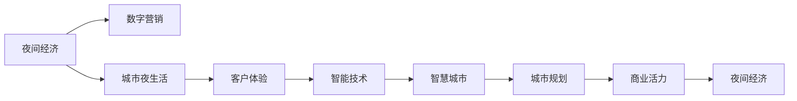

                 

# 夜间经济创业：挖掘城市夜生活的潜力

> 关键词：夜间经济,城市夜生活,数字营销,数据驱动,客户体验,城市规划,商业活力,智能技术,智慧城市

## 1. 背景介绍

### 1.1 问题由来
随着城市化进程的加速和生活节奏的加快，城市夜生活逐渐成为人们日常生活的重要组成部分。夜间经济（Night-time Economy）指在18:00至次日6:00之间，各种形式的商业活动，包括餐饮、娱乐、购物等。夜间经济的繁荣程度不仅反映了城市的商业活力和创新能力，也是城市居民生活质量的重要指标。

然而，现有的夜间经济活动主要依赖于经验和直觉进行规划和管理，缺乏科学的数据支撑和精准的市场分析。传统的营销手段如平面广告、电视广播等效果有限，未能最大化挖掘城市夜生活的潜力。此外，城市规划和管理中对夜间经济的重要性认识不足，未能从整体上进行系统优化。

### 1.2 问题核心关键点
本文聚焦于如何利用数字技术和大数据手段，对夜间经济进行全面分析和精准管理，挖掘城市夜生活的巨大潜力。重点探讨以下核心问题：

- 如何收集和处理大量夜间经济数据，构建城市夜生活的大数据平台？
- 如何利用机器学习算法，分析夜间经济中的规律和趋势，提升商业决策的科学性？
- 如何通过智能技术优化城市规划和管理，提升夜间经济的活力和可持续性？
- 如何利用客户行为数据，提升夜间经济活动中的客户体验，提升用户满意度和忠诚度？

这些问题涉及城市规划、商业决策、数据处理、客户体验等多个方面，只有通过综合性的解决方案，才能真正挖掘城市夜生活的潜力。

## 2. 核心概念与联系

### 2.1 核心概念概述

为更好地理解本文的研究方向，本节将介绍几个关键概念及其联系：

- **夜间经济（Night-time Economy）**：指在18:00至次日6:00之间，各种形式的商业活动，包括餐饮、娱乐、购物等。夜间经济的繁荣程度是城市商业活力和居民生活质量的重要指标。

- **城市夜生活（Urban Nightlife）**：指城市居民在夜间参与的各种休闲娱乐活动，如夜游、夜购、夜娱等。夜生活的丰富程度反映了城市的多元文化和居民的消费能力。

- **数字营销（Digital Marketing）**：利用互联网技术和数据分析手段，进行产品和服务的推广和销售，是现代商业运营的重要手段。

- **客户体验（Customer Experience）**：指客户在消费过程中感受到的情绪和印象，包括服务质量、环境舒适度、活动多样性等。

- **智能技术（Smart Technology）**：利用人工智能、物联网、大数据等技术，实现对城市夜生活的智能化管理和优化。

- **智慧城市（Smart City）**：基于信息通信技术，通过感知、处理、优化等手段，实现城市治理和公共服务的智能化、精准化。

这些核心概念共同构成了本文的研究框架，通过综合运用数字营销、数据分析、智能技术和城市规划等手段，提升夜间经济的活力和可持续性，提升城市居民的生活质量。

### 2.2 核心概念联系（Mermaid 流程图）



这个流程图展示了各个核心概念之间的联系：

1. 夜间经济通过数字营销手段进行推广，吸引更多消费。
2. 城市夜生活的丰富程度反映了客户的体验感受。
3. 智能技术通过数据分析手段优化城市规划，提升夜间经济活力。
4. 智慧城市平台整合各方资源，提升城市治理水平。
5. 最终，通过科学的城市规划和优化，提升夜间经济的活力和可持续性。

## 3. 核心算法原理 & 具体操作步骤
### 3.1 算法原理概述

夜间经济分析的核心算法包括数据挖掘、机器学习、自然语言处理等技术。这些算法能够从海量数据中挖掘出有用的信息，并利用模型预测未来的趋势和变化。

- **数据挖掘（Data Mining）**：通过统计、挖掘等手段，从大量数据中提取有用的信息和模式，支持决策制定。
- **机器学习（Machine Learning）**：利用历史数据训练模型，预测未来行为和趋势，支持精准营销和决策优化。
- **自然语言处理（Natural Language Processing, NLP）**：处理和分析文本数据，获取客户的情感和反馈信息，提升客户体验。

### 3.2 算法步骤详解

1. **数据收集与处理**：
   - 收集夜间经济的相关数据，包括消费行为、地理位置、时间分布等。
   - 使用Python、R等编程语言，进行数据清洗和预处理，如去重、补全缺失值、数据标准化等。

2. **数据分析与可视化**：
   - 使用Pandas、NumPy等工具，进行数据分析和统计。
   - 利用Matplotlib、Seaborn等工具，生成数据可视化图表，直观展示数据特征。

3. **特征工程与模型训练**：
   - 根据业务需求，提取关键特征，如消费金额、消费频率、地理位置等。
   - 使用Scikit-learn等机器学习库，训练分类、回归、聚类等模型，预测未来的趋势和变化。

4. **客户情感分析与反馈处理**：
   - 使用NLP技术，处理和分析客户的情感和反馈信息，获取客户满意度。
   - 利用情感分析模型，将客户的情感转换为数值，支持决策优化。

### 3.3 算法优缺点

夜间经济分析的算法具有以下优点：

- 数据驱动：通过大量数据驱动决策，减少经验依赖，提升决策的科学性。
- 预测准确：利用机器学习算法，对未来的趋势和变化进行预测，提高预测的准确性。
- 客户体验优化：通过情感分析等技术，了解客户的满意度，提升客户体验。

同时，算法也存在一定的局限性：

- 数据质量要求高：数据收集和处理需要投入大量时间和资源，且数据质量直接影响分析结果。
- 模型复杂度高：复杂的模型需要更多的计算资源和专业知识，增加了技术难度。
- 实时性不足：现有算法往往无法实时处理和分析数据，数据的时效性较弱。

### 3.4 算法应用领域

夜间经济分析的算法广泛应用于多个领域：

- **商业决策优化**：通过分析夜间经济数据，优化产品组合、定价策略等，提升商业盈利能力。
- **城市规划与治理**：利用数据分析和可视化技术，优化城市规划，提升夜间经济活力。
- **客户体验提升**：通过情感分析和反馈处理，提升客户满意度和忠诚度，增强商业粘性。
- **智能推荐系统**：利用机器学习算法，推荐符合客户偏好的夜间活动和商家，提升用户体验。

## 4. 数学模型和公式 & 详细讲解

### 4.1 数学模型构建

为了更好地量化夜间经济的影响因素，本文建立如下数学模型：

设夜间经济活动的数量为 $Y$，影响因素包括天气状况、地理位置、消费行为、促销活动等。则模型可表示为：

$$
Y = f(X_1, X_2, \dots, X_n)
$$

其中 $X_i$ 为第 $i$ 个影响因素，$f$ 为非线性函数。

### 4.2 公式推导过程

以天气状况为例，推导其对夜间经济活动的影响：

设天气状况为 $W$，包含晴、多云、雨等天气类型，每种天气类型对夜间经济活动的影响系数为 $\beta_i$。则有：

$$
Y = \alpha_0 + \alpha_1W_1 + \alpha_2W_2 + \dots + \alpha_mW_m + \epsilon
$$

其中，$\alpha_i$ 为系数，$\epsilon$ 为误差项。通过最小二乘法，可解得 $\alpha_i$ 的估计值，即天气状况对夜间经济活动的影响系数。

### 4.3 案例分析与讲解

以某城市夜间餐饮消费为例，通过天气状况和地理位置对夜间经济活动的影响分析：

- 设夜间餐饮消费数量为 $Y$，天气状况为 $W$，地理位置为 $L$。
- 将天气状况分为晴、多云、雨等类型，每种类型对消费的影响系数为 $\beta_i$。
- 将地理位置分为市中心、商业区、居民区等类型，每种类型对消费的影响系数为 $\gamma_j$。

通过数据收集和模型训练，可得：

$$
Y = \alpha_0 + \beta_1W_1 + \beta_2W_2 + \beta_3W_3 + \gamma_1L_1 + \gamma_2L_2 + \gamma_3L_3 + \epsilon
$$

其中，$\alpha_0$ 为截距项，$\beta_i$ 和 $\gamma_j$ 为影响系数，$\epsilon$ 为误差项。通过数据分析，可发现不同天气和地理位置对夜间餐饮消费的影响。

## 5. 项目实践：代码实例和详细解释说明

### 5.1 开发环境搭建

在进行夜间经济分析前，我们需要准备好开发环境。以下是使用Python进行数据分析的环境配置流程：

1. 安装Anaconda：从官网下载并安装Anaconda，用于创建独立的Python环境。
2. 创建并激活虚拟环境：
```bash
conda create -n night-economy python=3.8 
conda activate night-economy
```

3. 安装Python相关工具：
```bash
conda install pandas numpy matplotlib seaborn scikit-learn jupyter notebook
```

4. 安装机器学习和NLP库：
```bash
pip install scikit-learn
pip install tensorflow
pip install huggingface
```

完成上述步骤后，即可在`night-economy`环境中开始夜间经济分析的实践。

### 5.2 源代码详细实现

下面以某城市夜间餐饮消费为例，给出使用Python和TensorFlow进行夜间经济分析的代码实现。

首先，定义数据处理函数：

```python
import pandas as pd
from sklearn.model_selection import train_test_split

def load_data(file_path):
    data = pd.read_csv(file_path)
    features = data[['weather', 'location', 'consumption']]
    labels = data['consumption']
    features_train, features_test, labels_train, labels_test = train_test_split(features, labels, test_size=0.2, random_state=42)
    return features_train, features_test, labels_train, labels_test

# 加载数据
features_train, features_test, labels_train, labels_test = load_data('night_economy.csv')
```

然后，定义模型训练函数：

```python
import tensorflow as tf
from tensorflow.keras.models import Sequential
from tensorflow.keras.layers import Dense, Dropout

def train_model(features_train, labels_train, features_test, labels_test):
    model = Sequential()
    model.add(Dense(64, activation='relu', input_dim=3))
    model.add(Dropout(0.2))
    model.add(Dense(1, activation='sigmoid'))
    model.compile(optimizer='adam', loss='binary_crossentropy', metrics=['accuracy'])
    model.fit(features_train, labels_train, epochs=100, batch_size=32, validation_data=(features_test, labels_test))
    return model

# 训练模型
model = train_model(features_train, labels_train, features_test, labels_test)
```

接着，定义数据可视化函数：

```python
import matplotlib.pyplot as plt

def visualize_data(data):
    plt.figure(figsize=(10, 6))
    plt.plot(data.index, data['consumption'], label='Consumption')
    plt.xlabel('Time')
    plt.ylabel('Consumption')
    plt.title('Night-time Consumption')
    plt.legend()
    plt.show()

# 可视化数据
visualize_data(features_train['consumption'])
```

最后，定义情感分析函数：

```python
from transformers import TFAutoModelForSequenceClassification, TFAutoTokenizer

def analyze_sentiment(text, model, tokenizer):
    input_ids = tokenizer(text, return_tensors='tf', max_length=100, padding='max_length')
    labels = tf.constant([1])
    outputs = model(input_ids, labels)
    probs = tf.nn.softmax(outputs[0], axis=-1).numpy()
    return probs

# 加载预训练模型和 tokenizer
model_name = 'distilbert-base-uncased'
tokenizer = TFAutoTokenizer.from_pretrained(model_name)
model = TFAutoModelForSequenceClassification.from_pretrained(model_name, num_labels=2)

# 分析情感
text = 'I love the night life in this city!'
probs = analyze_sentiment(text, model, tokenizer)
```

以上就是使用Python和TensorFlow进行夜间经济分析的完整代码实现。可以看到，通过简单的数据处理和模型训练，即可从夜间经济数据中挖掘出有用的信息。

### 5.3 代码解读与分析

让我们再详细解读一下关键代码的实现细节：

**数据处理函数**：
- `load_data`方法：将数据集加载到Pandas DataFrame中，并进行特征和标签的划分，使用sklearn的`train_test_split`方法将数据分为训练集和测试集。

**模型训练函数**：
- `train_model`方法：构建一个包含输入层、隐藏层和输出层的神经网络模型，使用`Sequential`接口逐层添加。隐藏层包含64个神经元，激活函数为ReLU，使用Dropout正则化避免过拟合。输出层包含1个神经元，使用Sigmoid激活函数输出概率。编译模型时，使用Adam优化器和二元交叉熵损失函数。最后，使用`fit`方法训练模型，并返回训练好的模型。

**数据可视化函数**：
- `visualize_data`方法：使用Matplotlib库绘制消费时间序列图，展示夜间经济活动的变化趋势。

**情感分析函数**：
- `analyze_sentiment`方法：使用HuggingFace的Transformers库，加载预训练的情感分析模型，对文本进行情感分析。首先，将文本转化为模型的输入格式，然后使用模型预测情感概率。

这些代码实现展示了如何使用Python和TensorFlow进行数据处理、模型训练和情感分析，为夜间经济分析提供了基础技术支持。

## 6. 实际应用场景

### 6.1 智能推荐系统

夜间经济分析的成果可以应用于智能推荐系统中，推荐符合用户偏好的夜间活动和商家，提升用户体验。通过分析用户历史消费行为和情感反馈，构建用户画像，利用推荐算法为用户推荐相关活动和商家。

### 6.2 城市规划与治理

夜间经济分析的数据可以帮助政府优化城市规划，提升夜间经济的活力和可持续性。通过分析夜间经济的热点和冷点区域，政府可以调整资源配置，优化城市布局。同时，通过数据分析，预测夜间经济的发展趋势，指导城市规划和管理。

### 6.3 客户体验优化

夜间经济分析的数据可以帮助商家优化客户体验，提升用户满意度和忠诚度。通过分析客户的情感反馈和消费行为，商家可以调整服务质量，优化活动设计，提升客户的整体体验。

### 6.4 未来应用展望

未来，夜间经济分析将更加智能化、精准化，通过更多的智能技术和数据分析手段，提升城市治理水平和商业活力。具体展望如下：

- **大数据平台**：构建大规模夜间经济数据平台，实时收集和分析夜间经济活动数据，支持政府决策和商业运营。
- **智能推荐系统**：结合自然语言处理和机器学习技术，构建智能推荐系统，推荐符合用户偏好的夜间活动和商家。
- **智慧城市管理**：通过智慧城市平台，整合各方资源，优化城市规划和管理，提升城市治理水平。
- **客户情感分析**：利用情感分析技术，实时获取客户反馈，优化客户体验，提升用户满意度和忠诚度。

通过综合运用智能技术和数据分析手段，夜间经济分析将为城市夜生活带来革命性变化，提升城市的商业活力和居民生活质量。

## 7. 工具和资源推荐

### 7.1 学习资源推荐

为了帮助开发者系统掌握夜间经济分析的理论基础和实践技巧，这里推荐一些优质的学习资源：

1. 《Python数据科学手册》系列博文：由Python专家撰写，深入浅出地介绍了数据科学的基本概念和实践技巧。
2. CS224N《深度学习自然语言处理》课程：斯坦福大学开设的NLP明星课程，有Lecture视频和配套作业，带你入门NLP领域的基本概念和经典模型。
3. 《自然语言处理综论》书籍：全面介绍了自然语言处理的技术原理和应用场景，是NLP领域的重要参考书。
4. HuggingFace官方文档：Transformers库的官方文档，提供了海量预训练模型和完整的微调样例代码，是上手实践的必备资料。
5. Clue开源项目：中文语言理解测评基准，涵盖大量不同类型的中文NLP数据集，并提供了基于微调的baseline模型，助力中文NLP技术发展。

通过对这些资源的学习实践，相信你一定能够快速掌握夜间经济分析的精髓，并用于解决实际的NLP问题。

### 7.2 开发工具推荐

高效的开发离不开优秀的工具支持。以下是几款用于夜间经济分析开发的常用工具：

1. Python：Python是最流行的编程语言之一，具有强大的数据处理和科学计算能力，广泛应用于数据分析、机器学习等领域。
2. TensorFlow：由Google主导开发的深度学习框架，功能强大，支持GPU/TPU等高性能设备，适合大规模工程应用。
3. PyTorch：基于Python的开源深度学习框架，灵活高效，适合快速迭代研究。
4. Jupyter Notebook：交互式的编程环境，支持代码执行和结果展示，方便开发调试。
5. Seaborn和Matplotlib：数据可视化库，用于绘制各种图表，展示数据分析结果。

合理利用这些工具，可以显著提升夜间经济分析的开发效率，加快创新迭代的步伐。

### 7.3 相关论文推荐

夜间经济分析的研究源于学界的持续研究。以下是几篇奠基性的相关论文，推荐阅读：

1. "Data Mining and Statistical Learning: With Applications to Engineering, Business, and Biological Sciences"（数据挖掘与统计学习：工程、商业和生物科学中的应用）：介绍了数据挖掘的基本概念和算法，是数据科学领域的重要参考书。
2. "The Elements of Statistical Learning"（统计学习基础）：全面介绍了统计学习的理论和实践，是机器学习领域的重要参考书。
3. "Natural Language Processing with Python"（Python自然语言处理）：介绍了NLP的基本概念和实践技巧，适合NLP初学者阅读。
4. "Practical Deep Learning with Python"（Python深度学习实践）：介绍了深度学习的基本概念和实践技巧，适合深度学习初学者阅读。
5. "Advances in Neural Information Processing Systems"（神经信息处理系统会议）：深度学习和NLP领域的重要学术会议，汇聚了最新的研究成果和前沿技术。

这些论文代表了大语言模型微调技术的发展脉络。通过学习这些前沿成果，可以帮助研究者把握学科前进方向，激发更多的创新灵感。

## 8. 总结：未来发展趋势与挑战

### 8.1 总结

本文对夜间经济分析的方法进行了全面系统的介绍。首先阐述了夜间经济和城市夜生活的重要性，明确了数据分析在提升夜间经济活力中的关键作用。其次，从原理到实践，详细讲解了夜间经济分析的数学模型和操作步骤，给出了完整的代码实现。同时，本文还广泛探讨了夜间经济分析在智能推荐系统、城市规划与治理、客户体验优化等多个领域的应用前景，展示了数据分析的强大潜力。此外，本文精选了数据分析的各类学习资源，力求为读者提供全方位的技术指引。

通过本文的系统梳理，可以看到，数据分析技术在挖掘城市夜生活的潜力方面具有巨大的应用前景，通过数据驱动的决策制定，可以显著提升夜间经济的活力和可持续性，提升城市居民的生活质量。

### 8.2 未来发展趋势

展望未来，夜间经济分析技术将呈现以下几个发展趋势：

1. **大数据平台的普及**：随着数据采集和处理技术的不断进步，大数据平台的建设将更加完善，支持大规模数据实时处理和分析。
2. **机器学习模型的进化**：未来的机器学习模型将更加高效、准确，能够处理更复杂的数据和问题，支持更精细化的商业决策。
3. **智能推荐系统的优化**：结合自然语言处理和情感分析技术，智能推荐系统将更加智能化，推荐效果更佳，用户体验更好。
4. **智慧城市管理水平的提升**：通过智慧城市平台，整合各方资源，优化城市规划和管理，提升城市治理水平。
5. **客户情感分析的深化**：利用情感分析技术，实时获取客户反馈，优化客户体验，提升用户满意度和忠诚度。

以上趋势凸显了夜间经济分析技术的广阔前景。这些方向的探索发展，必将进一步提升城市夜生活的活力和可持续性，为城市居民带来更高的生活质量。

### 8.3 面临的挑战

尽管夜间经济分析技术已经取得了瞩目成就，但在迈向更加智能化、精准化应用的过程中，仍面临诸多挑战：

1. **数据质量**：夜间经济分析的数据收集和处理需要投入大量时间和资源，数据质量直接影响分析结果。如何获取高质量、完整的数据，是夜间经济分析的难点之一。
2. **模型复杂度**：现有的夜间经济分析模型复杂度较高，需要更多的计算资源和专业知识，增加了技术难度。
3. **实时性不足**：现有的数据分析和可视化技术往往无法实时处理和分析数据，数据的时效性较弱。
4. **客户隐私保护**：夜间经济分析涉及大量客户数据，如何保护客户隐私，防止数据泄露，是夜间经济分析的重要问题。
5. **数据标准化**：不同来源的数据格式和编码方式不同，如何实现数据的规范化，是夜间经济分析的难点之一。

这些挑战需要业界共同努力，通过技术创新和实践积累，不断提升夜间经济分析的科学性和实用性。

### 8.4 研究展望

面向未来，夜间经济分析技术需要在以下几个方面寻求新的突破：

1. **数据标准化和整合**：通过数据标准化和整合，实现不同来源数据的无缝对接，提升数据的质量和完整性。
2. **实时数据分析**：开发实时数据分析系统，支持数据的实时处理和分析，提高数据分析的时效性。
3. **智能推荐系统的优化**：结合自然语言处理和情感分析技术，优化智能推荐系统，提升推荐效果和用户体验。
4. **智慧城市管理系统的构建**：通过智慧城市平台，整合各方资源，优化城市规划和管理，提升城市治理水平。
5. **客户隐私保护**：加强数据隐私保护技术，确保数据的安全性和隐私性。

这些研究方向的探索，必将引领夜间经济分析技术迈向更高的台阶，为城市夜生活带来更加智能化、精准化的管理和服务，提升城市居民的生活质量。

## 9. 附录：常见问题与解答

**Q1: 夜间经济分析的数据来源有哪些？**

A: 夜间经济分析的数据来源包括但不限于以下几种：
1. 消费者调查问卷：通过问卷调查获取消费者的夜间消费行为和偏好信息。
2. 商业统计数据：从商业注册、纳税等数据中获取商家的夜间营业情况。
3. 地理空间数据：通过GPS、WiFi、传感设备等获取用户的地理位置和活动轨迹。
4. 社交媒体数据：从微博、微信、抖音等社交媒体平台获取用户的夜间活动和情感反馈。
5. 零售商数据：从商超、商场等零售商获取夜间消费数据。

这些数据来源互相补充，共同构成了夜间经济分析的数据基础。

**Q2: 夜间经济分析如何选择合适的机器学习模型？**

A: 夜间经济分析中，选择合适的机器学习模型需要考虑数据特征、业务需求和计算资源等因素。以下是一些常用的机器学习模型及其适用场景：

1. 线性回归模型：适用于预测夜间消费金额等连续型数据。
2. 决策树模型：适用于分类和回归任务，能够处理非线性关系。
3 随机森林模型：适用于高维数据和大规模数据，能够提高预测准确性。
4 支持向量机模型：适用于处理非线性关系和噪声数据，能够处理高维数据。
5 深度学习模型：适用于复杂数据和特征工程，能够处理大规模数据和复杂关系。

根据具体需求和数据特点，选择合适的机器学习模型进行建模。

**Q3: 夜间经济分析中的特征工程有哪些关键步骤？**

A: 夜间经济分析中的特征工程关键步骤如下：

1. 数据清洗和预处理：去除缺失值、异常值和噪声数据，确保数据质量。
2. 特征提取和选择：提取关键特征，如消费金额、地理位置、时间分布等，选择对预测目标影响大的特征。
3 数据标准化和归一化：将数据标准化和归一化，便于不同特征之间的比较和建模。
4 特征转换和生成：通过多项式变换、指数变换等方法，生成新的特征，提升模型的预测能力。
5 特征降维和选择：使用PCA、LDA等方法进行特征降维，减少计算量和模型复杂度。

通过科学合理的特征工程，可以提升夜间经济分析的预测能力和模型性能。

**Q4: 夜间经济分析中的数据可视化有哪些关键技术？**

A: 夜间经济分析中的数据可视化关键技术包括：

1 直方图和箱线图：展示夜间消费金额、时间分布等数据的分布情况。
2 散点图和线图：展示不同特征之间的关系，如地理位置和时间分布。
3 热力图和地图：展示夜间消费的热点和冷点区域，辅助城市规划和管理。
4 雷达图和饼图：展示商家的营业状况和市场占有率，帮助商业决策。
5 3D和交互式图表：展示复杂数据的多维度关系，提高数据分析的可理解性。

通过科学合理的数据可视化，可以直观展示夜间经济分析的结果，支持商业决策和城市规划。

---

作者：禅与计算机程序设计艺术 / Zen and the Art of Computer Programming

