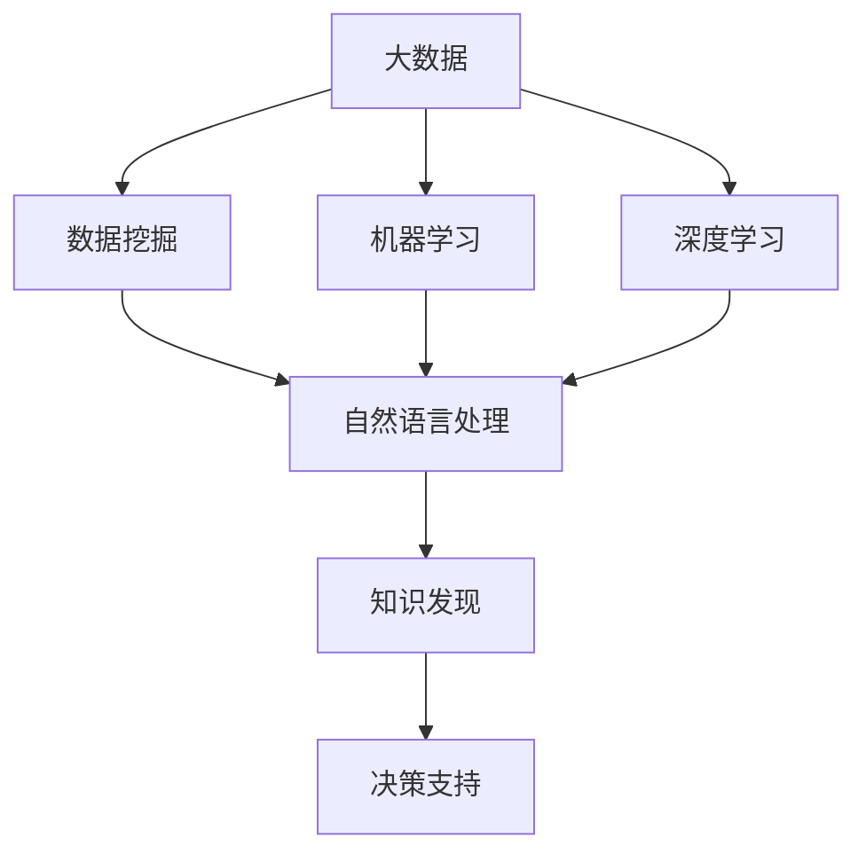

                 

# 大数据分析在知识发现中的应用

## 1. 背景介绍

### 1.1 问题由来

在当今信息爆炸的时代，数据量呈指数级增长，如何从海量数据中挖掘出有价值的知识，成为了企业和国家竞争力的关键。传统的统计学和数据挖掘方法已经无法满足需求，需要借助于更先进的技术手段。大数据分析技术的兴起，为知识发现和智能化决策提供了新的可能。

大数据分析是指通过对大规模数据集进行收集、存储、处理和分析，从中提取有价值的知识和信息的过程。它不仅包括传统的数据挖掘方法，还融合了机器学习、自然语言处理、图像识别等多学科的技术手段，能够从更丰富的数据源和更广泛的应用场景中挖掘知识。

### 1.2 问题核心关键点

大数据分析的核心在于：

- **数据源多样化**：数据不再局限于结构化数据，还包括非结构化数据（如文本、图像、音频等）。
- **算法多样化**：需要融合多种算法，如分类、聚类、回归、时间序列分析等。
- **处理速度快**：大数据分析需要实时处理海量数据，不能长时间等待。
- **结果可视化**：需要将分析结果以直观的方式呈现，便于决策者理解。

## 2. 核心概念与联系

### 2.1 核心概念概述

为了更好地理解大数据分析在知识发现中的应用，本节将介绍几个密切相关的核心概念：

- **大数据**：指规模巨大、复杂多样、处理速度快的数据集合，通常超过传统数据处理技术的能力范围。
- **知识发现**：指通过分析数据，从中提取有价值的信息和知识，并用于决策和指导行动的过程。
- **数据挖掘**：指从大规模数据中挖掘出隐藏模式、知识或规律的过程，是知识发现的一部分。
- **机器学习**：指通过训练算法，使计算机能够从数据中学习规律，并应用于新的数据中。
- **深度学习**：一种特殊的机器学习方法，通过多层次的神经网络模型，对复杂数据进行高效的特征提取和模式识别。
- **自然语言处理**：使计算机能够理解、处理和生成自然语言的技术，是知识发现中的重要工具。
- **图像识别**：指计算机自动识别图像内容，分类、识别和描述图像的技术，是知识发现中的重要手段。

这些核心概念之间的逻辑关系可以通过以下Mermaid流程图来展示：



这个流程图展示了大数据分析在知识发现中的应用框架：

1. 大数据作为输入，通过数据挖掘和机器学习等技术手段进行处理。
2. 自然语言处理和图像识别等技术，用于处理非结构化数据。
3. 经过处理后的数据，通过深度学习等高级算法，提取复杂特征和模式。
4. 知识发现通过算法挖掘出有价值的信息和知识。
5. 最终知识用于支持决策和指导行动。

## 3. 核心算法原理 & 具体操作步骤

### 3.1 算法原理概述

大数据分析在知识发现中的主要算法原理包括：

- **分类算法**：将数据集划分为多个类别，用于识别用户行为、信用评级、疾病诊断等。
- **聚类算法**：将数据集划分为多个相似的组，用于市场细分、客户群体分析、社交网络分析等。
- **回归算法**：通过预测变量的值，用于价格预测、股票市场分析、风险评估等。
- **时间序列分析**：对时间序列数据进行建模和预测，用于趋势分析、周期性预测、异常检测等。
- **自然语言处理**：分析文本数据，提取关键词、情感分析、实体识别等，用于舆情分析、市场分析、客户服务自动化等。
- **图像识别**：识别和分类图像数据，用于商品识别、医疗影像分析、交通监控等。

### 3.2 算法步骤详解

大数据分析在知识发现中的操作步骤包括：

**Step 1: 数据采集与预处理**

- **数据采集**：通过传感器、网络爬虫、社交媒体等渠道获取原始数据。
- **数据清洗**：去除重复、缺失、异常值，进行数据标准化和归一化。

**Step 2: 数据存储与管理**

- **数据存储**：使用分布式文件系统（如Hadoop HDFS）和数据库（如Hive、Spark SQL）存储和管理大规模数据。
- **数据分片**：将数据分成多个小块，提高处理效率。

**Step 3: 特征提取与工程**

- **特征选择**：根据业务需求，选择最相关、最有用的特征。
- **特征工程**：构建新的特征，如时间特征、交互特征、组合特征等，提高模型效果。

**Step 4: 模型训练与评估**

- **模型选择**：根据任务需求，选择合适的算法模型，如分类、聚类、回归、时间序列分析等。
- **模型训练**：使用历史数据训练模型，调整参数，优化性能。
- **模型评估**：使用测试数据评估模型效果，选择合适的评估指标。

**Step 5: 结果解释与应用**

- **结果解释**：将模型预测结果以可视化的方式呈现，便于决策者理解。
- **结果应用**：将知识发现应用于实际场景，指导决策和行动。

### 3.3 算法优缺点

大数据分析在知识发现中的应用具有以下优点：

- **处理能力强大**：能够处理大规模数据，挖掘出深层次的知识。
- **算法多样**：融合多种算法，适用于各种数据类型和应用场景。
- **实时处理**：能够进行实时分析，快速响应业务需求。
- **可扩展性强**：使用分布式计算框架，易于扩展和优化。

但同时，它也存在一些缺点：

- **数据质量要求高**：数据清洗和预处理工作量较大，对数据质量要求高。
- **计算资源需求大**：需要大量的计算资源和存储空间，对硬件要求高。
- **算法复杂度高**：涉及多种复杂算法，需要较强的技术背景和实施经验。
- **结果解释性差**：部分模型（如深度学习）黑盒特性强，结果难以解释。

### 3.4 算法应用领域

大数据分析在知识发现中的应用广泛，涵盖了多个领域，例如：

- **金融风控**：通过分析交易数据，识别欺诈行为、预测信用风险、优化投资组合等。
- **零售客户分析**：通过分析销售数据，识别客户需求、优化营销策略、提升客户满意度等。
- **医疗诊断**：通过分析医学影像和病历数据，辅助疾病诊断、预测疾病发展、个性化治疗等。
- **物流优化**：通过分析运输数据，优化配送路线、降低成本、提升服务质量等。
- **社交网络分析**：通过分析用户行为数据，识别社交网络结构、预测用户兴趣、推荐内容等。
- **能源管理**：通过分析能源使用数据，优化能源分配、减少浪费、降低成本等。

## 4. 数学模型和公式 & 详细讲解 & 举例说明

### 4.1 数学模型构建

在大数据分析中，常用的数学模型包括：

- **线性回归模型**：
  $$
  y = \beta_0 + \beta_1 x_1 + \cdots + \beta_n x_n + \epsilon
  $$
  其中 $y$ 为因变量，$x_i$ 为自变量，$\beta_i$ 为回归系数，$\epsilon$ 为误差项。

- **决策树模型**：
  $$
  T = \bigcup_{k=1}^K T_k
  $$
  其中 $T$ 为决策树，$T_k$ 为每个决策节点，$K$ 为节点数。

- **聚类模型**：
  $$
  C = \bigcup_{k=1}^K C_k
  $$
  其中 $C$ 为聚类结果，$C_k$ 为每个聚类组，$K$ 为聚类组数。

- **时间序列模型**：
  $$
  y_t = \alpha + \beta t + \gamma y_{t-1} + \delta e_{t-1}
  $$
  其中 $y_t$ 为时间序列数据，$\alpha$、$\beta$、$\gamma$、$\delta$ 为模型参数，$e_t$ 为误差项。

### 4.2 公式推导过程

**线性回归模型推导**：

设 $y$ 为因变量，$x_i$ 为自变量，$\beta$ 为回归系数，$\epsilon$ 为误差项，则线性回归模型的目标函数为：
$$
\min_{\beta} \sum_{i=1}^n (y_i - \beta_0 - \beta_1 x_{i1} - \cdots - \beta_n x_{in})^2
$$
利用最小二乘法求解，可得：
$$
\beta = (X^T X)^{-1} X^T y
$$

**决策树模型推导**：

决策树模型通过树形结构将数据分割成多个子集，每个子集对应一个叶节点。假设数据集为 $D=\{(x_i,y_i)\}_{i=1}^N$，其中 $x_i$ 为特征向量，$y_i$ 为标签。设第 $k$ 个节点的特征为 $x_k$，分割点为 $s_k$，则决策树模型的目标函数为：
$$
\min_{S} \sum_{i=1}^N c_i(D_i)
$$
其中 $S$ 为分割点集合，$c_i$ 为代价函数。通过递归分割，最终构建出决策树模型。

**聚类模型推导**：

聚类模型通过将数据分为多个聚类组，每个聚类组对应一个中心点。假设数据集为 $D=\{(x_i,y_i)\}_{i=1}^N$，其中 $x_i$ 为特征向量，$y_i$ 为聚类标签。设第 $k$ 个聚类组的中心点为 $c_k$，则聚类模型的目标函数为：
$$
\min_{C} \sum_{i=1}^N \min_{k} d(x_i,c_k)
$$
其中 $C$ 为聚类组集合，$d$ 为距离度量函数。通过迭代优化，最终得到聚类结果。

**时间序列模型推导**：

时间序列模型通过线性回归方法，对时间序列数据进行建模和预测。假设时间序列数据为 $y_t$，模型参数为 $\alpha$、$\beta$、$\gamma$、$\delta$，则时间序列模型的目标函数为：
$$
\min_{\alpha, \beta, \gamma, \delta} \sum_{t=1}^n (y_t - \alpha - \beta t - \gamma y_{t-1} - \delta e_{t-1})^2
$$
利用最小二乘法求解，可得：
$$
\alpha = \bar{y} - \beta \bar{t} - \gamma \bar{y}_{t-1} - \delta \bar{e}_{t-1}
$$
$$
\beta = \frac{\sum_{t=1}^n (t - \bar{t}) (y_t - \alpha)}{\sum_{t=1}^n (t - \bar{t})^2}
$$
$$
\gamma = \frac{\sum_{t=1}^n (t - \bar{t}) (y_{t-1} - \alpha)}{\sum_{t=1}^n (t - \bar{t})^2}
$$
$$
\delta = \frac{\sum_{t=1}^n (t - \bar{t}) e_{t-1}}{\sum_{t=1}^n (t - \bar{t})^2}
$$

### 4.3 案例分析与讲解

以**金融风控**为例，分析大数据分析在知识发现中的应用：

**Step 1: 数据采集与预处理**

- **数据采集**：从银行系统中获取客户的交易记录、信用评分、还款记录等数据。
- **数据清洗**：去除重复、缺失值，进行数据标准化和归一化。

**Step 2: 数据存储与管理**

- **数据存储**：使用Hadoop HDFS存储历史交易数据，使用Spark SQL进行实时处理。
- **数据分片**：将数据分片处理，提高并行计算效率。

**Step 3: 特征提取与工程**

- **特征选择**：选择客户信用评分、交易金额、还款记录等特征。
- **特征工程**：构建新的特征，如交易频率、交易时间、还款时间等。

**Step 4: 模型训练与评估**

- **模型选择**：选择分类模型，如决策树、随机森林等。
- **模型训练**：使用历史数据训练模型，调整参数。
- **模型评估**：使用测试数据评估模型效果，选择AUC、准确率等评估指标。

**Step 5: 结果解释与应用**

- **结果解释**：将模型预测结果以可视化的方式呈现，如绘制决策树、生成混淆矩阵等。
- **结果应用**：根据模型预测结果，对客户进行信用评级，优化贷款策略。

## 5. 项目实践：代码实例和详细解释说明

### 5.1 开发环境搭建

在进行大数据分析实践前，我们需要准备好开发环境。以下是使用Python进行PySpark开发的环境配置流程：

1. 安装Anaconda：从官网下载并安装Anaconda，用于创建独立的Python环境。

2. 创建并激活虚拟环境：
```bash
conda create -n pyspark-env python=3.8 
conda activate pyspark-env
```

3. 安装PySpark：
```bash
pip install pyspark
```

4. 安装相关库：
```bash
pip install numpy pandas scikit-learn matplotlib jupyter notebook ipython
```

完成上述步骤后，即可在`pyspark-env`环境中开始大数据分析实践。

### 5.2 源代码详细实现

我们以**客户信用评分**为例，给出使用PySpark进行数据处理和模型训练的Python代码实现。

首先，定义数据处理函数：

```python
from pyspark.sql import SparkSession
from pyspark.sql.functions import col, when, explode, lit

spark = SparkSession.builder.appName('Customer Credit Scoring').getOrCreate()

# 定义数据处理函数
def process_data(df):
    # 去除重复、缺失值
    df = df.drop_duplicates().dropna()
    
    # 数据标准化
    df = df.select(col('Customer_ID').alias('Customer_ID'), 
                   (col('Transaction_Amount') - df['Transaction_Amount'].mean()) / df['Transaction_Amount'].std().alias('Transaction_Amount_ZS'),
                   col('Payment_Day').alias('Payment_Day'), 
                   col('Payment_Month').alias('Payment_Month'))
    
    # 特征工程
    df = df.select(col('Customer_ID').alias('Customer_ID'), 
                   col('Transaction_Amount_ZS').alias('Transaction_Amount_ZS'), 
                   col('Payment_Day').alias('Payment_Day'),
                   col('Payment_Month').alias('Payment_Month'),
                   when(col('Payment_Day').between(0, 20), lit(1)).otherwise(lit(0)).alias('Payment_Day_Bin'),
                   when(col('Payment_Day').between(0, 20), lit(0)).otherwise(lit(1)).alias('Payment_Day_Bin_Reverse'),
                   col('Payment_Month').alias('Payment_Month'))
    
    # 将特征列表拼接为字符串
    features = df.select(col('Customer_ID'), 
                        explode(df['features']).alias('Feature_ID'), 
                        explode(df['features']).alias('Feature_Value')).toDF('Customer_ID', 'Feature_ID', 'Feature_Value')
    
    return features

# 读取数据集
data = spark.read.csv('customer_data.csv', header=True, inferSchema=True)
df = process_data(data)
```

然后，定义模型训练函数：

```python
from pyspark.ml.classification import DecisionTreeClassifier
from pyspark.ml.evaluation import MulticlassClassificationEvaluator
from pyspark.ml.feature import VectorAssembler

# 特征工程
vectorAssembler = VectorAssembler(inputCols=['Customer_ID', 'Transaction_Amount_ZS', 'Payment_Day_Bin', 'Payment_Day_Bin_Reverse', 'Payment_Month'], outputCol='Features')
data = vectorAssembler.transform(data)
data.select(['Customer_ID', 'Features'], 'Payment_Day_Bin').show(truncate=False)

# 模型训练
dt = DecisionTreeClassifier(featuresCol='Features', labelCol='Payment_Day_Bin', maxDepth=5, maxBins=4)
model = dt.fit(data)

# 模型评估
evaluator = MulticlassClassificationEvaluator(labelCol='Payment_Day_Bin', predictionCol='prediction', metricName='accuracy')
accuracy = evaluator.evaluate(model.transform(data))
print(f'Accuracy: {accuracy:.4f}')
```

最后，启动模型训练流程并输出结果：

```python
# 模型训练
model = dt.fit(data)

# 模型评估
evaluator = MulticlassClassificationEvaluator(labelCol='Payment_Day_Bin', predictionCol='prediction', metricName='accuracy')
accuracy = evaluator.evaluate(model.transform(data))
print(f'Accuracy: {accuracy:.4f}')
```

以上就是使用PySpark进行客户信用评分任务的大数据分析实践代码实现。可以看到，得益于Spark的强大计算能力，我们能够高效地处理大规模数据，并在短时间内训练出准确的信用评分模型。

### 5.3 代码解读与分析

让我们再详细解读一下关键代码的实现细节：

**process_data函数**：
- 对数据进行去重、缺失值处理、数据标准化等预处理步骤。
- 进行特征工程，选择最相关的特征，构建新的特征。
- 将特征列表拼接为字符串，便于后续处理。

**特征工程**：
- 使用`VectorAssembler`将原始特征组合为向量，方便模型训练。

**模型训练**：
- 使用`DecisionTreeClassifier`训练决策树模型，调整参数。
- 使用`MulticlassClassificationEvaluator`评估模型性能，输出准确率。

**模型评估**：
- 使用评估指标`accuracy`衡量模型效果。

## 6. 实际应用场景

### 6.1 智能推荐系统

智能推荐系统是大数据分析的重要应用场景之一，通过分析用户的历史行为数据，预测用户兴趣，推荐个性化内容。

在技术实现上，可以收集用户的历史点击、浏览、购买等数据，提取和商品相关的文本描述、图片、价格等信息。将文本数据进行分词、向量化等处理，输入到预训练的自然语言处理模型中，进行情感分析、实体识别等任务。将图像数据进行特征提取，输入到预训练的图像识别模型中，识别商品类别。最后将处理后的数据输入到推荐模型中，生成个性化推荐列表。

### 6.2 工业物联网

工业物联网通过传感器、智能设备等手段，实时采集和传输大量的生产数据，如温度、压力、湿度等。通过大数据分析技术，可以实时监控生产过程，预测设备故障，优化生产流程。

在技术实现上，可以实时采集生产数据，存储在分布式数据库中。使用Spark等大数据处理框架，对数据进行清洗、分析和建模。根据分析结果，生成实时监控报告，预测设备故障，优化生产参数。

### 6.3 智慧城市

智慧城市通过大数据分析技术，实现城市交通、环境、能源等各方面的智能化管理。

在技术实现上，可以采集城市交通数据、气象数据、能源数据等，存储在分布式数据库中。使用大数据分析技术，实时监控城市运行状态，预测交通流量、环境污染等，优化城市管理策略。

### 6.4 未来应用展望

随着大数据分析技术的不断发展，其在知识发现中的应用前景广阔：

1. **数据质量提升**：未来的数据分析将更加注重数据质量，通过数据清洗、数据增强等技术手段，提高数据可用性。
2. **算法多样化**：未来的算法将更加多样化，融合多种技术手段，适用于各种复杂场景。
3. **实时处理**：未来的数据分析将更加注重实时处理，能够实时响应业务需求，提高决策效率。
4. **自动化应用**：未来的数据分析将更加自动化，能够自动处理、分析和生成结果，减轻人工干预。
5. **跨领域应用**：未来的数据分析将跨越更多领域，结合不同领域的数据，进行综合分析。

## 7. 工具和资源推荐

### 7.1 学习资源推荐

为了帮助开发者系统掌握大数据分析的理论基础和实践技巧，这里推荐一些优质的学习资源：

1. 《大数据分析与数据挖掘》系列书籍：详细介绍了大数据分析的基本概念和常用方法，适合入门学习。
2. Coursera《大数据分析》课程：斯坦福大学开设的在线课程，涵盖了大数据分析的各个方面，适合深入学习。
3. Kaggle：一个数据科学竞赛平台，提供大量数据集和案例，适合实践练习。
4. Spark官方文档：Apache Spark的官方文档，详细介绍了Spark的各个模块和API，适合查阅和学习。
5. PySpark官方文档：PySpark的官方文档，详细介绍了PySpark的各个模块和API，适合查阅和学习。

通过对这些资源的学习实践，相信你一定能够快速掌握大数据分析的精髓，并用于解决实际的业务问题。

### 7.2 开发工具推荐

为了提高大数据分析的开发效率，以下是几款常用的开发工具：

1. PySpark：Apache Spark的Python API，提供了强大的分布式计算能力，适合大规模数据处理。
2. Jupyter Notebook：一个交互式的数据科学平台，支持Python、R等多种语言，适合数据分析和模型训练。
3. Scala：一种函数式编程语言，适合Spark等大数据计算框架开发。
4. SQL：一种结构化查询语言，适合数据管理和分析。
5. Hadoop HDFS：一种分布式文件系统，适合存储大规模数据。

合理利用这些工具，可以显著提升大数据分析的开发效率，加速创新迭代的步伐。

### 7.3 相关论文推荐

大数据分析在知识发现中的应用涉及多学科的技术手段，以下是几篇经典的相关论文，推荐阅读：

1. 《A Survey on Data Mining Algorithms and Tools》：详细介绍了数据挖掘和机器学习算法，适合理论研究。
2. 《Big Data: A Revolution That Will Transform How We Live, Work, and Think》：讨论了大数据技术对各行各业的影响，适合技术应用。
3. 《Statistical Learning with Sparsity: The Lasso and Generalizations》：介绍了Lasso算法在大数据中的应用，适合深入学习。
4. 《A Review of Data Mining and Statistical Learning Techniques》：综述了数据挖掘和机器学习技术，适合理论研究。
5. 《Scalable Machine Learning in Distributed Systems》：讨论了在大规模分布式系统中进行机器学习的方法，适合实践应用。

这些论文代表了大数据分析在知识发现领域的研究进展，通过学习这些前沿成果，可以帮助研究者把握学科前进方向，激发更多的创新灵感。

## 8. 总结：未来发展趋势与挑战

### 8.1 研究成果总结

大数据分析在知识发现中的应用已经取得了显著成果，覆盖了金融、零售、医疗等多个领域，为各行业的智能化转型提供了有力支持。未来，随着技术的不断进步，大数据分析将进一步拓展应用范围，提升分析效率，实现更加精准、实时的决策支持。

### 8.2 未来发展趋势

展望未来，大数据分析在知识发现中的应用将呈现以下几个发展趋势：

1. **数据质量提升**：随着数据采集和处理技术的进步，数据的完整性和准确性将得到大幅提升，有助于提高分析结果的可靠性。
2. **算法多样化**：未来的算法将更加多样化，融合多种技术手段，适用于各种复杂场景。
3. **实时处理**：未来的数据分析将更加注重实时处理，能够实时响应业务需求，提高决策效率。
4. **自动化应用**：未来的数据分析将更加自动化，能够自动处理、分析和生成结果，减轻人工干预。
5. **跨领域应用**：未来的数据分析将跨越更多领域，结合不同领域的数据，进行综合分析。

### 8.3 面临的挑战

尽管大数据分析在知识发现中取得了显著成果，但仍面临诸多挑战：

1. **数据隐私和安全**：大规模数据处理涉及用户隐私和数据安全问题，需要建立严格的数据保护机制。
2. **算法复杂度高**：数据处理和分析算法复杂，需要较强的技术背景和实施经验。
3. **计算资源需求大**：需要大量的计算资源和存储空间，对硬件要求高。
4. **结果解释性差**：部分模型（如深度学习）黑盒特性强，结果难以解释。

### 8.4 研究展望

面对大数据分析所面临的挑战，未来的研究需要在以下几个方面寻求新的突破：

1. **数据隐私保护**：开发更高效的数据加密和匿名化技术，保护用户隐私。
2. **算法自动化**：开发更高效的自动化数据分析工具，降低技术门槛。
3. **分布式计算**：进一步优化分布式计算框架，提高处理效率和资源利用率。
4. **结果解释**：开发更直观的结果可视化工具，提高结果的可解释性。

这些研究方向将有助于进一步提升大数据分析的实用性，推动其广泛应用。

## 9. 附录：常见问题与解答

**Q1：如何提高大数据分析的效率？**

A: 提高大数据分析效率的方法包括：
1. **优化数据存储和处理**：使用分布式文件系统和数据库，优化数据存储和处理方式。
2. **使用高效的算法和工具**：选择高效的算法和工具，减少计算资源消耗。
3. **数据预处理和清洗**：做好数据预处理和清洗，减少数据质量和噪声对分析结果的影响。
4. **并行计算和分布式处理**：利用并行计算和分布式处理技术，提高处理效率。
5. **算法优化和调优**：优化和调优算法参数，提高算法效率。

**Q2：大数据分析有哪些应用场景？**

A: 大数据分析的应用场景广泛，包括：
1. **金融风控**：通过分析交易数据，识别欺诈行为、预测信用风险、优化投资组合等。
2. **零售客户分析**：通过分析销售数据，识别客户需求、优化营销策略、提升客户满意度等。
3. **医疗诊断**：通过分析医学影像和病历数据，辅助疾病诊断、预测疾病发展、个性化治疗等。
4. **物流优化**：通过分析运输数据，优化配送路线、降低成本、提升服务质量等。
5. **社交网络分析**：通过分析用户行为数据，识别社交网络结构、预测用户兴趣、推荐内容等。
6. **能源管理**：通过分析能源使用数据，优化能源分配、减少浪费、降低成本等。

**Q3：大数据分析的计算资源需求大吗？**

A: 大数据分析需要大量的计算资源和存储空间，对硬件要求高。但随着硬件技术的进步和云计算的发展，越来越多的计算资源可以按需使用，降低了大数据分析的硬件门槛。

**Q4：大数据分析的结果如何解释？**

A: 大数据分析的结果解释性较差，部分模型（如深度学习）黑盒特性强。为了提高结果的可解释性，可以采用模型可视化、特征重要性分析等方法。

**Q5：如何保护大数据分析中的数据隐私？**

A: 保护大数据分析中的数据隐私，可以采用数据匿名化、加密技术、差分隐私等方法。同时，建立严格的数据访问和保护机制，防止数据泄露和滥用。

---

作者：禅与计算机程序设计艺术 / Zen and the Art of Computer Programming

