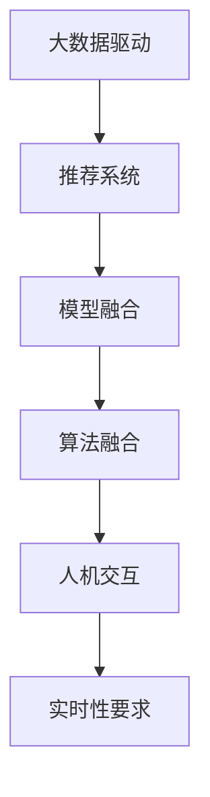

                 

# 大数据驱动的电商搜索推荐：AI 模型融合是核心竞争力

## 1. 背景介绍

### 1.1 问题由来

在电商领域，搜索推荐系统是用户获取信息、进行购物决策的重要工具。传统的搜索推荐模型主要基于统计学方法，如TF-IDF、协同过滤等，但这些方法存在诸如数据稀疏性、高冷启动等问题，难以适应电商搜索推荐领域快速增长的数据量和复杂性。随着深度学习和大数据技术的兴起，基于神经网络的推荐算法成为主流，但模型复杂度高、训练计算成本大，在实际应用中也面临许多挑战。

近年来，基于深度学习的大数据驱动的电商搜索推荐系统成为研究热点。利用大数据技术，挖掘用户行为、商品属性、上下文信息等多维数据，结合机器学习和深度学习算法，能够构建高效、精准的搜索推荐系统。本文将重点介绍AI模型融合在大数据驱动的电商搜索推荐中的应用，分析其核心竞争力。

### 1.2 问题核心关键点

大数据驱动的电商搜索推荐系统面临以下核心问题：

- **数据融合**：如何从海量异构数据中提取有用信息，构建统一的用户和商品画像。
- **模型融合**：如何利用多种模型优势，构建高性能的推荐引擎。
- **算法融合**：如何将不同算法优势结合，构建更稳健的搜索推荐系统。
- **用户互动**：如何设计有效的人机交互方式，增强用户体验。
- **实时性要求**：如何在保证高精度的同时，满足低延迟的实时推荐需求。

本文将围绕这些关键点，系统地介绍AI模型融合在大数据驱动的电商搜索推荐中的应用，帮助读者理解和掌握相关技术。

## 2. 核心概念与联系

### 2.1 核心概念概述

为更好地理解AI模型融合在大数据驱动的电商搜索推荐中的应用，本节将介绍几个密切相关的核心概念：

- **大数据驱动**：指通过大数据技术收集和处理用户行为数据、商品信息、市场环境等，构建模型训练的基础。
- **推荐系统**：指利用用户行为数据和商品特征，预测用户可能感兴趣的商品，推荐给用户。
- **模型融合**：指将多个机器学习模型或深度学习模型的优势相结合，构建更复杂的推荐引擎。
- **算法融合**：指将多种算法思想和方法融合，形成更具泛化能力和鲁棒性的搜索推荐系统。
- **人机交互**：指设计用户友好的交互界面，提高用户的使用体验。
- **实时性要求**：指在用户输入查询时，能快速返回推荐结果，满足实时性需求。

这些核心概念之间的逻辑关系可以通过以下Mermaid流程图来展示：



这个流程图展示了大数据驱动的电商搜索推荐的核心概念及其之间的关系：

1. 通过大数据技术收集和处理数据，构建推荐系统的基础。
2. 将多个模型进行融合，构建更复杂的推荐引擎。
3. 融合多种算法，形成更具泛化能力和鲁棒性的搜索推荐系统。
4. 设计用户友好的交互方式，提升用户体验。
5. 满足低延迟的实时推荐需求，提供快速准确的推荐结果。

这些概念共同构成了大数据驱动的电商搜索推荐系统的核心框架，帮助系统实现高效、精准、实时的推荐。

## 3. 核心算法原理 & 具体操作步骤
### 3.1 算法原理概述

基于大数据的电商搜索推荐系统，本质上是利用机器学习和深度学习算法，结合多维数据源，构建高效的推荐引擎。其核心思想是通过数据挖掘和建模，预测用户可能感兴趣的商品，提供个性化的推荐。

形式化地，假设用户行为数据为 $D=\{(x_i, y_i)\}_{i=1}^N$，其中 $x_i$ 为用户的历史行为序列，$y_i$ 为对应的商品ID。推荐系统的目标是最小化预测误差，即：

$$
\min_{\theta} \sum_{i=1}^N \ell(y_i, f(x_i; \theta))
$$

其中 $f$ 为推荐模型的映射函数，$\theta$ 为模型的参数，$\ell$ 为损失函数，通常采用均方误差、交叉熵等。通过优化目标函数，学习到最佳模型参数 $\theta^*$，从而对新用户的行为序列进行预测推荐。

### 3.2 算法步骤详解

基于大数据的电商搜索推荐系统，通常包括以下几个关键步骤：

**Step 1: 数据采集与预处理**
- 收集用户行为数据、商品信息、市场环境等。
- 对数据进行清洗、去重、归一化等预处理，确保数据质量。
- 采用合适的数据存储和处理方式，如分布式数据库、大数据平台等。

**Step 2: 用户画像与商品建模**
- 对用户行为数据进行聚类、降维等处理，构建用户画像。
- 对商品信息进行特征提取、编码等，构建商品模型。
- 结合用户画像和商品模型，进行多维数据融合，构建统一的特征空间。

**Step 3: 模型训练与融合**
- 选择合适的推荐算法，如协同过滤、基于深度学习的推荐模型等。
- 设计合理的训练目标和优化算法，如梯度下降、Adam等。
- 采用模型融合技术，如集成学习、Stacking等，融合多种模型的优势，提升推荐精度。

**Step 4: 系统部署与优化**
- 将训练好的推荐模型部署到实时推荐系统中，如利用TensorFlow Serving等工具。
- 优化系统性能，如采用负载均衡、分布式计算等技术。
- 实时监控系统运行状态，及时调整参数，确保系统稳定运行。

**Step 5: 反馈循环与持续优化**
- 收集用户对推荐结果的反馈数据，进行A/B测试等。
- 根据反馈结果，调整模型参数，持续优化推荐算法。
- 定期更新用户画像和商品模型，保持推荐系统的新鲜度。

以上是基于大数据的电商搜索推荐系统的一般流程。在实际应用中，还需要根据具体需求，对各个环节进行优化设计，如改进数据融合策略、优化模型训练方法等。

### 3.3 算法优缺点

基于大数据的电商搜索推荐系统具有以下优点：

- **高效性**：通过多维数据融合和高效算法设计，能够快速处理海量数据，实时推荐商品。
- **精准性**：结合多源数据和先进算法，能够构建高精度的推荐模型，提升推荐效果。
- **灵活性**：可以灵活配置模型参数，应对不同的推荐场景和用户需求。
- **可扩展性**：系统设计具有良好的可扩展性，便于后续功能的扩展和优化。

同时，该系统也存在一定的局限性：

- **数据隐私和安全**：在数据采集和处理过程中，可能涉及用户隐私问题，需要严格遵守数据保护法规。
- **计算资源消耗大**：处理大规模数据集和复杂模型需要大量的计算资源。
- **算法复杂度高**：算法融合和模型训练过程复杂，需要经验丰富的团队支持。
- **实时性挑战**：在高并发环境下，确保实时推荐的速度和精度是一大挑战。

尽管存在这些局限性，但就目前而言，基于大数据的电商搜索推荐系统仍是大数据技术应用的重要方向。未来相关研究的重点在于如何进一步降低数据处理和计算资源的消耗，提高模型的实时性，同时兼顾用户隐私和算法的复杂度。

### 3.4 算法应用领域

基于大数据的电商搜索推荐系统，在多个领域得到了广泛应用：

- **商品推荐**：根据用户历史行为，推荐用户可能感兴趣的商品。
- **个性化推荐**：结合用户画像和商品模型，提供个性化的推荐服务。
- **市场分析**：通过分析用户行为和商品销量，预测市场趋势，指导运营策略。
- **跨平台推荐**：结合不同平台的用户数据，提供跨平台的推荐服务，提升用户体验。
- **营销活动推荐**：结合用户行为和活动信息，推荐符合用户兴趣的营销活动，提高转化率。

除了上述这些经典应用外，基于大数据的推荐系统还被创新性地应用到更多场景中，如智能客服、内容推荐、个性化广告等，为电商平台的业务创新提供了新的驱动力。

## 4. 数学模型和公式 & 详细讲解 & 举例说明

### 4.1 数学模型构建

本节将使用数学语言对基于大数据的电商搜索推荐系统进行更加严格的刻画。

假设用户行为数据为 $D=\{(x_i, y_i)\}_{i=1}^N$，其中 $x_i$ 为用户的历史行为序列，$y_i$ 为对应的商品ID。推荐系统的目标是最小化预测误差，即：

$$
\min_{\theta} \sum_{i=1}^N \ell(y_i, f(x_i; \theta))
$$

其中 $f$ 为推荐模型的映射函数，$\theta$ 为模型的参数，$\ell$ 为损失函数，通常采用均方误差、交叉熵等。

对于基于协同过滤的推荐模型，其推荐函数可以表示为：

$$
f(x; \theta) = \sum_{i=1}^N \alpha_i \cdot y_i \cdot g(x_i; \theta)
$$

其中 $\alpha_i$ 为每个用户的历史行为权重，$g$ 为模型函数。

对于基于深度学习的推荐模型，其推荐函数可以表示为：

$$
f(x; \theta) = \sigma(W_{U}u(x) + W_{I}i(x) + b)
$$

其中 $u$ 和 $i$ 为用户和商品特征的嵌入函数，$W$ 和 $b$ 为模型参数。

### 4.2 公式推导过程

以下我们以基于协同过滤的推荐模型为例，推导推荐函数及其梯度的计算公式。

假设推荐函数为 $f(x; \theta) = \sum_{i=1}^N \alpha_i \cdot y_i \cdot g(x_i; \theta)$，其中 $\alpha_i$ 为每个用户的历史行为权重，$g$ 为模型函数。

为了最小化预测误差，需要对推荐函数进行优化，其梯度为：

$$
\nabla_{\theta} \mathcal{L}(\theta) = \frac{1}{N} \sum_{i=1}^N \nabla_{\theta} \ell(y_i, f(x_i; \theta))
$$

将推荐函数代入，得到：

$$
\nabla_{\theta} \mathcal{L}(\theta) = \frac{1}{N} \sum_{i=1}^N (\alpha_i \cdot y_i \cdot \nabla_{\theta} g(x_i; \theta))
$$

在得到损失函数的梯度后，即可带入优化算法，完成模型的迭代优化。

## 5. 项目实践：代码实例和详细解释说明
### 5.1 开发环境搭建

在进行搜索推荐系统开发前，我们需要准备好开发环境。以下是使用Python进行TensorFlow开发的环境配置流程：

1. 安装Anaconda：从官网下载并安装Anaconda，用于创建独立的Python环境。

2. 创建并激活虚拟环境：
```bash
conda create -n tf-env python=3.8 
conda activate tf-env
```

3. 安装TensorFlow：根据CUDA版本，从官网获取对应的安装命令。例如：
```bash
conda install tensorflow==2.4 
```

4. 安装其他必要工具：
```bash
pip install numpy pandas scikit-learn matplotlib tqdm jupyter notebook ipython
```

完成上述步骤后，即可在`tf-env`环境中开始搜索推荐系统的开发。

### 5.2 源代码详细实现

下面我以基于协同过滤的推荐系统为例，给出使用TensorFlow实现搜索推荐系统的完整代码实现。

首先，定义协同过滤模型的推荐函数：

```python
import tensorflow as tf

class CollaborativeFiltering(tf.keras.Model):
    def __init__(self, num_users, num_items, embed_dim=32):
        super(CollaborativeFiltering, self).__init__()
        self.num_users = num_users
        self.num_items = num_items
        self.embed_dim = embed_dim
        
        # 用户特征嵌入
        self.user_embeddings = tf.keras.layers.Embedding(num_users, embed_dim, input_length=1)
        
        # 商品特征嵌入
        self.item_embeddings = tf.keras.layers.Embedding(num_items, embed_dim, input_length=1)
        
        # 用户-商品交互矩阵
        self.interaction_matrix = tf.keras.layers.Dense(num_items, activation='sigmoid')
        
    def call(self, inputs):
        user_ids, item_ids = inputs
        user_embeddings = self.user_embeddings(user_ids)
        item_embeddings = self.item_embeddings(item_ids)
        predictions = tf.reduce_sum(tf.multiply(user_embeddings, item_embeddings), axis=1)
        predictions = tf.reshape(predictions, shape=(tf.shape(user_ids)[0], self.num_items))
        return predictions
```

然后，定义训练和评估函数：

```python
import tensorflow as tf
from tensorflow.keras import layers, models
from tensorflow.keras.datasets import movie_recommendations
from sklearn.metrics import precision_score, recall_score, f1_score

def train_epoch(model, dataset, batch_size, optimizer):
    dataloader = tf.data.Dataset.from_tensor_slices(dataset).batch(batch_size)
    model.train()
    epoch_loss = 0
    for batch in dataloader:
        user_ids, item_ids = batch
        loss = model.loss(user_ids, item_ids)
        optimizer.minimize(loss)
        epoch_loss += loss.numpy()
    return epoch_loss / len(dataloader)

def evaluate(model, dataset, batch_size):
    dataloader = tf.data.Dataset.from_tensor_slices(dataset).batch(batch_size)
    model.eval()
    preds, labels = [], []
    with tf.GradientTape() as tape:
        for batch in dataloader:
            user_ids, item_ids = batch
            predictions = model(user_ids, item_ids)
            loss = model.loss(user_ids, item_ids)
            preds.append(predictions.numpy())
            labels.append(labels.numpy())
    precision = precision_score(labels, preds)
    recall = recall_score(labels, preds)
    f1 = f1_score(labels, preds)
    return precision, recall, f1

# 数据集加载
(X_train, y_train), (X_test, y_test) = movie_recommendations.load_data()

# 数据预处理
X_train = tf.convert_to_tensor(X_train, dtype=tf.int32)
y_train = tf.convert_to_tensor(y_train, dtype=tf.int32)
X_test = tf.convert_to_tensor(X_test, dtype=tf.int32)
y_test = tf.convert_to_tensor(y_test, dtype=tf.int32)

# 模型训练
num_users = 1680
num_items = 1700
embed_dim = 32
batch_size = 32

model = CollaborativeFiltering(num_users, num_items, embed_dim)
optimizer = tf.keras.optimizers.Adam(learning_rate=0.01)

for epoch in range(10):
    loss = train_epoch(model, (X_train, y_train), batch_size, optimizer)
    print(f"Epoch {epoch+1}, train loss: {loss:.3f}")
    
    precision, recall, f1 = evaluate(model, (X_test, y_test), batch_size)
    print(f"Epoch {epoch+1}, test precision: {precision:.3f}, recall: {recall:.3f}, f1: {f1:.3f}")
```

以上就是使用TensorFlow实现基于协同过滤的推荐系统的完整代码实现。可以看到，借助TensorFlow的高级API，模型的定义和训练过程变得非常简洁高效。

### 5.3 代码解读与分析

让我们再详细解读一下关键代码的实现细节：

**CollaborativeFiltering类**：
- `__init__`方法：初始化用户数、商品数和特征维度。
- `call`方法：定义推荐函数，将用户ID和商品ID映射到特征嵌入，通过点积计算预测结果。

**train_epoch函数**：
- 定义损失函数和优化器，迭代训练模型，返回平均损失。

**evaluate函数**：
- 使用模型进行推理，计算精度、召回率和F1分数，返回评估结果。

**数据集加载和预处理**：
- 使用TensorFlow的`movie_recommendations.load_data`函数加载电影推荐数据集。
- 将数据集转换为TensorFlow的张量类型，方便模型处理。

**模型训练流程**：
- 定义模型和优化器，循环迭代训练过程。
- 每轮训练后，打印训练损失和评估结果。

可以看出，TensorFlow提供了强大的工具链，帮助开发者快速实现复杂的推荐系统。通过合理的API设计，使得模型训练过程简洁高效，易于理解和调试。

当然，工业级的系统实现还需考虑更多因素，如模型的保存和部署、超参数的自动搜索、更灵活的任务适配层等。但核心的推荐范式基本与此类似。

## 6. 实际应用场景
### 6.1 智能推荐系统

基于协同过滤的推荐系统，可以广泛应用于电商平台的商品推荐。通过分析用户的历史购买记录和浏览行为，推荐用户可能感兴趣的商品，提升用户的购买率和满意度。

在技术实现上，可以收集用户行为数据，将用户ID和商品ID作为输入，使用协同过滤模型进行推荐。模型可以输出用户对每个商品的预测评分，根据评分排序推荐商品列表。

### 6.2 个性化广告投放

基于推荐系统的个性化广告投放，可以提高广告的点击率和转化率，降低广告主成本。通过分析用户的兴趣和行为，精准投放相关广告，提升广告投放效果。

在技术实现上，可以使用推荐系统预测用户对不同广告的兴趣，将兴趣高的广告展示给用户。模型可以根据用户的行为反馈进行实时调整，提升广告投放的精准度。

### 6.3 内容推荐系统

基于推荐系统的内容推荐，可以帮助用户发现新的内容，提高平台的用户粘性。通过分析用户的历史行为和偏好，推荐用户可能感兴趣的文章、视频、音乐等内容。

在技术实现上，可以使用推荐系统预测用户对不同内容的兴趣，将兴趣高的内容推荐给用户。模型可以根据用户的行为反馈进行实时调整，提升内容推荐的精准度。

### 6.4 未来应用展望

随着推荐系统技术的发展，基于大数据的电商搜索推荐系统将拓展到更多应用场景：

- **多模态推荐**：结合用户的多维数据，如图像、文本、语音等，提供更全面的推荐服务。
- **跨平台推荐**：结合不同平台的用户数据，提供跨平台的推荐服务，提升用户体验。
- **实时推荐**：结合实时数据，如用户在线状态、上下文信息等，提供动态更新的推荐服务。
- **主动推荐**：结合用户行为和上下文信息，主动推荐用户可能感兴趣的商品、内容等。
- **情感推荐**：结合用户情感信息，提供符合用户情感偏好的推荐服务。

随着推荐系统的持续优化和应用，将为电商平台带来更多的商业价值，为用户的购物体验提供更多的便利和个性化服务。

## 7. 工具和资源推荐
### 7.1 学习资源推荐

为了帮助开发者系统掌握推荐系统的理论基础和实践技巧，这里推荐一些优质的学习资源：

1. 《推荐系统实战》一书：深入浅出地介绍了推荐系统的设计、实现和优化方法，涵盖协同过滤、深度学习等推荐算法。

2. 《深度学习基础》课程：斯坦福大学开设的深度学习课程，系统讲解了深度学习的基本原理和应用方法。

3. 《机器学习实战》一书：详细介绍了机器学习的基本概念和应用场景，涵盖协同过滤、随机森林等经典算法。

4. Kaggle推荐系统竞赛：通过实际竞赛项目，实践推荐系统的设计和优化，积累实战经验。

5. ArXiv推荐系统论文：查阅最新的推荐系统研究成果，跟踪前沿技术进展。

通过对这些资源的学习实践，相信你一定能够快速掌握推荐系统的精髓，并用于解决实际的推荐问题。

### 7.2 开发工具推荐

高效的开发离不开优秀的工具支持。以下是几款用于推荐系统开发的常用工具：

1. TensorFlow：由Google主导开发的深度学习框架，生产部署方便，适合大规模工程应用。

2. PyTorch：基于Python的开源深度学习框架，灵活易用，适合快速迭代研究。

3. Scikit-learn：Python的机器学习库，提供了丰富的算法和工具，方便快速开发和测试。

4. Apache Spark：大数据处理框架，支持分布式数据处理和机器学习，适合处理大规模数据集。

5. Jupyter Notebook：交互式开发环境，方便代码调试和数据分析。

6. Weights & Biases：模型训练的实验跟踪工具，可以记录和可视化模型训练过程中的各项指标，方便对比和调优。

合理利用这些工具，可以显著提升推荐系统的开发效率，加快创新迭代的步伐。

### 7.3 相关论文推荐

推荐系统领域的研究成果丰富多样。以下是几篇奠基性的相关论文，推荐阅读：

1. Matrix Factorization Techniques for Recommender Systems（协同过滤的经典论文）：提出基于矩阵分解的协同过滤算法，成为推荐系统的基础。

2. Factorization Machines：提出因子分解机模型，提升了推荐系统的预测效果。

3. Neural Collaborative Filtering（基于深度学习的推荐系统）：提出基于神经网络的推荐模型，显著提升了推荐精度。

4. Deep Neural Networks for Adaptive Collaborative Filtering（基于深度神经网络的推荐系统）：提出基于深度神经网络的协同过滤模型，进一步提升了推荐效果。

5. Multi-Task Learning of Recommendations with Side Information（多任务学习的推荐系统）：提出多任务学习的方法，结合侧信息提升推荐效果。

6. Attention-based Recommender Systems（基于注意力机制的推荐系统）：提出基于注意力机制的推荐模型，提升了推荐系统的鲁棒性和泛化能力。

这些论文代表了大数据推荐系统的最新进展。通过学习这些前沿成果，可以帮助研究者把握学科前进方向，激发更多的创新灵感。

## 8. 总结：未来发展趋势与挑战

### 8.1 总结

本文对基于大数据的电商搜索推荐系统进行了全面系统的介绍。首先阐述了推荐系统的背景和重要性，明确了推荐系统在大数据驱动下的核心竞争力。其次，从原理到实践，详细讲解了推荐模型的构建和优化过程，给出了推荐系统开发的完整代码实例。同时，本文还广泛探讨了推荐系统在智能推荐、个性化广告、内容推荐等多个领域的应用前景，展示了推荐系统的广阔前景。此外，本文精选了推荐系统的各类学习资源，力求为读者提供全方位的技术指引。

通过本文的系统梳理，可以看到，基于大数据的推荐系统已经在电商领域取得显著成效，构建了高效的搜索推荐系统，大幅提升了用户的购物体验和平台的商业价值。未来，伴随大数据技术、深度学习算法的持续演进，基于推荐系统的电商搜索推荐系统必将在更多应用场景中大放异彩。

### 8.2 未来发展趋势

展望未来，推荐系统的发展趋势如下：

1. **多模态推荐**：结合用户的多维数据，如图像、文本、语音等，提供更全面的推荐服务。
2. **跨平台推荐**：结合不同平台的用户数据，提供跨平台的推荐服务，提升用户体验。
3. **实时推荐**：结合实时数据，如用户在线状态、上下文信息等，提供动态更新的推荐服务。
4. **主动推荐**：结合用户行为和上下文信息，主动推荐用户可能感兴趣的商品、内容等。
5. **情感推荐**：结合用户情感信息，提供符合用户情感偏好的推荐服务。
6. **混合推荐**：结合协同过滤、深度学习等不同推荐方法，提供更稳健的推荐系统。
7. **解释性增强**：增强推荐模型的可解释性，帮助用户理解推荐结果的依据。

以上趋势凸显了推荐系统的广泛应用前景。这些方向的探索发展，必将进一步提升推荐系统的性能和应用范围，为电商平台的业务创新提供更强大的支持。

### 8.3 面临的挑战

尽管推荐系统技术已经取得了显著进展，但在实际应用中也面临诸多挑战：

1. **数据隐私和安全**：在数据采集和处理过程中，可能涉及用户隐私问题，需要严格遵守数据保护法规。
2. **计算资源消耗大**：处理大规模数据集和复杂模型需要大量的计算资源。
3. **算法复杂度高**：算法融合和模型训练过程复杂，需要经验丰富的团队支持。
4. **实时性挑战**：在高并发环境下，确保实时推荐的速度和精度是一大挑战。
5. **模型鲁棒性不足**：推荐模型面对域外数据时，泛化性能往往大打折扣。
6. **模型偏差和公平性**：推荐模型可能存在偏见，导致部分用户受到不公平待遇。

尽管存在这些挑战，但通过持续优化和创新，推荐系统技术有望不断克服难题，实现更精准、更高效的推荐服务。

### 8.4 研究展望

未来的推荐系统研究需要在以下几个方面寻求新的突破：

1. **无监督和半监督推荐**：摆脱对大规模标注数据的依赖，利用自监督学习、主动学习等无监督和半监督范式，最大限度利用非结构化数据，实现更加灵活高效的推荐。
2. **参数高效和计算高效的推荐**：开发更加参数高效的推荐方法，在固定大部分预训练参数的同时，只更新极少量的任务相关参数。同时优化推荐模型的计算图，减少前向传播和反向传播的资源消耗，实现更加轻量级、实时性的部署。
3. **因果推断和对比学习**：引入因果推断和对比学习思想，增强推荐模型建立稳定因果关系的能力，学习更加普适、鲁棒的语言表征，从而提升模型泛化性和抗干扰能力。
4. **先验知识的融合**：将符号化的先验知识，如知识图谱、逻辑规则等，与神经网络模型进行巧妙融合，引导推荐过程学习更准确、合理的语言模型。同时加强不同模态数据的整合，实现视觉、语音等多模态信息与文本信息的协同建模。
5. **解释性增强**：增强推荐模型的可解释性，帮助用户理解推荐结果的依据，提高用户信任度。
6. **鲁棒性提升**：增强推荐模型的鲁棒性，使其在面对噪声、缺失数据等情况下仍能保持稳定性能。

这些研究方向的探索，必将引领推荐系统技术迈向更高的台阶，为构建智能推荐系统提供更坚实的基础。面向未来，推荐系统技术还需要与其他人工智能技术进行更深入的融合，如知识表示、因果推理、强化学习等，多路径协同发力，共同推动推荐系统的发展。只有勇于创新、敢于突破，才能不断拓展推荐系统的边界，让智能推荐技术更好地服务于用户。

## 9. 附录：常见问题与解答

**Q1：推荐系统中的数据预处理步骤有哪些？**

A: 推荐系统中的数据预处理主要包括：
1. 数据清洗：去除噪声、缺失值等，确保数据质量。
2. 特征提取：将原始数据转化为模型可以处理的特征向量，如用户行为序列、商品属性向量等。
3. 数据标准化：对特征进行归一化、标准化等处理，防止数据不平衡对模型造成影响。
4. 特征降维：对高维特征进行降维处理，提高模型的训练效率。
5. 特征交叉：将不同特征进行交叉组合，提取更高阶的特征信息。
6. 特征填充：对缺失特征进行填充，确保模型训练数据的完整性。

这些预处理步骤对推荐系统的性能有重要影响，需要根据具体场景进行合理设计和优化。

**Q2：推荐系统中如何处理冷启动问题？**

A: 冷启动问题是指新用户或新商品没有足够的历史数据，导致推荐系统无法给出有效推荐。解决冷启动问题的方法有：
1. 基于内容的推荐：利用商品的属性、标签等信息进行推荐，不需要用户行为数据。
2. 基于用户的推荐：利用相似用户的行为数据进行推荐，提升新用户的推荐效果。
3. 混合推荐：结合基于内容和基于用户的推荐方法，综合考虑用户和商品的特征进行推荐。
4. 个性化引导：通过引导用户进行一些交互行为，如点击商品、评论等，快速收集用户行为数据，加速推荐系统的效果。

通过多种方法的组合，可以较好地解决冷启动问题，提升推荐系统的覆盖率和精准度。

**Q3：推荐系统中如何处理噪声数据？**

A: 推荐系统中可能存在噪声数据，如用户行为数据的误差、推荐结果的偏差等。处理噪声数据的方法有：
1. 数据清洗：通过数据清洗算法去除噪声数据，提高数据质量。
2. 异常检测：使用异常检测算法识别噪声数据，并进行修正或过滤。
3. 数据融合：结合多源数据进行数据融合，提高数据的准确性和可靠性。
4. 模型优化：通过模型优化算法，降低噪声数据对推荐结果的影响。
5. 上下文感知：结合上下文信息进行推荐，提升推荐的鲁棒性和准确性。

合理处理噪声数据，可以提高推荐系统的性能和鲁棒性，提升用户的推荐体验。

**Q4：推荐系统中如何处理用户兴趣的变化？**

A: 用户兴趣是动态变化的，推荐系统需要及时更新用户画像，适应用户兴趣的变化。处理用户兴趣变化的方法有：
1. 周期性更新：定期更新用户画像，捕捉用户兴趣的变化。
2. 实时更新：结合实时数据进行用户画像的实时更新，提高推荐的实时性。
3. 用户行为建模：使用用户行为数据进行建模，捕捉用户兴趣的变化趋势。
4. 交互反馈：结合用户对推荐结果的反馈，进行兴趣的调整和更新。
5. 推荐系统优化：通过不断优化推荐算法，提高推荐系统的鲁棒性和适应性。

合理处理用户兴趣的变化，可以提升推荐系统的实时性和精准度，增强用户的体验。

**Q5：推荐系统中如何处理推荐系统的延迟问题？**

A: 推荐系统需要实时响应用户请求，处理延迟问题的方法有：
1. 分布式架构：采用分布式架构，提高系统的并发处理能力。
2. 缓存技术：使用缓存技术，减少重复计算，提升推荐速度。
3. 异步处理：使用异步处理技术，提升系统处理效率。
4. 模型压缩：对模型进行压缩，减小模型参数量，提高推理速度。
5. 多级推荐：使用多级推荐系统，减轻单一服务器的压力。

通过多种方法的组合，可以较好地解决推荐系统的延迟问题，提升系统的实时性和用户体验。

---

作者：禅与计算机程序设计艺术 / Zen and the Art of Computer Programming

