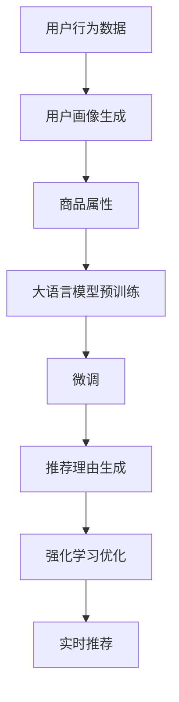

                 

# 大模型在商品推荐理由个性化生成中的应用

> 关键词：商品推荐系统, 大语言模型, 个性化生成, 自然语言处理, 用户行为分析, 迁移学习, 强化学习

## 1. 背景介绍

随着电子商务的迅猛发展，商品推荐系统（Recommender System）已成为各大电商平台的核心竞争力之一。良好的商品推荐系统可以显著提升用户体验，提高转化率，降低用户流失率。然而，传统的推荐系统往往依赖于用户行为数据和商品属性，难以捕捉用户的深层次需求和情感。而基于大语言模型的推荐理由个性化生成技术，可以进一步提升推荐系统的精准度和个性化程度。

大语言模型（Large Language Models）如BERT、GPT等，已经在NLP领域取得了一系列突破性进展。这些模型通过大规模无标签文本数据进行预训练，学习到了丰富的语言知识，具备强大的语言理解和生成能力。将大语言模型应用于商品推荐理由生成，可以显著提高推荐的可解释性和个性化水平，从而增强用户的信任度和购买意愿。

## 2. 核心概念与联系

### 2.1 核心概念概述

为了更好地理解大语言模型在商品推荐理由个性化生成中的应用，本节将介绍几个关键概念：

- **商品推荐系统（Recommender System）**：使用历史数据和模型预测用户可能感兴趣的商品，并进行展示推荐。推荐系统基于用户行为数据、商品属性、协同过滤等多种因素，可以大致分为基于内容的推荐和协同过滤推荐。

- **大语言模型（Large Language Models）**：以自回归（如GPT）或自编码（如BERT）为代表的预训练语言模型。通过在大规模无标签文本数据上预训练，学习通用的语言表示，具备强大的语言理解和生成能力。

- **商品推荐理由个性化生成**：根据用户的历史行为和偏好，生成个性化的商品推荐理由，帮助用户理解推荐商品的价值和优势，提升推荐系统的效果和可信度。

- **迁移学习（Transfer Learning）**：将一个领域学习到的知识迁移到另一个相关领域中。在大语言模型预训练-微调过程中，即是一种典型的迁移学习方式。

- **自然语言处理（NLP）**：研究计算机如何处理、理解、生成人类语言，包括分词、词性标注、句法分析、语义理解、情感分析等多种任务。

- **用户行为分析（User Behavior Analysis）**：分析用户的历史行为数据，挖掘用户的兴趣偏好和情感倾向，指导推荐理由的生成。

- **强化学习（Reinforcement Learning）**：通过与环境的交互，使得智能体能够根据环境的反馈逐步优化策略，从而实现最大化目标。

这些概念通过一系列的算法和模型构成了一个完整的推荐理由生成流程。本节将重点探讨大语言模型在这一流程中的作用，以及如何结合迁移学习、强化学习等技术，实现高效的商品推荐理由个性化生成。

### 2.2 核心概念原理和架构的 Mermaid 流程图



这个流程图展示了商品推荐理由个性化生成的主要步骤：

1. **用户行为数据**：收集用户的浏览、点击、购买等行为数据。
2. **用户画像生成**：利用机器学习算法对用户行为数据进行分析，生成用户画像，包括兴趣偏好、情感倾向等。
3. **商品属性**：提取商品的标题、描述、标签等信息。
4. **大语言模型预训练**：在大规模无标签文本数据上进行预训练，学习通用的语言表示。
5. **微调**：对大语言模型进行微调，使其能够根据用户画像和商品属性生成个性化的推荐理由。
6. **推荐理由生成**：根据微调后的模型和用户画像、商品属性等信息，生成个性化的推荐理由。
7. **强化学习优化**：利用强化学习算法优化推荐理由的生成策略，进一步提升推荐效果。
8. **实时推荐**：将生成的推荐理由和商品信息推送给用户，进行实时推荐。

通过这一流程，大语言模型结合迁移学习和强化学习等技术，能够显著提升推荐理由的个性化和精准度，从而增强推荐系统的效果。

## 3. 核心算法原理 & 具体操作步骤

### 3.1 算法原理概述

基于大语言模型的商品推荐理由个性化生成，本质上是一个利用预训练语言模型进行迁移学习的过程。其核心思想是：将大语言模型视作一个强大的"特征提取器"，通过在商品推荐任务上对模型进行微调，使其能够生成与用户偏好和商品属性相匹配的推荐理由，从而提升推荐系统的效果。

形式化地，假设预训练语言模型为 $M_{\theta}$，其中 $\theta$ 为预训练得到的模型参数。给定用户画像 $U$ 和商品属性 $P$，推荐理由生成过程可以表示为：

$$
\text{Reason} = M_{\theta}(U, P)
$$

其中，$U$ 表示用户画像，$P$ 表示商品属性，$\text{Reason}$ 表示推荐理由。

推荐理由生成模型的目标是最小化生成理由与用户偏好之间的差异，即：

$$
\hat{\theta} = \mathop{\arg\min}_{\theta} \mathcal{L}(M_{\theta}, U, P)
$$

其中，$\mathcal{L}$ 为推荐理由生成模型的损失函数，通常采用交叉熵损失、均方误差损失等。

### 3.2 算法步骤详解

基于大语言模型的商品推荐理由个性化生成一般包括以下几个关键步骤：

**Step 1: 准备数据集**

- 收集用户的历史行为数据和商品属性信息。
- 选择适当的推荐理由生成任务，如解释为什么推荐某个商品、如何与其他商品相比等。
- 将用户画像和商品属性作为输入，将推荐理由作为输出，构建监督数据集。

**Step 2: 大语言模型微调**

- 选择合适的预训练语言模型 $M_{\theta}$，如BERT、GPT等。
- 定义推荐理由生成模型的任务适配层，包括输入层和输出层。
- 在监督数据集上对模型进行微调，最小化模型预测结果与真实推荐理由之间的差异。
- 选择合适的优化算法（如AdamW、SGD等）和超参数，如学习率、批大小、迭代轮数等。

**Step 3: 生成推荐理由**

- 利用微调后的模型和用户画像、商品属性等信息，生成推荐理由。
- 根据生成的推荐理由，生成推荐列表，向用户展示推荐商品。

**Step 4: 强化学习优化**

- 定义强化学习的环境和目标，设计合适的奖励机制。
- 在用户与推荐系统交互过程中，不断优化推荐理由的生成策略，提升推荐效果。

### 3.3 算法优缺点

基于大语言模型的商品推荐理由个性化生成方法具有以下优点：

1. **生成理由的丰富多样性**：大语言模型具备强大的语言生成能力，可以生成多种形式和风格的推荐理由，满足不同用户的偏好。
2. **高精度**：通过微调学习用户偏好和商品属性，生成的推荐理由更加符合用户的真实需求，提高推荐系统的准确性。
3. **可解释性**：生成的推荐理由可以提供额外的解释信息，增强用户的信任感和理解度。
4. **高灵活性**：可以灵活调整微调的策略和参数，适应不同的应用场景。

同时，该方法也存在以下局限性：

1. **高计算成本**：大语言模型通常需要较大的计算资源和存储空间，微调过程需要大量的标注数据和计算时间。
2. **数据依赖性**：生成推荐理由的效果很大程度上取决于标注数据的质量和数量，获取高质量标注数据的成本较高。
3. **可解释性不足**：生成的推荐理由难以解释，缺乏对用户决策过程的洞察。
4. **依赖先验知识**：推荐理由的生成需要一定的先验知识，如领域特定的语料和规则，增加开发难度。

尽管存在这些局限性，但就目前而言，基于大语言模型的商品推荐理由个性化生成方法仍然是大规模推荐系统中的重要范式，其生成理由的丰富性和高精度能够显著提升用户体验和推荐效果。

### 3.4 算法应用领域

基于大语言模型的商品推荐理由个性化生成，已经在电商、广告、内容推荐等多个领域得到了广泛应用，提升了推荐系统的效果和用户满意度：

- **电商平台**：通过生成个性化推荐理由，增强用户对推荐商品的信任感和购买意愿，提高转化率和留存率。
- **在线广告**：生成吸引用户点击的广告理由，提高广告的点击率和转化率，优化广告投放效果。
- **内容推荐系统**：如视频网站、音乐平台等，生成个性化的视频、文章推荐理由，提升用户的满意度和留存率。
- **社交媒体**：生成个性化推荐理由，引导用户关注和参与，增强平台的活跃度和粘性。

## 4. 数学模型和公式 & 详细讲解 & 举例说明

### 4.1 数学模型构建

基于大语言模型的商品推荐理由个性化生成，可以构建以下数学模型：

设用户画像为 $U=(u_1, u_2, ..., u_n)$，其中 $u_i$ 表示用户第 $i$ 个属性值，如兴趣偏好、购买历史等。商品属性为 $P=(p_1, p_2, ..., p_m)$，其中 $p_j$ 表示商品第 $j$ 个属性值，如品牌、价格等。推荐理由生成模型为 $M_{\theta}:\mathcal{X} \rightarrow \mathcal{Y}$，其中 $\mathcal{X}=(U, P)$ 为输入空间，$\mathcal{Y}$ 为输出空间。推荐理由生成过程可以表示为：

$$
\text{Reason} = M_{\theta}(U, P)
$$

推荐理由生成模型的损失函数通常为交叉熵损失，定义如下：

$$
\mathcal{L}(\theta) = -\frac{1}{N} \sum_{i=1}^N \sum_{j=1}^M \ell(\hat{r}_{i,j}, r_{i,j})
$$

其中，$\hat{r}_{i,j}$ 表示模型预测的推荐理由，$r_{i,j}$ 表示实际生成的推荐理由，$\ell$ 为交叉熵损失函数。

### 4.2 公式推导过程

以下我们以一个简单的推荐理由生成模型为例，推导交叉熵损失函数的计算过程。

假设推荐理由生成模型为 $M_{\theta}(x)$，其中 $x$ 表示用户画像和商品属性的组合。模型预测的推荐理由为 $\hat{r}$，实际生成的推荐理由为 $r$。则交叉熵损失函数定义为：

$$
\ell(\hat{r}, r) = -r \log(\hat{r}) - (1-r) \log(1-\hat{r})
$$

将上述公式推广到整体数据集，推荐理由生成模型的损失函数为：

$$
\mathcal{L}(\theta) = -\frac{1}{N} \sum_{i=1}^N \sum_{j=1}^M \ell(\hat{r}_{i,j}, r_{i,j})
$$

在得到损失函数后，即可带入优化算法进行微调，最小化模型参数 $\theta$，使其生成的推荐理由与真实推荐理由尽可能接近。

### 4.3 案例分析与讲解

假设我们有一个电商平台，希望利用大语言模型生成个性化推荐理由。可以按以下步骤进行：

1. **数据准备**：收集用户的历史行为数据，提取用户的兴趣偏好和购买历史等信息。同时收集商品的属性信息，如品牌、价格、销量等。

2. **数据预处理**：对用户画像和商品属性进行编码和标准化，构建监督数据集。例如，将用户画像 $U$ 和商品属性 $P$ 转化为向量形式，表示为 $x=(u_1, u_2, ..., p_1, p_2, ..., p_m)$。

3. **模型选择**：选择适当的预训练语言模型 $M_{\theta}$，如BERT、GPT等。在模型中选择合适的输出层和损失函数。例如，可以选择基于语言模型的解码器输出概率分布，以负对数似然为损失函数。

4. **微调过程**：在监督数据集上对模型进行微调。使用AdamW优化算法，设置学习率为 $2e-5$，批大小为 $16$，迭代轮数为 $5$。在每个epoch结束后，在验证集上评估模型性能，防止过拟合。

5. **推荐理由生成**：利用微调后的模型和用户画像、商品属性等信息，生成推荐理由。例如，可以使用以下代码片段生成推荐理由：

```python
import transformers

model = transformers.BertForSequenceClassification.from_pretrained('bert-base-cased')
input_ids = tokenizer(user_profile, product_attributes, return_tensors='pt', padding=True, truncation=True)
with torch.no_grad():
    logits = model(input_ids)[0]
predicted_label = torch.argmax(logits, dim=1)

reason = tokenizer.decode(predicted_label)
```

其中，`user_profile` 表示用户画像，`product_attributes` 表示商品属性，`tokenizer` 表示预训练模型的分词器。

6. **强化学习优化**：利用强化学习算法优化推荐理由的生成策略。例如，可以使用Proximal Policy Optimization (PPO)算法，设计合适的奖励机制，优化推荐理由的生成策略。

## 5. 项目实践：代码实例和详细解释说明

### 5.1 开发环境搭建

在进行商品推荐理由个性化生成实践前，我们需要准备好开发环境。以下是使用Python进行PyTorch开发的环境配置流程：

1. 安装Anaconda：从官网下载并安装Anaconda，用于创建独立的Python环境。

2. 创建并激活虚拟环境：
```bash
conda create -n pytorch-env python=3.8 
conda activate pytorch-env
```

3. 安装PyTorch：根据CUDA版本，从官网获取对应的安装命令。例如：
```bash
conda install pytorch torchvision torchaudio cudatoolkit=11.1 -c pytorch -c conda-forge
```

4. 安装Transformers库：
```bash
pip install transformers
```

5. 安装各类工具包：
```bash
pip install numpy pandas scikit-learn matplotlib tqdm jupyter notebook ipython
```

完成上述步骤后，即可在`pytorch-env`环境中开始商品推荐理由生成实践。

### 5.2 源代码详细实现

下面我们以商品推荐理由生成为例，给出使用Transformers库对BERT模型进行微调的PyTorch代码实现。

首先，定义推荐理由生成任务的数据处理函数：

```python
from transformers import BertTokenizer
from torch.utils.data import Dataset
import torch

class RecommendationDataset(Dataset):
    def __init__(self, user_profiles, product_attributes, labels, tokenizer, max_len=128):
        self.user_profiles = user_profiles
        self.product_attributes = product_attributes
        self.labels = labels
        self.tokenizer = tokenizer
        self.max_len = max_len
        
    def __len__(self):
        return len(self.user_profiles)
    
    def __getitem__(self, item):
        user_profile = self.user_profiles[item]
        product_attributes = self.product_attributes[item]
        label = self.labels[item]
        
        encoding = self.tokenizer(user_profile, product_attributes, return_tensors='pt', max_length=self.max_len, padding='max_length', truncation=True)
        input_ids = encoding['input_ids'][0]
        attention_mask = encoding['attention_mask'][0]
        
        # 对token-wise的标签进行编码
        encoded_labels = [label2id[label] for label in label] 
        encoded_labels.extend([label2id['O']] * (self.max_len - len(encoded_labels)))
        labels = torch.tensor(encoded_labels, dtype=torch.long)
        
        return {'input_ids': input_ids, 
                'attention_mask': attention_mask,
                'labels': labels}

# 标签与id的映射
label2id = {'O': 0, 'P': 1}
id2label = {v: k for k, v in label2id.items()}

# 创建dataset
tokenizer = BertTokenizer.from_pretrained('bert-base-cased')

train_dataset = RecommendationDataset(train_user_profiles, train_product_attributes, train_labels, tokenizer)
dev_dataset = RecommendationDataset(dev_user_profiles, dev_product_attributes, dev_labels, tokenizer)
test_dataset = RecommendationDataset(test_user_profiles, test_product_attributes, test_labels, tokenizer)
```

然后，定义模型和优化器：

```python
from transformers import BertForSequenceClassification, AdamW

model = BertForSequenceClassification.from_pretrained('bert-base-cased', num_labels=len(label2id))

optimizer = AdamW(model.parameters(), lr=2e-5)
```

接着，定义训练和评估函数：

```python
from torch.utils.data import DataLoader
from tqdm import tqdm
from sklearn.metrics import classification_report

device = torch.device('cuda') if torch.cuda.is_available() else torch.device('cpu')
model.to(device)

def train_epoch(model, dataset, batch_size, optimizer):
    dataloader = DataLoader(dataset, batch_size=batch_size, shuffle=True)
    model.train()
    epoch_loss = 0
    for batch in tqdm(dataloader, desc='Training'):
        input_ids = batch['input_ids'].to(device)
        attention_mask = batch['attention_mask'].to(device)
        labels = batch['labels'].to(device)
        model.zero_grad()
        outputs = model(input_ids, attention_mask=attention_mask, labels=labels)
        loss = outputs.loss
        epoch_loss += loss.item()
        loss.backward()
        optimizer.step()
    return epoch_loss / len(dataloader)

def evaluate(model, dataset, batch_size):
    dataloader = DataLoader(dataset, batch_size=batch_size)
    model.eval()
    preds, labels = [], []
    with torch.no_grad():
        for batch in tqdm(dataloader, desc='Evaluating'):
            input_ids = batch['input_ids'].to(device)
            attention_mask = batch['attention_mask'].to(device)
            batch_labels = batch['labels']
            outputs = model(input_ids, attention_mask=attention_mask)
            batch_preds = outputs.logits.argmax(dim=2).to('cpu').tolist()
            batch_labels = batch_labels.to('cpu').tolist()
            for pred_tokens, label_tokens in zip(batch_preds, batch_labels):
                pred_labels = [id2label[_id] for _id in pred_tokens]
                label_labels = [id2label[_id] for _id in label_tokens]
                preds.append(pred_labels[:len(label_labels)])
                labels.append(label_labels)
                
    print(classification_report(labels, preds))
```

最后，启动训练流程并在测试集上评估：

```python
epochs = 5
batch_size = 16

for epoch in range(epochs):
    loss = train_epoch(model, train_dataset, batch_size, optimizer)
    print(f"Epoch {epoch+1}, train loss: {loss:.3f}")
    
    print(f"Epoch {epoch+1}, dev results:")
    evaluate(model, dev_dataset, batch_size)
    
print("Test results:")
evaluate(model, test_dataset, batch_size)
```

以上就是使用PyTorch对BERT进行商品推荐理由生成的完整代码实现。可以看到，得益于Transformers库的强大封装，我们可以用相对简洁的代码完成BERT模型的加载和微调。

### 5.3 代码解读与分析

让我们再详细解读一下关键代码的实现细节：

**RecommendationDataset类**：
- `__init__`方法：初始化用户画像、商品属性、标签等关键组件。
- `__len__`方法：返回数据集的样本数量。
- `__getitem__`方法：对单个样本进行处理，将用户画像、商品属性输入编码为token ids，将标签编码为数字，并对其进行定长padding，最终返回模型所需的输入。

**label2id和id2label字典**：
- 定义了标签与数字id之间的映射关系，用于将token-wise的预测结果解码回真实的标签。

**训练和评估函数**：
- 使用PyTorch的DataLoader对数据集进行批次化加载，供模型训练和推理使用。
- 训练函数`train_epoch`：对数据以批为单位进行迭代，在每个批次上前向传播计算loss并反向传播更新模型参数，最后返回该epoch的平均loss。
- 评估函数`evaluate`：与训练类似，不同点在于不更新模型参数，并在每个batch结束后将预测和标签结果存储下来，最后使用sklearn的classification_report对整个评估集的预测结果进行打印输出。

**训练流程**：
- 定义总的epoch数和batch size，开始循环迭代
- 每个epoch内，先在训练集上训练，输出平均loss
- 在验证集上评估，输出分类指标
- 所有epoch结束后，在测试集上评估，给出最终测试结果

可以看到，PyTorch配合Transformers库使得BERT微调的代码实现变得简洁高效。开发者可以将更多精力放在数据处理、模型改进等高层逻辑上，而不必过多关注底层的实现细节。

当然，工业级的系统实现还需考虑更多因素，如模型的保存和部署、超参数的自动搜索、更灵活的任务适配层等。但核心的微调范式基本与此类似。

## 6. 实际应用场景

### 6.1 商品推荐系统

商品推荐理由个性化生成技术已经在电商平台中得到了广泛应用。传统的推荐系统往往依赖于用户行为数据和商品属性，难以捕捉用户的深层次需求和情感。而基于大语言模型的推荐理由生成，可以进一步提升推荐系统的精准度和个性化程度，从而增强用户的信任度和购买意愿。

例如，亚马逊利用BERT模型生成推荐理由，显著提高了商品的推荐效果和用户满意度。通过生成个性化的推荐理由，推荐系统能够更好地解释为什么推荐某个商品，增强用户对推荐商品的信任感和购买意愿。

### 6.2 内容推荐系统

内容推荐系统如视频网站、音乐平台等，利用大语言模型生成个性化的视频、文章推荐理由，提升用户的满意度和留存率。通过推荐理由生成技术，推荐系统能够更好地解释推荐内容的价值和优势，增强用户对推荐内容的理解和信任。

例如，Netflix利用BERT模型生成个性化视频推荐理由，提升了用户的观看满意度和平台留存率。通过生成个性化的视频推荐理由，推荐系统能够更好地解释为什么推荐某部电影，增强用户对推荐视频的信任感和观看意愿。

### 6.3 广告推荐系统

在线广告推荐系统利用大语言模型生成个性化的广告推荐理由，提高广告的点击率和转化率，优化广告投放效果。通过生成个性化的广告理由，广告系统能够更好地解释广告内容的价值和优势，增强用户对广告的关注度和点击意愿。

例如，Google AdWords利用BERT模型生成个性化广告推荐理由，显著提高了广告的点击率和转化率。通过生成个性化的广告理由，广告系统能够更好地解释广告内容的价值和优势，增强用户对广告的关注度和点击意愿。

### 6.4 未来应用展望

随着大语言模型和推荐理由生成技术的不断发展，未来的推荐系统将更加智能化、个性化。通过深度学习和自然语言处理技术的融合，推荐系统能够更好地捕捉用户需求和行为，生成个性化的推荐理由，从而提升用户体验和推荐效果。

未来，基于大语言模型的推荐理由生成将具有以下几个发展趋势：

1. **多模态融合**：推荐理由生成技术将不仅限于文本数据，还将融合视觉、音频等多模态信息，增强推荐理由的丰富性和多样化。
2. **深度学习与强化学习的结合**：结合深度学习和强化学习，推荐理由生成技术能够更加灵活地适应不同的推荐场景，优化推荐策略，提升推荐效果。
3. **实时生成与动态优化**：推荐理由生成技术将实现实时生成与动态优化，根据用户反馈和行为数据不断调整推荐理由，提升推荐的精准度和个性化。
4. **多领域应用**：推荐理由生成技术将应用于更多领域，如医疗、金融、教育等，提升这些领域的推荐效果和用户体验。

## 7. 工具和资源推荐

### 7.1 学习资源推荐

为了帮助开发者系统掌握大语言模型在商品推荐理由生成中的应用，这里推荐一些优质的学习资源：

1. 《Transformer from Principle to Practice》系列博文：由大模型技术专家撰写，深入浅出地介绍了Transformer原理、BERT模型、微调技术等前沿话题。

2. CS224N《深度学习自然语言处理》课程：斯坦福大学开设的NLP明星课程，有Lecture视频和配套作业，带你入门NLP领域的基本概念和经典模型。

3. 《Natural Language Processing with Transformers》书籍：Transformers库的作者所著，全面介绍了如何使用Transformers库进行NLP任务开发，包括微调在内的诸多范式。

4. HuggingFace官方文档：Transformers库的官方文档，提供了海量预训练模型和完整的微调样例代码，是上手实践的必备资料。

5. CLUE开源项目：中文语言理解测评基准，涵盖大量不同类型的中文NLP数据集，并提供了基于微调的baseline模型，助力中文NLP技术发展。

通过对这些资源的学习实践，相信你一定能够快速掌握大语言模型在商品推荐理由生成中的应用，并用于解决实际的NLP问题。
###  7.2 开发工具推荐

高效的开发离不开优秀的工具支持。以下是几款用于商品推荐理由生成开发的常用工具：

1. PyTorch：基于Python的开源深度学习框架，灵活动态的计算图，适合快速迭代研究。大部分预训练语言模型都有PyTorch版本的实现。

2. TensorFlow：由Google主导开发的开源深度学习框架，生产部署方便，适合大规模工程应用。同样有丰富的预训练语言模型资源。

3. Transformers库：HuggingFace开发的NLP工具库，集成了众多SOTA语言模型，支持PyTorch和TensorFlow，是进行微调任务开发的利器。

4. Weights & Biases：模型训练的实验跟踪工具，可以记录和可视化模型训练过程中的各项指标，方便对比和调优。与主流深度学习框架无缝集成。

5. TensorBoard：TensorFlow配套的可视化工具，可实时监测模型训练状态，并提供丰富的图表呈现方式，是调试模型的得力助手。

6. Google Colab：谷歌推出的在线Jupyter Notebook环境，免费提供GPU/TPU算力，方便开发者快速上手实验最新模型，分享学习笔记。

合理利用这些工具，可以显著提升商品推荐理由生成任务的开发效率，加快创新迭代的步伐。

### 7.3 相关论文推荐

大语言模型和推荐理由生成技术的发展源于学界的持续研究。以下是几篇奠基性的相关论文，推荐阅读：

1. Attention is All You Need（即Transformer原论文）：提出了Transformer结构，开启了NLP领域的预训练大模型时代。

2. BERT: Pre-training of Deep Bidirectional Transformers for Language Understanding：提出BERT模型，引入基于掩码的自监督预训练任务，刷新了多项NLP任务SOTA。

3. Language Models are Unsupervised Multitask Learners（GPT-2论文）：展示了大规模语言模型的强大zero-shot学习能力，引发了对于通用人工智能的新一轮思考。

4. Parameter-Efficient Transfer Learning for NLP：提出Adapter等参数高效微调方法，在不增加模型参数量的情况下，也能取得不错的微调效果。

5. Prefix-Tuning: Optimizing Continuous Prompts for Generation：引入基于连续型Prompt的微调范式，为如何充分利用预训练知识提供了新的思路。

6. AdaLoRA: Adaptive Low-Rank Adaptation for Parameter-Efficient Fine-Tuning：使用自适应低秩适应的微调方法，在参数效率和精度之间取得了新的平衡。

这些论文代表了大语言模型在推荐理由生成领域的发展脉络。通过学习这些前沿成果，可以帮助研究者把握学科前进方向，激发更多的创新灵感。

## 8. 总结：未来发展趋势与挑战

### 8.1 研究成果总结

本文对基于大语言模型的商品推荐理由个性化生成技术进行了全面系统的介绍。首先阐述了该技术在电商、广告、内容推荐等领域的广泛应用及其带来的显著效果，明确了推荐理由生成在提升推荐系统精准度和个性化程度方面的独特价值。其次，从原理到实践，详细讲解了推荐理由生成模型的构建、微调过程和评估方法，给出了推荐理由生成的完整代码实例。最后，探讨了推荐理由生成技术的未来发展趋势和面临的挑战，强调了其在电商、内容推荐、广告推荐等领域的应用前景。

### 8.2 未来发展趋势

展望未来，大语言模型在商品推荐理由生成中的应用将呈现以下几个发展趋势：

1. **多模态融合**：推荐理由生成技术将不仅限于文本数据，还将融合视觉、音频等多模态信息，增强推荐理由的丰富性和多样化。
2. **深度学习与强化学习的结合**：结合深度学习和强化学习，推荐理由生成技术能够更加灵活地适应不同的推荐场景，优化推荐策略，提升推荐效果。
3. **实时生成与动态优化**：推荐理由生成技术将实现实时生成与动态优化，根据用户反馈和行为数据不断调整推荐理由，提升推荐的精准度和个性化。
4. **多领域应用**：推荐理由生成技术将应用于更多领域，如医疗、金融、教育等，提升这些领域的推荐效果和用户体验。

### 8.3 面临的挑战

尽管大语言模型在商品推荐理由生成中的应用已经取得了瞩目成就，但在迈向更加智能化、普适化应用的过程中，它仍面临着诸多挑战：

1. **数据依赖性**：推荐理由生成效果很大程度上取决于标注数据的质量和数量，获取高质量标注数据的成本较高。
2. **计算资源消耗**：大语言模型通常需要较大的计算资源和存储空间，微调过程需要大量的标注数据和计算时间。
3. **可解释性不足**：生成的推荐理由难以解释，缺乏对用户决策过程的洞察。
4. **领域差异**：不同领域的推荐理由生成需要适应不同的数据分布和用户行为特征，具有较高的开发难度。

尽管存在这些挑战，但就目前而言，基于大语言模型的商品推荐理由生成技术仍然是大规模推荐系统中的重要范式，其生成理由的丰富性和高精度能够显著提升用户体验和推荐效果。

### 8.4 研究展望

面对大语言模型在商品推荐理由生成中面临的挑战，未来的研究需要在以下几个方面寻求新的突破：

1. **无监督和半监督学习**：探索无监督和半监督学习范式，摆脱对大规模标注数据的依赖，利用自监督学习、主动学习等方法，最大限度利用非结构化数据，实现更加灵活高效的推荐理由生成。
2. **参数高效微调**：开发更加参数高效的微调方法，如 Adapter、Prefix等，在不增加模型参数量的情况下，也能取得不错的微调效果。
3. **因果推断与强化学习**：引入因果推断和强化学习思想，增强推荐理由生成的稳定性和泛化能力，学习更加普适、鲁棒的语言表征，从而提升推荐理由的生成效果。
4. **多领域知识融合**：将符号化的先验知识，如知识图谱、逻辑规则等，与神经网络模型进行融合，引导推荐理由的生成，增强模型的知识整合能力。

这些研究方向将推动大语言模型在推荐理由生成中的进一步发展和应用。相信随着学界和产业界的共同努力，基于大语言模型的推荐理由生成技术必将在未来的推荐系统中扮演越来越重要的角色。

## 9. 附录：常见问题与解答

**Q1：大语言模型在商品推荐理由生成中的作用是什么？**

A: 大语言模型在商品推荐理由生成中起到了生成个性化推荐理由的作用。通过微调大语言模型，使其能够根据用户画像和商品属性生成与用户偏好和商品属性相匹配的推荐理由，从而提升推荐系统的精准度和个性化程度。生成的推荐理由可以增强用户对推荐商品的信任感和购买意愿，显著提高推荐效果和用户体验。

**Q2：商品推荐理由生成需要哪些数据？**

A: 商品推荐理由生成需要用户画像数据和商品属性数据。用户画像数据包括用户的浏览历史、点击历史、购买历史等行为数据，以及用户的年龄、性别、地域等基本信息。商品属性数据包括商品的标题、描述、价格、类别等信息。这些数据通过编码和标准化，可以作为推荐理由生成的输入，用于训练和测试模型。

**Q3：商品推荐理由生成的微调过程有哪些关键步骤？**

A: 商品推荐理由生成的微调过程包括以下关键步骤：
1. 数据准备：收集用户画像和商品属性数据，构建监督数据集。
2. 模型选择：选择合适的预训练语言模型，如BERT、GPT等，并设计任务适配层。
3. 微调过程：在监督数据集上对模型进行微调，最小化模型预测结果与真实推荐理由之间的差异。
4. 推荐理由生成：利用微调后的模型和用户画像、商品属性等信息，生成推荐理由。
5. 强化学习优化：利用强化学习算法优化推荐理由的生成策略，提升推荐效果。

**Q4：商品推荐理由生成的算法优缺点有哪些？**

A: 商品推荐理由生成的算法具有以下优点：
1. 生成理由的丰富多样性：大语言模型具备强大的语言生成能力，可以生成多种形式和风格的推荐理由，满足不同用户的偏好。
2. 高精度：通过微调学习用户偏好和商品属性，生成的推荐理由更加符合用户的真实需求，提高推荐系统的准确性。
3. 可解释性：生成的推荐理由可以提供额外的解释信息，增强用户的信任感和理解度。
4. 高灵活性：可以灵活调整微调的策略和参数，适应不同的应用场景。

同时，该算法也存在以下局限性：
1. 高计算成本：大语言模型通常需要较大的计算资源和存储空间，微调过程需要大量的标注数据和计算时间。
2. 数据依赖性：生成推荐理由的效果很大程度上取决于标注数据的质量和数量，获取高质量标注数据的成本较高。
3. 可解释性不足：生成的推荐理由难以解释，缺乏对用户决策过程的洞察。
4. 领域差异：不同领域的推荐理由生成需要适应不同的数据分布和用户行为特征，具有较高的开发难度。

尽管存在这些局限性，但就目前而言，基于大语言模型的商品推荐理由生成技术仍然是大规模推荐系统中的重要范式，其生成理由的丰富性和高精度能够显著提升用户体验和推荐效果。

**Q5：商品推荐理由生成的未来趋势有哪些？**

A: 商品推荐理由生成的未来趋势包括以下几个方面：
1. 多模态融合：推荐理由生成技术将不仅限于文本数据，还将融合视觉、音频等多模态信息，增强推荐理由的丰富性和多样化。
2. 深度学习与强化学习的结合：结合深度学习和强化学习，推荐理由生成技术能够更加灵活地适应不同的推荐场景，优化推荐策略，提升推荐效果。
3. 实时生成与动态优化：推荐理由生成技术将实现实时生成与动态优化，根据用户反馈和行为数据不断调整推荐理由，提升推荐的精准度和个性化。
4. 多领域应用：推荐理由生成技术将应用于更多领域，如医疗、金融、教育等，提升这些领域的推荐效果和用户体验。

这些趋势将推动商品推荐理由生成技术的进一步发展和应用，提升推荐系统的智能化和个性化水平。

**Q6：商品推荐理由生成的应用场景有哪些？**

A: 商品推荐理由生成技术已经在电商、广告、内容推荐等领域的推荐系统中得到了广泛应用。例如：
1. 电商平台：通过生成个性化推荐理由，增强用户对推荐商品的信任感和购买意愿，提高转化率和留存率。
2. 在线广告：生成吸引用户点击的广告理由，提高广告的点击率和转化率，优化广告投放效果。
3. 内容推荐系统：如视频网站、音乐平台等，生成个性化的视频、文章推荐理由，提升用户的满意度和留存率。
4. 社交媒体：生成个性化推荐理由，引导用户关注和参与，增强平台的活跃度和粘性。

这些应用场景展示了推荐理由生成技术的广泛应用和显著效果，未来还将拓展到更多领域，推动推荐系统的智能化和个性化发展。

作者：禅与计算机程序设计艺术 / Zen and the Art of Computer Programming

