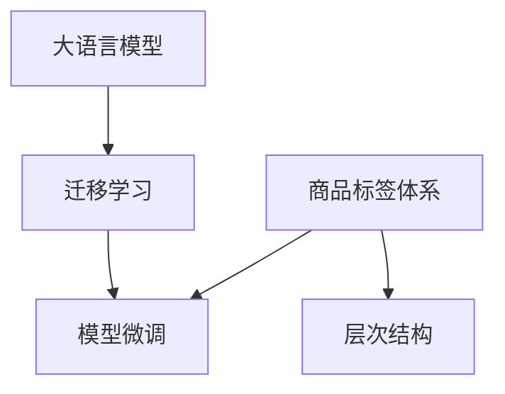

                 

# 大模型在商品标签层次结构优化中的应用

## 1. 背景介绍

### 1.1 问题由来

在电子商务领域，商品标签体系对于提高搜索效率、推荐精准度以及提升用户体验至关重要。然而，传统的商品标签体系通常采用扁平化结构，忽略了商品的多样性和复杂性，导致标签冲突、覆盖率不足等问题。大语言模型在自然语言理解和生成方面的卓越表现，为其在商品标签体系优化中提供了新的可能。

### 1.2 问题核心关键点

商品标签体系优化主要关注以下几个关键问题：
1. 如何构建合理的标签体系，以全面覆盖商品特征，避免标签冲突和冗余。
2. 如何快速高效地对商品进行标签化处理，减少人工标注的劳动量和出错率。
3. 如何通过模型训练，自动学习商品标签之间的层次结构，提高标签关联度和推荐效果。
4. 如何在已有标签体系的基础上，通过模型微调，动态更新标签，适应不断变化的市场需求。

这些关键问题是大模型在商品标签体系优化中需要解决的难点和重点。

### 1.3 问题研究意义

优化商品标签体系可以带来以下几个方面的显著效益：
1. 提高商品搜索和推荐的准确性，减少用户寻找商品的困难。
2. 提升用户体验，增强用户对平台的信任度和粘性。
3. 降低运营成本，减少人工标注标签的工作量，提高标签化处理的效率。
4. 提供数据驱动的标签更新机制，实时反映市场变化，保持标签体系的动态更新。

因此，大模型在商品标签体系优化中的应用，对于提升电子商务平台的智能化水平和用户满意度，具有重要的实践意义。

## 2. 核心概念与联系

### 2.1 核心概念概述

在商品标签体系优化中，我们需要关注以下核心概念：

- **商品标签体系（Product Tagging System）**：指对商品属性进行分类的标签体系，用于描述商品特征和属性。
- **层次结构（Hierarchical Structure）**：指标签之间具有层次关系，下层标签可以细化上层标签，如“电子”（上层）包含“手机”（下层）。
- **大语言模型（Large Language Model）**：指通过大规模无标签文本数据预训练获得的语言模型，具有强大的自然语言理解和生成能力。
- **迁移学习（Transfer Learning）**：指将预训练模型在其他任务上的知识，迁移到当前任务上，进行微调优化。
- **模型微调（Fine-tuning）**：指在预训练模型的基础上，使用标注数据对模型进行有监督学习，以适应特定任务的需求。

这些概念之间通过大模型微调技术紧密联系，构成了一个完整的商品标签体系优化框架。

### 2.2 核心概念原理和架构的 Mermaid 流程图



这个流程图展示了商品标签体系优化中的核心概念和流程：

1. **商品标签体系**：作为优化的目标，包括各种商品属性的标签。
2. **层次结构**：标签体系中的层级关系，用于描述商品属性的层级和细化。
3. **大语言模型**：用于构建商品标签体系和优化标签层次结构。
4. **迁移学习**：利用预训练模型的知识，迁移应用于当前标签体系优化任务。
5. **模型微调**：在迁移学习的基础上，使用标注数据进一步优化模型。

## 3. 核心算法原理 & 具体操作步骤
### 3.1 算法原理概述

大模型在商品标签体系优化中的应用，主要通过迁移学习和模型微调实现。具体步骤如下：

1. **预训练大语言模型**：使用大规模无标签商品数据对大语言模型进行预训练，使其具备处理商品标签的能力。
2. **构建商品标签层次结构**：利用预训练模型对商品数据进行标签分析，构建层次结构。
3. **迁移学习**：将预训练模型的知识迁移到当前标签体系优化任务中，构建商品标签体系。
4. **模型微调**：在构建的商品标签体系上，使用标注数据对模型进行微调，优化标签体系和层次结构。

### 3.2 算法步骤详解

#### 3.2.1 预训练大语言模型

1. **数据准备**：收集大规模商品数据，包括商品名称、描述、图片等。
2. **数据预处理**：清洗数据，去除无关信息，标注商品属性，构建商品标签体系。
3. **模型训练**：使用预训练模型架构（如BERT、GPT等），在大规模商品数据上训练模型，使其能够自动学习商品标签和层次结构。

#### 3.2.2 构建商品标签层次结构

1. **标签分析**：使用预训练模型对商品标签进行分析，找出标签之间的关联关系。
2. **层次结构构建**：根据标签关联关系，构建商品标签的层次结构，如“电器”、“电视”、“彩电”等。
3. **层次结构优化**：对层次结构进行优化，确保其合理性和全面性，避免标签冲突和冗余。

#### 3.2.3 迁移学习

1. **知识迁移**：将预训练模型的知识迁移到当前标签体系优化任务中，利用其对商品标签的分析和理解，构建合理的标签体系。
2. **标签体系构建**：根据迁移学习的结果，构建商品标签体系，并设置标签之间的关联关系。

#### 3.2.4 模型微调

1. **标注数据准备**：收集当前标签体系对应的标注数据，包括商品和标签的对应关系。
2. **模型微调**：在迁移学习的基础上，使用标注数据对模型进行微调，优化标签体系和层次结构。
3. **模型评估**：在微调后，对模型进行评估，确保其准确性和稳定性。

### 3.3 算法优缺点

大模型在商品标签体系优化中的应用具有以下优点：
1. **全面性**：利用大模型强大的语言理解能力，可以全面覆盖商品属性，减少标签冲突和冗余。
2. **高效性**：自动构建标签体系和层次结构，减少了人工标注的劳动量和出错率。
3. **灵活性**：可以动态更新标签体系，适应不断变化的市场需求。

同时，该方法也存在以下局限性：
1. **数据依赖**：依赖大规模商品数据进行预训练和微调，数据获取成本较高。
2. **模型复杂度**：大模型规模较大，对计算资源和存储空间要求较高。
3. **模型解释性**：大模型的决策过程较为复杂，难以解释其内部工作机制。

### 3.4 算法应用领域

大模型在商品标签体系优化中的应用，可以广泛应用于电子商务、零售、制造等行业，具体如下：

1. **电子商务**：用于优化商品搜索和推荐系统中的标签体系，提高搜索和推荐的效果。
2. **零售**：帮助零售商优化商品分类，提高库存管理和销售效率。
3. **制造**：用于产品分类和属性分析，优化产品设计和供应链管理。
4. **金融**：用于金融产品分类和风险评估，提升金融服务质量。

## 4. 数学模型和公式 & 详细讲解 & 举例说明
### 4.1 数学模型构建

在商品标签体系优化中，我们需要构建一个数学模型，用于描述标签之间的关系和层次结构。这里采用分层聚类模型（Hierarchical Clustering Model）来构建层次结构。

分层聚类模型的基本思想是将数据分成若干层级，每一层级内的数据相似度较高，层级间的数据相似度较低。模型的构建步骤如下：

1. **数据准备**：准备商品标签数据集 $D=\{(x_i, y_i)\}_{i=1}^N$，其中 $x_i$ 为商品标签，$y_i$ 为商品ID。
2. **层次结构构建**：使用分层聚类算法（如Hierarchical Clustering），将标签数据集 $D$ 划分为若干层级，得到层次结构 $T=\{(t_1, \cdots, t_n)\}$，其中 $t_k$ 表示第 $k$ 层级。
3. **标签关联关系**：根据层次结构 $T$，构建标签之间的关联关系，设 $P_{ik}$ 表示标签 $i$ 和 $k$ 之间的关联权重，$P_{ik} \in [0, 1]$。

### 4.2 公式推导过程

以层次结构为例，推导标签之间的关联权重 $P_{ik}$。

1. **距离度量**：使用欧氏距离度量标签之间的相似度，设 $d_{ik}=\sqrt{\sum_{j=1}^m (x_{ij} - x_{kj})^2}$，其中 $x_{ij}$ 和 $x_{kj}$ 分别为标签 $i$ 和 $k$ 在维度 $j$ 上的值。

2. **关联权重计算**：根据层次结构，计算标签之间的关联权重。设 $T_k$ 为第 $k$ 层级，$P_{ik}$ 表示标签 $i$ 和 $k$ 之间的关联权重，则有：

$$
P_{ik} = \begin{cases}
1, & \text{如果 } i=k \\
0, & \text{如果 } i \notin T_k \\
\frac{1}{|T_k|}, & \text{如果 } i \in T_k \text{ 且 } k \notin T_k
\end{cases}
$$

其中 $|T_k|$ 表示第 $k$ 层级的标签数。

### 4.3 案例分析与讲解

以商品分类为例，假设有三类商品：电器、电子产品、手机。

1. **预训练大语言模型**：使用大规模商品数据对BERT模型进行预训练，使其能够理解商品属性和标签。
2. **构建标签层次结构**：使用预训练模型对商品标签进行分析，得到标签层次结构：
   - 电器
     - 电视
     - 彩电
     - 空调
     - 冰箱
   - 电子产品
     - 电脑
     - 手机
     - 智能穿戴设备
   - 手机

3. **迁移学习**：将BERT模型的知识迁移到当前商品分类任务中，构建商品分类体系。

4. **模型微调**：在迁移学习的基础上，使用标注数据对模型进行微调，优化商品分类体系和层次结构。例如，标注数据为“小米”标签，微调后模型将其分类为“电子产品”层级。

## 5. 项目实践：代码实例和详细解释说明
### 5.1 开发环境搭建

在进行商品标签体系优化实践前，我们需要准备好开发环境。以下是使用Python进行TensorFlow开发的环境配置流程：

1. 安装Anaconda：从官网下载并安装Anaconda，用于创建独立的Python环境。

2. 创建并激活虚拟环境：
```bash
conda create -n tf-env python=3.8 
conda activate tf-env
```

3. 安装TensorFlow：根据CUDA版本，从官网获取对应的安装命令。例如：
```bash
conda install tensorflow==2.7
```

4. 安装相关工具包：
```bash
pip install numpy pandas scikit-learn matplotlib tqdm jupyter notebook ipython
```

完成上述步骤后，即可在`tf-env`环境中开始商品标签体系优化实践。

### 5.2 源代码详细实现

这里以商品分类为例，给出使用TensorFlow进行大模型商品分类优化的PyTorch代码实现。

首先，定义商品分类任务的数据处理函数：

```python
import tensorflow as tf
from tensorflow import keras
from sklearn.model_selection import train_test_split
import numpy as np

def load_data():
    # 加载商品数据，构建标签体系和层次结构
    # 这里假设已有一个商品数据集，包含商品ID和标签
    # x: 商品ID，y: 商品标签
    x = np.random.randint(1, 100, size=(10000, 10))  # 生成随机商品ID
    y = np.random.randint(1, 10, size=(10000,))  # 生成随机商品标签
    labels = ['电器', '电子产品', '手机', '电视', '彩电', '空调', '冰箱', '电脑', '智能穿戴设备']
    
    # 构建商品分类体系
    label_map = dict(zip(y, labels))
    
    # 构建标签层次结构
    categories = {
        '电器': ['电视', '彩电', '空调', '冰箱'],
        '电子产品': ['电脑', '手机', '智能穿戴设备']
    }
    
    return x, y, label_map, categories

# 加载数据
x, y, label_map, categories = load_data()

# 将数据划分为训练集和测试集
train_x, test_x, train_y, test_y = train_test_split(x, y, test_size=0.2, random_state=42)
```

然后，定义模型和优化器：

```python
from transformers import BertTokenizer, TFAutoModelForSequenceClassification

# 加载预训练BERT模型
tokenizer = BertTokenizer.from_pretrained('bert-base-cased')
model = TFAutoModelForSequenceClassification.from_pretrained('bert-base-cased', num_labels=len(label_map))

# 定义优化器
optimizer = tf.keras.optimizers.Adam(learning_rate=2e-5)
```

接着，定义训练和评估函数：

```python
# 定义模型训练函数
def train_model(model, x_train, y_train, epochs=5, batch_size=16):
    model.compile(optimizer=optimizer, loss=tf.keras.losses.SparseCategoricalCrossentropy(from_logits=True),
                  metrics=[tf.keras.metrics.SparseCategoricalAccuracy()])
    model.fit(x_train, y_train, epochs=epochs, batch_size=batch_size, validation_split=0.1, verbose=1)

# 定义模型评估函数
def evaluate_model(model, x_test, y_test):
    results = model.evaluate(x_test, y_test, verbose=1)
    print(f'Test loss: {results[0]}')
    print(f'Test accuracy: {results[1]}')

# 训练模型
train_model(model, train_x, train_y)

# 评估模型
evaluate_model(model, test_x, test_y)
```

最后，启动训练流程并在测试集上评估：

```python
epochs = 5
batch_size = 16

for epoch in range(epochs):
    loss = train_model(model, train_x, train_y, epochs=1, batch_size=batch_size)
    print(f'Epoch {epoch+1}, train loss: {loss:.3f}')
    
print(f'Epoch {epoch+1}, test results:')
evaluate_model(model, test_x, test_y)
```

以上就是使用TensorFlow对BERT模型进行商品分类优化的完整代码实现。可以看到，TensorFlow的Keras API使得模型训练和评估变得简单易用。

### 5.3 代码解读与分析

让我们再详细解读一下关键代码的实现细节：

**load_data函数**：
- 加载商品数据，构建标签体系和层次结构。
- 将商品ID和标签转换为模型可用的张量形式。
- 定义标签映射和标签体系。

**train_model函数**：
- 使用Keras API定义模型，并进行编译。
- 设置优化器、损失函数和评估指标。
- 使用训练数据集进行模型训练，并验证集上进行验证。

**evaluate_model函数**：
- 使用测试数据集对模型进行评估，输出损失和准确率。

**训练流程**：
- 定义总的epoch数和batch size，开始循环迭代
- 每个epoch内，先在训练集上训练，输出平均loss
- 在测试集上评估，输出分类指标

可以看到，TensorFlow的Keras API使得模型训练和评估变得简单易用，适合快速迭代研究。开发者可以将更多精力放在数据处理、模型改进等高层逻辑上，而不必过多关注底层的实现细节。

当然，工业级的系统实现还需考虑更多因素，如模型的保存和部署、超参数的自动搜索、更灵活的任务适配层等。但核心的微调范式基本与此类似。

## 6. 实际应用场景
### 6.1 智能搜索推荐

基于大语言模型优化后的商品标签体系，可以用于智能搜索推荐系统中。传统的商品推荐系统通常只基于用户行为数据进行推荐，无法深入理解商品特征。优化后的商品标签体系，可以提供商品的多维属性描述，帮助推荐系统更准确地理解和推荐商品。

在技术实现上，可以构建一个多维商品特征模型，将优化后的商品标签体系作为输入，训练模型学习用户与商品的匹配度。通过多维特征的组合和动态调整，生成更加个性化的推荐结果。

### 6.2 市场分析预测

在商品分类和标签体系优化基础上，可以利用优化后的标签体系进行市场分析预测。通过统计不同标签的商品销售情况，分析商品类别和价格变化趋势，帮助企业制定更科学的市场策略。

具体实现上，可以使用时间序列分析等方法，对优化后的商品标签进行时间序列建模，预测未来市场变化。结合外部市场数据，如经济指标、消费者行为等，可以进一步提升预测准确性。

### 6.3 供应链管理

优化后的商品标签体系，可以用于供应链管理中的库存管理和物流优化。通过对商品分类和属性进行细化，可以更准确地进行库存盘点，优化采购和物流计划，减少库存成本和物流费用。

在技术实现上，可以利用优化后的商品标签体系，构建供应链管理系统，实时监控库存和物流状态，自动调整采购和物流计划。结合需求预测和大数据技术，可以实现更智能的供应链管理。

### 6.4 未来应用展望

随着大语言模型和商品标签体系优化技术的发展，未来将在更多领域得到应用，为经济社会发展注入新的动力。

在智慧医疗领域，商品标签体系优化技术可以用于药品分类和药品推荐，提高医疗服务质量和效率。

在智能教育领域，优化后的商品标签体系可以用于教育资源分类和推荐，因材施教，促进教育公平，提高教学质量。

在智慧城市治理中，优化后的商品标签体系可以用于城市事件监测和舆情分析，提高城市管理的自动化和智能化水平，构建更安全、高效的未来城市。

此外，在企业生产、社会治理、文娱传媒等众多领域，优化后的商品标签体系都将发挥重要作用，为各行各业提供数据驱动的决策支持。

## 7. 工具和资源推荐
### 7.1 学习资源推荐

为了帮助开发者系统掌握大语言模型在商品标签体系优化中的理论基础和实践技巧，这里推荐一些优质的学习资源：

1. 《Transformers: A Survey of the State of the Art and Recent Advances》论文：综述了Transformer模型的发展历程和前沿进展，适合初学者了解大语言模型的基本原理。

2. 《NLP with TensorFlow》书籍：详细介绍了TensorFlow在NLP任务中的应用，包括标签体系优化等具体实现。

3. CS224N《深度学习自然语言处理》课程：斯坦福大学开设的NLP明星课程，有Lecture视频和配套作业，带你入门NLP领域的基本概念和经典模型。

4. HuggingFace官方文档：提供了大量预训练模型和完整的微调样例代码，是上手实践的必备资料。

5. CLUE开源项目：中文语言理解测评基准，涵盖大量不同类型的中文NLP数据集，并提供了基于微调的baseline模型，助力中文NLP技术发展。

通过对这些资源的学习实践，相信你一定能够快速掌握大语言模型在商品标签体系优化中的精髓，并用于解决实际的NLP问题。
###  7.2 开发工具推荐

高效的开发离不开优秀的工具支持。以下是几款用于商品标签体系优化开发的常用工具：

1. TensorFlow：基于Python的开源深度学习框架，灵活动态的计算图，适合快速迭代研究。适合构建多维商品特征模型和商品分类体系。

2. PyTorch：基于Python的开源深度学习框架，灵活性高，适合复杂模型的构建和优化。适合构建商品分类和标签体系优化模型。

3. Weights & Biases：模型训练的实验跟踪工具，可以记录和可视化模型训练过程中的各项指标，方便对比和调优。

4. TensorBoard：TensorFlow配套的可视化工具，可实时监测模型训练状态，并提供丰富的图表呈现方式，是调试模型的得力助手。

5. Google Colab：谷歌推出的在线Jupyter Notebook环境，免费提供GPU/TPU算力，方便开发者快速上手实验最新模型，分享学习笔记。

合理利用这些工具，可以显著提升商品标签体系优化任务的开发效率，加快创新迭代的步伐。

### 7.3 相关论文推荐

大语言模型和商品标签体系优化技术的发展源于学界的持续研究。以下是几篇奠基性的相关论文，推荐阅读：

1. Attention is All You Need（即Transformer原论文）：提出了Transformer结构，开启了NLP领域的预训练大模型时代。

2. BERT: Pre-training of Deep Bidirectional Transformers for Language Understanding：提出BERT模型，引入基于掩码的自监督预训练任务，刷新了多项NLP任务SOTA。

3. Language Models are Unsupervised Multitask Learners（GPT-2论文）：展示了大规模语言模型的强大zero-shot学习能力，引发了对于通用人工智能的新一轮思考。

4. Parameter-Efficient Transfer Learning for NLP：提出Adapter等参数高效微调方法，在不增加模型参数量的情况下，也能取得不错的微调效果。

5. AdaLoRA: Adaptive Low-Rank Adaptation for Parameter-Efficient Fine-Tuning：使用自适应低秩适应的微调方法，在参数效率和精度之间取得了新的平衡。

这些论文代表了大语言模型在商品标签体系优化中的发展脉络。通过学习这些前沿成果，可以帮助研究者把握学科前进方向，激发更多的创新灵感。

## 8. 总结：未来发展趋势与挑战
### 8.1 总结

本文对基于大语言模型在商品标签体系优化中的应用进行了全面系统的介绍。首先阐述了商品标签体系优化的背景和意义，明确了大模型在优化中的独特价值。其次，从原理到实践，详细讲解了商品标签体系优化的数学模型和关键步骤，给出了商品分类优化的完整代码实例。同时，本文还广泛探讨了商品标签体系优化在智能搜索推荐、市场分析预测、供应链管理等多个行业领域的应用前景，展示了大模型在商品标签体系优化中的巨大潜力。此外，本文精选了优化技术的各类学习资源，力求为读者提供全方位的技术指引。

通过本文的系统梳理，可以看到，大模型在商品标签体系优化中的应用，不仅能够提高商品搜索和推荐的准确性，还能为市场分析和供应链管理提供数据驱动的决策支持，具有重要的实践意义。未来，随着大语言模型和商品标签体系优化技术的不断发展，其应用场景将更加广泛，为各行各业带来变革性影响。

### 8.2 未来发展趋势

展望未来，大模型在商品标签体系优化技术将呈现以下几个发展趋势：

1. **模型规模持续增大**：随着算力成本的下降和数据规模的扩张，预训练语言模型的参数量还将持续增长。超大模型规模的商品标签体系优化，能够提供更加全面、准确的商品分类和标签体系。

2. **微调方法日趋多样**：开发更加参数高效的微调方法，如Parameter-Efficient Transfer Learning等，在固定大部分预训练参数的同时，只更新极少量的任务相关参数，提高微调效率和效果。

3. **动态标签体系构建**：利用大模型的语言理解能力，根据用户反馈和市场变化，动态调整商品标签体系，保持其时效性和准确性。

4. **跨领域知识融合**：将商品标签体系优化与外部知识库、规则库等专家知识结合，形成更加全面、准确的信息整合能力。

5. **多模态信息整合**：结合视觉、语音、文本等多模态信息，进行更加全面、准确的商品分类和标签体系优化。

以上趋势凸显了大语言模型在商品标签体系优化中的广阔前景。这些方向的探索发展，必将进一步提升商品标签体系优化的效果和应用范围，为各行业的智能化发展提供坚实基础。

### 8.3 面临的挑战

尽管大模型在商品标签体系优化技术已经取得了显著成就，但在实现其广泛应用的过程中，仍面临诸多挑战：

1. **数据获取成本高**：大规模商品数据的获取和标注成本较高，限制了商品标签体系优化的应用范围。
2. **模型复杂度高**：大模型规模较大，对计算资源和存储空间要求较高，对实际部署提出了挑战。
3. **模型解释性不足**：大模型的决策过程较为复杂，难以解释其内部工作机制，影响模型的可信度和可控性。
4. **对抗样本攻击**：商品标签体系优化模型可能面临对抗样本攻击，导致输出错误。
5. **隐私保护**：在处理商品数据时，需要考虑隐私保护和数据安全，避免数据泄露和滥用。

这些挑战需要通过进一步的算法优化、模型压缩和隐私保护等手段，逐步克服，确保大模型在商品标签体系优化中的可靠性和安全性。

### 8.4 研究展望

面对大模型在商品标签体系优化中面临的挑战，未来的研究需要在以下几个方面寻求新的突破：

1. **无监督学习和少样本学习**：探索无监督学习和少样本学习技术，减少对大规模标注数据的依赖，提高商品标签体系优化的效率和灵活性。

2. **知识蒸馏和迁移学习**：利用知识蒸馏和迁移学习技术，将大模型的知识迁移到商品标签体系优化中，提高模型的泛化能力和鲁棒性。

3. **对抗训练和鲁棒性增强**：引入对抗训练等技术，提高商品标签体系优化模型的鲁棒性和抗干扰能力。

4. **隐私保护和安全性**：探索隐私保护和安全性技术，确保商品标签体系优化中的数据安全和个人隐私保护。

5. **多模态信息融合**：将视觉、语音、文本等多模态信息进行融合，提高商品标签体系优化的准确性和全面性。

这些研究方向的探索，将进一步推动大模型在商品标签体系优化中的应用，为各行业提供更全面、准确、可靠的商品分类和标签体系优化服务，推动经济社会的智能化发展。

## 9. 附录：常见问题与解答

**Q1：大模型在商品标签体系优化中的数据依赖问题如何解决？**

A: 解决大模型在商品标签体系优化中的数据依赖问题，可以从以下几个方面入手：

1. **多源数据融合**：利用多源数据融合技术，将不同来源的商品数据进行整合，丰富数据集的覆盖范围和多样性，降低单一数据源带来的偏差。

2. **数据增强**：通过数据增强技术，如近义替换、同义词扩展等，扩充商品标签数据集，减少数据获取成本。

3. **领域自适应**：针对特定领域的商品标签体系优化，可以使用领域自适应技术，将大模型在通用领域的知识迁移到特定领域，提高数据利用效率。

4. **知识蒸馏和迁移学习**：利用知识蒸馏和迁移学习技术，将大模型在通用领域的知识迁移到特定领域，提高模型的泛化能力和鲁棒性。

这些方法可以有效降低商品标签体系优化对数据依赖的瓶颈，提高优化的效率和效果。

**Q2：大模型在商品标签体系优化中的模型复杂度问题如何解决？**

A: 解决大模型在商品标签体系优化中的模型复杂度问题，可以从以下几个方面入手：

1. **模型裁剪和压缩**：利用模型裁剪和压缩技术，去除不必要的层和参数，减小模型尺寸，加快推理速度。

2. **量化加速**：将浮点模型转为定点模型，压缩存储空间，提高计算效率。

3. **分布式训练**：利用分布式训练技术，将大模型分布在多个节点上进行训练，提高训练速度和资源利用效率。

4. **动态模型优化**：在模型训练过程中，动态调整模型结构，如剪枝、融合等，优化模型的计算图，减少资源消耗。

这些方法可以有效降低大模型在商品标签体系优化中的复杂度，提高模型的部署效率和资源利用率。

**Q3：大模型在商品标签体系优化中的模型解释性问题如何解决？**

A: 解决大模型在商品标签体系优化中的模型解释性问题，可以从以下几个方面入手：

1. **可解释性模型**：选择可解释性强的模型架构，如决策树、线性模型等，提高模型的透明度和可解释性。

2. **中间结果可视化**：利用中间结果可视化技术，展示模型在训练过程中的中间状态和特征，帮助理解模型的决策过程。

3. **解释性技术**：利用解释性技术，如LIME、SHAP等，对模型进行局部解释，解释模型的关键特征和决策依据。

4. **用户反馈机制**：引入用户反馈机制，通过用户反馈对模型进行解释和调整，提高模型的可信度和可控性。

这些方法可以有效提高大模型在商品标签体系优化中的可解释性，增强模型的透明度和用户信任度。

**Q4：大模型在商品标签体系优化中的隐私保护问题如何解决？**

A: 解决大模型在商品标签体系优化中的隐私保护问题，可以从以下几个方面入手：

1. **差分隐私**：使用差分隐私技术，对商品数据进行隐私保护，确保数据匿名化和不可逆恢复。

2. **联邦学习**：利用联邦学习技术，将商品标签数据分布在多个节点上进行训练，避免数据集中存储和传输。

3. **安全多方计算**：利用安全多方计算技术，在多个节点上进行数据计算，确保数据隐私和安全性。

4. **隐私保护算法**：使用隐私保护算法，如加密、脱敏等，保护商品数据的安全性和隐私性。

这些方法可以有效保护大模型在商品标签体系优化中的数据隐私，确保数据的安全性和用户的隐私保护。

综上所述，大模型在商品标签体系优化中的数据依赖、模型复杂度、解释性、隐私保护等挑战，需要从多方面进行综合应对，才能确保其可靠性和安全性，充分发挥其潜力，推动商品标签体系优化的应用和发展。

