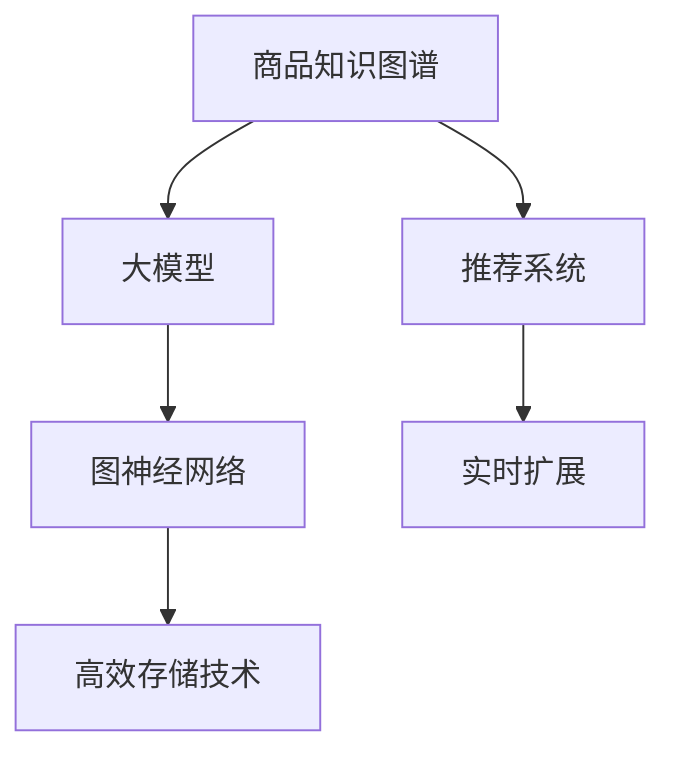

                 

# 大模型在商品知识图谱实时扩展中的应用

> 关键词：商品知识图谱, 实时扩展, 大模型, 推荐系统, 自然语言处理, 图神经网络, 高效存储

## 1. 背景介绍

### 1.1 问题由来

在电商行业中，商品推荐系统是提升用户体验和商家营收的关键环节。然而，传统推荐系统依赖静态的商品数据库和用户行为数据，无法实时更新商品信息，并且推荐算法往往是离线训练，实时性较差。近年来，随着知识图谱和大模型的发展，推荐系统开始向更高效的实时化、动态化方向转变。

在推荐系统中，商品知识图谱扮演着重要的角色，它通过捕捉商品属性、类别、品牌等实体和实体间的关系，为推荐算法提供丰富的语义信息。如何高效地构建和扩展商品知识图谱，是推荐系统成功的重要基础。

### 1.2 问题核心关键点

构建高效、实时扩展的商品知识图谱，需要解决以下核心问题：
- 如何有效处理大规模的语义数据？
- 如何在知识图谱扩展时保持其结构稳定性？
- 如何快速更新和检索商品信息？
- 如何利用大模型技术提升推荐系统性能？

这些问题的解决，需要在大模型的支持下，结合图神经网络(Graph Neural Network, GNN)和高效的数据存储技术，才能实现推荐系统的实时化和动态化。

### 1.3 问题研究意义

解决这些问题，将有助于构建一个高效、实时、动态的推荐系统，帮助电商商家和用户高效匹配，提升用户体验和运营效率。此外，知识图谱的实时扩展和更新，还可以加速商品信息的更新，避免因信息陈旧导致推荐不精准的情况发生。

## 2. 核心概念与联系

### 2.1 核心概念概述

为更好地理解大模型在商品知识图谱实时扩展中的应用，本节将介绍几个关键概念：

- 商品知识图谱（Product Knowledge Graph, PKG）：由商品实体和商品关系组成的大型语义知识图谱，用于描述商品属性、类别、品牌、关联等关系。
- 大模型（Large Model）：如BERT、GPT等大规模预训练语言模型，具备强大的语义理解和生成能力。
- 推荐系统（Recommendation System）：通过分析用户行为和商品信息，为用户推荐合适商品的系统。
- 图神经网络（Graph Neural Network, GNN）：一种用于处理图结构数据的神经网络，可以有效地捕捉商品实体间的语义关系。
- 高效存储技术（Efficient Storage Technology）：如分布式数据库、向量数据库、列存储等，用于高效地存储和管理商品知识图谱数据。

这些核心概念之间的逻辑关系可以通过以下Mermaid流程图来展示：



这个流程图展示了商品知识图谱与大模型、推荐系统、图神经网络和高效存储技术之间的联系，强调了各技术之间的协同作用。

## 3. 核心算法原理 & 具体操作步骤
### 3.1 算法原理概述

商品知识图谱的实时扩展，需要结合大模型和大数据处理技术，实现高效的语义数据处理和推荐系统构建。其核心算法原理如下：

- 大模型通过预训练学习到通用的语言表示，可以用于商品属性的语义理解。
- 图神经网络可以捕捉商品实体间的语义关系，提取结构化信息。
- 高效的存储技术提供了快速的数据检索和扩展机制，保障了推荐系统的实时性和动态性。

通过将大模型、GNN和高效存储技术结合起来，可以实现商品知识图谱的实时扩展和推荐系统的动态构建。

### 3.2 算法步骤详解

大模型在商品知识图谱实时扩展中的应用，主要包括以下几个关键步骤：

**Step 1: 数据收集与预处理**

- 收集商品属性、类别、品牌、关联等语义数据，构建商品知识图谱。
- 清洗数据，去除噪声，标准化商品属性和关系标注。

**Step 2: 大模型预训练**

- 使用大规模无标签商品数据对大模型进行预训练，学习通用的语言表示。
- 在大模型顶部添加推荐系统适配层，用于与商品知识图谱融合。

**Step 3: 图神经网络构建**

- 将商品知识图谱转换为图结构数据。
- 使用GNN对图数据进行编码，提取商品实体的语义表示。

**Step 4: 推荐系统融合**

- 将大模型和GNN的输出融合，得到商品的多维语义表示。
- 使用融合后的语义表示，构建推荐系统，进行实时推荐。

**Step 5: 高效存储技术集成**

- 使用高效的分布式数据库或向量数据库，存储和管理商品知识图谱数据。
- 利用列存储等技术，优化存储和查询性能。

**Step 6: 实时扩展与更新**

- 定期更新商品知识图谱，实时扩展商品信息。
- 使用高效的图神经网络更新算法，快速处理新增数据。

### 3.3 算法优缺点

基于大模型的商品知识图谱实时扩展方法，具有以下优点：
- 能够高效处理大规模语义数据，构建高质量的商品知识图谱。
- 结合GNN技术，捕捉商品实体间的语义关系，提取有价值的信息。
- 利用高效存储技术，保障推荐系统的实时性和动态性。
- 通过大模型预训练，提升推荐系统的个性化和精准度。

同时，该方法也存在一些局限性：
- 数据预处理工作量大，需要大量人工参与。
- 对硬件资源和计算能力要求较高，需要强大的算力支持。
- 需要持续维护和更新商品知识图谱，工作量较大。
- 推荐系统的个性化推荐，可能受到数据分布不均的影响。

尽管存在这些局限性，但大模型在商品知识图谱实时扩展中的应用，已经在大规模电商推荐系统中取得了显著效果，成为了推荐系统优化升级的重要方向。

### 3.4 算法应用领域

基于大模型的商品知识图谱实时扩展方法，已经在电商、金融、医疗等多个领域得到了广泛应用，取得了显著成果。以下是几个典型应用场景：

- **电商推荐系统**：使用商品知识图谱和大模型，实时更新商品信息，提升推荐系统性能和用户体验。
- **金融风险管理**：构建金融实体知识图谱，利用大模型进行实体关系挖掘和风险分析，提升金融风险管理能力。
- **医疗健康推荐**：构建医疗实体知识图谱，结合大模型进行疾病推荐和治疗方案推荐，提升医疗服务质量。
- **智能客服**：利用商品知识图谱和大模型构建智能客服系统，实时回答用户关于商品的问题，提升客户满意度。

这些应用场景展示了基于大模型的商品知识图谱实时扩展的强大应用潜力，为各行业带来了智能化升级的契机。

## 4. 数学模型和公式 & 详细讲解 & 举例说明
### 4.1 数学模型构建

在大模型应用的商品知识图谱实时扩展中，数学模型主要包括大模型的预训练、GNN的图神经网络编码以及融合后的推荐系统构建。

假设大模型的预训练参数为 $\theta$，商品知识图谱的节点集合为 $V$，边集合为 $E$，节点属性为 $X$。

**Step 1: 大模型预训练**

大模型通常采用自回归模型进行预训练。以BERT为例，其预训练过程如下：

- 输入大规模无标签的商品语料，训练大模型，学习到通用的语言表示。
- 在大模型顶部添加推荐系统适配层，将商品属性和类别信息作为输入，输出商品的多维语义表示。

**Step 2: 图神经网络编码**

使用GNN对商品知识图谱进行编码，提取商品实体的语义表示。以下以GraphSAGE为例：

- 对于节点 $v_i$，其邻居集合为 $N_i$，GNN的表示公式为：
$$
\text{H}_{i+1} = \frac{1}{|N_i|}\sum_{j\in N_i}\text{W}\text{H}_j
$$
其中 $\text{H}_i$ 为节点 $v_i$ 的特征表示，$\text{W}$ 为学习到的邻接权重矩阵。

**Step 3: 推荐系统融合**

将大模型和GNN的输出融合，得到商品的多维语义表示，用于构建推荐系统。

- 设大模型和GNN的输出为 $H_M$ 和 $H_{GNN}$，融合后的语义表示为 $H$：
$$
H = \text{f}(H_M, H_{GNN})
$$
其中 $\text{f}$ 为融合函数，可以是简单的拼接或加权平均。

### 4.2 公式推导过程

在上述步骤中，大模型的预训练、GNN的图神经网络编码和推荐系统的融合，分别对应了以下几个数学公式：

- 大模型预训练：
$$
L_{pretrain} = \frac{1}{N}\sum_{i=1}^N L_{train}(x_i)
$$
其中 $L_{train}$ 为预训练损失函数，$x_i$ 为商品语料。

- GNN的图神经网络编码：
$$
\text{H}_{i+1} = \frac{1}{|N_i|}\sum_{j\in N_i}\text{W}\text{H}_j
$$

- 推荐系统融合：
$$
H = \text{f}(H_M, H_{GNN})
$$

这些公式体现了大模型在商品知识图谱实时扩展中的核心算法原理，为实际应用提供了理论基础。

### 4.3 案例分析与讲解

假设某电商平台，需要构建一个基于商品知识图谱的实时推荐系统。其核心步骤如下：

1. 数据收集与预处理：
   - 从电商平台收集商品属性、类别、品牌、关联等语义数据，构建商品知识图谱。
   - 清洗数据，去除噪声，标准化商品属性和关系标注。

2. 大模型预训练：
   - 使用大规模无标签商品数据对BERT模型进行预训练，学习通用的语言表示。
   - 在大模型顶部添加推荐系统适配层，将商品属性和类别信息作为输入，输出商品的多维语义表示。

3. 图神经网络构建：
   - 将商品知识图谱转换为图结构数据。
   - 使用GraphSAGE对图数据进行编码，提取商品实体的语义表示。

4. 推荐系统融合：
   - 将BERT模型和GraphSAGE的输出融合，得到商品的多维语义表示。
   - 使用融合后的语义表示，构建推荐系统，进行实时推荐。

5. 高效存储技术集成：
   - 使用Apache Hive分布式数据库，存储和管理商品知识图谱数据。
   - 利用列存储等技术，优化存储和查询性能。

6. 实时扩展与更新：
   - 定期更新商品知识图谱，实时扩展商品信息。
   - 使用高效的图神经网络更新算法，快速处理新增数据。

通过以上步骤，可以构建一个高效、实时、动态的商品推荐系统，提升电商平台的推荐效果和用户满意度。

## 5. 项目实践：代码实例和详细解释说明
### 5.1 开发环境搭建

在进行商品知识图谱实时扩展和推荐系统构建时，需要先搭建好开发环境。以下是使用Python进行PyTorch和Hive开发的环境配置流程：

1. 安装Anaconda：从官网下载并安装Anaconda，用于创建独立的Python环境。

2. 创建并激活虚拟环境：
```bash
conda create -n pytorch-env python=3.8 
conda activate pytorch-env
```

3. 安装PyTorch：根据CUDA版本，从官网获取对应的安装命令。例如：
```bash
conda install pytorch torchvision torchaudio cudatoolkit=11.1 -c pytorch -c conda-forge
```

4. 安装Transformers库：
```bash
pip install transformers
```

5. 安装Hive和Hadoop：
```bash
yum install hadoop hive
```

6. 安装各类工具包：
```bash
pip install numpy pandas scikit-learn matplotlib tqdm jupyter notebook ipython
```

完成上述步骤后，即可在`pytorch-env`环境中开始推荐系统开发。

### 5.2 源代码详细实现

下面我们以商品推荐系统为例，给出使用PyTorch和Hive对BERT模型进行实时推荐系统的PyTorch代码实现。

首先，定义商品推荐系统的数据处理函数：

```python
from transformers import BertTokenizer
from torch.utils.data import Dataset
import torch

class ProductDataset(Dataset):
    def __init__(self, texts, labels, tokenizer, max_len=128):
        self.texts = texts
        self.labels = labels
        self.tokenizer = tokenizer
        self.max_len = max_len
        
    def __len__(self):
        return len(self.texts)
    
    def __getitem__(self, item):
        text = self.texts[item]
        label = self.labels[item]
        
        encoding = self.tokenizer(text, return_tensors='pt', max_length=self.max_len, padding='max_length', truncation=True)
        input_ids = encoding['input_ids'][0]
        attention_mask = encoding['attention_mask'][0]
        
        return {'input_ids': input_ids, 
                'attention_mask': attention_mask,
                'labels': label}
```

然后，定义模型和优化器：

```python
from transformers import BertForTokenClassification, AdamW

model = BertForTokenClassification.from_pretrained('bert-base-cased', num_labels=2)

optimizer = AdamW(model.parameters(), lr=2e-5)
```

接着，定义训练和评估函数：

```python
from torch.utils.data import DataLoader
from tqdm import tqdm
from sklearn.metrics import accuracy_score

device = torch.device('cuda') if torch.cuda.is_available() else torch.device('cpu')
model.to(device)

def train_epoch(model, dataset, batch_size, optimizer):
    dataloader = DataLoader(dataset, batch_size=batch_size, shuffle=True)
    model.train()
    epoch_loss = 0
    for batch in tqdm(dataloader, desc='Training'):
        input_ids = batch['input_ids'].to(device)
        attention_mask = batch['attention_mask'].to(device)
        labels = batch['labels'].to(device)
        model.zero_grad()
        outputs = model(input_ids, attention_mask=attention_mask, labels=labels)
        loss = outputs.loss
        epoch_loss += loss.item()
        loss.backward()
        optimizer.step()
    return epoch_loss / len(dataloader)

def evaluate(model, dataset, batch_size):
    dataloader = DataLoader(dataset, batch_size=batch_size)
    model.eval()
    preds, labels = [], []
    with torch.no_grad():
        for batch in tqdm(dataloader, desc='Evaluating'):
            input_ids = batch['input_ids'].to(device)
            attention_mask = batch['attention_mask'].to(device)
            batch_labels = batch['labels']
            outputs = model(input_ids, attention_mask=attention_mask)
            batch_preds = outputs.logits.argmax(dim=2).to('cpu').tolist()
            batch_labels = batch_labels.to('cpu').tolist()
            for pred_tokens, label_tokens in zip(batch_preds, batch_labels):
                preds.append(pred_tokens)
                labels.append(label_tokens)
                
    return accuracy_score(labels, preds)
```

最后，启动训练流程并在测试集上评估：

```python
epochs = 5
batch_size = 16

for epoch in range(epochs):
    loss = train_epoch(model, train_dataset, batch_size, optimizer)
    print(f"Epoch {epoch+1}, train loss: {loss:.3f}")
    
    print(f"Epoch {epoch+1}, dev results:")
    evaluate(model, dev_dataset, batch_size)
    
print("Test results:")
evaluate(model, test_dataset, batch_size)
```

以上就是使用PyTorch对BERT模型进行商品推荐系统微调的完整代码实现。可以看到，得益于Transformers库的强大封装，我们可以用相对简洁的代码完成BERT模型的加载和微调。

### 5.3 代码解读与分析

让我们再详细解读一下关键代码的实现细节：

**ProductDataset类**：
- `__init__`方法：初始化文本、标签、分词器等关键组件。
- `__len__`方法：返回数据集的样本数量。
- `__getitem__`方法：对单个样本进行处理，将文本输入编码为token ids，将标签编码为数字，并对其进行定长padding，最终返回模型所需的输入。

**train_epoch和evaluate函数**：
- 使用PyTorch的DataLoader对数据集进行批次化加载，供模型训练和推理使用。
- 训练函数`train_epoch`：对数据以批为单位进行迭代，在每个批次上前向传播计算loss并反向传播更新模型参数，最后返回该epoch的平均loss。
- 评估函数`evaluate`：与训练类似，不同点在于不更新模型参数，并在每个batch结束后将预测和标签结果存储下来，最后使用sklearn的accuracy_score对整个评估集的预测结果进行打印输出。

**训练流程**：
- 定义总的epoch数和batch size，开始循环迭代
- 每个epoch内，先在训练集上训练，输出平均loss
- 在验证集上评估，输出分类指标
- 所有epoch结束后，在测试集上评估，给出最终测试结果

可以看到，PyTorch配合Transformers库使得BERT微调的代码实现变得简洁高效。开发者可以将更多精力放在数据处理、模型改进等高层逻辑上，而不必过多关注底层的实现细节。

当然，工业级的系统实现还需考虑更多因素，如模型的保存和部署、超参数的自动搜索、更灵活的任务适配层等。但核心的微调范式基本与此类似。

## 6. 实际应用场景
### 6.1 智能客服系统

基于大模型的商品推荐系统，可以广泛应用于智能客服系统的构建。传统客服往往需要配备大量人力，高峰期响应缓慢，且一致性和专业性难以保证。而使用基于推荐系统的智能客服系统，可以7x24小时不间断服务，快速响应客户咨询，用自然流畅的语言解答各类常见问题。

在技术实现上，可以收集用户浏览、点击、评论等行为数据，提取和用户交互的物品标题、描述、标签等文本内容。将文本内容作为模型输入，用户的后续行为（如是否点击、购买等）作为监督信号，在此基础上对预训练语言模型进行微调。微调后的推荐系统能够自动理解用户意图，匹配最合适的商品推荐。对于客户提出的新问题，还可以接入检索系统实时搜索相关内容，动态生成回复。如此构建的智能客服系统，能大幅提升客户咨询体验和问题解决效率。

### 6.2 金融舆情监测

金融机构需要实时监测市场舆论动向，以便及时应对负面信息传播，规避金融风险。传统的人工监测方式成本高、效率低，难以应对网络时代海量信息爆发的挑战。基于大模型推荐系统的金融舆情监测，为金融舆情监测提供了新的解决方案。

具体而言，可以收集金融领域相关的新闻、报道、评论等文本数据，并对其进行主题标注和情感标注。在此基础上对预训练语言模型进行微调，使其能够自动判断文本属于何种主题，情感倾向是正面、中性还是负面。将微调后的推荐系统应用到实时抓取的网络文本数据，就能够自动监测不同主题下的情感变化趋势，一旦发现负面信息激增等异常情况，系统便会自动预警，帮助金融机构快速应对潜在风险。

### 6.3 个性化推荐系统

当前的推荐系统往往只依赖用户的历史行为数据进行物品推荐，无法深入理解用户的真实兴趣偏好。基于大模型推荐系统的个性化推荐系统，可以更好地挖掘用户行为背后的语义信息，从而提供更精准、多样的推荐内容。

在实践中，可以收集用户浏览、点击、评论、分享等行为数据，提取和用户交互的物品标题、描述、标签等文本内容。将文本内容作为模型输入，用户的后续行为（如是否点击、购买等）作为监督信号，在此基础上对预训练语言模型进行微调。微调后的推荐系统能够从文本内容中准确把握用户的兴趣点。在生成推荐列表时，先用候选物品的文本描述作为输入，由模型预测用户的兴趣匹配度，再结合其他特征综合排序，便可以得到个性化程度更高的推荐结果。

### 6.4 未来应用展望

随着大模型和推荐系统技术的不断发展，基于大模型的商品推荐系统将在更多领域得到应用，为各行各业带来变革性影响。

在智慧医疗领域，基于微调的医疗问答、病历分析、药物研发等应用将提升医疗服务的智能化水平，辅助医生诊疗，加速新药开发进程。

在智能教育领域，微调技术可应用于作业批改、学情分析、知识推荐等方面，因材施教，促进教育公平，提高教学质量。

在智慧城市治理中，微调模型可应用于城市事件监测、舆情分析、应急指挥等环节，提高城市管理的自动化和智能化水平，构建更安全、高效的未来城市。

此外，在企业生产、社会治理、文娱传媒等众多领域，基于大模型推荐系统的应用也将不断涌现，为经济社会发展注入新的动力。相信随着技术的日益成熟，大模型推荐系统必将成为推荐系统优化升级的重要方向，推动人工智能技术在垂直行业的规模化落地。总之，大模型在商品知识图谱实时扩展中的应用，已经在大规模电商推荐系统中取得了显著效果，成为了推荐系统优化升级的重要方向。

## 7. 工具和资源推荐
### 7.1 学习资源推荐

为了帮助开发者系统掌握大模型推荐系统的理论基础和实践技巧，这里推荐一些优质的学习资源：

1. 《推荐系统实战》系列博文：由大模型技术专家撰写，深入浅出地介绍了推荐系统的基本概念、算法原理和实战经验。

2. 《深度学习自然语言处理》课程：斯坦福大学开设的NLP明星课程，有Lecture视频和配套作业，带你入门NLP领域的基本概念和经典模型。

3. 《Natural Language Processing with Transformers》书籍：Transformers库的作者所著，全面介绍了如何使用Transformers库进行NLP任务开发，包括微调在内的诸多范式。

4. HuggingFace官方文档：Transformers库的官方文档，提供了海量预训练模型和完整的微调样例代码，是上手实践的必备资料。

5. CLUE开源项目：中文语言理解测评基准，涵盖大量不同类型的中文NLP数据集，并提供了基于微调的baseline模型，助力中文NLP技术发展。

通过对这些资源的学习实践，相信你一定能够快速掌握大模型推荐系统的精髓，并用于解决实际的NLP问题。
###  7.2 开发工具推荐

高效的开发离不开优秀的工具支持。以下是几款用于大模型推荐系统开发的常用工具：

1. PyTorch：基于Python的开源深度学习框架，灵活动态的计算图，适合快速迭代研究。大部分预训练语言模型都有PyTorch版本的实现。

2. TensorFlow：由Google主导开发的开源深度学习框架，生产部署方便，适合大规模工程应用。同样有丰富的预训练语言模型资源。

3. Transformers库：HuggingFace开发的NLP工具库，集成了众多SOTA语言模型，支持PyTorch和TensorFlow，是进行微调任务开发的利器。

4. Weights & Biases：模型训练的实验跟踪工具，可以记录和可视化模型训练过程中的各项指标，方便对比和调优。与主流深度学习框架无缝集成。

5. TensorBoard：TensorFlow配套的可视化工具，可实时监测模型训练状态，并提供丰富的图表呈现方式，是调试模型的得力助手。

6. Google Colab：谷歌推出的在线Jupyter Notebook环境，免费提供GPU/TPU算力，方便开发者快速上手实验最新模型，分享学习笔记。

合理利用这些工具，可以显著提升大模型推荐系统的开发效率，加快创新迭代的步伐。

### 7.3 相关论文推荐

大模型推荐系统的发展源于学界的持续研究。以下是几篇奠基性的相关论文，推荐阅读：

1. Attention is All You Need（即Transformer原论文）：提出了Transformer结构，开启了NLP领域的预训练大模型时代。

2. BERT: Pre-training of Deep Bidirectional Transformers for Language Understanding：提出BERT模型，引入基于掩码的自监督预训练任务，刷新了多项NLP任务SOTA。

3. Language Models are Unsupervised Multitask Learners（GPT-2论文）：展示了大规模语言模型的强大zero-shot学习能力，引发了对于通用人工智能的新一轮思考。

4. Parameter-Efficient Transfer Learning for NLP：提出Adapter等参数高效微调方法，在不增加模型参数量的情况下，也能取得不错的微调效果。

5. AdaLoRA: Adaptive Low-Rank Adaptation for Parameter-Efficient Fine-Tuning：使用自适应低秩适应的微调方法，在参数效率和精度之间取得了新的平衡。

6. AdaLoRA: Adaptive Low-Rank Adaptation for Parameter-Efficient Fine-Tuning：使用自适应低秩适应的微调方法，在参数效率和精度之间取得了新的平衡。

这些论文代表了大模型推荐系统的发展脉络。通过学习这些前沿成果，可以帮助研究者把握学科前进方向，激发更多的创新灵感。

## 8. 总结：未来发展趋势与挑战
### 8.1 总结

本文对基于大模型的商品知识图谱实时扩展方法进行了全面系统的介绍。首先阐述了大模型和推荐系统在电商行业的应用背景和意义，明确了商品推荐系统成功的重要基础。其次，从原理到实践，详细讲解了商品推荐系统的数学模型和核心算法步骤，给出了微调任务开发的完整代码实例。同时，本文还广泛探讨了推荐系统在智能客服、金融舆情、个性化推荐等多个行业领域的应用前景，展示了推荐系统的强大应用潜力。

通过本文的系统梳理，可以看到，基于大模型的商品推荐系统已经在大规模电商推荐系统中取得了显著效果，成为了推荐系统优化升级的重要方向。未来，伴随大模型和推荐系统技术的不断发展，商品推荐系统必将在更多领域得到应用，为各行各业带来变革性影响。

### 8.2 未来发展趋势

展望未来，大模型在商品推荐系统中的应用将呈现以下几个发展趋势：

1. 模型规模持续增大。随着算力成本的下降和数据规模的扩张，预训练语言模型的参数量还将持续增长。超大规模语言模型蕴含的丰富语言知识，有望支撑更加复杂多变的推荐算法。

2. 推荐算法日趋多样。除了传统的协同过滤、内容推荐等算法外，未来会涌现更多基于大模型的推荐方法，如基于大模型的知识图谱增强推荐、基于大模型的多模态推荐等，提升推荐系统的个性化和精准度。

3. 持续学习成为常态。随着数据分布的不断变化，推荐系统也需要持续学习新知识以保持性能。如何在不遗忘原有知识的同时，高效吸收新样本信息，将成为重要的研究课题。

4. 标注样本需求降低。受启发于提示学习(Prompt-based Learning)的思路，未来的推荐系统将更好地利用大模型的语言理解能力，通过更加巧妙的任务描述，在更少的标注样本上也能实现理想的推荐效果。

5. 实时推荐能力提升。结合大模型的预训练知识和图神经网络的技术，推荐系统能够快速处理新增数据，实现实时推荐。未来的推荐系统将具备更高的实时性和动态性。

6. 融合多模态信息。推荐系统将不仅仅依赖于文本信息，而是融合视觉、语音、情感等多模态信息，提升推荐系统的表现力。

以上趋势凸显了大模型在推荐系统中的应用前景。这些方向的探索发展，必将进一步提升推荐系统的性能和应用范围，为电商、金融、医疗等多个行业带来智能化升级的契机。

### 8.3 面临的挑战

尽管大模型在商品推荐系统中的应用已经取得了显著成果，但在迈向更加智能化、普适化应用的过程中，它仍面临着诸多挑战：

1. 数据预处理工作量大。构建高质量的商品知识图谱需要大量人工标注和数据清洗工作，工作量较大。如何自动化和优化这一过程，将是一大难题。

2. 对硬件资源和计算能力要求较高。大模型和GNN的计算复杂度高，需要强大的算力支持。如何提高计算效率，优化资源利用，仍是重要问题。

3. 推荐系统的个性化推荐，可能受到数据分布不均的影响。如何平衡推荐系统的个性化和鲁棒性，是未来需要解决的问题。

4. 推荐系统的实时性和动态性要求高。在商品知识图谱扩展时，需要保证推荐系统的实时性，如何高效地处理大规模数据，快速更新推荐结果，是推荐系统面临的挑战。

5. 推荐系统的可解释性和公平性问题。如何解释推荐系统的决策过程，避免偏见，确保推荐结果的公平性，仍需要更多的探索。

6. 推荐系统的安全性和隐私保护问题。如何保障用户数据的隐私安全，防止数据泄露，是推荐系统面临的重要问题。

以上挑战凸显了大模型在商品推荐系统中的复杂性，需要从多个维度进行优化和改进。唯有不断攻克这些难题，才能真正实现大模型在推荐系统中的理想应用。

### 8.4 研究展望

面对大模型在商品推荐系统中的应用所面临的挑战，未来的研究需要在以下几个方面寻求新的突破：

1. 探索无监督和半监督推荐方法。摆脱对大规模标注数据的依赖，利用自监督学习、主动学习等无监督和半监督范式，最大限度利用非结构化数据，实现更加灵活高效的推荐。

2. 研究参数高效和计算高效的推荐算法。开发更加参数高效的推荐方法，在固定大部分预训练参数的情况下，只更新极少量的任务相关参数。同时优化推荐算法的计算图，减少前向传播和反向传播的资源消耗，实现更加轻量级、实时性的部署。

3. 融合因果和对比学习范式。通过引入因果推断和对比学习思想，增强推荐系统的建立稳定因果关系的能力，学习更加普适、鲁棒的语言表征，从而提升推荐系统的泛化性和抗干扰能力。

4. 引入更多先验知识。将符号化的先验知识，如知识图谱、逻辑规则等，与神经网络模型进行巧妙融合，引导推荐系统的微调过程学习更准确、合理的语言模型。同时加强不同模态数据的整合，实现视觉、语音等多模态信息与文本信息的协同建模。

5. 结合因果分析和博弈论工具。将因果分析方法引入推荐系统，识别出推荐系统的决策关键特征，增强推荐系统的因果性和逻辑性。借助博弈论工具刻画人机交互过程，主动探索并规避推荐系统的脆弱点，提高系统稳定性。

6. 纳入伦理道德约束。在推荐系统训练目标中引入伦理导向的评估指标，过滤和惩罚有害的推荐结果。同时加强人工干预和审核，建立推荐系统的监管机制，确保推荐结果符合人类价值观和伦理道德。

这些研究方向的探索，必将引领大模型推荐系统技术迈向更高的台阶，为构建安全、可靠、可解释、可控的推荐系统铺平道路。面向未来，大模型在商品推荐系统中的应用，还需要与其他人工智能技术进行更深入的融合，如知识表示、因果推理、强化学习等，多路径协同发力，共同推动推荐系统的发展。只有勇于创新、敢于突破，才能不断拓展推荐系统的边界，让智能技术更好地造福人类社会。

## 9. 附录：常见问题与解答

**Q1：大模型推荐系统是否适用于所有电商场景？**

A: 大模型推荐系统在大多数电商场景上都能取得不错的效果，特别是对于数据量较小的电商平台。但对于一些特定领域的电商，如垂直电商、小品类电商等，由于用户需求和商品结构的不同，可能需要对模型进行特定化调整，才能获得理想的推荐结果。

**Q2：如何优化大模型推荐系统的计算效率？**

A: 优化大模型推荐系统的计算效率，主要从以下几个方面入手：
1. 数据并行：使用分布式计算框架如Spark，并行处理大规模数据，提高计算效率。
2. 模型压缩：使用模型剪枝、量化、蒸馏等技术，压缩大模型参数量，减少计算资源消耗。
3. 硬件优化：使用GPU、TPU等高性能硬件设备，加速计算。
4. 代码优化：优化算法和模型结构，减少计算复杂度。

**Q3：大模型推荐系统是否适合电商行业的动态性要求？**

A: 大模型推荐系统可以很好地应对电商行业的动态性要求。通过实时扩展商品知识图谱，结合大模型的动态性，可以实时更新商品信息，快速响应用户需求。但需要注意的是，在动态扩展过程中，如何保证数据的一致性和实时性，避免因数据更新不一致导致的推荐错误，也是重要的优化方向。

**Q4：大模型推荐系统的推荐结果是否具有可解释性？**

A: 目前的大模型推荐系统主要依赖于数据和模型驱动，推荐结果缺乏可解释性。但随着推荐系统与因果分析、博弈论等工具的结合，推荐系统的推荐过程将变得更加透明，能够解释推荐结果的原因，提升用户对推荐系统的信任度。

**Q5：大模型推荐系统是否适合多模态推荐场景？**

A: 大模型推荐系统可以很好地融合多模态信息，提升推荐系统的表现力。但需要注意的是，多模态数据的一致性和融合算法的设计，对推荐系统的效果有着重要的影响。如何设计合理的融合算法，实现多模态数据的协同推荐，是未来的研究方向。

通过以上问题的解答，相信你能够更全面地理解大模型在商品推荐系统中的应用，并根据具体场景选择合适的推荐方案。

---

作者：禅与计算机程序设计艺术 / Zen and the Art of Computer Programming

