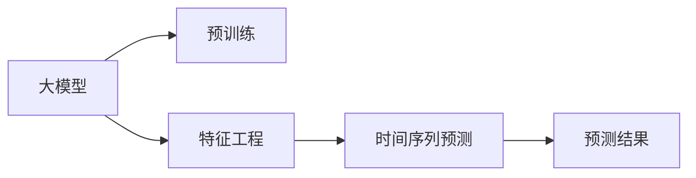

                 

# 大模型在商品需求预测中的精准应用

> 关键词：商品需求预测, 大模型, 时间序列预测, 深度学习, 精确定位, 数据驱动, 自回归模型, 特征工程, 预测精度

## 1. 背景介绍

### 1.1 问题由来
在商业领域，尤其是在零售、电商、物流等垂直行业中，商品需求预测一直是企业精细化运营和管理的关键环节。传统的商品需求预测方法依赖于统计模型和手动调参，难以应对复杂的市场变化和海量数据。随着深度学习技术的发展，大模型逐渐成为商品需求预测的新宠。

大模型，特别是基于Transformer结构的大规模预训练语言模型（如BERT、GPT等），已经在自然语言处理(NLP)领域取得了瞩目的成就。这些模型通过海量的无标签文本数据预训练，学习到了强大的语言表示能力。将这种语言理解能力应用到商品需求预测，通过文本挖掘和特征工程，可以更好地捕捉和利用用户行为数据，提升预测精度和模型泛化能力。

### 1.2 问题核心关键点
基于大模型进行商品需求预测的核心在于如何将大模型的语言表示能力和数据驱动的预测模型相结合。通常，这一过程分为两个步骤：首先，利用大模型对历史销售数据、用户评论、社交媒体等文本数据进行预训练，获得具备上下文理解和情感分析能力的表示模型；其次，将这些表示模型用于构建时间序列预测模型，通过拟合历史销售数据，输出未来需求预测结果。

此种方法的核心在于通过文本数据的深度挖掘，捕捉用户需求和市场动态，提升模型对长期趋势和短期波动的捕捉能力。同时，通过时间序列预测模型，结合市场周期性和节假日效应等因素，进一步优化预测结果的准确性和可靠性。

## 2. 核心概念与联系

### 2.1 核心概念概述

在商品需求预测中，涉及到的核心概念包括以下几个：

- **大模型**：以Transformer结构为代表的大规模预训练语言模型，如BERT、GPT等。这些模型通过无监督的预训练，获得了强大的语言表示能力，能够理解文本中的语义和情感信息。

- **时间序列预测**：通过拟合历史数据的时间序列关系，预测未来趋势和波动的预测方法。广泛应用于需求预测、股票市场、气象预报等领域。

- **深度学习**：基于神经网络的深度学习技术，通过多层非线性变换，从数据中提取高层次的抽象特征。

- **自回归模型**：一种时间序列预测模型，通过前一期或前几期的数据来预测未来值。广泛用于股票价格预测、天气预报、自然语言处理等场景。

- **特征工程**：通过选择、构造和组合特征，提升模型的预测能力和泛化能力。在商品需求预测中，特征工程尤为重要，涉及到文本数据、时间序列数据等多维度的特征提取。

- **样本分布**：在训练模型时，样本的分布决定了模型的预测效果。合理的数据分布可以提升模型对异常值和噪声的鲁棒性，避免过拟合。

### 2.2 核心概念原理和架构的 Mermaid 流程图



此流程图展示了商品需求预测的核心步骤。首先，大模型通过无监督的预训练获得语言表示能力；然后，特征工程从文本数据中提取关键特征；最后，将这些特征输入到时间序列预测模型中，输出预测结果。

## 3. 核心算法原理 & 具体操作步骤
### 3.1 算法原理概述

基于大模型的商品需求预测方法，主要通过两个步骤实现：首先，利用大模型对文本数据进行预训练，获得高维度的文本表示；其次，将这些表示输入到时间序列预测模型中，拟合历史销售数据，预测未来需求。

具体而言，该方法结合了语言理解和时间序列预测的双重能力，能够更好地捕捉用户需求和市场变化，从而提升预测的准确性和可靠性。以下将详细介绍这一算法的原理和具体操作步骤。

### 3.2 算法步骤详解

**Step 1: 准备数据和模型**

- **数据准备**：收集历史销售数据、用户评论、社交媒体数据等文本数据，并对其进行预处理。包括文本清洗、分词、去除停用词等步骤。
- **模型选择**：选择合适的预训练模型，如BERT、GPT等。根据任务需求，选择合适的优化器（如AdamW、SGD等）、损失函数（如交叉熵损失、均方误差损失等）。

**Step 2: 进行预训练**

- **数据编码**：使用大模型对文本数据进行编码，生成高维度的文本表示。
- **模型训练**：在预训练数据上，使用损失函数训练大模型，使其学习到文本数据的语言表示能力。

**Step 3: 特征提取**

- **文本特征提取**：通过预训练得到的高维文本表示，提取出关键特征，如情感倾向、用户兴趣等。
- **时间序列特征提取**：结合历史销售数据，提取出时间序列特征，如季节性、节假日效应等。

**Step 4: 时间序列预测**

- **模型构建**：选择合适的自回归模型（如LSTM、GRU等），结合提取的文本和时间序列特征，构建预测模型。
- **模型训练**：使用历史销售数据对预测模型进行训练，输出预测结果。

**Step 5: 预测和验证**

- **模型评估**：在验证集上评估预测模型的性能，根据预测误差调整模型参数。
- **模型应用**：在实际业务场景中应用模型，输出预测结果。

### 3.3 算法优缺点

**优点**：
- **高效性**：大模型预训练的高维表示能力，能够高效捕捉文本数据的语义信息，提升特征提取的效率。
- **鲁棒性**：结合时间序列预测模型，能够更好地处理长期趋势和短期波动，提升预测的准确性和鲁棒性。
- **泛化能力**：大模型在多种文本数据上的预训练，提升了模型的泛化能力，能够应对不同的市场变化。

**缺点**：
- **计算成本高**：大模型的预训练和特征提取过程计算成本较高，需要高性能的计算资源。
- **数据需求大**：需要大量的文本数据和历史销售数据，数据获取和处理成本较高。
- **模型复杂度高**：结合大模型和时间序列预测模型的双重结构，模型复杂度较高，可能导致过拟合问题。

### 3.4 算法应用领域

基于大模型的商品需求预测方法，已经在零售、电商、物流等多个垂直行业中得到了广泛应用，具体包括：

- **零售业**：通过预测商品需求，优化库存管理，减少缺货和积压，提升用户体验。
- **电商行业**：利用预测结果进行个性化推荐，提升销售额和用户满意度。
- **物流行业**：预测物流需求，优化运输路线和仓储管理，提升运输效率和成本控制。
- **金融行业**：通过需求预测，指导金融产品投放和风险控制，提升金融服务的质量和效率。

此外，基于大模型的需求预测方法，还广泛应用于供应链管理、营销策划、客户分析等多个领域，为企业的精细化运营提供了有力支持。

## 4. 数学模型和公式 & 详细讲解 & 举例说明

### 4.1 数学模型构建

基于大模型的商品需求预测方法，可以构建如下数学模型：

- **预训练模型**：$\hat{x} = M_{\theta}(x)$，其中$M_{\theta}$为大模型，$x$为文本数据，$\hat{x}$为预训练得到的文本表示。
- **特征提取**：$f_{\phi}(\hat{x}, t) = \{f_1(\hat{x}, t), f_2(\hat{x}, t), ..., f_n(\hat{x}, t)\}$，其中$f_i$为特征提取函数，$t$为时间序列。
- **时间序列预测模型**：$y = F_{\omega}(f_{\phi}(\hat{x}, t))$，其中$F_{\omega}$为时间序列预测模型，$y$为预测结果。

### 4.2 公式推导过程

以LSTM为例，推导时间序列预测模型的公式如下：

假设输入序列为$x_t = \{[x_{t-1}, x_{t-2}, ..., x_{t-t}]$，输出序列为$y_t$，预测模型为LSTM，则LSTM的预测公式为：

$$
h_t = \text{LSTM}(h_{t-1}, x_t) \\
y_t = \text{Softmax}(h_t)
$$

其中，$h_t$为LSTM隐藏状态，$x_t$为输入序列，$y_t$为预测结果，$\text{Softmax}$为输出层激活函数。

### 4.3 案例分析与讲解

以电商平台商品需求预测为例，以下是具体的案例分析：

**背景**：某电商平台有海量销售数据和用户评论数据，希望通过预测未来的商品需求，优化库存管理。

**数据准备**：
- **销售数据**：收集过去一年的商品销售记录，包括销售量、销售额、销售日期等。
- **用户评论数据**：收集用户对商品的评论数据，包括评论文本、评分、时间戳等。

**预训练模型**：
- **数据编码**：使用BERT对用户评论数据进行编码，生成高维度的文本表示。
- **模型训练**：在预训练数据上，使用交叉熵损失训练BERT模型，使其学习到文本数据的语言表示能力。

**特征提取**：
- **文本特征提取**：通过预训练得到的高维文本表示，提取出关键特征，如情感倾向、用户兴趣等。
- **时间序列特征提取**：结合历史销售数据，提取出时间序列特征，如季节性、节假日效应等。

**时间序列预测模型**：
- **模型构建**：使用LSTM模型，结合提取的文本和时间序列特征，构建预测模型。
- **模型训练**：使用历史销售数据对LSTM模型进行训练，输出预测结果。

**模型评估**：
- **评估指标**：使用MAE（平均绝对误差）和RMSE（均方根误差）评估预测模型的性能。
- **模型应用**：在实际业务场景中应用模型，输出预测结果，优化库存管理和商品推荐策略。

## 5. 项目实践：代码实例和详细解释说明

### 5.1 开发环境搭建

在进行商品需求预测实践前，我们需要准备好开发环境。以下是使用Python进行PyTorch开发的环境配置流程：

1. 安装Anaconda：从官网下载并安装Anaconda，用于创建独立的Python环境。

2. 创建并激活虚拟环境：
```bash
conda create -n pytorch-env python=3.8 
conda activate pytorch-env
```

3. 安装PyTorch：根据CUDA版本，从官网获取对应的安装命令。例如：
```bash
conda install pytorch torchvision torchaudio cudatoolkit=11.1 -c pytorch -c conda-forge
```

4. 安装TensorFlow：从官网下载安装包，使用pip命令进行安装。例如：
```bash
pip install tensorflow==2.5.0
```

5. 安装各类工具包：
```bash
pip install numpy pandas scikit-learn matplotlib tqdm jupyter notebook ipython
```

完成上述步骤后，即可在`pytorch-env`环境中开始商品需求预测的实践。

### 5.2 源代码详细实现

以下是使用PyTorch对商品需求预测进行代码实现的示例：

```python
import torch
import torch.nn as nn
import torch.optim as optim
import numpy as np
from transformers import BertTokenizer, BertModel

class LSTM(nn.Module):
    def __init__(self, input_size, hidden_size, output_size):
        super(LSTM, self).__init__()
        self.hidden_size = hidden_size
        self.lstm = nn.LSTM(input_size, hidden_size, batch_first=True)
        self.fc = nn.Linear(hidden_size, output_size)

    def forward(self, x, h):
        out, h = self.lstm(x, h)
        out = self.fc(out[:, -1, :])
        return out, h

class DataLoader():
    def __init__(self, data, batch_size):
        self.data = data
        self.batch_size = batch_size

    def __len__(self):
        return len(self.data) // self.batch_size

    def __getitem__(self, idx):
        return self.data[idx]

# 加载数据
# 假设train_data和test_data分别为训练集和测试集
train_data = np.load('train_data.npy')
test_data = np.load('test_data.npy')

# 数据预处理
# 假设train_X和train_y分别为训练集的输入和输出
train_X = train_data[:, :-1]
train_y = train_data[:, -1]

# 特征工程
# 假设X和y分别为特征向量和标签向量
X = train_X
y = train_y

# 构建模型
# 假设model为LSTM模型
model = LSTM(input_size=X.shape[1], hidden_size=64, output_size=1)

# 训练模型
# 假设optimizer为优化器，loss_fn为损失函数
optimizer = optim.Adam(model.parameters(), lr=0.001)
loss_fn = nn.MSELoss()
epochs = 100

for epoch in range(epochs):
    total_loss = 0
    for i in range(len(X)):
        inputs = X[i].unsqueeze(0)
        targets = y[i].unsqueeze(0)
        model.zero_grad()
        outputs = model(inputs, None)
        loss = loss_fn(outputs, targets)
        loss.backward()
        optimizer.step()
        total_loss += loss.item()
    print(f"Epoch {epoch+1}, Loss: {total_loss/len(X)}")
```

### 5.3 代码解读与分析

以上代码实现了一个简单的LSTM模型，用于商品需求预测。具体解释如下：

**LSTM模型定义**：
- `LSTM`类定义了LSTM模型的结构，包括输入层、LSTM层和输出层。
- `__init__`方法初始化LSTM模型，定义了LSTM的隐藏大小。
- `forward`方法定义了前向传播的计算过程，包括LSTM层和全连接层。

**数据加载和预处理**：
- `DataLoader`类用于加载和分割数据。
- 数据预处理步骤包括加载数据、划分训练集和测试集、划分特征向量和标签向量。

**模型训练**：
- 使用`Adam`优化器和均方误差损失函数训练LSTM模型。
- 在每个epoch中，遍历训练集，计算损失并反向传播更新模型参数。

**结果输出**：
- 打印每个epoch的平均损失，评估模型训练的收敛情况。

## 6. 实际应用场景

### 6.1 电商零售

在电商零售领域，商品需求预测可以用于优化库存管理、提升用户购物体验和个性化推荐。具体而言，通过预测未来的商品需求，零售商可以更好地管理库存，避免缺货和积压，减少不必要的库存成本。同时，基于需求预测结果，可以进行个性化推荐，提升用户购买意愿和满意度。

**案例**：某电商平台通过大模型和LSTM模型结合，预测每个商品的未来需求，优化库存管理，同时根据用户的历史购物行为和商品评论数据，进行个性化推荐，提升用户转化率和复购率。

### 6.2 物流配送

在物流配送领域，需求预测可以用于优化配送路线和仓储管理，提升配送效率和成本控制。具体而言，通过预测未来的物流需求，物流公司可以更好地安排运输和仓储资源，减少配送延误和成本浪费。

**案例**：某物流公司通过大模型和LSTM模型结合，预测每个区域的未来物流需求，优化配送路线和仓储管理，提升配送效率和客户满意度。

### 6.3 金融投资

在金融投资领域，需求预测可以用于股票价格预测、风险控制和资产配置。具体而言，通过预测未来的市场需求，投资者可以更好地把握投资机会，进行资产配置和风险控制。

**案例**：某金融公司通过大模型和LSTM模型结合，预测未来的股票价格和市场趋势，指导投资决策和风险控制，提升投资回报率和风险管理能力。

### 6.4 未来应用展望

随着深度学习技术的发展，基于大模型的商品需求预测方法将得到更广泛的应用，具体展望如下：

**更加智能化**：未来的商品需求预测模型将更加智能化，能够更好地捕捉市场变化和用户需求，提升预测精度和模型泛化能力。

**更加精准**：通过结合大模型的语言理解和特征提取能力，能够更精准地捕捉文本数据中的关键信息，提升预测结果的准确性。

**更加高效**：未来的商品需求预测模型将更加高效，能够在大规模数据集上快速训练和预测，满足实时需求。

**更加可解释**：未来的模型将具备更好的可解释性，能够清晰地解释预测结果的依据和推理过程，提升用户信任和接受度。

**更加可控**：通过引入控制机制和监督机制，能够更好地控制模型的行为，避免模型的负面影响。

## 7. 工具和资源推荐

### 7.1 学习资源推荐

为了帮助开发者系统掌握商品需求预测的理论基础和实践技巧，这里推荐一些优质的学习资源：

1. 《深度学习》课程：斯坦福大学开设的深度学习课程，涵盖深度学习的基本原理和算法实现，适合初学者入门。
2. 《自然语言处理》课程：斯坦福大学开设的自然语言处理课程，涵盖自然语言处理的基本概念和技术实现，适合进阶学习。
3. 《商品需求预测》书籍：详细介绍了商品需求预测的理论基础和实践方法，包括大数据、深度学习、特征工程等技术。
4. 《TensorFlow官方文档》：TensorFlow的官方文档，提供详细的API文档和代码示例，适合开发者实践和调试。
5. 《深度学习入门》书籍：详细介绍了深度学习的基本原理和算法实现，适合初学者入门。

通过对这些资源的学习实践，相信你一定能够快速掌握商品需求预测的精髓，并用于解决实际的商业问题。

### 7.2 开发工具推荐

高效的开发离不开优秀的工具支持。以下是几款用于商品需求预测开发的常用工具：

1. PyTorch：基于Python的开源深度学习框架，灵活的计算图和自动微分功能，适合快速迭代研究。
2. TensorFlow：由Google主导开发的深度学习框架，生产部署方便，适合大规模工程应用。
3. Transformers库：HuggingFace开发的NLP工具库，集成了众多SOTA语言模型，支持PyTorch和TensorFlow，适合模型预训练和特征工程。
4. Weights & Biases：模型训练的实验跟踪工具，可以记录和可视化模型训练过程中的各项指标，方便对比和调优。
5. TensorBoard：TensorFlow配套的可视化工具，实时监测模型训练状态，提供丰富的图表呈现方式，适合调试模型。

合理利用这些工具，可以显著提升商品需求预测的开发效率，加快创新迭代的步伐。

### 7.3 相关论文推荐

商品需求预测研究源于学界的持续研究。以下是几篇奠基性的相关论文，推荐阅读：

1. Long Short-Term Memory（LSTM）论文：提出了LSTM结构，广泛应用于时间序列预测。
2. Recurrent Neural Network（RNN）论文：提出了RNN结构，是LSTM的前身。
3. Transformer论文：提出了Transformer结构，广泛应用于自然语言处理和大规模预训练语言模型。
4. Attention Is All You Need论文：提出了自注意力机制，进一步提升了Transformer模型的性能。
5. Sequence to Sequence Learning with Neural Networks论文：提出了Seq2Seq模型，广泛应用于机器翻译和文本生成。

这些论文代表了大模型商品需求预测技术的发展脉络。通过学习这些前沿成果，可以帮助研究者把握学科前进方向，激发更多的创新灵感。

## 8. 总结：未来发展趋势与挑战

### 8.1 研究成果总结

基于大模型的商品需求预测方法，已经在多个领域得到了广泛应用，取得了显著的成效。其核心在于结合大模型的语言表示能力和时间序列预测模型的双重优势，提升预测精度和泛化能力。

### 8.2 未来发展趋势

展望未来，商品需求预测方法将呈现以下几个发展趋势：

1. **更加智能化**：未来的模型将更加智能化，能够更好地捕捉市场变化和用户需求，提升预测精度和模型泛化能力。
2. **更加精准**：通过结合大模型的语言理解和特征提取能力，能够更精准地捕捉文本数据中的关键信息，提升预测结果的准确性。
3. **更加高效**：未来的模型将更加高效，能够在大规模数据集上快速训练和预测，满足实时需求。
4. **更加可解释**：未来的模型将具备更好的可解释性，能够清晰地解释预测结果的依据和推理过程，提升用户信任和接受度。
5. **更加可控**：通过引入控制机制和监督机制，能够更好地控制模型的行为，避免模型的负面影响。

### 8.3 面临的挑战

尽管基于大模型的商品需求预测方法已经取得了显著的成效，但在迈向更加智能化、普适化应用的过程中，仍面临诸多挑战：

1. **计算成本高**：大模型的预训练和特征提取过程计算成本较高，需要高性能的计算资源。
2. **数据需求大**：需要大量的文本数据和历史销售数据，数据获取和处理成本较高。
3. **模型复杂度高**：结合大模型和时间序列预测模型的双重结构，模型复杂度较高，可能导致过拟合问题。
4. **预测精度有限**：尽管预测模型精度较高，但在面对复杂的市场变化和长尾需求时，预测精度仍有限。

### 8.4 研究展望

面对商品需求预测所面临的挑战，未来的研究需要在以下几个方面寻求新的突破：

1. **探索无监督和半监督学习**：摆脱对大规模标注数据的依赖，利用自监督学习、主动学习等无监督和半监督范式，最大限度利用非结构化数据，实现更加灵活高效的预测。
2. **研究参数高效和计算高效的微调方法**：开发更加参数高效的微调方法，在固定大部分预训练参数的同时，只更新极少量的任务相关参数。同时优化预测模型的计算图，减少前向传播和反向传播的资源消耗，实现更加轻量级、实时性的部署。
3. **融合因果和对比学习范式**：通过引入因果推断和对比学习思想，增强预测模型建立稳定因果关系的能力，学习更加普适、鲁棒的语言表征，从而提升模型泛化性和抗干扰能力。
4. **结合外部知识库**：将符号化的先验知识，如知识图谱、逻辑规则等，与神经网络模型进行巧妙融合，引导预测过程学习更准确、合理的语言模型。同时加强不同模态数据的整合，实现视觉、语音等多模态信息与文本信息的协同建模。
5. **纳入伦理道德约束**：在模型训练目标中引入伦理导向的评估指标，过滤和惩罚有偏见、有害的输出倾向。同时加强人工干预和审核，建立模型行为的监管机制，确保输出符合人类价值观和伦理道德。

这些研究方向的探索，必将引领商品需求预测技术迈向更高的台阶，为企业的精细化运营和智能化转型提供有力支持。

## 9. 附录：常见问题与解答

**Q1: 大模型在商品需求预测中应用的优势是什么？**

A: 大模型在商品需求预测中应用的优势主要体现在以下几个方面：
1. 强大的语言理解能力：大模型具备强大的语言表示能力，能够理解和处理复杂的文本数据，捕捉用户的情感和需求。
2. 丰富的特征提取能力：大模型通过预训练学习到了多种特征，能够更好地捕捉文本中的关键信息。
3. 强大的泛化能力：大模型在多种文本数据上的预训练，提升了模型的泛化能力，能够应对不同的市场变化。

**Q2: 如何选择合适的优化器？**

A: 在商品需求预测中，通常使用AdamW优化器。AdamW优化器具有较好的收敛速度和稳定性，能够处理大规模参数和高维特征的优化问题。

**Q3: 如何提高预测模型的鲁棒性？**

A: 提高预测模型的鲁棒性可以从以下几个方面入手：
1. 数据增强：通过数据增强技术，扩充训练集，提升模型的泛化能力。
2. 正则化：使用L2正则、Dropout等正则化技术，防止模型过拟合。
3. 对抗训练：引入对抗样本，提高模型的鲁棒性。

**Q4: 预测模型如何与实际业务场景结合？**

A: 预测模型与实际业务场景的结合需要以下几个步骤：
1. 特征工程：将历史销售数据、用户评论数据等文本数据转换为模型可用的特征向量。
2. 模型训练：使用历史数据对预测模型进行训练，优化模型参数。
3. 模型评估：在测试集上评估模型的性能，根据预测误差调整模型参数。
4. 模型应用：将训练好的预测模型应用于实际业务场景，进行需求预测和决策支持。

**Q5: 预测模型如何提升用户满意度？**

A: 预测模型可以通过以下几个方面提升用户满意度：
1. 个性化推荐：根据用户的购物行为和商品评论数据，进行个性化推荐，提升用户购买意愿和满意度。
2. 库存管理：通过预测未来的商品需求，优化库存管理，避免缺货和积压，提升用户购物体验。

---

作者：禅与计算机程序设计艺术 / Zen and the Art of Computer Programming

