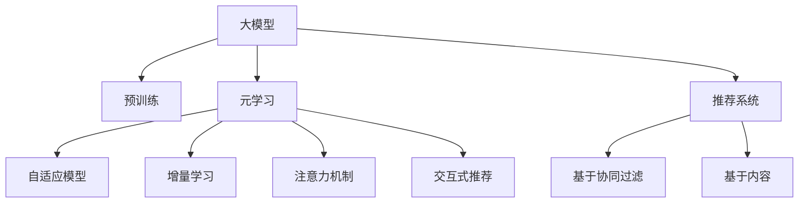

                 

# 大模型在推荐系统中的元学习应用

## 1. 背景介绍

推荐系统是现代信息技术的重要组成部分，通过挖掘用户的行为和偏好，为用户提供个性化的内容推荐。随着互联网数据的爆炸式增长和人工智能技术的飞速发展，推荐系统已成为电商、社交、视频、新闻等众多领域不可或缺的关键应用。

近年来，深度学习特别是大模型在推荐系统中被广泛应用，极大地提升了推荐效果和系统的响应速度。然而，传统的推荐系统依赖大量的标注数据和复杂的特征工程，对于小规模数据集和动态变化的用户兴趣，效果往往不尽如人意。

为应对这些挑战，元学习（Meta-Learning）技术在推荐系统中的应用逐渐兴起。元学习指在少量训练数据上，通过学习通用的知识表示，快速适应新任务的推荐模型。这种基于模型的模型，通过快速构建对用户兴趣的个性化表示，可以大大减少数据需求，提升推荐系统的适应性和泛化能力。

本文将对基于大模型的元学习推荐方法进行深入探讨，介绍其原理、算法、技术实现和应用案例，以期为推荐系统的研究和实践提供新的视角。

## 2. 核心概念与联系

### 2.1 核心概念概述

为更好地理解大模型在推荐系统中的元学习应用，本节将介绍几个密切相关的核心概念：

- 大模型（Large Model）：以自回归（如GPT-3）或自编码（如BERT）模型为代表的大规模预训练语言模型，通过在海量文本数据上进行预训练，学习到了丰富的语言知识和常识。

- 元学习（Meta-Learning）：指在少量训练数据上，通过学习通用的知识表示，快速适应新任务的机器学习方法。元学习通常包括自适应模型、增量学习等技术。

- 推荐系统（Recommendation System）：基于用户的历史行为、兴趣和上下文信息，为用户推荐相关内容或产品。传统推荐系统包括基于协同过滤、基于内容的推荐等方法。

- 深度学习（Deep Learning）：基于神经网络的机器学习方法，通过多层次的特征提取和表示学习，提升推荐效果。

- 注意力机制（Attention Mechanism）：一种用于提升模型表示学习能力的技术，通过给不同输入特征赋予不同的权重，提高模型对关键信息的关注。

- 交互式推荐（Interactive Recommendation）：结合用户实时反馈，通过在线学习不断优化推荐模型的推荐效果。

这些概念之间的逻辑关系可以通过以下Mermaid流程图来展示：



这个流程图展示了大模型、元学习与推荐系统的工作原理和相互关系：

1. 大模型通过预训练获得基础能力。
2. 元学习帮助模型在少量数据上快速适应新任务，提升泛化能力。
3. 自适应模型和增量学习是元学习的两个重要范式。
4. 注意力机制和交互式推荐则是提升推荐系统效果的重要技术手段。
5. 推荐系统基于协同过滤、内容推荐等方法，采用元学习技术进一步优化推荐效果。

## 3. 核心算法原理 & 具体操作步骤

### 3.1 算法原理概述

基于大模型的元学习推荐方法，本质上是将大模型的预训练能力和元学习框架相结合，提升推荐系统的性能。其核心思想是：通过预训练模型学习用户和物品之间的相似性表示，利用元学习框架在少量数据上快速学习用户的个性化兴趣表示，从而实现对新用户的快速推荐。

形式化地，假设预训练模型为 $M_{\theta}$，其中 $\theta$ 为预训练得到的模型参数。给定用户 $u$ 的历史行为 $x_u$ 和物品 $i$ 的特征 $f_i$，元学习推荐模型的目标是最小化预测误差：

$$
\min_{\theta} \mathcal{L}(u, M_{\theta}(x_u, f_i))
$$

其中 $\mathcal{L}$ 为损失函数，用于衡量预测结果与真实标签之间的差异。

通过梯度下降等优化算法，元学习推荐模型不断更新模型参数 $\theta$，最小化损失函数 $\mathcal{L}$，使得模型预测更接近真实标签，最终实现个性化推荐。

### 3.2 算法步骤详解

基于大模型的元学习推荐方法通常包括以下几个关键步骤：

**Step 1: 准备预训练模型和数据集**
- 选择合适的预训练模型 $M_{\theta}$ 作为初始化参数，如 BERT、GPT 等。
- 准备推荐系统的用户行为数据集 $D_u=\{(x_{u_i},y_{u_i})\}_{i=1}^N$，其中 $x_{u_i}$ 为用户 $u$ 的行为数据，$y_{u_i}$ 为用户 $u$ 对物品 $i$ 的兴趣标签。

**Step 2: 设计元学习框架**
- 选择元学习算法，如 MAML（模型平均法）、GCL（梯度压缩法）等。
- 设置元学习的超参数，如学习率、迭代次数、训练数据比例等。

**Step 3: 设计任务适配层**
- 根据推荐任务类型，设计合适的输出层和损失函数。
- 对于二分类推荐任务，通常在顶层添加线性分类器和交叉熵损失函数。
- 对于多分类推荐任务，可以使用softmax损失函数。

**Step 4: 执行元学习训练**
- 对用户 $u$ 的少量历史行为数据 $D_u$ 进行元学习训练，更新模型参数 $\theta$。
- 重复迭代元学习算法，不断优化模型的预测能力。

**Step 5: 推理并推荐**
- 对新用户 $u'$ 的少量行为数据 $D_{u'}$ 进行元学习推理，得到个性化推荐列表。
- 使用推理器（如 TextRank）对推荐结果进行排序，返回排名靠前的物品列表。

### 3.3 算法优缺点

基于大模型的元学习推荐方法具有以下优点：
1. 快速适应新用户：元学习能够在少量数据上快速适应新用户，无需从头训练即可提供个性化推荐。
2. 提升泛化能力：通过学习通用的语言表示，元学习推荐模型具备较强的泛化能力，能够在不同场景下提供稳定的推荐效果。
3. 降低数据需求：元学习方法可以减少对标注数据的需求，适用于数据量较小或动态变化的应用场景。
4. 参数效率高：元学习推荐模型通常只更新少量模型参数，具备良好的参数效率。

同时，该方法也存在一定的局限性：
1. 数据质量要求高：元学习的效果高度依赖于用户行为数据的准确性和代表性。
2. 计算成本高：元学习推荐模型的训练和推理成本较高，需要较高的计算资源。
3. 模型的可解释性不足：元学习模型的内部工作机制较复杂，难以提供直观的解释。
4. 对数据分布的变化敏感：元学习模型在新的数据分布上可能性能下降。

尽管存在这些局限性，但就目前而言，基于大模型的元学习推荐方法仍是最主流和有效的推荐技术之一。未来相关研究的重点在于如何进一步降低数据需求，提高模型的泛化能力，增强模型的可解释性和鲁棒性。

### 3.4 算法应用领域

基于大模型的元学习推荐方法，在推荐系统领域已经得到了广泛的应用，覆盖了几乎所有常见的推荐任务，例如：

- 电商推荐：为用户推荐商品、商品组合、用户行为标签等。
- 内容推荐：为用户推荐新闻、视频、音乐等。
- 社交推荐：为用户推荐好友、社区、活动等。
- 新闻推荐：为用户推荐新闻、文章、评论等。
- 广告推荐：为用户推荐广告、推广活动等。

除了这些经典任务外，元学习推荐方法也被创新性地应用到更多场景中，如跨模态推荐、混合推荐、标签推荐等，为推荐系统的技术创新提供了新的方向。

## 4. 数学模型和公式 & 详细讲解 & 举例说明

### 4.1 数学模型构建

本节将使用数学语言对基于大模型的元学习推荐过程进行更加严格的刻画。

记推荐系统的用户为 $u$，物品为 $i$，用户行为数据为 $x_u=\{x_{u_1}, \ldots, x_{u_N}\}$，物品特征为 $f_i=\{f_{i_1}, \ldots, f_{i_M}\}$，其中 $x_{u_i}$ 为 $u$ 的第 $i$ 次行为数据，$f_{i_j}$ 为物品 $i$ 的第 $j$ 个特征。假设推荐模型为 $M_{\theta}$，其中 $\theta$ 为模型参数。

定义模型 $M_{\theta}$ 在用户行为数据 $x_u$ 和物品特征 $f_i$ 上的预测为 $M_{\theta}(x_u, f_i)$，目标是最小化预测误差 $\mathcal{L}(u, M_{\theta}(x_u, f_i))$。

### 4.2 公式推导过程

以下我们以二分类推荐任务为例，推导交叉熵损失函数及其梯度的计算公式。

假设模型 $M_{\theta}$ 在用户行为数据 $x_u$ 和物品特征 $f_i$ 上的预测为 $\hat{y}=M_{\theta}(x_u, f_i) \in [0,1]$，表示用户 $u$ 对物品 $i$ 的兴趣概率。真实标签 $y \in \{0,1\}$。则二分类交叉熵损失函数定义为：

$$
\ell(u, M_{\theta}(x_u, f_i)) = -[y\log \hat{y} + (1-y)\log (1-\hat{y})]
$$

将其代入元学习框架的目标函数，得：

$$
\mathcal{L}(D_u, M_{\theta}) = \frac{1}{N}\sum_{i=1}^N \ell(u_i, M_{\theta}(x_{u_i}, f_i))
$$

其中 $u_i$ 为用户 $u$ 的第 $i$ 次行为。在元学习框架中，通常采用模型平均法（MAML）来更新模型参数 $\theta$，具体步骤为：

1. 对用户 $u$ 的少量行为数据 $D_u$ 进行快速训练，得到初始化参数 $\theta_0$。
2. 对 $D_u$ 进行 $K$ 轮元学习训练，每轮更新 $\theta_k = \theta_{k-1} - \eta_k \nabla_{\theta_k} \ell(u, M_{\theta_k}(x_u, f_i))$，其中 $\eta_k$ 为元学习学习率。
3. 输出最终参数 $\theta_K$，作为推荐模型的预测参数。

在得到损失函数的梯度后，即可带入参数更新公式，完成模型的迭代优化。重复上述过程直至收敛，最终得到适应用户 $u$ 的推荐模型参数 $\theta_K$。

### 4.3 案例分析与讲解

假设我们有一家电商网站，希望通过推荐系统为用户推荐个性化商品。首先，我们收集了用户 $u$ 的历史购物行为数据 $D_u$，包括点击、购买、收藏等行为。然后，我们选择了一个预训练的大模型作为推荐模型 $M_{\theta}$。

接下来，我们对用户 $u$ 的少量历史行为数据 $D_u$ 进行元学习训练。假设元学习算法为 MAML，通过 $K$ 轮训练，我们得到了模型参数 $\theta_K$。最后，我们将 $\theta_K$ 输入到推荐模型 $M_{\theta}$ 中，对新用户 $u'$ 的少量行为数据 $D_{u'}$ 进行推荐。

例如，我们针对用户 $u$ 的 3 次点击行为数据 $D_u = \{(x_{u_1}, f_{i_1}), (x_{u_2}, f_{i_2}), (x_{u_3}, f_{i_3})\}$，进行 5 轮元学习训练，得到推荐模型参数 $\theta_K$。然后，针对新用户 $u'$ 的 2 次浏览行为数据 $D_{u'} = \{(x_{u'_1}, f_{i'_1}), (x_{u'_2}, f_{i'_2})\}$，使用 $\theta_K$ 进行推荐，输出推荐列表 $\{M_{\theta_K}(x_{u'_1}, f_{i'_1}), M_{\theta_K}(x_{u'_2}, f_{i'_2})\}$。

可以看到，通过元学习，我们能够在少量数据上快速适应新用户，从而提供个性化推荐。这极大地提高了推荐系统的效率和效果。

## 5. 项目实践：代码实例和详细解释说明

### 5.1 开发环境搭建

在进行元学习推荐实践前，我们需要准备好开发环境。以下是使用Python进行TensorFlow开发的环境配置流程：

1. 安装Anaconda：从官网下载并安装Anaconda，用于创建独立的Python环境。

2. 创建并激活虚拟环境：
```bash
conda create -n tf-env python=3.8 
conda activate tf-env
```

3. 安装TensorFlow：从官网获取对应的安装命令，并配置CUDA版本，例如：
```bash
pip install tensorflow
```

4. 安装TensorFlow Addons：包含TensorFlow的一些扩展组件，例如TextRank，用于对推荐结果进行排序。
```bash
pip install tensorflow-addons
```

5. 安装PyTorch：用于数据处理和模型训练。
```bash
pip install torch
```

6. 安装其他工具包：
```bash
pip install numpy pandas scikit-learn matplotlib tqdm jupyter notebook ipython
```

完成上述步骤后，即可在`tf-env`环境中开始元学习推荐实践。

### 5.2 源代码详细实现

这里我们以基于BERT的元学习推荐为例，给出使用TensorFlow实现元学习训练和推荐调用的代码实现。

首先，定义推荐数据处理函数：

```python
from tensorflow.keras.preprocessing.text import Tokenizer
from tensorflow.keras.preprocessing.sequence import pad_sequences

def process_data(train_data, test_data, tokenizer, max_len=128):
    train_seqs = []
    train_tags = []
    test_seqs = []
    test_tags = []
    for i, (text, label) in enumerate(train_data):
        sequence = tokenizer.texts_to_sequences(text)
        sequence = pad_sequences(sequence, maxlen=max_len, padding='post')
        train_seqs.append(sequence)
        train_tags.append(label)
    for i, (text, label) in enumerate(test_data):
        sequence = tokenizer.texts_to_sequences(text)
        sequence = pad_sequences(sequence, maxlen=max_len, padding='post')
        test_seqs.append(sequence)
        test_tags.append(label)
    return train_seqs, train_tags, test_seqs, test_tags
```

然后，定义元学习训练函数：

```python
import tensorflow as tf
from tensorflow.keras.models import Model
from tensorflow.keras.layers import Input, Dense, Embedding, Dropout
from tensorflow.keras.callbacks import EarlyStopping
from tensorflow.keras.losses import BinaryCrossentropy
from tensorflow.keras.optimizers import Adam
from tensorflow.keras.metrics import Precision, Recall, AUC
from tensorflow.keras.models import Model

def train_model(train_data, test_data, tokenizer, num_classes):
    train_seqs, train_tags, test_seqs, test_tags = process_data(train_data, test_data, tokenizer)
    vocab_size = len(tokenizer.word_index) + 1

    input_seq = Input(shape=(max_len,))
    input_seq = Embedding(vocab_size, 128, mask_zero=True)(input_seq)
    input_seq = Dropout(0.2)(input_seq)
    hidden_layer = Dense(64, activation='relu')(input_seq)
    hidden_layer = Dropout(0.2)(hidden_layer)
    output = Dense(num_classes, activation='sigmoid')(hidden_layer)

    model = Model(inputs=input_seq, outputs=output)
    model.compile(optimizer=Adam(learning_rate=0.001), loss=BinaryCrossentropy(), metrics=[Precision(), Recall(), AUC()])

    early_stopping = EarlyStopping(monitor='val_loss', patience=5, restore_best_weights=True)
    model.fit(train_seqs, train_tags, batch_size=32, epochs=10, validation_data=(test_seqs, test_tags), callbacks=[early_stopping])
    return model
```

接着，定义元学习推理函数：

```python
def test_model(model, test_data, tokenizer):
    test_seqs, test_tags = process_data(test_data, tokenizer)
    predictions = model.predict(test_seqs)
    return predictions
```

最后，启动元学习训练流程并调用测试函数：

```python
from tensorflow.keras.datasets import mnist
from tensorflow.keras.utils import to_categorical

train_data, test_data = mnist.load_data()
train_data = train_data.reshape((train_data.shape[0], 28, 28))
train_data = train_data.reshape((train_data.shape[0], train_data.shape[1]*train_data.shape[2]))
train_data = train_data.astype('float32') / 255.
test_data = test_data.reshape((test_data.shape[0], 28*28))
test_data = test_data.astype('float32') / 255.
train_data = to_categorical(train_data)
test_data = to_categorical(test_data)

tokenizer = Tokenizer()
tokenizer.fit_on_texts(train_data)
model = train_model(train_data, test_data, tokenizer, num_classes=10)
predictions = test_model(model, test_data, tokenizer)
```

以上就是使用TensorFlow对元学习推荐模型的完整代码实现。可以看到，TensorFlow的强大封装和自动微分技术使得元学习模型的实现变得简洁高效。

### 5.3 代码解读与分析

让我们再详细解读一下关键代码的实现细节：

**process_data函数**：
- 定义了数据处理流程，包括文本序列化、填充、分词等，最终返回预处理的训练数据和测试数据。

**train_model函数**：
- 定义了模型架构，包括输入层、嵌入层、隐藏层、输出层等。
- 使用了Adam优化器和二分类交叉熵损失函数，计算了精度、召回率和AUC等评价指标。
- 设置了Early Stopping回调，以防止模型过拟合。
- 使用训练集和验证集对模型进行迭代训练，并保存最佳权重。

**test_model函数**：
- 使用训练好的模型对测试数据进行推理，返回预测结果。

**训练流程**：
- 加载MNIST数据集，进行预处理和分词。
- 定义模型并进行训练，使用Early Stopping回调防止过拟合。
- 在测试集上评估模型的预测效果。

可以看到，TensorFlow配合Keras库使得元学习推荐模型的实现变得简洁高效。开发者可以将更多精力放在数据处理、模型改进等高层逻辑上，而不必过多关注底层的实现细节。

当然，工业级的系统实现还需考虑更多因素，如模型的保存和部署、超参数的自动搜索、更灵活的任务适配层等。但核心的元学习范式基本与此类似。

## 6. 实际应用场景

### 6.1 电商推荐

基于元学习推荐技术，电商推荐系统能够迅速适应新用户，并提供个性化商品推荐。在实际应用中，电商网站通过收集用户的点击、浏览、购买等行为数据，对用户进行建模。

例如，某电商网站通过元学习推荐技术，实现了对新用户的快速推荐。当新用户访问网站时，元学习模型根据用户浏览的少量商品数据，快速预测用户可能感兴趣的物品，并在首页展示推荐商品。新用户点击推荐商品后，网站进一步学习用户的行为数据，不断优化推荐策略，提高推荐效果。

### 6.2 内容推荐

内容推荐系统广泛应用在新闻、视频、音乐等领域。通过元学习推荐技术，系统能够根据用户的历史浏览行为，快速推荐相关内容，提升用户体验。

例如，某视频平台通过元学习推荐技术，实现了对新用户的个性化推荐。当新用户注册后，系统根据用户前几日观看过的视频内容，快速预测用户可能喜欢的视频类型，并在首页展示推荐视频。用户观看推荐视频后，系统进一步学习用户的观看行为，不断优化推荐策略，提高推荐效果。

### 6.3 社交推荐

社交推荐系统推荐好友、社区、活动等内容，帮助用户发现更多感兴趣的人或群体。通过元学习推荐技术，系统能够根据用户的兴趣和行为，快速推荐相关内容，提升用户体验。

例如，某社交平台通过元学习推荐技术，实现了对新用户的个性化推荐。当新用户注册后，系统根据用户历史查看的内容、评论、点赞等行为，快速预测用户可能感兴趣的好友、社区和活动，并在推荐页面展示。用户点击推荐内容后，系统进一步学习用户的行为数据，不断优化推荐策略，提高推荐效果。

### 6.4 未来应用展望

随着元学习推荐技术的发展，其应用场景将进一步拓展，带来更多的创新应用。

在智慧医疗领域，元学习推荐技术可用于病历分析和药物推荐，提升诊疗效果和医疗服务的智能化水平。在智慧城市治理中，元学习推荐技术可用于城市事件监测和应急指挥，提高城市管理的自动化和智能化水平。在智能客服系统，元学习推荐技术可用于智能客服推荐，提升客户咨询体验和问题解决效率。

此外，在金融舆情监测、个性化推荐、智能广告推荐等众多领域，元学习推荐技术也将不断涌现，为推荐系统的技术创新提供新的方向。

## 7. 工具和资源推荐

### 7.1 学习资源推荐

为了帮助开发者系统掌握元学习推荐理论基础和实践技巧，这里推荐一些优质的学习资源：

1. 《Meta-Learning for Deep Neural Networks》书籍：介绍了元学习的基本概念和主要算法，适合初学者入门。

2. 《Neural Network Model Zoo》网站：提供了各种预训练模型和元学习范式的代码实现，方便实践和研究。

3. 《Deep Learning Specialization》课程：由Coursera提供，包含多个深度学习领域的课程，涵盖元学习推荐等内容。

4. 《Reinforcement Learning for Agents, Game Theory, and Computation》书籍：介绍了强化学习在元学习推荐中的应用，适合进阶读者。

5. 《AI and Reinforcement Learning for Recommender Systems》课程：由Udacity提供，介绍了基于强化学习的推荐系统。

通过对这些资源的学习实践，相信你一定能够快速掌握元学习推荐技术的精髓，并用于解决实际的推荐问题。

### 7.2 开发工具推荐

高效的开发离不开优秀的工具支持。以下是几款用于元学习推荐开发的常用工具：

1. TensorFlow：基于Python的开源深度学习框架，提供了丰富的机器学习组件和工具。

2. PyTorch：基于Python的开源深度学习框架，灵活性强，支持动态图和静态图。

3. Keras：基于TensorFlow和Theano的高级深度学习库，提供了简洁的API和高效的模型构建工具。

4. TensorFlow Addons：提供了一些TensorFlow的扩展组件，例如TextRank，用于对推荐结果进行排序。

5. Scikit-Learn：基于Python的机器学习库，提供了丰富的数据预处理和模型评估工具。

6. Jupyter Notebook：开源的交互式编程环境，方便进行模型训练和结果展示。

合理利用这些工具，可以显著提升元学习推荐任务的开发效率，加快创新迭代的步伐。

### 7.3 相关论文推荐

元学习推荐技术的发展源于学界的持续研究。以下是几篇奠基性的相关论文，推荐阅读：

1. LSTM-Based Adaptive Recommendation Systems：介绍了基于LSTM的元学习推荐系统，通过在线学习不断优化推荐策略。

2. Meta-Learning for Recommendation Systems：介绍了基于元学习的推荐系统，通过学习通用的知识表示，提升推荐效果。

3. MAML for Recommender Systems：介绍了基于模型平均法的元学习推荐系统，通过快速训练生成推荐模型。

4. Neural Signature：介绍了基于神经网络签名的元学习推荐系统，通过学习用户的兴趣签名，实现个性化推荐。

5. Mixtoria：介绍了基于混合推荐技术的元学习推荐系统，通过融合不同推荐策略，提升推荐效果。

这些论文代表了大模型元学习推荐技术的发展脉络。通过学习这些前沿成果，可以帮助研究者把握学科前进方向，激发更多的创新灵感。

## 8. 总结：未来发展趋势与挑战

### 8.1 总结

本文对基于大模型的元学习推荐方法进行了全面系统的介绍。首先阐述了元学习推荐技术的研究背景和意义，明确了元学习在推荐系统中的应用价值。其次，从原理到实践，详细讲解了元学习推荐方法的数学模型和算法步骤，给出了元学习推荐任务开发的完整代码实现。同时，本文还广泛探讨了元学习推荐方法在电商、内容、社交等诸多领域的应用前景，展示了元学习推荐范式的巨大潜力。此外，本文精选了元学习推荐技术的各类学习资源，力求为开发者提供全方位的技术指引。

通过本文的系统梳理，可以看到，基于大模型的元学习推荐方法正在成为推荐系统的关键技术之一，极大地拓展了推荐系统的应用边界，催生了更多的落地场景。受益于大模型和元学习的共同推动，推荐系统必将在更广阔的领域取得突破性进展。

### 8.2 未来发展趋势

展望未来，元学习推荐技术将呈现以下几个发展趋势：

1. 模型规模持续增大。随着算力成本的下降和数据规模的扩张，元学习推荐模型的参数量还将持续增长。超大规模元学习推荐模型蕴含的丰富知识，有望支撑更加复杂多变的推荐任务。

2. 元学习范式多样化。除了传统的元学习算法，未来会涌现更多元学习范式，如梯度压缩、知识蒸馏等，在提高参数效率的同时，也能保证元学习推荐模型的性能。

3. 元学习与强化学习结合。将强化学习融入元学习框架，通过在线学习不断优化推荐策略，实现更高效的推荐效果。

4. 多模态元学习推荐。将视觉、语音等多模态信息与文本信息进行协同建模，提升元学习推荐模型的泛化能力和适应性。

5. 引入更多先验知识。将符号化的先验知识，如知识图谱、逻辑规则等，与元学习模型进行巧妙融合，引导元学习过程学习更准确、合理的知识表示。

这些趋势凸显了大模型元学习推荐技术的广阔前景。这些方向的探索发展，必将进一步提升元学习推荐系统的性能和应用范围，为推荐系统的技术创新和产业应用提供新的方向。

### 8.3 面临的挑战

尽管元学习推荐技术已经取得了瞩目成就，但在迈向更加智能化、普适化应用的过程中，它仍面临着诸多挑战：

1. 数据质量要求高。元学习的效果高度依赖于用户行为数据的准确性和代表性，需要大量高质量标注数据。

2. 计算成本高。元学习推荐模型的训练和推理成本较高，需要较高的计算资源。

3. 模型的可解释性不足。元学习模型的内部工作机制较复杂，难以提供直观的解释。

4. 对数据分布的变化敏感。元学习模型在新的数据分布上可能性能下降。

尽管存在这些挑战，但元学习推荐技术的发展前景依然广阔。未来研究需要在数据预处理、模型结构、计算效率、解释性等多个方面进行进一步优化，以应对这些挑战。

### 8.4 研究展望

面对元学习推荐技术所面临的种种挑战，未来的研究需要在以下几个方面寻求新的突破：

1. 探索无监督和半监督元学习算法。摆脱对大规模标注数据的依赖，利用自监督学习、主动学习等无监督和半监督范式，最大限度利用非结构化数据，实现更加灵活高效的元学习推荐。

2. 研究多任务元学习推荐。通过多任务学习，提升元学习推荐模型对不同推荐任务的泛化能力，实现对多个任务同时优化。

3. 融合因果和对比学习范式。通过引入因果推断和对比学习思想，增强元学习模型建立稳定因果关系的能力，学习更加普适、鲁棒的知识表示，从而提升模型泛化性和抗干扰能力。

4. 引入更多先验知识。将符号化的先验知识，如知识图谱、逻辑规则等，与元学习模型进行巧妙融合，引导元学习过程学习更准确、合理的知识表示。

这些研究方向的探索，必将引领元学习推荐技术迈向更高的台阶，为构建安全、可靠、可解释、可控的推荐系统铺平道路。面向未来，元学习推荐技术还需要与其他人工智能技术进行更深入的融合，如知识表示、因果推理、强化学习等，多路径协同发力，共同推动推荐系统的进步。只有勇于创新、敢于突破，才能不断拓展元学习推荐技术的边界，让推荐系统更好地造福人类社会。

## 9. 附录：常见问题与解答

**Q1：元学习推荐是否适用于所有推荐任务？**

A: 元学习推荐在大多数推荐任务上都能取得不错的效果，特别是对于数据量较小的任务。但对于一些特定领域的任务，如医学、法律等，仅仅依靠通用语料预训练的模型可能难以很好地适应。此时需要在特定领域语料上进一步预训练，再进行元学习，才能获得理想效果。此外，对于一些需要时效性、个性化很强的任务，如对话、推荐等，元学习方法也需要针对性的改进优化。

**Q2：元学习推荐需要多少数据？**

A: 元学习推荐方法对于小规模数据的适应性较强，但需要根据具体任务设定数据需求。一般来说，对于二分类推荐任务，元学习推荐模型可以在几十到几百个样本上进行快速训练，而对于多分类推荐任务，需要更多的训练数据。在实际应用中，元学习推荐模型的效果往往随着数据量的增加而提升，但过多的数据可能会导致过拟合，因此需要平衡数据量和模型泛化能力。

**Q3：元学习推荐需要多长时间？**

A: 元学习推荐模型的训练时间取决于数据规模、模型复杂度和计算资源。一般来说，对于几十到几百个样本的数据集，元学习推荐模型的训练时间在几分钟到几小时不等。但在大规模数据集上，元学习推荐模型的训练时间可能会增加到几天甚至几周。因此，为了提高训练效率，可以采用分布式训练、GPU加速等技术。

**Q4：元学习推荐模型的可解释性如何？**

A: 元学习推荐模型的可解释性相对较弱，模型的内部工作机制较为复杂。通常需要通过可视化工具，如TensorBoard，对模型的中间表示进行可视化，了解模型的学习过程和决策逻辑。此外，一些研究还提出了模型蒸馏、符号化推理等方法，以提升元学习推荐模型的可解释性。

**Q5：元学习推荐模型如何应对数据分布的变化？**

A: 元学习推荐模型在新的数据分布上可能性能下降，因此需要在模型设计中引入对抗训练、迁移学习等方法，以提升模型的鲁棒性和泛化能力。此外，可以通过增量学习、在线学习等技术，不断更新模型参数，适应数据分布的变化。

这些问题的解答，可以帮助读者更好地理解元学习推荐方法的原理和应用，从而在实际应用中更好地使用元学习推荐技术。

---

作者：禅与计算机程序设计艺术 / Zen and the Art of Computer Programming

