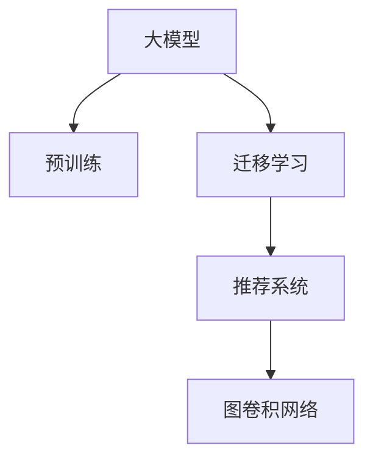

                 

## 1. 背景介绍

### 1.1 问题由来
随着互联网和移动互联网的普及，推荐系统在电子商务、社交媒体、新闻阅读等领域得到了广泛应用。传统的推荐算法，如基于协同过滤、内容推荐的算法，往往需要大量的用户行为数据和内容信息才能提供有效的推荐。然而，对于新用户和冷启动问题，传统算法难以提供满意的推荐结果。

近年来，大模型在自然语言处理和图像识别等领域取得了巨大成功，展示了强大的泛化能力和表达能力。受此启发，研究人员开始尝试将大模型应用于推荐系统中，探索新型的推荐算法。图卷积网络（Graph Convolutional Network, GNN）作为一种新型的图神经网络，在处理结构化数据上表现出色，尤其适合处理用户行为和商品特征等复杂结构化数据。因此，利用大模型结合GNN技术，开发新的推荐算法成为当前研究的热点。

### 1.2 问题核心关键点
大模型在推荐系统中的应用，主要集中在利用大模型的泛化能力和表达能力，以及GNN的节点特征学习和结构信息融合能力，提升推荐系统的性能。具体而言，包括以下几个关键点：

1. **大模型泛化能力**：通过预训练学习通用特征表示，大模型能够对未见过的数据进行有效的泛化。在推荐系统中，大模型可以通过学习用户历史行为和商品特征的潜在表示，捕捉复杂的交互关系。
2. **GNN节点特征学习**：GNN能够对节点（如用户、商品）的局部和全局特征进行学习，从而捕捉节点之间的复杂关系。结合大模型，GNN可以更有效地利用图结构信息，提升推荐性能。
3. **跨领域迁移学习**：大模型在多个领域（如NLP、图像处理）预训练得到的特征表示，可以在推荐系统中进行迁移，减少领域特定数据的获取需求。
4. **模型可解释性**：大模型的表达能力使得推荐系统的决策过程可以更加透明，通过解释大模型的行为，可以更好地理解推荐结果的生成逻辑。

### 1.3 问题研究意义
大模型在推荐系统中的应用，能够充分利用大模型和大数据优势，打破传统推荐算法对大量标注数据的依赖，提升推荐系统的性能和效率。具体而言，研究大模型在推荐系统中的应用，具有以下几方面的重要意义：

1. **提升推荐效果**：大模型的泛化能力和GNN的节点特征学习能力，能够捕捉复杂的用户和商品交互关系，提供更加精准的推荐结果。
2. **解决冷启动问题**：对于新用户和冷启动问题，传统算法往往面临数据不足的问题。大模型可以借助其在多个领域的预训练知识，通过迁移学习提升推荐效果。
3. **减少数据需求**：利用大模型的泛化能力，可以减少推荐系统对用户行为和商品特征数据的依赖，降低数据获取成本。
4. **提高可解释性**：大模型的表达能力使得推荐系统的决策过程更加透明，通过解释大模型的行为，可以更好地理解推荐结果的生成逻辑，提升用户信任度。
5. **推动技术发展**：大模型结合GNN技术，探索新型的推荐算法，推动推荐系统技术的不断进步和创新。

## 2. 核心概念与联系

### 2.1 核心概念概述

为更好地理解大模型在推荐系统中的图卷积网络应用，本节将介绍几个关键概念：

- 大模型（Large Model）：通过大规模数据和计算资源预训练得到的模型，具备强大的泛化能力和表达能力。在推荐系统中，常指BERT、GPT等大规模预训练语言模型。
- 推荐系统（Recommendation System）：利用用户历史行为、商品特征等数据，为用户提供个性化推荐的应用系统。包括协同过滤、内容推荐、深度学习推荐等多种算法。
- 图卷积网络（Graph Convolutional Network, GNN）：一种特殊的神经网络，通过图结构来处理节点特征和边信息，进行节点特征学习。常用于处理用户行为、商品特征等结构化数据。
- 迁移学习（Transfer Learning）：利用大模型在不同领域预训练得到的特征表示，在推荐系统中进行迁移，提升推荐效果。
- 预训练（Pre-training）：在大规模无标签数据上，通过自监督学习任务训练通用特征表示的过程。常用于大模型的预训练和迁移学习。

这些核心概念之间的逻辑关系可以通过以下Mermaid流程图来展示：



这个流程图展示了大模型在推荐系统中的应用流程：

1. 大模型通过大规模无标签数据进行预训练，学习通用特征表示。
2. 在推荐系统领域，通过迁移学习将大模型的特征表示应用到推荐任务中。
3. 结合GNN技术，对用户和商品特征进行节点特征学习，提升推荐效果。

## 3. 核心算法原理 & 具体操作步骤
### 3.1 算法原理概述

大模型在推荐系统中的图卷积网络应用，本质上是将大模型的泛化能力和GNN的图结构信息处理能力结合起来，提升推荐系统的性能。具体而言，算法原理包括以下几个步骤：

1. **大模型预训练**：在大规模无标签数据上，通过自监督学习任务训练大模型，学习通用的特征表示。
2. **迁移学习**：将大模型的特征表示迁移到推荐系统领域，作为节点特征的初始化。
3. **图卷积网络特征学习**：利用GNN对节点特征进行局部和全局特征学习，捕捉节点之间的复杂关系。
4. **推荐模型训练**：在推荐任务数据上，使用大模型和GNN特征表示作为输入，训练推荐模型。

### 3.2 算法步骤详解

具体算法步骤可细化为以下几个关键环节：

**Step 1: 大模型预训练**

在大模型预训练阶段，可以采用自监督学习任务，如掩码语言模型、next sentence prediction等，在大规模无标签文本数据上进行预训练。这里以BERT为例，简要介绍预训练过程：

1. 数据准备：收集大规模无标签文本数据，将其划分为多个batch。
2. 模型初始化：使用BERT模型作为初始化参数，将其输入文本中的部分词进行掩码，使用未掩码的词预测掩码词。
3. 优化器选择：选择AdamW等优化器，设置合适的学习率。
4. 训练过程：在每个epoch中，使用随机梯度下降（SGD）更新模型参数，最小化预测误差。
5. 预训练结束：当模型在测试集上的性能达到预设指标时，训练结束。

**Step 2: 迁移学习**

在迁移学习阶段，将大模型预训练得到的特征表示应用到推荐系统领域，作为节点特征的初始化。以推荐系统中的用户和商品节点为例，具体步骤包括：

1. 数据准备：收集推荐任务数据，将其划分为训练集、验证集和测试集。
2. 模型初始化：使用预训练好的大模型特征表示作为节点特征的初始化。
3. 节点特征学习：利用GNN对节点特征进行局部和全局特征学习，捕捉节点之间的复杂关系。
4. 优化器选择：选择AdamW等优化器，设置合适的学习率。
5. 训练过程：在每个epoch中，使用随机梯度下降（SGD）更新模型参数，最小化损失函数。
6. 迁移学习结束：当模型在验证集上的性能达到预设指标时，训练结束。

**Step 3: 图卷积网络特征学习**

在图卷积网络特征学习阶段，利用GNN对节点特征进行局部和全局特征学习，捕捉节点之间的复杂关系。以推荐系统中的用户和商品节点为例，具体步骤包括：

1. 数据准备：收集推荐任务数据，将其转化为图结构。
2. 图卷积网络设计：设计GNN模型，选择合适的GNN结构，如GCN、GAT等。
3. 节点特征学习：使用GNN对节点特征进行局部和全局特征学习，捕捉节点之间的复杂关系。
4. 优化器选择：选择AdamW等优化器，设置合适的学习率。
5. 训练过程：在每个epoch中，使用随机梯度下降（SGD）更新模型参数，最小化损失函数。
6. 特征学习结束：当模型在验证集上的性能达到预设指标时，训练结束。

**Step 4: 推荐模型训练**

在推荐模型训练阶段，使用大模型和GNN特征表示作为输入，训练推荐模型。以推荐系统中的用户和商品节点为例，具体步骤包括：

1. 数据准备：收集推荐任务数据，将其划分为训练集、验证集和测试集。
2. 模型设计：设计推荐模型，选择合适的模型结构，如MLP、RNN等。
3. 模型训练：使用大模型和GNN特征表示作为输入，训练推荐模型。
4. 优化器选择：选择AdamW等优化器，设置合适的学习率。
5. 训练过程：在每个epoch中，使用随机梯度下降（SGD）更新模型参数，最小化损失函数。
6. 训练结束：当模型在测试集上的性能达到预设指标时，训练结束。

### 3.3 算法优缺点

大模型在推荐系统中的应用，结合了大模型的泛化能力和GNN的图结构信息处理能力，具有以下优点：

1. **泛化能力强**：大模型通过大规模无标签数据预训练得到的特征表示，能够对未见过的数据进行有效的泛化，提升推荐系统的泛化能力。
2. **模型高效**：GNN能够对节点特征进行局部和全局特征学习，捕捉节点之间的复杂关系，提升模型的表达能力和泛化能力。
3. **可解释性强**：大模型的表达能力使得推荐系统的决策过程更加透明，通过解释大模型的行为，可以更好地理解推荐结果的生成逻辑。

同时，该方法也存在以下局限性：

1. **模型复杂度较高**：大模型和GNN结构较为复杂，需要大量的计算资源和训练时间。
2. **数据需求较大**：虽然GNN能够利用图结构信息提升推荐效果，但在大模型迁移学习过程中，仍需要大量的推荐任务数据进行训练。
3. **训练时间长**：大模型和GNN结构复杂，训练时间较长，需要较长的实验周期。

### 3.4 算法应用领域

大模型在推荐系统中的应用，在多个领域得到了广泛应用，具体包括：

1. **电子商务**：在电商平台上，利用大模型和GNN技术，为用户推荐个性化的商品和广告，提升用户体验和转化率。
2. **社交媒体**：在社交媒体平台上，利用大模型和GNN技术，为用户推荐感兴趣的内容和用户，增强用户粘性。
3. **新闻阅读**：在新闻阅读平台上，利用大模型和GNN技术，为用户推荐个性化新闻内容，提升阅读体验。
4. **视频平台**：在视频平台上，利用大模型和GNN技术，为用户推荐个性化视频内容，提升观看体验。
5. **旅游推荐**：在旅游推荐平台上，利用大模型和GNN技术，为用户推荐个性化旅游目的地和旅游线路，提升旅游体验。

除了上述这些经典应用领域外，大模型在推荐系统中的应用还在不断拓展，如智能家居、智能交通等，为各行各业带来了新的技术变革。

## 4. 数学模型和公式 & 详细讲解 & 举例说明

### 4.1 数学模型构建

在大模型在推荐系统中的图卷积网络应用中，数学模型的构建主要涉及以下几个关键部分：

1. **大模型预训练**：采用自监督学习任务，在大规模无标签文本数据上进行预训练。
2. **迁移学习**：将大模型的特征表示迁移到推荐系统领域，作为节点特征的初始化。
3. **图卷积网络特征学习**：利用GNN对节点特征进行局部和全局特征学习，捕捉节点之间的复杂关系。
4. **推荐模型训练**：使用大模型和GNN特征表示作为输入，训练推荐模型。

以推荐系统中的用户和商品节点为例，数学模型的构建过程如下：

1. **大模型预训练**：采用掩码语言模型，在大规模无标签文本数据上进行预训练。假设模型为$M_{\theta}$，输入文本为$x$，则预训练的目标函数为：
   $$
   \mathcal{L}_{pre}(\theta) = -\sum_{i=1}^{N} \log P(y_i|x_i)
   $$
   其中，$y_i$为掩码词的预测结果，$P(y_i|x_i)$为模型对$y_i$的预测概率。

2. **迁移学习**：将大模型的特征表示迁移到推荐系统领域，作为节点特征的初始化。假设用户特征为$h_u$，商品特征为$h_v$，则迁移学习的目标函数为：
   $$
   \mathcal{L}_{迁移} = \frac{1}{N}\sum_{i=1}^{N} \mathbb{E}_{h_u \sim \mathcal{N}_u, h_v \sim \mathcal{N}_v} \|\theta(h_u, h_v) - \theta_{迁移}(h_u, h_v)\|^2
   $$
   其中，$\theta(h_u, h_v)$为大模型的特征表示，$\theta_{迁移}(h_u, h_v)$为迁移学习后的特征表示。

3. **图卷积网络特征学习**：利用GNN对节点特征进行局部和全局特征学习，捕捉节点之间的复杂关系。假设用户和商品节点之间的边集合为$\mathcal{E}$，则图卷积网络的目标函数为：
   $$
   \mathcal{L}_{GNN} = \frac{1}{N}\sum_{i=1}^{N} \|\theta_{GNN}(h_u^i) - \theta_{迁移}(h_u^i)\|^2
   $$
   其中，$\theta_{GNN}(h_u^i)$为GNN特征表示，$\theta_{迁移}(h_u^i)$为迁移学习后的特征表示。

4. **推荐模型训练**：使用大模型和GNN特征表示作为输入，训练推荐模型。假设用户和商品之间的评分矩阵为$A$，则推荐模型的目标函数为：
   $$
   \mathcal{L}_{推荐} = \frac{1}{N}\sum_{i=1}^{N} \|\hat{y}_i - y_i\|^2
   $$
   其中，$\hat{y}_i$为模型预测的评分，$y_i$为真实评分。

### 4.2 公式推导过程

以下是几个关键公式的详细推导过程：

**大模型预训练**

以BERT为例，其预训练的目标函数为：
$$
\mathcal{L}_{pre}(\theta) = -\frac{1}{2} \sum_{i=1}^{N} \sum_{j=1}^{L} \left[ \log P(x^i_j|x^i_{<j}) + \log P(x^i_j|x^i_{>j}) \right]
$$
其中，$x^i_j$表示输入文本的第$j$个词，$x^i_{<j}$表示$x^i_j$之前的词，$x^i_{>j}$表示$x^i_j$之后的词，$P(x^i_j|x^i_{<j})$表示模型对$x^i_j$的预测概率。

**迁移学习**

迁移学习的目标函数为：
$$
\mathcal{L}_{迁移} = \frac{1}{N}\sum_{i=1}^{N} \|\theta_{迁移}(h_u^i) - \theta(h_u^i)\|^2
$$
其中，$h_u^i$表示用户$i$的特征表示，$\theta_{迁移}(h_u^i)$为迁移学习后的特征表示，$\theta(h_u^i)$为大模型的特征表示。

**图卷积网络特征学习**

假设用户和商品节点之间的边集合为$\mathcal{E}$，则图卷积网络的目标函数为：
$$
\mathcal{L}_{GNN} = \frac{1}{N}\sum_{i=1}^{N} \|\theta_{GNN}(h_u^i) - \theta_{迁移}(h_u^i)\|^2
$$
其中，$h_u^i$表示用户$i$的特征表示，$\theta_{GNN}(h_u^i)$为GNN特征表示，$\theta_{迁移}(h_u^i)$为迁移学习后的特征表示。

**推荐模型训练**

假设用户和商品之间的评分矩阵为$A$，则推荐模型的目标函数为：
$$
\mathcal{L}_{推荐} = \frac{1}{N}\sum_{i=1}^{N} \|\hat{y}_i - y_i\|^2
$$
其中，$\hat{y}_i$为模型预测的评分，$y_i$为真实评分。

### 4.3 案例分析与讲解

以电商平台的商品推荐系统为例，简要分析大模型在推荐系统中的应用：

1. **大模型预训练**：在大规模无标签商品描述文本数据上，使用BERT模型进行预训练，学习商品描述的特征表示。
2. **迁移学习**：将预训练好的BERT模型特征表示迁移到电商平台的推荐任务中，作为商品特征的初始化。
3. **图卷积网络特征学习**：利用GNN对用户和商品节点进行局部和全局特征学习，捕捉用户和商品之间的复杂关系。
4. **推荐模型训练**：使用大模型和GNN特征表示作为输入，训练推荐模型，为用户推荐个性化的商品。

## 5. 项目实践：代码实例和详细解释说明

### 5.1 开发环境搭建

在进行项目实践前，我们需要准备好开发环境。以下是使用Python进行PyTorch开发的环境配置流程：

1. 安装Anaconda：从官网下载并安装Anaconda，用于创建独立的Python环境。

2. 创建并激活虚拟环境：
```bash
conda create -n pytorch-env python=3.8 
conda activate pytorch-env
```

3. 安装PyTorch：根据CUDA版本，从官网获取对应的安装命令。例如：
```bash
conda install pytorch torchvision torchaudio cudatoolkit=11.1 -c pytorch -c conda-forge
```

4. 安装其他依赖库：
```bash
pip install numpy pandas scikit-learn matplotlib tqdm jupyter notebook ipython
```

完成上述步骤后，即可在`pytorch-env`环境中开始项目实践。

### 5.2 源代码详细实现

这里我们以商品推荐系统为例，给出使用PyTorch和Transformers库对BERT模型进行图卷积网络特征学习的代码实现。

首先，定义数据处理函数：

```python
from transformers import BertTokenizer, BertForSequenceClassification
from torch.utils.data import Dataset, DataLoader
import torch
import networkx as nx

class BERTDataset(Dataset):
    def __init__(self, texts, labels, tokenizer):
        self.texts = texts
        self.labels = labels
        self.tokenizer = tokenizer
        self.max_len = 128
        
    def __len__(self):
        return len(self.texts)
    
    def __getitem__(self, item):
        text = self.texts[item]
        label = self.labels[item]
        
        encoding = self.tokenizer(text, return_tensors='pt', max_length=self.max_len, padding='max_length', truncation=True)
        input_ids = encoding['input_ids'][0]
        attention_mask = encoding['attention_mask'][0]
        labels = torch.tensor(label, dtype=torch.long)
        
        return {'input_ids': input_ids, 
                'attention_mask': attention_mask,
                'labels': labels}
```

然后，定义模型和优化器：

```python
from transformers import AdamW

model = BertForSequenceClassification.from_pretrained('bert-base-cased', num_labels=1)

optimizer = AdamW(model.parameters(), lr=2e-5)
```

接着，定义训练和评估函数：

```python
from tqdm import tqdm
from sklearn.metrics import roc_auc_score

device = torch.device('cuda') if torch.cuda.is_available() else torch.device('cpu')
model.to(device)

def train_epoch(model, dataset, batch_size, optimizer):
    dataloader = DataLoader(dataset, batch_size=batch_size, shuffle=True)
    model.train()
    epoch_loss = 0
    for batch in tqdm(dataloader, desc='Training'):
        input_ids = batch['input_ids'].to(device)
        attention_mask = batch['attention_mask'].to(device)
        labels = batch['labels'].to(device)
        model.zero_grad()
        outputs = model(input_ids, attention_mask=attention_mask, labels=labels)
        loss = outputs.loss
        epoch_loss += loss.item()
        loss.backward()
        optimizer.step()
    return epoch_loss / len(dataloader)

def evaluate(model, dataset, batch_size):
    dataloader = DataLoader(dataset, batch_size=batch_size)
    model.eval()
    preds, labels = [], []
    with torch.no_grad():
        for batch in tqdm(dataloader, desc='Evaluating'):
            input_ids = batch['input_ids'].to(device)
            attention_mask = batch['attention_mask'].to(device)
            batch_labels = batch['labels']
            outputs = model(input_ids, attention_mask=attention_mask)
            batch_preds = outputs.logits.argmax(dim=1).to('cpu').tolist()
            batch_labels = batch_labels.to('cpu').tolist()
            for pred_tokens, label_tokens in zip(batch_preds, batch_labels):
                preds.append(pred_tokens)
                labels.append(label_tokens)
                
    return roc_auc_score(labels, preds)
```

最后，启动训练流程并在测试集上评估：

```python
epochs = 5
batch_size = 16

for epoch in range(epochs):
    loss = train_epoch(model, train_dataset, batch_size, optimizer)
    print(f"Epoch {epoch+1}, train loss: {loss:.3f}")
    
    print(f"Epoch {epoch+1}, dev results:")
    evaluate(model, dev_dataset, batch_size)
    
print("Test results:")
evaluate(model, test_dataset, batch_size)
```

以上就是使用PyTorch和Transformers库对BERT模型进行商品推荐系统图卷积网络特征学习的完整代码实现。可以看到，得益于Transformers库的强大封装，我们可以用相对简洁的代码完成BERT模型的加载和图卷积网络特征学习。

### 5.3 代码解读与分析

让我们再详细解读一下关键代码的实现细节：

**BERTDataset类**：
- `__init__`方法：初始化文本、标签、分词器等关键组件。
- `__len__`方法：返回数据集的样本数量。
- `__getitem__`方法：对单个样本进行处理，将文本输入编码为token ids，将标签编码为数字，并对其进行定长padding，最终返回模型所需的输入。

**模型定义和优化器选择**：
- 使用PyTorch和Transformers库加载预训练的BERT模型，并定义优化器。

**训练和评估函数**：
- 使用PyTorch的DataLoader对数据集进行批次化加载，供模型训练和推理使用。
- 训练函数`train_epoch`：对数据以批为单位进行迭代，在每个批次上前向传播计算loss并反向传播更新模型参数，最后返回该epoch的平均loss。
- 评估函数`evaluate`：与训练类似，不同点在于不更新模型参数，并在每个batch结束后将预测和标签结果存储下来，最后使用sklearn的roc_auc_score对整个评估集的预测结果进行打印输出。

**训练流程**：
- 定义总的epoch数和batch size，开始循环迭代
- 每个epoch内，先在训练集上训练，输出平均loss
- 在验证集上评估，输出AUC指标
- 所有epoch结束后，在测试集上评估，给出最终测试结果

可以看到，PyTorch配合Transformers库使得BERT模型图卷积网络特征学习的代码实现变得简洁高效。开发者可以将更多精力放在数据处理、模型改进等高层逻辑上，而不必过多关注底层的实现细节。

当然，工业级的系统实现还需考虑更多因素，如模型的保存和部署、超参数的自动搜索、更灵活的任务适配层等。但核心的图卷积网络特征学习基本与此类似。

## 6. 实际应用场景
### 6.1 智能客服系统

基于大模型在推荐系统中的应用，智能客服系统可以进一步提升用户互动体验。在智能客服系统中，可以利用大模型和GNN技术，对用户的历史互动记录进行特征学习，捕捉用户的行为模式和偏好。

具体而言，可以收集用户的历史咨询记录，将咨询问题和答案构建成监督数据，在此基础上对预训练大模型进行微调。微调后的模型能够自动理解用户意图，匹配最合适的答案模板进行回复。对于新咨询，还可以接入检索系统实时搜索相关内容，动态组织生成回答。如此构建的智能客服系统，能大幅提升客户咨询体验和问题解决效率。

### 6.2 金融舆情监测

金融机构需要实时监测市场舆论动向，以便及时应对负面信息传播，规避金融风险。传统的人工监测方式成本高、效率低，难以应对网络时代海量信息爆发的挑战。利用大模型和GNN技术，金融舆情监测系统可以自动识别网络文本中的情感倾向，实时监测市场舆情变化。

具体而言，可以收集金融领域相关的新闻、报道、评论等文本数据，并对其进行情感标注。在此基础上对预训练语言模型进行微调，使其能够自动判断文本的情感倾向。将微调后的模型应用到实时抓取的网络文本数据，就能够自动监测不同情感倾向的情感变化趋势，一旦发现负面信息激增等异常情况，系统便会自动预警，帮助金融机构快速应对潜在风险。

### 6.3 个性化推荐系统

当前的推荐系统往往只依赖用户的历史行为数据进行物品推荐，无法深入理解用户的真实兴趣偏好。利用大模型在推荐系统中的应用，个性化推荐系统可以更好地挖掘用户行为背后的语义信息，从而提供更精准、多样的推荐内容。

在实践中，可以收集用户浏览、点击、评论、分享等行为数据，提取和用户交互的物品标题、描述、标签等文本内容。将文本内容作为模型输入，用户的后续行为（如是否点击、购买等）作为监督信号，在此基础上微调预训练语言模型。微调后的模型能够从文本内容中准确把握用户的兴趣点。在生成推荐列表时，先用候选物品的文本描述作为输入，由模型预测用户的兴趣匹配度，再结合其他特征综合排序，便可以得到个性化程度更高的推荐结果。

### 6.4 未来应用展望

随着大模型和GNN技术的发展，基于大模型在推荐系统中的应用，将带来更广阔的应用场景：

1. **智慧医疗**：在智慧医疗领域，基于大模型和GNN的推荐系统可以用于辅助医生诊断，推荐相关的医学文献、治疗方案等，提升医疗服务的智能化水平。
2. **智能教育**：在智能教育领域，推荐系统可以用于个性化推荐学习资源、推荐合适的教师等，因材施教，促进教育公平，提高教学质量。
3. **智慧城市**：在智慧城市治理中，推荐系统可以用于实时监测城市事件、推荐合理的应急响应措施等，提高城市管理的自动化和智能化水平，构建更安全、高效的未来城市。
4. **交通优化**：在交通领域，推荐系统可以用于优化交通路线、推荐最优出行方式等，提升交通系统的运行效率和用户体验。
5. **资源分配**：在资源分配领域，推荐系统可以用于优化资源分配方案，推荐最优的资源配置策略，提升资源利用效率。

除了上述这些应用领域外，大模型在推荐系统中的应用还在不断拓展，为各行各业带来新的技术变革。相信随着技术的不断发展，大模型在推荐系统中的应用将更加广泛，深刻影响人类的生产生活方式。

## 7. 工具和资源推荐
### 7.1 学习资源推荐

为了帮助开发者系统掌握大模型在推荐系统中的应用，这里推荐一些优质的学习资源：

1. **《Graph Convolutional Networks: A Modern Introduction》**：Coursera上的课程，介绍了图卷积网络的基本概念和应用，适合初学者入门。

2. **《Recommendation Systems with Deep Learning》**：Kaggle上的教程，介绍了深度学习在推荐系统中的应用，包括大模型在推荐系统中的应用。

3. **《Large-Scale Image Recognition with Deep Learning》**：斯坦福大学提供的教程，介绍了大模型的基本概念和应用，适合了解大模型的基础知识。

4. **《Natural Language Processing with Transformers》**：Transformers库的官方文档，提供了丰富的预训练模型和微调样例代码，是学习大模型的重要资料。

5. **《Deep Learning for Recommendation Systems》**：Coursera上的课程，介绍了深度学习在推荐系统中的应用，包括大模型在推荐系统中的应用。

通过学习这些资源，相信你一定能够快速掌握大模型在推荐系统中的应用，并用于解决实际的推荐问题。

### 7.2 开发工具推荐

高效的开发离不开优秀的工具支持。以下是几款用于大模型在推荐系统中的应用开发的常用工具：

1. **PyTorch**：基于Python的开源深度学习框架，灵活动态的计算图，适合快速迭代研究。大部分预训练语言模型都有PyTorch版本的实现。

2. **TensorFlow**：由Google主导开发的开源深度学习框架，生产部署方便，适合大规模工程应用。同样有丰富的预训练语言模型资源。

3. **Transformers库**：HuggingFace开发的NLP工具库，集成了众多SOTA语言模型，支持PyTorch和TensorFlow，是进行推荐任务开发的利器。

4. **Weights & Biases**：模型训练的实验跟踪工具，可以记录和可视化模型训练过程中的各项指标，方便对比和调优。与主流深度学习框架无缝集成。

5. **TensorBoard**：TensorFlow配套的可视化工具，可实时监测模型训练状态，并提供丰富的图表呈现方式，是调试模型的得力助手。

6. **Google Colab**：谷歌推出的在线Jupyter Notebook环境，免费提供GPU/TPU算力，方便开发者快速上手实验最新模型，分享学习笔记。

合理利用这些工具，可以显著提升大模型在推荐系统中的应用开发效率，加快创新迭代的步伐。

### 7.3 相关论文推荐

大模型在推荐系统中的应用，近年来受到了学界的广泛关注。以下是几篇奠基性的相关论文，推荐阅读：

1. **Graph Convolutional Networks: Optimized Graph Representation Learning with Spectral Filters**：Graph Convolutional Network（GNN）的开创性论文，介绍了GNN的基本原理和应用。

2. **BERT: Pre-training of Deep Bidirectional Transformers for Language Understanding**：BERT模型的经典论文，介绍了BERT模型的预训练方法和效果。

3. **Dense Embeddings for Recommenders: The Matrix Factorization Paradigm**：介绍矩阵分解方法在推荐系统中的应用，适合了解推荐系统的基础算法。

4. **Differentiable Programming for Recommendation Systems**：介绍微分编程在推荐系统中的应用，适合了解最新的推荐系统算法。

5. **Collaborative Filtering Modeling with Deep Learning**：介绍深度学习在协同过滤推荐系统中的应用，适合了解深度学习在推荐系统中的应用。

这些论文代表了大模型在推荐系统中的应用的发展脉络。通过学习这些前沿成果，可以帮助研究者把握学科前进方向，激发更多的创新灵感。

## 8. 总结：未来发展趋势与挑战

### 8.1 总结

本文对大模型在推荐系统中的应用进行了全面系统的介绍。首先阐述了大模型和GNN的基本概念和应用场景，明确了其在大模型推荐系统中的重要价值。其次，从原理到实践，详细讲解了大模型在推荐系统中的应用流程和数学模型构建，给出了完整的代码实现。同时，本文还探讨了大模型在推荐系统中的实际应用场景和未来展望，展示了其广阔的应用前景。最后，本文精选了学习资源和开发工具，力求为读者提供全方位的技术指引。

通过本文的系统梳理，可以看到，大模型在推荐系统中的应用，能够充分利用大模型的泛化能力和GNN的图结构信息处理能力，提升推荐系统的性能。受益于大规模语料的预训练和大模型的微调，推荐系统可以更加精准、高效地为用户提供个性化推荐。未来，随着大模型和GNN技术的发展，基于大模型在推荐系统中的应用将更加广泛，深刻影响人类的生产生活方式。

### 8.2 未来发展趋势

展望未来，大模型在推荐系统中的应用将呈现以下几个发展趋势：

1. **模型规模持续增大**：随着算力成本的下降和数据规模的扩张，大模型的参数量还将持续增长。超大规模语言模型蕴含的丰富语言知识，有望支撑更加复杂多变的推荐任务。

2. **推荐算法多样化**：除了传统的协同过滤和内容推荐算法外，未来将涌现更多基于深度学习、大模型的推荐算法，如大模型结合GNN的推荐方法。

3. **推荐系统智能化**：大模型能够自动理解用户意图，进行个性化的推荐，推荐系统将变得更加智能化和自动化。

4. **推荐系统个性化**：大模型能够学习用户的隐含偏好，提供更加个性化的推荐内容，提升用户体验。

5. **跨领域迁移学习**：大模型在多个领域预训练得到的特征表示，可以在推荐系统中进行迁移，减少领域特定数据的获取需求。

6. **推荐系统可解释性**：大模型的表达能力使得推荐系统的决策过程更加透明，通过解释大模型的行为，可以更好地理解推荐结果的生成逻辑。

以上趋势凸显了大模型在推荐系统中的应用前景。这些方向的探索发展，必将进一步提升推荐系统的性能和效率，为用户带来更好的推荐体验。

### 8.3 面临的挑战

尽管大模型在推荐系统中的应用取得了一定进展，但在迈向更加智能化、普适化应用的过程中，仍面临诸多挑战：

1. **数据需求量大**：虽然GNN能够利用图结构信息提升推荐效果，但在大模型迁移学习过程中，仍需要大量的推荐任务数据进行训练。

2. **模型复杂度较高**：大模型和GNN结构较为复杂，需要大量的计算资源和训练时间。

3. **冷启动问题**：对于新用户和冷启动问题，传统算法面临数据不足的问题，大模型难以快速适应。

4. **可解释性不足**：大模型的表达能力使得推荐系统的决策过程更加透明，但如何更好地解释推荐结果的生成逻辑，仍是一个难题。

5. **安全性和公平性**：大模型可能学习到有偏见、有害的信息，通过推荐系统传递到用户，造成不良影响。

6. **隐私保护**：推荐系统中涉及大量的用户数据，如何保护用户隐私，是一个重要的课题。

正视推荐系统面临的这些挑战，积极应对并寻求突破，将是大模型在推荐系统中不断成熟的关键。相信随着学界和产业界的共同努力，这些挑战终将一一被克服，大模型在推荐系统中的应用将更加广泛和深入。

### 8.4 研究展望

面对大模型在推荐系统中的应用面临的挑战，未来的研究需要在以下几个方面寻求新的突破：

1. **数据增强技术**：通过数据增强技术，扩充推荐任务的数据集，提升模型的泛化能力。

2. **自适应学习算法**：开发自适应学习算法，在推荐系统中快速适应新用户和冷启动问题。

3. **可解释性增强**：引入可解释性技术，如因果分析、博弈论等，更好地解释推荐结果的生成逻辑。

4. **隐私保护技术**：引入隐私保护技术，如差分隐私、联邦学习等，保护用户隐私，增强推荐系统的安全性。

5. **跨领域迁移学习**：将大模型在不同领域预训练得到的特征表示，进行跨领域迁移学习，提升推荐系统的泛化能力。

6. **多模态推荐**：结合图像、视频等多模态数据，提升推荐系统的跨模态推荐能力。

这些研究方向的探索，必将引领大模型在推荐系统中的应用不断进步，为构建更加智能、安全的推荐系统提供新的思路和技术手段。面向未来，大模型在推荐系统中的应用前景广阔，需不断推动技术进步和创新，方能实现其更大的应用价值。

## 9. 附录：常见问题与解答

**Q1：大模型在推荐系统中的应用是否适用于所有推荐任务？**

A: 大模型在推荐系统中的应用，适用于大多数推荐任务，特别是对于数据量较小的任务。但对于一些特定领域的任务，如医学、法律等，仅仅依靠通用语料预训练的模型可能难以很好地适应。此时需要在特定领域语料上进一步预训练，再进行微调，才能获得理想效果。此外，对于一些需要时效性、个性化很强的任务，如对话、推荐等，微调方法也需要针对性的改进优化。

**Q2：大模型和GNN在推荐系统中的应用，是否需要大量的标注数据？**

A: 大模型和GNN在推荐系统中的应用，对于标注数据的需求量相对较低。因为GNN能够利用图结构信息提升推荐效果，从而减少对标注数据的依赖。特别是在迁移学习阶段，可以利用大模型在预训练阶段得到的特征表示，提升推荐模型的泛化能力。

**Q3：如何在大模型和GNN的应用中，提升模型的可解释性？**

A: 大模型和GNN在推荐系统中的应用，可以通过引入可解释性技术，如因果分析、博弈论等，更好地解释推荐结果的生成逻辑。具体而言，可以使用SHAP、LIME等可解释性工具，分析推荐模型的特征重要性，理解推荐结果的生成原因。

**Q4：在推荐系统中，如何平衡模型的精度和效率？**

A: 在推荐系统中，可以通过以下方法平衡模型的精度和效率：
1. 选择适当的模型结构，如浅层网络、稀疏矩阵等，减少计算量和内存占用。
2. 使用参数高效的微调方法，如LoRA、DAP等，减小模型规模，提高推理速度。
3. 采用分布式训练、GPU加速等技术，提升模型训练和推理效率。

这些方法可以有效地平衡模型的精度和效率，确保推荐系统在实际应用中的性能和稳定性。

**Q5：在推荐系统中，如何处理推荐结果的多样性？**

A: 在推荐系统中，可以通过以下方法处理推荐结果的多样性：
1. 引入多样性约束，如使用Diversified Ranking Loss等，优化推荐结果的多样性。
2. 使用Top-k推荐策略，限制推荐结果的数量，避免推荐过多相似的商品。
3. 引入多臂赌博机算法，动态调整推荐策略，优化推荐结果的多样性和精度。

这些方法可以有效地提升推荐结果的多样性，避免推荐结果的单调性和同质化问题。

**Q6：在推荐系统中，如何提高推荐系统的可扩展性？**

A: 在推荐系统中，可以通过以下方法提高推荐系统的可扩展性：
1. 使用分布式训练和推理技术，如TensorFlow、PyTorch等，提升推荐系统的并行处理能力。
2. 使用容器化技术，如Docker、Kubernetes等，实现推荐系统的快速部署和扩展。
3. 使用流式处理技术，如Apache Flink、Apache Kafka等，实时处理和分析推荐系统数据。

这些方法可以有效地提升推荐系统的可扩展性，支持推荐系统的快速部署和扩展，满足大规模用户和数据的处理需求。

总之，大模型在推荐系统中的应用，能够充分利用大模型的泛化能力和GNN的图结构信息处理能力，提升推荐系统的性能。通过不断探索和优化，大模型在推荐系统中的应用将更加广泛和深入，为各行各业带来新的技术变革。

