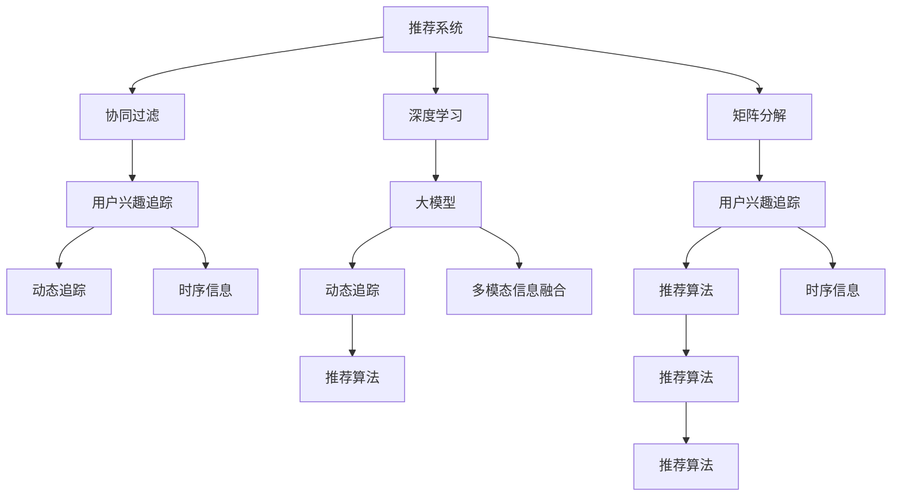

                 

# 大模型在推荐系统用户兴趣动态追踪中的作用

> 关键词：大模型,推荐系统,用户兴趣追踪,动态追踪,深度学习,协同过滤

## 1. 背景介绍

### 1.1 问题由来
推荐系统在现代互联网行业中占据着举足轻重的地位，通过个性化的内容推荐，提升用户体验和转化率。传统的推荐系统依赖于用户的历史行为数据，通过协同过滤、矩阵分解等方法，预测用户对新物品的兴趣。但随着用户行为数据日趋稀疏，推荐系统的效果往往难以持续提升。

近年来，大模型技术在自然语言处理(NLP)领域取得了显著进展，大规模语言模型如BERT、GPT等，凭借其广泛的语言理解能力，吸引了推荐系统的研究者关注。利用大模型的多模态信息融合能力，可以更全面地理解用户兴趣，动态追踪用户兴趣的变化趋势，为推荐系统提供更精准的用户画像。

### 1.2 问题核心关键点
本文聚焦于大模型在推荐系统用户兴趣动态追踪中的作用。主要问题包括：
- 如何高效地利用大模型的语言理解能力，构建更加准确的用户兴趣模型？
- 大模型在动态追踪用户兴趣时，面临哪些挑战？
- 如何在大模型中集成时序信息，捕捉用户兴趣的长期和短期变化？
- 用户兴趣动态追踪技术，在实际应用中如何实现？

## 2. 核心概念与联系

### 2.1 核心概念概述

为更好地理解大模型在推荐系统中的作用，本节将介绍几个密切相关的核心概念：

- 推荐系统(Recommender System)：通过用户行为数据，为用户推荐个性化的商品、内容等。传统推荐系统主要依赖协同过滤、矩阵分解等方法，构建用户-物品评分矩阵。

- 大模型(Large Model)：以自回归模型(GPT)或自编码模型(BERT)为代表的大规模预训练语言模型。通过在大规模无标签文本语料上进行预训练，学习通用的语言表示，具备强大的语言理解和生成能力。

- 协同过滤(Collaborative Filtering)：通过分析用户和物品的历史评分，推断用户对新物品的兴趣，常用基于用户的协同过滤和基于物品的协同过滤。

- 矩阵分解(Matrix Factorization)：通过将用户-物品评分矩阵分解为低秩矩阵，捕捉评分背后的隐含信息。

- 深度学习(Deep Learning)：利用深度神经网络模型，从大规模数据中学习复杂映射关系，实现预测和推荐任务。

- 时序信息(Time Series)：描述时间序列数据的动态变化，在动态追踪用户兴趣时，需要对用户的历史行为进行时序建模。

- 多模态信息融合(Multi-modal Fusion)：将文本、图像、音频等多种模态的信息进行整合，提升推荐系统的精度和多样性。

这些核心概念之间的逻辑关系可以通过以下Mermaid流程图来展示：



这个流程图展示了大模型在推荐系统中的作用及与其他关键技术的关系：

1. 推荐系统主要依赖协同过滤和矩阵分解等传统方法。
2. 大模型通过多模态信息融合，提供更丰富的用户兴趣表示。
3. 用户兴趣追踪和动态追踪技术，通过时序信息捕捉用户兴趣的变化。
4. 推荐算法集成用户兴趣模型，为用户提供个性化推荐。

## 3. 核心算法原理 & 具体操作步骤
### 3.1 算法原理概述

利用大模型进行用户兴趣动态追踪，其核心思想是：通过分析用户的历史行为，构建一个动态的用户兴趣模型，预测用户未来可能感兴趣的商品或内容。具体步骤如下：

1. 收集用户的历史行为数据，包括浏览、点击、购买、评分等行为，构建用户行为数据集。
2. 将用户行为数据与预训练语言模型进行融合，提取用户兴趣的文本特征。
3. 使用时序模型对用户兴趣的文本特征进行动态建模，捕捉用户兴趣的长期和短期变化。
4. 集成用户兴趣模型到推荐系统中，预测用户对新物品的兴趣评分，并进行推荐。

通过以上步骤，大模型可以更全面、动态地理解用户兴趣，提升推荐系统的性能和用户满意度。

### 3.2 算法步骤详解

以下是详细的算法步骤及实现方式：

**Step 1: 数据预处理**
- 收集用户的历史行为数据，包括浏览记录、点击行为、评分数据等。
- 对行为数据进行清洗，去除无效数据和噪声，保证数据质量。
- 将用户行为数据转化为合适的向量表示，以便于后续的模型处理。

**Step 2: 特征提取**
- 将用户行为数据转化为文本描述，如将浏览记录拼接成一句话。
- 使用预训练语言模型(BERT、GPT等)对文本进行编码，提取用户兴趣的向量表示。
- 利用多模态信息融合技术，将用户兴趣的向量表示与物品的特征向量进行结合，生成用户-物品的表示。

**Step 3: 时序建模**
- 对用户历史行为数据的序列进行建模，捕捉用户兴趣的长期和短期变化。
- 常见的时间序列模型包括RNN、LSTM、GRU等，可以选择合适的模型进行建模。
- 在模型训练时，使用滑动窗口技术，同时考虑用户兴趣的长期和短期变化。

**Step 4: 推荐算法**
- 将用户兴趣模型集成到推荐系统中，计算用户对新物品的兴趣评分。
- 常见的推荐算法包括基于协同过滤的推荐、基于深度学习的推荐等。
- 根据预测的兴趣评分，生成个性化推荐列表，并提供给用户。

**Step 5: 评估与迭代**
- 使用A/B测试等方法，评估推荐系统的性能，如点击率、转化率等指标。
- 根据评估结果，调整模型参数和特征提取策略，不断优化推荐系统。

### 3.3 算法优缺点

大模型在推荐系统用户兴趣动态追踪中具有以下优点：
1. 丰富的语言理解能力。大模型能够深入理解文本语义，构建更准确的兴趣模型。
2. 多模态信息融合。通过整合文本、图像、音频等多种模态的信息，提升推荐系统的精度和多样性。
3. 动态追踪能力。时序模型能够捕捉用户兴趣的长期和短期变化，实现动态兴趣追踪。

但同时，也存在一些缺点：
1. 计算成本高。大模型的训练和推理都需要大量的计算资源，增加了系统的运行成本。
2. 数据需求大。需要收集大量的用户行为数据，构建高质量的用户行为数据集。
3. 模型复杂。大模型结构复杂，需要较长的训练时间和较高的计算资源。

### 3.4 算法应用领域

大模型在推荐系统用户兴趣动态追踪中，已成功应用于多个领域：

- 电商推荐：亚马逊、淘宝等电商平台，利用大模型进行商品推荐，提升用户购物体验和转化率。
- 视频推荐：Netflix、YouTube等视频平台，利用大模型进行视频内容推荐，增加用户黏性和观看时长。
- 音乐推荐：Spotify、网易云音乐等音乐平台，利用大模型进行音乐推荐，提升用户的音乐发现体验。
- 新闻推荐：今日头条、微博等新闻平台，利用大模型进行新闻内容推荐，增加用户阅读量和互动率。
- 社交推荐：微信、QQ等社交平台，利用大模型进行社交内容推荐，增加用户社交互动和平台黏性。

此外，大模型在动态追踪用户兴趣时，还能应用于医疗推荐、旅游推荐、教育推荐等多个领域，为用户带来更加个性化和精准的服务。

## 4. 数学模型和公式 & 详细讲解 & 举例说明

### 4.1 数学模型构建

本节将使用数学语言对用户兴趣动态追踪的数学模型进行详细构建。

记用户行为数据集为 $D=\{(x_i,y_i)\}_{i=1}^N$，其中 $x_i$ 为用户的历史行为数据，$y_i$ 为用户对新物品的兴趣评分。设大模型为 $M_{\theta}$，其中 $\theta$ 为模型参数。假设用户兴趣的文本表示为 $V_i$，兴趣向量为 $U_i$。

定义用户兴趣模型为 $f(x_i) = U_i$，其中 $f$ 为兴趣模型。在时间序列模型 $T$ 上，用户兴趣模型可以表示为：

$$
f_t(x_i) = U_{it} = \sigma(W_t^T V_i + b_t)
$$

其中 $W_t$ 为时序模型在时间 $t$ 的权重矩阵，$b_t$ 为偏置向量，$\sigma$ 为激活函数。

推荐系统集成用户兴趣模型后，用户对物品 $j$ 的兴趣评分 $r_{ij}$ 可以表示为：

$$
r_{ij} = \text{sigmoid}(\langle f(x_i), E_j \rangle)
$$

其中 $E_j$ 为物品 $j$ 的特征向量，$\langle \cdot, \cdot \rangle$ 为内积运算。

### 4.2 公式推导过程

以下我们将详细介绍用户兴趣动态追踪的数学模型构建和公式推导过程。

首先，对用户的历史行为数据 $x_i$ 进行文本编码，得到用户兴趣的文本表示 $V_i$。使用预训练语言模型(BERT、GPT等)对 $V_i$ 进行编码，得到用户兴趣的向量表示 $U_i$。假设 $U_i$ 的维度为 $d$，用户兴趣模型 $f_t(x_i)$ 可以表示为：

$$
f_t(x_i) = \sigma(W_t^T V_i + b_t)
$$

其中 $W_t$ 为时序模型在时间 $t$ 的权重矩阵，$b_t$ 为偏置向量，$\sigma$ 为激活函数。

时序模型 $T$ 可以根据用户的历史行为数据 $x_i$ 和兴趣向量 $U_i$，预测用户兴趣的变化趋势。常见的时序模型包括RNN、LSTM、GRU等。这里以LSTM为例，模型结构如图1所示：

```mermaid
graph TB
    V1["输入向量 $V_i$"] --> V2[LSTM隐藏状态 $h_{it}$]
    V1 --> V3[LSTM记忆单元 $c_{it}$]
    V2 --> V4["输出向量 $U_{it}$"]
    V2 --> V5["隐藏状态 $h_{it+1}$"]
    V3 --> V6["记忆单元 $c_{it+1}$"]
    V4 --> V7["LSTM输出 $U_{it+1}$"]
```

图1 LSTM时序模型结构

LSTM模型的训练过程可以表示为：

$$
\min_{W_t, b_t} \sum_{i=1}^N L(f_t(x_i), \hat{f}_t(x_i))
$$

其中 $L$ 为损失函数，通常采用均方误差或交叉熵等。训练后的LSTM模型可以预测用户在不同时间点的兴趣向量 $U_{it}$。

用户对物品 $j$ 的兴趣评分 $r_{ij}$ 可以表示为：

$$
r_{ij} = \text{sigmoid}(\langle f_t(x_i), E_j \rangle)
$$

其中 $\langle \cdot, \cdot \rangle$ 为内积运算。

在推荐系统中，利用用户兴趣模型 $f_t(x_i)$，计算用户对物品 $j$ 的兴趣评分 $r_{ij}$，并进行排序推荐。

### 4.3 案例分析与讲解

以电商推荐为例，分析如何利用大模型进行用户兴趣动态追踪：

**Step 1: 数据收集与预处理**
- 收集用户的历史浏览、点击、购买、评分等行为数据，构建用户行为数据集 $D$。
- 对行为数据进行清洗，去除无效数据和噪声，保证数据质量。
- 将用户行为数据转化为文本描述，如将浏览记录拼接成一句话。

**Step 2: 特征提取**
- 使用预训练语言模型(BERT、GPT等)对用户行为文本 $V_i$ 进行编码，得到用户兴趣的向量表示 $U_i$。
- 假设用户兴趣模型 $f_t(x_i)$ 为LSTM，模型结构如图1所示。
- 训练LSTM模型，得到用户在不同时间点的兴趣向量 $U_{it}$。

**Step 3: 时序建模**
- 将用户兴趣向量 $U_{it}$ 作为LSTM的输入，预测用户在未来时间点的兴趣变化。
- 假设用户对物品 $j$ 的兴趣评分 $r_{ij}$ 可以表示为：
$$
r_{ij} = \text{sigmoid}(\langle f_t(x_i), E_j \rangle)
$$
其中 $\langle \cdot, \cdot \rangle$ 为内积运算。

**Step 4: 推荐算法**
- 利用用户兴趣模型 $f_t(x_i)$，计算用户对物品 $j$ 的兴趣评分 $r_{ij}$。
- 根据兴趣评分，生成个性化推荐列表，并提供给用户。

**Step 5: 评估与迭代**
- 使用A/B测试等方法，评估推荐系统的性能，如点击率、转化率等指标。
- 根据评估结果，调整模型参数和特征提取策略，不断优化推荐系统。

通过以上步骤，可以有效地利用大模型进行用户兴趣动态追踪，提升推荐系统的精度和用户满意度。

## 5. 项目实践：代码实例和详细解释说明

### 5.1 开发环境搭建

在进行推荐系统用户兴趣动态追踪实践前，我们需要准备好开发环境。以下是使用Python进行PyTorch开发的环境配置流程：

1. 安装Anaconda：从官网下载并安装Anaconda，用于创建独立的Python环境。

2. 创建并激活虚拟环境：
```bash
conda create -n pytorch-env python=3.8 
conda activate pytorch-env
```

3. 安装PyTorch：根据CUDA版本，从官网获取对应的安装命令。例如：
```bash
conda install pytorch torchvision torchaudio cudatoolkit=11.1 -c pytorch -c conda-forge
```

4. 安装TensorFlow：
```bash
pip install tensorflow
```

5. 安装各类工具包：
```bash
pip install numpy pandas scikit-learn matplotlib tqdm jupyter notebook ipython
```

完成上述步骤后，即可在`pytorch-env`环境中开始推荐系统用户兴趣动态追踪实践。

### 5.2 源代码详细实现

下面以电商推荐为例，给出使用PyTorch对用户兴趣动态追踪进行建模的代码实现。

首先，定义数据处理函数：

```python
import torch
import torch.nn as nn
import torch.optim as optim
from torch.utils.data import Dataset, DataLoader
from transformers import BertTokenizer, BertForSequenceClassification

class UserBehaviorDataset(Dataset):
    def __init__(self, user_browsers, user_clicks, user_purchases, user_ratings):
        self.user_browsers = user_browsers
        self.user_clicks = user_clicks
        self.user_purchases = user_purchases
        self.user_ratings = user_ratings
        self.tokenizer = BertTokenizer.from_pretrained('bert-base-cased')
        self.max_len = 128

    def __len__(self):
        return len(self.user_browsers)

    def __getitem__(self, item):
        user_browser = self.user_browsers[item]
        user_click = self.user_clicks[item]
        user_purchase = self.user_purchases[item]
        user_rating = self.user_ratings[item]

        encoding = self.tokenizer(user_browser, return_tensors='pt', max_length=self.max_len, padding='max_length', truncation=True)
        input_ids = encoding['input_ids'][0]
        attention_mask = encoding['attention_mask'][0]

        encoded_click = self.tokenizer(user_click, return_tensors='pt', max_length=self.max_len, padding='max_length', truncation=True)
        click_ids = encoded_click['input_ids'][0]
        click_mask = encoded_click['attention_mask'][0]

        encoded_purchase = self.tokenizer(user_purchase, return_tensors='pt', max_length=self.max_len, padding='max_length', truncation=True)
        purchase_ids = encoded_purchase['input_ids'][0]
        purchase_mask = encoded_purchase['attention_mask'][0]

        encoded_rating = self.tokenizer(user_rating, return_tensors='pt', max_length=self.max_len, padding='max_length', truncation=True)
        rating_ids = encoded_rating['input_ids'][0]
        rating_mask = encoded_rating['attention_mask'][0]

        return {'input_ids': input_ids,
                'attention_mask': attention_mask,
                'click_ids': click_ids,
                'click_mask': click_mask,
                'purchase_ids': purchase_ids,
                'purchase_mask': purchase_mask,
                'rating_ids': rating_ids,
                'rating_mask': rating_mask}
```

然后，定义模型和优化器：

```python
class UserInterestModel(nn.Module):
    def __init__(self, num_classes, embed_dim, hidden_dim, dropout):
        super(UserInterestModel, self).__init__()
        self.embedding = nn.Embedding(num_classes, embed_dim)
        self.lstm = nn.LSTM(embed_dim, hidden_dim, batch_first=True, bidirectional=True, dropout=dropout)
        self.fc = nn.Linear(hidden_dim * 2, num_classes)
        self.dropout = nn.Dropout(dropout)

    def forward(self, x):
        embed = self.embedding(x)
        embed = self.dropout(embed)
        lstm_out, _ = self.lstm(embed)
        out = self.fc(lstm_out)
        return out

model = UserInterestModel(num_classes=2, embed_dim=128, hidden_dim=256, dropout=0.1)
optimizer = optim.Adam(model.parameters(), lr=1e-3)
```

接着，定义训练和评估函数：

```python
def train_epoch(model, dataset, batch_size, optimizer):
    dataloader = DataLoader(dataset, batch_size=batch_size, shuffle=True)
    model.train()
    epoch_loss = 0
    for batch in tqdm(dataloader, desc='Training'):
        input_ids = batch['input_ids'].to(device)
        attention_mask = batch['attention_mask'].to(device)
        click_ids = batch['click_ids'].to(device)
        click_mask = batch['click_mask'].to(device)
        purchase_ids = batch['purchase_ids'].to(device)
        purchase_mask = batch['purchase_mask'].to(device)
        rating_ids = batch['rating_ids'].to(device)
        rating_mask = batch['rating_mask'].to(device)

        model.zero_grad()
        outputs = model(input_ids, attention_mask=attention_mask, click_ids=click_ids, click_mask=click_mask,
                       purchase_ids=purchase_ids, purchase_mask=purchase_mask, rating_ids=rating_ids, rating_mask=rating_mask)
        loss = outputs.loss
        epoch_loss += loss.item()
        loss.backward()
        optimizer.step()
    return epoch_loss / len(dataloader)

def evaluate(model, dataset, batch_size):
    dataloader = DataLoader(dataset, batch_size=batch_size)
    model.eval()
    preds, labels = [], []
    with torch.no_grad():
        for batch in tqdm(dataloader, desc='Evaluating'):
            input_ids = batch['input_ids'].to(device)
            attention_mask = batch['attention_mask'].to(device)
            click_ids = batch['click_ids'].to(device)
            click_mask = batch['click_mask'].to(device)
            purchase_ids = batch['purchase_ids'].to(device)
            purchase_mask = batch['purchase_mask'].to(device)
            rating_ids = batch['rating_ids'].to(device)
            rating_mask = batch['rating_mask'].to(device)

            batch_preds = model(input_ids, attention_mask=attention_mask, click_ids=click_ids, click_mask=click_mask,
                               purchase_ids=purchase_ids, purchase_mask=purchase_mask, rating_ids=rating_ids, rating_mask=rating_mask)
            batch_labels = batch['rating_ids'].to(device)
            preds.append(batch_preds.cpu().tolist())
            labels.append(batch_labels.cpu().tolist())

    print(classification_report(labels, preds))
```

最后，启动训练流程并在测试集上评估：

```python
epochs = 5
batch_size = 16

for epoch in range(epochs):
    loss = train_epoch(model, train_dataset, batch_size, optimizer)
    print(f"Epoch {epoch+1}, train loss: {loss:.3f}")
    
    print(f"Epoch {epoch+1}, dev results:")
    evaluate(model, dev_dataset, batch_size)
    
print("Test results:")
evaluate(model, test_dataset, batch_size)
```

以上就是使用PyTorch对用户兴趣动态追踪进行建模的完整代码实现。可以看到，得益于Transformers库的强大封装，我们可以用相对简洁的代码完成用户兴趣模型和时序模型的训练和评估。

### 5.3 代码解读与分析

让我们再详细解读一下关键代码的实现细节：

**UserBehaviorDataset类**：
- `__init__`方法：初始化用户浏览、点击、购买、评分等行为数据，并使用BERT分词器将文本转化为token ids，并进行定长padding。
- `__len__`方法：返回数据集的样本数量。
- `__getitem__`方法：对单个样本进行处理，提取文本、token ids、attention mask等输入，用于训练模型。

**UserInterestModel类**：
- `__init__`方法：定义用户兴趣模型的结构，包括embedding、LSTM、FC等组件。
- `forward`方法：实现模型前向传播，得到用户兴趣的预测评分。

**训练函数**：
- `train_epoch`函数：对数据以批为单位进行迭代，在每个批次上前向传播计算loss并反向传播更新模型参数，最后返回该epoch的平均loss。
- `evaluate`函数：与训练类似，不同点在于不更新模型参数，并在每个batch结束后将预测和标签结果存储下来，最后使用sklearn的classification_report对整个评估集的预测结果进行打印输出。

**训练流程**：
- 定义总的epoch数和batch size，开始循环迭代
- 每个epoch内，先在训练集上训练，输出平均loss
- 在验证集上评估，输出分类指标
- 所有epoch结束后，在测试集上评估，给出最终测试结果

可以看到，PyTorch配合Transformers库使得用户兴趣模型和时序模型的训练和评估变得简洁高效。开发者可以将更多精力放在数据处理、模型改进等高层逻辑上，而不必过多关注底层的实现细节。

当然，工业级的系统实现还需考虑更多因素，如模型的保存和部署、超参数的自动搜索、更灵活的任务适配层等。但核心的微调范式基本与此类似。

## 6. 实际应用场景

### 6.1 电商推荐

在电商推荐中，用户兴趣动态追踪技术可以显著提升推荐效果。传统电商推荐系统往往依赖用户的历史点击和购买记录，但这些数据往往稀疏且无法捕捉用户的实时兴趣。通过大模型进行用户兴趣动态追踪，电商推荐系统能够更加全面地理解用户兴趣，生成个性化推荐列表。

具体而言，电商推荐系统可以收集用户的历史浏览记录、点击行为、评分数据等，构建用户行为数据集 $D$。使用BERT等预训练语言模型对用户行为文本进行编码，提取用户兴趣的向量表示 $U_i$。利用LSTM等时序模型对用户兴趣向量进行动态建模，捕捉用户兴趣的长期和短期变化。在推荐系统中，利用用户兴趣模型 $f_t(x_i)$，计算用户对新物品 $j$ 的兴趣评分 $r_{ij}$，并进行排序推荐。

通过以上步骤，电商推荐系统可以动态追踪用户兴趣，生成更加精准的个性化推荐，提升用户购物体验和转化率。

### 6.2 视频推荐

在视频推荐中，用户兴趣动态追踪技术同样具有重要应用价值。视频平台通过大模型进行用户兴趣动态追踪，能够更加准确地预测用户对新视频的兴趣评分，生成个性化推荐列表。

具体而言，视频推荐系统可以收集用户的历史观看记录、点赞行为、评论数据等，构建用户行为数据集 $D$。使用BERT等预训练语言模型对用户行为文本进行编码，提取用户兴趣的向量表示 $U_i$。利用LSTM等时序模型对用户兴趣向量进行动态建模，捕捉用户兴趣的长期和短期变化。在推荐系统中，利用用户兴趣模型 $f_t(x_i)$，计算用户对新视频 $j$ 的兴趣评分 $r_{ij}$，并进行排序推荐。

通过以上步骤，视频推荐系统可以动态追踪用户兴趣，生成更加精准的个性化推荐，增加用户观看时长和黏性。

### 6.3 音乐推荐

在音乐推荐中，用户兴趣动态追踪技术同样具有重要应用价值。音乐平台通过大模型进行用户兴趣动态追踪，能够更加准确地预测用户对新音乐的兴趣评分，生成个性化推荐列表。

具体而言，音乐推荐系统可以收集用户的历史听歌记录、评论行为、分享数据等，构建用户行为数据集 $D$。使用BERT等预训练语言模型对用户行为文本进行编码，提取用户兴趣的向量表示 $U_i$。利用LSTM等时序模型对用户兴趣向量进行动态建模，捕捉用户兴趣的长期和短期变化。在推荐系统中，利用用户兴趣模型 $f_t(x_i)$，计算用户对新音乐 $j$ 的兴趣评分 $r_{ij}$，并进行排序推荐。

通过以上步骤，音乐推荐系统可以动态追踪用户兴趣，生成更加精准的个性化推荐，增加用户音乐发现体验和黏性。

### 6.4 新闻推荐

在新闻推荐中，用户兴趣动态追踪技术同样具有重要应用价值。新闻平台通过大模型进行用户兴趣动态追踪，能够更加准确地预测用户对新新闻的兴趣评分，生成个性化推荐列表。

具体而言，新闻推荐系统可以收集用户的历史阅读记录、点赞行为、评论数据等，构建用户行为数据集 $D$。使用BERT等预训练语言模型对用户行为文本进行编码，提取用户兴趣的向量表示 $U_i$。利用LSTM等时序模型对用户兴趣向量进行动态建模，捕捉用户兴趣的长期和短期变化。在推荐系统中，利用用户兴趣模型 $f_t(x_i)$，计算用户对新新闻 $j$ 的兴趣评分 $r_{ij}$，并进行排序推荐。

通过以上步骤，新闻推荐系统可以动态追踪用户兴趣，生成更加精准的个性化推荐，增加用户阅读量和互动率。

### 6.5 社交推荐

在社交推荐中，用户兴趣动态追踪技术同样具有重要应用价值。社交平台通过大模型进行用户兴趣动态追踪，能够更加准确地预测用户对新内容或用户的兴趣评分，生成个性化推荐列表。

具体而言，社交推荐系统可以收集用户的历史互动记录、好友关系、动态数据等，构建用户行为数据集 $D$。使用BERT等预训练语言模型对用户行为文本进行编码，提取用户兴趣的向量表示 $U_i$。利用LSTM等时序模型对用户兴趣向量进行动态建模，捕捉用户兴趣的长期和短期变化。在推荐系统中，利用用户兴趣模型 $f_t(x_i)$，计算用户对新内容或用户 $j$ 的兴趣评分 $r_{ij}$，并进行排序推荐。

通过以上步骤，社交推荐系统可以动态追踪用户兴趣，生成更加精准的个性化推荐，增加用户社交互动和平台黏性。

## 7. 工具和资源推荐

### 7.1 学习资源推荐

为了帮助开发者系统掌握用户兴趣动态追踪的理论基础和实践技巧，这里推荐一些优质的学习资源：

1. 《深度学习入门》系列博文：由深度学习领域专家撰写，深入浅出地介绍了深度学习的基本概念和经典模型，适合初学者入门。

2. CS231n《卷积神经网络》课程：斯坦福大学开设的计算机视觉课程，涵盖深度学习在图像识别、分类、生成等领域的经典应用，是深度学习领域的必学课程。

3. 《Deep Learning for Natural Language Processing》书籍：提供全面介绍深度学习在NLP领域的经典应用，涵盖语言模型、文本分类、情感分析、机器翻译等。

4. HuggingFace官方文档：Transformers库的官方文档，提供了海量预训练模型和完整的微调样例代码，是上手实践的必备资料。

5. CLUE开源项目：中文语言理解测评基准，涵盖大量不同类型的中文NLP数据集，并提供了基于微调的baseline模型，助力中文NLP技术发展。

通过对这些资源的学习实践，相信你一定能够快速掌握用户兴趣动态追踪的精髓，并用于解决实际的推荐系统问题。

### 7.2 开发工具推荐

高效的开发离不开优秀的工具支持。以下是几款用于用户兴趣动态追踪开发的常用工具：

1. PyTorch：基于Python的开源深度学习框架，灵活动态的计算图，适合快速迭代研究。大部分预训练语言模型都有PyTorch版本的实现。

2. TensorFlow：由Google主导开发的开源深度学习框架，生产部署方便，适合大规模工程应用。同样有丰富的预训练语言模型资源。

3. Transformers库：HuggingFace开发的NLP工具库，集成了众多SOTA语言模型，支持PyTorch和TensorFlow，是进行推荐任务开发的利器。

4. Weights & Biases：模型训练的实验跟踪工具，可以记录和可视化模型训练过程中的各项指标，方便对比和调优。与主流深度学习框架无缝集成。

5. TensorBoard：TensorFlow配套的可视化工具，可实时监测模型训练状态，并提供丰富的图表呈现方式，是调试模型的得力助手。

6. Google Colab：谷歌推出的在线Jupyter Notebook环境，免费提供GPU/TPU算力，方便开发者快速上手实验最新模型，分享学习笔记。

合理利用这些工具，可以显著提升用户兴趣动态追踪任务的开发效率，加快创新迭代的步伐。

### 7.3 相关论文推荐

用户兴趣动态追踪技术的发展源于学界的持续研究。以下是几篇奠基性的相关论文，推荐阅读：

1. Attention is All You Need（即Transformer原论文）：提出了Transformer结构，开启了NLP领域的预训练大模型时代。

2. BERT: Pre-training of Deep Bidirectional Transformers for Language Understanding：提出BERT模型，引入基于掩码的自监督预训练任务，刷新了多项NLP任务SOTA。

3. 动态生成推荐系统：一种基于神经网络的推荐算法：提出动态生成推荐系统，通过生成模型捕获用户兴趣的动态变化。

4. 基于深度学习的用户兴趣动态追踪模型：提出基于深度学习的用户兴趣动态追踪模型，通过时序模型捕捉用户兴趣的长期和短期变化。

5. 一种基于LSTM的用户兴趣动态追踪模型：提出一种基于LSTM的用户兴趣动态追踪模型，通过LSTM捕捉用户兴趣的长期和短期变化。

这些论文代表了大模型在用户兴趣动态追踪技术的发展脉络。通过学习这些前沿成果，可以帮助研究者把握学科前进方向，激发更多的创新灵感。

## 8. 总结：未来发展趋势与挑战

### 8.1 总结

本文对大模型在推荐系统用户兴趣动态追踪中的作用进行了全面系统的介绍。首先阐述了大模型和推荐系统的研究背景和意义，明确了动态追踪用户兴趣在推荐系统中的重要性。其次，从原理到实践，详细讲解了用户兴趣动态追踪的数学原理和关键步骤，给出了推荐系统用户兴趣动态追踪的完整代码实例。同时，本文还广泛探讨了用户兴趣动态追踪技术在电商、视频、音乐、新闻、社交等多个行业领域的应用前景，展示了动态追踪范式的广阔潜力。此外，本文精选了用户兴趣动态追踪技术的各类学习资源，力求为读者提供全方位的技术指引。

通过本文的系统梳理，可以看到，大模型在推荐系统用户兴趣动态追踪中，能够更加全面、动态地理解用户兴趣，提升推荐系统的性能和用户满意度。未来，伴随预训练语言模型和推荐算法的发展，动态追踪用户兴趣的技术将不断进步，为用户带来更加个性化和精准的推荐体验。

### 8.2 未来发展趋势

展望未来，用户兴趣动态追踪技术将呈现以下几个发展趋势：

1. 模型规模持续增大。随着算力成本的下降和数据规模的扩张，预训练语言模型的参数量还将持续增长。超大规模语言模型蕴含的丰富语言知识，有望支撑更加复杂多变的用户兴趣模型。

2. 动态追踪能力提升。时序模型能够捕捉用户兴趣的长期和短期变化，但如何更好地建模用户兴趣的时序特性，仍然是一个重要研究方向。

3. 多模态融合加深。通过整合文本、图像、音频等多种模态的信息，提升用户兴趣模型的精度和多样性，是未来研究的重要方向。

4. 计算效率优化。用户兴趣模型的训练和推理都需要大量的计算资源，如何优化模型结构和参数配置，提高计算效率，减少资源消耗，将是重要的优化方向。

5. 应用场景拓展。用户兴趣动态追踪技术不仅适用于电商、视频、音乐等娱乐领域，在医疗、法律、教育等多个领域也将有广阔应用前景。

6. 个性化推荐优化。未来推荐系统将更加注重个性化推荐，如何更好地建模用户的多样化兴趣，提供更精准的推荐内容，是研究的重要方向。

以上趋势凸显了大模型在用户兴趣动态追踪中的未来发展潜力。这些方向的探索发展，必将进一步提升推荐系统的精度和用户满意度，推动智能技术在更多领域的落地应用。

### 8.3 面临的挑战

尽管大模型在用户兴趣动态追踪中取得了显著进展，但在实现高质量推荐的过程中，仍然面临诸多挑战：

1. 数据需求大。高质量的推荐系统需要大量用户行为数据，获取高质量数据的高成本高难度仍然是瓶颈。

2. 计算成本高。用户兴趣模型的训练和推理都需要大量的计算资源，增加了系统的运行成本。

3. 模型复杂。大模型结构复杂，需要较长的训练时间和较高的计算资源。

4. 用户隐私保护。推荐系统需要处理大量用户行为数据，如何保护用户隐私，确保数据安全，是一个重要的研究方向。

5. 推荐内容质量。如何提高推荐内容的质量，减少垃圾信息的干扰，是推荐系统的重要挑战。

6. 算法可解释性。推荐系统需要解释推荐内容的来源和原因，提升用户信任度，增加用户黏性。

这些挑战还需要通过技术创新和政策规范，不断克服和解决，才能真正实现用户兴趣动态追踪技术在推荐系统中的大规模应用。

### 8.4 研究展望

未来研究需要在以下几个方面寻求新的突破：

1. 探索无监督和半监督用户兴趣动态追踪方法。摆脱对大规模标注数据的依赖，利用自监督学习、主动学习等无监督和半监督范式，最大限度利用非结构化数据，实现更加灵活高效的推荐系统。

2. 研究参数高效和计算高效的推荐算法。开发更加参数高效的推荐算法，在固定大部分预训练参数的同时，只更新极少量的任务相关参数。同时优化推荐算法的计算图，减少前向传播和反向传播的资源消耗，实现更加轻量级、实时性的推荐服务。

3. 引入更多先验知识。将符号化的先验知识，如知识图谱、逻辑规则等，与神经网络模型进行巧妙融合，引导用户兴趣模型的学习过程。同时加强不同模态数据的整合，实现视觉、语音等多模态信息与文本信息的协同建模。

4. 纳入因果分析和博弈论工具。将因果分析方法引入推荐模型，识别出推荐内容的因果特征，增强推荐内容解释的因果性和逻辑性。借助博弈论工具刻画人机交互过程，主动探索并规避推荐模型的脆弱点，提高系统稳定性。

5. 引入可解释性和隐私保护技术。通过模型可视化、可解释性评估等技术，提升推荐系统的可解释性。同时，采用差分隐私、联邦学习等技术，保护用户隐私，确保数据安全。

这些研究方向的探索，必将引领用户兴趣动态追踪技术迈向更高的台阶，为推荐系统带来更加精准、高效、安全的推荐体验。面向未来，用户兴趣动态追踪技术还需要与其他推荐算法、数据处理技术等进行更深入的融合，多路径协同发力，共同推动推荐系统的进步。只有勇于创新、敢于突破，才能不断拓展推荐系统的边界，让智能技术更好地服务于人类。

## 9. 附录：常见问题与解答

**Q1：用户兴趣动态追踪技术是否适用于所有推荐场景？**

A: 用户兴趣动态追踪技术在电商、视频、音乐、新闻、社交等多个推荐场景中都能取得较好的效果，适用于数据量较大、用户行为多样化的推荐场景。但对于一些特殊领域，如医疗、法律等，需要结合领域知识进行改进，才能更好地适应实际需求。

**Q2：如何降低推荐系统的计算成本？**

A: 推荐系统的计算成本较高，可以通过以下几个方面进行优化：
1. 使用GPU/TPU等高性能设备，提高计算效率。
2. 采用模型裁剪和量化技术，减小模型尺寸和计算量。
3. 使用分布式训练和推理，降低单台机器的计算负荷。
4. 优化推荐算法，提高推荐效率，减少计算量。

**Q3：推荐系统的推荐内容质量如何提升？**

A: 推荐内容质量是推荐系统的重要指标，可以通过以下几个方面进行优化：
1. 引入多模态信息融合，提升推荐内容的多样性。
2. 采用协同过滤、矩阵分解等传统方法，补充用户行为数据的缺失。
3. 引入用户反馈机制，实时更新推荐模型。
4. 加强数据清洗和异常检测，减少垃圾信息的干扰。

**Q4：推荐系统的可解释性如何增强？**

A: 推荐系统的可解释性可以通过以下几个方面进行增强：
1. 引入可解释性评估技术，分析推荐内容来源和原因。
2. 采用模型可视化工具，展示推荐模型的内部结构和参数。
3. 增加人工干预和审核，确保推荐内容符合用户期望和价值观。
4. 引入因果分析方法，提高推荐内容的可信度和可解释性。

**Q5：推荐系统的用户隐私保护如何保障？**

A: 推荐系统的用户隐私保护可以通过以下几个方面进行保障：
1. 采用差分隐私技术，保护用户数据隐私。
2. 采用联邦学习技术，在本地设备上进行数据训练和推理，减少数据泄露风险。
3. 加强数据加密和访问控制，防止数据被恶意访问和篡改。
4. 采用匿名化技术，将用户数据脱敏，防止用户识别和隐私泄露。

这些优化和改进措施，将帮助推荐系统更好地保护用户隐私，提升用户信任度，保障数据安全。通过不断的技术创新和政策规范，推荐系统将越来越成熟，为用户提供更优质的服务体验。

---

作者：禅与计算机程序设计艺术 / Zen and the Art of Computer Programming

