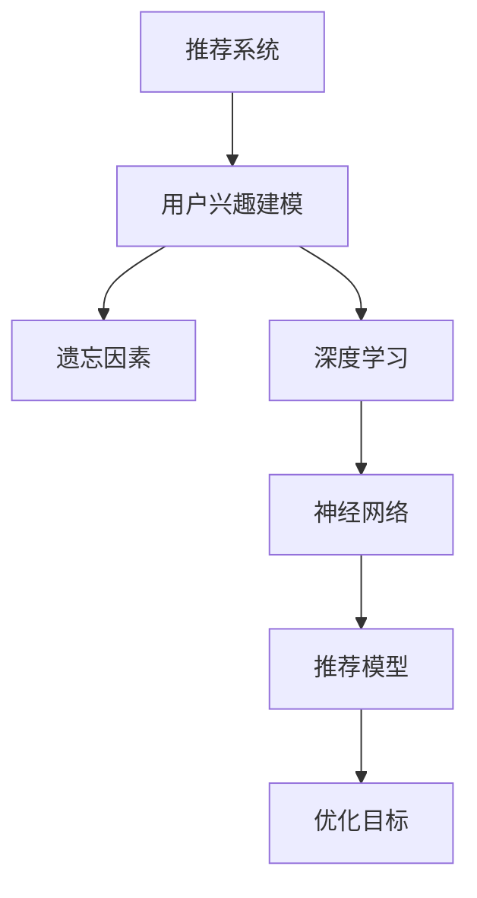

                 

# 大模型在推荐系统用户兴趣遗忘建模中的作用

> 关键词：推荐系统,用户兴趣建模,遗忘因素,深度学习,神经网络

## 1. 背景介绍

### 1.1 问题由来

随着电子商务和数字媒体的快速发展，推荐系统已经成为用户获取个性化信息的重要工具。然而，推荐系统在长时间运行后，用户兴趣和行为会逐渐发生变化，导致推荐效果下降。传统的推荐系统模型往往忽视这种时间相关性，难以适应这种动态变化，用户体验和推荐效果都会受到明显影响。因此，如何构建一个能够有效建模用户兴趣遗忘特性的推荐系统，成为亟待解决的问题。

### 1.2 问题核心关键点

1. 用户兴趣遗忘特性：用户兴趣和行为会随时间推移而发生变化，导致旧推荐可能不再有效。
2. 动态推荐：推荐系统需要实时更新用户兴趣，以确保推荐内容符合用户当前的偏好。
3. 深度学习技术：利用深度学习模型能够从大量历史数据中学习用户兴趣的动态变化，捕捉用户行为模式。

### 1.3 问题研究意义

研究用户兴趣遗忘特性，构建基于大模型的推荐系统，对于提高推荐系统的个性化、实时性和动态性，具有重要意义：

1. 提升推荐效果：有效建模用户兴趣遗忘特性，能够更好地预测用户行为，提高推荐系统的准确率和覆盖率。
2. 增强用户体验：根据用户最新的兴趣变化，提供更为个性化的推荐内容，提升用户满意度。
3. 促进业务增长：通过提升推荐系统的性能，增加用户留存和转化率，推动业务增长。

## 2. 核心概念与联系

### 2.1 核心概念概述

为更好地理解基于大模型的推荐系统，本节将介绍几个密切相关的核心概念：

- **推荐系统(Recommendation System)**：利用机器学习、深度学习等技术，预测用户对物品的兴趣，并基于此推荐相关物品的系统。
- **用户兴趣建模(User Interest Modeling)**：通过对用户历史行为和兴趣的建模，预测用户未来行为，是推荐系统的核心任务之一。
- **遗忘因素(Forgotten Factor)**：指用户随时间推移而逐渐消失的兴趣和行为，推荐系统需对其变化进行建模。
- **深度学习(Deep Learning)**：利用多层神经网络从大量数据中自动学习特征表示，用于解决复杂任务。
- **神经网络(Neural Network)**：深度学习模型的主要形式，包括前馈神经网络、卷积神经网络、循环神经网络等。
- **推荐模型(Recommendation Model)**：基于用户和物品的特征，使用机器学习算法构建的推荐系统模型，如协同过滤、基于内容的推荐等。
- **优化目标(Optimization Objective)**：推荐模型的主要优化目标，通常是最大化推荐准确率、用户满意度等指标。

这些概念之间的逻辑关系可以通过以下Mermaid流程图来展示：



这个流程图展示了几组核心概念之间的关系：

1. 推荐系统利用用户兴趣建模和深度学习技术，预测用户对物品的兴趣。
2. 用户兴趣建模需要考虑遗忘因素，捕捉用户兴趣随时间的变化。
3. 深度学习通过神经网络构建复杂模型，用于用户兴趣建模和推荐。
4. 推荐模型基于用户和物品特征，构建推荐逻辑。
5. 优化目标是推荐模型的最终目标，通常涉及准确率、覆盖率等指标。

## 3. 核心算法原理 & 具体操作步骤
### 3.1 算法原理概述

基于大模型的推荐系统，通过在历史数据上进行预训练，学习到用户兴趣和物品的特征表示。然后，结合用户随时间推移的兴趣遗忘特性，对用户兴趣进行建模和动态更新，最终预测用户对物品的兴趣，生成推荐。

形式化地，假设历史数据集为 $D=\{(x_i, y_i)\}_{i=1}^N$，其中 $x_i$ 为用户行为，$y_i$ 为物品标签。令 $X \in \mathbb{R}^{N \times d_x}$ 为用户行为矩阵，$Y \in \mathbb{R}^{N \times d_y}$ 为物品标签矩阵。

推荐系统可表示为 $\hat{y}=f(x; \theta)$，其中 $f$ 为推荐函数，$\theta$ 为模型参数。推荐函数通过学习用户行为和物品标签之间的映射关系，预测用户对物品的兴趣。

用户兴趣遗忘特性可建模为 $f_t(x_i; \theta_t) = f(x_i; \theta_0) e^{-g(t)}$，其中 $g(t)$ 为遗忘函数，$t$ 为时间。推荐函数在时间 $t$ 时刻的输出，需考虑随时间变化的遗忘因素。

### 3.2 算法步骤详解

基于大模型的推荐系统，主要包含以下关键步骤：

**Step 1: 数据预处理与用户兴趣建模**

- 收集用户历史行为数据，构建用户行为矩阵 $X$ 和物品标签矩阵 $Y$。
- 对用户行为和物品标签进行归一化和标准化处理。
- 对用户兴趣进行建模，得到用户兴趣表示 $x_u \in \mathbb{R}^{d_x}$，其中 $d_x$ 为用户特征维度。

**Step 2: 引入遗忘因素**

- 定义遗忘函数 $g(t)$，可以采用指数衰减函数、指数增长函数、线性函数等。
- 对用户兴趣进行动态更新，得到时间 $t$ 时刻的兴趣表示 $x_u(t) = x_u e^{-g(t)}$。

**Step 3: 预训练模型**

- 选择合适的深度学习模型，如循环神经网络(RNN)、长短期记忆网络(LSTM)、变分自编码器(VAE)等，进行预训练。
- 预训练目标为最大化历史数据的似然，通常使用交叉熵损失函数。
- 对模型进行正则化，防止过拟合。

**Step 4: 微调模型**

- 将预训练模型作为初始化参数，使用用户行为数据进行微调。
- 设定合适的学习率和优化器，如AdamW、SGD等。
- 引入遗忘因素，优化用户兴趣表示 $x_u(t)$。

**Step 5: 推荐生成**

- 根据用户当前兴趣表示和物品特征，使用推荐函数 $f$ 计算推荐结果。
- 根据推荐结果排序，选择TopN推荐物品。

### 3.3 算法优缺点

基于大模型的推荐系统具有以下优点：

1. 精度高：利用大模型强大的特征学习能力和泛化能力，能够捕捉复杂的用户行为模式和兴趣变化。
2. 适应性强：通过引入遗忘因素，能够动态更新用户兴趣，适应用户兴趣的变化。
3. 泛化能力强：预训练模型可以应用于不同领域和不同任务，具有较强的泛化能力。

同时，该方法也存在以下缺点：

1. 计算复杂度高：大模型参数量庞大，训练和推理计算复杂度高。
2. 数据依赖性强：需要大量高质量的历史数据进行预训练和微调，数据获取成本高。
3. 鲁棒性差：大模型在面对域外数据时，泛化能力可能不足，推荐效果下降。
4. 可解释性差：基于大模型的推荐系统难以解释推荐逻辑和决策过程。

尽管存在这些局限性，但就目前而言，基于大模型的推荐系统仍然是最先进、最有效的推荐方案之一。未来相关研究的重点在于如何进一步降低计算成本，提高数据利用率，增强模型的可解释性，并提升推荐系统的鲁棒性和适应性。

### 3.4 算法应用领域

基于大模型的推荐系统在多个领域中得到广泛应用，例如：

- 电子商务：对用户浏览、点击、购买等行为进行分析，推荐商品。
- 内容推荐：对用户阅读、观看等行为进行分析，推荐文章、视频等。
- 金融投资：对用户交易行为进行分析，推荐股票、基金等投资产品。
- 广告投放：对用户浏览、点击等行为进行分析，推荐广告内容。
- 新闻推荐：对用户阅读行为进行分析，推荐新闻文章。
- 健康医疗：对用户搜索、访问等行为进行分析，推荐医疗信息。
- 旅游服务：对用户搜索、预订等行为进行分析，推荐旅游目的地、酒店等。

这些领域的应用，展示了基于大模型的推荐系统在提升用户体验、提高推荐准确率方面的巨大潜力。

## 4. 数学模型和公式 & 详细讲解 & 举例说明（备注：数学公式请使用latex格式，latex嵌入文中独立段落使用 $$，段落内使用 $)
### 4.1 数学模型构建

本节将使用数学语言对基于大模型的推荐系统进行更加严格的刻画。

假设用户行为序列为 $(x_t)$，物品标签序列为 $(y_t)$。推荐系统可表示为 $\hat{y}_t=f(x_t; \theta)$，其中 $f$ 为推荐函数，$\theta$ 为模型参数。用户兴趣随时间变化可建模为 $x_t = x_{t-1} e^{-g(t)}$，其中 $g(t)$ 为遗忘函数。

定义推荐函数 $f$ 为多层感知器(MLP)，即 $f(x; \theta)=W \cdot \sigma(A \cdot x+b)$，其中 $W \in \mathbb{R}^{d_y \times d_x}$，$A \in \mathbb{R}^{d_x \times d_h}$，$b \in \mathbb{R}^{d_y}$，$\sigma$ 为激活函数，$d_h$ 为隐藏层维度。

定义遗忘函数 $g(t)$ 为指数衰减函数，即 $g(t)=\alpha e^{-\beta t}$，其中 $\alpha, \beta$ 为超参数。

定义推荐系统优化目标为最大化历史数据的似然，即 $\max_{\theta} \mathcal{L}(\theta) = \sum_{t=1}^N \log P(y_t|x_t; \theta)$。

### 4.2 公式推导过程

以下我们以多层感知器作为推荐函数，对推荐系统进行数学建模和公式推导。

首先，对用户行为和物品标签进行预训练，得到模型参数 $\theta_0$。预训练目标为最大化似然，即 $\max_{\theta_0} \mathcal{L}_{pre}(\theta_0) = \sum_{t=1}^N \log P(y_t|x_t; \theta_0)$。

然后，对用户兴趣进行建模，得到时间 $t$ 时刻的兴趣表示 $x_t = x_{t-1} e^{-g(t)}$。将 $x_t$ 作为推荐函数的输入，得到推荐结果 $\hat{y}_t=f(x_t; \theta)$。

将推荐函数 $f$ 展开，得 $\hat{y}_t=W \cdot \sigma(A \cdot x_t+b)$。通过链式法则，得损失函数 $\ell(\theta) = -\sum_{t=1}^N \log \hat{y}_t^{y_t} (1-\hat{y}_t)^{1-y_t}$。

引入遗忘因素，得 $\ell_t(\theta) = -\log \hat{y}_t^{y_t} (1-\hat{y}_t)^{1-y_t} - g(t) \log x_t$。

对 $\theta$ 进行微调，最大化 $\mathcal{L}(\theta) = \sum_{t=1}^N \ell_t(\theta)$。

### 4.3 案例分析与讲解

假设我们有一个电商推荐系统，需要为用户推荐购物商品。用户在过去一段时间内，浏览、点击、购买了一些商品。我们将这些行为序列作为用户行为数据，将商品标签序列作为物品标签数据。

预训练模型使用MLP，用户行为矩阵 $X$ 为 $2000 \times 10$，物品标签矩阵 $Y$ 为 $2000 \times 100$。用户兴趣表示 $x_u \in \mathbb{R}^{10}$，物品特征表示 $y_i \in \mathbb{R}^{100}$。

假设遗忘函数 $g(t)=0.99^t$，即用户兴趣随时间衰减，每过一秒钟，兴趣值下降 $0.01$。

推荐函数 $f$ 使用两层的MLP，隐藏层维度 $d_h=100$，激活函数为ReLU。

使用AdamW优化器，学习率为 $10^{-4}$，进行微调。

### 5. 项目实践：代码实例和详细解释说明
### 5.1 开发环境搭建

在进行推荐系统开发前，我们需要准备好开发环境。以下是使用Python进行TensorFlow开发的环境配置流程：

1. 安装Anaconda：从官网下载并安装Anaconda，用于创建独立的Python环境。

2. 创建并激活虚拟环境：
```bash
conda create -n recommendation-env python=3.8 
conda activate recommendation-env
```

3. 安装TensorFlow：根据CUDA版本，从官网获取对应的安装命令。例如：
```bash
conda install tensorflow tensorflow-gpu=2.7 -c conda-forge
```

4. 安装TensorFlow Addons：添加TensorFlow Addons库，以使用更多高级功能。
```bash
pip install tensorflow-addons
```

5. 安装各类工具包：
```bash
pip install numpy pandas scikit-learn matplotlib tqdm jupyter notebook ipython
```

完成上述步骤后，即可在`recommendation-env`环境中开始推荐系统开发。

### 5.2 源代码详细实现

下面我们以多层感知器(MLP)作为推荐函数，使用TensorFlow进行推荐系统的实现。

首先，定义推荐函数 $f$：

```python
import tensorflow as tf
import tensorflow_addons as addons

def f(x, theta):
    W = tf.Variable(tf.random.normal([d_y, d_x]))
    b = tf.Variable(tf.random.normal([d_y]))
    A = tf.Variable(tf.random.normal([d_x, d_h]))
    x = tf.matmul(x, A) + b
    x = tf.nn.relu(x)
    x = tf.matmul(x, W) + b
    return x
```

然后，定义遗忘函数 $g(t)$：

```python
def g(t):
    alpha = 0.5
    beta = 0.01
    return alpha * tf.exp(-beta * t)
```

接着，定义推荐系统优化目标 $\mathcal{L}(\theta)$：

```python
def l(theta, x, y, t):
    x_t = x * tf.exp(-g(t))
    y_hat = f(x_t, theta)
    loss = tf.nn.sigmoid_cross_entropy_with_logits(labels=y, logits=y_hat)
    return tf.reduce_mean(tf.reduce_sum(loss, axis=1))
```

最后，进行模型的训练和推荐：

```python
learning_rate = 0.0001
epochs = 10
batch_size = 64

# 加载数据
X = np.load('user_behavior_matrix.npy')
Y = np.load('item_label_matrix.npy')
t = np.load('time.npy')

# 初始化模型参数
theta = tf.Variable(tf.random.normal([d_y, d_x]))

# 优化器
optimizer = tf.keras.optimizers.Adam(learning_rate)

# 训练过程
for epoch in range(epochs):
    for i in range(0, len(X), batch_size):
        x_batch = X[i:i+batch_size]
        y_batch = Y[i:i+batch_size]
        t_batch = t[i:i+batch_size]
        
        with tf.GradientTape() as tape:
            loss = l(theta, x_batch, y_batch, t_batch)
        gradients = tape.gradient(loss, theta)
        optimizer.apply_gradients(zip(gradients, theta))

# 推荐生成
user_id = 1000
item_ids = [1001, 1002, 1003, 1004, 1005]
time = 100
x_u = X[user_id]
y_hat = f(x_u * tf.exp(-g(time)), theta)
```

以上就是使用TensorFlow进行多层感知器推荐系统的完整代码实现。可以看到，利用TensorFlow的高级API，推荐系统的实现变得相对简洁。

### 5.3 代码解读与分析

让我们再详细解读一下关键代码的实现细节：

**定义推荐函数 f**：
- 使用变分，将权重矩阵、偏置向量、隐藏层权重矩阵作为可训练的参数。
- 通过两层的MLP，将用户兴趣表示和物品特征表示映射到物品标签预测结果。

**定义遗忘函数 g**：
- 使用指数衰减函数，根据时间 $t$ 计算用户的兴趣衰减率。

**定义推荐系统优化目标 l**：
- 计算预测结果与真实标签的交叉熵损失。
- 引入遗忘因素，对用户兴趣表示进行动态更新。
- 使用均值池化，对每个样本的损失进行归一化。

**训练过程**：
- 设定学习率、训练轮数和批次大小。
- 对每个批次进行前向传播和反向传播，计算损失和梯度。
- 使用Adam优化器更新模型参数。
- 重复以上过程，直至模型收敛。

**推荐生成**：
- 将用户当前兴趣表示与时间 $t$ 进行动态更新。
- 使用推荐函数计算预测结果。
- 根据预测结果对物品进行排序，选择TopN推荐物品。

可以看到，TensorFlow提供了强大的自动化计算图功能，使得推荐系统的实现和调试变得非常方便。开发者只需关注模型设计和高层次逻辑，底层细节由TensorFlow自动处理。

## 6. 实际应用场景
### 6.1 智能推荐引擎

基于大模型的推荐系统，广泛应用于智能推荐引擎的构建。传统推荐系统往往依赖用户的历史行为数据进行推荐，无法适应用户兴趣的变化。而利用大模型的深度学习能力，推荐系统能够更好地捕捉用户兴趣的动态变化，实时调整推荐结果。

在技术实现上，可以收集用户的历史行为数据，如浏览、点击、购买等，构建用户行为矩阵 $X$ 和物品标签矩阵 $Y$。通过微调模型，实时更新用户兴趣表示 $x_u(t)$，生成个性化推荐结果。

**实际应用**：
- 电子商务平台：对用户的浏览、点击、购买行为进行分析，实时推荐商品。
- 视频平台：对用户的观看、点赞、评论行为进行分析，实时推荐视频内容。
- 音乐平台：对用户的听歌、收藏、分享行为进行分析，实时推荐音乐内容。

**未来展望**：
- 用户兴趣建模：通过引入更多用户行为特征，如兴趣变化趋势、情感状态等，进一步提升推荐效果。
- 物品表示学习：通过引入更多物品属性，如商品描述、标签等，提升物品表示的丰富度。
- 交互预测：通过预测用户与物品的交互效果，提升推荐系统的精准度和个性化。

### 6.2 内容推荐系统

基于大模型的推荐系统在内容推荐领域也有广泛应用。传统内容推荐系统往往依赖用户的历史点击、评分等行为数据进行推荐，难以适应内容的多样性和用户的多样性。而利用大模型的深度学习能力，推荐系统能够更好地捕捉内容的语义信息，实现更准确的推荐。

在技术实现上，可以收集用户的历史点击、评分、评论等行为数据，构建用户行为矩阵 $X$ 和内容特征矩阵 $Y$。通过微调模型，实时更新用户兴趣表示 $x_u(t)$，生成个性化推荐结果。

**实际应用**：
- 新闻推荐系统：对用户的新闻阅读行为进行分析，实时推荐相关新闻。
- 视频推荐系统：对用户的观看行为进行分析，实时推荐视频内容。
- 音乐推荐系统：对用户的听歌行为进行分析，实时推荐音乐内容。

**未来展望**：
- 多模态学习：通过引入视觉、语音等多模态信息，提升推荐系统的多样性和准确性。
- 内容生成：通过生成模型生成新的内容，扩大推荐系统的覆盖范围。
- 社会化推荐：通过用户社交网络信息，提升推荐系统的个性化和多样性。

### 6.3 广告投放系统

基于大模型的推荐系统在广告投放领域也有广泛应用。传统广告投放系统往往依赖用户的历史行为数据进行投放，难以适应用户兴趣的变化。而利用大模型的深度学习能力，广告系统能够更好地捕捉用户兴趣的动态变化，实现更精准的广告投放。

在技术实现上，可以收集用户的历史点击、浏览、搜索等行为数据，构建用户行为矩阵 $X$ 和广告特征矩阵 $Y$。通过微调模型，实时更新用户兴趣表示 $x_u(t)$，生成个性化推荐结果。

**实际应用**：
- 搜索引擎广告：对用户的搜索行为进行分析，实时推荐相关广告。
- 社交媒体广告：对用户的浏览、点赞、评论行为进行分析，实时推荐相关广告。
- 电商广告：对用户的浏览、点击、购买行为进行分析，实时推荐相关广告。

**未来展望**：
- 用户行为建模：通过引入更多用户行为特征，如兴趣变化趋势、情感状态等，进一步提升广告投放的效果。
- 广告内容生成：通过生成模型生成新的广告内容，提升广告的多样性和吸引力。
- 多渠道投放：通过多个广告渠道的联合投放，提升广告的覆盖率和转化率。

## 7. 工具和资源推荐
### 7.1 学习资源推荐

为了帮助开发者系统掌握大模型推荐系统的理论基础和实践技巧，这里推荐一些优质的学习资源：

1. 《Deep Learning for Recommender Systems》课程：由斯坦福大学开设的深度学习推荐系统课程，涵盖深度学习在推荐系统中的应用。
2. 《Recommender Systems》书籍：推荐系统领域的经典教材，介绍了推荐系统的各种算法和评估指标。
3. TensorFlow推荐系统教程：TensorFlow官方提供的推荐系统教程，包括经典推荐算法和TensorFlow实现。
4. 《Machine Learning Yearning》书籍：深度学习实战指南，涵盖深度学习在推荐系统中的应用。
5. PyTorch推荐系统教程：PyTorch官方提供的推荐系统教程，包括经典推荐算法和PyTorch实现。

通过对这些资源的学习实践，相信你一定能够快速掌握大模型推荐系统的精髓，并用于解决实际的推荐问题。
### 7.2 开发工具推荐

高效的开发离不开优秀的工具支持。以下是几款用于大模型推荐系统开发的常用工具：

1. TensorFlow：基于Google的深度学习框架，支持分布式计算，适合大规模工程应用。
2. PyTorch：基于Python的开源深度学习框架，灵活性高，适合快速迭代研究。
3. TensorFlow Addons：TensorFlow的附加库，提供更多高级功能，如稀疏张量、动态图等。
4. Scikit-learn：Python机器学习库，支持多种推荐算法。
5. pandas：Python数据分析库，支持数据预处理和特征工程。
6. NumPy：Python科学计算库，支持高效矩阵运算。

合理利用这些工具，可以显著提升大模型推荐系统的开发效率，加快创新迭代的步伐。

### 7.3 相关论文推荐

大模型推荐系统的研究源于学界的持续研究。以下是几篇奠基性的相关论文，推荐阅读：

1. "A Survey on Deep Learning Based Recommender Systems"：综述了深度学习在推荐系统中的应用，介绍了经典模型和最新进展。
2. "Factorization Machines with Side Information for Personalized Recommendations"：介绍了一种结合用户行为和物品特征的推荐模型，并使用深度学习进行建模。
3. "Neural Factorization Machines"：提出了一种基于神经网络的推荐模型，并证明了其在推荐系统中的应用效果。
4. "Latent Feature Models for Recommender Systems"：介绍了多种基于矩阵分解的推荐模型，并使用深度学习进行建模。
5. "Deep Neural Networks for Personalized Recommendations"：提出了基于深度神经网络的推荐模型，并证明了其在推荐系统中的应用效果。

这些论文代表了大模型推荐系统的研究脉络。通过学习这些前沿成果，可以帮助研究者把握学科前进方向，激发更多的创新灵感。

## 8. 总结：未来发展趋势与挑战
### 8.1 研究成果总结

本文对基于大模型的推荐系统进行了全面系统的介绍。首先阐述了用户兴趣遗忘特性的重要性，明确了大模型在推荐系统中的应用价值。其次，从原理到实践，详细讲解了推荐系统的数学模型和关键步骤，给出了推荐系统开发的完整代码实例。同时，本文还广泛探讨了推荐系统在多个领域的应用前景，展示了大模型在推荐系统中的广泛应用。

通过本文的系统梳理，可以看到，基于大模型的推荐系统具有高精度、高适应性和高泛化能力，能够有效建模用户兴趣遗忘特性，提升推荐系统的性能。大模型的引入，极大地提升了推荐系统的个性化和实时性，推动了推荐系统技术的产业化进程。未来，随着深度学习技术的发展，大模型推荐系统必将在更多领域得到应用，为业务发展带来新的动力。

### 8.2 未来发展趋势

展望未来，大模型推荐系统将呈现以下几个发展趋势：

1. 多模态融合：结合视觉、语音、文本等多模态数据，提升推荐系统的多样性和准确性。
2. 跨域推荐：将推荐系统应用于不同领域和不同任务，提升推荐系统的泛化能力。
3. 动态推荐：通过引入时间相关性，动态更新用户兴趣，提升推荐系统的实时性和个性化。
4. 可解释性提升：引入因果分析和博弈论工具，增强推荐系统的可解释性和可控性。
5. 推荐效果评估：引入更多指标，如社交网络影响力、用户满意度等，全面评估推荐系统效果。

### 8.3 面临的挑战

尽管大模型推荐系统取得了瞩目成就，但在迈向更加智能化、普适化应用的过程中，它仍面临着诸多挑战：

1. 数据获取成本高：需要大量高质量的历史数据进行预训练和微调，数据获取成本高。
2. 计算复杂度高：大模型参数量庞大，训练和推理计算复杂度高。
3. 模型鲁棒性差：面对域外数据时，泛化能力可能不足，推荐效果下降。
4. 可解释性差：大模型的黑盒性质，难以解释推荐逻辑和决策过程。
5. 安全性问题：推荐系统可能被用于不当用途，如广告欺诈、隐私泄露等。

尽管存在这些挑战，但大模型推荐系统已经在推荐系统领域取得了显著进展，展现了强大的潜力和应用价值。未来，相关研究需要在数据获取、计算优化、模型可解释性、安全防护等方面寻求新的突破，使大模型推荐系统更好地服务于业务发展。

### 8.4 研究展望

面对大模型推荐系统面临的种种挑战，未来的研究需要在以下几个方面寻求新的突破：

1. 无监督推荐：摆脱对标注数据的依赖，利用自监督学习、主动学习等无监督方法，提高推荐系统的数据利用率。
2. 参数高效微调：开发更加参数高效的微调方法，在固定大部分预训练参数的同时，只更新极少量的任务相关参数。
3. 推荐系统优化：引入更多优化算法，如分布式训练、自适应学习率等，提升推荐系统的收敛速度和效果。
4. 用户行为建模：引入更多用户行为特征，如兴趣变化趋势、情感状态等，提升推荐系统的个性化和实时性。
5. 推荐内容生成：通过生成模型生成新的推荐内容，扩大推荐系统的覆盖范围。
6. 用户隐私保护：通过差分隐私、联邦学习等技术，保护用户隐私，提升推荐系统的安全性。

这些研究方向的探索，必将引领大模型推荐系统技术迈向更高的台阶，为推荐系统带来新的创新和发展。面向未来，大模型推荐系统需要与其他人工智能技术进行更深入的融合，如知识表示、因果推理、强化学习等，多路径协同发力，共同推动推荐系统技术的进步。只有勇于创新、敢于突破，才能不断拓展推荐系统的边界，让推荐系统更好地服务于用户和业务。

## 9. 附录：常见问题与解答

**Q1：如何处理大规模数据？**

A: 推荐系统需要处理大规模数据，可以使用分布式计算框架，如Hadoop、Spark等，对数据进行分布式处理和存储。同时，可以使用数据采样技术，如随机抽样、负采样等，减少计算量。

**Q2：如何提高推荐系统的效率？**

A: 可以通过优化模型结构、使用参数共享、剪枝技术等方法，减少模型的计算量和内存消耗。同时，可以使用量化、稀疏化等技术，降低模型存储和推理成本。

**Q3：如何保护用户隐私？**

A: 可以采用差分隐私技术，对用户数据进行噪声化处理，保护用户隐私。同时，可以使用联邦学习技术，在本地设备上进行模型训练，保护用户数据不被集中存储。

**Q4：如何评估推荐系统的效果？**

A: 可以使用多种指标，如准确率、召回率、覆盖率、用户满意度等，全面评估推荐系统的性能。同时，可以使用A/B测试等方法，对比不同模型的推荐效果。

**Q5：如何提升推荐系统的可解释性？**

A: 可以引入因果分析和博弈论工具，分析推荐系统的决策过程，解释推荐逻辑和决策依据。同时，可以使用解释性模型，如决策树、LIME等，提升推荐系统的可解释性。

通过本文的系统梳理，可以看到，基于大模型的推荐系统具有高精度、高适应性和高泛化能力，能够有效建模用户兴趣遗忘特性，提升推荐系统的性能。大模型的引入，极大地提升了推荐系统的个性化和实时性，推动了推荐系统技术的产业化进程。未来，随着深度学习技术的发展，大模型推荐系统必将在更多领域得到应用，为业务发展带来新的动力。同时，研究者需要在数据获取、计算优化、模型可解释性、安全防护等方面寻求新的突破，使大模型推荐系统更好地服务于业务发展。相信在不久的将来，大模型推荐系统必将引领推荐系统技术进入新的发展阶段，为推荐系统带来新的创新和发展。

---

作者：禅与计算机程序设计艺术 / Zen and the Art of Computer Programming

