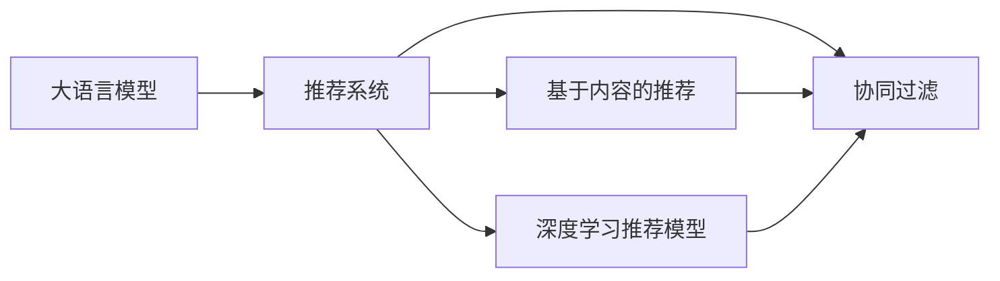

                 

## 1. 背景介绍

在快速变化和信息爆炸的时代，推荐系统已经成为各行各业数字营销的核心工具。从电子商务到社交媒体，从视频平台到新闻网站，推荐系统都在试图通过个性化推荐内容，提升用户满意度和留存率。然而，尽管当前推荐系统已经广泛应用，但仍然存在诸多挑战，如数据稀疏、模型复杂度高等。

大语言模型作为近年来深度学习领域的突破性进展，通过在大规模语料上进行自监督预训练，获取了丰富的语言知识和世界常识。这些模型的涌现，为推荐系统带来了新的解决方案。本文将重点探讨大模型在推荐系统中的应用，介绍基于大模型的推荐算法原理，并通过实际案例展现其在商业领域的潜力。

## 2. 核心概念与联系

为了更好地理解大模型在推荐系统中的应用，本节将介绍几个密切相关的核心概念，并通过 Mermaid 流程图展示它们之间的联系。

- **大语言模型（Large Language Model, LLM）**：指通过在大规模无标签语料上进行自监督预训练的深度学习模型，如 GPT-3、BERT 等。大语言模型具备强大的语言理解和生成能力。

- **推荐系统（Recommendation System）**：根据用户的历史行为、兴趣和上下文信息，预测并推荐可能感兴趣的内容的系统，如商品、视频、新闻等。

- **协同过滤（Collaborative Filtering）**：一种常见的推荐算法，通过分析用户与物品的互动行为，预测用户对未交互物品的评分或兴趣。

- **基于内容的推荐（Content-Based Recommendation）**：利用物品的属性信息，如标签、类别等，来推荐与用户历史偏好相似的物品。

- **深度学习推荐模型（Deep Learning Recommendation Model）**：使用深度神经网络模型，直接学习用户与物品之间的复杂非线性关系，如矩阵分解、深度神经网络等。

这些核心概念之间的联系可以通过以下 Mermaid 流程图来展示：



这个流程图展示了大语言模型与推荐系统的关联：大语言模型提供底层表示学习，协同过滤、基于内容的推荐和深度学习推荐模型则基于这些表示进行推荐预测。

## 3. 核心算法原理 & 具体操作步骤

### 3.1 算法原理概述

基于大语言模型的推荐系统，其核心思想是通过大模型提取用户和物品的语义表示，然后根据这些语义表示进行推荐预测。具体来说，算法分为以下几步：

1. **语义表示提取**：使用大模型对用户的历史行为、兴趣和物品的属性进行编码，得到用户的语义表示 $U$ 和物品的语义表示 $I$。
2. **相似度计算**：计算用户 $U$ 和物品 $I$ 之间的相似度或距离，可以使用余弦相似度、欧式距离等方法。
3. **排序与推荐**：根据相似度对物品进行排序，并将相似度最高的物品推荐给用户。

### 3.2 算法步骤详解

以下详细介绍基于大模型的推荐系统算法步骤：

1. **数据准备**：收集用户行为数据，如浏览记录、购买记录等，并提取物品的属性信息，如标签、类别等。

2. **语义表示提取**：使用大模型对用户数据和物品属性进行编码，得到用户的语义表示 $U$ 和物品的语义表示 $I$。可以采用预训练语言模型如 BERT、GPT-3 等进行编码。

3. **相似度计算**：根据用户的语义表示 $U$ 和物品的语义表示 $I$，计算两者之间的相似度。常见的相似度计算方法包括余弦相似度、欧式距离等。

4. **排序与推荐**：根据相似度对物品进行排序，选择相似度最高的物品推荐给用户。可以设定阈值 $k$，将相似度高于 $k$ 的物品推荐给用户。

5. **模型训练与调优**：使用部分标注数据对模型进行训练和调优，如通过监督学习的方式优化相似度计算方法。

### 3.3 算法优缺点

基于大模型的推荐系统具有以下优点：

1. **语义表示能力**：大语言模型可以捕捉用户和物品的复杂语义关系，提升推荐结果的准确性和多样性。
2. **灵活性**：大模型可以适应不同领域的推荐任务，如商品推荐、视频推荐等。
3. **可解释性**：大模型可以提供推荐理由，解释为什么推荐某个物品给用户。

然而，该算法也存在以下缺点：

1. **计算成本高**：大模型的预训练和推理过程需要大量的计算资源，成本较高。
2. **数据需求大**：需要大规模高质量的用户行为和物品属性数据，数据收集和标注成本较高。
3. **过拟合风险**：在标注数据不足的情况下，模型容易过拟合，泛化性能不足。

### 3.4 算法应用领域

基于大模型的推荐系统已经在多个领域得到了广泛应用，例如：

1. **电子商务**：电商平台的商品推荐、个性化广告等，提升用户购物体验。
2. **视频平台**：视频网站的推荐系统，根据用户的观看历史推荐感兴趣的视频内容。
3. **社交媒体**：社交媒体平台的个性化内容推荐，增强用户粘性和活跃度。
4. **新闻媒体**：新闻网站的新闻推荐，推荐用户可能感兴趣的文章。
5. **音乐与影视**：音乐和影视平台的个性化推荐，提升用户体验。

## 4. 数学模型和公式 & 详细讲解 & 举例说明

### 4.1 数学模型构建

基于大模型的推荐系统，可以使用向量表示方法对用户和物品进行建模。设用户 $u$ 的语义表示为 $\vec{u} \in \mathbb{R}^d$，物品 $i$ 的语义表示为 $\vec{i} \in \mathbb{R}^d$，其中 $d$ 为特征维度。

相似度计算可以使用余弦相似度公式：

$$
\text{similarity}(u,i) = \frac{\vec{u} \cdot \vec{i}}{\|\vec{u}\| \cdot \|\vec{i}\|}
$$

其中 $\vec{u} \cdot \vec{i}$ 表示向量点积，$\|\vec{u}\|$ 和 $\|\vec{i}\|$ 分别表示向量的模长。

### 4.2 公式推导过程

根据余弦相似度公式，相似度计算过程如下：

1. **语义表示提取**：使用大模型对用户行为和物品属性进行编码，得到 $\vec{u} = f_{\text{user}}(u)$ 和 $\vec{i} = f_{\text{item}}(i)$。
2. **相似度计算**：计算 $\text{similarity}(u,i) = \frac{\vec{u} \cdot \vec{i}}{\|\vec{u}\| \cdot \|\vec{i}\|}$。
3. **排序与推荐**：根据相似度对物品进行排序，选择相似度最高的 $k$ 个物品推荐给用户。

### 4.3 案例分析与讲解

假设我们要对用户 $u$ 推荐商品 $i$，首先通过大模型得到用户 $u$ 的语义表示 $\vec{u}$ 和商品 $i$ 的语义表示 $\vec{i}$。然后计算两者的余弦相似度，得到相似度得分：

$$
\text{similarity}(u,i) = \frac{\vec{u} \cdot \vec{i}}{\|\vec{u}\| \cdot \|\vec{i}\|}
$$

最后，根据相似度得分对商品进行排序，选择得分最高的 $k$ 个商品推荐给用户。

## 5. 项目实践：代码实例和详细解释说明

### 5.1 开发环境搭建

基于大模型的推荐系统，需要先搭建好开发环境。以下是使用 Python 和 PyTorch 搭建环境的步骤：

1. **安装 PyTorch**：
   ```
   pip install torch torchvision torchaudio
   ```

2. **安装 Transformers 库**：
   ```
   pip install transformers
   ```

3. **安装 scikit-learn**：
   ```
   pip install scikit-learn
   ```

### 5.2 源代码详细实现

以下是一个简单的 Python 代码实现，用于基于大模型进行商品推荐：

```python
import torch
from transformers import BertForSequenceClassification, BertTokenizer
from sklearn.metrics import precision_score, recall_score, f1_score

# 加载预训练模型和分词器
model = BertForSequenceClassification.from_pretrained('bert-base-uncased')
tokenizer = BertTokenizer.from_pretrained('bert-base-uncased')

# 定义训练和测试数据
train_data = [...]
test_data = [...]

# 编码训练数据
def encode_text(text):
    return tokenizer.encode(text, add_special_tokens=True, max_length=512, return_tensors='pt')

# 训练模型
device = 'cuda' if torch.cuda.is_available() else 'cpu'
model.to(device)
optimizer = torch.optim.Adam(model.parameters(), lr=1e-5)

for epoch in range(10):
    total_loss = 0
    for batch in train_data:
        input_ids = encode_text(batch['text'])
        input_ids = input_ids.to(device)
        labels = batch['label'].to(device)
        optimizer.zero_grad()
        outputs = model(input_ids)
        loss = outputs.loss
        total_loss += loss.item()
        loss.backward()
        optimizer.step()
    print(f'Epoch {epoch+1}, loss: {total_loss/len(train_data)}')

# 测试模型
model.eval()
total_recall = 0
total_precision = 0
total_f1 = 0
for batch in test_data:
    input_ids = encode_text(batch['text'])
    input_ids = input_ids.to(device)
    labels = batch['label'].to(device)
    outputs = model(input_ids)
    predictions = torch.argmax(outputs.logits, dim=1)
    recall = recall_score(labels, predictions, average='macro')
    precision = precision_score(labels, predictions, average='macro')
    f1 = f1_score(labels, predictions, average='macro')
    total_recall += recall
    total_precision += precision
    total_f1 += f1
print(f'Test Recall: {total_recall/len(test_data)}, Test Precision: {total_precision/len(test_data)}, Test F1: {total_f1/len(test_data)}')
```

### 5.3 代码解读与分析

在上述代码中，我们使用 PyTorch 和 Transformers 库实现了一个基于 BERT 的推荐系统。具体步骤如下：

1. **模型加载**：加载预训练的 BERT 模型和分词器。
2. **数据准备**：定义训练数据和测试数据，其中包含用户行为和物品属性信息。
3. **数据编码**：使用 Transformers 库提供的 `BertTokenizer` 对文本进行编码，得到模型所需的输入张量。
4. **模型训练**：定义优化器，并在训练数据上进行模型训练，使用 `Adam` 优化器更新模型参数。
5. **模型测试**：在测试数据上进行模型评估，使用 scikit-learn 库的 `precision_score`、`recall_score`、`f1_score` 计算指标。

## 6. 实际应用场景

### 6.1 电子商务推荐

大模型在电子商务中的应用极为广泛。电商平台通过收集用户的浏览、点击、购买记录，提取用户行为特征和物品属性信息，使用大模型进行编码，然后计算相似度并进行推荐。例如，淘宝、亚马逊等大型电商平台已经在大模型推荐系统上取得了显著的商业效果。

### 6.2 视频平台推荐

视频平台根据用户的观看历史、评分和点击记录，提取用户兴趣和物品属性信息，使用大模型进行编码，然后计算相似度并进行推荐。YouTube、Netflix 等平台都采用了基于大模型的推荐算法，提升用户观看体验和留存率。

### 6.3 社交媒体推荐

社交媒体平台通过分析用户的互动行为、兴趣标签和社交关系，提取用户和物品的特征，使用大模型进行编码，然后计算相似度并进行推荐。Facebook、Instagram 等平台广泛使用大模型推荐算法，提升用户粘性和互动率。

## 7. 工具和资源推荐

### 7.1 学习资源推荐

为了系统掌握大模型在推荐系统中的应用，以下是一些优质的学习资源：

1. **《深度学习与推荐系统》课程**：斯坦福大学开设的深度学习推荐系统课程，包含大模型推荐算法和案例分析。
2. **Transformers 官方文档**：详细介绍了如何使用 Transformers 库进行大模型推荐系统的实现。
3. **《推荐系统实战》书籍**：介绍了推荐系统的理论基础和实际应用，包括大模型推荐算法。
4. **Kaggle 竞赛**：参加 Kaggle 竞赛，如推荐系统竞赛，积累实战经验。

### 7.2 开发工具推荐

开发大模型推荐系统需要一些实用的工具，以下是一些推荐工具：

1. **PyTorch**：基于 Python 的深度学习框架，支持分布式训练和动态计算图。
2. **Transformers**：Hugging Face 提供的自然语言处理工具库，包含多种预训练模型。
3. **TensorFlow**：Google 提供的深度学习框架，支持分布式训练和静态计算图。
4. **Jupyter Notebook**：支持交互式编程和数据可视化，便于调试和展示结果。

### 7.3 相关论文推荐

以下是几篇影响较大的大模型推荐系统论文：

1. **"BERT: Pre-training of Deep Bidirectional Transformers for Language Understanding"**：BERT 模型的提出，通过预训练大模型进行推荐。
2. **"Spider: A Fast and Lightweight System for Large-Scale Sparse User-Item Interaction Data"**：Spider 系统的介绍，使用 BERT 进行推荐。
3. **"End-to-End Learning of Deep Nonlinear Multi-Scale Multi-Task Models for Recommender Systems"**：提出多任务多尺度推荐模型，使用大模型进行推荐。

## 8. 总结：未来发展趋势与挑战

### 8.1 总结

本文系统介绍了大语言模型在推荐系统中的应用，通过算法原理和代码实现，展示了其强大的推荐能力。基于大模型的推荐系统已经在多个行业取得了显著的商业效果，提升了用户满意度和留存率。

### 8.2 未来发展趋势

未来大语言模型推荐系统将在以下几个方面进一步发展：

1. **个性化推荐**：大模型能够捕捉复杂的用户兴趣和行为模式，提升推荐系统的个性化能力。
2. **实时推荐**：基于大模型的推荐系统可以实现实时推荐，及时响应用户需求。
3. **跨领域推荐**：大模型具备跨领域迁移能力，能够适应不同领域的推荐任务。
4. **多模态推荐**：结合视觉、语音等多模态数据，提升推荐系统的多模态融合能力。
5. **可解释性推荐**：提升推荐系统的可解释性，让用户了解推荐理由，增强信任感。

### 8.3 面临的挑战

尽管大模型在推荐系统中的应用前景广阔，但仍面临以下挑战：

1. **计算资源消耗大**：大模型的训练和推理需要大量的计算资源，成本较高。
2. **数据隐私问题**：用户数据隐私保护是一个重要问题，需要设计合理的隐私保护机制。
3. **数据质量要求高**：推荐系统需要高质量的数据进行训练，数据收集和标注成本较高。
4. **系统复杂度**：基于大模型的推荐系统较复杂，需要维护和优化。

### 8.4 研究展望

未来研究需要在以下几个方面取得突破：

1. **高效大模型压缩**：研究高效的大模型压缩方法，减少计算资源消耗。
2. **隐私保护技术**：开发隐私保护算法，保障用户数据隐私。
3. **自动化数据标注**：研究自动化数据标注技术，减少数据收集和标注成本。
4. **多模态推荐系统**：结合多种模态数据，提升推荐系统的融合能力。

总之，大语言模型推荐系统具有广阔的应用前景，但也面临诸多挑战。通过不断优化算法和改进工具，大模型推荐系统将进一步提升推荐效果，助力各行各业实现数字化转型。

## 9. 附录：常见问题与解答

### Q1：如何设计推荐系统中的相似度计算方法？

A: 相似度计算是推荐系统的核心，常见的相似度计算方法包括余弦相似度、欧式距离、pearson 相关系数等。具体选择哪种相似度计算方法，取决于推荐任务的特点和数据分布。

### Q2：大模型在推荐系统中的优缺点是什么？

A: 大模型在推荐系统中的优点是能够捕捉复杂的语义关系，提升推荐效果。缺点是需要大量的计算资源和高质量的数据，成本较高。

### Q3：如何在推荐系统中使用大模型进行多模态融合？

A: 在推荐系统中，可以使用大模型对不同模态的数据进行编码，然后将编码结果进行融合。例如，可以使用 Transformers 库中的多模态模型进行融合。

### Q4：如何保护用户数据隐私？

A: 在推荐系统中，可以采用差分隐私技术、联邦学习等方法保护用户数据隐私，确保数据安全和用户隐私。

通过本文的系统介绍，读者应该能够深入理解大语言模型在推荐系统中的应用，掌握基于大模型的推荐算法原理和实现方法。大语言模型推荐系统具有广阔的应用前景，值得在实际项目中进行深入研究和应用。

