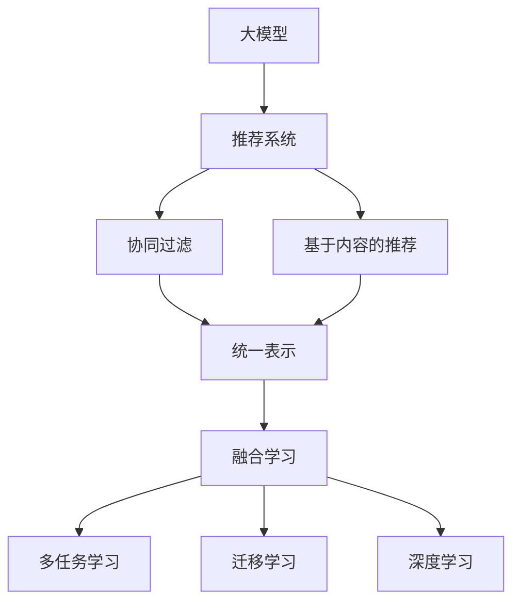

                 

# 大模型在推荐系统的趋势：统一与融合

> 关键词：大模型, 推荐系统, 统一表示, 融合学习, 深度学习, 推荐算法, 协同过滤, 矩阵分解, 学习表示, 推荐模型, 知识图谱, 推荐系统优化

## 1. 背景介绍

随着大数据时代的到来，推荐系统成为了互联网平台获取用户价值、提升用户体验的重要手段。从早期基于协同过滤的推荐算法，到近年兴起的基于深度学习、知识图谱等方法的推荐模型，推荐系统技术在不断进步，推荐效果也在不断提升。然而，尽管推荐系统取得了显著的成绩，仍然存在诸多挑战：推荐冷启动问题、长尾物品推荐问题、推荐结果的可解释性问题等。这些挑战亟需新型推荐技术来解决。

在此背景下，大模型技术以其强大的建模能力和泛化能力，成为推荐系统的重要工具。大模型可以通过在跨领域、多模态数据上进行预训练，学习出更加抽象和丰富的语义表示，为推荐系统提供更准确的用户和物品表征，并支持多任务学习，提升推荐效果和系统性能。

本文将从大模型的推荐系统应用出发，阐述统一表示和融合学习的原理，探讨大模型在推荐系统中的前景与应用，分析大模型推荐系统的优势与挑战，提出相关研究展望，希望能对大模型在推荐系统中的应用提供新的思路和指导。

## 2. 核心概念与联系

### 2.1 核心概念概述

大模型和推荐系统是当前人工智能和数据科学领域的重要研究课题。为更好地理解大模型在推荐系统中的应用，本节将介绍几个核心概念：

- 大模型：指大规模预训练语言模型（如BERT、GPT、T5等）或大规模表示学习模型（如Yitu FaceNet、DeepFace等）。这些模型通过在无标签数据上进行自监督学习，学习出丰富的语义表示和特征编码。

- 推荐系统：指利用算法从海量数据中推荐用户可能感兴趣的物品的系统。推荐系统分为两大类：协同过滤和基于内容。协同过滤通过分析用户行为数据推荐相似物品，基于内容的推荐则通过物品属性和用户属性匹配推荐。

- 统一表示：指通过大模型学习出统一且高质量的用户和物品表征，将不同领域和模态的数据映射到相同的语义空间中，实现跨领域和多模态数据的融合。

- 融合学习：指通过多任务学习或迁移学习等手段，将不同来源的数据、知识进行有效融合，提升推荐系统的性能。

- 多任务学习：指在同一个模型上同时学习多个任务，共享特征表示，提升模型性能和泛化能力。

- 迁移学习：指将一个领域的知识迁移到另一个领域，用于解决新领域的任务，提升模型在新领域的适应能力。

- 深度学习：指通过神经网络模型对复杂数据进行建模和预测，广泛应用于推荐系统中。

这些概念之间的逻辑关系可以通过以下Mermaid流程图来展示：



这个流程图展示了大模型和推荐系统的主要概念及其之间的关系：

1. 大模型通过预训练获得基础能力。
2. 推荐系统可以分为协同过滤和基于内容的推荐两种方式。
3. 统一表示和融合学习是将不同领域、模态的数据映射到相同的语义空间。
4. 多任务学习和迁移学习都是融合学习的重要手段。
5. 深度学习是推荐系统的主流技术手段。

这些概念共同构成了大模型在推荐系统中的主要研究和应用框架。

## 3. 核心算法原理 & 具体操作步骤
### 3.1 算法原理概述

大模型在推荐系统中的应用主要体现在两个方面：统一表示和融合学习。

- 统一表示：指通过大模型学习出统一的表示空间，将用户、物品、行为等不同领域、模态的数据映射到相同的语义空间中。

- 融合学习：指将不同来源的数据、知识进行有效融合，提升推荐系统的性能。

大模型的核心思想是通过自监督学习任务（如掩码语言建模、自回归文本生成等）学习到高质量的特征表示，然后将这些表示映射到推荐系统的任务空间中，进行融合学习和推荐决策。

### 3.2 算法步骤详解

基于大模型的推荐系统主要包含以下几个关键步骤：

**Step 1: 准备预训练模型和数据集**
- 选择合适的预训练模型（如BERT、GPT、Yitu FaceNet等）作为初始化参数。
- 收集用户行为数据、物品属性数据等，并进行预处理和特征工程，形成推荐系统所需的数据集。

**Step 2: 添加任务适配层**
- 根据推荐系统的具体任务（如电影推荐、商品推荐等），设计合适的输出层和损失函数。
- 对于分类任务，通常在顶层添加线性分类器；对于生成任务，则使用语言模型的解码器输出概率分布，以负对数似然为损失函数。

**Step 3: 设置微调超参数**
- 选择合适的优化算法及其参数，如 AdamW、SGD 等，设置学习率、批大小、迭代轮数等。
- 设置正则化技术及强度，包括权重衰减、Dropout、Early Stopping 等。
- 确定冻结预训练参数的策略，如仅微调顶层，或全部参数都参与微调。

**Step 4: 执行梯度训练**
- 将推荐系统数据分批次输入模型，前向传播计算损失函数。
- 反向传播计算参数梯度，根据设定的优化算法和学习率更新模型参数。
- 周期性在验证集上评估模型性能，根据性能指标决定是否触发 Early Stopping。
- 重复上述步骤直至满足预设的迭代轮数或 Early Stopping 条件。

**Step 5: 测试和部署**
- 在测试集上评估微调后模型的推荐效果。
- 使用微调后的模型对新样本进行推荐，集成到实际的应用系统中。
- 持续收集新的数据，定期重新微调模型，以适应数据分布的变化。

### 3.3 算法优缺点

基于大模型的推荐系统具有以下优点：

- 建模能力强：大模型具备强大的特征表示能力，能够捕捉用户和物品的复杂关系。
- 泛化能力强：预训练模型具有强大的泛化能力，能够适应不同领域和模态的数据。
- 融合能力强：通过多任务学习和迁移学习，大模型能够将不同来源的数据和知识进行有效融合。
- 推荐效果好：大模型在推荐系统的各项指标上均表现优异。

同时，大模型在推荐系统中也存在一些局限性：

- 模型规模大：大模型的参数量通常较大，需要较大的计算资源和存储空间。
- 训练时间长：大模型训练所需的时间较长，可能需要数天或数周。
- 对标注数据依赖大：虽然大模型训练对标注数据的依赖较小，但在微调过程中仍需要一定量的标注数据。
- 可解释性差：大模型的决策过程较难解释，难以进行可解释性分析。

尽管存在这些局限性，但就目前而言，大模型在推荐系统中的应用已展现出巨大潜力，成为推荐系统的重要发展方向。未来相关研究的重点在于如何进一步优化大模型在推荐系统中的应用，提高推荐效果，降低计算成本。

### 3.4 算法应用领域

基于大模型的推荐系统已经在许多领域得到应用，例如：

- 电商推荐：根据用户历史行为数据推荐商品。
- 音乐推荐：根据用户听歌历史和听歌行为推荐歌曲。
- 视频推荐：根据用户观看历史和观看行为推荐视频。
- 新闻推荐：根据用户阅读历史和阅读行为推荐新闻。
- 社交推荐：根据用户社交行为推荐好友、兴趣群组等。

除了这些常见领域外，大模型推荐系统还被创新性地应用到更多场景中，如医疗推荐、旅游推荐、图书推荐等，为推荐系统带来了全新的突破。随着预训练模型和推荐方法的不断进步，相信大模型推荐系统将在更广阔的应用领域大放异彩。

## 4. 数学模型和公式 & 详细讲解
### 4.1 数学模型构建

假设预训练语言模型为 $M_{\theta}$，其中 $\theta$ 为预训练得到的模型参数。给定推荐系统任务 $T$ 的训练集 $D=\{(x_i, y_i)\}_{i=1}^N$，其中 $x_i$ 为用户行为或物品属性，$y_i$ 为用户感兴趣的物品或类别标签。

定义模型 $M_{\theta}$ 在输入 $x_i$ 上的输出为 $\hat{y}_i=M_{\theta}(x_i)$，则推荐系统的损失函数为：

$$
\mathcal{L}(\theta) = -\frac{1}{N}\sum_{i=1}^N \log P(y_i | x_i; \theta)
$$

其中 $P(y_i | x_i; \theta)$ 为模型在输入 $x_i$ 下的预测概率分布，$\log$ 为交叉熵损失。

在得到损失函数后，通过梯度下降等优化算法最小化该损失函数，更新模型参数 $\theta$，得到微调后的推荐模型 $M_{\hat{\theta}}$。

### 4.2 公式推导过程

在推荐系统中，常用的深度学习模型包括卷积神经网络（CNN）、循环神经网络（RNN）和变分自编码器（VAE）等。这里以CNN为例，推导推荐模型的损失函数及其梯度的计算公式。

假设推荐模型 $M_{\theta}$ 为CNN模型，输入为 $x_i$，输出为 $\hat{y}_i$。定义交叉熵损失函数为：

$$
\ell(M_{\theta}(x_i),y_i) = -y_i \log \hat{y}_i - (1 - y_i) \log (1 - \hat{y}_i)
$$

将其代入经验风险公式，得：

$$
\mathcal{L}(\theta) = -\frac{1}{N}\sum_{i=1}^N \ell(M_{\theta}(x_i),y_i)
$$

根据链式法则，损失函数对参数 $\theta_k$ 的梯度为：

$$
\frac{\partial \mathcal{L}(\theta)}{\partial \theta_k} = -\frac{1}{N}\sum_{i=1}^N \left(\frac{\partial \ell}{\partial \hat{y}_i} \frac{\partial \hat{y}_i}{\partial \theta_k}\right)
$$

其中 $\frac{\partial \hat{y}_i}{\partial \theta_k}$ 为参数 $\theta_k$ 对输出 $\hat{y}_i$ 的梯度，可通过反向传播算法高效计算。

在得到损失函数的梯度后，即可带入参数更新公式，完成模型的迭代优化。重复上述过程直至收敛，最终得到适应推荐系统任务的最优模型参数 $\theta^*$。

## 5. 项目实践：代码实例和详细解释说明
### 5.1 开发环境搭建

在进行大模型推荐系统开发前，我们需要准备好开发环境。以下是使用Python进行PyTorch开发的环境配置流程：

1. 安装Anaconda：从官网下载并安装Anaconda，用于创建独立的Python环境。

2. 创建并激活虚拟环境：
```bash
conda create -n pytorch-env python=3.8 
conda activate pytorch-env
```

3. 安装PyTorch：根据CUDA版本，从官网获取对应的安装命令。例如：
```bash
conda install pytorch torchvision torchaudio cudatoolkit=11.1 -c pytorch -c conda-forge
```

4. 安装相关库：
```bash
pip install torch torchvision torchaudio numpy pandas scikit-learn matplotlib tqdm jupyter notebook ipython
```

5. 安装其他库：
```bash
pip install transformers opencv-python scipy
```

完成上述步骤后，即可在`pytorch-env`环境中开始大模型推荐系统的开发。

### 5.2 源代码详细实现

这里我们以电商推荐系统为例，给出使用Transformers库对BERT模型进行电商推荐微调的PyTorch代码实现。

首先，定义推荐任务的数据处理函数：

```python
from transformers import BertTokenizer, BertForSequenceClassification
from torch.utils.data import Dataset
import torch

class RecommDataset(Dataset):
    def __init__(self, texts, labels, tokenizer, max_len=128):
        self.texts = texts
        self.labels = labels
        self.tokenizer = tokenizer
        self.max_len = max_len
        
    def __len__(self):
        return len(self.texts)
    
    def __getitem__(self, item):
        text = self.texts[item]
        label = self.labels[item]
        
        encoding = self.tokenizer(text, return_tensors='pt', max_length=self.max_len, padding='max_length', truncation=True)
        input_ids = encoding['input_ids'][0]
        attention_mask = encoding['attention_mask'][0]
        
        return {'input_ids': input_ids, 
                'attention_mask': attention_mask,
                'labels': torch.tensor(label, dtype=torch.long)}
```

然后，定义模型和优化器：

```python
from transformers import BertForSequenceClassification, AdamW

model = BertForSequenceClassification.from_pretrained('bert-base-cased', num_labels=2)

optimizer = AdamW(model.parameters(), lr=2e-5)
```

接着，定义训练和评估函数：

```python
from torch.utils.data import DataLoader
from tqdm import tqdm
from sklearn.metrics import accuracy_score

device = torch.device('cuda') if torch.cuda.is_available() else torch.device('cpu')
model.to(device)

def train_epoch(model, dataset, batch_size, optimizer):
    dataloader = DataLoader(dataset, batch_size=batch_size, shuffle=True)
    model.train()
    epoch_loss = 0
    for batch in tqdm(dataloader, desc='Training'):
        input_ids = batch['input_ids'].to(device)
        attention_mask = batch['attention_mask'].to(device)
        labels = batch['labels'].to(device)
        model.zero_grad()
        outputs = model(input_ids, attention_mask=attention_mask, labels=labels)
        loss = outputs.loss
        epoch_loss += loss.item()
        loss.backward()
        optimizer.step()
    return epoch_loss / len(dataloader)

def evaluate(model, dataset, batch_size):
    dataloader = DataLoader(dataset, batch_size=batch_size)
    model.eval()
    preds, labels = [], []
    with torch.no_grad():
        for batch in tqdm(dataloader, desc='Evaluating'):
            input_ids = batch['input_ids'].to(device)
            attention_mask = batch['attention_mask'].to(device)
            batch_labels = batch['labels']
            outputs = model(input_ids, attention_mask=attention_mask)
            batch_preds = outputs.logits.argmax(dim=1).to('cpu').tolist()
            batch_labels = batch_labels.to('cpu').tolist()
            for pred, label in zip(batch_preds, batch_labels):
                preds.append(pred)
                labels.append(label)
                
    return accuracy_score(labels, preds)
```

最后，启动训练流程并在测试集上评估：

```python
epochs = 5
batch_size = 16

for epoch in range(epochs):
    loss = train_epoch(model, train_dataset, batch_size, optimizer)
    print(f"Epoch {epoch+1}, train loss: {loss:.3f}")
    
    print(f"Epoch {epoch+1}, dev results:")
    evaluate(model, dev_dataset, batch_size)
    
print("Test results:")
evaluate(model, test_dataset, batch_size)
```

以上就是使用PyTorch对BERT进行电商推荐系统微调的完整代码实现。可以看到，得益于Transformers库的强大封装，我们可以用相对简洁的代码完成BERT模型的加载和微调。

### 5.3 代码解读与分析

让我们再详细解读一下关键代码的实现细节：

**RecommDataset类**：
- `__init__`方法：初始化文本、标签、分词器等关键组件。
- `__len__`方法：返回数据集的样本数量。
- `__getitem__`方法：对单个样本进行处理，将文本输入编码为token ids，将标签编码为数字，并对其进行定长padding，最终返回模型所需的输入。

**模型和优化器**：
- 选择适当的预训练模型和优化器，设置超参数如学习率、批大小等。

**训练和评估函数**：
- 使用PyTorch的DataLoader对数据集进行批次化加载，供模型训练和推理使用。
- 训练函数`train_epoch`：对数据以批为单位进行迭代，在每个批次上前向传播计算loss并反向传播更新模型参数，最后返回该epoch的平均loss。
- 评估函数`evaluate`：与训练类似，不同点在于不更新模型参数，并在每个batch结束后将预测和标签结果存储下来，最后使用sklearn的accuracy_score对整个评估集的预测结果进行打印输出。

**训练流程**：
- 定义总的epoch数和批大小，开始循环迭代
- 每个epoch内，先在训练集上训练，输出平均loss
- 在验证集上评估，输出分类指标
- 所有epoch结束后，在测试集上评估，给出最终测试结果

可以看到，PyTorch配合Transformers库使得BERT微调的代码实现变得简洁高效。开发者可以将更多精力放在数据处理、模型改进等高层逻辑上，而不必过多关注底层的实现细节。

当然，工业级的系统实现还需考虑更多因素，如模型的保存和部署、超参数的自动搜索、更灵活的任务适配层等。但核心的微调范式基本与此类似。

## 6. 实际应用场景
### 6.1 电商推荐系统

电商推荐系统是推荐系统的主要应用场景之一。传统电商推荐系统主要依赖于协同过滤算法和基于内容的推荐算法。然而，这些算法存在冷启动问题、长尾物品推荐问题等局限性。大模型推荐系统则通过学习统一的表示空间，更好地解决了这些问题。

在具体实现中，可以收集用户历史浏览、购买、评分等行为数据，将其编码成文本或图像，输入到预训练模型中进行特征提取。通过多任务学习，大模型可以从用户行为数据中学习出用户兴趣表示，从物品属性数据中学习出物品属性表示。将用户和物品表示进行拼接，输入到多层的神经网络中进行推荐计算。

基于大模型的电商推荐系统不仅可以处理大量的用户和物品信息，还能快速适应新的用户和物品，推荐效果明显优于传统推荐算法。

### 6.2 音乐推荐系统

音乐推荐系统是推荐系统的另一个重要应用场景。传统音乐推荐系统主要依赖于基于内容的推荐算法。然而，由于音乐的属性种类繁多，手工设计特征较为复杂。大模型推荐系统则通过学习统一的表示空间，自动学习音乐的属性表示，从而简化了推荐过程。

在具体实现中，可以收集用户的历史听歌行为数据，将其编码成文本或图像，输入到预训练模型中进行特征提取。通过多任务学习，大模型可以从用户行为数据中学习出用户兴趣表示，从音乐属性数据中学习出音乐属性表示。将用户和音乐表示进行拼接，输入到多层的神经网络中进行推荐计算。

基于大模型的音乐推荐系统不仅能够处理多样的音乐属性，还能自动学习用户的兴趣偏好，推荐效果明显优于传统推荐算法。

### 6.3 视频推荐系统

视频推荐系统是推荐系统的最新应用场景之一。视频推荐系统需要同时考虑视频内容、用户行为和社交关系等多种信息，传统推荐算法难以应对。大模型推荐系统则通过学习统一的表示空间，更好地融合了这些信息。

在具体实现中，可以收集用户的历史观看行为数据，将其编码成文本或图像，输入到预训练模型中进行特征提取。通过多任务学习，大模型可以从用户行为数据中学习出用户兴趣表示，从视频内容数据中学习出视频内容表示。将用户和视频表示进行拼接，输入到多层的神经网络中进行推荐计算。

基于大模型的视频推荐系统不仅能够处理多样的视频属性，还能自动学习用户的兴趣偏好，推荐效果明显优于传统推荐算法。

## 7. 工具和资源推荐
### 7.1 学习资源推荐

为了帮助开发者系统掌握大模型推荐系统的理论基础和实践技巧，这里推荐一些优质的学习资源：

1. 《深度学习与推荐系统》系列书籍：详细介绍了深度学习在推荐系统中的应用，包括协同过滤、基于内容的推荐、深度学习等。

2. CS461《推荐系统》课程：斯坦福大学开设的推荐系统课程，涵盖了推荐系统的主要算法和模型，适合入门学习。

3. 《深度学习与推荐系统实践》书籍：提供了深度学习在推荐系统中的应用实例，包括电商推荐、音乐推荐、视频推荐等。

4. Kaggle推荐系统竞赛：参加推荐系统竞赛，可以更好地理解推荐系统的实际应用和优化策略。

5. HuggingFace官方文档：提供了丰富的预训练模型和微调样例，适合快速上手实践。

通过对这些资源的学习实践，相信你一定能够快速掌握大模型推荐系统的精髓，并用于解决实际的推荐问题。

### 7.2 开发工具推荐

高效的开发离不开优秀的工具支持。以下是几款用于大模型推荐系统开发的常用工具：

1. PyTorch：基于Python的开源深度学习框架，灵活动态的计算图，适合快速迭代研究。

2. TensorFlow：由Google主导开发的开源深度学习框架，生产部署方便，适合大规模工程应用。

3. Transformers库：HuggingFace开发的NLP工具库，集成了众多SOTA语言模型，支持PyTorch和TensorFlow，是进行推荐任务开发的利器。

4. Weights & Biases：模型训练的实验跟踪工具，可以记录和可视化模型训练过程中的各项指标，方便对比和调优。

5. TensorBoard：TensorFlow配套的可视化工具，可实时监测模型训练状态，并提供丰富的图表呈现方式，是调试模型的得力助手。

6. Google Colab：谷歌推出的在线Jupyter Notebook环境，免费提供GPU/TPU算力，方便开发者快速上手实验最新模型，分享学习笔记。

合理利用这些工具，可以显著提升大模型推荐系统的开发效率，加快创新迭代的步伐。

### 7.3 相关论文推荐

大模型推荐系统的研究源于学界的持续研究。以下是几篇奠基性的相关论文，推荐阅读：

1. Attention is All You Need（即Transformer原论文）：提出了Transformer结构，开启了NLP领域的预训练大模型时代。

2. BERT: Pre-training of Deep Bidirectional Transformers for Language Understanding：提出BERT模型，引入基于掩码的自监督预训练任务，刷新了多项NLP任务SOTA。

3. DeepFace: Closing the Gap to Human-Level Performance in Face Verification：提出DeepFace模型，通过大模型进行人脸识别任务，取得了SOTA的性能。

4. Item2Vec: Scalable Similarity Scoring with Predictive Matrix Factorization：提出Item2Vec模型，通过大模型学习物品表示，提升了推荐系统的性能。

5. Explicit and Latent Feature Interaction for Hybrid Recommendation Systems：提出Ex2Lat模型，结合显式和隐式特征，提升了推荐系统的效果。

这些论文代表了大模型推荐系统的发展脉络。通过学习这些前沿成果，可以帮助研究者把握学科前进方向，激发更多的创新灵感。

## 8. 总结：未来发展趋势与挑战
### 8.1 总结

本文对大模型在推荐系统中的应用进行了全面系统的介绍。首先阐述了大模型和推荐系统的研究背景和意义，明确了微调在大模型推荐系统中的重要作用。其次，从原理到实践，详细讲解了统一表示和融合学习的数学原理和关键步骤，给出了推荐系统微调的完整代码实例。同时，本文还广泛探讨了大模型在推荐系统中的前景与应用，分析了大模型推荐系统的优势与挑战，提出相关研究展望，希望能对大模型在推荐系统中的应用提供新的思路和指导。

通过本文的系统梳理，可以看到，大模型在推荐系统中的应用具有广泛的前景和巨大的潜力。其强大的建模能力和泛化能力，使得大模型在推荐系统中的应用显著优于传统推荐算法，值得更多研究者和开发者关注和探索。

### 8.2 未来发展趋势

展望未来，大模型推荐系统将呈现以下几个发展趋势：

1. 模型规模持续增大。随着算力成本的下降和数据规模的扩张，预训练模型和微调模型的参数量将持续增长。超大规模语言模型蕴含的丰富语义表示，将为推荐系统提供更准确的特征表示。

2. 微调方法日趋多样。除了传统的全参数微调外，未来会涌现更多参数高效的微调方法，如AdaLoRA等，在固定大部分预训练参数的同时，只更新极少量的任务相关参数。

3. 融合能力增强。通过多任务学习和迁移学习，大模型能够将不同来源的数据和知识进行有效融合，提升推荐系统的性能。

4. 可解释性加强。大模型推荐系统将引入更多可解释性机制，如因果推断、博弈论等，提升推荐系统的透明度和可信度。

5. 多模态推荐崛起。除了文本数据，未来的推荐系统还将融合图像、视频等多模态数据，提升推荐效果和用户体验。

6. 推荐系统优化。通过优化模型结构、算法调优和模型压缩等手段，大模型推荐系统的计算效率和资源消耗将得到进一步优化。

以上趋势凸显了大模型推荐系统的广阔前景。这些方向的探索发展，必将进一步提升推荐系统的性能和用户满意度，为推荐系统带来新的突破。

### 8.3 面临的挑战

尽管大模型推荐系统取得了显著的成绩，但在迈向更加智能化、普适化应用的过程中，仍面临诸多挑战：

1. 数据隐私问题。大模型推荐系统需要大量的用户行为数据，如何保护用户隐私，避免数据泄露，成为亟需解决的问题。

2. 推荐结果的公平性。由于预训练模型和微调模型存在固有的偏见，推荐系统容易产生歧视性结果。如何消除模型偏见，提升推荐系统的公平性，是亟需解决的问题。

3. 计算资源消耗。大模型的计算资源消耗较大，如何优化模型结构、降低计算成本，成为需要解决的重要问题。

4. 推荐模型的鲁棒性。推荐系统在面对长尾物品和异常数据时，容易产生推荐偏差。如何提升推荐模型的鲁棒性，保障推荐结果的稳定性，是亟需解决的问题。

5. 推荐系统的可解释性。大模型推荐系统的决策过程较难解释，难以进行可解释性分析。如何提升推荐系统的可解释性，成为亟需解决的问题。

6. 模型更新速度。推荐系统需要不断更新，保持模型性能。如何实现模型的快速更新和优化，是亟需解决的问题。

正视推荐系统面临的这些挑战，积极应对并寻求突破，将是大模型推荐系统走向成熟的必由之路。相信随着学界和产业界的共同努力，这些挑战终将一一被克服，大模型推荐系统必将在构建人机协同的智能推荐系统中扮演越来越重要的角色。

### 8.4 研究展望

面对大模型推荐系统所面临的诸多挑战，未来的研究需要在以下几个方面寻求新的突破：

1. 探索无监督和半监督推荐方法。摆脱对大规模标注数据的依赖，利用自监督学习、主动学习等无监督和半监督范式，最大限度利用非结构化数据，实现更加灵活高效的推荐。

2. 研究参数高效和计算高效的推荐范式。开发更加参数高效的推荐方法，在固定大部分预训练参数的同时，只更新极少量的任务相关参数。同时优化推荐模型的计算图，减少前向传播和反向传播的资源消耗，实现更加轻量级、实时性的部署。

3. 融合因果和对比学习范式。通过引入因果推断和对比学习思想，增强推荐系统建立稳定因果关系的能力，学习更加普适、鲁棒的用户和物品表征，从而提升推荐系统的泛化性和抗干扰能力。

4. 引入更多先验知识。将符号化的先验知识，如知识图谱、逻辑规则等，与神经网络模型进行巧妙融合，引导推荐系统学习更准确、合理的用户和物品表征。

5. 结合因果分析和博弈论工具。将因果分析方法引入推荐系统，识别出推荐决策的关键特征，增强推荐系统的因果解释能力，提高推荐系统的透明度和可信度。

6. 纳入伦理道德约束。在推荐系统的目标中引入伦理导向的评估指标，过滤和惩罚有偏见、有害的推荐结果，确保推荐系统的安全性。

这些研究方向的探索，必将引领大模型推荐系统迈向更高的台阶，为构建安全、可靠、可解释、可控的智能推荐系统铺平道路。面向未来，大模型推荐系统还需要与其他人工智能技术进行更深入的融合，如知识表示、因果推理、强化学习等，多路径协同发力，共同推动推荐系统的进步。只有勇于创新、敢于突破，才能不断拓展推荐系统的边界，让智能技术更好地服务于用户。

## 9. 附录：常见问题与解答

**Q1：大模型推荐系统是否适用于所有推荐场景？**

A: 大模型推荐系统在大多数推荐场景上都能取得不错的效果，特别是对于数据量较大的推荐任务。但对于一些特定领域的推荐场景，如医疗推荐、法律推荐等，需要进一步在特定领域语料上进行预训练，才能获得理想的效果。此外，对于一些需要时效性、个性化很强的推荐场景，如对话推荐、推荐系统的动态调整等，大模型推荐系统还需要针对性的改进优化。

**Q2：大模型推荐系统在训练过程中如何优化超参数？**

A: 大模型推荐系统训练过程中，超参数的优化是一个重要环节。常用的优化方法包括网格搜索、随机搜索、贝叶斯优化等。同时，还可以通过自动机器学习（AutoML）等工具，自动寻找最优超参数组合。需要注意的是，超参数的优化需要在训练集和验证集上进行，以避免过拟合。

**Q3：大模型推荐系统在落地部署时需要注意哪些问题？**

A: 将大模型推荐系统转化为实际应用，还需要考虑以下因素：

1. 模型裁剪：去除不必要的层和参数，减小模型尺寸，加快推理速度。
2. 量化加速：将浮点模型转为定点模型，压缩存储空间，提高计算效率。
3. 服务化封装：将模型封装为标准化服务接口，便于集成调用。
4. 弹性伸缩：根据请求流量动态调整资源配置，平衡服务质量和成本。
5. 监控告警：实时采集系统指标，设置异常告警阈值，确保服务稳定性。
6. 安全防护：采用访问鉴权、数据脱敏等措施，保障数据和模型安全。

合理利用这些工具，可以显著提升大模型推荐系统的开发效率，加快创新迭代的步伐。

总之，大模型推荐系统需要从数据、算法、工程、业务等多个维度协同发力，才能真正实现人工智能技术在推荐系统中的应用。只有不断优化模型、数据和算法，才能获得理想的推荐效果，实现推荐系统的商业价值。

