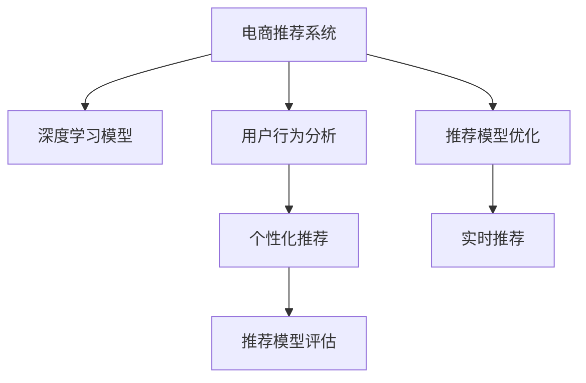

                 

# 大模型如何提升电商平台的用户体验一致性与个性化平衡

> 关键词：电商平台,用户个性化,用户体验一致性,大模型,推荐系统,电商推荐,深度学习,数据驱动,用户行为分析

## 1. 背景介绍

### 1.1 问题由来

在当今数字化时代，电商平台已成为人们日常生活购物的重要渠道。然而，在迅速扩充的商品种类和快速变化的市场环境中，电商平台面临着一个重大挑战：如何在保证用户体验一致性的同时，为用户提供高度个性化的购物体验。

传统的推荐系统主要依赖于手工规则和简单的统计模型，难以适应个性化需求复杂且动态变化的特点。而随着深度学习技术的兴起，大模型在电商平台的应用逐渐成为一种趋势。大模型，特别是基于预训练和微调的深度学习模型，因其强大的特征提取和模式识别能力，被广泛应用于推荐系统、个性化广告等领域，极大地提升了电商平台的业务水平和用户满意度。

### 1.2 问题核心关键点

通过应用大模型，电商平台可以显著提升用户体验一致性与个性化之间的平衡。关键在于如何设计合适的算法和系统，以实现以下几点：

- **数据驱动的用户行为分析**：通过深度学习模型自动分析用户历史行为数据，发现用户潜在的购买偏好和消费习惯。
- **一致性的个性化推荐**：在保证推荐内容与用户历史行为一致性的基础上，提升个性化程度，提供更精准的商品推荐。
- **实时性优化**：结合用户实时互动行为，动态更新推荐模型，确保推荐的实时性和准确性。
- **系统稳定性与安全性**：确保推荐系统在处理大量用户请求时具有良好的稳定性，同时防止恶意行为，保障用户数据安全。

### 1.3 问题研究意义

研究大模型在电商平台中的应用，对于拓展电商平台的智能化水平，提高用户满意度和忠诚度，具有重要意义：

1. **提升推荐精准度**：通过大模型的深度学习能力，对用户行为进行细致的分析，提升推荐的精准度，减少跳失率，提升转化率。
2. **增强用户体验**：个性化推荐使得用户能够更快地找到感兴趣的商品，缩短购物时间，提高购物满意度。
3. **促进业务增长**：通过精确推荐，满足用户需求，提高用户复购率，促进电商平台的持续发展。
4. **数据驱动决策**：通过数据驱动的个性化推荐，能够更好地理解用户需求，制定更合理的营销策略。
5. **扩展应用场景**：大模型在电商平台的应用不仅仅限于推荐系统，还可以拓展到搜索优化、广告投放、供应链管理等多个领域。

## 2. 核心概念与联系

### 2.1 核心概念概述

要实现电商平台用户体验一致性与个性化平衡，涉及多个核心概念：

- **电商推荐系统**：基于用户行为数据和商品属性信息，自动推荐用户可能感兴趣的商品，以提升用户购物体验。
- **深度学习模型**：利用大模型进行推荐，通过学习用户数据和商品数据之间的复杂关系，自动提取和更新特征表示。
- **用户行为分析**：通过对用户浏览、点击、购买等行为进行分析，发现用户的兴趣点和购买倾向。
- **个性化推荐**：根据用户行为数据，定制个性化的推荐方案，满足用户需求。
- **推荐模型评估**：通过实验和测试，评估推荐模型的效果，确保推荐质量。

这些概念之间的逻辑关系可以通过以下Mermaid流程图来展示：



这个流程图展示了大模型在电商平台中的应用框架：

1. 电商推荐系统作为主要应用，利用深度学习模型进行推荐。
2. 用户行为分析模块用于提取用户数据，输入深度学习模型进行特征提取。
3. 个性化推荐模块在用户行为分析的基础上，生成个性化推荐结果。
4. 推荐模型评估模块对推荐结果进行评估，反馈优化。
5. 推荐模型优化模块持续优化深度学习模型，以提高推荐精度。
6. 实时推荐模块通过动态更新推荐结果，保持推荐的时效性。

## 3. 核心算法原理 & 具体操作步骤
### 3.1 算法原理概述

大模型在电商平台推荐系统中的应用，主要依赖于以下原理：

1. **深度学习模型**：利用神经网络模型对用户行为和商品特征进行建模，自动提取特征表示。
2. **预训练和微调**：在大规模无标注数据上进行预训练，在标注数据上微调以适应电商平台的特定需求。
3. **协同过滤**：通过用户和商品之间的协同矩阵，实现用户行为和商品特征的关联推荐。
4. **深度排序**：在推荐结果中，通过深度学习模型对商品排序，以提高推荐的精度和个性化程度。

### 3.2 算法步骤详解

大模型在电商平台上的推荐系统构建，主要包括以下关键步骤：

**Step 1: 数据收集与预处理**

1. 收集电商平台的各类数据：用户浏览历史、购买记录、商品属性等。
2. 数据清洗与标注：去除无效数据，处理缺失值，标注用户行为数据（如点击、浏览、购买等）。
3. 特征工程：提取和构造特征，如商品类别、品牌、价格等，以供模型训练。

**Step 2: 模型选择与设计**

1. 选择适当的深度学习模型：如RNN、LSTM、GRU、Transformer等。
2. 设计推荐架构：包括用户行为嵌入、商品特征嵌入、协同过滤模块等。
3. 定义优化目标：如交叉熵损失、均方误差等，用于训练推荐模型。

**Step 3: 模型训练与优化**

1. 在标注数据集上进行微调，调整模型参数，优化推荐效果。
2. 采用数据增强、正则化等方法，防止过拟合。
3. 使用验证集评估模型性能，调整模型参数。

**Step 4: 模型评估与部署**

1. 在测试集上评估推荐模型，检查推荐准确率和用户满意度。
2. 部署模型到电商平台的推荐引擎中。
3. 实现实时推荐系统，动态更新推荐结果。

**Step 5: 持续学习与优化**

1. 持续收集用户反馈和行为数据，进行模型的重新训练和优化。
2. 定期更新商品信息，保持推荐结果的时效性。
3. 优化推荐系统架构，提高处理能力和响应速度。

### 3.3 算法优缺点

大模型在电商平台推荐系统中的应用，具有以下优点：

1. **提升推荐精度**：大模型能够自动提取高层次的特征表示，提供更精准的推荐结果。
2. **提高个性化程度**：通过学习用户行为和商品特征的复杂关系，实现高度个性化的推荐。
3. **动态更新推荐**：结合用户实时行为，实时调整推荐结果，保持推荐的时效性。

但同时，也存在以下缺点：

1. **计算资源需求高**：大模型通常需要大量计算资源进行训练和推理，对于硬件要求较高。
2. **训练时间长**：由于模型参数较多，训练时间较长，对于快速部署的电商系统可能不适用。
3. **模型复杂度高**：大模型往往包含多个复杂组件，维护和调试难度较大。
4. **过拟合风险**：若标注数据不足，模型可能过度拟合，导致泛化能力下降。
5. **解释性不足**：大模型的决策过程较为复杂，难以解释其内部逻辑。

### 3.4 算法应用领域

大模型在电商平台推荐系统中的应用，已经广泛应用于多个领域：

1. **商品推荐**：根据用户历史行为，自动推荐相关商品，提高销售转化率。
2. **个性化广告**：根据用户兴趣，精准投放个性化广告，提升广告投放效果。
3. **搜索优化**：通过深度学习模型优化搜索算法，提高搜索准确性和用户体验。
4. **供应链管理**：预测用户需求，优化库存管理，减少缺货和过剩。
5. **用户行为分析**：自动分析用户行为数据，发现用户需求，制定个性化策略。

## 4. 数学模型和公式 & 详细讲解  
### 4.1 数学模型构建

假设电商平台上的用户行为数据为 $D=\{(x_i,y_i)\}_{i=1}^N$，其中 $x_i$ 为用户历史行为序列，$y_i$ 为该用户的目标商品。定义一个深度学习模型 $M$ 对用户行为进行建模，其中 $f(\cdot)$ 表示用户行为嵌入映射，$g(\cdot)$ 表示商品特征嵌入映射。

定义模型的预测结果为 $M(x_i; \theta)$，其中 $\theta$ 为模型参数。模型的优化目标是最大化预测准确率，即：

$$
\max_{\theta} \sum_{i=1}^N \log f(x_i; \theta)
$$

其中 $f(x_i; \theta)$ 为预测函数，输出每个用户的商品概率分布。

### 4.2 公式推导过程

在上述模型中，通过深度学习模型对用户行为进行建模，目标函数为：

$$
\mathcal{L}(\theta) = -\frac{1}{N} \sum_{i=1}^N \log f(x_i; \theta)
$$

其对应的梯度更新公式为：

$$
\theta \leftarrow \theta - \eta \nabla_{\theta}\mathcal{L}(\theta)
$$

其中 $\eta$ 为学习率，$\nabla_{\theta}\mathcal{L}(\theta)$ 为损失函数对模型参数的梯度。

### 4.3 案例分析与讲解

以推荐系统中的协同过滤为例，其核心思想是利用用户和商品之间的协同矩阵，实现用户行为和商品特征的关联推荐。假设用户 $u$ 与商品 $i$ 的评分矩阵为 $R$，协同矩阵为 $P$。协同矩阵 $P$ 的构建过程如下：

1. 收集用户 $u$ 的评分数据 $R_{ui}$。
2. 对 $R$ 进行标准化处理，避免数值过小导致的稀疏问题。
3. 计算 $R$ 的矩阵分解，得到用户与商品之间的相似矩阵 $P_{ui}$。

推荐模型可以表示为：

$$
\hat{y}_{ui} = f(R_{ui}P_{ui}^T)
$$

其中 $f(\cdot)$ 为预测函数。

## 5. 项目实践：代码实例和详细解释说明
### 5.1 开发环境搭建

在进行推荐系统开发前，我们需要准备好开发环境。以下是使用Python进行TensorFlow开发的环境配置流程：

1. 安装Anaconda：从官网下载并安装Anaconda，用于创建独立的Python环境。

2. 创建并激活虚拟环境：
```bash
conda create -n tf-env python=3.8 
conda activate tf-env
```

3. 安装TensorFlow：根据CUDA版本，从官网获取对应的安装命令。例如：
```bash
conda install tensorflow -c pytorch -c conda-forge
```

4. 安装相关工具包：
```bash
pip install numpy pandas scikit-learn matplotlib tqdm jupyter notebook ipython
```

完成上述步骤后，即可在`tf-env`环境中开始推荐系统开发。

### 5.2 源代码详细实现

下面以推荐系统为例，给出使用TensorFlow进行电商推荐开发的PyTorch代码实现。

首先，定义推荐系统的数据处理函数：

```python
import tensorflow as tf
from tensorflow.keras.layers import Dense, Input, Embedding, Flatten
from tensorflow.keras.models import Model

class RecommendationSystem(tf.keras.Model):
    def __init__(self, num_users, num_items, embed_dim=128):
        super(RecommendationSystem, self).__init__()
        self.input_user = Input(shape=(1,), name='user')
        self.input_item = Input(shape=(1,), name='item')
        self.user_embedding = Embedding(num_users, embed_dim, name='user_embedding')
        self.item_embedding = Embedding(num_items, embed_dim, name='item_embedding')
        self.dot_product = tf.keras.layers.Dot(axes=(1, 1), normalize=True)
        self.dense = Dense(1, activation='sigmoid')
        self.output = self.dense(self.dot_product([self.user_embedding(self.input_user), self.item_embedding(self.input_item)])
        
        self.compile(optimizer=tf.keras.optimizers.Adam(learning_rate=0.001), loss='binary_crossentropy')
```

然后，定义模型和优化器：

```python
# 定义模型
num_users = 10000
num_items = 10000
embed_dim = 128
model = RecommendationSystem(num_users, num_items, embed_dim)

# 定义优化器
optimizer = tf.keras.optimizers.Adam(learning_rate=0.001)
```

接着，定义训练和评估函数：

```python
def train(model, train_data, epochs=10):
    model.compile(optimizer=optimizer, loss='binary_crossentropy')
    model.fit(train_data, epochs=epochs, validation_data=val_data)

def evaluate(model, test_data):
    test_loss = model.evaluate(test_data)
    print('Test Loss:', test_loss)
```

最后，启动训练流程并在测试集上评估：

```python
# 加载数据
train_data = tf.data.Dataset.from_tensor_slices((train_user_ids, train_item_ids, train_labels)).batch(32)
val_data = tf.data.Dataset.from_tensor_slices((val_user_ids, val_item_ids, val_labels)).batch(32)
test_data = tf.data.Dataset.from_tensor_slices((test_user_ids, test_item_ids, test_labels)).batch(32)

# 训练模型
train(model, train_data)

# 评估模型
evaluate(model, test_data)
```

以上就是使用TensorFlow进行电商推荐系统的完整代码实现。可以看到，通过TensorFlow的Keras API，电商推荐系统的开发变得简单高效。

### 5.3 代码解读与分析

让我们再详细解读一下关键代码的实现细节：

**RecommendationSystem类**：
- `__init__`方法：初始化用户和商品嵌入层，计算用户与商品的相似度，并定义输出层。
- `compile`方法：配置模型优化器和损失函数。
- `fit`方法：训练模型，并进行验证。
- `evaluate`方法：在测试集上评估模型性能。

**数据加载和处理**：
- `Dataset.from_tensor_slices`方法：从张量切片中构建数据集。
- `batch`方法：对数据集进行批处理，加快模型训练。

**模型训练和评估**：
- `train`方法：定义训练循环，训练模型并验证。
- `evaluate`方法：在测试集上评估模型性能，并打印输出。

**训练流程**：
- 定义总的训练轮数，加载数据，训练模型，评估模型。

可以看到，TensorFlow提供的高级API大大简化了电商推荐系统的开发流程。开发者可以将更多精力放在数据预处理、模型优化等核心环节上，而不必过多关注底层的实现细节。

当然，工业级的系统实现还需考虑更多因素，如模型的保存和部署、超参数的自动搜索、更灵活的任务适配层等。但核心的推荐系统开发流程基本与此类似。

## 6. 实际应用场景
### 6.1 智能推荐系统

智能推荐系统是电商平台的核心应用之一，通过深度学习模型自动推荐商品，提高用户体验和销售额。

智能推荐系统通过收集用户的历史行为数据（如浏览、点击、购买等），结合商品属性信息（如价格、品牌、分类等），自动生成个性化推荐。这些推荐结果可以实时更新，以反映用户最新的兴趣点。智能推荐系统利用大模型强大的特征提取能力，可以深入理解用户行为和商品特征的复杂关系，实现高度个性化的推荐。

### 6.2 个性化广告投放

个性化广告投放是电商平台的重要收入来源。通过深度学习模型对用户行为进行分析和预测，可以自动生成个性化广告，提高广告投放效果。

个性化广告投放系统通过收集用户的历史行为数据（如浏览、点击、搜索等），结合用户兴趣标签，自动生成个性化广告。这些广告可以实时更新，以反映用户最新的兴趣点。个性化广告投放系统利用大模型强大的特征提取能力，可以深入理解用户行为和广告内容之间的复杂关系，实现高度个性化的广告推荐。

### 6.3 搜索优化

搜索优化是提升电商平台用户体验的重要手段。通过深度学习模型优化搜索算法，可以提高搜索准确性和效率。

搜索优化系统通过收集用户的历史搜索数据，结合商品属性信息，自动优化搜索算法。这些算法可以实时更新，以反映用户最新的搜索习惯。搜索优化系统利用大模型强大的特征提取能力，可以深入理解用户搜索行为和商品之间的复杂关系，实现高度个性化的搜索结果。

### 6.4 未来应用展望

随着深度学习模型的不断发展，基于大模型的推荐系统在电商平台中的应用将更加广泛，带来更多的商业价值：

1. **多模态推荐**：结合用户的多模态数据（如文本、图片、音频等），提供更全面、更个性化的推荐。
2. **实时推荐**：利用流式计算技术，实现实时的推荐系统，动态更新推荐结果。
3. **跨域推荐**：将推荐系统拓展到其他领域（如社交、娱乐等），提供跨域的个性化推荐。
4. **知识图谱推荐**：结合知识图谱技术，提供基于知识的推荐，提高推荐的可靠性和准确性。
5. **联邦学习**：利用联邦学习技术，实现用户隐私保护的同时，提升推荐系统的泛化能力。

这些新技术的应用，将进一步提升电商平台的用户体验和商业价值，带来更加智能化的购物体验。

## 7. 工具和资源推荐
### 7.1 学习资源推荐

为了帮助开发者系统掌握大模型在电商平台中的应用，这里推荐一些优质的学习资源：

1. 《深度学习推荐系统：原理与实践》系列博文：由深度学习推荐系统专家撰写，深入浅出地介绍了推荐系统的基本原理和实际应用。
2. 《推荐系统实战》课程：由中国计算机学会主办，系统讲解了推荐系统的设计、开发和优化。
3. 《深度学习与推荐系统》书籍：详细介绍了推荐系统的基础理论和前沿技术，涵盖了深度学习在推荐系统中的应用。
4. TensorFlow官方文档：提供了全面的TensorFlow教程和样例代码，是学习推荐系统的重要资源。
5. Weights & Biases：推荐系统训练的实验跟踪工具，可以记录和可视化训练过程中的各项指标，方便对比和调优。

通过对这些资源的学习实践，相信你一定能够快速掌握大模型在电商平台中的应用，并用于解决实际的推荐系统问题。

### 7.2 开发工具推荐

高效的开发离不开优秀的工具支持。以下是几款用于电商平台推荐系统开发的常用工具：

1. TensorFlow：由Google主导开发的开源深度学习框架，生产部署方便，适合大规模工程应用。
2. PyTorch：基于Python的开源深度学习框架，灵活动态的计算图，适合快速迭代研究。
3. HuggingFace Transformers：提供各种预训练语言模型，支持多种深度学习框架，方便微调和部署。
4. Keras：高层次的深度学习API，提供了简单易用的接口，适合快速搭建推荐系统模型。
5. Apache Spark：分布式计算框架，可以处理大规模数据集，提高推荐系统的处理能力。

合理利用这些工具，可以显著提升电商平台推荐系统的开发效率，加快创新迭代的步伐。

### 7.3 相关论文推荐

大模型在电商平台中的应用源于学界的持续研究。以下是几篇奠基性的相关论文，推荐阅读：

1. "Factorization Machines for Ad Click Prediction"：介绍了因子机模型，用于预测用户点击广告的概率，是推荐系统中的经典算法。
2. "Large-Scale Deep Neural Networks for Ad Click Prediction"：提出深度神经网络模型，用于广告点击预测，展示了深度学习在推荐系统中的潜力。
3. "Deep Learning Recommendation System: A Survey and Outlook"：综述了深度学习在推荐系统中的应用，总结了各类深度学习模型和优化方法。
4. "Neural Collaborative Filtering"：提出了基于神经网络的协同过滤模型，用于推荐系统中的用户行为预测。
5. "Learning Deep Architectures for Recommender Systems"：介绍了深度神经网络模型在推荐系统中的应用，展示了其在特征提取和用户行为预测中的优势。

这些论文代表了大模型在电商平台中的应用发展脉络。通过学习这些前沿成果，可以帮助研究者把握学科前进方向，激发更多的创新灵感。

## 8. 总结：未来发展趋势与挑战
### 8.1 总结

本文对大模型在电商平台中的应用进行了全面系统的介绍。首先阐述了推荐系统在大模型驱动下的变革，明确了推荐系统在保证用户体验一致性的同时，如何提升个性化程度。其次，从原理到实践，详细讲解了推荐系统的构建过程，给出了推荐系统开发的完整代码实例。同时，本文还广泛探讨了推荐系统在电商、广告、搜索等多个领域的应用前景，展示了大模型在电商平台中的巨大潜力。

通过本文的系统梳理，可以看到，基于大模型的推荐系统已经在多个电商领域取得显著效果，极大地提升了电商平台的业务水平和用户满意度。未来，伴随深度学习技术的不断发展，推荐系统在电商平台中的应用还将进一步拓展，带来更多的商业价值。

### 8.2 未来发展趋势

展望未来，电商平台推荐系统的发展将呈现以下几个趋势：

1. **多模态融合**：结合用户的多模态数据（如文本、图片、音频等），提供更全面、更个性化的推荐。
2. **实时推荐**：利用流式计算技术，实现实时的推荐系统，动态更新推荐结果。
3. **跨域推荐**：将推荐系统拓展到其他领域（如社交、娱乐等），提供跨域的个性化推荐。
4. **联邦学习**：利用联邦学习技术，实现用户隐私保护的同时，提升推荐系统的泛化能力。
5. **知识图谱推荐**：结合知识图谱技术，提供基于知识的推荐，提高推荐的可靠性和准确性。
6. **个性化广告**：结合深度学习模型和强化学习技术，实现更加精准的个性化广告投放。

这些趋势凸显了电商平台推荐系统的广阔前景。这些方向的探索发展，必将进一步提升电商平台的智能化水平，带来更好的用户体验和商业价值。

### 8.3 面临的挑战

尽管大模型在电商平台中的应用已经取得显著成果，但在迈向更加智能化、普适化应用的过程中，仍面临诸多挑战：

1. **数据质量问题**：电商平台的数据量庞大，但数据质量参差不齐，存在缺失、异常等问题，影响推荐模型的效果。
2. **计算资源消耗高**：大模型的训练和推理需要大量的计算资源，硬件成本较高，推广难度大。
3. **用户隐私保护**：推荐系统的数据采集和处理过程中，用户隐私问题需加以重视。
4. **模型鲁棒性不足**：推荐模型面对域外数据时，泛化性能往往大打折扣，鲁棒性有待提高。
5. **模型解释性不足**：推荐系统的决策过程较为复杂，难以解释其内部逻辑，用户信任度低。

### 8.4 研究展望

面对推荐系统面临的这些挑战，未来的研究需要在以下几个方面寻求新的突破：

1. **数据质量控制**：开发数据清洗、处理和标注工具，提高数据质量。
2. **计算资源优化**：利用分布式计算、硬件加速等技术，降低计算资源消耗。
3. **用户隐私保护**：结合联邦学习、差分隐私等技术，保护用户隐私。
4. **模型鲁棒性增强**：开发鲁棒性评估指标和优化方法，提高模型泛化能力。
5. **模型可解释性提升**：引入可解释性技术，提高模型透明度和用户信任度。

这些研究方向的探索，必将引领电商平台推荐系统的进一步发展，为用户带来更加智能、可信的购物体验。

## 9. 附录：常见问题与解答
**Q1：电商平台推荐系统如何保证推荐一致性？**

A: 推荐系统的推荐一致性主要通过以下几个方面保证：

1. **用户行为模型**：利用深度学习模型对用户行为进行建模，自动提取用户兴趣点和行为规律。
2. **商品特征模型**：通过模型学习商品属性，自动提取商品特征表示。
3. **协同过滤**：通过用户和商品之间的协同矩阵，实现用户行为和商品特征的关联推荐。
4. **实时更新**：结合用户实时行为数据，动态更新推荐模型，保证推荐结果的时效性和一致性。

**Q2：电商平台推荐系统如何实现个性化推荐？**

A: 电商平台推荐系统实现个性化推荐主要通过以下几个步骤：

1. **用户行为分析**：收集用户的历史行为数据，如浏览、点击、购买等，提取用户行为特征。
2. **商品特征提取**：通过模型学习商品属性，自动提取商品特征表示。
3. **相似度计算**：利用协同矩阵计算用户与商品的相似度。
4. **推荐生成**：根据相似度计算结果，生成个性化推荐列表。
5. **反馈优化**：收集用户反馈数据，优化推荐模型，提高推荐质量。

**Q3：电商平台推荐系统如何进行数据预处理？**

A: 电商平台推荐系统进行数据预处理主要包括以下几个步骤：

1. **数据清洗**：去除无效数据，处理缺失值，处理异常数据。
2. **特征工程**：提取和构造特征，如商品类别、品牌、价格等。
3. **数据标注**：对数据进行标注，如将用户行为数据标注为点击、浏览、购买等。
4. **数据归一化**：对数据进行归一化处理，避免数值过小导致的稀疏问题。
5. **数据增强**：通过数据增强技术，如回译、近义替换等，扩充训练集。

这些预处理步骤可以提高数据质量，保证推荐系统的准确性和可靠性。

**Q4：电商平台推荐系统如何进行模型优化？**

A: 电商平台推荐系统进行模型优化主要通过以下几个方面：

1. **超参数调优**：通过网格搜索、随机搜索等方法，找到最佳的超参数组合。
2. **模型压缩**：通过剪枝、量化等技术，减小模型大小，降低计算资源消耗。
3. **正则化**：使用L2正则、Dropout等技术，防止模型过拟合。
4. **对抗训练**：引入对抗样本，提高模型鲁棒性。
5. **多模型集成**：训练多个推荐模型，取平均输出，提高推荐精度。

这些优化方法可以提高推荐系统的性能和稳定性。

**Q5：电商平台推荐系统如何进行实时推荐？**

A: 电商平台推荐系统进行实时推荐主要通过以下几个步骤：

1. **流式计算**：利用流式计算技术，实时处理用户行为数据。
2. **动态更新**：结合用户实时行为数据，动态更新推荐模型。
3. **缓存机制**：建立缓存机制，提高推荐系统的响应速度。
4. **多级缓存**：采用多级缓存机制，优化推荐结果的读取速度。
5. **负载均衡**：利用负载均衡技术，平衡推荐系统的处理能力。

这些实时推荐技术可以确保推荐结果的时效性和一致性，提升用户体验。

---

作者：禅与计算机程序设计艺术 / Zen and the Art of Computer Programming

