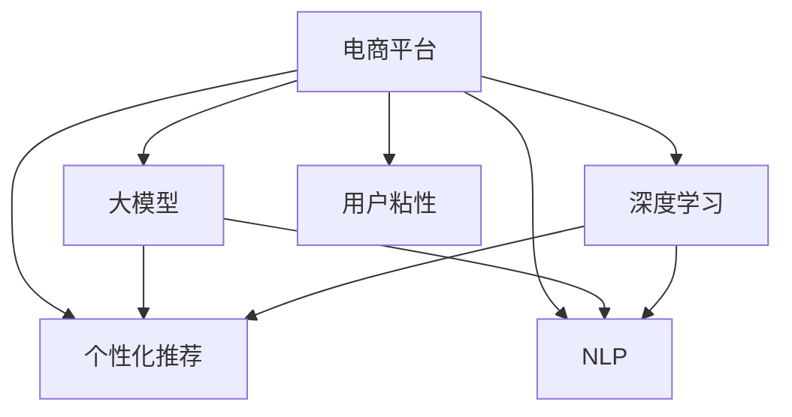

                 

# 大模型如何提升电商平台的用户粘性与长期活跃度

> 关键词：电商平台,用户粘性,长期活跃度,大模型,深度学习,个性化推荐,自然语言处理,NLP

## 1. 背景介绍

### 1.1 问题由来
随着互联网时代的到来，电商平台的竞争日趋激烈，用户体验和用户粘性成为决定平台成功的关键因素。传统的电商平台主要通过价格、促销等手段吸引用户，但随着竞争的加剧，这种简单粗暴的方式已难以持续。电商平台亟需找到新的方法，提升用户粘性和长期活跃度。

大模型，尤其是深度学习和大规模预训练语言模型，为电商平台带来了新的思路。通过深度学习和大模型，电商平台可以更精准地理解用户行为和需求，提供个性化的推荐和服务，从而显著提升用户粘性和长期活跃度。本文将探讨大模型在电商平台中的核心应用，以及如何通过大模型技术优化电商平台的用户体验。

### 1.2 问题核心关键点
本文的核心问题是如何利用大模型技术提升电商平台的长期活跃度。具体来说，将探讨以下几个关键点：

- 大模型在电商平台中的应用场景：包括用户行为分析、推荐系统、客服系统、内容生成等。
- 如何构建基于大模型的电商平台：从数据准备到模型训练，再到推理部署的全流程。
- 提升用户粘性的具体策略：通过个性化推荐、内容生成、交互式客服等手段，提升用户粘性和满意度。
- 未来发展趋势：随着大模型技术的不断进步，如何进一步优化电商平台的用户体验。

## 2. 核心概念与联系

### 2.1 核心概念概述

为更好地理解大模型在电商平台中的应用，本节将介绍几个密切相关的核心概念：

- 电商平台(e-Commerce Platform)：指通过互联网平台，为消费者提供商品展示、购买、支付、配送等服务的商业模式。
- 大模型(Large Model)：指通过大规模数据训练得到的深度学习模型，如BERT、GPT等，具备强大的语义理解和生成能力。
- 深度学习(Deep Learning)：指通过多层神经网络，模拟人类大脑的复杂计算过程，自动学习特征表示的机器学习技术。
- 个性化推荐(Personalized Recommendation)：指基于用户历史行为和兴趣，推荐个性化的商品或内容，提升用户体验。
- 自然语言处理(Natural Language Processing, NLP)：指使用计算机处理、理解、生成人类语言的技术。
- 用户粘性(User Engagement)：指用户对平台的依赖程度和活跃程度，通常通过用户停留时间、访问频次等指标衡量。

这些核心概念之间的逻辑关系可以通过以下Mermaid流程图来展示：



这个流程图展示了大模型在电商平台中的核心应用及其相互关系：

1. 电商平台通过深度学习和大模型提升推荐系统效果，提供个性化推荐。
2. 深度学习和大模型结合NLP技术，构建智能客服系统，提升用户体验。
3. 大模型用于内容生成，提高商品描述质量和用户体验。
4. 深度学习和大模型提升电商平台的个性化推荐和内容质量，从而提升用户粘性。

## 3. 核心算法原理 & 具体操作步骤
### 3.1 算法原理概述

大模型在电商平台中的应用，主要基于深度学习和自然语言处理技术，通过构建推荐系统、智能客服、内容生成等系统，提升用户体验和粘性。

具体来说，电商平台的推荐系统通过大模型学习用户行为和商品特征，生成个性化的推荐结果。智能客服系统通过大模型理解用户意图，提供自然的交互式回复。内容生成系统通过大模型自动生成高质量的商品描述和广告文案，提高用户满意度。这些系统的核心算法原理如下：

1. **推荐系统**：利用大模型学习用户行为和商品特征，通过矩阵分解或深度学习模型，生成个性化的推荐结果。
2. **智能客服**：利用大模型理解自然语言，生成自然语言响应，提升用户体验。
3. **内容生成**：利用大模型生成高质量的商品描述和广告文案，提升用户满意度。

### 3.2 算法步骤详解

基于大模型的电商平台构建过程通常包括以下几个步骤：

**Step 1: 数据准备**
- 收集电商平台的用户行为数据、商品信息数据和用户画像数据。
- 对数据进行预处理和清洗，生成训练集、验证集和测试集。

**Step 2: 模型选择与训练**
- 选择合适的深度学习模型或预训练语言模型。
- 使用训练集数据，在大模型上进行微调或迁移学习。
- 设置合适的超参数，包括学习率、批大小、迭代轮数等。

**Step 3: 系统部署与优化**
- 将训练好的模型部署到电商平台的推荐系统、智能客服或内容生成系统中。
- 对系统进行优化，确保高效稳定运行。

**Step 4: 系统测试与评估**
- 在验证集上测试模型的性能，评估推荐结果的准确度和相关性。
- 对智能客服和内容生成的系统进行评估，衡量交互质量和内容质量。

**Step 5: 持续迭代与优化**
- 收集用户的反馈数据，不断优化模型和系统。
- 更新模型和数据，保持系统的适应性和稳定性。

### 3.3 算法优缺点

基于大模型的电商平台构建方法具有以下优点：

1. 提升推荐系统效果：大模型能够学习复杂的用户行为和商品特征，生成更准确的推荐结果。
2. 提升用户体验：通过智能客服和内容生成，提供自然的交互和高质量的推荐，提升用户满意度。
3. 高效自动化：大模型自动化地处理自然语言，提供高效的自动化服务。

同时，该方法也存在一定的局限性：

1. 依赖数据质量：推荐系统和智能客服的性能很大程度上依赖于数据的质量和完整性。
2. 资源消耗高：大模型的训练和推理需要高性能计算资源，可能面临资源消耗高的问题。
3. 冷启动问题：新用户或新商品缺乏足够的数据，导致推荐和内容生成的效果不佳。
4. 模型可解释性不足：大模型的决策过程缺乏可解释性，难以理解其内部逻辑。

尽管存在这些局限性，但就目前而言，基于大模型的电商平台构建方法仍是最为主流的范式。未来相关研究的重点在于如何进一步降低数据需求，提高系统的可解释性和鲁棒性，以及如何解决冷启动问题。

### 3.4 算法应用领域

大模型在电商平台中的应用领域广泛，主要包括以下几个方面：

1. **推荐系统**：通过用户行为数据和商品特征，生成个性化的推荐结果，提升用户粘性和购买转化率。
2. **智能客服**：利用大模型理解用户意图，生成自然语言回复，提升用户满意度和平台服务质量。
3. **内容生成**：通过大模型生成高质量的商品描述、广告文案等，提高用户满意度和平台竞争力。
4. **数据分析**：利用大模型进行用户行为分析、情感分析等，提升平台运营效率和决策质量。
5. **营销活动**：通过大模型生成高效的广告文案和营销策略，提高用户参与度和平台流量。

## 4. 数学模型和公式 & 详细讲解  
### 4.1 数学模型构建

本节将使用数学语言对基于大模型的电商平台构建过程进行更加严格的刻画。

假设电商平台的用户行为数据为 $X=\{x_1, x_2, ..., x_m\}$，用户画像数据为 $U=\{u_1, u_2, ..., u_n\}$，商品信息数据为 $P=\{p_1, p_2, ..., p_k\}$。其中，$x_i$ 为第 $i$ 个用户的行为数据，$u_j$ 为第 $j$ 个用户画像，$p_l$ 为第 $l$ 个商品的特征。

**推荐系统**：利用大模型 $M$ 学习用户行为和商品特征，生成推荐结果。设推荐结果为 $R=\{r_1, r_2, ..., r_m\}$，推荐系统模型的目标为：

$$
\min_{M, R} \mathcal{L}(M, X, P, R)
$$

其中，$\mathcal{L}$ 为损失函数，衡量推荐结果的准确度和相关性。

**智能客服**：利用大模型 $M$ 理解自然语言输入，生成自然语言响应。设输入为 $I$，输出为 $O$，智能客服系统的目标为：

$$
\min_{M, O} \mathcal{L}(M, I, O)
$$

其中，$\mathcal{L}$ 为损失函数，衡量生成的响应与用户意图的匹配度。

**内容生成**：利用大模型 $M$ 生成高质量的商品描述。设生成的描述为 $D$，内容生成系统的目标为：

$$
\min_{M, D} \mathcal{L}(M, P, D)
$$

其中，$\mathcal{L}$ 为损失函数，衡量生成的描述与商品特征的匹配度。

### 4.2 公式推导过程

以下是推荐系统和智能客服系统的详细公式推导。

**推荐系统**：假设推荐系统使用协同过滤方法，基于用户行为数据和商品特征，生成推荐结果。设用户 $u_j$ 对商品 $p_l$ 的评分矩阵为 $R_{jl}$，用户行为矩阵为 $X_{uj}$，商品特征矩阵为 $P_{pl}$，推荐结果矩阵为 $R_{rl}$。推荐系统的目标为最小化预测评分与实际评分之间的差异：

$$
\min_{M, R} \sum_{j=1}^n \sum_{l=1}^k \mathcal{L}(R_{rl}, M(X_{uj}, P_{pl}))
$$

其中，$\mathcal{L}$ 为损失函数，$M$ 为推荐模型，$R$ 为推荐结果。

**智能客服**：假设智能客服系统使用基于大模型的语言理解模型，生成自然语言响应。设输入为 $I$，输出为 $O$，智能客服系统的目标为最小化生成的响应与用户意图的差异：

$$
\min_{M, O} \mathcal{L}(O, M(I))
$$

其中，$\mathcal{L}$ 为损失函数，$M$ 为语言理解模型，$O$ 为生成的响应。

### 4.3 案例分析与讲解

以智能客服系统为例，下面详细讲解如何利用大模型构建智能客服系统。

假设电商平台有多个客服机器人，每个机器人可以处理不同的任务。首先，收集客服机器人与用户的历史对话数据，将其标记为训练集。然后，使用Transformer等深度学习模型，在大模型上进行微调，学习理解自然语言。

具体步骤如下：

1. 数据准备：收集客服机器人与用户的历史对话数据，标注意图和响应。
2. 模型选择：选择合适的预训练语言模型，如BERT、GPT等。
3. 微调：在预训练模型上，添加任务适配层（如全连接层），使用训练集数据进行微调。
4. 评估：在验证集上评估模型的性能，选择表现最好的模型进行部署。
5. 推理：在部署的模型上，对用户的自然语言输入进行推理，生成自然语言响应。

## 5. 项目实践：代码实例和详细解释说明
### 5.1 开发环境搭建

在进行电商平台大模型构建实践前，我们需要准备好开发环境。以下是使用Python进行PyTorch开发的环境配置流程：

1. 安装Anaconda：从官网下载并安装Anaconda，用于创建独立的Python环境。

2. 创建并激活虚拟环境：
```bash
conda create -n pytorch-env python=3.8 
conda activate pytorch-env
```

3. 安装PyTorch：根据CUDA版本，从官网获取对应的安装命令。例如：
```bash
conda install pytorch torchvision torchaudio cudatoolkit=11.1 -c pytorch -c conda-forge
```

4. 安装TensorFlow：
```bash
pip install tensorflow==2.5
```

5. 安装Transformers库：
```bash
pip install transformers
```

6. 安装各类工具包：
```bash
pip install numpy pandas scikit-learn matplotlib tqdm jupyter notebook ipython
```

完成上述步骤后，即可在`pytorch-env`环境中开始电商平台大模型构建实践。

### 5.2 源代码详细实现

下面我们以推荐系统为例，给出使用Transformers库对BERT模型进行电商推荐系统微调的PyTorch代码实现。

首先，定义推荐系统任务的数据处理函数：

```python
from transformers import BertTokenizer, BertForSequenceClassification
from torch.utils.data import Dataset
import torch

class RecommendationDataset(Dataset):
    def __init__(self, user_behaviors, item_features, item_labels, tokenizer, max_len=128):
        self.user_behaviors = user_behaviors
        self.item_features = item_features
        self.item_labels = item_labels
        self.tokenizer = tokenizer
        self.max_len = max_len
        
    def __len__(self):
        return len(self.user_behaviors)
    
    def __getitem__(self, item):
        user_behavior = self.user_behaviors[item]
        item_feature = self.item_features[item]
        item_label = self.item_labels[item]
        
        encoding = self.tokenizer(user_behavior, return_tensors='pt', max_length=self.max_len, padding='max_length', truncation=True)
        item_feature = self.tokenizer(item_feature, return_tensors='pt', max_length=self.max_len, padding='max_length', truncation=True)
        
        input_ids = encoding['input_ids'][0]
        attention_mask = encoding['attention_mask'][0]
        feature_ids = item_feature['input_ids'][0]
        feature_mask = item_feature['attention_mask'][0]
        
        # 构建输入和特征的拼接向量
        input_ids = torch.cat([input_ids, feature_ids])
        attention_mask = torch.cat([attention_mask, feature_mask])
        item_label = item_label
        return {'input_ids': input_ids, 
                'attention_mask': attention_mask,
                'item_label': item_label}

# 构建推荐系统训练集、验证集和测试集
user_behaviors_train = ...
item_features_train = ...
item_labels_train = ...
user_behaviors_dev = ...
item_features_dev = ...
item_labels_dev = ...
user_behaviors_test = ...
item_features_test = ...
item_labels_test = ...
tokenizer = BertTokenizer.from_pretrained('bert-base-cased')

train_dataset = RecommendationDataset(user_behaviors_train, item_features_train, item_labels_train, tokenizer)
dev_dataset = RecommendationDataset(user_behaviors_dev, item_features_dev, item_labels_dev, tokenizer)
test_dataset = RecommendationDataset(user_behaviors_test, item_features_test, item_labels_test, tokenizer)
```

然后，定义模型和优化器：

```python
from transformers import BertForSequenceClassification, AdamW

model = BertForSequenceClassification.from_pretrained('bert-base-cased', num_labels=2)

optimizer = AdamW(model.parameters(), lr=2e-5)
```

接着，定义训练和评估函数：

```python
from torch.utils.data import DataLoader
from tqdm import tqdm
from sklearn.metrics import accuracy_score

device = torch.device('cuda') if torch.cuda.is_available() else torch.device('cpu')
model.to(device)

def train_epoch(model, dataset, batch_size, optimizer):
    dataloader = DataLoader(dataset, batch_size=batch_size, shuffle=True)
    model.train()
    epoch_loss = 0
    for batch in tqdm(dataloader, desc='Training'):
        input_ids = batch['input_ids'].to(device)
        attention_mask = batch['attention_mask'].to(device)
        item_label = batch['item_label'].to(device)
        model.zero_grad()
        outputs = model(input_ids, attention_mask=attention_mask, labels=item_label)
        loss = outputs.loss
        epoch_loss += loss.item()
        loss.backward()
        optimizer.step()
    return epoch_loss / len(dataloader)

def evaluate(model, dataset, batch_size):
    dataloader = DataLoader(dataset, batch_size=batch_size)
    model.eval()
    preds, labels = [], []
    with torch.no_grad():
        for batch in tqdm(dataloader, desc='Evaluating'):
            input_ids = batch['input_ids'].to(device)
            attention_mask = batch['attention_mask'].to(device)
            item_label = batch['item_label'].to(device)
            batch_preds = model(input_ids, attention_mask=attention_mask)
            batch_preds = torch.argmax(batch_preds, dim=1).to('cpu').tolist()
            batch_labels = item_label.to('cpu').tolist()
            for pred, label in zip(batch_preds, batch_labels):
                preds.append(pred)
                labels.append(label)
                
    print('Accuracy:', accuracy_score(labels, preds))
```

最后，启动训练流程并在测试集上评估：

```python
epochs = 5
batch_size = 16

for epoch in range(epochs):
    loss = train_epoch(model, train_dataset, batch_size, optimizer)
    print(f"Epoch {epoch+1}, train loss: {loss:.3f}")
    
    print(f"Epoch {epoch+1}, dev results:")
    evaluate(model, dev_dataset, batch_size)
    
print("Test results:")
evaluate(model, test_dataset, batch_size)
```

以上就是使用PyTorch对BERT进行电商推荐系统微调的完整代码实现。可以看到，得益于Transformers库的强大封装，我们可以用相对简洁的代码完成BERT模型的加载和微调。

### 5.3 代码解读与分析

让我们再详细解读一下关键代码的实现细节：

**RecommendationDataset类**：
- `__init__`方法：初始化用户行为、商品特征和标签等关键组件。
- `__len__`方法：返回数据集的样本数量。
- `__getitem__`方法：对单个样本进行处理，将用户行为和商品特征输入编码为token ids，最终返回模型所需的输入。

**BertForSequenceClassification类**：
- 使用BERT模型作为推荐系统模型，设置输出层和损失函数。

**训练和评估函数**：
- 使用PyTorch的DataLoader对数据集进行批次化加载，供模型训练和推理使用。
- 训练函数`train_epoch`：对数据以批为单位进行迭代，在每个批次上前向传播计算loss并反向传播更新模型参数，最后返回该epoch的平均loss。
- 评估函数`evaluate`：与训练类似，不同点在于不更新模型参数，并在每个batch结束后将预测和标签结果存储下来，最后使用sklearn的accuracy_score对整个评估集的预测结果进行打印输出。

**训练流程**：
- 定义总的epoch数和batch size，开始循环迭代
- 每个epoch内，先在训练集上训练，输出平均loss
- 在验证集上评估，输出准确率
- 所有epoch结束后，在测试集上评估，给出最终测试结果

可以看到，PyTorch配合Transformers库使得BERT微调的代码实现变得简洁高效。开发者可以将更多精力放在数据处理、模型改进等高层逻辑上，而不必过多关注底层的实现细节。

当然，工业级的系统实现还需考虑更多因素，如模型的保存和部署、超参数的自动搜索、更灵活的任务适配层等。但核心的微调范式基本与此类似。

## 6. 实际应用场景
### 6.1 智能客服系统

基于大模型的智能客服系统，可以广泛应用于电商平台的用户服务。传统客服往往需要配备大量人力，高峰期响应缓慢，且一致性和专业性难以保证。而使用大模型构建的智能客服系统，可以7x24小时不间断服务，快速响应用户咨询，用自然流畅的语言解答各类常见问题。

在技术实现上，可以收集企业内部的历史客服对话记录，将问题和最佳答复构建成监督数据，在此基础上对预训练对话模型进行微调。微调后的对话模型能够自动理解用户意图，匹配最合适的答复。对于用户提出的新问题，还可以接入检索系统实时搜索相关内容，动态组织生成回答。如此构建的智能客服系统，能大幅提升用户咨询体验和问题解决效率。

### 6.2 个性化推荐系统

当前的推荐系统往往只依赖用户的历史行为数据进行物品推荐，无法深入理解用户的真实兴趣偏好。基于大模型微调的推荐系统，可以更精准地学习用户的隐含兴趣，提供个性化的推荐结果，显著提升用户体验。

在实践中，可以收集用户浏览、点击、评论、分享等行为数据，提取和商品交互的文本内容。将文本内容作为模型输入，用户的后续行为（如是否点击、购买等）作为监督信号，在此基础上微调预训练语言模型。微调后的模型能够从文本内容中准确把握用户的兴趣点。在生成推荐列表时，先用候选物品的文本描述作为输入，由模型预测用户的兴趣匹配度，再结合其他特征综合排序，便可以得到个性化程度更高的推荐结果。

### 6.3 内容生成

在电商平台上，商品描述和广告文案的生成直接影响用户的购买决策。大模型可以通过训练生成高质量的商品描述，提升用户对商品的兴趣和理解。

在实际应用中，可以将商品名称、类别、特点等信息作为模型输入，训练大模型生成商品描述。生成的描述可以包括详细的功能介绍、使用说明、用户评价等，提升用户对商品的了解和购买意愿。

### 6.4 未来应用展望

随着大模型技术的不断发展，基于大模型的电商平台应用也将不断拓展。未来，大模型在电商平台中的应用将更加广泛和深入，将涵盖用户行为分析、情感分析、广告优化等多个领域，为电商平台的运营提供更全面的支持。

在智慧物流领域，大模型可以帮助物流企业提升配送路径优化、库存管理等效率，减少物流成本。

在智能金融领域，大模型可以用于风险评估、信用评分、用户画像等，提升金融服务的智能化水平。

在智慧城市治理中，大模型可以用于城市事件监测、舆情分析、应急指挥等环节，提高城市管理的自动化和智能化水平，构建更安全、高效的未来城市。

此外，在企业生产、社会治理、文娱传媒等众多领域，基于大模型的电商平台应用也将不断涌现，为传统行业数字化转型升级提供新的技术路径。相信随着技术的日益成熟，大模型在电商平台中的应用必将成为智能技术落地的重要方向，推动电商平台向更智能化、个性化、高效化的方向发展。

## 7. 工具和资源推荐
### 7.1 学习资源推荐

为了帮助开发者系统掌握大模型在电商平台中的应用，这里推荐一些优质的学习资源：

1. 《深度学习》系列书籍：如《深度学习入门》、《深度学习：理论与实现》等，全面介绍深度学习的基本原理和算法实现。

2. 《Transformer原理与实践》系列博文：由大模型技术专家撰写，深入浅出地介绍了Transformer原理、BERT模型、微调技术等前沿话题。

3. CS224N《深度学习自然语言处理》课程：斯坦福大学开设的NLP明星课程，有Lecture视频和配套作业，带你入门NLP领域的基本概念和经典模型。

4. 《Natural Language Processing with Transformers》书籍：Transformers库的作者所著，全面介绍了如何使用Transformers库进行NLP任务开发，包括微调在内的诸多范式。

5. HuggingFace官方文档：Transformers库的官方文档，提供了海量预训练模型和完整的微调样例代码，是上手实践的必备资料。

通过对这些资源的学习实践，相信你一定能够快速掌握大模型在电商平台中的应用，并用于解决实际的NLP问题。
###  7.2 开发工具推荐

高效的开发离不开优秀的工具支持。以下是几款用于大模型在电商平台中构建开发的常用工具：

1. PyTorch：基于Python的开源深度学习框架，灵活动态的计算图，适合快速迭代研究。大部分预训练语言模型都有PyTorch版本的实现。

2. TensorFlow：由Google主导开发的开源深度学习框架，生产部署方便，适合大规模工程应用。同样有丰富的预训练语言模型资源。

3. Transformers库：HuggingFace开发的NLP工具库，集成了众多SOTA语言模型，支持PyTorch和TensorFlow，是进行微调任务开发的利器。

4. Weights & Biases：模型训练的实验跟踪工具，可以记录和可视化模型训练过程中的各项指标，方便对比和调优。与主流深度学习框架无缝集成。

5. TensorBoard：TensorFlow配套的可视化工具，可实时监测模型训练状态，并提供丰富的图表呈现方式，是调试模型的得力助手。

6. Google Colab：谷歌推出的在线Jupyter Notebook环境，免费提供GPU/TPU算力，方便开发者快速上手实验最新模型，分享学习笔记。

合理利用这些工具，可以显著提升大模型在电商平台中的应用开发效率，加快创新迭代的步伐。

### 7.3 相关论文推荐

大模型在电商平台中的应用源于学界的持续研究。以下是几篇奠基性的相关论文，推荐阅读：

1. Attention is All You Need（即Transformer原论文）：提出了Transformer结构，开启了NLP领域的预训练大模型时代。

2. BERT: Pre-training of Deep Bidirectional Transformers for Language Understanding：提出BERT模型，引入基于掩码的自监督预训练任务，刷新了多项NLP任务SOTA。

3. Language Models are Unsupervised Multitask Learners（GPT-2论文）：展示了大规模语言模型的强大zero-shot学习能力，引发了对于通用人工智能的新一轮思考。

4. Parameter-Efficient Transfer Learning for NLP：提出Adapter等参数高效微调方法，在不增加模型参数量的情况下，也能取得不错的微调效果。

5. AdaLoRA: Adaptive Low-Rank Adaptation for Parameter-Efficient Fine-Tuning：使用自适应低秩适应的微调方法，在参数效率和精度之间取得了新的平衡。

这些论文代表了大模型在电商平台中的应用发展脉络。通过学习这些前沿成果，可以帮助研究者把握学科前进方向，激发更多的创新灵感。

## 8. 总结：未来发展趋势与挑战
### 8.1 总结

本文对基于大模型的电商平台构建方法进行了全面系统的介绍。首先阐述了大模型在电商平台中的应用场景，明确了推荐系统、智能客服、内容生成等关键方向。其次，从原理到实践，详细讲解了基于大模型的电商平台构建过程，包括数据准备、模型选择与训练、系统部署与优化、系统测试与评估的全流程。同时，本文还探讨了如何通过大模型技术优化电商平台的用户体验，提升用户粘性和长期活跃度。

通过本文的系统梳理，可以看到，基于大模型的电商平台构建方法在推荐系统、智能客服、内容生成等多个领域都有广泛应用，显著提升了用户体验和平台竞争力。未来，随着大模型技术的不断发展，基于大模型的电商平台必将在智能化的道路上继续深入探索，为用户带来更加无缝、高效、个性化的购物体验。

### 8.2 未来发展趋势

展望未来，大模型在电商平台中的应用将呈现以下几个发展趋势：

1. 推荐系统智能化：大模型能够更精准地学习用户兴趣和行为，提供更加个性化和准确的推荐结果，提升用户体验。
2. 智能客服自动化：智能客服系统将更智能地理解用户意图，提供更加自然流畅的交互，提升用户满意度。
3. 内容生成多样化：大模型生成的商品描述和广告文案将更加丰富和多样化，提升用户对商品的兴趣和理解。
4. 用户行为分析深入化：利用大模型对用户行为进行深入分析，提升平台运营效率和决策质量。
5. 多模态融合：将文本、图像、音频等多模态数据融合，提供更加全面和准确的商品展示和推荐。
6. 个性化推荐实时化：通过实时收集用户行为数据，动态调整推荐策略，提升推荐系统的实时性和个性化程度。

以上趋势凸显了大模型在电商平台中的应用前景。这些方向的探索发展，必将进一步提升电商平台的用户体验和粘性，促进电商平台向智能化的方向迈进。

### 8.3 面临的挑战

尽管大模型在电商平台中的应用已取得显著成效，但在迈向更加智能化、普适化应用的过程中，仍面临诸多挑战：

1. 数据隐私和安全：电商平台上包含大量用户隐私数据，如何保障数据安全，避免数据泄露和滥用，是重要问题。
2. 冷启动问题：新用户或新商品缺乏足够的数据，导致推荐和内容生成的效果不佳。
3. 资源消耗高：大模型的训练和推理需要高性能计算资源，可能面临资源消耗高的问题。
4. 模型可解释性不足：大模型的决策过程缺乏可解释性，难以理解其内部逻辑。
5. 鲁棒性和泛化性：大模型面对噪声和异常数据时，泛化性能可能下降。
6. 算法偏见和伦理问题：大模型可能会学习到有偏见的信息，需要从数据和算法层面进行消除，确保输出符合伦理道德。

尽管存在这些挑战，但就目前而言，基于大模型的电商平台构建方法仍是最为主流的范式。未来相关研究的重点在于如何进一步降低数据需求，提高系统的可解释性和鲁棒性，以及如何解决冷启动问题。

### 8.4 研究展望

面向未来，大模型在电商平台中的应用需要在以下几个方面寻求新的突破：

1. 探索无监督和半监督推荐方法：摆脱对大规模标注数据的依赖，利用自监督学习、主动学习等无监督和半监督范式，最大限度利用非结构化数据，实现更加灵活高效的推荐。
2. 研究参数高效和计算高效的推荐范式：开发更加参数高效的推荐方法，在固定大部分预训练参数的情况下，只更新极少量的任务相关参数。同时优化推荐系统的计算图，减少前向传播和反向传播的资源消耗，实现更加轻量级、实时性的部署。
3. 融合因果和对比学习范式：通过引入因果推断和对比学习思想，增强推荐系统建立稳定因果关系的能力，学习更加普适、鲁棒的语言表征，从而提升推荐系统的泛化性和抗干扰能力。
4. 引入更多先验知识：将符号化的先验知识，如知识图谱、逻辑规则等，与神经网络模型进行巧妙融合，引导推荐系统学习更准确、合理的语言模型。同时加强不同模态数据的整合，实现视觉、语音等多模态信息与文本信息的协同建模。
5. 结合因果分析和博弈论工具：将因果分析方法引入推荐系统，识别出系统决策的关键特征，增强推荐系统的可解释性和可控性。借助博弈论工具刻画人机交互过程，主动探索并规避推荐系统的脆弱点，提高系统稳定性。
6. 纳入伦理道德约束：在推荐系统训练目标中引入伦理导向的评估指标，过滤和惩罚有偏见、有害的输出倾向。同时加强人工干预和审核，建立推荐系统的监管机制，确保输出符合人类价值观和伦理道德。

这些研究方向的探索，必将引领大模型在电商平台中的应用向更高层次发展，为电商平台的运营提供更加智能、安全、可靠的解决方案。面向未来，大模型在电商平台中的应用还需要与其他人工智能技术进行更深入的融合，如知识表示、因果推理、强化学习等，多路径协同发力，共同推动自然语言理解和智能交互系统的进步。只有勇于创新、敢于突破，才能不断拓展语言模型的边界，让智能技术更好地造福人类社会。

## 9. 附录：常见问题与解答

**Q1：大模型在电商平台中的应用是否仅限于推荐系统？**

A: 大模型在电商平台中的应用不仅限于推荐系统，还包括智能客服、内容生成等多个领域。推荐系统只是其中一个典型应用。

**Q2：大模型在推荐系统中的性能如何？**

A: 大模型在推荐系统中的性能通常优于传统的协同过滤和矩阵分解方法。通过学习用户行为和商品特征，大模型能够生成更准确、个性化的推荐结果。

**Q3：大模型在智能客服中的应用如何？**

A: 大模型在智能客服中的应用主要体现在理解自然语言和生成自然语言回复上。通过微调预训练语言模型，智能客服系统能够自动理解用户意图，提供自然的交互式回复，提升用户体验。

**Q4：大模型在内容生成中的应用如何？**

A: 大模型在内容生成中的应用主要体现在生成高质量的商品描述和广告文案上。通过训练大模型，可以自动生成详细的功能介绍、使用说明、用户评价等内容，提升用户对商品的了解和购买意愿。

**Q5：大模型在电商平台中的应用面临哪些挑战？**

A: 大模型在电商平台中的应用面临的主要挑战包括数据隐私和安全、冷启动问题、资源消耗高、模型可解释性不足、鲁棒性和泛化性、算法偏见和伦理问题等。

**Q6：如何缓解大模型在电商平台中的过拟合问题？**

A: 缓解大模型在电商平台中的过拟合问题，可以通过数据增强、正则化、对抗训练等手段进行。具体方法包括回译、近义替换、L2正则、Dropout等。

通过以上问题与解答，可以看出大模型在电商平台中的应用具有广泛的前景和挑战。未来，随着技术的不断进步，大模型必将在电商平台上发挥更大的作用，提升用户体验和平台竞争力。

---

作者：禅与计算机程序设计艺术 / Zen and the Art of Computer Programming

