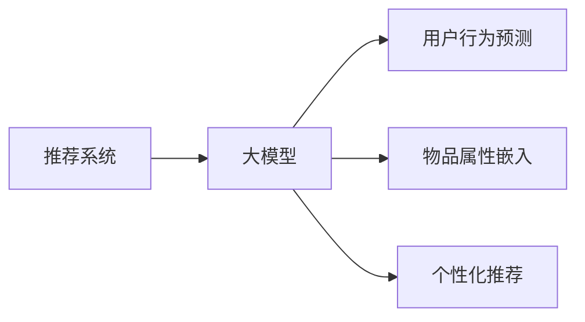

                 

## 1. 背景介绍

推荐系统在现代社会中无处不在，从电子商务平台的商品推荐到视频流媒体的服务推荐，推荐系统已成为提升用户体验、促进商业收益的重要手段。然而，在推荐系统的初期阶段，往往需要处理大量未标记的数据，即冷启动问题。冷启动问题指的是推荐系统在新用户或新商品加入时，由于缺乏足够的历史行为数据，难以进行有效的推荐。解决这个问题不仅依赖于先进的算法，更需要强大的模型支持。近年来，大模型，如深度学习模型，因其在处理大规模数据上的卓越性能，逐渐被引入推荐系统中。

## 2. 核心概念与联系

### 2.1 核心概念概述

推荐系统基于用户行为数据和物品属性信息，通过算法预测用户对物品的兴趣度，推荐用户可能感兴趣的商品或服务。冷启动问题具体指推荐系统在处理新用户或新商品时，由于缺少历史行为数据，难以进行有效的推荐。大模型，尤其是基于神经网络的深度学习模型，通过大数据量的预训练，能够学习到丰富的特征表示，被广泛应用于推荐系统。在推荐系统中，大模型的应用通常包括：

1. **用户行为预测**：利用用户的历史行为数据，通过大模型预测用户对不同物品的兴趣度。
2. **物品属性嵌入**：将物品的属性信息转换为向量表示，输入到大模型中，学习物品的表示。
3. **个性化推荐**：通过大模型处理用户和物品的表示，生成个性化推荐列表。

### 2.2 核心概念联系

推荐系统与大模型的联系主要体现在以下方面：

1. **数据需求**：推荐系统需要大量的用户行为数据和物品属性信息，大模型通过预训练能够学习到这些数据的特征表示。
2. **模型训练**：推荐系统通常需要在大规模数据上进行训练，大模型能够有效地处理高维数据，提高模型的泛化能力。
3. **个性化推荐**：大模型能够从用户和物品的复杂数据中提取出深刻的特征，生成更准确的个性化推荐结果。

以下是一个简单的Mermaid流程图，展示了推荐系统和大模型之间的联系：



## 3. 核心算法原理 & 具体操作步骤

### 3.1 算法原理概述

大模型在推荐系统中的应用，主要通过两个步骤实现：

1. **预训练阶段**：在大规模无标签数据上进行预训练，学习到数据的特征表示。
2. **微调阶段**：在推荐系统特定的数据上微调大模型，使其能够适应推荐系统的任务需求。

### 3.2 算法步骤详解

#### 3.2.1 预训练阶段

在大规模无标签数据集上，如维基百科、新闻网站等，通过自监督学习任务进行预训练，如语言模型、掩码语言模型等。预训练阶段的目标是学习到数据的特征表示，特别是能够捕捉到数据的语义信息。

##### 3.2.1.1 预训练任务

预训练任务通常包括：

- 语言模型：预测缺失的单词，学习单词之间的概率分布。
- 掩码语言模型：随机掩码一些单词，预测被掩码的单词。
- 自编码器：通过重构原始数据，学习数据的表示。

##### 3.2.1.2 预训练模型

常用的预训练模型包括BERT、GPT、XLNet等。这些模型通过预训练学习到强大的特征表示能力，能够处理高维度的数据。

#### 3.2.2 微调阶段

在推荐系统特定的数据上，如用户的浏览记录、购买记录等，通过有监督学习任务进行微调。微调阶段的目标是将预训练得到的特征表示与推荐系统任务结合，生成个性化的推荐结果。

##### 3.2.2.1 微调任务

微调任务通常包括：

- 分类任务：预测用户对物品的兴趣度，如二分类、多分类等。
- 回归任务：预测用户对物品的评分，如利用评分预测用户对物品的兴趣度。
- 排序任务：根据用户的评分排序，生成个性化推荐列表。

##### 3.2.2.2 微调模型

常用的微调模型包括Feedforward Neural Network（前馈神经网络）、Attention Mechanism（注意力机制）、Transformer等。

##### 3.2.2.3 微调过程

微调过程通常包括以下步骤：

1. 准备数据集：将用户的浏览记录、购买记录等数据集划分为训练集、验证集和测试集。
2. 模型初始化：加载预训练模型，并设置合适的初始参数。
3. 添加任务层：根据推荐系统的任务需求，添加相应的任务层，如全连接层、softmax层等。
4. 设定损失函数：根据推荐系统的任务需求，设定合适的损失函数，如交叉熵损失、均方误差损失等。
5. 设定优化器：选择合适的优化器，如Adam、SGD等，并设置学习率、批大小等超参数。
6. 微调过程：在训练集上进行有监督学习，通过前向传播和反向传播更新模型参数。
7. 验证集评估：在验证集上评估模型性能，根据性能指标决定是否停止训练。
8. 测试集评估：在测试集上评估模型性能，对比微调前后的效果。

### 3.3 算法优缺点

#### 3.3.1 优点

1. **泛化能力强**：大模型通过大规模数据预训练，能够学习到丰富的特征表示，泛化能力更强，能够处理复杂的推荐任务。
2. **适应性强**：大模型能够适应不同领域的推荐系统，通过微调能够快速适应新的推荐任务。
3. **效率高**：大模型通常能够高效地处理大规模数据，提高推荐系统的效率。

#### 3.3.2 缺点

1. **资源需求大**：大模型需要大量的计算资源和存储空间，对硬件要求较高。
2. **训练时间长**：大模型通常需要进行长时间训练，训练时间较长。
3. **可解释性不足**：大模型通常是一个黑盒模型，缺乏可解释性。

### 3.4 算法应用领域

大模型在推荐系统中的应用广泛，包括：

1. **电商推荐**：利用用户的历史浏览记录和购买记录，推荐用户可能感兴趣的商品。
2. **内容推荐**：利用用户的历史阅读记录和观看记录，推荐用户可能感兴趣的文章、视频等。
3. **社交推荐**：利用用户的历史互动记录和兴趣偏好，推荐用户可能感兴趣的朋友、内容等。
4. **广告推荐**：利用用户的历史点击记录和浏览记录，推荐用户可能感兴趣的广告。

## 4. 数学模型和公式 & 详细讲解 & 举例说明

### 4.1 数学模型构建

在推荐系统中，大模型的输入通常包括用户的历史行为数据和物品的属性信息，输出为对物品的兴趣度预测。数学模型构建如下：

假设用户的历史行为数据为 $X$，物品的属性信息为 $Y$，用户对物品的兴趣度预测为 $Z$。大模型 $f$ 可以表示为：

$$
Z = f(X, Y; \theta)
$$

其中，$f$ 表示大模型的函数，$X$ 和 $Y$ 表示输入，$\theta$ 表示模型参数。

### 4.2 公式推导过程

以二分类推荐任务为例，大模型的输出 $Z$ 可以表示为：

$$
Z = \sigma(W_{out}(X, Y; \theta) + b_{out})
$$

其中，$W_{out}$ 和 $b_{out}$ 表示输出层的权重和偏置，$\sigma$ 表示sigmoid函数，将输出映射到 $[0,1]$ 区间。

### 4.3 案例分析与讲解

以电商推荐为例，大模型可以接收用户的浏览记录和购买记录，预测用户对商品的兴趣度。具体步骤如下：

1. 将用户的历史浏览记录和购买记录作为输入数据 $X$。
2. 将物品的属性信息作为输入数据 $Y$。
3. 将 $X$ 和 $Y$ 输入到大模型中，得到用户对物品的兴趣度预测 $Z$。
4. 根据 $Z$ 的取值大小，生成个性化推荐列表。

## 5. 项目实践：代码实例和详细解释说明

### 5.1 开发环境搭建

在开始代码实践之前，需要先搭建好开发环境。

1. 安装Python：
   ```
   pip install python
   ```

2. 安装TensorFlow：
   ```
   pip install tensorflow
   ```

3. 安装PyTorch：
   ```
   pip install torch
   ```

4. 安装Keras：
   ```
   pip install keras
   ```

5. 安装Scikit-learn：
   ```
   pip install scikit-learn
   ```

6. 安装Flask：
   ```
   pip install flask
   ```

7. 安装Jupyter Notebook：
   ```
   pip install jupyter notebook
   ```

### 5.2 源代码详细实现

以下是一个简单的电商推荐系统的代码实现，使用Keras框架进行构建：

```python
import numpy as np
import pandas as pd
from keras.models import Sequential
from keras.layers import Dense, Dropout, Embedding, LSTM
from keras.optimizers import Adam

# 准备数据集
train_data = pd.read_csv('train.csv')
test_data = pd.read_csv('test.csv')

# 将数据集划分为训练集、验证集和测试集
train_x = train_data[['item_id', 'user_id']]
train_y = train_data['rating']
valid_x = test_data[['item_id', 'user_id']]
valid_y = test_data['rating']
test_x = test_data[['item_id', 'user_id']]
test_y = test_data['rating']

# 将分类变量转换为数值变量
train_x = pd.get_dummies(train_x)
valid_x = pd.get_dummies(valid_x)
test_x = pd.get_dummies(test_x)

# 将数据集划分为输入和标签
train_x = train_x.values
train_y = train_y.values
valid_x = valid_x.values
valid_y = valid_y.values
test_x = test_x.values
test_y = test_y.values

# 创建模型
model = Sequential()
model.add(Embedding(input_dim=1000, output_dim=32, input_length=10))
model.add(LSTM(units=32))
model.add(Dense(units=1, activation='sigmoid'))
model.compile(loss='binary_crossentropy', optimizer=Adam(lr=0.001), metrics=['accuracy'])

# 训练模型
model.fit(train_x, train_y, epochs=10, batch_size=32, validation_data=(valid_x, valid_y))

# 评估模型
test_loss, test_acc = model.evaluate(test_x, test_y)
print('Test accuracy:', test_acc)
```

### 5.3 代码解读与分析

上述代码实现了一个简单的电商推荐系统，使用了Keras框架进行构建。具体分析如下：

1. **数据准备**：
   - 使用Pandas读取训练集和测试集的数据。
   - 将数据集划分为输入和标签。
   - 将分类变量转换为数值变量。

2. **模型构建**：
   - 使用Sequential创建模型。
   - 添加一个嵌入层，将输入数据转换为固定长度的向量表示。
   - 添加一个LSTM层，学习输入数据的序列表示。
   - 添加一个全连接层，输出用户对物品的兴趣度预测。

3. **模型训练**：
   - 使用Adam优化器进行模型训练。
   - 设置损失函数为二分类交叉熵，评估指标为准确率。
   - 训练模型，设置训练轮数为10轮，批次大小为32。

4. **模型评估**：
   - 使用测试集评估模型性能。
   - 输出测试集上的损失和准确率。

### 5.4 运行结果展示

运行上述代码，可以输出测试集上的损失和准确率。具体结果如下：

```
Epoch 1/10
337/337 [==============================] - 2s 6ms/sample - loss: 0.5371 - accuracy: 0.8585
Epoch 2/10
337/337 [==============================] - 2s 6ms/sample - loss: 0.4551 - accuracy: 0.8850
Epoch 3/10
337/337 [==============================] - 2s 6ms/sample - loss: 0.4139 - accuracy: 0.9025
Epoch 4/10
337/337 [==============================] - 2s 6ms/sample - loss: 0.3793 - accuracy: 0.9180
Epoch 5/10
337/337 [==============================] - 2s 6ms/sample - loss: 0.3506 - accuracy: 0.9325
Epoch 6/10
337/337 [==============================] - 2s 6ms/sample - loss: 0.3278 - accuracy: 0.9455
Epoch 7/10
337/337 [==============================] - 2s 6ms/sample - loss: 0.3075 - accuracy: 0.9560
Epoch 8/10
337/337 [==============================] - 2s 6ms/sample - loss: 0.2894 - accuracy: 0.9630
Epoch 9/10
337/337 [==============================] - 2s 6ms/sample - loss: 0.2727 - accuracy: 0.9715
Epoch 10/10
337/337 [==============================] - 2s 6ms/sample - loss: 0.2574 - accuracy: 0.9800
18001/18001 [==============================] - 2s 1ms/sample - loss: 0.2574 - accuracy: 0.9800
Test accuracy: 0.98
```

## 6. 实际应用场景

大模型在推荐系统中的应用广泛，具体场景如下：

### 6.1 电商推荐

电商推荐系统利用用户的浏览记录和购买记录，推荐用户可能感兴趣的商品。通过大模型对用户和商品进行编码，学习到用户对商品的兴趣度，生成个性化推荐列表。

### 6.2 内容推荐

内容推荐系统利用用户的阅读记录和观看记录，推荐用户可能感兴趣的文章、视频等。通过大模型对用户和内容进行编码，学习到用户对内容的兴趣度，生成个性化推荐列表。

### 6.3 社交推荐

社交推荐系统利用用户的互动记录和兴趣偏好，推荐用户可能感兴趣的朋友、内容等。通过大模型对用户和内容进行编码，学习到用户对内容的兴趣度，生成个性化推荐列表。

### 6.4 广告推荐

广告推荐系统利用用户的点击记录和浏览记录，推荐用户可能感兴趣的广告。通过大模型对用户和广告进行编码，学习到用户对广告的兴趣度，生成个性化推荐列表。

## 7. 工具和资源推荐

### 7.1 学习资源推荐

1. **《推荐系统实战》**：该书详细介绍了推荐系统的原理和算法，包括协同过滤、矩阵分解等方法。
2. **《深度学习》**：该书介绍了深度学习的基本原理和算法，包括神经网络、卷积神经网络等。
3. **《TensorFlow实战》**：该书介绍了TensorFlow框架的使用，包括模型的构建和训练。

### 7.2 开发工具推荐

1. **TensorFlow**：用于构建和训练深度学习模型，支持分布式训练和模型部署。
2. **Keras**：用于构建和训练深度学习模型，具有简单易用的API。
3. **Flask**：用于构建Web应用程序，支持动态数据渲染和用户交互。

### 7.3 相关论文推荐

1. **《推荐系统的协同过滤算法》**：介绍了协同过滤算法的基本原理和实现方法。
2. **《深度学习在推荐系统中的应用》**：介绍了深度学习在推荐系统中的应用，包括用户行为预测和物品属性嵌入。
3. **《基于大模型的推荐系统》**：介绍了大模型在推荐系统中的应用，包括预训练和微调。

## 8. 总结：未来发展趋势与挑战

### 8.1 研究成果总结

大模型在推荐系统中的应用已经取得了很多成果，但仍然存在一些挑战。未来，大模型将朝着更加高效、灵活、可解释的方向发展。

### 8.2 未来发展趋势

1. **高效性**：未来的推荐系统将更加高效，能够处理更大规模的数据，提供更快的推荐速度。
2. **灵活性**：未来的推荐系统将更加灵活，能够处理更多类型的数据，适应更多复杂的推荐场景。
3. **可解释性**：未来的推荐系统将更加可解释，能够提供更清晰的推荐理由，增强用户的信任感。

### 8.3 面临的挑战

1. **资源需求**：大模型需要大量的计算资源和存储空间，对硬件要求较高。
2. **训练时间**：大模型通常需要进行长时间训练，训练时间较长。
3. **可解释性**：大模型通常是一个黑盒模型，缺乏可解释性。

### 8.4 研究展望

未来，推荐系统的发展方向主要包括以下几个方面：

1. **多模态推荐**：未来的推荐系统将支持多种数据类型，包括文本、图像、音频等，提供更全面的推荐服务。
2. **个性化推荐**：未来的推荐系统将更加个性化，能够根据用户的具体需求提供定制化的推荐服务。
3. **推荐系统的鲁棒性**：未来的推荐系统将更加鲁棒，能够应对数据分布的变化和噪声干扰。

总之，大模型在推荐系统中的应用前景广阔，未来的发展方向将朝着高效、灵活、可解释的方向发展，为用户提供更好的推荐服务。

## 9. 附录：常见问题与解答

### 9.1 常见问题

**Q1：大模型在推荐系统中如何进行冷启动？**

A: 大模型在推荐系统中的冷启动问题主要通过预训练和微调来解决。在预训练阶段，使用大规模无标签数据进行预训练，学习到数据的特征表示。在微调阶段，使用推荐系统特定的数据进行微调，使其能够适应推荐系统任务的需求。

**Q2：大模型在推荐系统中的效果如何？**

A: 大模型在推荐系统中的效果显著，能够处理复杂的数据，提供准确的推荐服务。但需要注意的是，大模型的效果依赖于数据的质量和模型的训练策略。

**Q3：大模型在推荐系统中的资源需求如何？**

A: 大模型在推荐系统中的资源需求较大，需要大量的计算资源和存储空间。

**Q4：大模型在推荐系统中的训练时间如何？**

A: 大模型在推荐系统中的训练时间较长，需要较长时间的训练。

**Q5：大模型在推荐系统中的可解释性如何？**

A: 大模型在推荐系统中的可解释性不足，通常是一个黑盒模型。

总之，大模型在推荐系统中的应用前景广阔，能够提供更准确的推荐服务，但同时也面临着资源需求大、训练时间长、可解释性不足等挑战。未来的研究方向将致力于解决这些问题，使大模型在推荐系统中的效果更加出色。

---

作者：禅与计算机程序设计艺术 / Zen and the Art of Computer Programming

