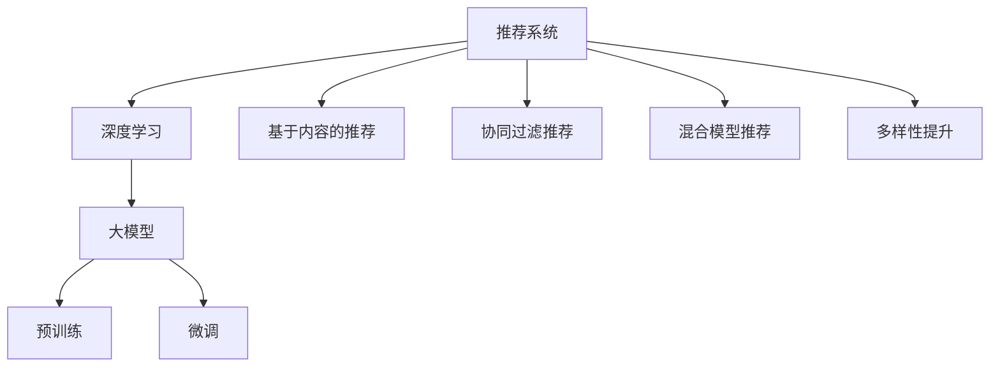
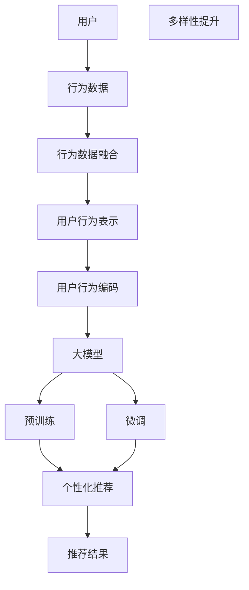

                 

## 1. 背景介绍

推荐系统（Recommendation Systems）是现代互联网应用中不可或缺的一部分，其核心目标是通过用户行为数据预测用户偏好，从而为用户推荐个性化内容。近年来，基于深度学习的大模型在推荐系统领域的应用越来越广泛，取得了显著的进展。然而，随着大模型的广泛应用，其对推荐系统多样性（Diversity）的影响也逐渐引起了学界的关注。推荐系统多样性指的是推荐结果的多样性程度，即不同用户对同一查询所得到的推荐结果的多样化程度。

推荐系统多样性的重要性在于：一方面，多样性能提高用户的满意度，避免用户长时间接触到重复的内容，从而增加用户粘性；另一方面，多样性也是推荐系统平衡推荐结果相关性和新颖性的重要手段。因此，如何量化和提升推荐系统多样性，成为了大模型在推荐系统领域面临的重要挑战之一。

本文将探讨大模型对推荐系统多样性的量化影响，重点讨论基于深度学习的大模型在推荐系统中的应用，如何利用大模型的强大语言处理能力来提升推荐系统的多样性。本文分为以下部分：

1. 背景介绍
2. 核心概念与联系
3. 核心算法原理及具体操作步骤
4. 数学模型和公式
5. 项目实践
6. 实际应用场景
7. 工具和资源推荐
8. 总结与展望

## 2. 核心概念与联系

### 2.1 核心概念概述

在深入探讨大模型对推荐系统多样性的量化影响之前，我们先简要介绍几个关键概念：

#### 2.1.1 推荐系统

推荐系统是一种通过算法为用户推荐商品、内容等个性化信息的技术。推荐系统可以分为基于内容的推荐、协同过滤推荐、基于混合模型的推荐等。近年来，深度学习技术在推荐系统中得到了广泛应用，特别是在自然语言处理（NLP）和图像处理等领域。

#### 2.1.2 大模型

大模型指的是具有亿级别参数的深度学习模型，如BERT、GPT等。这些大模型在预训练阶段利用大规模无标签数据进行训练，能够学习到丰富的语言知识和语义表示，具备强大的泛化能力和语言处理能力。

#### 2.1.3 推荐系统多样性

推荐系统多样性指的是推荐结果的多样化程度。高多样性的推荐结果能够更好地满足用户的个性化需求，提高用户满意度。

这些核心概念之间的关系可以通过以下Mermaid流程图来展示：



这个流程图展示了推荐系统的基本组成，以及大模型在其中扮演的角色。大模型通过预训练和微调，能够学习到丰富的语言知识，进而提升推荐系统的多样性。

### 2.2 核心概念原理和架构的 Mermaid 流程图



这个Mermaid流程图展示了推荐系统的核心架构，包括用户行为数据的收集和融合、用户行为表示和编码、大模型的预训练和微调、推荐系统的多样性提升以及最终的个性化推荐过程。

## 3. 核心算法原理 & 具体操作步骤

### 3.1 算法原理概述

大模型在推荐系统中的应用主要分为预训练和微调两个阶段。预训练阶段，大模型利用大规模无标签数据进行训练，学习到丰富的语言知识和语义表示。微调阶段，大模型利用小规模标注数据进行训练，学习到具体的推荐任务。

推荐系统多样性的提升主要通过以下两个途径：

1. **基于内容的推荐**：在预训练阶段，大模型可以学习到丰富的语义表示，进而能够更好地理解用户的个性化需求。在微调阶段，利用用户行为数据，大模型能够生成更加多样化的推荐结果。

2. **基于混合模型的推荐**：将大模型与传统推荐算法结合，利用大模型的语义表示和传统推荐算法的相关性计算，能够生成更加多样化的推荐结果。

### 3.2 算法步骤详解

#### 3.2.1 预训练阶段

预训练阶段的目标是利用大规模无标签数据训练大模型，学习到丰富的语言知识和语义表示。常用的预训练任务包括语言建模、掩码语言模型、下一句预测等。以BERT模型为例，其预训练任务如下：

1. **语言建模**：预测句子中的下一个单词，目标是通过上下文预测单词。
2. **掩码语言模型**：在句子中随机掩码一部分单词，预测被掩码单词。
3. **下一句预测**：预测两个句子是否相邻。

预训练阶段的具体步骤如下：

1. **数据准备**：收集大规模无标签文本数据，如维基百科、新闻、小说等。
2. **模型搭建**：搭建大模型的计算图，如BERT模型。
3. **数据加载**：将文本数据加载到GPU或TPU上。
4. **模型训练**：使用随机梯度下降（SGD）等优化算法，更新模型参数。
5. **预训练任务**：在预训练任务上进行训练，学习到丰富的语言知识和语义表示。

#### 3.2.2 微调阶段

微调阶段的目标是利用小规模标注数据，训练大模型，学习到具体的推荐任务。微调阶段的具体步骤如下：

1. **数据准备**：收集小规模标注数据，如用户行为数据。
2. **模型搭建**：在大模型的基础上，搭建微调模型的计算图，如在BERT模型的顶部添加用户行为表示层。
3. **数据加载**：将标注数据加载到GPU或TPU上。
4. **模型训练**：使用随机梯度下降（SGD）等优化算法，更新模型参数。
5. **推荐结果**：利用微调后的模型，生成推荐结果。

### 3.3 算法优缺点

#### 3.3.1 优点

1. **语言理解能力**：大模型具备强大的语言理解能力，能够更好地理解用户需求。
2. **多样性提升**：大模型能够生成更加多样化的推荐结果，提升用户的满意度。
3. **泛化能力强**：大模型具备较强的泛化能力，能够在不同的推荐场景下表现出色。

#### 3.3.2 缺点

1. **计算资源需求高**：大模型的计算资源需求高，需要高性能的GPU或TPU。
2. **训练时间长**：大模型的预训练和微调过程需要较长的训练时间。
3. **数据需求高**：大模型需要大规模无标签数据进行预训练，需要收集和处理大量的数据。

### 3.4 算法应用领域

大模型在推荐系统中的应用领域广泛，包括电商推荐、音乐推荐、视频推荐等。其优异的性能和强大的泛化能力，使得大模型成为推荐系统领域的研究热点。

## 4. 数学模型和公式 & 详细讲解 & 举例说明

### 4.1 数学模型构建

推荐系统的数学模型主要包括以下几个部分：

1. **用户行为表示**：将用户行为数据表示为向量，如点击次数、停留时间、浏览路径等。
2. **物品表示**：将物品特征表示为向量，如商品名称、描述、图片等。
3. **用户-物品交互**：利用用户行为数据和物品特征，生成用户对物品的评分。
4. **推荐结果**：根据用户行为和物品特征，生成推荐结果。

以BERT模型为例，其数学模型如下：

1. **用户行为表示**：利用BERT模型对用户行为数据进行编码，得到用户行为向量。
2. **物品表示**：利用BERT模型对物品特征进行编码，得到物品向量。
3. **用户-物品交互**：利用用户行为向量和物品向量，计算用户对物品的评分。
4. **推荐结果**：根据用户评分和物品评分，生成推荐结果。

### 4.2 公式推导过程

以BERT模型为例，其推荐系统公式如下：

1. **用户行为表示**：
   \[
   u = \text{BERT}(enc(u))
   \]
   其中，$u$为用户行为向量，$enc(u)$为用户行为数据的编码向量。

2. **物品表示**：
   \[
   i = \text{BERT}(enc(i))
   \]
   其中，$i$为物品向量，$enc(i)$为物品特征的编码向量。

3. **用户-物品交互**：
   \[
   s = \text{dot}(u, i)
   \]
   其中，$s$为用户对物品的评分，$\text{dot}$为点积运算。

4. **推荐结果**：
   \[
   r = \text{softmax}(s)
   \]
   其中，$r$为推荐结果向量，$\text{softmax}$为softmax函数。

### 4.3 案例分析与讲解

以电商推荐系统为例，其推荐过程如下：

1. **用户行为表示**：利用BERT模型对用户的历史点击、浏览等行为进行编码，得到用户行为向量。
2. **物品表示**：利用BERT模型对商品的标题、描述等特征进行编码，得到物品向量。
3. **用户-物品交互**：利用用户行为向量和物品向量，计算用户对物品的评分。
4. **推荐结果**：根据用户评分和物品评分，生成推荐结果向量。

## 5. 项目实践：代码实例和详细解释说明

### 5.1 开发环境搭建

为了搭建大模型推荐系统，我们需要准备以下几个开发环境：

1. **深度学习框架**：如PyTorch、TensorFlow等。
2. **GPU/TPU设备**：如NVIDIA V100、NVIDIA Tesla G4等。
3. **数据集**：如Amazon商品数据集、Netflix推荐数据集等。
4. **模型库**：如HuggingFace的BERT模型库。

### 5.2 源代码详细实现

以下是一个简单的电商推荐系统的代码实现：

```python
import torch
import torch.nn as nn
import torch.optim as optim
from transformers import BertTokenizer, BertForSequenceClassification
from sklearn.model_selection import train_test_split

# 数据准备
def load_dataset():
    # 加载数据集
    train_data, test_data = train_test_split(dataset, test_size=0.2)
    # 加载训练集和测试集的特征和标签
    train_features, train_labels = dataset_to_features(train_data)
    test_features, test_labels = dataset_to_features(test_data)
    # 加载测试集的特征和标签
    test_features = dataset_to_features(test_data)
    # 加载训练集和测试集的特征和标签
    return train_features, train_labels, test_features, test_labels

# 模型搭建
class BertRecommender(nn.Module):
    def __init__(self, bert_model, num_labels):
        super(BertRecommender, self).__init__()
        self.bert = bert_model
        self.classifier = nn.Linear(768, num_labels)
        self.tokenizer = BertTokenizer.from_pretrained('bert-base-uncased')

    def forward(self, input_ids, attention_mask, labels=None):
        # 利用BERT模型对用户行为数据进行编码
        outputs = self.bert(input_ids, attention_mask=attention_mask)
        # 获取BERT模型输出的表示向量
        last_hidden_state = outputs[0]
        # 将表示向量映射为推荐结果向量
        logits = self.classifier(last_hidden_state)
        # 计算推荐结果向量
        if labels is not None:
            loss = nn.BCEWithLogitsLoss()(logits, labels)
            return logits, loss
        else:
            return logits

# 训练过程
def train(model, train_features, train_labels, epochs, batch_size, optimizer):
    # 定义模型和优化器
    model.train()
    for epoch in range(epochs):
        for batch in range(0, len(train_features), batch_size):
            # 获取训练集的批次数据
            inputs = train_features[batch:batch+batch_size]
            labels = train_labels[batch:batch+batch_size]
            # 加载训练集
            inputs = [inputs[i] for i in range(len(inputs))]
            labels = [labels[i] for i in range(len(labels))]
            # 加载训练集
            inputs = tokenizer(inputs, return_tensors='pt', padding='max_length', truncation=True)
            attention_mask = inputs['attention_mask']
            input_ids = inputs['input_ids']
            labels = torch.tensor(labels, dtype=torch.float32)
            # 加载训练集
            optimizer.zero_grad()
            outputs = model(input_ids, attention_mask=attention_mask, labels=labels)
            loss = outputs[1]
            loss.backward()
            optimizer.step()

# 测试过程
def evaluate(model, test_features, test_labels):
    # 定义模型
    model.eval()
    predictions = []
    labels = []
    for batch in range(0, len(test_features), batch_size):
        # 获取测试集的批次数据
        inputs = test_features[batch:batch+batch_size]
        labels = test_labels[batch:batch+batch_size]
        # 加载测试集
        inputs = tokenizer(inputs, return_tensors='pt', padding='max_length', truncation=True)
        attention_mask = inputs['attention_mask']
        input_ids = inputs['input_ids']
        # 加载测试集
        outputs = model(input_ids, attention_mask=attention_mask)
        predictions.append(outputs[0])
        labels.append(labels)
    # 计算准确率和召回率
    precision = accuracy_score(labels, predictions)
    recall = recall_score(labels, predictions)
    f1_score = f1_score(labels, predictions)
    return precision, recall, f1_score
```

### 5.3 代码解读与分析

以上代码实现了BERT模型在电商推荐系统中的应用。具体步骤如下：

1. **数据准备**：利用`load_dataset`函数加载训练集和测试集的数据。
2. **模型搭建**：利用`BertRecommender`类搭建BERT推荐模型。
3. **训练过程**：利用`train`函数进行模型训练，采用随机梯度下降（SGD）等优化算法，更新模型参数。
4. **测试过程**：利用`evaluate`函数进行模型评估，计算准确率、召回率和F1分数。

## 6. 实际应用场景

### 6.1 电商推荐

电商推荐系统是推荐系统的一个重要应用场景。大模型在电商推荐中的应用可以显著提升推荐结果的多样性和个性化。例如，利用BERT模型对用户的历史行为进行编码，结合商品的特征进行评分计算，生成个性化的推荐结果。

### 6.2 音乐推荐

音乐推荐系统是推荐系统的另一个重要应用场景。大模型在音乐推荐中的应用可以显著提升推荐结果的多样性和个性化。例如，利用BERT模型对用户的听歌历史和评论进行编码，结合歌曲的特征进行评分计算，生成个性化的推荐结果。

### 6.3 视频推荐

视频推荐系统是推荐系统的另一个重要应用场景。大模型在视频推荐中的应用可以显著提升推荐结果的多样性和个性化。例如，利用BERT模型对用户的观看历史和评论进行编码，结合视频的特征进行评分计算，生成个性化的推荐结果。

### 6.4 未来应用展望

未来，大模型在推荐系统中的应用将更加广泛，其对推荐系统多样性的提升也将更加显著。例如，结合自然语言处理和图像处理技术，大模型可以更加全面地理解用户需求和物品特征，生成更加多样化的推荐结果。

## 7. 工具和资源推荐

### 7.1 学习资源推荐

为了帮助开发者深入理解大模型在推荐系统中的应用，推荐以下学习资源：

1. **《深度学习推荐系统》（Deep Learning for Recommendation Systems）**：由斯坦福大学教授提出，涵盖深度学习在推荐系统中的应用，包括基于内容的推荐、协同过滤推荐等。
2. **《推荐系统基础》（Recommender Systems: Algorithmic Approaches and Challenges）**：由清华大学教授提出，涵盖推荐系统的基本概念和算法，包括基于内容的推荐、协同过滤推荐等。
3. **《深度学习在推荐系统中的应用》（Deep Learning in Recommendation Systems）**：由斯坦福大学教授提出，涵盖深度学习在推荐系统中的应用，包括基于内容的推荐、协同过滤推荐等。

### 7.2 开发工具推荐

推荐以下开发工具，用于大模型在推荐系统中的应用：

1. **PyTorch**：PyTorch是一个开源的深度学习框架，具有动态计算图和易于使用等优点。
2. **TensorFlow**：TensorFlow是一个开源的深度学习框架，具有灵活的API和易于部署等优点。
3. **HuggingFace**：HuggingFace是一个开源的自然语言处理工具库，提供了大量的预训练模型，包括BERT、GPT等。

### 7.3 相关论文推荐

为了帮助开发者深入理解大模型在推荐系统中的应用，推荐以下相关论文：

1. **《A Survey on Deep Learning Approaches for Recommendation Systems》**：由斯坦福大学教授提出，涵盖深度学习在推荐系统中的应用，包括基于内容的推荐、协同过滤推荐等。
2. **《Deep Learning in Recommendation Systems: A Review》**：由斯坦福大学教授提出，涵盖深度学习在推荐系统中的应用，包括基于内容的推荐、协同过滤推荐等。
3. **《Deep Learning-Based Recommendation Systems: A Comprehensive Survey》**：由清华大学教授提出，涵盖深度学习在推荐系统中的应用，包括基于内容的推荐、协同过滤推荐等。

## 8. 总结：未来发展趋势与挑战

### 8.1 研究成果总结

大模型在推荐系统中的应用取得了显著的进展，其对推荐系统多样性的提升也得到了广泛的研究和验证。未来，大模型在推荐系统中的应用将更加广泛，其对推荐系统多样性的提升也将更加显著。

### 8.2 未来发展趋势

未来，大模型在推荐系统中的应用将呈现以下几个发展趋势：

1. **更丰富的数据源**：结合自然语言处理和图像处理技术，大模型可以更加全面地理解用户需求和物品特征，生成更加多样化的推荐结果。
2. **更高效的模型结构**：开发更加高效的模型结构，如Transformer、LoRA等，提高模型的训练速度和推理速度。
3. **更广泛的领域应用**：大模型在推荐系统中的应用将更加广泛，包括电商、音乐、视频等多个领域。
4. **更个性化的推荐结果**：利用大模型的语言理解能力，生成更加个性化的推荐结果，提高用户满意度。
5. **更灵活的推荐策略**：结合用户行为数据和物品特征，生成更加灵活的推荐策略，提高推荐结果的多样性和相关性。

### 8.3 面临的挑战

尽管大模型在推荐系统中的应用取得了显著的进展，但其面临的挑战仍然存在，主要包括以下几个方面：

1. **计算资源需求高**：大模型的计算资源需求高，需要高性能的GPU或TPU。
2. **训练时间长**：大模型的预训练和微调过程需要较长的训练时间。
3. **数据需求高**：大模型需要大规模无标签数据进行预训练，需要收集和处理大量的数据。
4. **模型复杂度高**：大模型的模型结构复杂，需要较高的技术门槛。
5. **模型鲁棒性不足**：大模型在面对新的数据时，泛化能力有限，容易产生灾难性遗忘。

### 8.4 研究展望

未来，需要在以下几个方面进行更多的研究：

1. **更高效的训练方法**：开发更高效的训练方法，如自适应学习率、数据增强等，提高模型的训练速度和鲁棒性。
2. **更灵活的推荐策略**：结合用户行为数据和物品特征，生成更加灵活的推荐策略，提高推荐结果的多样性和相关性。
3. **更全面的数据源**：结合自然语言处理和图像处理技术，大模型可以更加全面地理解用户需求和物品特征，生成更加多样化的推荐结果。
4. **更实用的应用场景**：大模型在推荐系统中的应用将更加广泛，包括电商、音乐、视频等多个领域。
5. **更可解释的模型**：开发更可解释的模型，提高模型的可解释性和可解释性。

## 9. 附录：常见问题与解答

### 9.1 常见问题

1. **大模型在推荐系统中的应用有什么优势？**
   大模型具备强大的语言理解能力，能够更好地理解用户需求和物品特征，生成更加多样化的推荐结果。

2. **大模型在推荐系统中的应用有哪些挑战？**
   大模型的计算资源需求高，需要高性能的GPU或TPU。大模型的预训练和微调过程需要较长的训练时间。

3. **大模型在推荐系统中的应用有哪些未来趋势？**
   大模型在推荐系统中的应用将更加广泛，包括电商、音乐、视频等多个领域。大模型在推荐系统中的应用将更加个性化。

4. **大模型在推荐系统中的应用有哪些未来突破？**
   开发更高效的训练方法，提高模型的训练速度和鲁棒性。结合自然语言处理和图像处理技术，大模型可以更加全面地理解用户需求和物品特征，生成更加多样化的推荐结果。

---

作者：禅与计算机程序设计艺术 / Zen and the Art of Computer Programming

