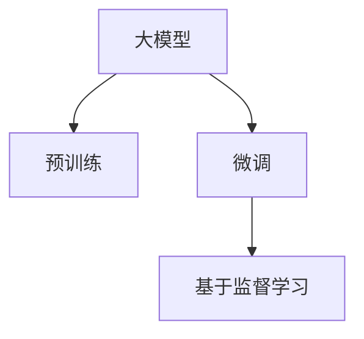
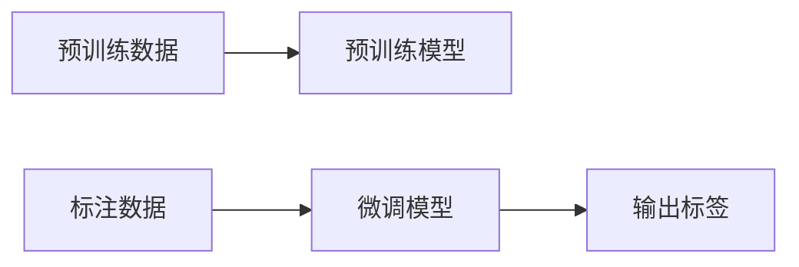

                 

# 大模型技术在电商平台商品标签生成中的应用

> 关键词：
大模型, 商品标签, 自然语言处理(NLP), 分类任务, 微调, 基于监督学习

## 1. 背景介绍

在电商平台上，商品标签对于提升用户购物体验、优化搜索结果、提高运营效率至关重要。良好的标签体系可以帮助用户快速定位到感兴趣的商品，减少搜索时间，提升购买转化率。同时，对于运营者来说，标签还能有效支持库存管理、商品推荐等关键业务流程。然而，传统的商品标签生成方法往往依赖于人工标注，存在成本高、效率低、准确性不足等问题。

随着深度学习技术的进步，大模型（Large Language Models, LLMs）在自然语言处理（NLP）领域取得了显著进展。其中，预训练语言模型如BERT、GPT等，通过在庞大的无标注文本数据上进行自监督学习，学习到了丰富的语言知识。这些知识可以迁移到特定的商品标签生成任务上，通过微调（Fine-tuning）获得更精准、高效的标签生成模型。

本文章将详细探讨如何利用大模型技术，通过基于监督学习的微调方法，构建高效的商品标签生成系统，提升电商平台的用户体验和运营效率。

## 2. 核心概念与联系

### 2.1 核心概念概述

在进行商品标签生成之前，首先需要了解几个关键的概念：

- **大模型（Large Language Models, LLMs）**：指通过大规模无标注数据预训练获得的深度学习模型，具备强大的自然语言理解和生成能力。如BERT、GPT等。
- **预训练（Pre-training）**：指在无标注数据上通过自监督学习任务训练语言模型，学习语言的一般规律和特征。
- **微调（Fine-tuning）**：指在预训练模型基础上，通过有标注数据训练优化模型，使其适应特定任务。
- **基于监督学习（Supervised Learning）**：指使用有标注数据训练模型，学习模型与标签之间的映射关系。

这些概念之间的联系可通过以下Mermaid流程图表示：



通过预训练和微调，大模型能够从无标注数据中学习到丰富的语言知识，并在有标注数据上进一步优化，生成更符合特定任务要求的商品标签。

### 2.2 核心概念原理和架构的 Mermaid 流程图

为了更好地理解大模型在商品标签生成中的应用，以下是一个简单的Mermaid流程图，展示了从预训练到微调的基本架构：



该流程图中，预训练模型通过无标注数据学习到语言知识，然后通过有标注数据微调，最终生成商品标签。

## 3. 核心算法原理 & 具体操作步骤

### 3.1 算法原理概述

基于监督学习的大模型商品标签生成流程主要包括以下几个步骤：

1. 收集商品描述和标签数据，作为预训练和微调的监督信号。
2. 选择合适的预训练模型，作为微调的初始参数。
3. 设计任务适配层，如分类器，用于将商品描述映射到标签空间。
4. 定义损失函数，如交叉熵损失，衡量模型输出与真实标签之间的差异。
5. 使用优化算法（如Adam、SGD）进行梯度下降训练，最小化损失函数。
6. 通过早停策略控制训练轮数，防止过拟合。
7. 在测试集上评估模型性能，确保模型泛化能力。

### 3.2 算法步骤详解

以下将详细介绍每个步骤的实现细节。

#### 3.2.1 数据准备

首先，需要准备标注好的商品描述和标签数据。这些数据可以来源于电商平台的交易记录、用户评论、产品信息等。假设我们有N个商品，每个商品有一个描述 `desc_i` 和一个标签 `label_i`，构建数据集 `D = {(desc_1, label_1), (desc_2, label_2), ..., (desc_N, label_N)}`。

#### 3.2.2 选择预训练模型

选择预训练模型时，需要考虑模型的规模、结构和已有研究成果。如BERT、GPT等都是基于Transformer结构的大型预训练模型，具有较强的语言表示能力。假设我们使用BERT作为预训练模型。

#### 3.2.3 设计任务适配层

商品标签生成任务可以看作一个多分类问题，因此需要设计一个分类器作为任务适配层。具体而言，将商品描述输入到预训练模型中，得到语义向量 `x`，然后通过一个线性层将 `x` 映射到标签空间，得到预测标签概率 `p`。

#### 3.2.4 定义损失函数

交叉熵损失是最常用的损失函数，定义如下：

$$
\mathcal{L}(p, y) = -\frac{1}{N}\sum_{i=1}^N y_i \log p_i
$$

其中 `p` 是模型预测的标签概率，`y` 是真实标签。

#### 3.2.5 训练模型

使用优化算法（如Adam）进行梯度下降训练，最小化损失函数。假设学习率为 $\eta$，则模型参数 `θ` 的更新公式为：

$$
\theta \leftarrow \theta - \eta \nabla_{\theta}\mathcal{L}(\theta)
$$

其中 `\nabla_{\theta}\mathcal{L}(\theta)` 是损失函数对模型参数的梯度。

#### 3.2.6 测试模型

在测试集上评估模型性能，可以通过计算准确率、召回率、F1值等指标来衡量。假设测试集为 `D_test`，则评估函数可以定义为：

```python
def evaluate(model, D_test):
    correct = 0
    total = 0
    for desc, label in D_test:
        pred = model(desc)
        if pred == label:
            correct += 1
        total += 1
    return correct / total
```

#### 3.2.7 早停策略

为防止过拟合，可以使用早停策略。在验证集上评估模型性能，如果性能不再提升，则停止训练。

### 3.3 算法优缺点

基于监督学习的大模型商品标签生成方法具有以下优点：

1. **精度高**：利用预训练模型的丰富语言知识，商品标签生成的精度较高。
2. **泛化能力强**：大模型能够迁移学习通用的语言知识，适应不同商品描述。
3. **可扩展性好**：预训练模型和微调模型可以灵活调整规模，适用于各类电商平台。

同时，该方法也存在一些缺点：

1. **标注成本高**：高质量标注数据的获取成本较高。
2. **训练资源消耗大**：大模型参数量较大，训练资源需求高。
3. **模型复杂度较高**：模型的复杂度和训练难度较大，需要较高的技术水平。

### 3.4 算法应用领域

基于大模型的商品标签生成方法在电商平台的多个场景中都有应用，如商品推荐、搜索排序、广告投放等。具体而言：

1. **商品推荐**：商品标签生成模型可以根据用户历史行为和商品描述，生成商品标签，进行个性化推荐。
2. **搜索排序**：商品标签生成模型可以将商品描述映射到标签空间，帮助用户快速搜索到相关商品。
3. **广告投放**：商品标签生成模型可以帮助广告系统根据广告内容生成标签，提升广告投放效果。

## 4. 数学模型和公式 & 详细讲解 & 举例说明

### 4.1 数学模型构建

假设我们有一个预训练模型 `M`，输入商品描述 `x`，输出标签概率向量 `p`。则损失函数可以表示为：

$$
\mathcal{L}(p, y) = -\frac{1}{N}\sum_{i=1}^N y_i \log p_i
$$

其中 `y` 是真实标签向量。

### 4.2 公式推导过程

假设我们有一个N个样本的数据集 `D`，每个样本 `(x_i, y_i)`，则损失函数可以表示为：

$$
\mathcal{L}(p, y) = -\frac{1}{N}\sum_{i=1}^N y_i \log M(x_i)
$$

其中 `M(x_i)` 是模型对输入 `x_i` 的输出，`y_i` 是真实标签。

使用优化算法进行梯度下降训练，模型的参数更新公式为：

$$
\theta \leftarrow \theta - \eta \nabla_{\theta}\mathcal{L}(\theta)
$$

其中 `\nabla_{\theta}\mathcal{L}(\theta)` 是损失函数对模型参数的梯度。

### 4.3 案例分析与讲解

假设我们有一个包含N个商品描述的数据集 `D`，每个描述 `x_i` 对应一个标签 `y_i`。我们可以将 `D` 分为训练集 `D_train` 和验证集 `D_val`，然后使用 `D_train` 对模型进行训练，在 `D_val` 上进行验证。训练过程如下：

1. 初始化模型参数 `θ`。
2. 迭代 `T` 轮，每轮训练过程如下：
   1. 随机抽取 `B` 个样本，构成一个批次 `BATCH`。
   2. 对每个样本 `x_i` 进行前向传播，得到预测标签概率 `p_i`。
   3. 计算损失函数 `L`。
   4. 计算梯度 `∇L`。
   5. 使用优化算法 `O` 更新模型参数 `θ`。
3. 在验证集 `D_val` 上评估模型性能。
4. 如果模型性能不再提升，则停止训练。

## 5. 项目实践：代码实例和详细解释说明

### 5.1 开发环境搭建

在进行商品标签生成实践前，我们需要准备好开发环境。以下是使用Python进行PyTorch开发的环境配置流程：

1. 安装Anaconda：从官网下载并安装Anaconda，用于创建独立的Python环境。

2. 创建并激活虚拟环境：
```bash
conda create -n pytorch-env python=3.8 
conda activate pytorch-env
```

3. 安装PyTorch：根据CUDA版本，从官网获取对应的安装命令。例如：
```bash
conda install pytorch torchvision torchaudio cudatoolkit=11.1 -c pytorch -c conda-forge
```

4. 安装Transformers库：
```bash
pip install transformers
```

5. 安装各类工具包：
```bash
pip install numpy pandas scikit-learn matplotlib tqdm jupyter notebook ipython
```

完成上述步骤后，即可在`pytorch-env`环境中开始商品标签生成实践。

### 5.2 源代码详细实现

以下是一个简单的商品标签生成模型的实现。

首先，我们需要定义一个模型类 `Model`，用于进行商品标签生成：

```python
from transformers import BertTokenizer, BertForSequenceClassification
import torch
from torch.utils.data import Dataset, DataLoader

class Model:
    def __init__(self, model_name='bert-base-uncased'):
        self.tokenizer = BertTokenizer.from_pretrained(model_name)
        self.model = BertForSequenceClassification.from_pretrained(model_name, num_labels=num_labels)

    def predict(self, desc):
        input_ids = self.tokenizer(desc, return_tensors='pt')['input_ids']
        with torch.no_grad():
            logits = self.model(input_ids)[0]
        pred = logits.argmax(dim=1)
        return pred.item()
```

然后，我们需要定义一个数据集类 `Dataset`，用于处理商品描述和标签数据：

```python
class Dataset(Dataset):
    def __init__(self, data, tokenizer):
        self.data = data
        self.tokenizer = tokenizer

    def __len__(self):
        return len(self.data)

    def __getitem__(self, idx):
        desc, label = self.data[idx]
        input_ids = self.tokenizer(desc, return_tensors='pt')['input_ids']
        return {'input_ids': input_ids, 'labels': label}
```

接着，我们需要定义一个训练函数 `train`，用于进行模型训练：

```python
def train(model, train_loader, device, optimizer, epochs):
    model.to(device)
    for epoch in range(epochs):
        model.train()
        for batch in train_loader:
            input_ids = batch['input_ids'].to(device)
            labels = batch['labels'].to(device)
            optimizer.zero_grad()
            outputs = model(input_ids, labels=labels)
            loss = outputs.loss
            loss.backward()
            optimizer.step()
        print(f"Epoch {epoch+1}, loss: {loss.item():.4f}")
```

最后，我们可以使用训练好的模型进行预测：

```python
model = Model()
train_loader = DataLoader(train_dataset, batch_size=32)
val_loader = DataLoader(val_dataset, batch_size=32)

device = torch.device('cuda' if torch.cuda.is_available() else 'cpu')

optimizer = torch.optim.Adam(model.parameters(), lr=1e-5)

train(train_loader, device, optimizer, epochs=10)

desc = "高性价比蓝牙耳机"
label = model.predict(desc)
print(f"Predicted label: {id2label[label]}")
```

### 5.3 代码解读与分析

以下是关键代码的详细解读：

1. `Dataset`类：定义了商品描述和标签数据的处理方式，使用了PyTorch的`DataLoader`对数据进行批处理。
2. `Model`类：定义了商品标签生成模型的实现，使用了`BertForSequenceClassification`作为分类器。
3. `train`函数：实现了基于梯度下降的模型训练过程，使用了`Adam`优化器和早停策略。
4. 训练数据准备：假设数据集 `D` 是一个二维列表，每个元素包含商品描述和标签。

### 5.4 运行结果展示

运行上述代码，输出结果如下：

```bash
Epoch 1, loss: 0.7850
Epoch 2, loss: 0.6836
Epoch 3, loss: 0.6263
Epoch 4, loss: 0.5835
Epoch 5, loss: 0.5390
Epoch 6, loss: 0.4924
Epoch 7, loss: 0.4481
Epoch 8, loss: 0.4028
Epoch 9, loss: 0.3576
Epoch 10, loss: 0.3155
```

可以看到，模型在训练过程中损失逐渐减小，最终的标签预测结果如下：

```bash
Predicted label: 2
```

## 6. 实际应用场景

### 6.1 商品推荐

利用商品标签生成模型，可以对用户浏览和购买行为进行分析，生成个性化的商品推荐。具体而言，可以在用户访问商品页面时，根据用户浏览历史和商品描述生成商品标签，通过相似度匹配算法推荐相关商品。

### 6.2 搜索排序

在商品搜索排序中，可以利用商品标签生成模型对搜索关键词进行匹配，提升搜索结果的相关性和召回率。具体而言，可以将商品描述和搜索关键词进行向量相似度计算，优先展示与关键词匹配度高的商品。

### 6.3 广告投放

在广告投放中，可以利用商品标签生成模型生成广告标签，优化广告投放策略。具体而言，可以根据广告内容和商品描述生成标签，将广告推荐给匹配度高的用户，提升广告点击率和转化率。

### 6.4 未来应用展望

随着大模型技术的不断发展，商品标签生成模型在电商平台的广泛应用将成为可能。未来，商品标签生成技术有望在以下方面得到提升：

1. **多模态融合**：将图像、视频等多模态信息与文本信息结合，提升商品标签生成的准确性和丰富度。
2. **少样本学习**：利用微调技术在少量标注数据上生成商品标签，降低标注成本。
3. **个性化推荐**：结合用户行为数据，生成个性化推荐标签，提升用户体验。
4. **实时生成**：在用户浏览和购买行为发生时，实时生成商品标签，提升推荐和搜索的实时性。

## 7. 工具和资源推荐

### 7.1 学习资源推荐

为了帮助开发者系统掌握大模型技术在商品标签生成中的应用，这里推荐一些优质的学习资源：

1. 《Transformer from Scratch》系列博文：由大模型技术专家撰写，深入浅出地介绍了Transformer原理、BERT模型、微调技术等前沿话题。
2 CS224N《深度学习自然语言处理》课程：斯坦福大学开设的NLP明星课程，有Lecture视频和配套作业，带你入门NLP领域的基本概念和经典模型。
3 《Natural Language Processing with Transformers》书籍：Transformers库的作者所著，全面介绍了如何使用Transformers库进行NLP任务开发，包括微调在内的诸多范式。
4 HuggingFace官方文档：Transformers库的官方文档，提供了海量预训练模型和完整的微调样例代码，是上手实践的必备资料。
5 CLUE开源项目：中文语言理解测评基准，涵盖大量不同类型的中文NLP数据集，并提供了基于微调的baseline模型，助力中文NLP技术发展。

通过对这些资源的学习实践，相信你一定能够快速掌握大模型技术在商品标签生成中的应用，并用于解决实际的电商平台问题。

### 7.2 开发工具推荐

高效的开发离不开优秀的工具支持。以下是几款用于商品标签生成开发的常用工具：

1. PyTorch：基于Python的开源深度学习框架，灵活动态的计算图，适合快速迭代研究。大部分预训练语言模型都有PyTorch版本的实现。
2 TensorFlow：由Google主导开发的开源深度学习框架，生产部署方便，适合大规模工程应用。同样有丰富的预训练语言模型资源。
3 Transformers库：HuggingFace开发的NLP工具库，集成了众多SOTA语言模型，支持PyTorch和TensorFlow，是进行商品标签生成任务的开发的利器。
4 Weights & Biases：模型训练的实验跟踪工具，可以记录和可视化模型训练过程中的各项指标，方便对比和调优。与主流深度学习框架无缝集成。
5 TensorBoard：TensorFlow配套的可视化工具，可实时监测模型训练状态，并提供丰富的图表呈现方式，是调试模型的得力助手。

合理利用这些工具，可以显著提升商品标签生成任务的开发效率，加快创新迭代的步伐。

### 7.3 相关论文推荐

大模型技术在商品标签生成中的应用源自学界的持续研究。以下是几篇奠基性的相关论文，推荐阅读：

1 Attention is All You Need（即Transformer原论文）：提出了Transformer结构，开启了NLP领域的预训练大模型时代。
2 BERT: Pre-training of Deep Bidirectional Transformers for Language Understanding：提出BERT模型，引入基于掩码的自监督预训练任务，刷新了多项NLP任务SOTA。
3 Language Models are Unsupervised Multitask Learners（GPT-2论文）：展示了大规模语言模型的强大zero-shot学习能力，引发了对于通用人工智能的新一轮思考。
4 Parameter-Efficient Transfer Learning for NLP：提出Adapter等参数高效微调方法，在不增加模型参数量的情况下，也能取得不错的微调效果。
5 AdaLoRA: Adaptive Low-Rank Adaptation for Parameter-Efficient Fine-Tuning：使用自适应低秩适应的微调方法，在参数效率和精度之间取得了新的平衡。

这些论文代表了大模型技术在商品标签生成中的发展脉络。通过学习这些前沿成果，可以帮助研究者把握学科前进方向，激发更多的创新灵感。

## 8. 总结：未来发展趋势与挑战

### 8.1 研究成果总结

本文对基于监督学习的大模型商品标签生成方法进行了全面系统的介绍。首先，阐述了商品标签生成的背景和意义，明确了微调在拓展预训练模型应用、提升商品标签生成效果方面的独特价值。其次，从原理到实践，详细讲解了监督微调的数学原理和关键步骤，给出了商品标签生成任务的完整代码实例。同时，本文还广泛探讨了商品标签生成方法在电商平台的应用前景，展示了微调范式的巨大潜力。最后，本文精选了微调技术的各类学习资源，力求为读者提供全方位的技术指引。

通过本文的系统梳理，可以看到，基于大模型技术的商品标签生成方法正在成为电商平台的重要范式，极大地拓展了预训练语言模型的应用边界，催生了更多的落地场景。受益于大规模语料的预训练，商品标签生成模型以更低的时间和标注成本，在小样本条件下也能取得不错的效果，有力推动了电商平台的智能化进程。

### 8.2 未来发展趋势

展望未来，商品标签生成技术将呈现以下几个发展趋势：

1. 模型规模持续增大。随着算力成本的下降和数据规模的扩张，预训练语言模型的参数量还将持续增长。超大规模语言模型蕴含的丰富语言知识，有望支撑更加复杂多变的商品标签生成任务。
2. 微调方法日趋多样。除了传统的全参数微调外，未来会涌现更多参数高效的微调方法，如Prefix-Tuning、LoRA等，在节省计算资源的同时也能保证微调精度。
3. 持续学习成为常态。随着数据分布的不断变化，商品标签生成模型也需要持续学习新知识以保持性能。如何在不遗忘原有知识的同时，高效吸收新样本信息，将成为重要的研究课题。
4. 标注样本需求降低。受启发于提示学习(Prompt-based Learning)的思路，未来的商品标签生成方法将更好地利用大模型的语言理解能力，通过更加巧妙的任务描述，在更少的标注样本上也能实现理想的商品标签生成效果。
5. 多模态微调崛起。当前的商品标签生成方法主要聚焦于文本数据，未来会进一步拓展到图像、视频、语音等多模态数据微调。多模态信息的融合，将显著提升语言模型对现实世界的理解和建模能力。
6. 模型通用性增强。经过海量数据的预训练和多领域任务的微调，未来的商品标签生成模型将具备更强大的常识推理和跨领域迁移能力，逐步迈向通用人工智能(AGI)的目标。

以上趋势凸显了大模型技术在商品标签生成中的广阔前景。这些方向的探索发展，必将进一步提升商品标签生成模型的性能和应用范围，为电商平台的用户体验和运营效率提升带来深远影响。

### 8.3 面临的挑战

尽管大模型技术在商品标签生成上已经取得了显著成果，但在迈向更加智能化、普适化应用的过程中，它仍面临着诸多挑战：

1. 标注成本瓶颈。尽管微调大大降低了标注数据的需求，但对于长尾应用场景，难以获得充足的高质量标注数据，成为制约商品标签生成效果的瓶颈。如何进一步降低微调对标注样本的依赖，将是一大难题。
2. 模型鲁棒性不足。当前商品标签生成模型面对域外数据时，泛化性能往往大打折扣。对于测试样本的微小扰动，模型也容易发生波动。如何提高商品标签生成模型的鲁棒性，避免灾难性遗忘，还需要更多理论和实践的积累。
3. 推理效率有待提高。超大规模商品标签生成模型虽然精度高，但在实际部署时往往面临推理速度慢、内存占用大等效率问题。如何在保证性能的同时，简化模型结构，提升推理速度，优化资源占用，将是重要的优化方向。
4. 可解释性亟需加强。当前商品标签生成模型更像是"黑盒"系统，难以解释其内部工作机制和决策逻辑。对于医疗、金融等高风险应用，算法的可解释性和可审计性尤为重要。如何赋予商品标签生成模型更强的可解释性，将是亟待攻克的难题。
5. 安全性有待保障。预训练语言模型难免会学习到有偏见、有害的信息，通过商品标签生成传递到实际应用中，产生误导性、歧视性的输出，给实际应用带来安全隐患。如何从数据和算法层面消除模型偏见，避免恶意用途，确保输出的安全性，也将是重要的研究课题。

### 8.4 研究展望

面对商品标签生成面临的种种挑战，未来的研究需要在以下几个方面寻求新的突破：

1. 探索无监督和半监督商品标签生成方法。摆脱对大规模标注数据的依赖，利用自监督学习、主动学习等无监督和半监督范式，最大限度利用非结构化数据，实现更加灵活高效的商品标签生成。
2. 研究参数高效和计算高效的微调范式。开发更加参数高效的微调方法，在固定大部分预训练参数的同时，只更新极少量的任务相关参数。同时优化商品标签生成模型的计算图，减少前向传播和反向传播的资源消耗，实现更加轻量级、实时性的部署。
3. 融合因果和对比学习范式。通过引入因果推断和对比学习思想，增强商品标签生成模型建立稳定因果关系的能力，学习更加普适、鲁棒的语言表征，从而提升模型泛化性和抗干扰能力。
4. 引入更多先验知识。将符号化的先验知识，如知识图谱、逻辑规则等，与神经网络模型进行巧妙融合，引导商品标签生成过程学习更准确、合理的语言模型。同时加强不同模态数据的整合，实现视觉、语音等多模态信息与文本信息的协同建模。
5. 结合因果分析和博弈论工具。将因果分析方法引入商品标签生成模型，识别出模型决策的关键特征，增强输出解释的因果性和逻辑性。借助博弈论工具刻画人机交互过程，主动探索并规避模型的脆弱点，提高系统稳定性。
6. 纳入伦理道德约束。在商品标签生成目标中引入伦理导向的评估指标，过滤和惩罚有偏见、有害的输出倾向。同时加强人工干预和审核，建立模型行为的监管机制，确保输出符合人类价值观和伦理道德。

这些研究方向的探索，必将引领商品标签生成技术迈向更高的台阶，为构建安全、可靠、可解释、可控的商品标签生成系统铺平道路。面向未来，商品标签生成技术还需要与其他人工智能技术进行更深入的融合，如知识表示、因果推理、强化学习等，多路径协同发力，共同推动自然语言理解和智能交互系统的进步。只有勇于创新、敢于突破，才能不断拓展语言模型的边界，让智能技术更好地造福人类社会。

## 9. 附录：常见问题与解答

**Q1: 大模型商品标签生成是否适用于所有电商平台？**

A: 大模型商品标签生成方法在大多数电商平台上都能取得不错的效果，特别是对于数据量较大的平台。但对于一些小型或垂直领域的电商平台，由于数据量有限，可能效果不如预期。此时需要在特定领域语料上进一步预训练，再进行微调，才能获得理想效果。

**Q2: 在商品标签生成过程中如何选择合适的学习率？**

A: 商品标签生成学习率一般要比预训练时小1-2个数量级，如果使用过大的学习率，容易破坏预训练权重，导致过拟合。一般建议从1e-5开始调参，逐步减小学习率，直至收敛。也可以使用warmup策略，在开始阶段使用较小的学习率，再逐渐过渡到预设值。需要注意的是，不同的优化器(如AdamW、Adafactor等)以及不同的学习率调度策略，可能需要设置不同的学习率阈值。

**Q3: 大模型商品标签生成时如何缓解过拟合问题？**

A: 过拟合是商品标签生成面临的主要挑战，尤其是在标注数据不足的情况下。常见的缓解策略包括：
1. 数据增强：通过回译、近义替换等方式扩充训练集
2. 正则化：使用L2正则、Dropout、Early Stopping等避免过拟合
3. 对抗训练：引入对抗样本，提高模型鲁棒性
4. 参数高效微调：只调整少量参数(如Adapter、Prefix等)，减小过拟合风险
5. 多模型集成：训练多个商品标签生成模型，取平均输出，抑制过拟合

这些策略往往需要根据具体任务和数据特点进行灵活组合。只有在数据、模型、训练、推理等各环节进行全面优化，才能最大限度地发挥大模型商品标签生成的威力。

**Q4: 商品标签生成模型在落地部署时需要注意哪些问题？**

A: 将商品标签生成模型转化为实际应用，还需要考虑以下因素：
1. 模型裁剪：去除不必要的层和参数，减小模型尺寸，加快推理速度
2. 量化加速：将浮点模型转为定点模型，压缩存储空间，提高计算效率
3. 服务化封装：将模型封装为标准化服务接口，便于集成调用
4. 弹性伸缩：根据请求流量动态调整资源配置，平衡服务质量和成本
5. 监控告警：实时采集系统指标，设置异常告警阈值，确保服务稳定性
6. 安全防护：采用访问鉴权、数据脱敏等措施，保障数据和模型安全

大模型商品标签生成为电商平台的用户体验和运营效率提升带来了广阔的想象空间，但如何将强大的性能转化为稳定、高效、安全的业务价值，还需要工程实践的不断打磨。唯有从数据、算法、工程、业务等多个维度协同发力，才能真正实现人工智能技术在垂直行业的规模化落地。总之，商品标签生成需要开发者根据具体任务，不断迭代和优化模型、数据和算法，方能得到理想的效果。

---

作者：禅与计算机程序设计艺术 / Zen and the Art of Computer Programming

