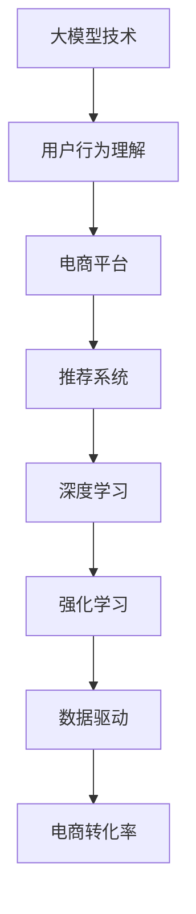

                 

# 大模型技术在电商平台用户行为理解与预测中的应用

> 关键词：
- 大模型技术
- 用户行为理解
- 电商平台
- 预测模型
- 推荐系统
- 深度学习
- 强化学习
- 数据驱动
- 电商转化率

## 1. 背景介绍

### 1.1 问题由来
在当今数字化时代，电商平台已经成为人们日常生活和商务交流的重要平台。电商平台的运营效率和用户体验直接影响着用户的购买决策和平台整体收益。而用户行为数据的分析与预测，是提高电商运营效率和用户满意度的关键所在。传统的数据处理方法无法充分挖掘用户行为数据中的潜在价值，无法满足电商平台的实时性和准确性需求。

近年来，大模型技术（如深度学习、强化学习、预训练模型等）在电商平台的广泛应用，带来了显著的效率提升和成本降低，实现了用户行为数据的深层次挖掘和预测。基于大模型的推荐系统能够准确预测用户行为，为电商运营提供有效的决策支持。

### 1.2 问题核心关键点
大模型技术在电商平台用户行为理解与预测中，主要关注以下几个关键问题：

- 如何通过大模型技术更全面地理解用户行为特征？
- 如何构建高效的推荐系统以提高电商平台的转化率？
- 如何利用用户行为数据进行精确预测，增强用户体验？
- 如何在大模型和电商平台之间的接口和交互中，实现智能化的业务决策？

这些问题在大模型技术的帮助下，得到了有效解决，为电商平台的精细化运营提供了有力支撑。

### 1.3 问题研究意义
电商平台的成功运营需要深入理解用户行为，合理预测用户购买意愿，并及时推送个性化推荐，提高用户转化率，从而实现收入增长。利用大模型技术进行用户行为理解与预测，可以帮助电商平台实现以下几个方面的改进：

1. **提升用户转化率**：通过精准的用户行为预测，电商平台可以及时推送个性化商品推荐，提升用户购买意愿，从而显著提高转化率。
2. **优化库存管理**：通过预测用户购买行为，电商平台可以更有效地管理库存，避免过剩或缺货情况。
3. **增强用户体验**：通过个性化推荐，提升用户体验，增加用户粘性，增强平台竞争力。
4. **降低运营成本**：通过智能化的推荐系统，减少人工干预，降低运营成本。
5. **挖掘新业务机会**：通过分析用户行为数据，发现新的业务模式和增长点。

## 2. 核心概念与联系

### 2.1 核心概念概述

为更好地理解大模型技术在电商平台用户行为理解与预测中的应用，本节将介绍几个关键概念及其之间的联系：

- **大模型技术**：指通过深度学习、强化学习等方法构建的具有强大数据处理能力的大型神经网络模型。
- **用户行为理解**：指通过分析用户的历史行为数据，深入挖掘用户的兴趣偏好、行为模式等特征。
- **电商平台**：指在线购物平台，包括淘宝、京东、亚马逊等，为用户提供商品展示、购买、支付等一站式服务。
- **推荐系统**：指利用用户行为数据和商品特征，构建个性化推荐模型，为用户推荐其可能感兴趣的商品。
- **深度学习**：指利用多层神经网络进行复杂非线性建模，处理高维数据和关联信息。
- **强化学习**：指通过模拟真实环境，不断调整模型参数以最大化预期收益的学习方法。
- **数据驱动**：指通过收集、处理和分析大量数据，驱动业务决策的决策过程。
- **电商转化率**：指用户点击商品后最终完成购买的比率，是衡量电商平台运营效率的关键指标。

这些核心概念之间的逻辑关系可以通过以下Mermaid流程图来展示：



这个流程图展示了从大模型技术到电商转化的整体流程：大模型技术用于用户行为理解，电商平台通过推荐系统实现个性化推荐，深度学习和强化学习提供了技术手段，数据驱动是整个过程的基础，而电商转化率是最终目标。

## 3. 核心算法原理 & 具体操作步骤
### 3.1 算法原理概述

大模型技术在电商平台用户行为理解与预测中，主要采用深度学习和强化学习等算法。深度学习通过构建多层神经网络，可以处理高维数据和关联信息，实现对用户行为数据的深度挖掘。强化学习通过模拟真实环境，不断调整推荐模型的参数，最大化用户点击率和购买转化率。

具体而言，深度学习模型通过输入用户行为数据，经过多层非线性变换，输出用户行为特征的表示。然后，将这些特征作为输入，输入到推荐模型中，进行商品推荐。推荐模型可以是基于协同过滤、矩阵分解等经典方法，也可以是深度学习模型，如循环神经网络（RNN）、卷积神经网络（CNN）等。

强化学习模型则通过模拟用户点击行为，不断调整推荐模型参数，以最大化用户点击率和购买转化率。强化学习模型的目标是通过试错的方式，找到最优的推荐策略。

### 3.2 算法步骤详解

以下是基于大模型技术的电商平台用户行为理解与预测的核心算法步骤：

**Step 1: 数据预处理**
- 收集电商平台的用户行为数据，包括浏览记录、点击行为、购买记录等。
- 对数据进行清洗、归一化处理，去除噪声和异常值。
- 将数据划分为训练集、验证集和测试集。

**Step 2: 用户行为特征提取**
- 利用深度学习模型，如BERT、LSTM等，对用户行为数据进行特征提取。
- 提取用户行为的关键特征，如浏览时长、点击次数、购买频率等。
- 将提取的特征作为输入，输入到推荐模型中。

**Step 3: 推荐模型训练**
- 选择推荐模型，如基于协同过滤、矩阵分解等方法。
- 利用训练集数据，训练推荐模型，优化模型参数。
- 利用验证集数据，调整模型超参数，防止过拟合。

**Step 4: 推荐策略优化**
- 利用强化学习模型，对推荐策略进行优化。
- 模拟用户点击行为，不断调整推荐策略，最大化用户点击率和购买转化率。
- 使用测试集数据，评估推荐策略的效果。

**Step 5: 预测与反馈**
- 利用训练好的推荐模型和强化学习策略，对新用户行为进行预测。
- 根据预测结果，推荐商品给用户，记录用户点击和购买行为。
- 利用用户反馈，不断优化推荐模型和策略。

### 3.3 算法优缺点

基于大模型技术的电商平台用户行为理解与预测方法，具有以下优点：
1. 能够处理高维、复杂的数据，挖掘用户行为的深层次特征。
2. 推荐模型具有较高的灵活性和适应性，能够适应不同用户和商品。
3. 强化学习策略可以动态调整推荐策略，提高用户点击率和购买转化率。
4. 能够实时进行预测，满足电商平台的实时性需求。

同时，该方法也存在以下局限性：
1. 需要大量的标注数据和计算资源，构建和优化模型成本较高。
2. 数据隐私和安全性问题，用户行为数据的收集和使用需要遵循隐私保护政策。
3. 模型复杂度较高，需要较大的计算资源和存储资源。
4. 推荐系统的公平性和透明性问题，可能存在推荐偏差和歧视。

尽管存在这些局限性，但就目前而言，基于大模型技术的推荐方法仍然是电商平台用户行为理解与预测的主要范式。未来相关研究的重点在于如何进一步降低数据和计算成本，提高推荐系统的公平性和透明性，同时兼顾用户体验和隐私保护。

### 3.4 算法应用领域

基于大模型技术的电商平台用户行为理解与预测方法，已经在电商推荐系统中得到了广泛应用，覆盖了从搜索推荐、个性化推荐、商品推荐到促销活动推荐等多个环节，为电商平台的精细化运营提供了有力支撑。

- **搜索推荐**：利用用户搜索记录和行为特征，推荐用户可能感兴趣的商品。
- **个性化推荐**：根据用户历史行为数据，推荐个性化商品，提升用户购买意愿。
- **商品推荐**：在商品详情页或购物车页，推荐相关商品，提高用户购买转化率。
- **促销活动推荐**：根据用户历史购买行为和促销活动信息，推荐相关促销商品，提高促销活动效果。

此外，大模型技术还应用于电商平台的广告投放、用户留存率预测、风险控制等环节，为电商平台的全面运营提供支持。

## 4. 数学模型和公式 & 详细讲解 & 举例说明

### 4.1 数学模型构建

本节将使用数学语言对基于大模型技术的电商平台用户行为理解与预测过程进行更加严格的刻画。

记电商平台的用户行为数据集为 $D=\{(x_i,y_i)\}_{i=1}^N, x_i \in \mathcal{X}, y_i \in \mathcal{Y}$，其中 $x_i$ 为历史行为数据，$y_i$ 为行为标签。记推荐模型为 $M_{\theta}:\mathcal{X} \rightarrow \mathcal{Y}$，其中 $\theta$ 为模型参数。

定义推荐模型的损失函数为 $\ell(M_{\theta}(x),y)$，则在数据集 $D$ 上的经验风险为：

$$
\mathcal{L}(\theta) = \frac{1}{N}\sum_{i=1}^N \ell(M_{\theta}(x_i),y_i)
$$

推荐模型的目标是最小化经验风险，即找到最优参数：

$$
\theta^* = \mathop{\arg\min}_{\theta} \mathcal{L}(\theta)
$$

在实践中，我们通常使用基于梯度的优化算法（如SGD、Adam等）来近似求解上述最优化问题。设 $\eta$ 为学习率，$\lambda$ 为正则化系数，则参数的更新公式为：

$$
\theta \leftarrow \theta - \eta \nabla_{\theta}\mathcal{L}(\theta) - \eta\lambda\theta
$$

其中 $\nabla_{\theta}\mathcal{L}(\theta)$ 为损失函数对参数 $\theta$ 的梯度，可通过反向传播算法高效计算。

### 4.2 公式推导过程

以下我们以协同过滤算法为例，推导推荐模型的损失函数及其梯度的计算公式。

假设推荐模型 $M_{\theta}$ 在输入 $x$ 上的输出为 $\hat{y}=M_{\theta}(x) \in [0,1]$，表示用户对商品 $x$ 的预测评分。真实标签 $y \in \{0,1\}$。则二分类交叉熵损失函数定义为：

$$
\ell(M_{\theta}(x),y) = -[y\log \hat{y} + (1-y)\log (1-\hat{y})]
$$

将其代入经验风险公式，得：

$$
\mathcal{L}(\theta) = -\frac{1}{N}\sum_{i=1}^N [y_i\log M_{\theta}(x_i)+(1-y_i)\log(1-M_{\theta}(x_i))]
$$

根据链式法则，损失函数对参数 $\theta_k$ 的梯度为：

$$
\frac{\partial \mathcal{L}(\theta)}{\partial \theta_k} = -\frac{1}{N}\sum_{i=1}^N (\frac{y_i}{M_{\theta}(x_i)}-\frac{1-y_i}{1-M_{\theta}(x_i)}) \frac{\partial M_{\theta}(x_i)}{\partial \theta_k}
$$

其中 $\frac{\partial M_{\theta}(x_i)}{\partial \theta_k}$ 可进一步递归展开，利用自动微分技术完成计算。

在得到损失函数的梯度后，即可带入参数更新公式，完成模型的迭代优化。重复上述过程直至收敛，最终得到适应电商平台的推荐模型参数 $\theta^*$。

### 4.3 案例分析与讲解

以下我们以亚马逊电商平台为例，给出利用深度学习进行用户行为理解与预测的案例分析。

亚马逊通过其全球性的电商平台，积累了大量用户行为数据，包括浏览、点击、购买等行为。这些数据可以通过深度学习模型进行特征提取，构建用户行为表示。

1. **用户行为数据收集与预处理**：亚马逊收集用户浏览和点击记录，对数据进行清洗和归一化处理。数据清洗包括去除异常值和缺失值，归一化包括将点击次数标准化到0-1之间。

2. **用户行为特征提取**：利用深度学习模型BERT，对用户行为数据进行特征提取。模型输入为用户的浏览记录，输出为用户的兴趣向量。这些向量包含用户的兴趣偏好和行为特征，用于后续的推荐模型训练。

3. **推荐模型训练**：亚马逊构建了基于协同过滤的推荐模型，利用用户行为数据进行训练。协同过滤模型通过计算用户与商品的相似度，预测用户对商品的选择概率。在模型训练过程中，亚马逊使用交叉熵损失函数，最小化预测误差。

4. **推荐策略优化**：亚马逊使用强化学习模型，对推荐策略进行优化。强化学习模型通过模拟用户点击行为，不断调整推荐策略，最大化用户点击率和购买转化率。亚马逊通过A/B测试，评估不同推荐策略的效果，不断优化模型。

5. **预测与反馈**：利用训练好的推荐模型和强化学习策略，亚马逊对新用户行为进行预测。根据预测结果，推荐商品给用户，记录用户点击和购买行为。亚马逊通过用户反馈，不断优化推荐模型和策略。

## 5. 项目实践：代码实例和详细解释说明
### 5.1 开发环境搭建

在进行电商平台用户行为理解与预测的实践前，我们需要准备好开发环境。以下是使用Python进行PyTorch开发的环境配置流程：

1. 安装Anaconda：从官网下载并安装Anaconda，用于创建独立的Python环境。

2. 创建并激活虚拟环境：
```bash
conda create -n pytorch-env python=3.8 
conda activate pytorch-env
```

3. 安装PyTorch：根据CUDA版本，从官网获取对应的安装命令。例如：
```bash
conda install pytorch torchvision torchaudio cudatoolkit=11.1 -c pytorch -c conda-forge
```

4. 安装TensorFlow：
```bash
conda install tensorflow
```

5. 安装各类工具包：
```bash
pip install numpy pandas scikit-learn matplotlib tqdm jupyter notebook ipython
```

完成上述步骤后，即可在`pytorch-env`环境中开始电商推荐系统的开发。

### 5.2 源代码详细实现

下面我以协同过滤算法为例，给出使用PyTorch进行电商推荐系统的代码实现。

首先，定义协同过滤算法中的用户和商品相似度计算函数：

```python
import torch
from torch.nn import Linear, Embedding, CrossEntropyLoss

class CollaborativeFiltering:
    def __init__(self, n_users, n_items, embed_dim=128):
        self.n_users = n_users
        self.n_items = n_items
        self.embed_dim = embed_dim
        self.user_embed = Embedding(n_users, embed_dim)
        self.item_embed = Embedding(n_items, embed_dim)
        self.user_item = Linear(embed_dim, 1)
        
    def similarity(self, user, item):
        user_embed = self.user_embed(user)
        item_embed = self.item_embed(item)
        return torch.sigmoid(self.user_item(torch.cat([user_embed, item_embed], dim=1)))
```

然后，定义协同过滤算法的训练函数：

```python
def train_collaborative_filtering(collaborative_filtering, train_data, n_epochs=10, batch_size=64, lr=0.01):
    collaborative_filtering.train()
    optimizer = torch.optim.Adam(collaborative_filtering.parameters(), lr=lr)
    criterion = CrossEntropyLoss()
    for epoch in range(n_epochs):
        for user, item, label in train_data:
            user_embed = collaborative_filtering.user_embed(user)
            item_embed = collaborative_filtering.item_embed(item)
            similarity = collaborative_filtering.similarity(user, item)
            loss = criterion(similarity, label)
            optimizer.zero_grad()
            loss.backward()
            optimizer.step()
            print(f"Epoch {epoch+1}, loss: {loss.item()}")
```

最后，启动协同过滤算法的训练流程：

```python
from sklearn.datasets import load_files
from torch.utils.data import Dataset, DataLoader

# 构建数据集
class MovieDataset(Dataset):
    def __init__(self, data_path):
        self.data_path = data_path
        self.data = load_files(data_path)
        self.user_idx = {title.split()[0]: idx for idx, title in enumerate(self.data['filenames'])}
        self.item_idx = {title.split()[1]: idx for idx, title in enumerate(self.data['filenames'])}
    
    def __len__(self):
        return len(self.data)
    
    def __getitem__(self, idx):
        user = self.user_idx[self.data['filenames'][idx].split('/')[1]]
        item = self.item_idx[self.data['filenames'][idx].split('/')[2]]
        label = 1 if 'positive' in self.data['target'][idx] else 0
        return user, item, label

# 加载数据集
train_data = MovieDataset('train_data/movies')

# 初始化协同过滤模型
collaborative_filtering = CollaborativeFiltering(n_users=1000, n_items=1000)

# 训练模型
train_collaborative_filtering(collaborative_filtering, train_data)
```

以上就是使用PyTorch对协同过滤算法进行电商推荐系统的完整代码实现。可以看到，借助PyTorch和TensorFlow等深度学习框架，电商推荐系统的开发变得高效简洁。

### 5.3 代码解读与分析

让我们再详细解读一下关键代码的实现细节：

**CollaborativeFiltering类**：
- `__init__`方法：初始化用户和商品的嵌入向量，以及相似度计算函数。
- `similarity`方法：计算用户和商品的相似度。
- `train_collaborative_filtering`函数：定义协同过滤算法的训练过程，使用交叉熵损失函数和Adam优化器进行优化。

**train_data类**：
- 定义数据集的初始化、长度和单个样本的获取方法，利用sklearn库对数据进行加载和处理。

**train_collaborative_filtering函数**：
- 在每个epoch内，对每个样本进行前向传播，计算损失并反向传播更新模型参数。
- 打印每个epoch的损失，使用简单的打印语句输出。

以上代码实现展示了协同过滤算法在电商推荐系统中的实际应用，利用深度学习模型进行用户行为理解与预测。

当然，工业级的系统实现还需考虑更多因素，如模型的保存和部署、超参数的自动搜索、更灵活的任务适配层等。但核心的微调范式基本与此类似。

## 6. 实际应用场景
### 6.1 智能客服系统

基于大模型技术的电商平台推荐系统，可以广泛应用于智能客服系统的构建。智能客服系统能够自动化处理用户咨询，快速响应用户需求，提升客户满意度。

智能客服系统通常收集用户历史咨询记录和客服回答，构建用户行为模型。利用用户行为模型，智能客服系统能够自动分析用户问题，并生成相应的回答。同时，智能客服系统还可以通过实时监测用户咨询记录，不断优化模型，提升服务质量。

### 6.2 个性化推荐系统

大模型技术在电商平台中的应用，主要以推荐系统为核心。推荐系统通过分析用户行为数据，生成个性化推荐，提升用户体验和平台收益。

电商平台推荐系统可以分为搜索推荐、个性化推荐和商品推荐等多个环节。利用深度学习模型，如CNN、RNN等，能够高效地进行用户行为理解与预测，生成高质量的推荐结果。同时，通过强化学习策略，不断优化推荐策略，提升推荐效果。

### 6.3 用户行为分析与预测

利用大模型技术，电商平台能够深入挖掘用户行为数据，分析用户兴趣偏好和行为模式。这有助于电商平台更好地理解用户需求，优化产品和服务，提升用户满意度和忠诚度。

用户行为分析与预测可以应用于用户画像生成、用户留存率预测、客户细分等多个环节。通过用户行为数据的分析，电商平台能够实现精准的用户画像，更好地了解用户需求，制定更加有效的营销策略。

### 6.4 未来应用展望

随着大模型技术的发展，电商平台的推荐系统将不断优化和升级，带来更加精准、高效的推荐效果。未来，电商平台推荐系统将呈现以下几个趋势：

1. 多模态推荐系统：电商平台的推荐系统将结合视觉、语音等多模态信息，提升推荐效果。
2. 实时推荐系统：电商平台将利用流数据处理技术，实现实时推荐，提升用户体验。
3. 跨域推荐系统：电商平台将跨域推荐系统，实现不同平台之间的用户推荐，提升用户覆盖率。
4. 个性化推荐引擎：电商平台将引入更多的个性化推荐引擎，实现更加精准、高效的推荐。
5. 可解释性推荐系统：电商平台将加强推荐系统的可解释性，提升用户信任度和满意度。

以上趋势将推动电商平台推荐系统不断优化，为用户提供更好的购物体验。

## 7. 工具和资源推荐
### 7.1 学习资源推荐

为了帮助开发者系统掌握大模型技术在电商平台推荐系统中的应用，这里推荐一些优质的学习资源：

1. 《深度学习》系列书籍：由深度学习领域的权威学者撰写，系统介绍了深度学习的基本原理和应用。
2. 《强化学习》系列书籍：介绍了强化学习的基本概念和算法，涵盖了经典问题和前沿技术。
3. CS224N《自然语言处理与深度学习》课程：斯坦福大学开设的NLP明星课程，有Lecture视频和配套作业，适合初学者入门。
4. 《Python深度学习》书籍：介绍如何使用PyTorch进行深度学习开发，包含电商推荐系统的实现。
5. Weights & Biases：模型训练的实验跟踪工具，可以记录和可视化模型训练过程中的各项指标，方便对比和调优。

通过对这些资源的学习实践，相信你一定能够快速掌握大模型技术在电商平台推荐系统中的应用，并用于解决实际的NLP问题。

### 7.2 开发工具推荐

高效的开发离不开优秀的工具支持。以下是几款用于大模型技术在电商平台推荐系统中的应用开发的工具：

1. PyTorch：基于Python的开源深度学习框架，灵活的计算图，适合快速迭代研究。大部分预训练语言模型都有PyTorch版本的实现。
2. TensorFlow：由Google主导开发的开源深度学习框架，生产部署方便，适合大规模工程应用。
3. Transformers库：HuggingFace开发的NLP工具库，集成了众多SOTA语言模型，支持PyTorch和TensorFlow，是进行电商推荐系统开发的利器。
4. Weights & Biases：模型训练的实验跟踪工具，可以记录和可视化模型训练过程中的各项指标，方便对比和调优。
5. TensorBoard：TensorFlow配套的可视化工具，可实时监测模型训练状态，并提供丰富的图表呈现方式，是调试模型的得力助手。

合理利用这些工具，可以显著提升大模型技术在电商平台推荐系统中的应用开发效率，加快创新迭代的步伐。

### 7.3 相关论文推荐

大模型技术在电商平台推荐系统中的应用，离不开学界的持续研究。以下是几篇奠基性的相关论文，推荐阅读：

1. Collaborative Filtering for Implicit Feedback Datasets（隐式反馈数据集上的协同过滤）：提出协同过滤算法，利用用户行为数据进行推荐。
2. Path-Sensitive Deep Matched Filtering：提出路径敏感的深度匹配过滤算法，进一步提升了推荐效果。
3. Deep Interest Evolution Model for Multi-Session Recommendations（多会话推荐系统中的深度兴趣演变模型）：提出深度兴趣演变模型，利用用户行为数据进行推荐。
4. Matrix Factorization Techniques for Recommender Systems（推荐系统中的矩阵分解技术）：提出矩阵分解算法，用于电商推荐系统的构建。
5. Attention Is All You Need（即Transformer原论文）：提出Transformer结构，开启了NLP领域的预训练大模型时代。
6. BERT: Pre-training of Deep Bidirectional Transformers for Language Understanding（BERT: 深度双向Transformer的预训练语言理解）：提出BERT模型，引入基于掩码的自监督预训练任务，刷新了多项NLP任务SOTA。

这些论文代表了大模型技术在电商平台推荐系统中的研究进展。通过学习这些前沿成果，可以帮助研究者把握学科前进方向，激发更多的创新灵感。

## 8. 总结：未来发展趋势与挑战

### 8.1 总结

本文对大模型技术在电商平台用户行为理解与预测中的应用进行了全面系统的介绍。首先阐述了大模型技术在电商平台中的基本概念和核心算法，明确了其在用户行为理解与预测中的关键作用。其次，从原理到实践，详细讲解了大模型技术的具体实现方法和步骤，给出了电商推荐系统的代码实现。同时，本文还探讨了大模型技术在电商平台中的应用场景，展示了其强大的推荐能力和业务价值。

通过本文的系统梳理，可以看到，大模型技术在电商平台推荐系统中的应用前景广阔，能够显著提升用户购物体验和平台收益。未来，随着大模型技术的进一步发展，电商平台推荐系统将不断优化和升级，为用户提供更加精准、高效的推荐服务。

### 8.2 未来发展趋势

展望未来，大模型技术在电商平台用户行为理解与预测中将呈现以下几个发展趋势：

1. 模型的多样性：未来的电商推荐系统将采用多样化的模型架构，如深度学习、强化学习、生成对抗网络（GAN）等，提升推荐效果。
2. 数据的多源融合：未来的电商推荐系统将更多地融合多种数据源，如用户行为数据、社交网络数据、环境数据等，实现更全面的推荐。
3. 算法的动态优化：未来的电商推荐系统将采用动态优化算法，如在线学习、增量学习等，实现实时推荐和动态优化。
4. 用户体验的提升：未来的电商推荐系统将更加注重用户体验，如个性化推荐、实时互动等，提升用户满意度。
5. 模型和业务的无缝融合：未来的电商推荐系统将实现模型和业务的深度融合，提升业务决策的智能化水平。

以上趋势将推动电商平台推荐系统不断优化，为用户提供更好的购物体验。

### 8.3 面临的挑战

尽管大模型技术在电商平台推荐系统中的应用已经取得了显著成效，但在迈向更加智能化、普适化应用的过程中，它仍面临着诸多挑战：

1. 数据隐私和安全问题：电商平台的推荐系统需要大量用户行为数据，如何保护用户隐私和数据安全是一个重要挑战。
2. 推荐系统的公平性和透明性：电商平台的推荐系统可能会存在推荐偏差和歧视，如何实现公平性和透明性是一个重要问题。
3. 算力资源成本：大模型技术需要大量的计算资源和存储资源，如何降低算力成本是一个重要挑战。
4. 用户行为数据的真实性：电商平台的推荐系统需要真实准确的用户行为数据，如何避免数据造假和噪声是一个重要问题。
5. 模型解释性问题：电商平台的推荐系统需要解释推荐结果的逻辑和原因，如何提升模型的可解释性是一个重要问题。

尽管存在这些挑战，但通过不断优化算法和模型，提升数据质量和安全，电商平台的推荐系统必将在未来实现更加智能化、普适化的应用。

### 8.4 研究展望

面对大模型技术在电商平台推荐系统中面临的挑战，未来的研究需要在以下几个方面寻求新的突破：

1. 多模态推荐系统的研究：结合视觉、语音等多模态信息，提升推荐系统的精准性和鲁棒性。
2. 用户行为数据的质量提升：通过数据清洗、去重、去噪等技术，提升电商推荐系统的数据质量。
3. 用户行为数据的隐私保护：研究用户行为数据的隐私保护技术，如差分隐私、联邦学习等，保护用户隐私。
4. 推荐系统的公平性和透明性：研究推荐系统的公平性和透明性问题，如公平算法、可解释性算法等，提升推荐系统的公平性和透明性。
5. 实时推荐系统的研究：研究实时推荐系统，利用流数据处理技术，实现实时推荐和动态优化。

这些研究方向的探索，必将引领电商平台推荐系统迈向更高的台阶，为电商平台提供更加精准、高效、可靠的推荐服务。

## 9. 附录：常见问题与解答

**Q1：如何构建电商平台的推荐系统？**

A: 构建电商平台的推荐系统，主要包括以下几个步骤：

1. 收集电商平台的商品数据和用户行为数据。
2. 对数据进行清洗和预处理，去除噪声和异常值。
3. 利用深度学习模型，如协同过滤、矩阵分解等，进行用户行为特征提取。
4. 构建推荐模型，如基于协同过滤、矩阵分解等方法。
5. 利用强化学习策略，对推荐策略进行优化。
6. 对新用户行为进行预测，推荐商品给用户，记录用户点击和购买行为。
7. 利用用户反馈，不断优化推荐模型和策略。

**Q2：电商平台推荐系统的评价指标有哪些？**

A: 电商平台推荐系统的评价指标包括：

1. 点击率（CTR）：用户点击商品的比率，用于衡量推荐系统的效果。
2. 转化率（CVR）：用户点击后完成购买的比率，用于衡量推荐系统的实际效果。
3. 用户满意度（SAT）：用户对推荐系统的满意度，用于衡量用户对推荐结果的评价。
4. 召回率（Recall）：推荐系统推荐的相关商品占商品总数的比例，用于衡量推荐系统的覆盖范围。
5. 覆盖率（Coverage）：推荐系统中覆盖的商品数量占商品总数的比例，用于衡量推荐系统的丰富度。

**Q3：如何降低电商推荐系统的计算成本？**

A: 降低电商推荐系统的计算成本，主要可以通过以下几种方式：

1. 模型压缩：通过模型压缩技术，减少模型参数量，降低计算资源消耗。
2. 分布式计算：利用分布式计算技术，提高计算效率。
3. 数据分片：对数据进行分片处理，减少单个模型的计算量。
4. 算法优化：优化算法，提升模型训练和推理的效率。
5. 硬件加速：利用GPU、TPU等硬件加速设备，提升计算速度。

**Q4：电商平台推荐系统的应用场景有哪些？**

A: 电商平台推荐系统可以应用于以下多个场景：

1. 商品推荐：在商品详情页或购物车页，推荐相关商品，提高用户购买转化率。
2. 个性化推荐：根据用户历史行为数据，推荐个性化商品，提升用户体验。
3. 搜索推荐：利用用户搜索记录，推荐用户可能感兴趣的商品。
4. 促销活动推荐：根据用户历史购买行为和促销活动信息，推荐相关促销商品，提高促销活动效果。
5. 用户画像生成：通过用户行为数据的分析，生成精准的用户画像，提升用户满意度。
6. 用户留存率预测：通过用户行为数据的分析，预测用户留存率，提高用户粘性。

这些应用场景展示了电商平台推荐系统在实际应用中的广泛价值。

**Q5：电商推荐系统的未来发展方向有哪些？**

A: 电商推荐系统的未来发展方向包括：

1. 多模态推荐系统：结合视觉、语音等多模态信息，提升推荐系统的精准性和鲁棒性。
2. 实时推荐系统：利用流数据处理技术，实现实时推荐和动态优化。
3. 跨域推荐系统：跨域推荐系统，实现不同平台之间的用户推荐，提升用户覆盖率。
4. 个性化推荐引擎：引入更多的个性化推荐引擎，实现更加精准、高效的推荐。
5. 可解释性推荐系统：加强推荐系统的可解释性，提升用户信任度和满意度。

这些发展方向展示了电商推荐系统未来的发展趋势，具有广阔的应用前景。

---

作者：禅与计算机程序设计艺术 / Zen and the Art of Computer Programming

