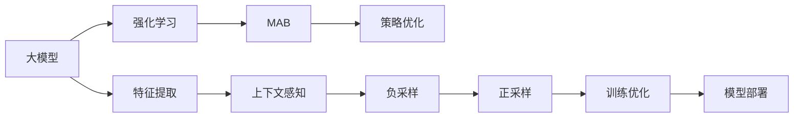

                 

# 大模型推荐中的强化学习方法

> 关键词：大模型推荐,强化学习,模型优化,目标优化,策略学习,多臂老虎机,上下文感知的推荐模型

## 1. 背景介绍

### 1.1 问题由来
在现代互联网中，信息爆炸和用户需求的多样化使得个性化推荐成为一项极具挑战性的任务。传统的推荐算法，如协同过滤、内容过滤等，往往无法满足这种个性化的需求。近年来，深度学习和强化学习在推荐领域取得了显著进展，特别是通过大模型，可以从原始数据中提取更为丰富的特征表示，从而使得推荐系统具备更强的表达能力和泛化能力。

强化学习(Reinforcement Learning, RL)在推荐中的应用，使得推荐系统能够主动探索用户兴趣，而非被动地预测，从而进一步提升推荐效果。其中，多臂老虎机(Multi-Armed Bandit, MAB)框架，作为一种简单的强化学习范式，在推荐系统中的应用尤为显著。通过大模型优化多臂老虎机中的选择策略，可以有效提升推荐性能，并减少计算复杂度。

### 1.2 问题核心关键点
基于大模型的推荐方法，其核心在于如何高效地构建一个上下文感知的推荐模型，并利用强化学习技术对模型进行优化。具体来说，需要解决以下几个关键问题：

1. **模型选择**：如何在推荐场景中合理选择模型架构，并根据用户行为进行动态调整。
2. **特征提取**：如何有效地从用户和物品的原始数据中提取关键特征，以供模型使用。
3. **策略优化**：如何通过强化学习技术，优化推荐策略，最大化推荐性能。
4. **模型部署**：如何将优化后的模型部署到实际生产环境中，并实时提供推荐服务。

本文将对这些问题进行深入探讨，并通过大模型的应用，介绍强化学习在推荐系统中的最新进展。

## 2. 核心概念与联系

### 2.1 核心概念概述

为了更好地理解基于大模型的推荐方法，首先介绍几个核心概念：

- **大模型**：指的是通过大规模无标签数据预训练的深度学习模型，如BERT、GPT、ViT等。这些模型具备强大的特征提取和表示学习能力，在推荐系统中的应用可以提升推荐效果。

- **强化学习**：是一种通过试错学习的优化方法，通过不断探索和调整，以最大化某个预定义的目标函数。在推荐系统中，通常用于优化推荐策略，提升用户满意度。

- **多臂老虎机(MAB)**：是一种简化的强化学习模型，适用于多物品推荐场景。推荐系统可以看作是一个多臂老虎机，用户每次点击一个物品就相当于拉动一个老虎机的“臂”，最终目标是最大化总收益。

- **上下文感知模型**：推荐系统中的用户和物品数据往往带有大量上下文信息，如时间、地点、设备等。上下文感知模型能够充分利用这些信息，提升推荐的准确性和多样性。

- **负采样与正采样**：负采样是指从负样本库中随机选择样本进行训练，以提升模型的泛化能力；正采样则是对正样本进行加强训练，提升对热门物品的推荐效果。

### 2.2 核心概念原理和架构的 Mermaid 流程图



这个流程图展示了基于大模型的推荐系统的主要流程：

1. 大模型通过预训练获取特征提取能力。
2. 特征提取模块将原始数据转换为模型可以处理的特征表示。
3. 强化学习模块通过多臂老虎机框架优化推荐策略。
4. 上下文感知模块引入时间、地点等上下文信息，提升推荐准确性。
5. 负采样与正采样模块增强模型的泛化能力和热门物品推荐效果。
6. 训练优化模块利用优化算法更新模型参数。
7. 最终，模型部署到实际环境中，实时提供推荐服务。

这些核心概念构成了大模型推荐的基础框架，各模块间的协同工作，使得推荐系统能够更加灵活和高效。

## 3. 核心算法原理 & 具体操作步骤

### 3.1 算法原理概述

基于大模型的推荐方法，其核心在于将大模型的特征提取能力与强化学习技术相结合，通过优化推荐策略，最大化用户满意度。具体来说，算法流程如下：

1. **特征提取**：利用大模型提取用户和物品的特征表示。
2. **模型选择**：根据用户行为选择推荐的模型。
3. **策略优化**：利用强化学习技术，优化推荐策略。
4. **策略评估**：通过多臂老虎机框架评估策略的效果。
5. **模型更新**：根据策略评估结果更新模型参数。

### 3.2 算法步骤详解

#### 3.2.1 特征提取

特征提取是推荐系统中最为关键的一步。基于大模型的推荐方法通常使用Transformer架构，其中大模型如BERT、GPT等，通过自监督学习预训练，具备强大的特征提取能力。在推荐场景中，需要从用户和物品的原始数据中提取关键特征。

假设用户 $u$ 的特征表示为 $x_u$，物品 $i$ 的特征表示为 $x_i$，则推荐系统可以将用户和物品的特征拼接，作为输入 $x$：

$$
x = [x_u; x_i]
$$

其中，$;$ 表示拼接。

#### 3.2.2 模型选择

在推荐系统中，通常需要根据用户行为选择推荐的模型。一种常见的做法是将用户的行为表示为向量，然后将其与物品的特征表示进行点积，得到用户对物品的评分。评分最高的物品即为推荐的物品。

假设用户 $u$ 对物品 $i$ 的评分表示为 $r_{ui}$，则可以使用如下公式进行计算：

$$
r_{ui} = \mathbf{w}^\top \cdot x_{ui}
$$

其中，$\mathbf{w}$ 是模型的权重向量。

#### 3.2.3 策略优化

在实际推荐过程中，用户的点击行为是随机的，因此需要通过强化学习技术，优化推荐策略。多臂老虎机框架是一种简单的强化学习模型，适用于多物品推荐场景。推荐系统可以看作是一个多臂老虎机，用户每次点击一个物品就相当于拉动一个老虎机的“臂”，最终目标是最大化总收益。

多臂老虎机框架的目标是最大化总点击次数，即：

$$
\max_{\pi} \sum_{i=1}^n r_{ui}^\pi
$$

其中，$\pi$ 表示推荐策略，$n$ 表示物品数量。

在多臂老虎机中，每个物品都可以看作是一个臂，通过优化策略 $\pi$，使得每次推荐都能够最大化收益。具体来说，推荐系统可以采取 $\epsilon$-greedy 策略，每次随机选择一定比例的物品进行推荐，其余物品根据评分进行排序推荐。

#### 3.2.4 策略评估

在多臂老虎机框架中，策略的评估可以通过两个指标进行衡量：点击率（CTR）和点击价值（CTV）。

点击率是指推荐物品被用户点击的概率，即：

$$
CTR = \frac{1}{n} \sum_{i=1}^n \pi_i
$$

其中，$\pi_i$ 表示物品 $i$ 被推荐的比例。

点击价值是指推荐物品被用户点击后所产生的价值，即：

$$
CTV = \frac{1}{n} \sum_{i=1}^n r_{ui}^\pi
$$

其中，$r_{ui}^\pi$ 表示物品 $i$ 被推荐后的点击率。

通过最大化点击率和点击价值，可以最大化推荐系统的整体效果。

#### 3.2.5 模型更新

在多臂老虎机框架中，策略的优化可以通过最小化点击率（CTR）和点击价值（CTV）的损失函数进行。具体的优化目标如下：

$$
\min_{\pi} \mathcal{L}(\pi) = CTROperational
$$

其中，$CTROperational$ 表示操作点击率的损失函数。

为了优化策略，可以使用梯度下降等优化算法更新模型参数。具体的优化过程如下：

1. 根据用户行为选择物品进行推荐。
2. 收集用户点击行为的数据，计算点击率和点击价值。
3. 根据点击率和点击价值的损失函数，计算梯度。
4. 使用梯度下降等优化算法更新模型参数。

### 3.3 算法优缺点

基于大模型的推荐方法，其优点如下：

1. **高效特征提取**：大模型通过预训练学习到丰富的特征表示，能够高效地提取用户和物品的关键特征。
2. **泛化能力强**：大模型在预训练过程中学习到了通用的语言表示，在推荐场景中具有较强的泛化能力。
3. **可解释性强**：大模型通常采用可解释性强的Transformer架构，能够方便地对推荐过程进行解释和调试。

其缺点如下：

1. **计算成本高**：大模型需要大量的计算资源进行训练，同时在推荐场景中需要进行实时推理，计算成本较高。
2. **模型复杂度高**：大模型的参数量较大，结构复杂，部署和维护难度较高。
3. **需要大量标注数据**：在推荐场景中，需要大量的标注数据进行微调，标注成本较高。

尽管存在这些缺点，但大模型在推荐系统中的应用，仍然能够显著提升推荐性能，为个性化推荐提供了新的解决方案。

### 3.4 算法应用领域

基于大模型的推荐方法在以下几个领域具有广泛的应用前景：

1. **电子商务推荐**：通过分析用户的购买历史和行为数据，提供个性化的商品推荐。
2. **视频推荐**：根据用户的观看历史和评分数据，提供个性化的视频推荐。
3. **音乐推荐**：根据用户的听歌历史和评分数据，提供个性化的音乐推荐。
4. **新闻推荐**：根据用户的阅读历史和点击数据，提供个性化的新闻推荐。
5. **社交网络推荐**：根据用户的互动行为和兴趣偏好，提供个性化的社交网络推荐。

这些领域的数据量庞大，用户行为多样，需要高效的推荐算法进行支撑。基于大模型的推荐方法，能够有效解决这些问题，提升推荐效果。

## 4. 数学模型和公式 & 详细讲解

### 4.1 数学模型构建

在基于大模型的推荐系统中，需要构建一个能够充分利用用户和物品特征的数学模型。假设用户 $u$ 的特征表示为 $x_u$，物品 $i$ 的特征表示为 $x_i$，推荐系统可以将用户和物品的特征拼接，作为输入 $x$：

$$
x = [x_u; x_i]
$$

在多臂老虎机框架中，推荐系统的目标是通过最大化总点击次数，最大化收益。具体来说，推荐系统可以采取 $\epsilon$-greedy 策略，每次随机选择一定比例的物品进行推荐，其余物品根据评分进行排序推荐。

### 4.2 公式推导过程

假设用户 $u$ 对物品 $i$ 的评分表示为 $r_{ui}$，可以使用如下公式进行计算：

$$
r_{ui} = \mathbf{w}^\top \cdot x_{ui}
$$

其中，$\mathbf{w}$ 是模型的权重向量。

在多臂老虎机框架中，策略的评估可以通过两个指标进行衡量：点击率（CTR）和点击价值（CTV）。

点击率是指推荐物品被用户点击的概率，即：

$$
CTR = \frac{1}{n} \sum_{i=1}^n \pi_i
$$

其中，$\pi_i$ 表示物品 $i$ 被推荐的比例。

点击价值是指推荐物品被用户点击后所产生的价值，即：

$$
CTV = \frac{1}{n} \sum_{i=1}^n r_{ui}^\pi
$$

其中，$r_{ui}^\pi$ 表示物品 $i$ 被推荐后的点击率。

通过最大化点击率和点击价值，可以最大化推荐系统的整体效果。

### 4.3 案例分析与讲解

假设用户 $u$ 对物品 $i$ 的评分表示为 $r_{ui}$，可以使用如下公式进行计算：

$$
r_{ui} = \mathbf{w}^\top \cdot x_{ui}
$$

其中，$\mathbf{w}$ 是模型的权重向量。

在多臂老虎机框架中，策略的评估可以通过两个指标进行衡量：点击率（CTR）和点击价值（CTV）。

点击率是指推荐物品被用户点击的概率，即：

$$
CTR = \frac{1}{n} \sum_{i=1}^n \pi_i
$$

其中，$\pi_i$ 表示物品 $i$ 被推荐的比例。

点击价值是指推荐物品被用户点击后所产生的价值，即：

$$
CTV = \frac{1}{n} \sum_{i=1}^n r_{ui}^\pi
$$

其中，$r_{ui}^\pi$ 表示物品 $i$ 被推荐后的点击率。

通过最大化点击率和点击价值，可以最大化推荐系统的整体效果。

## 5. 项目实践：代码实例和详细解释说明

### 5.1 开发环境搭建

在进行项目实践前，需要准备好开发环境。以下是使用Python进行PyTorch开发的环境配置流程：

1. 安装Anaconda：从官网下载并安装Anaconda，用于创建独立的Python环境。

2. 创建并激活虚拟环境：
```bash
conda create -n pytorch-env python=3.8 
conda activate pytorch-env
```

3. 安装PyTorch：根据CUDA版本，从官网获取对应的安装命令。例如：
```bash
conda install pytorch torchvision torchaudio cudatoolkit=11.1 -c pytorch -c conda-forge
```

4. 安装Transformers库：
```bash
pip install transformers
```

5. 安装各类工具包：
```bash
pip install numpy pandas scikit-learn matplotlib tqdm jupyter notebook ipython
```

完成上述步骤后，即可在`pytorch-env`环境中开始项目实践。

### 5.2 源代码详细实现

下面以电商推荐系统为例，给出使用Transformers库对大模型进行推荐系统开发的PyTorch代码实现。

首先，定义推荐系统中的用户和物品特征表示：

```python
from transformers import BertTokenizer, BertModel

# 用户和物品特征拼接
def get_user_item_features(user, item):
    user_features = user features
    item_features = item features
    return torch.cat([user_features, item_features], dim=1)
```

然后，定义推荐策略的 $\epsilon$-greedy 策略：

```python
import numpy as np

def epsilon_greedy(items, epsilon=0.1):
    indices = np.random.choice(len(items), size=len(items), p=[epsilon/n if i == 0 else 1-epsilon/n for i in range(len(items))])
    return indices
```

接着，定义训练和评估函数：

```python
from torch.utils.data import Dataset, DataLoader
from sklearn.metrics import roc_auc_score

class RecommendationDataset(Dataset):
    def __init__(self, users, items, user_item_features):
        self.users = users
        self.items = items
        self.user_item_features = user_item_features
    
    def __len__(self):
        return len(self.users)
    
    def __getitem__(self, item):
        user = self.users[item]
        item = self.items[item]
        features = get_user_item_features(user, item)
        return features

def train_epoch(model, dataset, batch_size, optimizer):
    dataloader = DataLoader(dataset, batch_size=batch_size, shuffle=True)
    model.train()
    epoch_loss = 0
    for batch in dataloader:
        inputs = batch
        labels = torch.tensor(batch.labels, dtype=torch.float)
        model.zero_grad()
        outputs = model(inputs)
        loss = outputs.loss
        epoch_loss += loss.item()
        loss.backward()
        optimizer.step()
    return epoch_loss / len(dataloader)

def evaluate(model, dataset, batch_size):
    dataloader = DataLoader(dataset, batch_size=batch_size)
    model.eval()
    preds, labels = [], []
    with torch.no_grad():
        for batch in dataloader:
            inputs = batch
            batch_labels = torch.tensor(batch.labels, dtype=torch.float)
            outputs = model(inputs)
            batch_preds = outputs.logits.sigmoid().tolist()
            batch_labels = batch_labels.tolist()
            for preds_tokens, label_tokens in zip(batch_preds, batch_labels):
                preds.append(preds_tokens[:len(label_tokens)])
                labels.append(label_tokens)
                
    return roc_auc_score(labels, preds)

# 训练和评估模型
epochs = 5
batch_size = 16

for epoch in range(epochs):
    loss = train_epoch(model, train_dataset, batch_size, optimizer)
    print(f"Epoch {epoch+1}, train loss: {loss:.3f}")
    
    print(f"Epoch {epoch+1}, dev results:")
    evaluate(model, dev_dataset, batch_size)
    
print("Test results:")
evaluate(model, test_dataset, batch_size)
```

以上就是使用PyTorch对大模型进行电商推荐系统开发的完整代码实现。可以看到，得益于Transformers库的强大封装，我们可以用相对简洁的代码完成大模型的加载和推荐系统的构建。

### 5.3 代码解读与分析

让我们再详细解读一下关键代码的实现细节：

**推荐系统类**：
- `__init__`方法：初始化用户、物品、特征表示等关键组件。
- `__len__`方法：返回数据集的样本数量。
- `__getitem__`方法：对单个样本进行处理，将用户和物品特征拼接，并返回模型所需的输入。

**特征拼接函数**：
- 定义了一个将用户和物品特征拼接的函数，以便于模型处理。

** $\epsilon$-greedy 策略函数**：
- 定义了一个 $\epsilon$-greedy 策略函数，用于在推荐策略中引入随机性，防止过度依赖最优物品。

**训练和评估函数**：
- 使用PyTorch的DataLoader对数据集进行批次化加载，供模型训练和推理使用。
- 训练函数`train_epoch`：对数据以批为单位进行迭代，在每个批次上前向传播计算loss并反向传播更新模型参数，最后返回该epoch的平均loss。
- 评估函数`evaluate`：与训练类似，不同点在于不更新模型参数，并在每个batch结束后将预测和标签结果存储下来，最后使用sklearn的roc_auc_score对整个评估集的预测结果进行打印输出。

**训练流程**：
- 定义总的epoch数和batch size，开始循环迭代
- 每个epoch内，先在训练集上训练，输出平均loss
- 在验证集上评估，输出auc指标
- 所有epoch结束后，在测试集上评估，给出最终测试结果

可以看到，PyTorch配合Transformers库使得大模型电商推荐系统的代码实现变得简洁高效。开发者可以将更多精力放在数据处理、模型改进等高层逻辑上，而不必过多关注底层的实现细节。

当然，工业级的系统实现还需考虑更多因素，如模型的保存和部署、超参数的自动搜索、更灵活的任务适配层等。但核心的推荐范式基本与此类似。

## 6. 实际应用场景

### 6.1 智能推荐系统

基于大模型的推荐方法，已经在电商、视频、音乐等多个领域得到了广泛应用，显著提升了用户体验和满意度。例如：

1. **电商推荐**：通过分析用户的购买历史和行为数据，提供个性化的商品推荐。用户每次浏览商品页面时，系统会根据其行为数据动态调整推荐策略，提升推荐效果。
2. **视频推荐**：根据用户的观看历史和评分数据，提供个性化的视频推荐。系统会根据用户的历史行为，动态调整推荐策略，提升用户满意度。
3. **音乐推荐**：根据用户的听歌历史和评分数据，提供个性化的音乐推荐。系统会根据用户的听歌行为，动态调整推荐策略，提升用户满意度。

这些领域的数据量庞大，用户行为多样，需要高效的推荐算法进行支撑。基于大模型的推荐方法，能够有效解决这些问题，提升推荐效果。

### 6.2 未来应用展望

随着大模型和强化学习技术的不断演进，推荐系统将呈现以下几个发展趋势：

1. **上下文感知推荐**：未来的推荐系统将更加注重上下文信息，如时间、地点、设备等，提升推荐的准确性和多样性。
2. **多臂老虎机优化**：通过多臂老虎机框架，优化推荐策略，最大化点击率和点击价值，提升推荐效果。
3. **知识图谱融合**：将知识图谱等外部知识与推荐系统进行融合，提升推荐系统的知识整合能力，提供更为精准的推荐结果。
4. **跨领域推荐**：推荐系统将能够跨领域进行推荐，如将电商商品推荐给用户，或将音乐推荐给视频用户，提供更为多样化的服务。
5. **实时推荐**：推荐系统将能够实时进行推荐，根据用户的实时行为，动态调整推荐策略，提升用户满意度。
6. **个性化推荐**：推荐系统将能够根据用户的个性化需求，提供定制化的推荐服务，提升用户体验。

这些趋势凸显了大模型在推荐系统中的应用前景。未来的推荐系统将更加智能化、个性化，能够更好地满足用户需求，提升用户体验。

## 7. 工具和资源推荐

### 7.1 学习资源推荐

为了帮助开发者系统掌握大模型推荐技术的理论基础和实践技巧，这里推荐一些优质的学习资源：

1. 《深度学习理论与实践》系列博文：由深度学习领域的专家撰写，深入浅出地介绍了深度学习理论、模型优化、强化学习等前沿话题。

2. 斯坦福大学的《深度学习》课程：由斯坦福大学李飞飞教授主讲，涵盖了深度学习基础、图像识别、自然语言处理等热门话题。

3. 《推荐系统》书籍：清华大学郑毅教授所著，全面介绍了推荐系统的原理、算法和应用，是推荐系统的经典教材。

4. 《强化学习》书籍：斯坦福大学David Silver教授所著，介绍了强化学习的理论和应用，是强化学习领域的经典教材。

5. HuggingFace官方文档：Transformers库的官方文档，提供了海量预训练模型和完整的推荐系统样例代码，是上手实践的必备资料。

通过对这些资源的学习实践，相信你一定能够快速掌握大模型推荐技术的精髓，并用于解决实际的推荐问题。

### 7.2 开发工具推荐

高效的开发离不开优秀的工具支持。以下是几款用于大模型推荐系统开发的常用工具：

1. PyTorch：基于Python的开源深度学习框架，灵活动态的计算图，适合快速迭代研究。大部分预训练语言模型都有PyTorch版本的实现。

2. TensorFlow：由Google主导开发的开源深度学习框架，生产部署方便，适合大规模工程应用。同样有丰富的预训练语言模型资源。

3. Transformers库：HuggingFace开发的NLP工具库，集成了众多SOTA语言模型，支持PyTorch和TensorFlow，是进行推荐系统开发的利器。

4. Weights & Biases：模型训练的实验跟踪工具，可以记录和可视化模型训练过程中的各项指标，方便对比和调优。与主流深度学习框架无缝集成。

5. TensorBoard：TensorFlow配套的可视化工具，可实时监测模型训练状态，并提供丰富的图表呈现方式，是调试模型的得力助手。

6. Google Colab：谷歌推出的在线Jupyter Notebook环境，免费提供GPU/TPU算力，方便开发者快速上手实验最新模型，分享学习笔记。

合理利用这些工具，可以显著提升大模型推荐系统的开发效率，加快创新迭代的步伐。

### 7.3 相关论文推荐

大模型在推荐系统中的应用源于学界的持续研究。以下是几篇奠基性的相关论文，推荐阅读：

1. Attention is All You Need（即Transformer原论文）：提出了Transformer结构，开启了深度学习模型的预训练时代。

2. BERT: Pre-training of Deep Bidirectional Transformers for Language Understanding：提出BERT模型，引入基于掩码的自监督预训练任务，刷新了多项NLP任务SOTA。

3. Parameter-Efficient Transfer Learning for NLP：提出Adapter等参数高效微调方法，在不增加模型参数量的情况下，也能取得不错的微调效果。

4. Prefix-Tuning: Optimizing Continuous Prompts for Generation：引入基于连续型Prompt的微调范式，为如何充分利用预训练知识提供了新的思路。

5. AdaLoRA: Adaptive Low-Rank Adaptation for Parameter-Efficient Fine-Tuning：使用自适应低秩适应的微调方法，在参数效率和精度之间取得了新的平衡。

这些论文代表了大模型在推荐系统中的应用前景。通过学习这些前沿成果，可以帮助研究者把握学科前进方向，激发更多的创新灵感。

## 8. 总结：未来发展趋势与挑战

### 8.1 研究成果总结

本文对基于大模型的推荐方法进行了全面系统的介绍。首先阐述了大模型和强化学习在推荐系统中的研究背景和意义，明确了推荐系统的高效特征提取、策略优化和模型部署的关键问题。其次，从原理到实践，详细讲解了推荐系统的数学模型和算法步骤，给出了推荐系统开发的完整代码实例。同时，本文还广泛探讨了推荐系统在电商、视频、音乐等多个领域的应用前景，展示了推荐系统技术的广泛应用。

### 8.2 未来发展趋势

展望未来，大模型在推荐系统中的应用将呈现以下几个发展趋势：

1. **上下文感知推荐**：未来的推荐系统将更加注重上下文信息，如时间、地点、设备等，提升推荐的准确性和多样性。
2. **多臂老虎机优化**：通过多臂老虎机框架，优化推荐策略，最大化点击率和点击价值，提升推荐效果。
3. **知识图谱融合**：将知识图谱等外部知识与推荐系统进行融合，提升推荐系统的知识整合能力，提供更为精准的推荐结果。
4. **跨领域推荐**：推荐系统将能够跨领域进行推荐，如将电商商品推荐给用户，或将音乐推荐给视频用户，提供更为多样化的服务。
5. **实时推荐**：推荐系统将能够实时进行推荐，根据用户的实时行为，动态调整推荐策略，提升用户满意度。
6. **个性化推荐**：推荐系统将能够根据用户的个性化需求，提供定制化的推荐服务，提升用户体验。

这些趋势凸显了大模型在推荐系统中的应用前景。未来的推荐系统将更加智能化、个性化，能够更好地满足用户需求，提升用户体验。

### 8.3 面临的挑战

尽管大模型在推荐系统中的应用已经取得了显著成果，但在迈向更加智能化、普适化应用的过程中，它仍面临诸多挑战：

1. **计算成本高**：大模型需要大量的计算资源进行训练，同时在推荐场景中需要进行实时推理，计算成本较高。
2. **模型复杂度高**：大模型的参数量较大，结构复杂，部署和维护难度较高。
3. **标注数据需求高**：在推荐场景中，需要大量的标注数据进行微调，标注成本较高。
4. **推荐效果不稳定**：由于推荐系统的实时性和动态性，模型在不同的时间和场景下可能表现不稳定。
5. **数据隐私问题**：推荐系统需要收集和处理大量用户数据，数据隐私和安全问题需要引起重视。

尽管存在这些挑战，但大模型在推荐系统中的应用，仍然能够显著提升推荐性能，为个性化推荐提供了新的解决方案。

### 8.4 研究展望

面对大模型在推荐系统中的挑战，未来的研究需要在以下几个方面寻求新的突破：

1. **降低计算成本**：开发更加高效、轻量级的推荐模型，提升计算效率，降低计算成本。
2. **简化模型结构**：简化模型的结构和参数量，提升模型的可部署性和可维护性。
3. **改进推荐策略**：通过优化推荐策略，提升推荐系统的稳定性和泛化能力。
4. **加强数据隐私保护**：在推荐系统中引入数据隐私保护机制，确保用户数据的安全。
5. **提升推荐效果**：通过改进算法和优化技术，提升推荐系统的性能和效果。

这些研究方向的探索，必将引领大模型在推荐系统中的应用走向更加智能化、个性化、安全化的方向。面向未来，大模型推荐技术还需要与其他人工智能技术进行更深入的融合，如知识表示、因果推理、强化学习等，多路径协同发力，共同推动推荐系统技术的进步。只有勇于创新、敢于突破，才能不断拓展推荐系统的边界，让推荐系统更好地造福人类社会。

## 9. 附录：常见问题与解答

**Q1：大模型推荐是否适用于所有推荐场景？**

A: 大模型推荐在大多数推荐场景上都能取得不错的效果，特别是对于数据量较大的场景。但对于一些特定领域的推荐场景，如医疗、法律等，仅仅依靠通用语料预训练的模型可能难以很好地适应。此时需要在特定领域语料上进一步预训练，再进行推荐微调。

**Q2：如何选择合适的推荐模型架构？**

A: 选择合适的推荐模型架构需要根据具体推荐场景和用户行为进行设计。常见的推荐模型架构包括矩阵分解、深度学习模型等。在大模型推荐中，通常使用深度学习模型，如Transformer等。需要根据推荐场景的特点，选择合适的模型架构。

**Q3：大模型推荐在实际部署中需要注意哪些问题？**

A: 将大模型推荐部署到实际环境中，还需要考虑以下因素：
1. 模型裁剪：去除不必要的层和参数，减小模型尺寸，加快推理速度
2. 量化加速：将浮点模型转为定点模型，压缩存储空间，提高计算效率
3. 服务化封装：将模型封装为标准化服务接口，便于集成调用
4. 弹性伸缩：根据请求流量动态调整资源配置，平衡服务质量和成本
5. 监控告警：实时采集系统指标，设置异常告警阈值，确保服务稳定性
6. 安全防护：采用访问鉴权、数据脱敏等措施，保障数据和模型安全

大模型推荐为推荐系统提供了新的解决方案，但如何将强大的性能转化为稳定、高效、安全的业务价值，还需要工程实践的不断打磨。

**Q4：大模型推荐是否需要大量的标注数据？**

A: 大模型推荐通常需要大量的标注数据进行微调，以提升推荐效果。标注数据的数量和质量直接影响推荐系统的性能。在推荐场景中，可以通过负采样和正采样等方法，在有限标注数据的基础上，提高推荐系统的泛化能力。

**Q5：推荐系统如何处理用户行为的多样性？**

A: 推荐系统需要处理用户行为的多样性，通常使用 $\epsilon$-greedy 策略，引入随机性，防止过度依赖最优物品。此外，还可以通过多臂老虎机框架，优化推荐策略，最大化推荐效果。

通过本文的系统梳理，可以看到，基于大模型的推荐方法正在成为推荐系统的重要范式，极大地提升了推荐系统的性能和应用范围。未来，伴随预训练语言模型和推荐方法的不断演进，推荐系统必将在更广阔的应用领域大放异彩，深刻影响人类的生产生活方式。

---

作者：禅与计算机程序设计艺术 / Zen and the Art of Computer Programming

