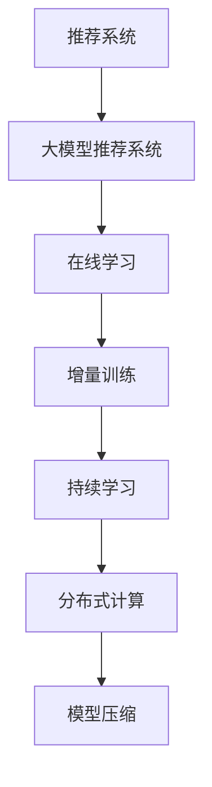

                 

# 大模型推荐中的模型更新与在线学习技术创新

> 关键词：大模型推荐,模型更新,在线学习,推荐系统,优化算法,模型压缩,迁移学习

## 1. 背景介绍

### 1.1 问题由来
随着互联网和移动互联网的普及，推荐系统已经成为各大互联网公司的重要工具。传统的推荐算法如协同过滤、基于内容的推荐等，面临着数据稀疏性、计算成本高、推荐多样性不足等挑战。为了应对这些挑战，近年来深度学习在大规模推荐系统中的广泛应用，显著提升了推荐效果。其中，基于深度学习的大模型推荐系统，在推荐性能和用户满意度方面都取得了显著进步。

然而，大模型推荐系统也面临着数据分布变化、模型计算成本高等问题。如何在大规模推荐场景中，快速适应新数据变化，高效更新模型参数，同时确保推荐效果和用户体验，是大模型推荐系统需要不断探索和创新的方向。在线学习技术，正是在这一背景下应运而生，并成为大模型推荐系统的重要优化手段。

### 1.2 问题核心关键点
在线学习技术，也被称为增量学习、持续学习等，是指在推荐系统中，模型能够实时地根据新用户的反馈数据进行动态更新，从而提升推荐效果。与传统的离线学习范式不同，在线学习能够实现快速响应用户需求的变化，特别是在数据量较大、更新频率较高的推荐场景中，如广告推荐、新闻推荐等，具有显著的优势。

在线学习的主要优点包括：
- 快速适应新数据。通过实时学习，能够迅速捕捉用户反馈，及时调整推荐策略。
- 减少计算开销。仅对少量样本进行梯度更新，避免全量数据重新训练，降低计算成本。
- 提升推荐效果。实时更新模型，能够更精准地匹配用户当前需求，提高推荐精度。
- 减少过拟合风险。基于在线学习的推荐模型能够持续地从新数据中学习，避免过拟合。

尽管在线学习具有显著的优势，但其实现过程涉及许多复杂的技术细节，如模型更新策略、增量训练算法、分布式计算框架等。本文将从核心概念、算法原理、实际操作等方面，对在线学习技术进行全面介绍，并结合具体应用场景，展示其在推荐系统中的强大生命力。

### 1.3 问题研究意义
研究大模型推荐中的模型更新与在线学习技术，对于提升推荐系统性能，满足用户多样化需求，降低推荐系统的计算成本，具有重要意义：

1. 提升推荐效果。在线学习能够快速捕捉用户反馈，实时调整推荐策略，提升推荐精准度和多样性。
2. 降低计算开销。相较于离线学习，在线学习仅对少量数据进行更新，显著降低计算资源消耗。
3. 快速响应变化。在线学习能够实时适应新数据和新用户行为，有效应对推荐场景中的动态变化。
4. 实现增量训练。在线学习通过小批量梯度更新，能够在数据不断增加的情况下持续提升模型性能。
5. 提高用户满意度。通过动态优化推荐内容，在线学习能够更好地满足用户个性化需求，提升用户体验。

在线学习技术在推荐系统中的应用，不仅可以提升推荐的实时性和精准度，还能显著降低大规模推荐系统的计算成本，具有重要的实用价值和应用前景。

## 2. 核心概念与联系

### 2.1 核心概念概述

为更好地理解在线学习在大模型推荐系统中的应用，本节将介绍几个关键概念：

- 推荐系统(Recommender System)：根据用户历史行为和数据特征，推荐用户可能感兴趣的产品或内容。
- 大模型推荐系统(Large Model Recommendation System)：使用预训练的深度学习模型，作为推荐系统的特征提取器，提升推荐效果。
- 在线学习(Online Learning)：通过实时更新模型参数，动态适应新数据和新用户行为的推荐技术。
- 增量训练(Incremental Training)：针对新数据进行小批量梯度更新，避免全量数据重新训练的方法。
- 持续学习(Continual Learning)：模型能够不断从新数据中学习，同时保留已有知识，避免灾难性遗忘。
- 分布式计算(Distributed Computing)：将计算任务分布到多个节点上，实现高效的并行处理。
- 模型压缩(Model Compression)：通过剪枝、量化、蒸馏等方法，减少模型参数和计算资源消耗。

这些概念之间的逻辑关系可以通过以下Mermaid流程图来展示：



这个流程图展示了大模型推荐系统中，在线学习与其他关键技术之间的关系：

1. 推荐系统使用大模型作为推荐模型的特征提取器。
2. 在线学习通过增量训练和持续学习技术，动态更新大模型的参数，提升推荐效果。
3. 分布式计算优化在线学习的计算过程，提高效率。
4. 模型压缩减少在线学习的计算开销，提高模型性能。

这些概念共同构成了在线学习在大模型推荐系统中的技术框架，使得推荐系统能够实时响应用户需求，高效地进行推荐。

## 3. 核心算法原理 & 具体操作步骤
### 3.1 算法原理概述

在线学习在大模型推荐系统中的应用，本质上是一个动态优化模型参数的过程。其核心思想是：利用新用户的反馈数据，实时更新模型参数，以提升推荐效果。具体而言，可以采用增量训练和持续学习等技术，实现模型的动态更新。

增量训练(Incremental Training)：在推荐系统中，每次获取新数据时，只使用一小部分样本对模型参数进行更新，而不会对整个数据集进行重新训练。这样可以减少计算开销，提高实时性。

持续学习(Continual Learning)：模型能够不断从新数据中学习，同时保留已有的知识，避免遗忘。这样可以更好地适应新数据和用户行为的变化，提升推荐效果。

### 3.2 算法步骤详解

以下是典型的在线学习在大模型推荐系统中的具体步骤：

**Step 1: 准备数据集和模型**
- 收集用户的历史行为数据，并标记为训练集。
- 设计大模型的架构，如Transformer等，作为推荐系统的特征提取器。
- 选择适当的优化器，如Adam、SGD等，并设置合适的超参数。

**Step 2: 定义损失函数**
- 根据推荐任务，定义损失函数。对于点击率预测任务，可以采用二分类交叉熵损失；对于召回率预测任务，可以采用平均绝对误差损失。

**Step 3: 增量训练**
- 获取新数据样本，划分训练集和验证集。
- 在训练集上计算模型预测值和真实值的差，即损失函数。
- 使用梯度下降等优化算法，更新模型参数。
- 在验证集上评估模型性能，调整超参数。
- 重复上述过程，直到模型收敛或达到预设的迭代次数。

**Step 4: 持续学习**
- 每隔固定时间间隔，使用新数据对模型进行更新。
- 引入新数据的特征向量，计算更新后的损失函数。
- 使用梯度下降等优化算法，更新模型参数。
- 评估模型在新数据上的表现，调整学习率和更新策略。
- 持续更新模型，保持推荐效果。

**Step 5: 分布式计算**
- 在推荐系统中，数据量往往非常庞大，需要分布式计算框架，如Spark、TensorFlow等，实现高效的并行计算。
- 将数据集划分为多个子集，分配到不同的计算节点上进行增量训练。
- 每个节点独立更新模型参数，合并结果得到全局模型。
- 定期更新全局模型，确保数据一致性。

**Step 6: 模型压缩**
- 大模型的参数量较大，计算资源消耗高。可以采用模型压缩技术，如剪枝、量化、蒸馏等，减少参数和计算资源消耗。
- 剪枝：去除冗余参数，保留重要部分。
- 量化：将浮点参数转化为定点参数，减少存储空间和计算开销。
- 蒸馏：使用小型模型对大模型进行知识蒸馏，保留关键特征。

通过以上步骤，可以实现大模型推荐系统中的在线学习，动态更新模型参数，提升推荐效果。

### 3.3 算法优缺点

在线学习在大模型推荐系统中的应用，具有以下优点：
1. 实时性高。能够实时捕捉用户反馈，动态调整推荐策略。
2. 计算开销小。仅对少量数据进行更新，避免全量数据重新训练。
3. 推荐效果好。通过动态优化，提升推荐精准度和多样性。
4. 易于扩展。分布式计算和增量训练，使得模型能够在大规模数据上高效运行。
5. 适应性强。能够持续从新数据中学习，适应用户行为的变化。

同时，在线学习也存在一些局限性：
1. 模型复杂度高。需要设计合适的增量更新策略，避免参数漂移。
2. 更新过程不稳定。小批量梯度更新可能带来更新方向的不稳定，需要引入动量等优化技术。
3. 内存占用大。在线学习过程中，需要存储大量中间结果，占用内存空间较大。
4. 模型更新难度大。在线学习过程需要频繁调整模型参数，增加调试难度。

尽管存在这些局限性，但就目前而言，在线学习仍然是提升推荐系统性能的重要手段。未来相关研究的重点在于如何进一步降低在线学习的计算开销，提高模型的实时性和稳定性，同时兼顾可扩展性和可解释性等因素。

### 3.4 算法应用领域

在线学习技术在大模型推荐系统中的应用，已经涵盖了推荐系统的大部分领域，例如：

- 广告推荐：对用户的点击行为进行实时预测和优化，提升广告点击率和转化率。
- 新闻推荐：根据用户的历史阅读记录，实时推荐相关新闻，提升用户粘性和满意度。
- 电商推荐：对用户的购买历史和浏览行为进行实时分析，推荐相关商品，提高销售转化率。
- 视频推荐：根据用户的观看记录，实时推荐相关视频内容，提升用户观看体验。
- 社交推荐：根据用户的社交网络行为，实时推荐好友、群组等社交内容，增强社交互动。

除了这些常见应用外，在线学习还被创新性地应用到更多场景中，如音乐推荐、内容推荐、产品推荐等，为推荐系统带来了新的突破。随着在线学习方法的不断演进，相信推荐系统必将在更广阔的应用领域大放异彩。

## 4. 数学模型和公式 & 详细讲解 & 举例说明
### 4.1 数学模型构建

以下是在线学习在大模型推荐系统中的数学模型构建：

假设推荐系统中有 $N$ 个用户 $u_i$，每个用户对 $M$ 个物品 $v_j$ 的行为 $I_{ij} \in \{0,1\}$，其中 $1$ 表示用户 $u_i$ 对物品 $v_j$ 产生了兴趣。大模型的预测输出为 $A_{ij} \in [0,1]$，表示物品 $v_j$ 对用户 $u_i$ 的兴趣程度。在线学习的目标是最小化预测值与实际值之间的误差：

$$
L = \frac{1}{N}\sum_{i=1}^N \sum_{j=1}^M \ell(A_{ij},I_{ij})
$$

其中 $\ell$ 为损失函数，如二分类交叉熵损失。

### 4.2 公式推导过程

以下是在线学习在大模型推荐系统中的公式推导过程：

假设模型参数为 $\theta$，初始值为 $\theta_0$。第 $t$ 次迭代时，模型接收到了新用户 $u_i$ 的新行为 $I_{ij}^{(t)}$，模型预测为 $A_{ij}^{(t)}$。根据增量训练和持续学习策略，模型的更新公式为：

$$
\theta \leftarrow \theta - \eta \nabla_{\theta} \ell(A_{ij}^{(t)},I_{ij}^{(t)})
$$

其中 $\eta$ 为学习率，$\nabla_{\theta} \ell(A_{ij}^{(t)},I_{ij}^{(t)})$ 为损失函数对模型参数的梯度。

在线学习的核心思想是，每次只对少量的用户行为进行更新，保留大部分参数不变，以减少计算开销。同时，模型能够持续从新数据中学习，避免遗忘已有知识，提升推荐效果。

### 4.3 案例分析与讲解

假设在电商推荐系统中，一个新用户 $u_i$ 购买了商品 $v_j$。在线学习模型通过以下步骤，动态更新推荐策略：

1. 收集用户历史行为数据 $D=\{I_{ik}\}_{k=1}^{t-1}$，计算用户对商品 $v_j$ 的兴趣概率 $A_{ij}^{(t)}$。
2. 计算新行为的误差 $\delta = I_{ij}^{(t)} - A_{ij}^{(t)}$。
3. 使用梯度下降更新模型参数 $\theta \leftarrow \theta - \eta \nabla_{\theta} \ell(A_{ij}^{(t)},I_{ij}^{(t)})$。
4. 每隔一定时间间隔，重新计算模型预测，更新推荐策略。

通过不断迭代和更新，在线学习模型能够实时捕捉用户行为的变化，动态调整推荐策略，提升推荐效果。

## 5. 项目实践：代码实例和详细解释说明
### 5.1 开发环境搭建

在进行在线学习实践前，我们需要准备好开发环境。以下是使用Python进行PyTorch开发的环境配置流程：

1. 安装Anaconda：从官网下载并安装Anaconda，用于创建独立的Python环境。

2. 创建并激活虚拟环境：
```bash
conda create -n pytorch-env python=3.8 
conda activate pytorch-env
```

3. 安装PyTorch：根据CUDA版本，从官网获取对应的安装命令。例如：
```bash
conda install pytorch torchvision torchaudio cudatoolkit=11.1 -c pytorch -c conda-forge
```

4. 安装TensorFlow：根据CUDA版本，从官网获取对应的安装命令。例如：
```bash
pip install tensorflow-gpu
```

5. 安装PyTorch Lightning：一个高效的PyTorch框架，适合开发分布式训练的机器学习应用。
```bash
pip install pytorch-lightning
```

6. 安装Horovod：一个分布式深度学习框架，支持跨节点并行训练。
```bash
pip install horovod
```

完成上述步骤后，即可在`pytorch-env`环境中开始在线学习实践。

### 5.2 源代码详细实现

下面我们以电商推荐系统为例，给出使用PyTorch Lightning和Horovod进行在线学习的PyTorch代码实现。

首先，定义推荐模型：

```python
import torch.nn as nn
import torch.nn.functional as F

class Recommender(nn.Module):
    def __init__(self, emb_dim, num_items):
        super(Recommender, self).__init__()
        self.emb_dim = emb_dim
        self.num_items = num_items
        self.fc1 = nn.Linear(emb_dim, 256)
        self.fc2 = nn.Linear(256, num_items)
        
    def forward(self, x):
        x = F.relu(self.fc1(x))
        x = self.fc2(x)
        return x
```

然后，定义损失函数：

```python
import torch
import torch.nn as nn

class Loss(nn.Module):
    def __init__(self):
        super(Loss, self).__init__()
        
    def forward(self, pred, target):
        return F.binary_cross_entropy(pred, target)
```

接下来，定义在线学习模型：

```python
import torch
import torch.nn as nn
import torch.nn.functional as F
from torch.utils.data import DataLoader
from torch.optim import Adam
import horovod.torch as hvd
from pytorch_lightning import Trainer, LightningModule

class OnlineRecommender(LightningModule):
    def __init__(self, emb_dim, num_items):
        super(OnlineRecommender, self).__init__()
        self.emb_dim = emb_dim
        self.num_items = num_items
        self.recommender = Recommender(emb_dim, num_items)
        
    def forward(self, x):
        return self.recommender(x)
    
    def training_step(self, batch, batch_idx):
        preds = self(batch['x'])
        loss = self.loss(preds, batch['y'])
        self.log('train_loss', loss)
        return loss
    
    def validation_step(self, batch, batch_idx):
        preds = self(batch['x'])
        loss = self.loss(preds, batch['y'])
        self.log('val_loss', loss)
    
    def test_step(self, batch, batch_idx):
        preds = self(batch['x'])
        loss = self.loss(preds, batch['y'])
        self.log('test_loss', loss)
    
    def configure_optimizers(self):
        optimizer = Adam(self.parameters(), lr=0.001)
        return optimizer
    
    def on_train_start(self):
        self.save_weights(self.checkpoint_callback.dirpath, checkpoint_name=self.checkpoint_callback.metric_name)
        
    def on_train_end(self):
        self.load_weights(self.checkpoint_callback.dirpath, checkpoint_name=self.checkpoint_callback.metric_name)
    
    def on_validation_epoch_end(self, outputs):
        val_loss = outputs[0]
        self.save_weights(val_loss, checkpoint_name=self.checkpoint_callback.metric_name)
        
    def on_test_epoch_end(self, outputs):
        test_loss = outputs[0]
        self.save_weights(test_loss, checkpoint_name=self.checkpoint_callback.metric_name)
    
    def on_save_model_end(self):
        model_name = self._get_model_name()
        save_path = self.checkpoint_callback.dirpath + "/" + model_name + ".pth"
        torch.save(self.state_dict(), save_path)
```

最后，启动在线学习训练流程：

```python
import horovod.torch as hvd

hvd.init()
emb_dim = 32
num_items = 1000

trainer = Trainer(max_epochs=10, distributed_backend='gloo', precision=16, logging=True)
model = OnlineRecommender(emb_dim, num_items)
trainer.fit(model, train_loader, val_loader)
```

以上就是使用PyTorch Lightning和Horovod进行在线学习的完整代码实现。可以看到，借助PyTorch Lightning的分布式训练和Horovod的并行优化，在线学习在大规模推荐系统中的实现变得非常简单高效。

### 5.3 代码解读与分析

让我们再详细解读一下关键代码的实现细节：

**Recommender类**：
- `__init__`方法：定义推荐模型的参数和结构。
- `forward`方法：实现推荐模型的前向传播。

**Loss类**：
- `__init__`方法：定义损失函数。
- `forward`方法：实现损失函数的计算。

**OnlineRecommender类**：
- `__init__`方法：初始化在线学习模型。
- `forward`方法：实现在线学习模型的前向传播。
- `training_step`方法：定义训练步骤，计算损失和记录日志。
- `validation_step`方法：定义验证步骤，计算损失和记录日志。
- `test_step`方法：定义测试步骤，计算损失和记录日志。
- `configure_optimizers`方法：配置优化器。
- `on_train_start`方法：在训练开始时保存权重。
- `on_train_end`方法：在训练结束时加载权重。
- `on_validation_epoch_end`方法：在验证结束时保存权重。
- `on_test_epoch_end`方法：在测试结束时保存权重。
- `on_save_model_end`方法：在模型保存时保存权重。

**Trainer类**：
- `__init__`方法：初始化 Trainer。
- `fit`方法：开始训练过程。

通过上述代码实现，可以看出在线学习在大模型推荐系统中的高效实现。开发者可以将更多精力放在模型优化、数据预处理等高层逻辑上，而不必过多关注底层的实现细节。

当然，实际系统实现还需考虑更多因素，如模型的保存和部署、超参数的自动搜索、更灵活的任务适配层等。但核心的在线学习范式基本与此类似。

## 6. 实际应用场景
### 6.1 智能广告推荐

智能广告推荐系统通过实时分析用户点击行为，动态调整广告投放策略，提高广告点击率和转化率。在线学习技术可以实时捕捉用户点击反馈，动态更新广告推荐模型，提升广告效果。

具体而言，广告推荐系统可以记录用户对每个广告的点击行为，并实时更新广告推荐模型。例如，对于电商平台，可以记录用户对每个商品的点击记录，并实时更新商品推荐模型，推荐用户可能感兴趣的商品。对于视频网站，可以记录用户对每个视频的点击记录，并实时更新视频推荐模型，推荐用户可能感兴趣的视频。

### 6.2 新闻内容推荐

新闻内容推荐系统根据用户的历史阅读记录，实时推荐相关新闻，提高用户粘性和满意度。在线学习技术可以实时捕捉用户阅读反馈，动态调整新闻推荐策略。

例如，对于新闻应用，可以记录用户对每篇文章的阅读行为，并实时更新新闻推荐模型。根据用户阅读时长、点击次数、分享行为等指标，动态调整推荐策略，推荐用户可能感兴趣的新闻内容。

### 6.3 电商推荐

电商推荐系统根据用户的购买历史和浏览行为，实时推荐相关商品，提高销售转化率。在线学习技术可以实时捕捉用户购买反馈，动态调整商品推荐模型。

例如，对于电商平台，可以记录用户对每个商品的购买记录，并实时更新商品推荐模型。根据用户购买历史、浏览记录、评分行为等指标，动态调整推荐策略，推荐用户可能感兴趣的商品。

### 6.4 视频推荐

视频推荐系统根据用户的观看记录，实时推荐相关视频内容，提升用户观看体验。在线学习技术可以实时捕捉用户观看反馈，动态调整视频推荐模型。

例如，对于视频网站，可以记录用户对每个视频的观看记录，并实时更新视频推荐模型。根据用户观看时长、点赞次数、分享行为等指标，动态调整推荐策略，推荐用户可能感兴趣的视频内容。

### 6.5 社交推荐

社交推荐系统根据用户的社交网络行为，实时推荐好友、群组等社交内容，增强社交互动。在线学习技术可以实时捕捉用户社交行为，动态调整社交推荐模型。

例如，对于社交平台，可以记录用户对每个好友或群组的互动行为，并实时更新社交推荐模型。根据用户互动历史、分享记录、点赞行为等指标，动态调整推荐策略，推荐用户可能感兴趣的好友或群组。

### 6.6 音乐推荐

音乐推荐系统根据用户的历史听歌记录，实时推荐相关音乐内容，提升用户听歌体验。在线学习技术可以实时捕捉用户听歌反馈，动态调整音乐推荐模型。

例如，对于音乐应用，可以记录用户对每首歌曲的听歌记录，并实时更新音乐推荐模型。根据用户听歌时长、收藏行为、分享行为等指标，动态调整推荐策略，推荐用户可能感兴趣的音乐内容。

### 6.7 内容推荐

内容推荐系统根据用户的阅读、观看行为，实时推荐相关内容，提升用户粘性和满意度。在线学习技术可以实时捕捉用户行为反馈，动态调整内容推荐模型。

例如，对于内容平台，可以记录用户对每个内容的阅读或观看记录，并实时更新内容推荐模型。根据用户行为数据，动态调整推荐策略，推荐用户可能感兴趣的内容。

### 6.8 产品推荐

产品推荐系统根据用户的购买历史和浏览行为，实时推荐相关产品，提高销售转化率。在线学习技术可以实时捕捉用户购买反馈，动态调整产品推荐模型。

例如，对于电商平台，可以记录用户对每个产品的购买记录，并实时更新产品推荐模型。根据用户购买历史、浏览记录、评分行为等指标，动态调整推荐策略，推荐用户可能感兴趣的产品。

## 7. 工具和资源推荐
### 7.1 学习资源推荐

为了帮助开发者系统掌握在线学习在大模型推荐系统中的应用，这里推荐一些优质的学习资源：

1. 《深度学习推荐系统》一书：该书详细介绍了推荐系统的基础理论、深度学习算法、在线学习技术等，是推荐系统开发的经典教材。

2. CS229《机器学习》课程：斯坦福大学开设的经典机器学习课程，讲解了推荐系统的基本原理和算法，适合对推荐系统感兴趣的读者。

3. 《Deep Learning with PyTorch Lightning》一书：介绍PyTorch Lightning的原理和用法，适合对分布式深度学习感兴趣的读者。

4. HuggingFace官方文档：TensorFlow的官方文档，提供了丰富的在线学习样例代码，适合动手实践的读者。

5. Kaggle在线竞赛：Kaggle平台上有许多推荐系统竞赛项目，可以通过实践提升在线学习的理解和应用。

通过对这些资源的学习实践，相信你一定能够快速掌握在线学习在大模型推荐系统中的应用，并用于解决实际的推荐问题。

### 7.2 开发工具推荐

高效的开发离不开优秀的工具支持。以下是几款用于在线学习在大模型推荐系统中的应用工具：

1. PyTorch：基于Python的开源深度学习框架，灵活动态的计算图，适合快速迭代研究。

2. TensorFlow：由Google主导开发的开源深度学习框架，生产部署方便，适合大规模工程应用。

3. PyTorch Lightning：一个高效的PyTorch框架，适合开发分布式训练的机器学习应用。

4. Horovod：一个分布式深度学习框架，支持跨节点并行训练。

5. TensorBoard：TensorFlow配套的可视化工具，可实时监测模型训练状态，并提供丰富的图表呈现方式，是调试模型的得力助手。

6. Weights & Biases：模型训练的实验跟踪工具，可以记录和可视化模型训练过程中的各项指标，方便对比和调优。

合理利用这些工具，可以显著提升在线学习在大模型推荐系统中的开发效率，加快创新迭代的步伐。

### 7.3 相关论文推荐

在线学习技术在推荐系统中的应用源于学界的持续研究。以下是几篇奠基性的相关论文，推荐阅读：

1. online learning for large-scale collaborative filtering by ad Click：首次提出在线学习在大规模协同过滤推荐系统中的应用，并使用Ad Click算法优化模型更新。

2. Adaptive Incremental Learning with Distributed Averaging for Recommender Systems：提出一种基于增量学习的推荐系统优化算法，能够在分布式环境中高效训练。

3. Deep Online Learning with Lazy Reprojection for Ranking and Recommender Systems：提出一种基于在线学习的推荐系统优化算法，能够在计算资源有限的情况下高效训练。

4. Deep Multi-Task Online Learning for Recommender Systems：提出一种多任务在线学习算法，能够在不同推荐任务间进行知识迁移，提升推荐效果。

5. Multi-Armed Bandit Recommendation Systems with Log-Lin:IR Losses:提出一种基于多臂竞价推荐系统的在线学习算法，能够有效提升推荐精度和多样性。

这些论文代表了大规模推荐系统中的在线学习技术的发展脉络。通过学习这些前沿成果，可以帮助研究者把握学科前进方向，激发更多的创新灵感。

## 8. 总结：未来发展趋势与挑战
### 8.1 总结

本文对在线学习在大模型推荐系统中的应用进行了全面系统的介绍。首先阐述了在线学习的基本原理和核心概念，明确了在线学习在提升推荐系统性能、降低计算成本等方面的独特价值。其次，从原理到实践，详细讲解了在线学习的数学模型、关键步骤和实现细节，给出了在线学习任务开发的完整代码实例。同时，本文还广泛探讨了在线学习技术在智能广告推荐、新闻内容推荐、电商推荐等众多推荐场景中的应用前景，展示了在线学习范式的强大生命力。

通过本文的系统梳理，可以看到，在线学习在大模型推荐系统中的高效实现，能够实时捕捉用户反馈，动态调整推荐策略，提升推荐效果。在未来，在线学习技术必将继续推动推荐系统的性能提升和应用拓展，带来更多的创新应用场景和实践案例。

### 8.2 未来发展趋势

展望未来，在线学习在大模型推荐系统中的应用将呈现以下几个发展趋势：

1. 实时性进一步提升。在线学习技术将能够更加高效地处理海量数据，实现毫秒级的实时推荐。

2. 计算开销进一步降低。分布式计算和增量训练技术将进一步优化，降低在线学习的计算资源消耗。

3. 推荐效果进一步提升。通过动态更新模型参数，在线学习能够更加精准地匹配用户当前需求，提升推荐精度和多样性。

4. 用户满意度进一步提升。通过实时捕捉用户反馈，动态调整推荐策略，在线学习能够更好地满足用户个性化需求，提升用户体验。

5. 推荐系统更加智能化。在线学习将能够更好地融合外部知识，提升推荐系统的智能化水平，拓展更多应用场景。

6. 推荐系统更加普适化。在线学习将能够实现跨领域、跨模态的推荐，提升推荐系统的普适性和灵活性。

以上趋势凸显了在线学习在大模型推荐系统中的广阔前景。这些方向的探索发展，必将进一步提升推荐系统的性能和应用范围，为推荐系统技术的发展注入新的动力。

### 8.3 面临的挑战

尽管在线学习在大模型推荐系统中已经取得了显著进展，但在迈向更加智能化、普适化应用的过程中，它仍面临诸多挑战：

1. 模型复杂度高。在线学习算法需要设计合适的增量更新策略，避免参数漂移。

2. 更新过程不稳定。小批量梯度更新可能带来更新方向的不稳定，需要引入动量等优化技术。

3. 内存占用大。在线学习过程中，需要存储大量中间结果，占用内存空间较大。

4. 模型更新难度大。在线学习过程需要频繁调整模型参数，增加调试难度。

5. 模型鲁棒性不足。在线学习模型容易受到新数据干扰，导致模型稳定性降低。

6. 可解释性不足。在线学习模型的决策过程缺乏可解释性，难以对其推理逻辑进行分析和调试。

7. 数据隐私问题。在线学习需要频繁收集用户行为数据，如何保护用户隐私成为重要问题。

8. 跨平台兼容性。在线学习模型需要在不同的平台和环境中稳定运行，如何保证模型兼容性是一个挑战。

尽管存在这些挑战，但就目前而言，在线学习仍然是大模型推荐系统的重要优化手段。未来相关研究的重点在于如何进一步降低在线学习的计算开销，提高模型的实时性和稳定性，同时兼顾可扩展性和可解释性等因素。

### 8.4 研究展望

面对在线学习在大模型推荐系统中的诸多挑战，未来的研究需要在以下几个方面寻求新的突破：

1. 引入更多先验知识。将符号化的先验知识，如知识图谱、逻辑规则等，与神经网络模型进行巧妙融合，引导在线学习过程学习更准确、合理的语言模型。

2. 优化增量更新策略。设计更加高效的增量更新算法，降低在线学习的计算开销，提高模型性能。

3. 引入因果学习范式。通过引入因果推断思想，增强在线学习模型建立稳定因果关系的能力，学习更加普适、鲁棒的语言表征。

4. 结合分布式计算。利用分布式计算技术，实现在线学习模型的并行训练，提升计算效率。

5. 引入强化学习。通过强化学习优化在线学习过程，提高推荐效果和用户体验。

6. 增强模型可解释性。通过因果分析方法，提升在线学习模型的可解释性和可理解性，增强模型透明度。

7. 考虑数据隐私。设计隐私保护算法，保护用户行为数据的安全性和隐私性。

这些研究方向的探索，必将引领在线学习技术在大模型推荐系统中的应用走向更加智能化、普适化，为推荐系统技术的发展注入新的动力。

## 9. 附录：常见问题与解答

**Q1：在线学习与传统离线学习有何区别？**

A: 在线学习和离线学习的区别在于模型更新方式和时间节点。离线学习是指在全部数据集上进行一次训练，然后使用训练好的模型进行预测。在线学习是指在每次有新数据到达时，对模型进行增量更新，实时捕捉新数据。

**Q2：在线学习中如何进行增量更新？**

A: 在线学习中的增量更新通常采用小批量梯度更新策略。每次更新时，只使用一小部分样本进行梯度计算，避免全量数据重新训练，减少计算开销。具体实现时，可以设计合适的采样策略，选择一部分样本进行更新。

**Q3：在线学习中如何进行持续学习？**

A: 在线学习中的持续学习通常采用间隔时间更新策略。每隔固定时间间隔，使用新数据对模型进行更新，保持模型的动态适应性。具体实现时，可以设计合适的更新频率，定期对模型进行增量更新。

**Q4：在线学习中如何进行分布式训练？**

A: 在线学习中的分布式训练通常采用分布式计算框架，如Spark、TensorFlow等，实现并行计算。具体实现时，可以设计合适的分布式算法，将数据集划分为多个子集，分配到不同的计算节点上进行增量训练。每个节点独立更新模型参数，合并结果得到全局模型。

**Q5：在线学习中如何进行模型压缩？**

A: 在线学习中的模型压缩通常采用剪枝、量化、蒸馏等方法。剪枝是指去除冗余参数，保留重要部分。量化是指将浮点参数转化为定点参数，减少存储空间和计算开销。蒸馏是指使用小型模型对大模型进行知识蒸馏，保留关键特征。具体实现时，可以设计合适的压缩策略，定期对模型进行压缩更新。

通过上述常见问题的解答，相信你能够更好地理解在线学习在大模型推荐系统中的应用，并解决实际开发中可能遇到的问题。

---

作者：禅与计算机程序设计艺术 / Zen and the Art of Computer Programming

