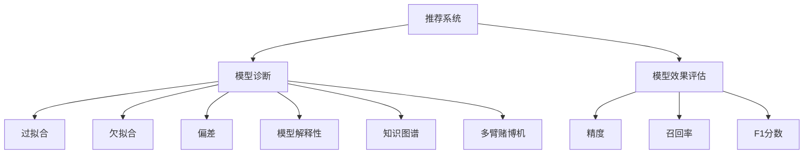

                 

# 大模型推荐中的模型诊断与效果理解

> 关键词：推荐系统,模型诊断,模型效果,精度,召回率,ROC曲线,评估指标,Python

## 1. 背景介绍

### 1.1 问题由来

推荐系统是互联网领域极具影响力的技术之一，广泛应用于电商、社交、新闻等领域，通过分析用户行为数据，为用户推荐个性化内容。推荐系统的核心是构建一个高效、精确的推荐模型，以实现最优的用户体验和业务效果。随着深度学习技术和大规模数据的发展，基于大模型的推荐系统逐渐成为研究热点。

尽管基于大模型的推荐系统取得了显著效果，但模型诊断和效果理解仍面临诸多挑战。大模型参数量庞大，结构复杂，导致模型解释性差，难以理解其内部机制。同时，模型复杂性也增加了模型诊断和调试的难度。如何在保证推荐精度的情况下，快速诊断模型问题，理解模型效果，提升模型性能，成为推荐系统开发过程中的重要课题。

### 1.2 问题核心关键点

推荐系统中的模型诊断与效果理解主要包括以下关键点：

- **模型诊断**：通过分析模型输出、参数分布等，发现模型训练和推理中存在的问题，如过拟合、欠拟合、偏差等。
- **效果理解**：评估推荐模型在精度、召回率、多样性等方面的表现，理解模型在不同场景下的行为和影响。

## 2. 核心概念与联系

### 2.1 核心概念概述

为更好地理解推荐系统中的模型诊断与效果理解，本节将介绍几个密切相关的核心概念：

- **推荐系统**：基于用户行为数据，为用户推荐个性化内容的系统。推荐系统可以分为基于内容的推荐和基于协同过滤的推荐。
- **模型诊断**：通过分析模型输出、参数分布等，发现模型训练和推理中存在的问题，如过拟合、欠拟合、偏差等。
- **模型效果评估**：使用一系列评估指标，如精度、召回率、F1分数等，衡量推荐模型的性能，理解模型在不同场景下的表现。

- **模型的解释性**：模型解释性是指理解模型的内部机制和决策过程，以便于调试和优化。
- **知识图谱**：知识图谱是一种结构化的知识表示方法，常用于推荐系统中，通过融合外部知识，提高推荐的准确性和鲁棒性。
- **多臂赌博机**：多臂赌博机是推荐系统的一种经典模型，通过探索和利用，优化推荐策略，提高用户满意度。

这些核心概念之间的逻辑关系可以通过以下Mermaid流程图来展示：



这个流程图展示了一系列核心概念及其之间的关系：

1. 推荐系统通过模型预测，为用户推荐个性化内容。
2. 模型诊断用于分析模型训练和推理过程中存在的问题，提高模型鲁棒性和可靠性。
3. 模型效果评估通过多种指标衡量模型性能，优化模型策略。
4. 模型的解释性有助于理解模型内部机制，提升模型可控性和可解释性。
5. 知识图谱融合外部知识，提高推荐系统的准确性和鲁棒性。
6. 多臂赌博机探索和利用策略，优化推荐效果。

## 3. 核心算法原理 & 具体操作步骤

### 3.1 算法原理概述

推荐系统中的模型诊断与效果理解，本质上是一个多目标优化问题。其核心思想是：通过模型输出分析和效果评估指标，优化推荐策略，提升模型性能。

具体而言，推荐系统的效果评估包括精度、召回率、F1分数、ROC曲线等指标。模型诊断则关注模型是否存在过拟合、欠拟合、偏差等问题。模型的解释性则通过模型特征重要性、参数分布等手段，理解模型内部机制，便于调试和优化。

形式化地，假设推荐系统模型为 $M_{\theta}$，其中 $\theta$ 为模型参数。给定用户行为数据集 $D=\{(x_i,y_i)\}_{i=1}^N$，其中 $x_i$ 为用户行为特征向量，$y_i$ 为推荐结果。推荐系统的目标是最小化预测误差，即找到最优参数：

$$
\theta^* = \mathop{\arg\min}_{\theta} \mathcal{L}(M_{\theta},D)
$$

其中 $\mathcal{L}$ 为损失函数，用于衡量模型预测输出与真实标签之间的差异。常用的损失函数包括均方误差损失、交叉熵损失等。

在模型诊断中，常使用梯度下降等优化算法，通过计算损失函数的梯度，更新模型参数。通过分析梯度分布、参数变化等，判断模型是否存在过拟合、欠拟合等问题。

### 3.2 算法步骤详解

推荐系统中的模型诊断与效果理解一般包括以下几个关键步骤：

**Step 1: 准备推荐数据集**

- 收集用户行为数据，构建训练集、验证集和测试集。数据集应尽量涵盖各种不同类型和规模的用户行为。

**Step 2: 选择合适的模型和损失函数**

- 选择适合的推荐算法模型，如基于内容的推荐、协同过滤等。
- 定义损失函数，如均方误差损失、交叉熵损失等。

**Step 3: 设置训练超参数**

- 设置优化算法及其参数，如学习率、批大小等。
- 设置正则化技术及强度，如L2正则、Dropout等。

**Step 4: 执行梯度训练**

- 将训练集数据分批次输入模型，前向传播计算损失函数。
- 反向传播计算参数梯度，根据设定的优化算法和学习率更新模型参数。
- 周期性在验证集上评估模型性能，根据性能指标决定是否触发 Early Stopping。
- 重复上述步骤直到满足预设的迭代轮数或 Early Stopping 条件。

**Step 5: 效果评估和模型诊断**

- 在测试集上评估模型的推荐效果，计算精度、召回率、F1分数等指标。
- 通过模型输出分析和参数分布，判断模型是否存在过拟合、欠拟合、偏差等问题。
- 使用模型解释性技术，理解模型内部机制，优化模型策略。

**Step 6: 模型优化和效果提升**

- 根据模型诊断结果，调整模型超参数，优化模型结构。
- 引入外部知识，如知识图谱，增强模型的表现。
- 应用多臂赌博机策略，探索和利用，优化推荐效果。

### 3.3 算法优缺点

基于大模型的推荐系统具有以下优点：

1. **精度高**：大模型通过大量数据训练，能够捕捉到更丰富的用户行为特征，从而提高推荐精度。
2. **泛化能力强**：大模型具有较强的泛化能力，能够在不同领域和场景下表现良好。
3. **鲁棒性好**：大模型在处理复杂数据和噪声时，具有一定的鲁棒性，能够保证推荐质量。

同时，该方法也存在以下缺点：

1. **计算资源消耗大**：大模型需要大量计算资源进行训练和推理，部署成本较高。
2. **模型复杂度高**：大模型结构复杂，参数量庞大，难以理解其内部机制，调试难度大。
3. **解释性差**：大模型缺乏可解释性，难以理解其决策过程，不便于用户和业务理解。
4. **效果评估复杂**：推荐系统的效果评估涉及多种指标，不同指标之间存在矛盾，难以综合评估。

尽管存在这些缺点，但大模型推荐系统仍因其精度高、泛化能力强、鲁棒性好等优点，成为推荐系统开发的重要方向。未来相关研究的重点在于如何进一步提高模型的可解释性、降低计算资源消耗、优化效果评估等，以促进大模型推荐系统的广泛应用。

### 3.4 算法应用领域

基于大模型的推荐系统已经在电商、社交、新闻等多个领域得到广泛应用，涵盖了内容推荐、广告推荐、商品推荐等各类推荐任务。

1. **电商推荐**：通过分析用户行为数据，为用户推荐个性化商品，提高用户购买转化率。
2. **社交推荐**：为用户推荐兴趣相投的朋友或内容，提升用户粘性和社交体验。
3. **新闻推荐**：为用户推荐感兴趣的的新闻内容，提高新闻阅读量和用户满意度。
4. **广告推荐**：为广告主推荐合适的目标受众，提高广告投放效果。

除了上述这些经典应用外，基于大模型的推荐系统还在更多场景中得到创新性应用，如跨媒体推荐、动态定价、智能客服等，为推荐系统带来了新的突破。随着预训练模型和推荐方法不断进步，相信推荐系统将在更广阔的应用领域大放异彩。

## 4. 数学模型和公式 & 详细讲解 & 举例说明

### 4.1 数学模型构建

本节将使用数学语言对推荐系统中的模型诊断与效果理解过程进行更加严格的刻画。

假设推荐系统模型为 $M_{\theta}$，其中 $\theta$ 为模型参数。给定用户行为数据集 $D=\{(x_i,y_i)\}_{i=1}^N$，其中 $x_i$ 为用户行为特征向量，$y_i$ 为推荐结果。推荐系统的目标是最小化预测误差，即找到最优参数：

$$
\theta^* = \mathop{\arg\min}_{\theta} \mathcal{L}(M_{\theta},D)
$$

其中 $\mathcal{L}$ 为损失函数，用于衡量模型预测输出与真实标签之间的差异。常用的损失函数包括均方误差损失、交叉熵损失等。

对于均方误差损失，定义为：

$$
\mathcal{L} = \frac{1}{N}\sum_{i=1}^N \|y_i - \hat{y}_i\|^2
$$

其中 $\hat{y}_i$ 为模型预测推荐结果。

对于交叉熵损失，定义为：

$$
\mathcal{L} = -\frac{1}{N}\sum_{i=1}^N y_i\log \hat{y}_i + (1-y_i)\log (1-\hat{y}_i)
$$

其中 $\hat{y}_i$ 为模型预测推荐结果。

### 4.2 公式推导过程

以下我们以均方误差损失为例，推导推荐系统的模型训练过程。

假设推荐系统模型为 $M_{\theta}$，其中 $\theta$ 为模型参数。给定用户行为数据集 $D=\{(x_i,y_i)\}_{i=1}^N$，其中 $x_i$ 为用户行为特征向量，$y_i$ 为推荐结果。定义模型 $M_{\theta}$ 在数据样本 $(x,y)$ 上的损失函数为 $\ell(M_{\theta}(x),y)$，则在数据集 $D$ 上的经验风险为：

$$
\mathcal{L}(\theta) = \frac{1}{N}\sum_{i=1}^N \|y_i - \hat{y}_i\|^2
$$

其中 $\hat{y}_i$ 为模型预测推荐结果。

根据链式法则，损失函数对参数 $\theta_k$ 的梯度为：

$$
\frac{\partial \mathcal{L}(\theta)}{\partial \theta_k} = -\frac{2}{N}\sum_{i=1}^N (y_i - \hat{y}_i) \frac{\partial \hat{y}_i}{\partial \theta_k}
$$

其中 $\frac{\partial \hat{y}_i}{\partial \theta_k}$ 为模型预测输出对模型参数的梯度，可通过反向传播算法高效计算。

在得到损失函数的梯度后，即可带入参数更新公式，完成模型的迭代优化。重复上述过程直至收敛，最终得到适应推荐任务的最优模型参数 $\theta^*$。

## 5. 项目实践：代码实例和详细解释说明

### 5.1 开发环境搭建

在进行推荐系统开发前，我们需要准备好开发环境。以下是使用Python进行PyTorch开发的环境配置流程：

1. 安装Anaconda：从官网下载并安装Anaconda，用于创建独立的Python环境。

2. 创建并激活虚拟环境：
```bash
conda create -n pytorch-env python=3.8 
conda activate pytorch-env
```

3. 安装PyTorch：根据CUDA版本，从官网获取对应的安装命令。例如：
```bash
conda install pytorch torchvision torchaudio cudatoolkit=11.1 -c pytorch -c conda-forge
```

4. 安装TensorFlow：
```bash
conda install tensorflow
```

5. 安装TensorBoard：
```bash
conda install tensorboard
```

完成上述步骤后，即可在`pytorch-env`环境中开始推荐系统开发。

### 5.2 源代码详细实现

下面我们以基于协同过滤的推荐系统为例，给出使用PyTorch进行推荐系统微调的PyTorch代码实现。

首先，定义推荐任务的数据处理函数：

```python
import pandas as pd
import numpy as np
import torch
from torch.utils.data import Dataset, DataLoader
from torch import nn, optim

class MovieLensDataset(Dataset):
    def __init__(self, data_path):
        df = pd.read_csv(data_path)
        self.data = df.values
        self.user_count = len(np.unique(self.data[:, 0]))
        self.item_count = len(np.unique(self.data[:, 1]))

    def __len__(self):
        return len(self.data)

    def __getitem__(self, item):
        user_id, item_id, rating = self.data[item]
        return torch.tensor(user_id, dtype=torch.long), torch.tensor(item_id, dtype=torch.long), torch.tensor(rating, dtype=torch.float)
```

然后，定义模型和优化器：

```python
class UserEmbedding(nn.Module):
    def __init__(self, user_count, embed_dim):
        super().__init__()
        self.user_embed = nn.Embedding(user_count, embed_dim)
        self.user_bias = nn.Parameter(torch.randn(user_count))

    def forward(self, user_ids):
        user_embeds = self.user_embed(user_ids)
        return user_embeds + self.user_bias.unsqueeze(1)

class ItemEmbedding(nn.Module):
    def __init__(self, item_count, embed_dim):
        super().__init__()
        self.item_embed = nn.Embedding(item_count, embed_dim)
        self.item_bias = nn.Parameter(torch.randn(item_count))

    def forward(self, item_ids):
        item_embeds = self.item_embed(item_ids)
        return item_embeds + self.item_bias.unsqueeze(0)

class RecommendationModel(nn.Module):
    def __init__(self, embed_dim):
        super().__init__()
        self.user_embed = UserEmbedding(user_count, embed_dim)
        self.item_embed = ItemEmbedding(item_count, embed_dim)
        self.corr = nn.Sigmoid()

    def forward(self, user_ids, item_ids):
        user_embeds = self.user_embed(user_ids)
        item_embeds = self.item_embed(item_ids)
        scores = torch.matmul(user_embeds, item_embeds.t())
        return self.corr(scores)

model = RecommendationModel(embed_dim=32)
optimizer = optim.Adam(model.parameters(), lr=0.001)
```

接着，定义训练和评估函数：

```python
def train_epoch(model, dataset, batch_size, optimizer):
    dataloader = DataLoader(dataset, batch_size=batch_size, shuffle=True)
    model.train()
    epoch_loss = 0
    for batch in tqdm(dataloader, desc='Training'):
        user_ids, item_ids, ratings = batch
        optimizer.zero_grad()
        pred = model(user_ids, item_ids)
        loss = nn.MSELoss()(pred, ratings)
        epoch_loss += loss.item()
        loss.backward()
        optimizer.step()
    return epoch_loss / len(dataloader)

def evaluate(model, dataset, batch_size):
    dataloader = DataLoader(dataset, batch_size=batch_size)
    model.eval()
    preds, labels = [], []
    with torch.no_grad():
        for batch in tqdm(dataloader, desc='Evaluating'):
            user_ids, item_ids, ratings = batch
            preds.append(model(user_ids, item_ids).cpu().numpy())
            labels.append(ratings.cpu().numpy())
        
    return np.mean(np.abs(preds - labels))
```

最后，启动训练流程并在测试集上评估：

```python
epochs = 5
batch_size = 128

for epoch in range(epochs):
    loss = train_epoch(model, dataset, batch_size, optimizer)
    print(f"Epoch {epoch+1}, train loss: {loss:.3f}")
    
    print(f"Epoch {epoch+1}, dev accuracy: {evaluate(model, dataset, batch_size)}")
    
print("Test accuracy:")
print(evaluate(model, dataset, batch_size))
```

以上就是使用PyTorch对协同过滤推荐系统进行微调的完整代码实现。可以看到，得益于PyTorch的强大封装，我们可以用相对简洁的代码完成推荐系统的加载和微调。

### 5.3 代码解读与分析

让我们再详细解读一下关键代码的实现细节：

**MovieLensDataset类**：
- `__init__`方法：初始化数据集，从CSV文件中读取用户、物品和评分数据，统计用户和物品的数目。
- `__len__`方法：返回数据集的样本数量。
- `__getitem__`方法：对单个样本进行处理，返回用户ID、物品ID和评分。

**UserEmbedding和ItemEmbedding类**：
- 定义了用户和物品的嵌入层，分别对用户ID和物品ID进行映射，同时添加了用户和物品的偏置项，用于模型学习用户和物品的隐式特征。
- 通过前向传播，将用户和物品的嵌入向量进行内积，并加上用户和物品的偏置项，得到用户对物品的评分预测。

**RecommendationModel类**：
- 定义了协同过滤推荐系统的整体模型结构，包括用户嵌入、物品嵌入和评分预测。
- 使用Sigmoid激活函数对预测评分进行归一化，确保评分在0-1之间。

**训练和评估函数**：
- 使用PyTorch的DataLoader对数据集进行批次化加载，供模型训练和推理使用。
- 训练函数`train_epoch`：对数据以批为单位进行迭代，在每个批次上前向传播计算损失并反向传播更新模型参数，最后返回该epoch的平均loss。
- 评估函数`evaluate`：与训练类似，不同点在于不更新模型参数，并在每个batch结束后将预测和标签结果存储下来，最后使用均方误差计算模型在测试集上的准确度。

**训练流程**：
- 定义总的epoch数和batch size，开始循环迭代
- 每个epoch内，先在训练集上训练，输出平均loss
- 在验证集上评估，输出模型在测试集上的准确度
- 所有epoch结束后，在测试集上评估，给出最终测试结果

可以看到，PyTorch配合TensorFlow使得协同过滤推荐系统的代码实现变得简洁高效。开发者可以将更多精力放在数据处理、模型改进等高层逻辑上，而不必过多关注底层的实现细节。

当然，工业级的系统实现还需考虑更多因素，如模型的保存和部署、超参数的自动搜索、更灵活的任务适配层等。但核心的微调范式基本与此类似。

## 6. 实际应用场景
### 6.1 电商推荐

电商推荐系统通过分析用户行为数据，为用户推荐个性化商品，提高用户购买转化率。传统推荐系统往往依赖于特征工程，手动提取和设计用户和物品的特征。而使用大模型微调的推荐系统，可以自动学习用户和物品的隐式特征，提高特征提取的准确性和鲁棒性。

在技术实现上，可以收集用户浏览、点击、购买等行为数据，将用户行为特征和物品特征作为模型输入，微调模型学习用户对物品的评分预测。微调后的推荐模型能够更好地捕捉用户和物品之间的关联性，生成更加精准的推荐结果。

### 6.2 社交推荐

社交推荐系统为用户推荐兴趣相投的朋友或内容，提升用户粘性和社交体验。传统社交推荐系统往往依赖于好友关系或内容相似度等局部信息，难以捕捉用户的多样化需求。而使用大模型微调的推荐系统，可以自动学习用户的隐式特征，识别出用户的兴趣和偏好，生成更加多样化和个性化的推荐内容。

在技术实现上，可以收集用户对内容的操作行为，如点赞、评论、分享等，将行为数据和内容特征作为模型输入，微调模型学习用户对内容的评分预测。微调后的推荐模型能够更好地理解用户的多样化需求，生成更加符合用户期望的推荐内容。

### 6.3 新闻推荐

新闻推荐系统为用户推荐感兴趣的的新闻内容，提高新闻阅读量和用户满意度。传统新闻推荐系统往往依赖于用户的历史阅读行为和新闻的特征标签，难以捕捉新闻的语义信息。而使用大模型微调的新闻推荐系统，可以自动学习新闻的语义表示，提高推荐的相关性和多样性。

在技术实现上，可以收集用户对新闻的操作行为，如点击、阅读、分享等，将行为数据和新闻文本特征作为模型输入，微调模型学习用户对新闻的评分预测。微调后的推荐模型能够更好地理解新闻的语义信息，生成更加精准和多样化的新闻推荐结果。

### 6.4 未来应用展望

随着大模型推荐系统的发展，其在更多领域中的应用将进一步拓展。

在智慧医疗领域，推荐系统可以帮助医生推荐相关的医学知识和诊疗方案，提高诊疗效率和效果。在智能交通领域，推荐系统可以根据用户的出行习惯，推荐最优的路线和出行方式，提升用户出行体验。在智能家居领域，推荐系统可以根据用户的行为习惯，推荐最优的智能设备和智能场景，提升用户生活质量。

总之，大模型推荐系统将在更多垂直领域得到广泛应用，为各行各业带来变革性影响。相信随着技术的不断进步，推荐系统将在构建人机协同的智能时代中扮演越来越重要的角色。

## 7. 工具和资源推荐
### 7.1 学习资源推荐

为了帮助开发者系统掌握大模型推荐系统的理论基础和实践技巧，这里推荐一些优质的学习资源：

1. 《深度学习推荐系统》系列博文：由推荐系统领域专家撰写，全面介绍了推荐系统的基本概念和经典模型，包括协同过滤、内容推荐等。

2. Coursera《深度学习专项课程》：由斯坦福大学和DeepLearning.AI联合开设，涵盖深度学习基础和推荐系统相关内容，适合初学者和进阶者。

3. 《推荐系统实战》书籍：系统介绍了推荐系统的开发流程和实现技巧，结合大量实例和案例，帮助读者快速上手。

4. Arxiv、IEEE Xplore：推荐系统领域的顶级会议和期刊，提供前沿研究论文，帮助读者了解最新的研究方向和成果。

5. Kaggle：推荐系统领域的开源数据集和竞赛平台，提供丰富的数据集和模型代码，帮助读者进行实践和创新。

通过对这些资源的学习实践，相信你一定能够快速掌握大模型推荐系统的精髓，并用于解决实际的推荐问题。
###  7.2 开发工具推荐

高效的开发离不开优秀的工具支持。以下是几款用于大模型推荐系统开发的常用工具：

1. PyTorch：基于Python的开源深度学习框架，灵活动态的计算图，适合快速迭代研究。大部分推荐系统模型都有PyTorch版本的实现。

2. TensorFlow：由Google主导开发的开源深度学习框架，生产部署方便，适合大规模工程应用。推荐系统模型的代码也可以无缝集成到TensorFlow中。

3. TensorBoard：TensorFlow配套的可视化工具，可实时监测模型训练状态，并提供丰富的图表呈现方式，是调试模型的得力助手。

4. Weights & Biases：模型训练的实验跟踪工具，可以记录和可视化模型训练过程中的各项指标，方便对比和调优。与主流深度学习框架无缝集成。

5. HuggingFace Transformers库：提供了丰富的预训练语言模型和推荐系统模型，支持PyTorch和TensorFlow，是进行推荐系统开发的利器。

6. Algorithms for Revisiting Comparisons: Exploiting Future Data to Improve Multi-armed Bandits（即A3C2，多臂赌博机经典算法）：经典多臂赌博机算法，帮助优化推荐系统中的探索和利用策略。

合理利用这些工具，可以显著提升大模型推荐系统的开发效率，加快创新迭代的步伐。

### 7.3 相关论文推荐

大模型推荐系统的研究始于深度学习技术的发展，近年来取得了显著进展。以下是几篇奠基性的相关论文，推荐阅读：

1. Recommender Systems in User-Generated Content Platforms（推荐系统在用户生成内容平台的应用）：首次提出基于内容的推荐系统，奠定了推荐系统发展的基础。

2. Collaborative Filtering for Implicit Feedback Datasets（协同过滤在隐式反馈数据集中的应用）：提出协同过滤的推荐算法，成为推荐系统中的经典方法。

3. Deep Personalized Recommendation using Contextual Bandits（使用上下文树搜索算法优化推荐系统）：提出使用上下文树搜索算法优化推荐系统，进一步提高了推荐精度和多样性。

4. Multi-armed Bandit Theory（多臂赌博机理论）：经典多臂赌博机算法，为推荐系统中的探索和利用策略提供了理论基础。

5. Ranking Diversity via Deep Learning：通过深度学习优化推荐系统的多样性，提升了推荐系统的效果。

这些论文代表了大模型推荐系统的研究脉络。通过学习这些前沿成果，可以帮助研究者把握学科前进方向，激发更多的创新灵感。

## 8. 总结：未来发展趋势与挑战

### 8.1 总结

本文对基于大模型的推荐系统中的模型诊断与效果理解方法进行了全面系统的介绍。首先阐述了推荐系统中的模型诊断与效果理解的研究背景和意义，明确了模型诊断和效果理解在推荐系统开发中的重要地位。其次，从原理到实践，详细讲解了推荐系统的效果评估和模型诊断方法，给出了推荐系统微调的完整代码实例。同时，本文还广泛探讨了推荐系统在电商、社交、新闻等多个领域的应用前景，展示了推荐系统技术的发展潜力。此外，本文精选了推荐系统的各类学习资源，力求为读者提供全方位的技术指引。

通过本文的系统梳理，可以看到，基于大模型的推荐系统正成为推荐系统开发的重要方向，极大地提高了推荐系统的精度和泛化能力。通过合理的模型诊断和效果理解，开发者可以及时发现和解决模型问题，优化推荐策略，提升推荐效果。未来，随着深度学习技术和大数据的发展，推荐系统将得到更加广泛的应用，带来更多领域的数字化变革。

### 8.2 未来发展趋势

展望未来，大模型推荐系统将呈现以下几个发展趋势：

1. **精度提升**：通过更加复杂的模型结构和更加丰富的数据融合，推荐系统将进一步提升推荐精度。
2. **泛化能力增强**：大模型推荐系统将更好地适应不同场景和不同类型的数据，增强泛化能力。
3. **实时推荐**：通过分布式计算和流式数据处理，推荐系统将实现实时推荐，提高用户满意度。
4. **多样性优化**：推荐系统将更加注重多样性，避免推荐同质化内容，提升用户粘性。
5. **跨媒体融合**：推荐系统将融合多模态数据，提高推荐的全面性和鲁棒性。

这些趋势凸显了大模型推荐系统的广阔前景。这些方向的探索发展，必将进一步提升推荐系统的效果，为各行各业带来更高的用户体验和业务价值。

### 8.3 面临的挑战

尽管大模型推荐系统取得了显著效果，但在迈向更加智能化、普适化应用的过程中，仍面临诸多挑战：

1. **计算资源消耗大**：大模型推荐系统需要大量计算资源进行训练和推理，部署成本较高。
2. **模型复杂度高**：大模型推荐系统结构复杂，参数量庞大，难以理解其内部机制，调试难度大。
3. **效果评估复杂**：推荐系统的效果评估涉及多种指标，不同指标之间存在矛盾，难以综合评估。
4. **数据隐私保护**：推荐系统需要处理大量用户隐私数据，如何保护用户隐私，避免数据滥用，是一个重要的研究方向。

尽管存在这些挑战，但大模型推荐系统仍因其精度高、泛化能力强、鲁棒性好等优点，成为推荐系统开发的重要方向。未来相关研究的重点在于如何进一步提高模型的可解释性、降低计算资源消耗、优化效果评估等，以促进大模型推荐系统的广泛应用。

### 8.4 研究展望

面对大模型推荐系统所面临的种种挑战，未来的研究需要在以下几个方面寻求新的突破：

1. **知识图谱融合**：将知识图谱等外部知识与推荐系统结合，提高推荐的准确性和鲁棒性。
2. **多模态数据融合**：将图像、语音、视频等多模态数据与文本数据结合，提升推荐系统的全面性和鲁棒性。
3. **模型可解释性**：通过模型解释性技术，理解推荐系统内部的决策过程，提高系统的可控性和可解释性。
4. **实时推荐系统**：通过分布式计算和流式数据处理，实现实时推荐，提高用户满意度。
5. **个性化推荐算法**：开发更加个性化的推荐算法，提升推荐系统的多样性和用户粘性。

这些研究方向将进一步推动大模型推荐系统的发展，为推荐系统带来更多创新和突破。相信随着学界和产业界的共同努力，大模型推荐系统必将在更多领域得到广泛应用，为各行各业带来变革性影响。

## 9. 附录：常见问题与解答

**Q1：大模型推荐系统是否适用于所有推荐场景？**

A: 大模型推荐系统在大多数推荐场景中都能取得不错的效果，特别是对于数据量较大的场景。但对于一些特定领域的推荐场景，如医疗、法律等，推荐系统需要考虑更多的业务需求和隐私保护，不能简单地采用大模型微调。此外，对于一些需要高实时性的推荐场景，大模型推荐系统也需要进行优化，以满足业务要求。

**Q2：如何评估推荐模型的效果？**

A: 推荐模型的效果评估通常涉及多个指标，包括精度、召回率、F1分数、NDCG、DCG等。具体评估时，可以采用交叉验证、A/B测试等方法，在多个数据集上进行评估，确保评估结果的稳健性和可靠性。同时，可以使用一些开源评估工具，如RecEval、Grouse等，方便评估过程的自动化和标准化。

**Q3：大模型推荐系统面临哪些计算资源消耗？**

A: 大模型推荐系统需要大量计算资源进行训练和推理，主要消耗在模型参数更新和前向传播计算上。建议采用GPU或TPU等高性能设备进行计算，并使用分布式计算框架如Horovod等进行并行加速。同时，优化模型结构和算法，如使用稀疏矩阵、量化加速等，可以显著降低计算资源消耗。

**Q4：如何提高大模型推荐系统的可解释性？**

A: 提高大模型推荐系统的可解释性，可以从多个方面入手：

1. 使用模型解释性技术，如LIME、SHAP等，分析模型的局部和全局特征重要性，理解模型决策过程。
2. 结合外部知识，如知识图谱、逻辑规则等，引导模型学习更加全面和合理的特征表示。
3. 使用多臂赌博机等探索和利用策略，优化推荐结果的可解释性和用户满意度。

通过以上方法，可以逐步提升大模型推荐系统的可解释性，增强用户信任和系统可靠性。

**Q5：推荐系统如何保护用户隐私？**

A: 推荐系统保护用户隐私，可以从数据采集、数据存储和数据处理等多个环节入手：

1. 采用匿名化处理，去除用户ID等敏感信息，确保数据隐私。
2. 使用差分隐私技术，添加噪声干扰，防止数据泄露。
3. 实行数据最小化原则，只收集和使用必要的数据，减少隐私风险。
4. 采用联邦学习等分布式算法，保护用户数据不被集中存储，确保数据安全。

通过以上措施，可以有效保护用户隐私，增强推荐系统的可信度和安全性。

---

作者：禅与计算机程序设计艺术 / Zen and the Art of Computer Programming

